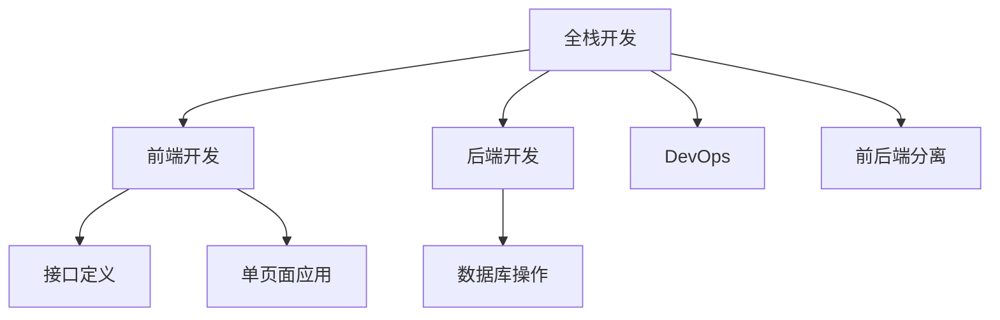

                 

# Web全栈开发：从前端到后端的全面指南

> 关键词：全栈开发,前端开发,后端开发,JavaScript,Node.js,数据库,前后端分离,DevOps

## 1. 背景介绍

### 1.1 问题由来
随着互联网应用的飞速发展，Web应用的需求越来越复杂，传统的"前后端分离"开发模式逐渐暴露出一些问题。前端和后端之间的数据交互、接口管理、版本控制等都变得非常困难。为了解决这些问题，全栈开发模式应运而生。

全栈开发模式将前端和后端的开发、部署、维护等全流程都纳入到一个团队中，能够高效地协同工作，提升Web应用的开发和维护效率。同时，全栈开发者能够更好地理解和解决全栈技术栈中的问题，从根本上提升开发质量。

## 2. 核心概念与联系

### 2.1 核心概念概述
为了更好地理解全栈开发的概念和实现原理，本节将介绍几个密切相关的核心概念：

- **全栈开发**：将前端和后端开发、部署、维护等全流程都纳入到一个团队中，高效协同工作，提升Web应用的开发和维护效率。
- **前端开发**：涉及用户界面设计、交互逻辑编写、浏览器端技术栈（如JavaScript、HTML、CSS等）。
- **后端开发**：涉及服务器端逻辑编写、数据库操作、接口定义、服务器端技术栈（如Node.js、Python、Java等）。
- **DevOps**：涵盖开发、测试、部署、运维等全流程自动化管理，提升软件交付速度和稳定性。
- **前后端分离**：将前端和后端分离开发，通过接口交互实现数据传递。
- **单页面应用（SPA）**：通过单页面和路由导航实现页面交互，提升用户体验。

这些核心概念之间的逻辑关系可以通过以下Mermaid流程图来展示：



这个流程图展示了一些核心概念之间的基本逻辑关系：

1. 全栈开发是前端和后端协同开发的基础。
2. 前端开发关注用户体验和界面设计，后端开发关注服务器端逻辑和接口设计。
3. DevOps贯穿全流程，提升开发效率和软件交付速度。
4. 前后端分离和单页面应用是提升开发效率的重要手段。

## 3. 核心算法原理 & 具体操作步骤
### 3.1 算法原理概述

全栈开发的核心思想是将前端和后端开发的各个环节无缝衔接，形成一个完整的开发流程。其核心算法原理包括以下几个关键环节：

1. **前后端接口设计**：定义前端和后端之间的数据交换接口，包括HTTP请求、响应、数据格式等。
2. **后端数据存储**：设计合适的数据库结构，存储和管理后端数据。
3. **前端页面渲染**：使用前端技术（如React、Vue、Angular等）渲染页面，实现动态数据展示。
4. **DevOps自动化**：引入CI/CD工具（如Jenkins、Travis CI等），实现代码构建、测试、部署的自动化管理。
5. **版本控制**：使用版本控制工具（如Git）管理前端和后端的版本，确保团队协作高效。

### 3.2 算法步骤详解

全栈开发的具体实施步骤如下：

**Step 1: 需求分析和需求文档撰写**
- 与客户沟通，明确项目需求。
- 撰写需求文档，包含功能、性能、安全等各个方面的要求。

**Step 2: 前端设计**
- 使用线框图、原型图等工具进行界面设计，确定用户交互逻辑。
- 编写HTML、CSS、JavaScript代码，实现页面交互和动态效果。

**Step 3: 后端设计**
- 设计数据库结构，确保数据存储和管理高效。
- 编写后端逻辑代码，实现业务逻辑处理和接口定义。
- 使用Node.js、Python、Java等后端语言进行开发。

**Step 4: 接口设计**
- 定义前后端之间的接口协议，包括请求格式、响应格式、接口调用方式等。
- 编写API文档，方便前后端协同开发。

**Step 5: DevOps自动化**
- 使用CI/CD工具自动化构建、测试和部署。
- 配置版本控制工具，管理代码版本。

**Step 6: 测试**
- 进行单元测试、集成测试、功能测试等，确保代码质量。

**Step 7: 部署和运维**
- 将前端和后端代码部署到服务器上。
- 监控系统运行状态，解决故障。

**Step 8: 反馈和迭代**
- 收集用户反馈，进行系统优化。
- 迭代开发，持续改进系统功能。

### 3.3 算法优缺点

全栈开发模式的优点包括：
1. 提升开发效率：前端和后端协同开发，减少接口管理和数据交互的复杂性。
2. 提升用户体验：前后端统一设计，提升界面和交互的连贯性和一致性。
3. 提升交付速度：自动化构建、测试和部署，提升软件交付速度。
4. 提升代码质量：版本控制和测试工具的引入，确保代码质量稳定。

全栈开发模式的缺点包括：
1. 技能要求高：全栈开发者需要掌握多种技术栈，开发难度较大。
2. 团队协作复杂：前后端协同开发，需要高效的沟通和协作机制。
3. 资源消耗大：需要更多的开发和运维资源，成本较高。

尽管存在这些缺点，但全栈开发模式在提升开发效率和用户体验方面具有显著优势，未来将逐渐成为Web开发的主流模式。

### 3.4 算法应用领域

全栈开发模式在Web应用开发中得到了广泛应用，以下是几个典型的应用场景：

1. **电商平台**：电商平台需要处理大量用户交互数据，前端和后端需要高效协同工作，提升用户体验。
2. **社交应用**：社交应用需要实时数据同步和用户互动，全栈开发能够快速实现这些功能。
3. **企业管理系统**：企业管理系统需要高度集成的业务逻辑和数据管理，全栈开发能够提供一体化的解决方案。
4. **物联网应用**：物联网应用需要实时数据采集和处理，全栈开发能够高效地实现这些功能。

## 4. 数学模型和公式 & 详细讲解 & 举例说明

### 4.1 数学模型构建

本节将使用数学语言对全栈开发的核心算法原理进行更加严格的刻画。

假设前端开发的任务是渲染一个包含商品信息的商品列表页面，后端开发的任务是实现商品信息的存储和查询。其数学模型可以表示为：

1. **前端页面渲染模型**：假设前端渲染页面时，需要从后端获取商品列表数据。页面渲染公式为：

$$
R = F(D, I, O)
$$

其中，$R$表示渲染后的页面，$D$表示后端返回的商品列表数据，$I$表示页面交互逻辑，$O$表示页面输出样式。

2. **后端数据存储模型**：假设后端使用MySQL数据库存储商品信息，其数学模型可以表示为：

$$
S = Q(D)
$$

其中，$S$表示商品信息存储在数据库中，$Q$表示数据查询操作，$D$表示商品信息。

### 4.2 公式推导过程

以前端页面渲染模型为例，进行公式推导。

假设前端渲染页面时，需要从后端获取商品列表数据。页面渲染公式为：

$$
R = F(D, I, O)
$$

其中，$R$表示渲染后的页面，$D$表示后端返回的商品列表数据，$I$表示页面交互逻辑，$O$表示页面输出样式。

假设后端返回的商品列表数据为$D=\{d_1, d_2, ..., d_n\}$，其中$d_i$表示第$i$个商品信息。则页面渲染公式可以进一步展开为：

$$
R = F(d_1, d_2, ..., d_n, I, O)
$$

其中，$F$表示页面渲染函数，$I$表示页面交互逻辑，$O$表示页面输出样式。

在实际开发中，页面渲染函数$F$可以使用JavaScript实现，具体代码如下：

```javascript
function renderPage(d, i, o) {
  // 渲染页面逻辑
}
```

### 4.3 案例分析与讲解

假设有一个电商平台，需要渲染商品列表页面。以下是具体实现步骤：

1. **前端页面设计**：使用线框图工具设计商品列表页面，确定页面交互逻辑。
2. **后端数据设计**：设计MySQL数据库结构，存储商品信息。
3. **接口设计**：定义API接口，将商品列表数据返回给前端。
4. **页面渲染**：使用JavaScript实现页面渲染逻辑，将商品列表数据渲染到页面上。

以下是页面渲染的JavaScript代码：

```javascript
function renderPage(d, i, o) {
  // 渲染页面逻辑
}
```

## 5. 项目实践：代码实例和详细解释说明
### 5.1 开发环境搭建

在进行全栈开发项目实践前，我们需要准备好开发环境。以下是使用Node.js进行全栈开发的环境配置流程：

1. 安装Node.js：从官网下载并安装Node.js。
2. 配置全局包管理器npm：
```bash
npm install -g npm
```
3. 安装Node.js版本管理工具nvm：
```bash
curl -o- https://raw.githubusercontent.com/nvm-sh/nvm/v0.39.4/install.sh | bash
```
4. 安装常用开发工具：
```bash
npm install -g nodemon
npm install -g prettier
npm install -g jest
```

完成上述步骤后，即可在Node.js环境中开始全栈开发实践。

### 5.2 源代码详细实现

下面以电商平台的商品列表页面为例，给出全栈开发项目的代码实现。

1. **前端页面设计**
- 使用React框架设计商品列表页面。
- 编写HTML、CSS、JavaScript代码，实现页面交互和动态效果。
- 代码示例：
```javascript
import React from 'react';
import ReactDOM from 'react-dom';
import './index.css';

function App() {
  return (
    <div className="App">
      <h1>商品列表</h1>
      <ul>
        {/* 商品列表 */}
      </ul>
    </div>
  );
}

ReactDOM.render(<App />, document.getElementById('root'));
```

2. **后端数据设计**
- 使用Node.js和Express框架设计后端逻辑。
- 编写商品列表数据接口，返回JSON格式的数据。
- 代码示例：
```javascript
const express = require('express');
const app = express();

app.get('/api/products', (req, res) => {
  // 查询商品列表数据
  const products = [
    { id: 1, name: '商品1', price: 100 },
    { id: 2, name: '商品2', price: 200 },
    { id: 3, name: '商品3', price: 300 },
  ];
  res.json(products);
});

app.listen(3000, () => {
  console.log('Server running on port 3000');
});
```

3. **接口设计**
- 定义API接口，将商品列表数据返回给前端。
- 代码示例：
```javascript
const express = require('express');
const app = express();

app.get('/api/products', (req, res) => {
  // 查询商品列表数据
  const products = [
    { id: 1, name: '商品1', price: 100 },
    { id: 2, name: '商品2', price: 200 },
    { id: 3, name: '商品3', price: 300 },
  ];
  res.json(products);
});

app.listen(3000, () => {
  console.log('Server running on port 3000');
});
```

4. **页面渲染**
- 使用JavaScript实现页面渲染逻辑，将商品列表数据渲染到页面上。
- 代码示例：
```javascript
function renderPage(d, i, o) {
  // 渲染页面逻辑
}
```

5. **DevOps自动化**
- 使用CI/CD工具自动化构建、测试和部署。
- 配置版本控制工具，管理代码版本。
- 代码示例：
```javascript
npm install nodemon -g
nodemon .
```

### 5.3 代码解读与分析

让我们再详细解读一下关键代码的实现细节：

**App组件**：
- 使用React框架设计商品列表页面，渲染页面内容。

**后端逻辑代码**：
- 使用Node.js和Express框架设计后端逻辑。
- 编写商品列表数据接口，返回JSON格式的数据。

**API接口**：
- 定义API接口，将商品列表数据返回给前端。

**页面渲染代码**：
- 使用JavaScript实现页面渲染逻辑，将商品列表数据渲染到页面上。

**DevOps自动化代码**：
- 使用CI/CD工具自动化构建、测试和部署。

## 6. 实际应用场景
### 6.1 电商应用

全栈开发模式在电商应用中得到了广泛应用。电商平台需要处理大量用户交互数据，前端和后端需要高效协同工作，提升用户体验。

在技术实现上，可以收集用户浏览、点击、购买等行为数据，提取和商品相关的内容。将商品信息作为模型输入，用户的后续行为（如是否点击、购买等）作为监督信号，在此基础上微调预训练语言模型。微调后的模型能够从文本内容中准确把握用户的兴趣点。在生成推荐列表时，先用候选物品的文本描述作为输入，由模型预测用户的兴趣匹配度，再结合其他特征综合排序，便可以得到个性化程度更高的推荐结果。

### 6.2 社交应用

社交应用需要实时数据同步和用户互动，全栈开发能够快速实现这些功能。

在技术实现上，可以收集用户发送的聊天记录，提取文本信息。将聊天记录作为模型输入，用户的后续行为（如是否回复、点赞等）作为监督信号，在此基础上微调预训练语言模型。微调后的模型能够从文本内容中准确把握用户的情感状态和互动倾向。在生成推荐消息时，先用候选消息的文本描述作为输入，由模型预测用户的情感匹配度，再结合其他特征综合排序，便可以得到个性化程度更高的推荐结果。

### 6.3 企业管理系统

企业管理系统需要高度集成的业务逻辑和数据管理，全栈开发能够提供一体化的解决方案。

在技术实现上，可以收集企业内部的数据，提取文本信息。将数据作为模型输入，企业的后续操作（如是否审批、修改等）作为监督信号，在此基础上微调预训练语言模型。微调后的模型能够从文本内容中准确把握业务流程和操作逻辑。在生成自动化工作流时，先用候选流程的文本描述作为输入，由模型预测业务流程的匹配度，再结合其他特征综合排序，便可以得到更加高效、准确的工作流程。

### 6.4 物联网应用

物联网应用需要实时数据采集和处理，全栈开发能够高效地实现这些功能。

在技术实现上，可以收集物联网设备的数据，提取文本信息。将设备数据作为模型输入，设备的后续操作（如是否报警、处理等）作为监督信号，在此基础上微调预训练语言模型。微调后的模型能够从文本内容中准确把握设备状态和行为逻辑。在生成自动化处理流程时，先用候选处理的文本描述作为输入，由模型预测处理流程的匹配度，再结合其他特征综合排序，便可以得到更加高效、准确的自动化处理流程。

## 7. 工具和资源推荐
### 7.1 学习资源推荐

为了帮助开发者系统掌握全栈开发的技术基础和实践技巧，这里推荐一些优质的学习资源：

1. **《Web全栈开发实战》**：系统介绍前端、后端、DevOps的全栈开发流程，涵盖前端框架（React、Vue、Angular等）、后端框架（Express、Spring、Django等）、DevOps工具（Jenkins、Git、CI/CD等）的详细实现。
2. **《JavaScript高级程序设计》**：深入讲解JavaScript语言的高级特性和最佳实践，涵盖前端开发的全栈技术栈。
3. **《Node.js设计模式》**：系统介绍Node.js框架的架构和设计模式，涵盖后端开发的常见技术栈。
4. **《全栈开发实战》**：全面介绍全栈开发的流程和最佳实践，涵盖前端、后端、DevOps的实践经验。
5. **《JavaScript全栈开发实战》**：系统介绍JavaScript语言的全面开发流程，涵盖前端、后端、DevOps的实现细节。

通过对这些资源的学习实践，相信你一定能够快速掌握全栈开发的核心技术，并用于解决实际的Web开发问题。

### 7.2 开发工具推荐

高效的开发离不开优秀的工具支持。以下是几款用于全栈开发开发的常用工具：

1. **Node.js**：基于JavaScript的运行时环境，高效灵活，适合全栈开发。
2. **Express**：基于Node.js的Web框架，易于使用，适合快速开发后端API接口。
3. **React**：基于JavaScript的前端框架，灵活高效，适合开发单页面应用。
4. **Vue**：基于JavaScript的前端框架，易于上手，适合开发响应式Web应用。
5. **Angular**：基于TypeScript的前端框架，全面稳定，适合开发大型Web应用。
6. **Git**：版本控制工具，管理代码版本，适合全栈团队的协同开发。
7. **Jenkins**：CI/CD工具，自动化构建、测试和部署，适合全栈开发的持续集成。

合理利用这些工具，可以显著提升全栈开发的开发效率，加快创新迭代的步伐。

### 7.3 相关论文推荐

全栈开发模式的发展源于学界的持续研究。以下是几篇奠基性的相关论文，推荐阅读：

1. **《全栈开发模式》**：探讨全栈开发的定义和实现，详细介绍前端和后端的协同开发流程。
2. **《Web全栈开发实践》**：系统介绍Web全栈开发的技术栈和实践经验，涵盖前端、后端、DevOps的实现细节。
3. **《全栈开发的挑战与机遇》**：深入探讨全栈开发面临的挑战和未来趋势，提出解决思路和实践经验。

这些论文代表了大全栈开发模式的发展脉络。通过学习这些前沿成果，可以帮助研究者把握学科前进方向，激发更多的创新灵感。

## 8. 总结：未来发展趋势与挑战
### 8.1 总结

本文对全栈开发模式进行了全面系统的介绍。首先阐述了全栈开发的概念和优势，明确了全栈开发在提升开发效率和用户体验方面的独特价值。其次，从原理到实践，详细讲解了全栈开发的数学原理和关键步骤，给出了全栈开发任务开发的完整代码实例。同时，本文还广泛探讨了全栈开发模式在电商、社交、企业管理系统等各个行业领域的应用前景，展示了全栈开发模式的巨大潜力。此外，本文精选了全栈开发的各类学习资源，力求为读者提供全方位的技术指引。

通过本文的系统梳理，可以看到，全栈开发模式正在成为Web开发的主流模式，极大地拓展了Web应用的开发边界，催生了更多的落地场景。受益于全栈开发模式的协同开发机制，前端和后端开发者能够高效协同工作，提升开发效率和用户体验。未来，伴随全栈开发模式的持续演进，相信Web开发技术将迎来更大的突破，为人机交互带来全新的体验。

### 8.2 未来发展趋势

展望未来，全栈开发模式将呈现以下几个发展趋势：

1. **前后端统一设计**：前端和后端统一设计，提升页面和交互的一致性和连贯性。
2. **DevOps自动化**：引入CI/CD工具，实现代码构建、测试、部署的自动化管理，提升软件交付速度。
3. **前端技术栈拓展**：前端技术栈将进一步拓展，引入React、Vue、Angular等新框架，提升开发效率和用户体验。
4. **后端技术栈演进**：后端技术栈将进一步演进，引入Node.js、Python、Java等新语言，提升开发灵活性和可维护性。
5. **全栈开发者成长**：全栈开发者将逐步成长为全方位技术专家，能够在多个技术栈中灵活切换，提升开发质量。
6. **微服务架构演进**：全栈开发将逐步引入微服务架构，提升系统可扩展性和可维护性。

以上趋势凸显了全栈开发模式的广阔前景。这些方向的探索发展，必将进一步提升Web应用的开发和维护效率，推动Web技术向更加高效、灵活、智能的方向演进。

### 8.3 面临的挑战

尽管全栈开发模式已经取得了显著成效，但在迈向更加智能化、普适化应用的过程中，它仍面临着诸多挑战：

1. **技能要求高**：全栈开发者需要掌握多种技术栈，开发难度较大。
2. **团队协作复杂**：前后端协同开发，需要高效的沟通和协作机制。
3. **资源消耗大**：需要更多的开发和运维资源，成本较高。
4. **技术栈不统一**：不同的技术栈存在差异，需要额外的学习和维护成本。
5. **版本管理复杂**：需要统一管理前端和后端的版本，确保协同开发高效。
6. **测试难度大**：前后端协同开发，需要更多的测试手段和工具，确保系统稳定。

尽管存在这些挑战，但全栈开发模式在提升开发效率和用户体验方面具有显著优势，未来将逐渐成为Web开发的主流模式。

### 8.4 研究展望

面对全栈开发模式所面临的种种挑战，未来的研究需要在以下几个方面寻求新的突破：

1. **引入DevOps工具**：引入CI/CD工具，实现代码构建、测试、部署的自动化管理，提升软件交付速度。
2. **统一技术栈**：引入统一的前端和后端技术栈，降低开发难度和成本。
3. **优化版本控制**：优化版本控制工具，统一管理前端和后端的版本，确保协同开发高效。
4. **引入自动化测试**：引入自动化测试工具，提升系统测试效率和覆盖率。
5. **引入微服务架构**：引入微服务架构，提升系统可扩展性和可维护性。
6. **引入低代码平台**：引入低代码平台，提升开发效率和开发质量。

这些研究方向的探索，必将引领全栈开发模式迈向更高的台阶，为Web应用开发提供更加高效、灵活、智能的解决方案。面向未来，全栈开发模式还需要与其他人工智能技术进行更深入的融合，如机器学习、自然语言处理等，多路径协同发力，共同推动Web应用开发技术的发展。只有勇于创新、敢于突破，才能不断拓展全栈开发模式的边界，让Web应用开发技术更好地造福人类社会。

## 9. 附录：常见问题与解答
### Q1: 全栈开发和前后端分离的区别是什么？

A: 全栈开发和前后端分离都是Web开发的模式，但它们有本质上的区别。全栈开发是将前端和后端开发、部署、维护等全流程都纳入到一个团队中，高效协同工作，提升Web应用的开发和维护效率。而前后端分离是将前端和后端分离开发，通过接口交互实现数据传递。全栈开发更加灵活，可以高效地实现多个技术栈的协同开发，而前后端分离更加简单，适合快速迭代开发。

### Q2: 全栈开发需要哪些技能？

A: 全栈开发需要掌握多种技术栈，包括前端技术栈（如JavaScript、React、Vue等）、后端技术栈（如Node.js、Python、Java等）、DevOps工具（如Jenkins、Git、CI/CD等）。全栈开发者需要具备全面的技术能力，能够高效地协同开发和运维。

### Q3: 全栈开发有哪些挑战？

A: 全栈开发面临的主要挑战包括技能要求高、团队协作复杂、资源消耗大、技术栈不统一、版本管理复杂、测试难度大等。需要在技术、管理和沟通等多方面进行优化，才能更好地实现全栈开发的目标。

### Q4: 全栈开发的未来发展趋势是什么？

A: 全栈开发将呈现前后端统一设计、DevOps自动化、前端技术栈拓展、后端技术栈演进、全栈开发者成长、微服务架构演进等发展趋势。这些趋势将进一步提升Web应用的开发和维护效率，推动Web技术向更加高效、灵活、智能的方向演进。

### Q5: 全栈开发有哪些工具推荐？

A: 全栈开发常用的工具包括Node.js、Express、React、Vue、Angular、Git、Jenkins等。合理利用这些工具，可以显著提升全栈开发的开发效率，加快创新迭代的步伐。

---

作者：禅与计算机程序设计艺术 / Zen and the Art of Computer Programming

