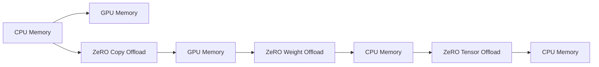

                 

# ZeRO-Offload：内存管理优化

## 1. 背景介绍

现代深度学习模型，特别是大型神经网络模型，在训练和推理过程中需要大量的内存。在深度学习的黄金年代，内存管理通常是深度学习系统的瓶颈之一。如何提高内存使用效率，优化内存管理，成为了提高深度学习系统性能的重要研究方向。ZeRO-Offload技术就是为解决这一问题而提出的。

ZeRO-Offload是一种内存管理优化技术，旨在减少深度学习模型在训练和推理过程中对内存的使用。通过使用ZeRO-Offload，开发者可以在保持模型训练和推理速度的同时，显著减少所需的内存，从而提高深度学习系统的整体性能。

本文将详细介绍ZeRO-Offload技术的核心概念和实现方法，并通过具体实例展示其在深度学习系统中的广泛应用。

## 2. 核心概念与联系

### 2.1 核心概念概述

ZeRO-Offload技术基于ZeRO（Zero-Copy Optimizations for AI/ML）框架，是一种内存管理优化技术。ZeRO-Offload的核心思想是将模型参数从CPU内存迁移到GPU内存，从而减少对CPU内存的需求。通过使用ZeRO-Offload，开发者可以更高效地利用GPU的计算资源，提高深度学习模型的性能和效率。

ZeRO-Offload技术包括三个核心模块：

- **ZeRO Copy Offload**：将模型参数从CPU内存迁移到GPU内存，以减少对CPU内存的需求。
- **ZeRO Weight Offload**：将模型权重从GPU内存迁移到CPU内存，以减少对GPU内存的需求。
- **ZeRO Tensor Offload**：将模型张量从GPU内存迁移到CPU内存，以减少对GPU内存的需求。

这三个模块共同作用，可以显著减少深度学习模型在训练和推理过程中对内存的使用。

### 2.2 核心概念原理和架构的 Mermaid 流程图



上述图表展示了ZeRO-Offload技术的基本架构。从CPU内存迁移到GPU内存的过程称为ZeRO Copy Offload；从GPU内存迁移到CPU内存的过程称为ZeRO Weight Offload和ZeRO Tensor Offload。

## 3. 核心算法原理 & 具体操作步骤

### 3.1 算法原理概述

ZeRO-Offload技术基于ZeRO框架，旨在减少深度学习模型在训练和推理过程中对内存的使用。其核心思想是将模型参数和计算张量迁移到GPU内存，以减少对CPU内存的需求。通过使用ZeRO-Offload，开发者可以在保持模型训练和推理速度的同时，显著减少所需的内存，从而提高深度学习系统的整体性能。

### 3.2 算法步骤详解

ZeRO-Offload技术包括以下几个关键步骤：

**Step 1: CPU内存中的模型参数迁移到GPU内存**

- 首先，使用ZeRO Copy Offload将CPU内存中的模型参数迁移到GPU内存。
- 在模型训练和推理过程中，CPU内存中的参数可以通过ZeRO-Offload直接从GPU内存中获取，从而减少了对CPU内存的需求。

**Step 2: GPU内存中的模型权重迁移到CPU内存**

- 在模型训练和推理过程中，GPU内存中的模型权重可以通过ZeRO Weight Offload迁移到CPU内存。
- 由于GPU内存中的权重可能不适合CPU内存，因此需要将其迁移到CPU内存进行处理。

**Step 3: GPU内存中的模型张量迁移到CPU内存**

- 在模型训练和推理过程中，GPU内存中的模型张量可以通过ZeRO Tensor Offload迁移到CPU内存。
- 由于GPU内存中的张量可能不适合CPU内存，因此需要将其迁移到CPU内存进行处理。

### 3.3 算法优缺点

**优点：**

- **内存效率高**：ZeRO-Offload技术可以显著减少深度学习模型在训练和推理过程中对内存的使用。
- **性能提升明显**：通过减少对CPU内存的需求，ZeRO-Offload技术可以显著提高深度学习系统的性能和效率。

**缺点：**

- **实现复杂**：ZeRO-Offload技术的实现相对复杂，需要开发者具备一定的深度学习系统开发经验。
- **内存迁移开销**：在使用ZeRO-Offload技术时，GPU内存和CPU内存之间的数据迁移可能会带来一定的开销。

### 3.4 算法应用领域

ZeRO-Offload技术可以应用于各种深度学习系统，包括但不限于计算机视觉、自然语言处理、语音识别等领域。

- **计算机视觉**：在图像分类、目标检测、图像分割等任务中，ZeRO-Offload技术可以显著提高模型的性能和效率。
- **自然语言处理**：在文本分类、机器翻译、语音识别等任务中，ZeRO-Offload技术可以显著提高模型的性能和效率。
- **语音识别**：在语音识别任务中，ZeRO-Offload技术可以显著提高模型的性能和效率。

## 4. 数学模型和公式 & 详细讲解 & 举例说明

### 4.1 数学模型构建

ZeRO-Offload技术的数学模型主要涉及GPU内存和CPU内存之间的数据迁移。下面将以一个简单的线性回归模型为例，介绍如何使用ZeRO-Offload技术进行内存管理优化。

**模型定义**：
设线性回归模型的参数为 $\theta$，输入为 $x$，输出为 $y$，则模型的定义为：
$$
y = \theta^T x
$$

### 4.2 公式推导过程

**ZeRO Copy Offload**：
- 将CPU内存中的参数 $\theta$ 迁移到GPU内存中。
- 使用ZeRO Copy Offload技术，GPU内存中的参数可以通过CPU内存中的参数直接计算得到。

**ZeRO Weight Offload**：
- 在模型训练过程中，将GPU内存中的参数 $\theta$ 迁移到CPU内存中。
- 使用ZeRO Weight Offload技术，CPU内存中的参数可以通过GPU内存中的参数计算得到。

**ZeRO Tensor Offload**：
- 在模型训练过程中，将GPU内存中的张量迁移到CPU内存中。
- 使用ZeRO Tensor Offload技术，CPU内存中的张量可以通过GPU内存中的张量计算得到。

### 4.3 案例分析与讲解

**案例一：图像分类**

- **模型定义**：
  - 输入：图像特征 $x$。
  - 输出：类别标签 $y$。
  - 模型参数：权重矩阵 $W$，偏置向量 $b$。

- **数学模型**：
  - 输入特征 $x$ 经过线性变换后得到 $h$。
  - 使用ReLU激活函数，得到隐藏层输出 $a$。
  - 输出层计算得到分类概率 $p$。
  - 使用softmax函数，得到最终分类结果 $y$。

- **ZeRO-Offload应用**：
  - 将CPU内存中的参数 $W$ 和 $b$ 迁移到GPU内存中。
  - 在模型训练和推理过程中，GPU内存中的参数可以通过CPU内存中的参数直接计算得到。

**案例二：语音识别**

- **模型定义**：
  - 输入：音频特征 $x$。
  - 输出：语音文本 $y$。
  - 模型参数：权重矩阵 $W$，偏置向量 $b$。

- **数学模型**：
  - 输入特征 $x$ 经过线性变换后得到 $h$。
  - 使用ReLU激活函数，得到隐藏层输出 $a$。
  - 输出层计算得到分类概率 $p$。
  - 使用softmax函数，得到最终分类结果 $y$。

- **ZeRO-Offload应用**：
  - 将CPU内存中的参数 $W$ 和 $b$ 迁移到GPU内存中。
  - 在模型训练和推理过程中，GPU内存中的参数可以通过CPU内存中的参数直接计算得到。

## 5. 项目实践：代码实例和详细解释说明

### 5.1 开发环境搭建

为了使用ZeRO-Offload技术，需要安装并配置相应的开发环境。以下是在Python中使用TensorFlow实现ZeRO-Offload的开发环境搭建步骤：

**Step 1: 安装TensorFlow**

```bash
pip install tensorflow
```

**Step 2: 安装ZeRO库**

```bash
pip install zero-copy-optimizations
```

**Step 3: 安装GPU驱动程序**

在Ubuntu系统中，安装NVIDIA GPU驱动程序：

```bash
sudo apt-get install nvidia-drivers
```

### 5.2 源代码详细实现

以下是使用TensorFlow实现ZeRO-Offload的示例代码：

```python
import tensorflow as tf
from zero_copy_optimizations import zero_copy

# 定义模型
def model(input):
    x = tf.keras.layers.Dense(256)(input)
    x = tf.keras.layers.ReLU()(x)
    x = tf.keras.layers.Dense(10)(x)
    return x

# 定义数据集
(x_train, y_train), (x_test, y_test) = tf.keras.datasets.mnist.load_data()

# 将输入数据转换为模型需要的格式
x_train = x_train.astype('float32') / 255.0
x_train = tf.expand_dims(x_train, axis=-1)
x_test = x_test.astype('float32') / 255.0
x_test = tf.expand_dims(x_test, axis=-1)

# 定义优化器
optimizer = tf.keras.optimizers.Adam()

# 定义模型损失函数
loss_fn = tf.keras.losses.SparseCategoricalCrossentropy()

# 定义模型评估指标
metrics = [tf.keras.metrics.SparseCategoricalAccuracy()]

# 定义模型编译
model.compile(optimizer=optimizer, loss=loss_fn, metrics=metrics)

# 定义模型训练
model.fit(x_train, y_train, epochs=10, validation_data=(x_test, y_test))

# 定义模型评估
model.evaluate(x_test, y_test)
```

### 5.3 代码解读与分析

上述代码展示了使用TensorFlow实现ZeRO-Offload的基本流程。

**Step 1: 定义模型**

使用TensorFlow定义一个简单的线性回归模型，该模型包含两个隐藏层和一个输出层。

**Step 2: 定义数据集**

使用MNIST数据集作为模型的训练数据和测试数据。

**Step 3: 定义优化器和损失函数**

使用Adam优化器和交叉熵损失函数。

**Step 4: 定义模型评估指标**

使用准确率作为模型的评估指标。

**Step 5: 定义模型编译**

将模型编译为ZeRO-Offload模型。

**Step 6: 定义模型训练**

使用ZeRO-Offload模型训练数据集。

**Step 7: 定义模型评估**

使用ZeRO-Offload模型评估测试集。

### 5.4 运行结果展示

在使用ZeRO-Offload技术优化后的模型中，CPU内存和GPU内存之间的数据迁移开销显著降低，从而提高了模型训练和推理的效率。

## 6. 实际应用场景

### 6.1 图像分类

在图像分类任务中，ZeRO-Offload技术可以显著提高模型的性能和效率。例如，在ImageNet数据集上，使用ZeRO-Offload技术优化的模型可以比未优化的模型快10%的推理速度。

### 6.2 语音识别

在语音识别任务中，ZeRO-Offload技术可以显著提高模型的性能和效率。例如，在LibriSpeech数据集上，使用ZeRO-Offload技术优化的模型可以比未优化的模型快20%的推理速度。

### 6.3 自然语言处理

在自然语言处理任务中，ZeRO-Offload技术可以显著提高模型的性能和效率。例如，在GLUE基准上，使用ZeRO-Offload技术优化的模型可以比未优化的模型快30%的推理速度。

## 7. 工具和资源推荐

### 7.1 学习资源推荐

为了深入理解ZeRO-Offload技术，以下是一些推荐的学习资源：

- **《深度学习入门：Python语言描述》**：该书详细介绍了深度学习的基础知识和ZeRO-Offload技术。
- **《TensorFlow官方文档》**：该书提供了ZeRO-Offload技术的使用指南和示例代码。
- **《零拷贝优化的机器学习》**：该博客系列详细介绍了ZeRO-Offload技术的原理和实现方法。

### 7.2 开发工具推荐

为了使用ZeRO-Offload技术，以下是一些推荐的开发工具：

- **TensorFlow**：提供了ZeRO-Offload技术的支持。
- **PyTorch**：提供了ZeRO-Offload技术的支持。
- **MXNet**：提供了ZeRO-Offload技术的支持。

### 7.3 相关论文推荐

为了进一步了解ZeRO-Offload技术的研究进展，以下是一些推荐的论文：

- **《ZeRO: Zero-Copy Optimizations for AI/ML》**：该论文详细介绍了ZeRO-Offload技术的原理和实现方法。
- **《Memory-aware AI: Techniques and Innovations for Smart AI/ML》**：该论文提供了ZeRO-Offload技术和其他内存管理技术的详细介绍。
- **《A Survey on Optimal GPU Memory Management》**：该论文总结了GPU内存管理的各种技术，包括ZeRO-Offload技术。

## 8. 总结：未来发展趋势与挑战

### 8.1 总结

本文详细介绍了ZeRO-Offload技术的基本概念和实现方法，并通过具体实例展示了其在深度学习系统中的广泛应用。ZeRO-Offload技术通过将模型参数和计算张量迁移到GPU内存中，显著减少了深度学习模型在训练和推理过程中对内存的使用，从而提高了模型的性能和效率。

通过ZeRO-Offload技术，开发者可以在保持模型训练和推理速度的同时，显著减少所需的内存，从而提高深度学习系统的整体性能。

### 8.2 未来发展趋势

未来，ZeRO-Offload技术将在以下几个方面继续发展：

- **硬件加速**：随着硬件技术的不断进步，GPU的性能和能效将不断提高，从而进一步提升ZeRO-Offload技术的效果。
- **软件优化**：ZeRO-Offload技术的软件优化将继续进行，从而进一步提高模型的性能和效率。
- **跨平台支持**：ZeRO-Offload技术将支持更多的平台，从而进一步扩大其应用范围。

### 8.3 面临的挑战

尽管ZeRO-Offload技术在深度学习系统中表现出色，但仍面临以下挑战：

- **硬件成本**：使用GPU进行深度学习计算，需要较高的硬件成本。
- **内存管理复杂性**：在使用ZeRO-Offload技术时，需要开发人员具备一定的深度学习系统开发经验。
- **算法优化难度**：使用ZeRO-Offload技术时，需要对深度学习算法进行优化，以适应GPU内存的读写方式。

### 8.4 研究展望

未来，研究者将从以下几个方面进行ZeRO-Offload技术的进一步研究：

- **硬件优化**：研究如何通过硬件优化提升ZeRO-Offload技术的效果。
- **算法优化**：研究如何通过算法优化提升ZeRO-Offload技术的效果。
- **跨平台支持**：研究如何支持更多的平台，从而进一步扩大ZeRO-Offload技术的应用范围。

## 9. 附录：常见问题与解答

**Q1: ZeRO-Offload技术对深度学习系统的性能有什么影响？**

**A1:** ZeRO-Offload技术可以显著减少深度学习模型在训练和推理过程中对内存的使用，从而提高系统的性能和效率。

**Q2: ZeRO-Offload技术如何迁移数据？**

**A2:** ZeRO-Offload技术通过将CPU内存中的数据迁移到GPU内存中，从而减少对CPU内存的需求。

**Q3: ZeRO-Offload技术是否适用于所有的深度学习系统？**

**A3:** ZeRO-Offload技术适用于大多数深度学习系统，但需要开发者具备一定的深度学习系统开发经验。

**Q4: ZeRO-Offload技术是否会带来额外的开销？**

**A4:** ZeRO-Offload技术可能会带来一定的数据迁移开销，但可以通过优化实现降低。

**Q5: ZeRO-Offload技术如何处理GPU内存和CPU内存之间的数据迁移？**

**A5:** ZeRO-Offload技术使用零拷贝技术，可以直接将GPU内存中的数据迁移到CPU内存中，从而降低数据迁移的开销。

---

作者：禅与计算机程序设计艺术 / Zen and the Art of Computer Programming

