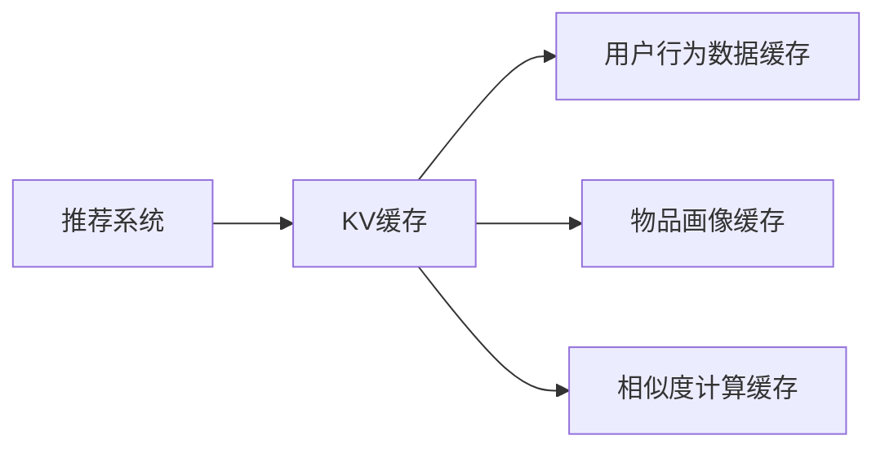

                 

# kv-cache 在推荐系统中的应用

> 关键词：KV缓存,推荐系统,性能优化,存储结构,键值存储,应用场景

## 1. 背景介绍

### 1.1 问题由来

推荐系统是现代电商、内容平台等网络服务的重要组成部分，通过分析用户行为数据，预测用户兴趣，推荐个性化内容，提高用户满意度和平台收益。推荐算法涉及用户画像、物品画像、相似度计算等多个环节，其性能很大程度上取决于系统架构和算法实现。

推荐系统的核心难题之一是实时性。推荐算法依赖于对用户行为数据的实时收集、存储和计算。当推荐引擎的查询请求大幅增长时，传统的数据存储和计算方式难以满足实时性要求，导致系统响应延迟、查询失败等问题。为应对这一挑战，KV缓存技术应运而生，以低延迟、高并发的特性显著提升了推荐系统的实时性和用户体验。

### 1.2 问题核心关键点

KV缓存（Key-Value Cache）是一种快速存储和检索键值对数据的结构，广泛应用于推荐系统等需要高性能缓存的场景。KV缓存的核心优势在于支持快速插入、删除和查询操作，以O(1)的复杂度访问任意数据项。在推荐系统中，KV缓存主要用于存储用户行为数据、物品画像、相似度计算结果等关键信息，以加速推荐计算过程，提升推荐系统性能。

KV缓存在推荐系统中的应用包括但不限于：

- 用户行为数据存储：将用户浏览、点击、评分等行为数据以键值对形式存储，支持高效的实时查询和更新。
- 物品画像缓存：存储物品的元数据和用户评价数据，减少重复计算和数据读取时间。
- 相似度计算结果缓存：存储相似度计算结果，加速召回和排序等环节的计算过程。

KV缓存通过显著提升数据查询和存储的效率，可以大幅降低推荐系统响应时间，提高实时性和用户满意度。

## 2. 核心概念与联系

### 2.1 核心概念概述

KV缓存是一种基于键值对的快速数据存储结构，支持高效的插入、删除和查询操作。每个键值对包含一个键（Key）和一个值（Value），键用于唯一标识存储的数据项，值则存储具体的数据内容。KV缓存的典型实现包括Memcached、Redis等。

在推荐系统中，KV缓存的应用场景主要包括以下几类：

- **用户行为数据缓存**：存储用户浏览记录、点击记录、评分记录等行为数据，支持高效的查询和更新。
- **物品画像缓存**：存储物品的元数据、描述、用户评价等信息，减少重复计算和数据读取时间。
- **相似度计算缓存**：存储相似度计算结果，加速召回和排序等环节的计算过程。

KV缓存与推荐系统的联系主要体现在两个方面：

1. 数据存储：KV缓存为推荐算法提供了快速访问数据的手段，避免了频繁的数据读取和计算，提升实时性。
2. 缓存策略：推荐系统需要设计合适的缓存策略，决定哪些数据项应缓存，哪些应从原始数据中读取，以优化系统性能。

### 2.2 核心概念原理和架构的 Mermaid 流程图



上图中展示了推荐系统与KV缓存的架构关系。推荐系统通过KV缓存存储关键数据项，并根据缓存策略进行数据读取和计算，以提升系统性能。

## 3. 核心算法原理 & 具体操作步骤

### 3.1 算法原理概述

KV缓存的算法原理主要涉及数据的插入、删除和查询操作。在推荐系统中，KV缓存的数据插入和更新一般由推荐算法主动触发，查询操作则由推荐引擎在生成推荐结果时调用。

KV缓存的数据插入和更新通常通过哈希函数将键映射到存储位置。假设KV缓存的数据量较大，实际存储过程中一般采用分片（Sharding）技术，将数据分散存储在多个节点上。KV缓存还支持分布式扩展，通过增加节点数量，提高缓存的容量和访问速度。

### 3.2 算法步骤详解

KV缓存的算法步骤主要包括以下几个关键环节：

**步骤 1: 数据插入**

KV缓存的数据插入操作一般由推荐算法触发。当推荐算法需要更新用户行为数据、物品画像或相似度计算结果时，将数据以键值对形式插入缓存。

假设将用户行为数据 $(u,b,t)$ 插入缓存，其中 $u$ 为用户ID，$b$ 为物品ID，$t$ 为时间戳。数据插入流程如下：

1. 根据用户ID、物品ID和时间戳生成唯一键 $key = f(u,b,t)$，其中 $f$ 为哈希函数。
2. 将数据 $(u,b,t)$ 和键 $key$ 一起插入缓存。

**步骤 2: 数据查询**

KV缓存的数据查询操作由推荐引擎调用。当推荐引擎需要生成推荐结果时，首先根据用户ID、物品ID和时间戳生成键 $key = f(u,b,t)$。然后根据键在缓存中查询对应的数据，如果缓存中存在，则直接读取数据；否则，从原始数据中读取数据。

**步骤 3: 数据删除**

KV缓存的数据删除操作一般由推荐算法主动触发。当推荐算法需要更新用户行为数据、物品画像或相似度计算结果时，将不再需要的数据从缓存中删除。

假设需要删除用户行为数据 $(u,b,t)$，流程如下：

1. 根据用户ID、物品ID和时间戳生成唯一键 $key = f(u,b,t)$。
2. 从缓存中删除键 $key$ 对应的数据。

### 3.3 算法优缺点

KV缓存的优点包括：

- **高并发**：KV缓存支持高并发访问，能够处理大量并发请求，提升系统吞吐量。
- **低延迟**：KV缓存的数据查询操作复杂度为O(1)，能够快速访问数据，提升系统响应速度。
- **易于扩展**：KV缓存可以水平扩展，通过增加节点数量，提高缓存的容量和访问速度。

KV缓存的缺点包括：

- **数据一致性**：由于缓存数据与原始数据可能存在延迟，缓存数据可能不一致。需要设计合理的一致性策略，确保数据的准确性。
- **内存占用**：KV缓存需要占用大量内存存储数据，对内存资源要求较高。需要合理规划内存使用，避免内存溢出。
- **复杂性**：KV缓存的设计和实现较为复杂，需要考虑数据的分布、一致性和扩展性等问题，开发和维护成本较高。

### 3.4 算法应用领域

KV缓存广泛应用于推荐系统等需要高性能缓存的场景。在推荐系统中，KV缓存的应用场景主要包括：

- **用户行为数据缓存**：存储用户浏览、点击、评分等行为数据，支持高效的查询和更新。
- **物品画像缓存**：存储物品的元数据、描述、用户评价等信息，减少重复计算和数据读取时间。
- **相似度计算缓存**：存储相似度计算结果，加速召回和排序等环节的计算过程。

## 4. 数学模型和公式 & 详细讲解 & 举例说明

### 4.1 数学模型构建

在推荐系统中，KV缓存的数据模型可以表示为一个三元组 $(key, value, timestamp)$，其中 $key$ 为唯一标识符，$value$ 为具体数据内容，$timestamp$ 为数据更新时间戳。

假设推荐系统每秒接收 $q$ 个查询请求，每个查询请求需要从缓存中读取数据的时间为 $t_0$，从原始数据中读取数据的时间为 $t_1$。假设缓存命中率 $H$，即缓存命中的数据占总查询数据的比例。

根据Amdahl定律，缓存数据查询的效率可以表示为：

$$
H \times \frac{q}{q} \times (1-t_0/t_1) = H \times (1-t_0/t_1)
$$

假设原始数据读取时间 $t_1$ 为常数，则查询效率可以简化为：

$$
H \times (1-t_0/t_1)
$$

### 4.2 公式推导过程

为了最大化缓存的查询效率，需要最大化缓存命中率 $H$。缓存命中率由缓存数据量和原始数据量之比决定，假设缓存数据量为 $M$，原始数据量为 $S$，则：

$$
H = \frac{M}{S}
$$

将 $H$ 代入查询效率公式，得到：

$$
\frac{M}{S} \times (1-t_0/t_1)
$$

为了最大化查询效率，需要同时最大化 $H$ 和 $(1-t_0/t_1)$。显然，$t_0/t_1$ 越小越好，即缓存数据的查询速度越快越好。同时，$H$ 越大越好，即缓存数据量占总数据量的比例越大越好。

### 4.3 案例分析与讲解

**案例分析：用户行为数据缓存**

假设推荐系统每秒接收 $q=10000$ 个查询请求，每个请求需要从缓存中读取数据的时间为 $t_0=1ms$，从原始数据中读取数据的时间为 $t_1=10ms$。如果缓存命中率为 $H=0.9$，则原始数据读取的次数为：

$$
N_S = \frac{10000}{H} \times t_1 = \frac{10000}{0.9} \times 10 = 11111
$$

查询效率为：

$$
H \times \frac{10000}{10000} \times (1-t_0/t_1) = 0.9 \times (1-1/10) = 0.9 \times 0.9 = 0.81
$$

如果缓存数据量为 $M=1000$，原始数据量为 $S=10000$，则缓存命中率 $H = \frac{M}{S} = 0.1$。显然，缓存命中率较低，无法满足实际需求。

为了优化查询效率，需要增加缓存数据量，提高缓存命中率。假设将缓存数据量增加到 $M=10000$，原始数据量为 $S=10000$，则缓存命中率 $H = \frac{M}{S} = 1$。查询效率为：

$$
H \times \frac{10000}{10000} \times (1-t_0/t_1) = 1 \times (1-1/10) = 0.9
$$

查询效率显著提升，达到了理想状态。

## 5. 项目实践：代码实例和详细解释说明

### 5.1 开发环境搭建

开发环境搭建包括以下步骤：

1. **安装Python和相关库**：推荐使用Python 3.7及以上版本，安装Pandas、NumPy、SciPy等常用库。

2. **安装Redis**：Redis是一款常用的KV缓存工具，支持快速插入、删除和查询操作。安装Redis后，启动Redis服务。

3. **编写客户端程序**：使用Python编写客户端程序，连接Redis服务器，执行数据插入、查询和删除操作。

### 5.2 源代码详细实现

以下是使用Python编写Redis客户端的程序示例：

```python
import redis
import time

# 连接Redis服务器
r = redis.Redis(host='localhost', port=6379, db=0)

# 插入数据
r.set('user:1:item:1:time', '2023-01-01 12:00:00')

# 查询数据
val = r.get('user:1:item:1:time')
print(val)

# 删除数据
r.delete('user:1:item:1:time')
```

### 5.3 代码解读与分析

1. **连接Redis服务器**：通过 `redis.Redis` 类连接Redis服务器，指定服务器的地址和端口。

2. **数据插入**：使用 `set` 方法插入数据，键和值分别为唯一标识符和具体数据内容。

3. **数据查询**：使用 `get` 方法查询数据，返回对应的值。

4. **数据删除**：使用 `delete` 方法删除数据，指定唯一的键。

### 5.4 运行结果展示

运行上述代码，可以验证数据插入、查询和删除的正确性。例如，插入数据后，查询数据的输出为：

```
2023-01-01 12:00:00
```

删除数据后，再次查询数据的输出为：

```
None
```

## 6. 实际应用场景

### 6.1 电商推荐系统

在电商推荐系统中，KV缓存可以显著提升系统的实时性和用户体验。例如，当用户浏览商品时，系统记录用户浏览记录并存储到缓存中。当用户点击商品时，从缓存中读取浏览记录，根据浏览记录推荐相关商品，大幅缩短推荐响应时间。

### 6.2 新闻推荐系统

在新闻推荐系统中，KV缓存可以存储用户浏览历史、点击历史和评分历史。当用户访问新闻时，从缓存中读取用户的历史行为数据，根据历史行为推荐相关新闻，提升推荐精度和用户体验。

### 6.3 视频推荐系统

在视频推荐系统中，KV缓存可以存储用户观看历史和评分历史。当用户观看视频时，从缓存中读取用户的历史行为数据，根据历史行为推荐相关视频，提升推荐精度和用户体验。

## 7. 工具和资源推荐

### 7.1 学习资源推荐

为了掌握KV缓存在推荐系统中的应用，推荐以下学习资源：

1. **《Redis官方文档》**：Redis是一款常用的KV缓存工具，官方文档详细介绍了Redis的使用方法和配置策略。
2. **《Redis设计与实现》**：本书详细介绍了Redis的核心算法和数据结构，适合深入理解Redis的实现原理。
3. **《KV缓存在推荐系统中的应用》**：本文详细介绍了KV缓存在推荐系统中的应用，适合初学者入门。
4. **《推荐系统理论与实践》**：本书全面介绍了推荐系统的理论基础和工程实现，适合深入学习推荐系统。

### 7.2 开发工具推荐

推荐使用以下开发工具：

1. **Redis**：Redis是一款常用的KV缓存工具，支持快速插入、删除和查询操作，是推荐系统中常用的缓存工具。
2. **Memcached**：Memcached是另一款常用的KV缓存工具，支持水平扩展和分布式部署，适用于大规模推荐系统的缓存需求。
3. **Elasticache**：Amazon提供的KV缓存服务，支持快速插入、删除和查询操作，适用于云环境下的推荐系统。

### 7.3 相关论文推荐

推荐以下相关论文：

1. **《Cache-Oblivious Algorithms for Real-Time Recommendation Systems》**：论文介绍了如何设计高效的缓存算法，提升推荐系统的实时性。
2. **《Hybrid Caching in Recommendation Systems》**：论文介绍了如何在推荐系统中设计混合缓存策略，提升缓存效率和系统性能。
3. **《Cache-Aware Recommender Systems》**：论文详细介绍了缓存在推荐系统中的应用，提出了多种缓存算法和优化方法。

## 8. 总结：未来发展趋势与挑战

### 8.1 总结

本文介绍了KV缓存在推荐系统中的应用，详细讲解了KV缓存的算法原理、具体操作步骤、应用领域以及实际案例。KV缓存通过优化数据查询和存储的效率，显著提升了推荐系统的实时性和用户体验。

通过本文的系统梳理，可以看到KV缓存在推荐系统中的应用场景广泛，能够解决实时性、并发性、存储性等关键问题。未来，伴随推荐系统和大数据技术的不断发展，KV缓存技术还将不断进步，为推荐系统提供更加高效、可靠的数据支持。

### 8.2 未来发展趋势

KV缓存在推荐系统中的应用将呈现以下几个发展趋势：

1. **分布式扩展**：未来KV缓存将支持更大规模的分布式部署，通过增加节点数量，提高缓存的容量和访问速度。
2. **智能缓存**：未来的KV缓存将具备智能缓存策略，根据数据的热度和变化频率，动态调整缓存策略，提升缓存效率。
3. **内存优化**：未来的KV缓存将支持内存优化，减少内存使用和成本，提高缓存系统的可扩展性和稳定性。
4. **弹性伸缩**：未来的KV缓存将具备弹性伸缩能力，根据系统负载动态调整缓存容量，提高系统的稳定性和可用性。

### 8.3 面临的挑战

KV缓存在推荐系统中的应用仍面临以下挑战：

1. **数据一致性**：缓存数据和原始数据可能存在延迟，缓存数据可能不一致，需要设计合理的一致性策略，确保数据的准确性。
2. **内存占用**：KV缓存需要占用大量内存存储数据，对内存资源要求较高，需要合理规划内存使用，避免内存溢出。
3. **复杂性**：KV缓存的设计和实现较为复杂，需要考虑数据的分布、一致性和扩展性等问题，开发和维护成本较高。
4. **缓存命中率**：缓存命中率是缓存效率的关键指标，需要设计合理的缓存策略，最大化缓存命中率。

### 8.4 研究展望

未来的研究应在以下几个方向寻求突破：

1. **分布式缓存算法**：设计高效的分布式缓存算法，支持大规模的分布式部署和数据缓存。
2. **智能缓存策略**：设计智能缓存策略，根据数据的热度和变化频率，动态调整缓存策略，提升缓存效率。
3. **内存优化算法**：设计内存优化算法，减少内存使用和成本，提高缓存系统的可扩展性和稳定性。
4. **缓存一致性算法**：设计高效的缓存一致性算法，确保缓存数据和原始数据的一致性。

这些研究方向将进一步推动KV缓存技术的发展，为推荐系统提供更加高效、可靠的数据支持。

## 9. 附录：常见问题与解答

**Q1: 如何设计合理的缓存策略？**

A: 缓存策略的设计需要考虑多个因素，包括数据的访问频率、数据大小、一致性要求等。一般而言，可以将数据分为高频访问数据和低频访问数据，高频访问数据应缓存，低频访问数据从原始数据中读取。同时，需要根据数据变化频率，设计合理的缓存更新策略，避免缓存数据过时。

**Q2: 如何设计高效的缓存算法？**

A: 高效的缓存算法需要考虑缓存的命中率、查询速度和存储空间等多个因素。一般而言，可以采用LRU（Least Recently Used）、LFU（Least Frequently Used）等经典缓存算法，结合实际应用场景进行调整。例如，在电商推荐系统中，可以考虑将用户行为数据缓存到Redis中，并根据用户行为的变化频率，动态调整缓存策略。

**Q3: 如何确保缓存数据的一致性？**

A: 缓存数据的一致性可以通过数据版本控制和数据同步机制来保证。例如，可以将数据版本号作为缓存键的一部分，每次更新数据时，生成新的版本号。在查询数据时，如果缓存中存在多个版本，则优先返回最新版本的缓存数据。同时，需要设计合理的数据同步机制，确保缓存数据和原始数据的一致性。

这些问题的回答将帮助开发者更好地理解KV缓存在推荐系统中的应用，并设计出高效、稳定的缓存系统。

