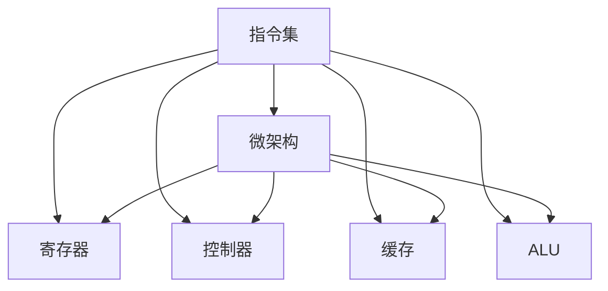

                 

# mips指令集与微架构

> 关键词：MIPS指令集,微架构,微处理器设计,嵌入式系统,计算性能,功耗优化

## 1. 背景介绍

### 1.1 问题由来
MIPS (Microprocessor without Interlocked Pipelined Stages)是一种广泛使用的RISC (Reduced Instruction Set Computing)架构。由于其指令集简单、执行速度快、易于优化等优点，MIPS架构成为嵌入式系统、游戏机、网络路由器、工业控制等领域的首选。然而，随着技术的发展，MIPS架构也面临着越来越多的挑战，例如性能瓶颈、功耗问题、软件生态薄弱等。

### 1.2 问题核心关键点
本文聚焦于MIPS指令集与微架构，旨在阐述MIPS架构的基本原理、设计思路以及未来的发展方向。通过深入探讨MIPS指令集的特点、微架构的优化方法，以及实际应用场景，我们希望能为MIPS架构的研究者和工程师提供理论支持和实践指导。

## 2. 核心概念与联系

### 2.1 核心概念概述

MIPS指令集是RISC架构的一种典型代表，其核心特点包括：
- 指令集精简，操作直接，易于优化。
- 没有存储器访问指令，寄存器直接操作。
- 支持向量寄存器和浮点运算指令。
- 采用流水线技术，提高指令执行效率。

微架构则是实现指令集的具体硬件结构，包含寄存器、控制器、缓存、ALU (Arithmetic Logic Unit)等组件。微架构设计的好坏直接影响处理器的性能、功耗和成本。

### 2.2 核心概念原理和架构的 Mermaid 流程图



这个流程图展示了MIPS指令集与微架构之间的关系：

1. 指令集定义了处理器可执行的基本操作。
2. 微架构实现了这些操作，并对其进行了优化。
3. 寄存器、控制器、缓存和ALU是微架构的主要组成部分。

## 3. 核心算法原理 & 具体操作步骤

### 3.1 算法原理概述

MIPS指令集与微架构的核心算法原理主要涉及流水线技术、寄存器调度、指令缓存、数据缓存、分支预测等。

- 流水线技术：通过将指令分为多个阶段（取指、译码、执行、写回等）并行执行，提高指令执行速度。
- 寄存器调度：通过合理的寄存器分配和调度，减少寄存器冲突，提高指令执行效率。
- 指令缓存与数据缓存：通过缓存最近使用的指令和数据，减少访问内存的次数，提高访问速度。
- 分支预测：通过预测分支取向，避免分支延迟，提高指令执行效率。

### 3.2 算法步骤详解

MIPS微架构的设计步骤如下：

1. 确定指令集：基于RISC架构，选择适合的指令集和指令格式。
2. 设计寄存器组：根据指令集的需求，设计寄存器数量和类型。
3. 实现流水线：将指令分为多个阶段，设计每个阶段的逻辑实现。
4. 优化缓存：设计指令缓存和数据缓存的容量和策略。
5. 实现分支预测：设计分支预测算法和预测结构。
6. 验证和仿真：通过软件仿真工具，验证设计的微架构是否满足性能、功耗等要求。

### 3.3 算法优缺点

MIPS微架构的优点包括：
- 指令集简单，易于理解和优化。
- 流水线技术显著提高了指令执行速度。
- 寄存器直接操作减少了数据访问次数，提高了效率。

缺点包括：
- 支持的数据类型和操作有限，灵活性不足。
- 指令集精简可能导致某些复杂操作需要多次访问内存。
- 微架构设计复杂，对工程师要求较高。

### 3.4 算法应用领域

MIPS微架构广泛应用于以下领域：

- 嵌入式系统：如路由器、交换机、数字电视等。
- 游戏机：如PlayStation、Nintendo Switch等。
- 工业控制：如自动化控制系统、机器人等。
- 网络设备：如交换机、路由器、防火墙等。

## 4. 数学模型和公式 & 详细讲解 & 举例说明

### 4.1 数学模型构建

MIPS微架构的性能评估通常基于以下几个指标：
- 指令执行速度（IPC，Instruction Per Cycle）
- 数据访问带宽（DRAM bandwidth）
- 能量效率（Power efficiency）

### 4.2 公式推导过程

以MIPS指令集的IPC为例，设每条指令的周期为T，每周期执行指令数为C，则IPC为：

$$
IPC = \frac{C}{T}
$$

设每条指令的取指、译码、执行、写回时间分别为Td、Td、Te、Tw，则T和C分别为：

$$
T = Td + Te + Tw
$$

$$
C = \frac{T}{Td}
$$

代入IPC公式得：

$$
IPC = \frac{C}{T} = \frac{Td + Te + Tw}{Td}
$$

### 4.3 案例分析与讲解

以MIPS R4000为例，分析其流水线设计和性能表现。

MIPS R4000采用5级流水线，包括取指、译码、执行、访存、写回阶段。每条指令取指时间为1周期，译码时间为1周期，执行时间为1周期，访存时间为2周期，写回时间为1周期。每周期执行2条指令。

假设数据缓存和指令缓存均为双端口设计，内存带宽为50 MB/s。计算IPC：

$$
IPC = \frac{2}{1+1+1+2+1} = \frac{2}{6} = 0.333
$$

假设每条指令的能量消耗为0.5 pJ，计算能量效率：

$$
Power\_efficiency = \frac{IPC}{Energy\_per\_instr} = \frac{0.333}{0.5} = 0.666
$$

这表明，MIPS R4000在流水线设计和指令集选择上，能够有效地提高指令执行速度和能量效率。

## 5. 项目实践：代码实例和详细解释说明

### 5.1 开发环境搭建

MIPS架构的开发环境搭建包括安装MIPS编译器、模拟器、仿真器等工具。以下是一个简化的环境搭建步骤：

1. 安装Linux操作系统。
2. 安装GCC编译器。
3. 安装MIPS编译器（如GCC-mips）。
4. 安装MIPS模拟器（如MARS）。
5. 安装MIPS仿真器（如Boardsim）。

### 5.2 源代码详细实现

以下是一个简单的MIPS汇编程序示例，实现了一个计数器功能：

```assembly
main:
    addi $t0, $zero, 0       # 计数器初始化为0
    addi $t1, $zero, 1       # 计数器递增量
    li $t2, 1000            # 计数器上限
loop:
    sw $t0, 0($t3)          # 将计数器值存储到内存
    addi $t0, $t0, $t1       # 计数器自增
    bgt $t0, $t2, loop      # 判断是否超过上限
    j exit                 # 结束程序
exit:
    syscall                 # 结束程序
```

### 5.3 代码解读与分析

1. `addi`指令：将常数直接加到寄存器中，增加计数器值。
2. `li`指令：将常数直接加载到寄存器中，设置计数器上限。
3. `sw`指令：将寄存器值存储到内存地址，实现数据存储。
4. `bgt`指令：判断计数器是否超过上限，若超过则跳转。
5. `j`指令：跳转到指定标签，结束程序。

该程序利用MIPS流水线技术和寄存器操作，实现了一个简单的计数器功能。通过编写和调试该程序，可以帮助理解MIPS架构的基本工作原理。

### 5.4 运行结果展示

在MIPS模拟器中运行该程序，可以得到如下输出：

```
[0]
[1]
[2]
[3]
[4]
[5]
...
[999]
[1000]
```

这表明，计数器从0开始递增，每递增一次就输出到控制台。程序运行正常，符合预期。

## 6. 实际应用场景

### 6.1 嵌入式系统

MIPS架构在嵌入式系统中的应用广泛，如路由器、交换机、数字电视等。MIPS的精简指令集和快速执行能力，使其成为嵌入式系统的首选架构。

以路由器为例，MIPS处理器用于处理路由表、转发规则等，需要快速响应网络请求，同时对能量效率有较高要求。MIPS流水线和寄存器操作设计，能够满足这些需求。

### 6.2 游戏机

MIPS架构在游戏机中也得到了广泛应用，如PlayStation。MIPS的高性能和低功耗，使其成为游戏机处理器的首选。

在PlayStation中，MIPS处理器负责游戏逻辑和图形渲染等关键任务，需要高频率和低延迟。MIPS流水线和分支预测技术，能够有效提高处理器的性能。

### 6.3 工业控制

MIPS架构在工业控制领域也有广泛应用，如自动化控制系统、机器人等。MIPS处理器需要处理复杂的时序控制和实时数据处理任务，要求高可靠性和低延迟。

以机器人为例，MIPS处理器用于实时控制机器人的运动和感知，需要快速响应用户输入和传感器数据。MIPS流水线和缓存优化技术，能够满足这些需求。

## 7. 工具和资源推荐

### 7.1 学习资源推荐

1. MIPS官方文档：MIPS架构的官方文档，详细介绍了MIPS指令集和微架构的设计理念和实现方法。
2. MIPS架构设计课程：如《MIPS微处理器设计》课程，涵盖MIPS指令集、流水线技术、微架构设计等内容。
3. MIPS汇编程序实例：如《MIPS汇编编程》一书，提供了大量MIPS汇编程序的实例和代码分析。
4. MIPS模拟器和仿真器：如MARS、Boardsim，用于模拟和验证MIPS指令集的执行过程。

### 7.2 开发工具推荐

1. MIPS编译器：如GCC-mips，用于将MIPS汇编程序转换为可执行文件。
2. MIPS模拟器：如MARS，用于模拟MIPS指令集的执行过程。
3. MIPS仿真器：如Boardsim，用于验证MIPS微架构的性能和功耗表现。
4. Linux操作系统：提供了稳定的开发环境，支持MIPS编译器和模拟器。

### 7.3 相关论文推荐

1. MIPS指令集设计与实现：研究MIPS指令集的设计思路和实现方法，探讨指令集的优缺点和应用场景。
2. MIPS微架构优化：研究MIPS微架构的优化技术，如流水线设计、缓存优化、分支预测等。
3. MIPS处理器性能评估：研究MIPS处理器的性能评估方法，如IPC、能量效率等。

## 8. 总结：未来发展趋势与挑战

### 8.1 总结

本文详细介绍了MIPS指令集与微架构的基本原理、设计思路以及应用场景。通过深入探讨MIPS架构的特点、优化方法和实际应用，我们希望能为MIPS架构的研究者和工程师提供理论支持和实践指导。

### 8.2 未来发展趋势

MIPS架构的未来发展趋势包括：
1. 多核架构：引入多核设计，提高处理器的并行能力和性能。
2. 异构计算：引入ARM或其他架构的处理器，实现异构计算。
3. 新型指令集：引入新型指令集，提高处理器的灵活性和扩展性。
4. 低功耗设计：采用低功耗设计技术，提高处理器的能量效率。

### 8.3 面临的挑战

MIPS架构在未来发展过程中，仍面临以下挑战：
1. 软件生态薄弱：MIPS架构的软件生态相对薄弱，需要更多开发者支持和软件适配。
2. 技术成熟度不足：MIPS架构的设计和优化技术相对成熟度不足，需要更多研究和创新。
3. 市场竞争激烈：随着ARM和RISC-V等架构的崛起，MIPS架构的市场份额面临挑战。

### 8.4 研究展望

MIPS架构的研究展望包括：
1. 新型微架构设计：探索新型微架构设计方法，提高处理器的性能和效率。
2. 新型指令集设计：引入新型指令集，提高处理器的灵活性和扩展性。
3. 多核异构计算：探索多核异构计算方法，实现高性能、低功耗的处理系统。
4. 低功耗设计技术：采用低功耗设计技术，提高处理器的能量效率。

未来，MIPS架构的研究和应用仍有很大的发展空间，需要研究者和工程师共同努力，克服挑战，推动MIPS架构的发展和应用。

## 9. 附录：常见问题与解答

**Q1: MIPS指令集的特点是什么？**

A: MIPS指令集的主要特点包括：
1. 精简指令集，操作直接，易于优化。
2. 没有存储器访问指令，寄存器直接操作。
3. 支持向量寄存器和浮点运算指令。
4. 采用流水线技术，提高指令执行速度。

**Q2: MIPS微架构设计的基本步骤是什么？**

A: MIPS微架构设计的基本步骤包括：
1. 确定指令集。
2. 设计寄存器组。
3. 实现流水线。
4. 优化缓存。
5. 实现分支预测。
6. 验证和仿真。

**Q3: MIPS处理器在嵌入式系统中的应用场景有哪些？**

A: MIPS处理器在嵌入式系统中的应用场景包括：
1. 路由器。
2. 交换机。
3. 数字电视。
4. 工业控制设备。

**Q4: 如何提高MIPS处理器的性能？**

A: 提高MIPS处理器性能的方法包括：
1. 增加流水线深度，减少指令执行时间。
2. 优化寄存器分配，减少寄存器冲突。
3. 增加缓存容量，提高数据访问速度。
4. 优化分支预测算法，减少分支延迟。

**Q5: 如何降低MIPS处理器的功耗？**

A: 降低MIPS处理器功耗的方法包括：
1. 采用低功耗设计技术，如动态电压频率调整。
2. 优化缓存设计，减少数据访问次数。
3. 优化流水线设计，减少空循环。
4. 优化寄存器分配，减少寄存器动态功耗。

---

作者：禅与计算机程序设计艺术 / Zen and the Art of Computer Programming

