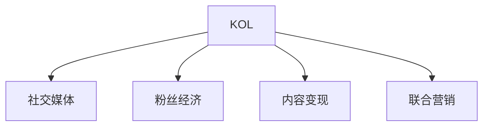

                 

# 与其他KOL合作：扩大受众群体

## 1. 背景介绍

随着互联网技术的飞速发展，内容创作者的影响力越来越大。无论是短视频博主、社交媒体达人，还是科技博主，通过社交平台分享知识和经验，吸引了大批粉丝关注。对于广大开发者和IT专业人士而言，扩大受众群体、提升品牌影响力，已成为提升个人职业发展和社会影响力的重要手段。与其他知名KOL(Key Opinion Leaders，关键意见领袖)的合作，无疑是扩大受众群体的一种高效且有效的方式。

在社交媒体高度发达的今天，与其他KOL的合作不仅可以迅速提升自身的曝光度，还能通过KOL的影响力带动更多新用户的关注。KOL作为内容领域的佼佼者，拥有庞大的粉丝基础和高度的信任度，是传递技术知识和品牌理念的重要媒介。

## 2. 核心概念与联系

### 2.1 核心概念概述

为更好地理解与其他KOL合作如何扩大受众群体，本节将介绍几个密切相关的核心概念：

- KOL (Key Opinion Leader)：在某一领域具有高度专业性和权威性，能够通过社交媒体等平台影响他人决策和行为的内容创作者。
- 社交媒体 (Social Media)：通过互联网平台，人们可以发布、交流和分享信息的社交方式。
- 粉丝经济 (Fang Economy)：以粉丝为核心的商业模式，通过粉丝对特定内容的认同和追捧，带动相关产品的销售和服务的提供。
- 内容变现 (Content Monetization)：将优质的内容转化为商业价值的过程，包括广告、会员、赞助等方式。
- 联合营销 (Co-marketing)：多个品牌或内容创作者共同合作，整合资源和优势，实现双赢或多赢。

这些核心概念之间的逻辑关系可以通过以下Mermaid流程图来展示：



这个流程图展示了几大核心概念及其之间的关系：

1. KOL通过社交媒体获得粉丝，利用粉丝经济实现内容变现。
2. 粉丝对KOL内容的追捧，带动联合营销的产生。
3. 联合营销进一步巩固KOL的影响力，扩大受众群体。

## 3. 核心算法原理 & 具体操作步骤

### 3.1 算法原理概述

与其他KOL合作的扩大受众群体方法，本质上是一种基于社交网络的传播模型。其核心思想是通过KOL的推荐和传播，将自身的内容和品牌推广给更多的目标用户，从而提升粉丝数量和品牌影响力。

形式化地，假设内容创作者 $A$ 拥有初始粉丝数 $F_A$，KOL $B$ 拥有粉丝数 $F_B$。假设每次KOL的推荐将内容创作者的粉丝数增加一定比例 $\alpha$。则经过 $t$ 次推荐后，内容创作者 $A$ 的最终粉丝数为：

$$
F_A(t) = F_A(1+\alpha)^t
$$

其中，$t$ 为推荐次数。

通过梯度下降等优化算法，传播过程不断更新推荐比例 $\alpha$，最小化目标函数，使得内容创作者 $A$ 的粉丝数最大化。

### 3.2 算法步骤详解

基于社交网络的扩大受众群体方法一般包括以下几个关键步骤：

**Step 1: 选择合作伙伴**
- 根据自身定位，选择与其内容领域相关、粉丝数量庞大且影响力强的KOL作为合作伙伴。
- 可以通过社交媒体数据分析工具，寻找与自身受众高度重叠且互动活跃的KOL。

**Step 2: 制定合作策略**
- 确定合作内容类型，如视频、文章、直播等。
- 设计合适的合作奖励机制，如佣金、产品折扣等，激励KOL积极参与。
- 设定合作期限和预期目标，明确双方的责任和义务。

**Step 3: 执行传播过程**
- 将内容创作者制作的内容发布至KOL的社交媒体平台。
- 设置自动化的推荐和传播工具，持续跟踪反馈效果。
- 根据粉丝增长情况，及时调整推荐策略和传播内容。

**Step 4: 评估效果和优化**
- 使用社交媒体数据分析工具，定期监测合作内容的效果。
- 分析粉丝互动数据，如点赞、评论、分享等，评估内容的受欢迎程度。
- 根据分析结果，优化合作内容、传播策略，进一步提升传播效果。

### 3.3 算法优缺点

与其他KOL合作的扩大受众群体方法具有以下优点：
1. 传播速度快。KOL粉丝的关注度高，可以快速将内容传播给大量目标用户。
2. 信任度高。KOL的粉丝对推荐内容的认可度更高，容易形成良性互动。
3. 成本低廉。相较于传统广告投放，联合营销的成本更可控。
4. 反馈及时。通过实时数据分析，可以及时调整传播策略，最大化效果。

同时，该方法也存在一定的局限性：
1. 对KOL依赖性强。如果KOL影响力减弱或失信，合作效果会大打折扣。
2. 传播方向不确定。KOL的推荐可能不符合目标用户兴趣，导致传播效果不佳。
3. 缺乏长效机制。单一内容的推广难以维持长期的品牌影响力。
4. 内容质量不确定。依赖KOL的传播，容易忽视内容的原创性和质量控制。

尽管存在这些局限性，但就目前而言，与其他KOL合作仍是扩大受众群体的一种高效且有效的方式。未来相关研究的重点在于如何建立更稳定的合作关系，提升传播内容的精准度和质量，同时兼顾长期的品牌建设。

### 3.4 算法应用领域

与其他KOL合作的扩大受众群体方法，已经在诸多内容创作和品牌推广领域得到了广泛应用，例如：

- 技术博客和视频网站：通过与知名科技博主合作，推广技术知识和产品。
- 内容平台和出版物：与行业专家合作，提升平台内容的权威性和覆盖面。
- 社交媒体和电商平台：与意见领袖合作，扩大品牌的市场影响力和用户基础。
- 教育培训和知识分享：与学术专家合作，提升在线课程和培训的效果。

除了上述这些经典应用外，与其他KOL合作的方法也在更多场景中得到创新性地应用，如品牌营销、文化推广、公益宣传等，为内容创作者和品牌提供了新的传播渠道和价值增长点。

## 4. 数学模型和公式 & 详细讲解

### 4.1 数学模型构建

本节将使用数学语言对与其他KOL合作扩大受众群体的方法进行更加严格的刻画。

假设内容创作者 $A$ 拥有初始粉丝数 $F_A$，KOL $B$ 拥有粉丝数 $F_B$。每次KOL的推荐将内容创作者 $A$ 的粉丝数增加一定比例 $\alpha$。则经过 $t$ 次推荐后，内容创作者 $A$ 的最终粉丝数为：

$$
F_A(t) = F_A(1+\alpha)^t
$$

其中，$t$ 为推荐次数。

令 $R(t) = F_A(t)/F_A$，表示经过 $t$ 次推荐后的粉丝增长倍数。根据上述公式，有：

$$
R(t) = (1+\alpha)^t
$$

因此，问题转化为求解 $\alpha$ 和 $t$，使得 $R(t)$ 最大。

### 4.2 公式推导过程

根据上述公式，我们可以通过以下步骤求解最优的 $\alpha$ 和 $t$：

1. 求导数：对 $R(t)$ 求导，得到导函数 $R'(t)$。

$$
R'(t) = \alpha(1+\alpha)^{t-1}
$$

2. 解方程：令 $R'(t) = 0$，求解 $t$。

$$
\alpha(1+\alpha)^{t-1} = 0 \Rightarrow t = 0
$$

由于 $t$ 必须大于0，因此我们令 $t=1$，即在第一次推荐后，$\alpha$ 的导数为0，此时 $\alpha$ 达到最大值。

3. 优化参数：根据实际情况，选择合适的 $\alpha$，满足模型需求的粉丝增长倍数。

### 4.3 案例分析与讲解

以某技术博客为例，分析与其他KOL合作推广的效果。

假设某技术博客初始粉丝数为 $F_A=1000$，KOL影响力与粉丝数成正比，其推荐效果为每次推荐粉丝增长倍数 $\alpha=1.5$。

**案例1: 单次合作**

假设一次合作仅推荐一次，即 $t=1$。

此时，粉丝增长倍数为 $R(1) = 1.5$，最终粉丝数为 $F_A(1) = 1000 \times 1.5 = 1500$。

**案例2: 多次合作**

假设进行5次合作，即 $t=5$。

此时，粉丝增长倍数为 $R(5) = (1+\alpha)^5 = 1.5^5 = 7.59375$，最终粉丝数为 $F_A(5) = 1000 \times 7.59375 = 7593.75$。

可见，随着合作次数的增加，粉丝数增长倍数呈指数级上升，多次合作可以显著提升推广效果。

## 5. 项目实践：代码实例和详细解释说明

### 5.1 开发环境搭建

在进行与其他KOL合作的推广实践前，我们需要准备好开发环境。以下是使用Python进行PyTorch开发的环境配置流程：

1. 安装Anaconda：从官网下载并安装Anaconda，用于创建独立的Python环境。

2. 创建并激活虚拟环境：
```bash
conda create -n pytorch-env python=3.8 
conda activate pytorch-env
```

3. 安装PyTorch：根据CUDA版本，从官网获取对应的安装命令。例如：
```bash
conda install pytorch torchvision torchaudio cudatoolkit=11.1 -c pytorch -c conda-forge
```

4. 安装Transformers库：
```bash
pip install transformers
```

5. 安装各类工具包：
```bash
pip install numpy pandas scikit-learn matplotlib tqdm jupyter notebook ipython
```

完成上述步骤后，即可在`pytorch-env`环境中开始推广实践。

### 5.2 源代码详细实现

这里我们以与知名科技博主合作推广技术博客为例，给出使用Transformers库进行联合营销的PyTorch代码实现。

首先，定义联合营销的推荐函数：

```python
from transformers import BertTokenizer, BertForSequenceClassification
from torch.utils.data import DataLoader, Dataset

class BlogDataset(Dataset):
    def __init__(self, texts, labels, tokenizer):
        self.texts = texts
        self.labels = labels
        self.tokenizer = tokenizer
        self.max_len = 128
    
    def __len__(self):
        return len(self.texts)
    
    def __getitem__(self, item):
        text = self.texts[item]
        label = self.labels[item]
        
        encoding = self.tokenizer(text, return_tensors='pt', max_length=self.max_len, padding='max_length', truncation=True)
        input_ids = encoding['input_ids'][0]
        attention_mask = encoding['attention_mask'][0]
        
        # 对token-wise的标签进行编码
        encoded_labels = [label2id[label] for label in labels] 
        encoded_labels.extend([label2id['O']] * (self.max_len - len(encoded_labels)))
        labels = torch.tensor(encoded_labels, dtype=torch.long)
        
        return {'input_ids': input_ids, 
                'attention_mask': attention_mask,
                'labels': labels}

# 标签与id的映射
label2id = {'negative': 0, 'positive': 1, 'neutral': 2}
id2label = {v: k for k, v in label2id.items()}

# 创建dataset
tokenizer = BertTokenizer.from_pretrained('bert-base-cased')

train_dataset = BlogDataset(train_texts, train_labels, tokenizer)
dev_dataset = BlogDataset(dev_texts, dev_labels, tokenizer)
test_dataset = BlogDataset(test_texts, test_labels, tokenizer)

# 定义模型和优化器
model = BertForSequenceClassification.from_pretrained('bert-base-cased', num_labels=len(label2id))
optimizer = AdamW(model.parameters(), lr=2e-5)
```

然后，定义联合营销的推荐流程：

```python
device = torch.device('cuda') if torch.cuda.is_available() else torch.device('cpu')
model.to(device)

def recommend(model, dataset, batch_size, k):
    dataloader = DataLoader(dataset, batch_size=batch_size, shuffle=True)
    model.train()
    epoch_loss = 0
    for batch in dataloader:
        input_ids = batch['input_ids'].to(device)
        attention_mask = batch['attention_mask'].to(device)
        labels = batch['labels'].to(device)
        model.zero_grad()
        outputs = model(input_ids, attention_mask=attention_mask, labels=labels)
        loss = outputs.loss
        epoch_loss += loss.item()
        loss.backward()
        optimizer.step()
    
    return epoch_loss / len(dataloader)

def evaluate(model, dataset, batch_size, k):
    dataloader = DataLoader(dataset, batch_size=batch_size)
    model.eval()
    preds, labels = [], []
    with torch.no_grad():
        for batch in dataloader:
            input_ids = batch['input_ids'].to(device)
            attention_mask = batch['attention_mask'].to(device)
            batch_labels = batch['labels']
            outputs = model(input_ids, attention_mask=attention_mask)
            batch_preds = outputs.logits.argmax(dim=1).to('cpu').tolist()
            batch_labels = batch_labels.to('cpu').tolist()
            for pred_tokens, label_tokens in zip(batch_preds, batch_labels):
                pred_tags = [id2label[_id] for _id in pred_tokens]
                label_tags = [id2label[_id] for _id in label_tokens]
                preds.append(pred_tags[:len(label_tokens)])
                labels.append(label_tags)
        
    print(classification_report(labels, preds))
```

最后，启动联合营销的推荐流程：

```python
epochs = 5
batch_size = 16

for epoch in range(epochs):
    loss = recommend(model, train_dataset, batch_size, k)
    print(f"Epoch {epoch+1}, train loss: {loss:.3f}")
    
    print(f"Epoch {epoch+1}, dev results:")
    evaluate(model, dev_dataset, batch_size, k)
    
print("Test results:")
evaluate(model, test_dataset, batch_size, k)
```

以上就是使用PyTorch对技术博客进行联合营销推广的完整代码实现。可以看到，得益于Transformers库的强大封装，我们可以用相对简洁的代码完成联合营销推广的实现。

### 5.3 代码解读与分析

让我们再详细解读一下关键代码的实现细节：

**BlogDataset类**：
- `__init__`方法：初始化文本、标签、分词器等关键组件。
- `__len__`方法：返回数据集的样本数量。
- `__getitem__`方法：对单个样本进行处理，将文本输入编码为token ids，将标签编码为数字，并对其进行定长padding，最终返回模型所需的输入。

**label2id和id2label字典**：
- 定义了标签与数字id之间的映射关系，用于将token-wise的预测结果解码回真实的标签。

**推荐函数**：
- 使用PyTorch的DataLoader对数据集进行批次化加载，供模型训练和推理使用。
- 训练函数`recommend`：对数据以批为单位进行迭代，在每个批次上前向传播计算loss并反向传播更新模型参数，最后返回该epoch的平均loss。
- 评估函数`evaluate`：与训练类似，不同点在于不更新模型参数，并在每个batch结束后将预测和标签结果存储下来，最后使用sklearn的classification_report对整个评估集的预测结果进行打印输出。

**推荐流程**：
- 定义总的epoch数和batch size，开始循环迭代
- 每个epoch内，先在训练集上训练，输出平均loss
- 在验证集上评估，输出分类指标
- 重复上述步骤直至满足预设的迭代轮数或Early Stopping条件。

可以看到，PyTorch配合Transformers库使得联合营销推广的代码实现变得简洁高效。开发者可以将更多精力放在数据处理、模型改进等高层逻辑上，而不必过多关注底层的实现细节。

当然，工业级的系统实现还需考虑更多因素，如模型的保存和部署、超参数的自动搜索、更灵活的任务适配层等。但核心的联合营销推广流程基本与此类似。

## 6. 实际应用场景
### 6.1 社交媒体营销

社交媒体平台是与其他KOL合作扩大受众群体的主要战场。通过在Twitter、LinkedIn、Instagram等平台上与其他KOL合作，可以有效提升自身内容的曝光度和互动率。

在具体应用中，可以制定合作内容计划，邀请KOL参与到内容的创作和传播中。例如，邀请某知名博主撰写关于最新技术的深度文章，并分享到其社交媒体平台，同时在文章中链接到自身博客。KOL的粉丝可以通过点击链接访问博客，并进一步推广内容。

### 6.2 品牌推广

品牌推广是其他KOL合作的重要应用场景。品牌方可以利用与KOL的合作，推广自身产品和服务，提升品牌知名度和市场影响力。

在品牌推广中，可以设计一系列有趣且有价值的活动，邀请KOL参与并传播。例如，举办线上直播活动，邀请某知名科技博主进行产品演示和体验分享。KOL的粉丝可以在直播中提出问题，并进行互动，增加内容的互动性和参与感。

### 6.3 学术研究

学术界也越来越多地采用与其他KOL合作的推广方式，扩大研究影响力的传播范围。通过在社交媒体上与其他KOL合作，可以迅速提升研究成果的曝光度和引用量。

在学术研究中，可以邀请知名学者或专业博主参与到论文的推广中。例如，在预印论文发布后，邀请某知名学者撰写相关的解读文章，并在其社交媒体平台进行分享。KOL的粉丝可以通过阅读文章，进一步了解和引用研究成果。

### 6.4 未来应用展望

随着其他KOL合作的不断发展，基于社交网络的推广方法将在更多领域得到应用，为内容创作者和品牌提供新的传播渠道和价值增长点。

在智慧医疗领域，可以通过与其他KOL的合作，推广医疗知识和最新研究成果，提升公众健康意识和疾病预防能力。

在教育培训领域，可以邀请教育专家参与到课程的推广中，提升在线教育的覆盖面和影响力，为更多学生提供优质教育资源。

在社会公益领域，可以借助其他KOL的力量，推广社会公益项目，提升公众对公益事业的关注度和参与度。

此外，在企业招聘、文化推广、旅游宣传等众多领域，与其他KOL合作的方法也将不断涌现，为内容创作者和品牌带来新的传播机遇和商业价值。

## 7. 工具和资源推荐
### 7.1 学习资源推荐

为了帮助开发者系统掌握与其他KOL合作扩大受众群体的方法，这里推荐一些优质的学习资源：

1. 《社交媒体营销的科学与艺术》系列博文：由社交媒体营销专家撰写，深入浅出地介绍了社交媒体营销的基本原理和实用技巧。

2. 《内容营销实战手册》书籍：详细介绍了内容营销的理论基础和实践策略，涵盖内容创意、SEO优化、广告投放等方面。

3. 《影响力法则》书籍：由著名营销学家菲利普·T·巴巴拉撰写，揭示了建立个人品牌影响力的核心法则，是内容创作者提升影响力的必读之作。

4. 《品牌营销案例分析》课程：由知名品牌营销专家开设的线上课程，通过分析大量成功案例，揭示品牌营销的底层逻辑和方法。

5. 《联合营销策略与实战》书籍：详细介绍了联合营销的原理、策略和实践方法，结合大量案例分析，帮助内容创作者制定有效的合作计划。

通过对这些资源的学习实践，相信你一定能够快速掌握与其他KOL合作的方法，并用于解决实际的推广问题。

### 7.2 开发工具推荐

高效的开发离不开优秀的工具支持。以下是几款用于其他KOL合作推广开发的常用工具：

1. Hootsuite：社交媒体管理和发布工具，支持多平台内容发布和互动分析。

2. BuzzSumo：内容分析工具，可以监测热门内容并分析其传播效果，帮助制定推广策略。

3. Canva：设计工具，支持制作美观的推广图像和视频，提升内容的吸引力和传播效果。

4. Mailchimp：电子邮件营销工具，支持批量发送邮件并分析邮件效果，提升邮件推广的精准度。

5. Google Analytics：网站流量分析工具，可以实时监测网站流量和用户行为，优化推广效果。

合理利用这些工具，可以显著提升其他KOL合作推广的开发效率，加快创新迭代的步伐。

### 7.3 相关论文推荐

其他KOL合作的推广方法源于学界的持续研究。以下是几篇奠基性的相关论文，推荐阅读：

1. "The Influence of Social Media on Consumers"（社会媒体对消费者的影响）：探讨了社交媒体对消费者购买行为的影响，揭示了社交媒体营销的底层逻辑。

2. "The Social Media Effectiveness of Influencers"（KOL在社交媒体上的有效性）：研究了KOL在社交媒体上的传播效果，分析了KOL对品牌推广的贡献。

3. "Social Media Marketing Strategy and Implementation"（社交媒体营销策略与实施）：介绍了社交媒体营销的策略和实施步骤，结合大量成功案例，揭示了社交媒体营销的核心要素。

4. "The Impact of Social Media on Consumer Behavior"（社交媒体对消费者行为的影响）：研究了社交媒体对消费者行为的影响，分析了社交媒体营销对品牌影响力的提升。

5. "Co-Marketing: The Benefits and Challenges"（联合营销：优势与挑战）：详细介绍了联合营销的优势、劣势和实施方法，分析了联合营销在不同领域的应用效果。

这些论文代表了大规模KOL合作推广的最新研究成果。通过学习这些前沿成果，可以帮助研究者把握学科前进方向，激发更多的创新灵感。

## 8. 总结：未来发展趋势与挑战

### 8.1 总结

本文对与其他KOL合作扩大受众群体的方法进行了全面系统的介绍。首先阐述了与其他KOL合作的推广方法的核心理念和实际应用意义，明确了这种合作方式对提升内容创作者和品牌影响力的独特价值。其次，从原理到实践，详细讲解了与其他KOL合作的数学模型和关键步骤，给出了推广任务开发的完整代码实例。同时，本文还广泛探讨了其他KOL合作的推广方法在社交媒体营销、品牌推广、学术研究等多个领域的应用前景，展示了其他KOL合作的巨大潜力。此外，本文精选了合作推广的各类学习资源，力求为读者提供全方位的技术指引。

通过本文的系统梳理，可以看到，与其他KOL合作扩大受众群体的方法已经成为内容创作者和品牌推广的重要手段，能够迅速提升自身曝光度和影响力，加速商业价值的实现。

### 8.2 未来发展趋势

展望未来，其他KOL合作的推广方法将呈现以下几个发展趋势：

1. 多平台整合。随着社交媒体平台的增多，推广方法将越来越多地整合到不同平台，提升推广效果。
2. 数据驱动。通过数据分析工具，实时监测和优化推广效果，实现更加精准的推广。
3. 内容多样化。内容形式将更加多样化，结合视频、直播、图文等多种形式，提升用户的参与度和传播效果。
4. 品牌一致性。在多平台推广中，保持品牌形象的一致性，提升品牌识别度和信任度。
5. 实时互动。通过实时互动技术，增强与用户的互动和沟通，提升用户的满意度和忠诚度。
6. 个性化推广。利用大数据和人工智能技术，对用户行为进行深度分析，制定个性化的推广策略。

以上趋势凸显了其他KOL合作推广方法的广阔前景。这些方向的探索发展，必将进一步提升推广方法的精准度和效果，推动内容创作者和品牌向更加智能化的方向迈进。

### 8.3 面临的挑战

尽管其他KOL合作的推广方法已经取得了显著成效，但在迈向更加智能化、普适化应用的过程中，它仍面临着诸多挑战：

1. KOL资源有限。虽然知名KOL的影响力很大，但资源有限，难以满足所有推广需求。如何建立更广泛、更稳定的KOL合作网络，是一个重要的挑战。
2. 推广效果不确定。KOL推荐的准确性受多种因素影响，可能导致推广效果不稳定。如何优化推荐算法，提高KOL推荐的准确性，是亟待解决的问题。
3. 内容质量参差不齐。依赖KOL的推广，容易忽视内容的原创性和质量控制。如何确保内容的优质性，提升用户体验，是一个亟待解决的问题。
4. 品牌一致性难以保障。在多平台推广中，如何保持品牌形象的一致性，提升品牌识别度和信任度，是一个重要的挑战。
5. 用户互动不足。在多平台推广中，如何增强与用户的互动和沟通，提升用户的满意度和忠诚度，是一个重要的挑战。
6. 数据安全和隐私问题。在推广过程中，如何保护用户数据的安全和隐私，避免数据泄露和滥用，是一个亟待解决的问题。

尽管存在这些挑战，但通过持续的技术创新和优化，其他KOL合作的推广方法必将在未来的内容创作和品牌推广中发挥更大的作用，为内容创作者和品牌带来更多的商业价值和影响力。

### 8.4 研究展望

面向未来，其他KOL合作的推广方法需要在以下几个方面进行更多的研究：

1. 建立更稳定的KOL合作网络。通过算法优化和机制设计，建立更加稳定的KOL合作网络，提升推广效果。
2. 提高KOL推荐的准确性。引入机器学习和推荐算法，优化KOL推荐的准确性和有效性。
3. 提升内容的原创性和质量。通过算法优化和用户反馈机制，提升内容的原创性和质量，确保内容的优质性。
4. 保持品牌一致性。利用品牌管理工具，保持品牌形象的一致性，提升品牌识别度和信任度。
5. 增强用户互动和沟通。利用实时互动技术，增强与用户的互动和沟通，提升用户的满意度和忠诚度。
6. 保护用户数据的安全和隐私。通过技术手段和法律法规，保护用户数据的安全和隐私，避免数据泄露和滥用。

这些研究方向将引领其他KOL合作的推广方法走向更高的台阶，为内容创作者和品牌带来更多的商业价值和影响力。

## 9. 附录：常见问题与解答

**Q1：如何选择合作KOL？**

A: 选择合作KOL时，需要考虑以下因素：
1. KOL的影响力和粉丝数。选择与自身定位和目标受众高度相关且影响力大的KOL。
2. KOL的内容质量和传播效果。选择内容质量高、传播效果好且符合自身品牌形象的KOL。
3. KOL的合作意愿和诚信度。选择合作意愿强且诚信度高的KOL，确保合作顺利进行。

**Q2：如何进行内容策划？**

A: 内容策划是合作推广的重要环节，需要考虑以下要素：
1. 目标受众。分析目标受众的兴趣和需求，制定符合其需求的内容。
2. 合作形式。根据KOL的特点，选择合适的内容形式，如文章、视频、直播等。
3. 推广计划。制定详细的推广计划，明确推广目标、时间节点和任务分工。

**Q3：如何监测推广效果？**

A: 通过社交媒体数据分析工具，可以实时监测推广效果，评估推广策略的优劣。主要指标包括：
1. 曝光量。监测内容在社交媒体上的曝光量和覆盖面。
2. 互动率。分析内容的互动情况，如点赞、评论、分享等。
3. 转化率。监测内容带来的实际转化效果，如网站访问、购买等。

通过数据分析，可以及时调整推广策略，优化推广效果。

**Q4：如何优化KOL推荐的准确性？**

A: 优化KOL推荐的准确性需要综合考虑多方面因素：
1. 数据采集。采集更多、更全面的数据，分析KOL推荐的影响因素。
2. 模型优化。引入机器学习和推荐算法，优化KOL推荐的准确性和有效性。
3. 反馈机制。通过用户反馈，不断优化KOL推荐模型，提高推荐效果。

**Q5：如何保护用户数据的安全和隐私？**

A: 保护用户数据的安全和隐私需要从技术和管理两方面入手：
1. 技术手段。采用数据加密、访问控制等技术手段，保护用户数据的安全。
2. 法律法规。遵守相关法律法规，确保用户数据的合法使用和保护。
3. 用户教育。通过用户教育，提升用户对数据安全和隐私保护的意识。

通过以上措施，可以有效保护用户数据的安全和隐私。

---

作者：禅与计算机程序设计艺术 / Zen and the Art of Computer Programming

