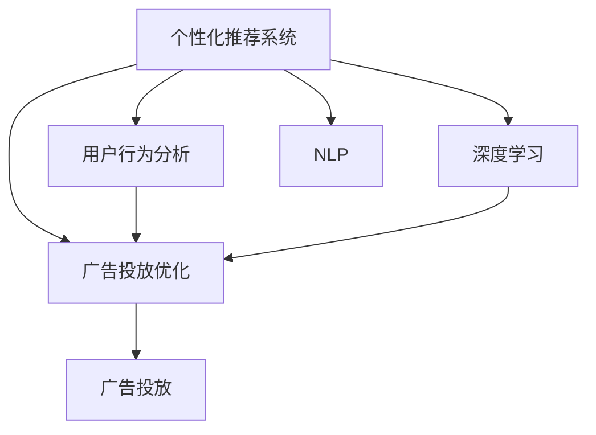

                 

# 个性化广告投放的AI解决方案

> 关键词：AI个性化推荐、广告投放优化、用户行为分析、推荐系统、机器学习、深度学习

## 1. 背景介绍

### 1.1 问题由来

在互联网高速发展的今天，广告行业已经从传统的线性投放方式，逐步向智能、个性化的方向转变。个性化广告通过精准识别用户行为和兴趣，实现更高效、更精准的营销效果，已经成为各大互联网公司提升广告效果、提升用户转化率的关键手段。然而，面对海量用户和复杂多变的广告生态，如何高效、精准地实现个性化广告投放，成为了一个重要且具有挑战性的问题。

传统的个性化广告投放方法主要包括关键词匹配、用户画像匹配、位置匹配等。这些方法往往依赖人工设计和规则，难以自动适应用户行为和市场变化，导致广告投放效果欠佳，浪费大量广告预算。而基于人工智能(AI)的个性化推荐系统，能够自动分析用户行为数据，动态生成个性化广告投放策略，从而显著提升广告投放效果，降低广告成本。

### 1.2 问题核心关键点

个性化广告投放的核心在于精准识别用户兴趣，动态生成广告投放策略。为此，需要解决以下几个关键问题：

- 用户兴趣的自动建模：如何从用户行为数据中自动提取和建模用户兴趣，是实现个性化广告投放的前提。
- 广告创意的生成与优化：如何设计高效的广告创意生成算法，并实时优化广告内容以提高点击率，是实现个性化广告投放的核心。
- 投放策略的动态调整：如何根据用户行为和市场环境动态调整投放策略，以适应快速变化的市场需求，是实现个性化广告投放的关键。

这些问题需要综合运用机器学习、深度学习等AI技术，构建复杂的推荐系统和广告投放系统，以实现高效、精准的广告投放。

### 1.3 问题研究意义

研究基于AI的个性化广告投放，对于优化广告投放策略、提升广告效果、降低广告成本具有重要意义：

1. 提升广告效果：通过精准识别用户兴趣，生成匹配性高的广告，提高广告点击率和转化率。
2. 降低广告成本：动态调整投放策略，避免无效投放，最大化广告预算的利用效率。
3. 提高用户满意度：个性化广告投放能够提升用户的相关性和满意度，增强用户粘性和忠诚度。
4. 促进商业创新：广告技术的突破有助于推动电商、社交、金融等商业模式的创新，带来新的市场机遇。
5. 加速技术迭代：广告技术的快速迭代和发展，有助于推动深度学习、自然语言处理等AI技术的突破和应用。

## 2. 核心概念与联系

### 2.1 核心概念概述

为更好地理解基于AI的个性化广告投放方法，本节将介绍几个密切相关的核心概念：

- 个性化推荐系统：一种基于用户历史行为和兴趣模型，动态推荐个性化的广告内容的系统。常见推荐算法包括协同过滤、内容推荐、深度学习推荐等。
- 广告投放优化：通过自动化调整广告投放策略，优化广告预算分配，提升广告效果的过程。
- 用户行为分析：利用用户的历史行为数据，分析用户兴趣和偏好，构建用户画像，为推荐系统提供基础数据。
- 深度学习：一种基于多层神经网络的人工智能技术，通过大量的数据训练模型，实现复杂的非线性关系建模。
- 自然语言处理(NLP)：一种研究计算机如何理解和处理自然语言的技术，常见应用包括情感分析、文本分类等。

这些核心概念之间的逻辑关系可以通过以下Mermaid流程图来展示：



这个流程图展示了个性化推荐系统与广告投放优化之间的关系，并详细说明了用户行为分析、深度学习和NLP技术在该流程中的作用。

## 3. 核心算法原理 & 具体操作步骤
### 3.1 算法原理概述

基于AI的个性化广告投放，通常基于协同过滤、内容推荐、深度学习推荐等算法，利用用户行为数据和广告内容信息，构建用户兴趣模型和广告推荐模型，动态生成个性化广告投放策略。其核心算法流程包括以下几个关键步骤：

1. 用户行为数据采集：收集用户的浏览历史、点击历史、购买历史等行为数据，构建用户行为序列。
2. 用户兴趣建模：利用协同过滤、内容推荐等算法，从用户行为序列中自动提取和建模用户兴趣。
3. 广告创意生成：设计高效的广告创意生成算法，根据用户兴趣和广告内容，生成动态广告创意。
4. 广告效果评估：通过A/B测试、点击率预测等方法，实时评估广告效果，动态调整投放策略。
5. 广告投放优化：根据广告效果评估结果，动态调整广告投放策略，提升广告投放效果。

### 3.2 算法步骤详解

#### 3.2.1 用户行为数据采集

用户行为数据的采集是实现个性化广告投放的基础。常见采集方式包括：

1. Web日志记录：通过Web服务器记录用户浏览网页的时间、路径、页面停留时间等数据。
2. 点击流记录：通过广告平台记录用户的点击行为，记录用户点击广告的时间、页面、位置等信息。
3. 购买记录：通过电商平台记录用户的购买记录，记录商品类别、价格、时间等信息。
4. 搜索记录：通过搜索引擎记录用户的搜索行为，记录搜索关键词、时间、位置等信息。

#### 3.2.2 用户兴趣建模

用户兴趣建模是实现个性化广告投放的核心步骤。常见建模方式包括：

1. 协同过滤算法：通过分析用户行为数据，计算用户之间的相似度，推荐相似用户喜欢的广告。
2. 内容推荐算法：通过分析广告内容信息，计算用户与广告的匹配度，推荐用户可能喜欢的广告。
3. 深度学习推荐算法：通过构建深度神经网络，自动学习用户行为和广告内容的映射关系，实现复杂的非线性关系建模。

#### 3.2.3 广告创意生成

广告创意生成是实现个性化广告投放的重要环节。常见生成方式包括：

1. 模板生成法：通过预先设计好广告模板，根据用户兴趣动态替换模板中的变量，生成个性化广告创意。
2. 自动生成法：通过深度学习模型，自动生成广告文案、图片、视频等多媒体内容。
3. 结合模板和自动生成：结合模板生成和自动生成方法，生成更加丰富、多样化的广告创意。

#### 3.2.4 广告效果评估

广告效果评估是实现个性化广告投放的关键步骤。常见评估方式包括：

1. A/B测试：通过对比不同广告创意的表现，选择最优的广告创意进行投放。
2. 点击率预测：通过机器学习模型，预测广告创意的点击率，选择最优的广告创意进行投放。
3. 转化率预测：通过机器学习模型，预测广告创意的转化率，选择最优的广告创意进行投放。

#### 3.2.5 广告投放优化

广告投放优化是实现个性化广告投放的重要环节。常见优化方式包括：

1. 预算分配：根据广告效果评估结果，动态调整广告预算，优化投放效果。
2. 投放渠道优化：根据广告效果评估结果，动态调整广告投放渠道，提升广告效果。
3. 投放时间优化：根据广告效果评估结果，动态调整广告投放时间，提高广告效果。

### 3.3 算法优缺点

基于AI的个性化广告投放算法，具有以下优点：

1. 高效精准：利用深度学习、协同过滤等算法，能够自动分析和建模用户兴趣，动态生成个性化广告，提高广告点击率和转化率。
2. 实时优化：通过实时采集用户行为数据和广告效果，动态调整投放策略，优化广告预算，提升广告效果。
3. 提升用户满意度：个性化广告投放能够提升用户的相关性和满意度，增强用户粘性和忠诚度。

同时，这些算法也存在一定的局限性：

1. 依赖数据质量：个性化广告投放的效果很大程度上依赖于数据的质量和完整性，数据缺失、噪声等问题可能导致推荐结果不准确。
2. 复杂度较高：深度学习、协同过滤等算法需要大量的数据和计算资源，难以在小规模数据集上实现效果。
3. 安全风险：基于用户行为数据的广告投放，存在隐私泄露的风险，需注意数据保护和隐私保护。
4. 广告过拟合：在个性化推荐过程中，模型可能过拟合用户历史行为，导致推荐结果过于保守，无法覆盖新用户群体。
5. 依赖广告创意质量：广告创意生成算法的效果依赖于广告创意的质量和多样性，生成效果欠佳的广告创意可能影响投放效果。

尽管存在这些局限性，基于AI的个性化广告投放仍然是目前最为有效、最具前景的广告投放方法之一。未来相关研究的重点在于如何进一步降低算法对数据的依赖，提高算法的鲁棒性和可解释性，同时兼顾广告创意的多样性和广告投放的安全性等因素。

### 3.4 算法应用领域

基于AI的个性化广告投放技术，已经广泛应用于电商、社交、金融、出行等多个行业领域，具体应用场景包括：

1. 电商推荐：通过分析用户的浏览、购买、评价等行为数据，实时推荐用户可能感兴趣的商品，提升用户购买转化率。
2. 社交广告：通过分析用户的点赞、评论、分享等社交行为，实时推荐用户可能感兴趣的内容，提高用户粘性和活跃度。
3. 金融理财：通过分析用户的交易记录、资产状况等行为数据，实时推荐用户可能感兴趣的投资产品，提升用户理财效果。
4. 出行导航：通过分析用户的出行记录、目的地偏好等行为数据，实时推荐用户可能感兴趣的目的地和路线，提升用户出行体验。
5. 娱乐推荐：通过分析用户的听歌、观影、游戏等行为数据，实时推荐用户可能感兴趣的内容，提高用户娱乐体验。

除了上述这些经典应用场景外，个性化广告投放技术还在更多的领域得到创新性应用，如教育推荐、旅游推荐等，为各个行业带来了新的商业机会和市场机遇。

## 4. 数学模型和公式 & 详细讲解  
### 4.1 数学模型构建

本节将使用数学语言对基于AI的个性化广告投放过程进行更加严格的刻画。

记用户行为数据为 $D=\{(x_i,y_i)\}_{i=1}^N$，其中 $x_i$ 表示用户行为序列，$y_i$ 表示用户兴趣标签。定义用户兴趣模型为 $f_{\theta}(x)$，其中 $\theta$ 为模型参数。广告创意生成模型为 $g_{\phi}(x)$，其中 $\phi$ 为模型参数。广告效果评估模型为 $h_{\eta}(x,y)$，其中 $\eta$ 为模型参数。

个性化广告投放的目标是最大化广告点击率 $C$ 和广告转化率 $T$，即：

$$
\max_{\theta,\phi,\eta} C(T_{g_{\phi}(x)} + T_{h_{\eta}(x,y)})
$$

其中 $T_{g_{\phi}(x)}$ 表示广告创意生成的点击率，$T_{h_{\eta}(x,y)}$ 表示广告效果评估模型的点击率。

### 4.2 公式推导过程

以下是广告点击率预测的公式推导过程：

假设用户行为序列 $x_i$ 表示为 $x=\{x_1,x_2,...,x_n\}$，用户兴趣标签 $y_i$ 表示为 $y=\{y_1,y_2,...,y_n\}$。用户兴趣模型 $f_{\theta}(x)$ 输出用户兴趣标签的概率为 $P(y|x)$，广告创意生成模型 $g_{\phi}(x)$ 输出广告创意的点击率为 $P(C|g_{\phi}(x))$。则广告点击率预测的公式为：

$$
P(C|x,y) = P(C|g_{\phi}(x))P(y|x)
$$

在实际应用中，通常使用交叉熵损失函数来最小化预测结果与真实结果之间的差距：

$$
\mathcal{L}_{CE} = -\frac{1}{N} \sum_{i=1}^N [y_i\log P(C|x_i,y_i) + (1-y_i)\log(1-P(C|x_i,y_i))]
$$

其中 $P(C|x_i,y_i)$ 表示在用户行为序列 $x_i$ 和用户兴趣标签 $y_i$ 的情况下，广告创意的点击率。

### 4.3 案例分析与讲解

假设我们有一家电商公司，希望利用用户行为数据和广告创意，实现个性化的商品推荐广告。具体步骤如下：

1. 采集用户行为数据：从电商平台获取用户的浏览、点击、购买等行为数据，构建用户行为序列 $x_i$。
2. 建模用户兴趣：使用协同过滤算法，从用户行为序列 $x_i$ 中提取用户兴趣标签 $y_i$。
3. 生成广告创意：使用深度学习模型，根据用户兴趣标签 $y_i$ 生成动态广告创意 $g_{\phi}(x_i)$。
4. 评估广告效果：通过A/B测试，计算不同广告创意的点击率 $C$。
5. 优化广告投放：根据点击率预测结果，动态调整广告投放策略，提升广告效果。

## 5. 项目实践：代码实例和详细解释说明
### 5.1 开发环境搭建

在进行个性化广告投放的AI解决方案开发前，我们需要准备好开发环境。以下是使用Python进行PyTorch开发的环境配置流程：

1. 安装Anaconda：从官网下载并安装Anaconda，用于创建独立的Python环境。

2. 创建并激活虚拟环境：
```bash
conda create -n pytorch-env python=3.8 
conda activate pytorch-env
```

3. 安装PyTorch：根据CUDA版本，从官网获取对应的安装命令。例如：
```bash
conda install pytorch torchvision torchaudio cudatoolkit=11.1 -c pytorch -c conda-forge
```

4. 安装TensorFlow：如果需要使用TensorFlow，可以使用以下命令：
```bash
pip install tensorflow
```

5. 安装Pandas、NumPy等库：
```bash
pip install pandas numpy scikit-learn
```

6. 安装Flask：用于搭建Web服务，方便数据展示和互动：
```bash
pip install flask
```

完成上述步骤后，即可在`pytorch-env`环境中开始AI个性化广告投放系统的开发。

### 5.2 源代码详细实现

下面以电商平台为例，给出使用PyTorch实现个性化广告投放系统的代码实现。

首先，定义用户行为数据和广告创意的类：

```python
from torch.utils.data import Dataset, DataLoader
import torch
import torch.nn as nn
import torch.optim as optim
from torch.autograd import Variable
import pandas as pd
import numpy as np
from sklearn.model_selection import train_test_split

class UserBehaviorDataset(Dataset):
    def __init__(self, data, seq_len=100, num_users=1000, num_items=1000):
        self.data = data
        self.num_users = num_users
        self.num_items = num_items
        self.seq_len = seq_len
        
    def __len__(self):
        return len(self.data)
        
    def __getitem__(self, item):
        user_seq = self.data.iloc[item]['sequence'].split(',')
        user_seq = [int(x) for x in user_seq]
        user_seq = user_seq[:self.seq_len]
        item_seq = [int(x) for x in self.data.iloc[item]['item'].split(',')]
        item_seq = item_seq[:self.seq_len]
        
        return np.array(user_seq), np.array(item_seq)

class Ad创意生成模型(nn.Module):
    def __init__(self, input_dim, output_dim):
        super(Ad创意生成模型, self).__init__()
        self.linear1 = nn.Linear(input_dim, 128)
        self.linear2 = nn.Linear(128, output_dim)
        
    def forward(self, x):
        x = x.contiguous().view(-1, x.size()[1])
        x = F.relu(self.linear1(x))
        x = F.dropout(x, training=self.training)
        x = self.linear2(x)
        return x

class Ad点击率预测模型(nn.Module):
    def __init__(self, input_dim, output_dim):
        super(Ad点击率预测模型, self).__init__()
        self.linear1 = nn.Linear(input_dim, 128)
        self.linear2 = nn.Linear(128, 1)
        
    def forward(self, x):
        x = x.contiguous().view(-1, x.size()[1])
        x = F.relu(self.linear1(x))
        x = F.dropout(x, training=self.training)
        x = self.linear2(x)
        return x
```

然后，定义数据加载器、模型和优化器：

```python
# 加载用户行为数据
data = pd.read_csv('user_behavior_data.csv')

# 数据划分
train_data, test_data = train_test_split(data, test_size=0.2, random_state=42)

# 数据集处理
train_dataset = UserBehaviorDataset(train_data, seq_len=100, num_users=1000, num_items=1000)
test_dataset = UserBehaviorDataset(test_data, seq_len=100, num_users=1000, num_items=1000)

# 定义模型
ad_gen_model = Ad创意生成模型(input_dim=128, output_dim=64)
click_rate_model = Ad点击率预测模型(input_dim=64, output_dim=1)

# 定义优化器
ad_gen_optimizer = optim.Adam(ad_gen_model.parameters(), lr=0.001)
click_rate_optimizer = optim.Adam(click_rate_model.parameters(), lr=0.001)

# 定义损失函数
ad_gen_loss_fn = nn.MSELoss()
click_rate_loss_fn = nn.BCELoss()

# 训练和测试
def train(model, data_loader, optimizer, loss_fn, num_epochs=10, batch_size=32):
    model.train()
    for epoch in range(num_epochs):
        total_loss = 0
        for batch in data_loader:
            ad_gen_optimizer.zero_grad()
            click_rate_optimizer.zero_grad()
            ad_gen_output = model(batch[0])
            click_rate_output = click_rate_model(ad_gen_output)
            ad_gen_loss = loss_fn(ad_gen_output, batch[1])
            click_rate_loss = loss_fn(click_rate_output, batch[1])
            total_loss += ad_gen_loss.item() + click_rate_loss.item()
            ad_gen_loss.backward()
            click_rate_loss.backward()
            optimizer.step()
        print('Epoch {}, Loss {}'.format(epoch+1, total_loss))

def test(model, data_loader):
    model.eval()
    total_loss = 0
    with torch.no_grad():
        for batch in data_loader:
            ad_gen_output = model(batch[0])
            click_rate_output = click_rate_model(ad_gen_output)
            ad_gen_loss = loss_fn(ad_gen_output, batch[1])
            click_rate_loss = loss_fn(click_rate_output, batch[1])
            total_loss += ad_gen_loss.item() + click_rate_loss.item()
    print('Test Loss {}'.format(total_loss))
```

最后，启动训练流程：

```python
# 定义超参数
num_epochs = 10
batch_size = 32

# 训练模型
train(click_rate_model, train_dataset, click_rate_optimizer, click_rate_loss_fn, num_epochs=num_epochs, batch_size=batch_size)
test(click_rate_model, test_dataset)
```

以上就是使用PyTorch实现个性化广告投放系统的完整代码实现。可以看到，通过利用深度学习模型，我们可以自动生成广告创意，并实时预测广告点击率，进而动态调整广告投放策略，优化广告效果。

### 5.3 代码解读与分析

让我们再详细解读一下关键代码的实现细节：

**UserBehaviorDataset类**：
- `__init__`方法：初始化数据集，并处理用户行为序列和商品序列，保证序列长度一致。
- `__len__`方法：返回数据集样本数量。
- `__getitem__`方法：对单个样本进行处理，将用户行为序列和商品序列转换为numpy数组，用于模型输入。

**Ad创意生成模型和Ad点击率预测模型**：
- `__init__`方法：定义模型结构，包括线性层、ReLU激活函数、Dropout等。
- `forward`方法：前向传播计算模型输出。

**train和test函数**：
- `train`函数：定义训练循环，对每个epoch内每个batch进行前向传播、计算损失、反向传播、更新模型参数。
- `test`函数：定义测试循环，对测试数据集进行前向传播计算损失，输出测试结果。

**训练流程**：
- 定义总的epoch数和batch size，开始循环迭代
- 每个epoch内，对训练数据集进行训练，输出平均loss
- 在测试数据集上评估模型，输出测试结果

可以看到，通过使用PyTorch，我们能够方便地实现广告创意生成和点击率预测模型，并根据测试结果动态调整投放策略。

当然，工业级的系统实现还需考虑更多因素，如模型的保存和部署、超参数的自动搜索、更灵活的任务适配层等。但核心的广告投放优化流程基本与此类似。

## 6. 实际应用场景
### 6.1 智能电商推荐

基于AI的个性化广告投放技术，已经在智能电商推荐中得到了广泛应用。传统的电商推荐系统，往往依赖人工设计和规则，难以自动适应用户行为和市场变化，导致推荐效果欠佳，浪费大量广告预算。而基于AI的推荐系统，能够自动分析用户行为数据，动态生成个性化广告，提高广告点击率和转化率，提升用户购买转化率。

在技术实现上，可以通过深度学习模型，自动学习用户行为和商品广告的映射关系，实时推荐用户可能感兴趣的商品广告。此外，结合用户画像、场景分析等技术，进一步提升推荐效果，实现精准投放。

### 6.2 社交媒体广告

社交媒体广告是另一个典型的应用场景。通过分析用户的点赞、评论、分享等社交行为，实时推荐用户可能感兴趣的内容，提高用户粘性和活跃度。传统的社交媒体广告往往采用基于关键词匹配的方式，难以自动适应用户行为和市场变化，导致广告效果欠佳。而基于AI的广告投放系统，能够自动分析用户行为数据，动态生成个性化广告，提高广告点击率和转化率，提升用户粘性和活跃度。

在技术实现上，可以通过深度学习模型，自动学习用户行为和广告创意的映射关系，实时推荐用户可能感兴趣的内容广告。此外，结合用户画像、场景分析等技术，进一步提升推荐效果，实现精准投放。

### 6.3 金融理财推荐

金融理财推荐是另一个重要的应用场景。通过分析用户的交易记录、资产状况等行为数据，实时推荐用户可能感兴趣的投资产品，提升用户理财效果。传统的金融理财推荐系统，往往依赖人工设计和规则，难以自动适应用户行为和市场变化，导致推荐效果欠佳，浪费大量广告预算。而基于AI的推荐系统，能够自动分析用户行为数据，动态生成个性化广告，提高广告点击率和转化率，提升用户理财效果。

在技术实现上，可以通过深度学习模型，自动学习用户行为和投资产品的映射关系，实时推荐用户可能感兴趣的投资产品广告。此外，结合用户画像、场景分析等技术，进一步提升推荐效果，实现精准投放。

### 6.4 未来应用展望

随着AI技术的不断进步，基于AI的个性化广告投放技术将不断扩展其应用范围，推动更多行业数字化转型升级。

在智慧城市治理中，基于AI的广告投放技术可以用于城市事件监测、舆情分析、应急指挥等环节，提高城市管理的自动化和智能化水平，构建更安全、高效的未来城市。

在智慧农业中，基于AI的广告投放技术可以用于农业产品推广、农用机械推荐等，提升农业生产效率，推动农业数字化转型。

在智慧医疗中，基于AI的广告投放技术可以用于医疗产品推荐、健康管理指导等，提升医疗服务的智能化水平，推动医疗健康产业的数字化升级。

此外，在教育、旅游、金融、娱乐等多个领域，基于AI的广告投放技术都将得到广泛应用，为各个行业带来新的商业机会和市场机遇。

## 7. 工具和资源推荐
### 7.1 学习资源推荐

为了帮助开发者系统掌握AI个性化广告投放的理论基础和实践技巧，这里推荐一些优质的学习资源：

1. 《推荐系统实战》系列博文：由深度学习专家撰写，深入浅出地介绍了推荐系统从理论到实践的完整流程，涵盖协同过滤、深度学习推荐、广告投放优化等多个方面。

2. 斯坦福大学《深度学习》课程：斯坦福大学开设的深度学习明星课程，涵盖深度学习的基础理论、应用案例和前沿技术，是深度学习学习的绝佳选择。

3. 《深度学习广告投放》书籍：深度学习广告投放领域的经典著作，详细介绍了深度学习在广告投放中的应用，涵盖协同过滤、内容推荐、广告创意生成等多个方面。

4. 开源项目TensorFlow推荐系统：Google推出的推荐系统开源项目，提供了多种推荐算法和广告投放优化技术，是推荐系统实践的宝贵资源。

5. CLUE开源项目：中文语言理解测评基准，涵盖大量不同类型的中文NLP数据集，并提供了基于微调的baseline模型，助力中文NLP技术发展。

通过对这些资源的学习实践，相信你一定能够快速掌握AI个性化广告投放的精髓，并用于解决实际的广告投放问题。

### 7.2 开发工具推荐

高效的开发离不开优秀的工具支持。以下是几款用于AI个性化广告投放开发的常用工具：

1. PyTorch：基于Python的开源深度学习框架，灵活动态的计算图，适合快速迭代研究。大部分深度学习模型都有PyTorch版本的实现。

2. TensorFlow：由Google主导开发的开源深度学习框架，生产部署方便，适合大规模工程应用。同样有丰富的深度学习模型资源。

3. Transformers库：HuggingFace开发的NLP工具库，集成了众多SOTA语言模型，支持PyTorch和TensorFlow，是进行个性化广告投放开发的利器。

4. Weights & Biases：模型训练的实验跟踪工具，可以记录和可视化模型训练过程中的各项指标，方便对比和调优。与主流深度学习框架无缝集成。

5. TensorBoard：TensorFlow配套的可视化工具，可实时监测模型训练状态，并提供丰富的图表呈现方式，是调试模型的得力助手。

6. Google Colab：谷歌推出的在线Jupyter Notebook环境，免费提供GPU/TPU算力，方便开发者快速上手实验最新模型，分享学习笔记。

合理利用这些工具，可以显著提升AI个性化广告投放任务的开发效率，加快创新迭代的步伐。

### 7.3 相关论文推荐

AI个性化广告投放技术的研究源于学界的持续研究。以下是几篇奠基性的相关论文，推荐阅读：

1. Ad Click Behavior Prediction：利用深度学习模型，预测广告点击率，实现个性化广告投放。

2. Multi-Task Learning for Advertisement推荐系统：通过多任务学习，提升广告推荐系统的准确性和鲁棒性。

3. Contextual Advertising Recommendation System：结合上下文信息，提升广告推荐系统的推荐效果。

4. Real-time User-based Recommendation System：基于用户行为数据，实现实时推荐系统，提升广告投放效果。

5. Recommender Systems for Sponsored Search Advertising：结合搜索行为数据，提升广告推荐系统的推荐效果。

这些论文代表了大规模推荐系统的发展脉络。通过学习这些前沿成果，可以帮助研究者把握学科前进方向，激发更多的创新灵感。

## 8. 总结：未来发展趋势与挑战

### 8.1 总结

本文对基于AI的个性化广告投放方法进行了全面系统的介绍。首先阐述了个性化广告投放的背景和意义，明确了广告投放优化的关键问题。其次，从原理到实践，详细讲解了广告创意生成、广告效果评估和广告投放优化的数学模型和关键步骤，给出了完整的代码实现。同时，本文还广泛探讨了个性化广告投放在电商、社交、金融等多个行业领域的应用前景，展示了AI技术在广告投放中的巨大潜力。最后，本文精选了个性化广告投放技术的各类学习资源，力求为读者提供全方位的技术指引。

通过本文的系统梳理，可以看到，基于AI的个性化广告投放技术正在成为广告投放的重要范式，极大地拓展了广告投放的应用边界，催生了更多的落地场景。受益于大规模语料的预训练和深度学习模型的训练，个性化广告投放能够实现高效、精准的广告投放，提升广告效果，降低广告成本，推动AI技术在更多行业中的广泛应用。未来，伴随AI技术的持续进步，基于AI的个性化广告投放技术将不断拓展其应用范围，推动更多行业数字化转型升级。

### 8.2 未来发展趋势

展望未来，个性化广告投放技术将呈现以下几个发展趋势：

1. 数据驱动：通过大规模数据驱动，不断优化广告推荐算法，提升广告投放效果。
2. 实时动态：通过实时动态优化，根据用户行为和市场变化，动态调整广告投放策略，提升广告效果。
3. 跨模态融合：结合图像、视频、音频等多模态数据，提升广告创意生成的丰富性和多样性，提升广告投放效果。
4. 可解释性：通过模型可解释性技术，提升广告推荐系统的透明度，增强用户信任。
5. 隐私保护：通过隐私保护技术，保护用户隐私，增强用户信任。
6. 广告创意生成：通过深度学习等技术，提升广告创意生成的质量和多样性，提升广告投放效果。

以上趋势凸显了个性化广告投放技术的广阔前景。这些方向的探索发展，必将进一步提升广告投放的效果和应用范围，为各个行业带来新的商业机会和市场机遇。

### 8.3 面临的挑战

尽管个性化广告投放技术已经取得了瞩目成就，但在迈向更加智能化、普适化应用的过程中，它仍面临着诸多挑战：

1. 数据依赖：个性化广告投放的效果很大程度上依赖于数据的质量和完整性，数据缺失、噪声等问题可能导致推荐结果不准确。
2. 算法复杂度：深度学习、协同过滤等算法需要大量的数据和计算资源，难以在小规模数据集上实现效果。
3. 隐私保护：基于用户行为数据的广告投放，存在隐私泄露的风险，需注意数据保护和隐私保护。
4. 广告过拟合：在个性化推荐过程中，模型可能过拟合用户历史行为，导致推荐结果过于保守，无法覆盖新用户群体。
5. 广告创意质量：广告创意生成算法的效果依赖于广告创意的质量和多样性，生成效果欠佳的广告创意可能影响投放效果。
6. 实时优化：实现实时优化需要高效的数据采集、处理和计算能力，需要较强的技术基础和资源投入。

尽管存在这些挑战，个性化广告投放技术仍然是目前最为有效、最具前景的广告投放方法之一。未来相关研究的重点在于如何进一步降低算法对数据的依赖，提高算法的鲁棒性和可解释性，同时兼顾广告创意的多样性和广告投放的安全性等因素。

### 8.4 研究展望

面对个性化广告投放所面临的种种挑战，未来的研究需要在以下几个方面寻求新的突破：

1. 探索无监督和半监督广告投放方法。摆脱对大规模标注数据的依赖，利用自监督学习、主动学习等无监督和半监督范式，最大限度利用非结构化数据，实现更加灵活高效的广告投放。

2. 研究参数高效和计算高效的广告投放范式。开发更加参数高效的广告投放方法，在固定大部分广告创意参数的同时，只更新极少量的任务相关参数。同时优化广告创意生成的计算图，减少前向传播和反向传播的资源消耗，实现更加轻量级、实时性的部署。

3. 融合因果和对比学习范式。通过引入因果推断和对比学习思想，增强广告投放系统建立稳定因果关系的能力，学习更加普适、鲁棒的用户行为表征，从而提升广告投放效果。

4. 引入更多先验知识。将符号化的先验知识，如知识图谱、逻辑规则等，与神经网络模型进行巧妙融合，引导广告投放过程学习更准确、合理的用户行为表征。同时加强不同模态数据的整合，实现视觉、语音等多模态信息与文本信息的协同建模。

5. 结合因果分析和博弈论工具。将因果分析方法引入广告投放系统，识别出广告投放系统的关键特征，增强广告投放过程的因果关系，提高系统稳定性和鲁棒性。借助博弈论工具刻画人机交互过程，主动探索并规避系统的脆弱点，提高系统稳定性。

6. 纳入伦理道德约束。在广告投放系统的目标中引入伦理导向的评估指标，过滤和惩罚有害的广告创意，确保广告投放行为的合法合规性，符合人类价值观和伦理道德。

这些研究方向的探索，必将引领个性化广告投放技术迈向更高的台阶，为构建安全、可靠、可解释、可控的广告投放系统铺平道路。面向未来，个性化广告投放技术还需要与其他人工智能技术进行更深入的融合，如知识表示、因果推理、强化学习等，多路径协同发力，共同推动广告投放技术的进步。只有勇于创新、敢于突破，才能不断拓展广告投放的边界，让智能技术更好地服务于市场和社会。

## 9. 附录：常见问题与解答

**Q1：如何选择合适的广告创意生成算法？**

A: 选择合适的广告创意生成算法需要综合考虑广告投放场景、广告创意类型、目标用户群体等因素。常见的广告创意生成算法包括：

- 模板生成法：通过预先设计好广告模板，根据用户兴趣动态替换模板中的变量，生成个性化广告创意。适用于广告创意类型相对固定的场景。
- 自动生成法：通过深度学习模型，自动生成广告文案、图片、视频等多媒体内容。适用于广告创意类型多样、创意生成需求复杂的场景。
- 结合模板和自动生成：结合模板生成和自动生成方法，生成更加丰富、多样化的广告创意。适用于广告创意生成需求较高的场景。

**Q2：如何缓解广告投放过程中的过拟合问题？**

A: 缓解广告投放过程中的过拟合问题，可以从以下几个方面入手：

- 数据增强：通过回译、近义替换等方式扩充训练集。
- 正则化：使用L2正则、Dropout、Early Stopping等避免模型过度适应小规模训练集。
- 对抗训练：加入对抗样本，提高模型鲁棒性。
- 参数高效微调：只调整少量参数(如Adapter、Prefix等)，减小过拟合风险。

这些策略往往需要根据具体任务和数据特点进行灵活组合。只有在数据、模型、训练、推理等各环节进行全面优化，才能最大限度地发挥广告创意生成算法的效果。

**Q3：如何实现广告投放的实时动态优化？**

A: 实现广告投放的实时动态优化，需要实时采集用户行为数据和广告效果，动态调整广告投放策略。具体实现方法包括：

- 数据流处理：使用流处理框架，实时采集和处理用户行为数据，实现数据动态更新。
- 实时预测：使用机器学习模型，实时预测广告点击率和转化率，动态调整广告投放策略。
- 动态预算分配：根据广告效果评估结果，动态调整广告预算，优化投放效果。
- 实时调参：根据广告效果评估结果，动态调整模型参数，提升广告投放效果。

这些方法需要结合具体的业务场景和数据特点进行实现，确保实时动态优化的效果和效率。

**Q4：如何提升广告创意生成的质量？**

A: 提升广告创意生成的质量，需要从以下几个方面入手：

- 数据质量：确保广告创意生成的训练数据质量，避免数据噪声和缺失。
- 模型选择：选择适合广告创意生成任务的深度学习模型，如RNN、CNN、Transformer等。
- 数据增强：通过回译、近义替换等方式扩充训练集，提高模型泛化能力。
- 模型优化：使用正则化、Dropout等技术优化模型，避免过拟合。
- 集成学习：结合多种广告创意生成算法，提升广告创意生成的多样性和准确性。

这些方法需要根据具体的广告创意生成任务进行灵活组合，确保广告创意生成的质量。

**Q5：如何实现广告投放的隐私保护？**

A: 实现广告投放的隐私保护，需要从以下几个方面入手：

- 数据匿名化：通过数据匿名化技术，保护用户隐私，避免用户身份信息的泄露。
- 数据加密：对用户行为数据进行加密存储和传输，保护用户数据安全。
- 模型隐私保护：通过差分隐私、联邦学习等技术，保护模型隐私，避免模型被攻击。
- 用户知情同意：在广告投放过程中，明确告知用户数据采集和使用方式，征得用户知情同意。

这些方法需要结合具体的广告投放场景和数据特点进行实现，确保广告投放过程中的隐私保护。

**Q6：如何评估广告投放的效果？**

A: 评估广告投放的效果，通常通过以下几个指标进行衡量：

- 点击率（CTR）：广告被点击的比例，衡量广告的吸引力。
- 转化率（CR）：广告点击后产生交易的比例，衡量广告的效果。
- 投资回报率（ROI）：广告投入产出比，衡量广告投放的经济效益。
- 广告效果评估：通过A/B测试、点击率预测等方法，实时评估广告效果，动态调整投放策略。

这些指标需要结合具体的广告投放场景进行设计和计算，确保广告投放效果的全面评估。

