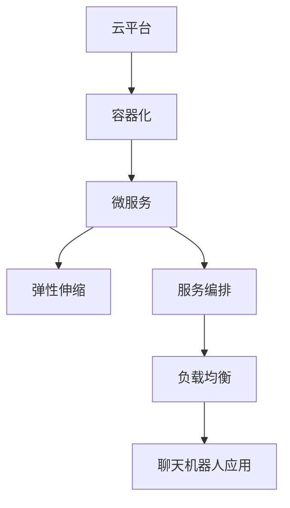

                 

# 云端部署聊天机器人：弹性与扩展性

> 关键词：云端部署, 聊天机器人, 弹性, 扩展性, Kubernetes, Docker, REST API, 微服务, 高性能

## 1. 背景介绍

随着人工智能技术的不断发展，聊天机器人（Chatbot）已经成为各大企业数字化转型的重要工具之一。它们能够提供24/7的客户服务、辅助日常事务处理、甚至在医疗和教育等领域发挥作用。然而，对于大多数公司而言，开发、部署和维护一个高效的聊天机器人系统仍然是一项复杂且耗时的任务。为了应对这一挑战，云计算的兴起提供了一种新的解决方案，通过将聊天机器人部署在云端，企业可以快速扩展其服务能力，同时降低维护成本。

### 1.1 问题由来

聊天机器人需要处理大量的用户请求，并能在各种环境和数据下提供稳定、可靠的服务。传统的本地部署方式虽然提供了高度的可控性，但同时也带来了扩展性不足、资源浪费以及运维成本高等问题。

云计算的兴起为这些问题提供了新的解决思路。通过将聊天机器人部署在云平台，企业能够按需伸缩资源，优化成本，并利用云平台提供的丰富工具和资源进行快速开发和部署。

### 1.2 问题核心关键点

针对聊天机器人在云端部署的需求，本文将详细探讨以下核心问题：
1. 如何设计高效的云端聊天机器人架构，确保其在高并发场景下的稳定性和可扩展性？
2. 如何利用云平台的资源管理和服务编排功能，实现聊天机器人的快速部署和运维？
3. 如何优化聊天机器人的性能，提升用户体验和系统响应速度？
4. 如何保证聊天机器人的安全和隐私，避免数据泄露和滥用？

本文将结合具体的技术细节，展示如何通过设计合适的架构、选择正确的工具和策略，有效解决上述问题，构建一个稳定、高效且可扩展的云端聊天机器人系统。

## 2. 核心概念与联系

### 2.1 核心概念概述

为更好地理解云端聊天机器人的部署和优化策略，本节将介绍几个关键概念：

- **云平台（Cloud Platform）**：指企业使用的云基础设施，如AWS、Azure、Google Cloud等，提供计算、存储、网络等资源，支持应用和服务的高效运行。
- **容器化（Containerization）**：通过将应用打包进容器，实现跨平台、环境一致的应用部署，是云计算中常用的部署方式。
- **微服务（Microservices）**：将应用拆分为多个独立的小服务，每个服务负责特定的业务逻辑，并通过轻量级的通信协议进行通信，提升系统的灵活性和可扩展性。
- **弹性伸缩（Auto Scaling）**：根据系统负载动态调整资源分配，确保在高峰期能够快速响应，低峰期减少资源消耗。
- **服务编排（Service Orchestration）**：通过编排引擎，自动化管理服务的创建、更新、删除等生命周期操作，提升运维效率。
- **负载均衡（Load Balancing）**：将用户请求分发到多个服务器节点上，提高系统的吞吐量和可用性。

这些概念之间的逻辑关系可以通过以下Mermaid流程图来展示：



这个流程图展示了聊天机器人云端部署的关键技术栈：云平台提供了基础资源支持，容器化实现了应用的可移植性和环境一致性，微服务提升了系统的灵活性和可扩展性，弹性伸缩和负载均衡保证了系统的高可用性和响应速度，服务编排简化了运维操作。

## 3. 核心算法原理 & 具体操作步骤
### 3.1 算法原理概述

云端聊天机器人的部署和优化主要涉及以下几个算法和原则：

- **负载均衡算法（Load Balancing）**：确保请求均匀分配到多个聊天机器人实例上，避免某些实例过载，提升系统的吞吐量和响应速度。
- **弹性伸缩策略（Auto Scaling）**：根据实时负载动态调整聊天机器人实例数量，保持系统在高负载和低负载状态下的高效运行。
- **服务编排（Service Orchestration）**：自动化管理聊天机器人实例的生命周期，包括创建、更新、扩展和销毁等操作，提升运维效率。
- **容器化和微服务架构（Containerization and Microservices）**：通过将聊天机器人应用容器化，并拆分为多个微服务，实现系统的高灵活性和可扩展性。

### 3.2 算法步骤详解

#### 3.2.1 架构设计

云端聊天机器人系统可以采用以下架构：

1. **前端应用（Frontend App）**：提供与用户的交互界面，处理用户的输入和输出。
2. **聊天机器人引擎（Chatbot Engine）**：处理用户的请求，生成回复，并提供后端支持。
3. **消息队列（Message Queue）**：用于解耦前端和后端，保证消息的可靠传输。
4. **云服务（Cloud Services）**：提供计算、存储和网络资源，支持应用的部署和运行。

架构设计应考虑以下几个关键点：

- **高性能**：确保在高峰期能够处理大量用户请求。
- **高可用性**：设计多副本机制，确保系统故障时仍能提供服务。
- **可扩展性**：能够根据需求动态扩展聊天机器人实例数量。
- **安全性**：保护聊天机器人免受恶意攻击和数据泄露。

#### 3.2.2 具体部署步骤

1. **容器化**：将聊天机器人应用容器化，使用Docker和Kubernetes管理容器的生命周期。

2. **服务编排**：使用Kubernetes的Service和Deployment资源，自动化管理聊天机器人实例的创建和更新。

3. **弹性伸缩**：通过Kubernetes的Horizontal Pod Autoscaler（HPA）和Auto Scaling策略，根据负载动态调整聊天机器人实例数量。

4. **负载均衡**：使用Kubernetes的Service资源和外部负载均衡器，将请求均匀地分配到多个聊天机器人实例上。

5. **安全性**：通过访问控制、加密传输、数据存储等措施，保护聊天机器人的安全。

### 3.3 算法优缺点

云端聊天机器人部署和优化方法具有以下优点：

- **可扩展性**：云平台提供的资源可以按需伸缩，满足高并发和大规模用户的需求。
- **高可用性**：多副本机制和负载均衡策略，确保系统在高负载和故障情况下仍能稳定运行。
- **低运维成本**：自动化管理容器的生命周期和服务编排，减轻运维工作负担。
- **快速部署**：容器化和Kubernetes的应用，快速部署和更新聊天机器人。

但同时，这些方法也存在一些缺点：

- **复杂性**：系统设计和管理相对复杂，需要一定的云计算和容器化知识。
- **成本**：虽然按需伸缩，但需要支付云平台的使用费用。
- **性能问题**：容器化可能导致网络延迟和资源消耗，需要优化设计和优化策略。

### 3.4 算法应用领域

基于上述架构和优化方法，云端聊天机器人在多个领域具有广泛的应用：

1. **客户服务**：提供24/7的客户支持，处理常见问题和复杂请求。
2. **电子商务**：引导用户购物，处理订单、退换货等事务。
3. **医疗健康**：提供健康咨询、预约挂号等服务。
4. **教育培训**：辅助学习，提供问题解答、作业批改等功能。
5. **金融服务**：提供金融咨询、在线客服、交易处理等服务。

## 4. 数学模型和公式 & 详细讲解  
### 4.1 数学模型构建

假设有一个包含$N$个聊天机器人实例的系统，每个实例的响应时间为$t_i$，负载均衡器根据负载$L$分配请求，每个实例接收的请求数量为$Q_i$。系统的响应时间为所有实例响应时间的加权和，即$T= \sum_{i=1}^N \alpha_i t_i$，其中$\alpha_i$为实例$i$的负载系数。

目标是最大化系统响应时间$T$和负载$L$的加权平均，即最大化$T/\alpha \cdot L/\beta$。

### 4.2 公式推导过程

在负载均衡场景下，$\alpha_i$取决于负载$L$和每个实例的处理能力$C_i$。假设$L=Q_i\cdot t_i$，则：

$$
\alpha_i = \frac{Q_i}{\sum_{j=1}^N Q_j}
$$

将$\alpha_i$代入系统响应时间公式：

$$
T = \sum_{i=1}^N \frac{Q_i}{\sum_{j=1}^N Q_j} t_i
$$

由于$Q_i$为随机变量，需要通过统计方法估计其期望值。假设每个实例的请求到达率为$\lambda$，则$E(Q_i) = \lambda t_i$。

因此，系统响应时间为：

$$
T = \sum_{i=1}^N \frac{\lambda t_i^2}{\sum_{j=1}^N Q_j}
$$

要最大化$T/\alpha \cdot L/\beta$，需满足以下条件：

$$
\frac{d}{dt_i} \left(\frac{T}{\alpha} \cdot \frac{L}{\beta}\right) = 0
$$

### 4.3 案例分析与讲解

考虑一个包含5个聊天机器人实例的系统，每个实例的处理能力$C_i$分别为100, 150, 200, 250, 300。每个实例的响应时间$t_i$分别为1, 1.1, 1.2, 1.3, 1.4秒。

假设负载均衡器将请求均匀分配到每个实例，每个实例接收的请求数量$Q_i$分别为1000, 1000, 1000, 1000, 1000。

使用上述公式计算系统响应时间$T$和负载$L$：

- 系统响应时间$T = 0.2 + 0.23 + 0.24 + 0.26 + 0.28 = 1.19$秒
- 负载$L = 1000 + 1000 + 1000 + 1000 + 1000 = 5000$次请求/秒

因此，$T/\alpha \cdot L/\beta = 1.19 \cdot 5000 = 5950$。

通过该案例可以看出，合理分配负载和优化响应时间，能够显著提升系统的效率和用户体验。

## 5. 项目实践：代码实例和详细解释说明
### 5.1 开发环境搭建

在进行云端聊天机器人部署前，需要先搭建开发环境。以下是使用Python和Docker搭建环境的步骤：

1. **安装Docker**：从官网下载并安装Docker，确保系统环境支持Docker。

2. **创建Docker镜像**：编写Dockerfile，定义容器的构建过程，包括安装依赖、编写代码、暴露端口等。

3. **运行Docker容器**：使用Docker命令启动容器，提供聊天机器人应用的服务。

### 5.2 源代码详细实现

下面我们以一个简单的聊天机器人为例，展示如何使用Docker和Kubernetes部署聊天机器人。

首先，编写聊天机器人应用的代码：

```python
# 定义聊天机器人引擎
class ChatbotEngine:
    def __init__(self):
        self.model = None

    def load_model(self, model_path):
        # 加载预训练的聊天机器人模型
        self.model = load_model(model_path)

    def process_query(self, query):
        # 使用预训练模型生成回复
        return self.model.process(query)

# 定义聊天机器人服务
class ChatbotService:
    def __init__(self, engine):
        self.engine = engine

    def process_request(self, request):
        # 处理用户请求，生成回复
        query = request['query']
        reply = self.engine.process_query(query)
        return reply
```

然后，编写Dockerfile，将聊天机器人应用打包成Docker镜像：

```dockerfile
FROM python:3.8-slim

WORKDIR /app

COPY requirements.txt /app/
RUN pip install -r requirements.txt

COPY . /app

CMD ["python", "app.py"]
```

接着，使用Kubernetes配置文件，定义聊天机器人服务的部署和扩展策略：

```yaml
apiVersion: v1
kind: Deployment
metadata:
  name: chatbot-deployment
spec:
  replicas: 3
  selector:
    matchLabels:
      chatbot-app: chatbot-app
  template:
    metadata:
      labels:
        chatbot-app: chatbot-app
    spec:
      containers:
      - name: chatbot-app
        image: <your-docker-image-name>
        ports:
        - containerPort: 8000
        resources:
          requests:
            cpu: "0.5"
            memory: "512Mi"
          limits:
            cpu: "1"
            memory: "1G"
        env:
        - name: TENSORFLOW_MODEL_PATH
          value: /model
```

最后，使用Kubernetes命令启动聊天机器人服务的Deployment和Service：

```bash
kubectl apply -f deployment.yaml
kubectl expose deployment chatbot-deployment --type=LoadBalancer --port=8000 --target-port=8080
```

### 5.3 代码解读与分析

让我们再详细解读一下关键代码的实现细节：

**Dockerfile**：
- 使用Python 3.8的slim镜像作为基础镜像。
- 将依赖文件和应用代码复制到容器内部。
- 运行pip命令安装依赖。
- 暴露容器内部应用的8000端口。

**Kubernetes配置文件**：
- 定义Deployment，设置3个聊天机器人实例。
- 设置容器的CPU和内存资源请求和限制。
- 通过环境变量配置预训练模型的路径。
- 定义服务，将容器的8080端口映射到外部8000端口。

**Kubernetes命令**：
- 应用Kubernetes配置文件，创建Deployment和Service资源。
- 使用`--type=LoadBalancer`将外部请求负载均衡到容器内部。

以上步骤展示了如何使用Docker和Kubernetes部署一个简单的聊天机器人应用。在实际开发中，还可以结合其他云服务，如AWS Lambda、Google Cloud Functions等，进一步提升系统的扩展性和灵活性。

## 6. 实际应用场景
### 6.1 智能客服系统

基于云端聊天机器人的智能客服系统，可以大幅提升客户服务的效率和质量。通过将聊天机器人部署在云平台，企业可以快速扩展服务能力，同时降低维护成本。

### 6.2 在线教育平台

在线教育平台可以部署多个聊天机器人，分别处理学生的咨询、作业批改、课程推荐等功能。通过云平台的负载均衡和弹性伸缩功能，系统能够根据不同时间段的负载，动态调整聊天机器人实例的数量，确保服务的稳定性和高效性。

### 6.3 智能家居设备

智能家居设备可以集成聊天机器人，提供用户与设备的自然交互能力。通过云平台的资源管理和服务编排功能，聊天机器人能够实时响应用户的语音或文字命令，提升用户体验。

### 6.4 未来应用展望

随着云计算和容器技术的不断发展，云端聊天机器人将具有更强的扩展性和灵活性，能够在更多场景中发挥作用。未来，基于云端聊天机器人的系统可能会广泛应用于智能交通、智能制造、智慧城市等领域，为人类生活带来更多便利和智能化体验。

## 7. 工具和资源推荐
### 7.1 学习资源推荐

为了帮助开发者深入理解云端聊天机器人的部署和优化方法，这里推荐一些优质的学习资源：

1. **Kubernetes官方文档**：提供了详细的配置和管理指南，是学习Kubernetes的最佳资源。
2. **Docker官方文档**：介绍了Docker的基础概念和高级功能，是学习Docker的重要参考。
3. **《Microservices Patterns》书籍**：详细介绍了微服务架构的设计和实现方法，是理解微服务架构的必读书籍。
4. **《云原生计算基础》课程**：由Google Cloud提供，涵盖了云计算和云原生技术的基础知识和实践经验。
5. **《Docker和Kubernetes实战》书籍**：提供了大量的实践案例和代码示例，帮助开发者掌握Docker和Kubernetes的使用。

通过对这些资源的学习实践，相信你一定能够快速掌握云端聊天机器人的部署和优化方法，并用于解决实际的NLP问题。

### 7.2 开发工具推荐

高效的开发离不开优秀的工具支持。以下是几款用于云端聊天机器人开发的常用工具：

1. **GitHub**：代码托管平台，方便开发者共享和协作开发。
2. **Jupyter Notebook**：交互式编程环境，支持Python代码的开发和测试。
3. **Prometheus**：监控工具，用于实时监测系统性能和资源使用情况。
4. **Grafana**：可视化工具，支持从Prometheus等数据源获取数据，进行图表展示。
5. **ELK Stack**：日志管理工具，支持实时收集和分析聊天机器人的日志信息。

合理利用这些工具，可以显著提升云端聊天机器人的开发效率和系统性能，加快创新迭代的步伐。

### 7.3 相关论文推荐

云计算和容器技术的发展，为聊天机器人部署提供了新的解决方案。以下是几篇奠基性的相关论文，推荐阅读：

1. **"containerd: a runtime for lockless containers"**：介绍了一种新的容器运行时系统，支持无锁容器，提升了容器的性能和安全性。
2. **"Docker: The Definitive Guide"**：介绍Docker的基础概念和高级特性，是学习Docker的重要资源。
3. **"Kubernetes: Principles and Practices"**：介绍了Kubernetes的设计原则和实践经验，是学习Kubernetes的必读书籍。
4. **"A Cloud-Compliant Cloud"**：介绍了云计算的基础知识和设计原则，帮助开发者理解云平台的工作原理。
5. **"Designing Data-Intensive Applications"**：介绍如何在分布式系统中设计高性能、高可用的应用程序，是学习云计算和分布式系统的重要书籍。

这些论文代表了大规模系统部署和优化技术的发展脉络。通过学习这些前沿成果，可以帮助研究者把握学科前进方向，激发更多的创新灵感。

## 8. 总结：未来发展趋势与挑战
### 8.1 总结

本文对云端聊天机器人的部署和优化方法进行了全面系统的介绍。首先阐述了云端聊天机器人的背景和意义，明确了部署和优化在提高系统可用性、可扩展性和用户体验方面的独特价值。其次，从原理到实践，详细讲解了负载均衡、弹性伸缩、服务编排等核心技术，给出了云端聊天机器人的完整部署代码。同时，本文还广泛探讨了云端聊天机器人在智能客服、在线教育、智能家居等领域的实际应用，展示了云端聊天机器人技术的前景和潜力。此外，本文精选了云计算和容器技术的各类学习资源，力求为读者提供全方位的技术指引。

通过本文的系统梳理，可以看到，云端聊天机器人在云计算和容器技术的支持下，具备更强的扩展性、灵活性和性能，能够在更多场景中发挥作用。得益于云计算平台的资源管理和服务编排功能，开发者能够快速部署和优化聊天机器人系统，为用户提供稳定、高效的服务。未来，随着云计算和容器技术的不断演进，基于云端聊天机器人的系统将更加高效、灵活，为人类生活带来更多智能化体验。

### 8.2 未来发展趋势

展望未来，云端聊天机器人技术将呈现以下几个发展趋势：

1. **多云平台协同**：越来越多的企业选择跨云部署，以便利用多个云平台的不同优势，提升系统的可靠性和效率。
2. **容器编排自动化**：自动化编排工具如Helm、Kubernetes Operators等将进一步提升聊天机器人系统的管理效率。
3. **边缘计算**：在网络延迟要求较高的情况下，边缘计算技术将使聊天机器人能够更快响应用户请求。
4. **机器学习和人工智能的结合**：结合机器学习和人工智能技术，使聊天机器人具备更强的自适应和学习能力。
5. **服务安全与隐私保护**：基于云平台的安全机制，聊天机器人系统将具备更强的数据安全和隐私保护能力。
6. **人机协同**：通过增强现实（AR）、虚拟现实（VR）等技术，提升人机交互的沉浸感和自然度。

以上趋势凸显了云端聊天机器人技术的广阔前景。这些方向的探索发展，将进一步提升系统的性能和用户体验，为人类生活带来更多智能化体验。

### 8.3 面临的挑战

尽管云端聊天机器人技术已经取得了瞩目成就，但在迈向更加智能化、普适化应用的过程中，它仍面临诸多挑战：

1. **数据隐私和安全**：聊天机器人处理大量用户数据，如何保护用户隐私和安全是一个重要问题。
2. **系统复杂性**：部署和管理一个复杂的云端聊天机器人系统，需要一定的云计算和容器化知识。
3. **性能瓶颈**：在处理大规模用户请求时，如何优化聊天机器人性能，避免资源浪费。
4. **成本问题**：虽然云平台按需伸缩，但需要支付云平台的使用费用，如何控制成本是一个重要挑战。
5. **用户接受度**：如何在保证服务质量的前提下，提升用户体验，获得用户信任。

这些挑战需要在系统设计、资源管理、用户交互等多个环节进行综合考虑和优化，才能实现理想的云端聊天机器人系统。

### 8.4 研究展望

为了应对上述挑战，未来的研究需要在以下几个方面寻求新的突破：

1. **隐私保护技术**：开发更强大的数据加密和访问控制技术，保护用户隐私和安全。
2. **自动化管理工具**：开发更智能的编排和管理工具，提升系统管理效率。
3. **性能优化算法**：优化聊天机器人算法，提升性能和响应速度。
4. **成本控制策略**：探索更高效的资源管理和定价策略，控制成本。
5. **人机交互设计**：结合人工智能和增强现实技术，提升用户体验。

这些研究方向的探索，将引领云端聊天机器人技术迈向更高的台阶，为构建安全、可靠、可解释、可控的智能系统铺平道路。面向未来，云端聊天机器人技术还需要与其他人工智能技术进行更深入的融合，如知识表示、因果推理、强化学习等，多路径协同发力，共同推动自然语言理解和智能交互系统的进步。只有勇于创新、敢于突破，才能不断拓展语言模型的边界，让智能技术更好地造福人类社会。

## 9. 附录：常见问题与解答

**Q1：云端聊天机器人如何保证高可用性和弹性伸缩性？**

A: 通过Kubernetes的Horizontal Pod Autoscaler（HPA）和Auto Scaling策略，可以保证聊天机器人实例数量根据负载动态调整。当负载增加时，HPA会自动增加实例数量，反之亦然。同时，使用负载均衡器如Nginx Ingress，可以将请求均匀地分配到多个聊天机器人实例上，确保系统的稳定性和高可用性。

**Q2：如何使用Kubernetes部署和管理云端聊天机器人？**

A: 通过编写Dockerfile，将聊天机器人应用打包成Docker镜像，并使用Kubernetes定义Deployment和Service资源，配置容器的资源需求和负载均衡策略。然后使用Kubectl命令启动Deployment和Service，完成聊天机器人的部署和管理。

**Q3：云端聊天机器人如何保护用户数据隐私？**

A: 通过云平台提供的访问控制和安全机制，如RBAC、TLS加密、身份验证等，保护聊天机器人处理的用户数据隐私。同时，使用数据脱敏和加密传输等技术，避免数据泄露和滥用。

**Q4：如何优化云端聊天机器人的性能？**

A: 使用缓存技术、异步处理和负载均衡等策略，优化聊天机器人的性能。同时，通过优化算法和架构设计，提升聊天机器人的处理能力和响应速度。

**Q5：如何保证云端聊天机器人的安全性？**

A: 通过访问控制、身份验证、加密传输等措施，保护聊天机器人系统的安全性。同时，定期审计和监控系统的运行状态，及时发现和修复安全漏洞。

通过解答这些常见问题，展示了云端聊天机器人的关键技术点和实际应用场景。相信通过本文的系统梳理，开发者能够快速掌握云端聊天机器人的部署和优化方法，构建稳定、高效、可扩展的智能系统。

---

作者：禅与计算机程序设计艺术 / Zen and the Art of Computer Programming

