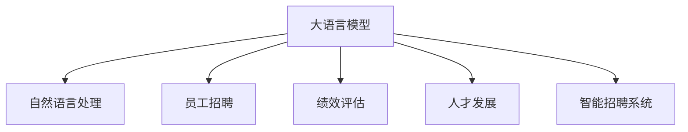

                 

# 人力资源和 LLM：高效的人才管理

> 关键词：人力资源管理, LLM大模型, 员工招聘, 绩效评估, 人才发展, 智能招聘系统

## 1. 背景介绍

### 1.1 问题由来
随着企业规模的不断扩大和市场竞争的日益激烈，人力资源管理面临着越来越多的挑战。传统的HR流程，如招聘、培训、绩效评估等，耗时长、成本高，且容易产生人为偏见。而大语言模型（Large Language Model, LLM）的崛起，为HR管理带来了全新的解决方案。

LLM大模型，如OpenAI的GPT-3和谷歌的BERT，具有强大的自然语言处理能力，能够理解文本中的复杂语义，进行高效的数据处理和分析。通过引入LLM技术，人力资源管理可以实现自动化、智能化，大幅提升工作效率和决策质量。

### 1.2 问题核心关键点
LLM在人力资源管理中的应用，主要集中在以下几个关键领域：

1. **员工招聘**：通过解析简历和职位描述，自动匹配合适的候选人。
2. **绩效评估**：利用自然语言理解能力，分析员工工作表现，给出客观评价。
3. **人才发展**：根据员工的职业兴趣和潜力，制定个性化的发展计划。
4. **智能招聘系统**：整合招聘、培训、绩效评估等多个模块，形成闭环的人才管理体系。

本文将详细探讨LLM在人力资源管理中的应用，特别是招聘和绩效评估环节，如何通过LLM技术实现高效的人才管理。

## 2. 核心概念与联系

### 2.1 核心概念概述

为了更好地理解LLM在人力资源管理中的应用，本节将介绍几个密切相关的核心概念：

- **大语言模型 (LLM)**：指通过大规模无监督训练得到的预训练语言模型，如GPT-3、BERT等。能够理解并生成自然语言，具有强大的语言理解和生成能力。

- **自然语言处理 (NLP)**：指使用计算机对自然语言进行理解、处理和生成的一系列技术，包括文本分类、情感分析、命名实体识别等。

- **知识图谱**：指通过实体、关系和属性构成的语义网络，用于描述和表示实体间的关系，支持知识推理和应用。

- **员工招聘**：指企业根据业务需求，招聘合适的人选以填补职位空缺的过程。

- **绩效评估**：指根据员工在工作中的表现，综合考虑多维度指标，给出科学客观的评价。

- **人才发展**：指根据员工的职业兴趣、潜力，制定个性化的培训和发展计划，帮助其提升职业技能，实现职业发展。

- **智能招聘系统**：指将招聘、培训、绩效评估等模块整合，形成闭环的人才管理体系，提升人力资源管理的智能化水平。

这些核心概念之间的逻辑关系可以通过以下Mermaid流程图来展示：



这个流程图展示了大语言模型在人力资源管理中的应用场景及其之间的联系：

1. 大语言模型通过自然语言处理能力，提升招聘、绩效评估、人才发展等环节的智能化水平。
2. 员工招聘、绩效评估、人才发展等环节都依赖于大语言模型的自然语言理解和生成能力。
3. 智能招聘系统集成多个模块，形成闭环的人才管理体系，进一步提升人力资源管理的智能化和效率。

## 3. 核心算法原理 & 具体操作步骤
### 3.1 算法原理概述

在人力资源管理中应用大语言模型，本质上是一种基于自然语言处理的技术手段。其核心思想是：将招聘、绩效评估、人才发展等过程转化为自然语言描述的任务，通过LLM模型的预训练和微调，提升模型在特定任务上的性能，从而实现自动化、智能化的HR管理。

### 3.2 算法步骤详解

以下步骤详细介绍了LLM在人力资源管理中的应用流程：

**Step 1: 收集和预处理数据**

1. **数据收集**：收集企业历史招聘信息、员工绩效记录、职业发展规划等文本数据。数据来源包括简历、员工评价、培训记录等。

2. **数据预处理**：清洗和标准化数据，如去除无用信息、统一数据格式等。使用文本分词、去停用词、词干提取等NLP技术对文本进行处理。

**Step 2: 模型训练和微调**

1. **选择模型**：根据应用场景选择合适的预训练模型，如GPT-3、BERT等。

2. **数据划分**：将数据集划分为训练集、验证集和测试集。

3. **微调模型**：在训练集上微调预训练模型，使其在特定任务上表现更优。

4. **模型评估**：在验证集和测试集上评估微调后的模型性能，根据评估结果进行必要的调参优化。

**Step 3: 应用模型进行预测和分析**

1. **员工招聘**：使用微调后的模型对简历进行自动筛选和排序，根据职位需求匹配合适的候选人。

2. **绩效评估**：利用模型分析员工的工作表现和产出，给出客观的绩效评价。

3. **人才发展**：根据员工的职业兴趣和潜力，推荐适合的培训和发展路径。

4. **智能招聘系统**：集成上述模块，形成闭环的人才管理体系，提升整体效率和效果。

### 3.3 算法优缺点

使用LLM技术进行人力资源管理的优势包括：

1. **自动化程度高**：自动化处理文本数据，减少人工干预，提升工作效率。

2. **数据处理能力强**：能够处理海量文本数据，快速分析处理信息。

3. **决策更科学**：基于数据驱动的智能决策，减少人为偏见，提升决策质量。

4. **适应性强**：对数据和任务的多样性具有良好的适应能力，能够灵活应对不同的业务需求。

5. **易于扩展**：可以通过增加数据和调整模型参数，不断优化性能。

但同时，该方法也存在一些局限性：

1. **对数据质量依赖高**：模型效果很大程度上取决于数据的质量和完整性。

2. **解释性不足**：模型输出缺乏可解释性，难以理解其内部工作机制。

3. **高计算成本**：大语言模型需要大量的计算资源进行训练和推理，可能面临高昂的计算成本。

4. **偏见问题**：模型可能继承数据中的偏见，导致不公平的决策。

5. **技术门槛高**：需要具备一定的NLP和机器学习知识，才能有效应用大语言模型。

### 3.4 算法应用领域

基于LLM的HR管理技术，已经在招聘、绩效评估、人才发展等多个领域得到了广泛应用：

1. **员工招聘**：使用LLM对简历进行自动筛选和排序，快速找到最合适的候选人。

2. **绩效评估**：利用自然语言理解能力，分析员工的工作表现，给出科学客观的评价。

3. **人才发展**：根据员工的职业兴趣和潜力，制定个性化的培训和发展计划。

4. **智能招聘系统**：集成招聘、绩效评估、人才发展等多个模块，形成闭环的人才管理体系。

除了上述这些经典应用外，LLM技术还被创新性地应用到更多场景中，如员工情感分析、员工满意度调查等，为HR管理带来了全新的突破。

## 4. 数学模型和公式 & 详细讲解  
### 4.1 数学模型构建

在本节中，我们将使用数学语言对LLM在员工招聘中的应用进行更加严格的刻画。

设员工简历文本为 $x$，包含个人信息、教育背景、工作经历、技能等。设职位描述文本为 $y$，包含职位要求、工作内容、技能需求等。我们希望模型 $M_{\theta}$ 能够根据简历 $x$ 预测其是否适合职位 $y$，即：

$$
y' = M_{\theta}(x)
$$

其中 $y'$ 表示模型预测的适合程度，取值范围为 $[0,1]$。

定义模型的损失函数为交叉熵损失：

$$
\mathcal{L}(\theta) = -\sum_{i=1}^N [y_i \log \hat{y_i} + (1-y_i) \log (1-\hat{y_i})]
$$

其中 $y_i$ 为简历 $x_i$ 是否适合职位 $y$ 的二值标签，$\hat{y_i}$ 为模型预测的适合程度。

### 4.2 公式推导过程

我们以二分类问题为例，推导交叉熵损失函数及其梯度的计算公式。

假设模型 $M_{\theta}$ 在输入 $x$ 上的输出为 $\hat{y}=M_{\theta}(x) \in [0,1]$，表示样本 $x$ 适合职位 $y$ 的概率。真实标签 $y \in \{0,1\}$。则二分类交叉熵损失函数定义为：

$$
\ell(M_{\theta}(x),y) = -[y\log \hat{y} + (1-y)\log (1-\hat{y})]
$$

将其代入经验风险公式，得：

$$
\mathcal{L}(\theta) = -\frac{1}{N}\sum_{i=1}^N [y_i\log \hat{y_i}+(1-y_i)\log(1-\hat{y_i})]
$$

根据链式法则，损失函数对参数 $\theta_k$ 的梯度为：

$$
\frac{\partial \mathcal{L}(\theta)}{\partial \theta_k} = -\frac{1}{N}\sum_{i=1}^N (\frac{y_i}{\hat{y_i}}-\frac{1-y_i}{1-\hat{y_i}});
$$

其中 $\frac{\partial M_{\theta}(x_i)}{\partial \theta_k}$ 可进一步递归展开，利用自动微分技术完成计算。

在得到损失函数的梯度后，即可带入参数更新公式，完成模型的迭代优化。重复上述过程直至收敛，最终得到适应特定任务的最优模型参数 $\theta^*$。

## 5. 项目实践：代码实例和详细解释说明
### 5.1 开发环境搭建

在进行人力资源管理微调实践前，我们需要准备好开发环境。以下是使用Python进行PyTorch开发的环境配置流程：

1. 安装Anaconda：从官网下载并安装Anaconda，用于创建独立的Python环境。

2. 创建并激活虚拟环境：
```bash
conda create -n pytorch-env python=3.8 
conda activate pytorch-env
```

3. 安装PyTorch：根据CUDA版本，从官网获取对应的安装命令。例如：
```bash
conda install pytorch torchvision torchaudio cudatoolkit=11.1 -c pytorch -c conda-forge
```

4. 安装Transformers库：
```bash
pip install transformers
```

5. 安装各类工具包：
```bash
pip install numpy pandas scikit-learn matplotlib tqdm jupyter notebook ipython
```

完成上述步骤后，即可在`pytorch-env`环境中开始微调实践。

### 5.2 源代码详细实现

下面我们以员工招聘为例，给出使用Transformers库对BERT模型进行微调的PyTorch代码实现。

首先，定义员工招聘任务的数据处理函数：

```python
from transformers import BertTokenizer
from torch.utils.data import Dataset
import torch

class RecruitmentDataset(Dataset):
    def __init__(self, resumes, jobs, tokenizer, max_len=128):
        self.resumes = resumes
        self.jobs = jobs
        self.tokenizer = tokenizer
        self.max_len = max_len
        
    def __len__(self):
        return len(self.resumes)
    
    def __getitem__(self, item):
        resume = self.resumes[item]
        job = self.jobs[item]
        
        encoding = self.tokenizer(resume, return_tensors='pt', max_length=self.max_len, padding='max_length', truncation=True)
        input_ids = encoding['input_ids'][0]
        attention_mask = encoding['attention_mask'][0]
        
        # 对职位描述进行编码
        job_encoding = self.tokenizer(job, return_tensors='pt', max_length=self.max_len, padding='max_length', truncation=True)
        job_ids = job_encoding['input_ids'][0]
        job_mask = job_encoding['attention_mask'][0]
        
        # 将职位描述的编码结果加入简历编码中
        input_ids = torch.cat((input_ids, job_ids), dim=1)
        attention_mask = torch.cat((attention_mask, job_mask), dim=1)
        
        return {'input_ids': input_ids, 
                'attention_mask': attention_mask}
```

然后，定义模型和优化器：

```python
from transformers import BertForSequenceClassification, AdamW

model = BertForSequenceClassification.from_pretrained('bert-base-cased', num_labels=2)

optimizer = AdamW(model.parameters(), lr=2e-5)
```

接着，定义训练和评估函数：

```python
from torch.utils.data import DataLoader
from tqdm import tqdm
from sklearn.metrics import classification_report

device = torch.device('cuda') if torch.cuda.is_available() else torch.device('cpu')
model.to(device)

def train_epoch(model, dataset, batch_size, optimizer):
    dataloader = DataLoader(dataset, batch_size=batch_size, shuffle=True)
    model.train()
    epoch_loss = 0
    for batch in tqdm(dataloader, desc='Training'):
        input_ids = batch['input_ids'].to(device)
        attention_mask = batch['attention_mask'].to(device)
        model.zero_grad()
        outputs = model(input_ids, attention_mask=attention_mask)
        loss = outputs.loss
        epoch_loss += loss.item()
        loss.backward()
        optimizer.step()
    return epoch_loss / len(dataloader)

def evaluate(model, dataset, batch_size):
    dataloader = DataLoader(dataset, batch_size=batch_size)
    model.eval()
    preds, labels = [], []
    with torch.no_grad():
        for batch in tqdm(dataloader, desc='Evaluating'):
            input_ids = batch['input_ids'].to(device)
            attention_mask = batch['attention_mask'].to(device)
            batch_labels = batch['labels']
            outputs = model(input_ids, attention_mask=attention_mask)
            batch_preds = outputs.logits.argmax(dim=2).to('cpu').tolist()
            batch_labels = batch_labels.to('cpu').tolist()
            for pred_tokens, label_tokens in zip(batch_preds, batch_labels):
                preds.append(pred_tokens[:len(label_tokens)])
                labels.append(label_tokens)
                
    print(classification_report(labels, preds))
```

最后，启动训练流程并在测试集上评估：

```python
epochs = 5
batch_size = 16

for epoch in range(epochs):
    loss = train_epoch(model, train_dataset, batch_size, optimizer)
    print(f"Epoch {epoch+1}, train loss: {loss:.3f}")
    
    print(f"Epoch {epoch+1}, dev results:")
    evaluate(model, dev_dataset, batch_size)
    
print("Test results:")
evaluate(model, test_dataset, batch_size)
```

以上就是使用PyTorch对BERT进行员工招聘任务微调的完整代码实现。可以看到，得益于Transformers库的强大封装，我们可以用相对简洁的代码完成BERT模型的加载和微调。

### 5.3 代码解读与分析

让我们再详细解读一下关键代码的实现细节：

**RecruitmentDataset类**：
- `__init__`方法：初始化简历、职位描述、分词器等关键组件。
- `__len__`方法：返回数据集的样本数量。
- `__getitem__`方法：对单个样本进行处理，将简历输入编码为token ids，职位描述也进行编码，并将两者拼接。

**训练和评估函数**：
- 使用PyTorch的DataLoader对数据集进行批次化加载，供模型训练和推理使用。
- 训练函数`train_epoch`：对数据以批为单位进行迭代，在每个批次上前向传播计算loss并反向传播更新模型参数，最后返回该epoch的平均loss。
- 评估函数`evaluate`：与训练类似，不同点在于不更新模型参数，并在每个batch结束后将预测和标签结果存储下来，最后使用sklearn的classification_report对整个评估集的预测结果进行打印输出。

**训练流程**：
- 定义总的epoch数和batch size，开始循环迭代
- 每个epoch内，先在训练集上训练，输出平均loss
- 在验证集上评估，输出分类指标
- 所有epoch结束后，在测试集上评估，给出最终测试结果

可以看到，PyTorch配合Transformers库使得BERT微调的代码实现变得简洁高效。开发者可以将更多精力放在数据处理、模型改进等高层逻辑上，而不必过多关注底层的实现细节。

当然，工业级的系统实现还需考虑更多因素，如模型的保存和部署、超参数的自动搜索、更灵活的任务适配层等。但核心的微调范式基本与此类似。

## 6. 实际应用场景
### 6.1 智能招聘系统

基于大语言模型微调的对话技术，可以广泛应用于智能招聘系统的构建。传统招聘往往需要配备大量人力，高峰期响应缓慢，且一致性和专业性难以保证。而使用微调后的招聘系统，可以7x24小时不间断服务，快速响应求职者咨询，用自然流畅的语言解答各类常见问题。

在技术实现上，可以收集企业的历史招聘信息，将职位描述和简历作为微调数据，训练模型学习职位需求和简历匹配度。微调后的招聘系统能够自动理解求职者的简历，匹配最合适的职位，并提供自动化的应聘流程。对于求职者的常见问题，还可以接入检索系统实时搜索相关内容，动态组织生成回复，提升招聘效率和求职体验。

### 6.2 绩效评估

人力资源管理中，绩效评估是衡量员工工作表现的重要环节。传统绩效评估依赖于主观的评分和反馈，容易产生人为偏见和误差。而使用微调后的模型，可以通过自然语言理解能力，分析员工的工作表现和产出，给出客观的绩效评价。

在技术实现上，可以收集员工的工作日志、项目报告、客户反馈等文本数据，将其作为微调数据。模型通过分析文本内容，自动评估员工的工作质量、效率、创新能力等多维度指标，并给出综合评分。这种基于数据的智能评估方式，能够减少人为干预，提升评估的科学性和客观性。

### 6.3 人才发展

员工的职业发展路径规划，是人力资源管理的重要任务。传统的职业规划往往依赖于经验丰富的HR，成本高、周期长。而使用微调后的模型，可以根据员工的职业兴趣和潜力，制定个性化的培训和发展计划，帮助其提升职业技能，实现职业发展。

在技术实现上，可以收集员工的职业履历、兴趣爱好、技能特长等文本数据，将其作为微调数据。模型通过分析文本内容，自动识别员工的优势和短板，并推荐适合的培训和发展路径。这种基于数据的个性化建议，能够提升员工的职业发展效率和满意度，促进人才的全面发展。

### 6.4 未来应用展望

随着大语言模型和微调方法的不断发展，基于微调范式将在更多领域得到应用，为人力资源管理带来变革性影响。

在智慧招聘领域，基于微调的招聘系统将提升招聘流程的自动化和智能化水平，快速匹配合适的候选人，提升招聘效率和质量。

在智慧绩效评估领域，基于微调的绩效评估系统将提供更科学客观的评估结果，减少人为偏见，提升员工激励和公司绩效。

在智慧人才发展领域，基于微调的人才发展系统将提供个性化的培训和发展建议，帮助员工提升职业技能，促进职业发展。

此外，在智慧招聘、智慧绩效评估、智慧人才发展等多个领域，基于微调的人力资源管理技术还将不断涌现，为企业管理带来新的思路和方案。相信随着技术的日益成熟，微调方法将成为人力资源管理的重要范式，推动企业人才管理的智能化升级。

## 7. 工具和资源推荐
### 7.1 学习资源推荐

为了帮助开发者系统掌握大语言模型微调的理论基础和实践技巧，这里推荐一些优质的学习资源：

1. 《Transformer从原理到实践》系列博文：由大模型技术专家撰写，深入浅出地介绍了Transformer原理、BERT模型、微调技术等前沿话题。

2. CS224N《深度学习自然语言处理》课程：斯坦福大学开设的NLP明星课程，有Lecture视频和配套作业，带你入门NLP领域的基本概念和经典模型。

3. 《Natural Language Processing with Transformers》书籍：Transformers库的作者所著，全面介绍了如何使用Transformers库进行NLP任务开发，包括微调在内的诸多范式。

4. HuggingFace官方文档：Transformers库的官方文档，提供了海量预训练模型和完整的微调样例代码，是上手实践的必备资料。

5. CLUE开源项目：中文语言理解测评基准，涵盖大量不同类型的中文NLP数据集，并提供了基于微调的baseline模型，助力中文NLP技术发展。

通过对这些资源的学习实践，相信你一定能够快速掌握大语言模型微调的精髓，并用于解决实际的NLP问题。
###  7.2 开发工具推荐

高效的开发离不开优秀的工具支持。以下是几款用于大语言模型微调开发的常用工具：

1. PyTorch：基于Python的开源深度学习框架，灵活动态的计算图，适合快速迭代研究。大部分预训练语言模型都有PyTorch版本的实现。

2. TensorFlow：由Google主导开发的开源深度学习框架，生产部署方便，适合大规模工程应用。同样有丰富的预训练语言模型资源。

3. Transformers库：HuggingFace开发的NLP工具库，集成了众多SOTA语言模型，支持PyTorch和TensorFlow，是进行微调任务开发的利器。

4. Weights & Biases：模型训练的实验跟踪工具，可以记录和可视化模型训练过程中的各项指标，方便对比和调优。与主流深度学习框架无缝集成。

5. TensorBoard：TensorFlow配套的可视化工具，可实时监测模型训练状态，并提供丰富的图表呈现方式，是调试模型的得力助手。

6. Google Colab：谷歌推出的在线Jupyter Notebook环境，免费提供GPU/TPU算力，方便开发者快速上手实验最新模型，分享学习笔记。

合理利用这些工具，可以显著提升大语言模型微调任务的开发效率，加快创新迭代的步伐。

### 7.3 相关论文推荐

大语言模型和微调技术的发展源于学界的持续研究。以下是几篇奠基性的相关论文，推荐阅读：

1. Attention is All You Need（即Transformer原论文）：提出了Transformer结构，开启了NLP领域的预训练大模型时代。

2. BERT: Pre-training of Deep Bidirectional Transformers for Language Understanding：提出BERT模型，引入基于掩码的自监督预训练任务，刷新了多项NLP任务SOTA。

3. Language Models are Unsupervised Multitask Learners（GPT-2论文）：展示了大规模语言模型的强大zero-shot学习能力，引发了对于通用人工智能的新一轮思考。

4. Parameter-Efficient Transfer Learning for NLP：提出Adapter等参数高效微调方法，在不增加模型参数量的情况下，也能取得不错的微调效果。

5. Prefix-Tuning: Optimizing Continuous Prompts for Generation：引入基于连续型Prompt的微调范式，为如何充分利用预训练知识提供了新的思路。

6. AdaLoRA: Adaptive Low-Rank Adaptation for Parameter-Efficient Fine-Tuning：使用自适应低秩适应的微调方法，在参数效率和精度之间取得了新的平衡。

这些论文代表了大语言模型微调技术的发展脉络。通过学习这些前沿成果，可以帮助研究者把握学科前进方向，激发更多的创新灵感。

## 8. 总结：未来发展趋势与挑战
### 8.1 总结

本文对基于大语言模型的HR管理技术进行了全面系统的介绍。首先阐述了HR管理中员工招聘、绩效评估、人才发展等环节的难点和痛点，明确了LLM技术可以显著提升这些环节的智能化和自动化水平。其次，从原理到实践，详细讲解了LLM在员工招聘中的应用流程，给出了微调任务开发的完整代码实例。同时，本文还探讨了LLM在绩效评估、人才发展等环节的应用潜力，展示了LLM技术在人力资源管理中的广泛应用。

通过本文的系统梳理，可以看到，基于大语言模型的HR管理技术正在成为人力资源管理的核心范式，显著提升了招聘、绩效评估、人才发展等环节的效率和质量。未来，伴随LLM和微调方法的不断演进，基于微调范式的人力资源管理系统必将逐渐成熟，为企业管理带来新的突破。

### 8.2 未来发展趋势

展望未来，大语言模型微调技术在人力资源管理中具有广阔的发展前景。以下是几个可能的发展趋势：

1. **多模态HR管理**：未来的人力资源管理系统将不仅仅局限于文本数据，还将整合视觉、语音等多模态信息，提升系统的智能化水平。

2. **跨领域应用扩展**：LLM技术将逐渐拓展到更多HR管理场景，如招聘、培训、绩效评估、薪酬管理等，形成全方位的人才管理体系。

3. **个性化智能推荐**：基于LLM的智能推荐系统，将根据员工的多维数据，提供个性化的职业发展路径、培训课程等建议，帮助员工全面发展。

4. **智能招聘系统普及**：随着技术的发展和应用的普及，智能招聘系统将成为企业招聘的标配，提升招聘流程的自动化和智能化水平。

5. **情感分析与心理健康管理**：通过LLM技术，对员工的情感状态进行实时分析，及时发现心理健康问题，并提供相应的支持和管理。

6. **自动化合规管理**：利用LLM技术，自动检测和提醒人力资源管理中的合规风险，提升企业的合规管理水平。

以上趋势凸显了大语言模型微调技术在人力资源管理中的巨大潜力。这些方向的探索发展，必将进一步提升HR管理的智能化水平，促进企业的数字化转型升级。

### 8.3 面临的挑战

尽管大语言模型微调技术在人力资源管理中展现了巨大的应用前景，但仍面临一些挑战：

1. **数据质量与多样性**：LLM模型的效果很大程度上取决于数据的质和量。然而，HR管理中的数据往往具有多样性、复杂性，收集和处理高质量数据可能成本高、周期长。

2. **模型解释性**：LLM模型输出的决策过程缺乏可解释性，难以理解其内部工作机制。这对于HR管理中的敏感任务，如绩效评估、薪酬管理等，尤为重要。

3. **技术门槛与接受度**：尽管LLM技术有诸多优势，但仍然需要具备一定的技术背景和专业知识，才能有效应用。如何降低技术门槛，提升系统的易用性和接受度，是一个亟待解决的问题。

4. **公平性与偏见**：LLM模型可能继承数据中的偏见，导致公平性问题。如何设计公平性的评估指标和算法，避免模型偏见，是未来需要重点关注的问题。

5. **安全与隐私**：在HR管理中，数据涉及员工隐私，如何保护数据安全和隐私，防止数据泄露和滥用，是系统设计中的重要考虑因素。

6. **跨文化适应性**：人力资源管理涉及到不同文化背景的员工，如何设计跨文化的HR管理系统，提升系统的国际适应性，是一个重要的研究方向。

### 8.4 研究展望

面对人力资源管理中面临的挑战，未来的研究需要在以下几个方面寻求新的突破：

1. **数据增强与预训练**：通过数据增强和预训练技术，提升模型的泛化能力和鲁棒性，减少数据多样性带来的挑战。

2. **公平性算法研究**：设计公平性的评估指标和算法，确保模型输出不带有偏见，提升系统的公正性和透明度。

3. **跨文化模型训练**：开发跨文化适应性强的大语言模型，提升系统的国际适应性。

4. **模型解释性增强**：通过可解释性技术，增强模型输出的可解释性，提升系统的可信度和接受度。

5. **隐私保护技术**：采用隐私保护技术，确保数据安全和隐私，防止数据泄露和滥用。

6. **自动化合规系统**：利用LLM技术，自动检测和提醒人力资源管理中的合规风险，提升企业的合规管理水平。

这些研究方向的探索，必将引领大语言模型微调技术在人力资源管理中的进一步应用和发展，为企业的数字化转型升级提供新的技术路径。

## 9. 附录：常见问题与解答
**Q1：大语言模型微调在HR管理中能否处理所有类型的HR数据？**

A: 大语言模型微调在处理HR管理中的文本数据方面表现出色，但不同类型的HR数据可能需要不同的处理方式。例如，定量数据（如员工绩效评分、薪酬数据等）可能需要专门的设计和处理。

**Q2：大语言模型微调在HR管理中面临哪些技术挑战？**

A: 大语言模型微调在HR管理中面临的技术挑战包括：
1. 数据质量与多样性：HR管理中的数据多样性、复杂性，可能导致数据质量不高。
2. 模型解释性：LLM模型输出的决策过程缺乏可解释性，难以理解其内部工作机制。
3. 技术门槛与接受度：LLM技术需要一定的技术背景，如何降低技术门槛，提升系统的易用性和接受度，是一个亟待解决的问题。
4. 公平性与偏见：LLM模型可能继承数据中的偏见，导致公平性问题。
5. 安全与隐私：在HR管理中，数据涉及员工隐私，如何保护数据安全和隐私，防止数据泄露和滥用，是系统设计中的重要考虑因素。

**Q3：大语言模型微调在HR管理中如何提升员工绩效评估的准确性？**

A: 大语言模型微调可以通过自然语言理解能力，分析员工的工作表现和产出，给出客观的绩效评价。具体实现步骤包括：
1. 收集员工的工作日志、项目报告、客户反馈等文本数据。
2. 将文本数据进行预处理和标注，如去除无用信息、标准化数据格式、分词等。
3. 选择适当的预训练模型，如BERT、GPT等，并对其进行微调。
4. 在验证集和测试集上评估微调后的模型性能，根据评估结果进行必要的调参优化。
5. 在实际应用中，将员工的工作表现输入模型，得到客观的绩效评价。

**Q4：大语言模型微调在HR管理中如何提升人才发展的个性化建议？**

A: 大语言模型微调可以根据员工的职业兴趣和潜力，制定个性化的培训和发展计划，帮助其提升职业技能，实现职业发展。具体实现步骤包括：
1. 收集员工的职业履历、兴趣爱好、技能特长等文本数据。
2. 将文本数据进行预处理和标注，如去除无用信息、标准化数据格式、分词等。
3. 选择适当的预训练模型，如BERT、GPT等，并对其进行微调。
4. 在验证集和测试集上评估微调后的模型性能，根据评估结果进行必要的调参优化。
5. 在实际应用中，将员工的职业兴趣和潜力输入模型，得到个性化的培训和发展建议。

通过本文的系统梳理，可以看到，基于大语言模型的HR管理技术正在成为人力资源管理的核心范式，显著提升了招聘、绩效评估、人才发展等环节的效率和质量。未来，伴随大语言模型和微调方法的不断演进，基于微调范式的人力资源管理系统必将逐渐成熟，为企业管理带来新的突破。

总之，微调需要开发者根据具体任务，不断迭代和优化模型、数据和算法，方能得到理想的效果。

---

作者：禅与计算机程序设计艺术 / Zen and the Art of Computer Programming

