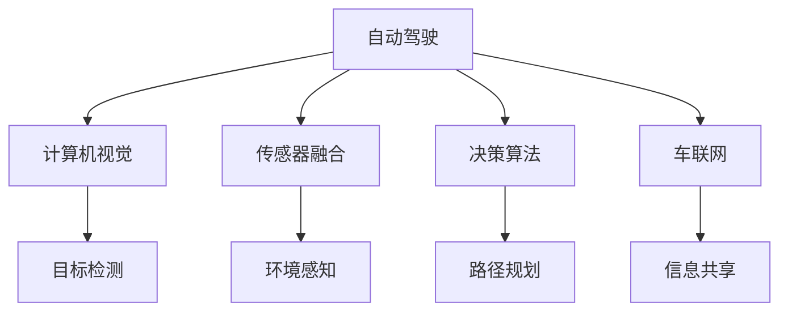
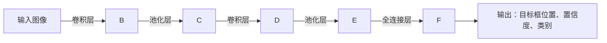
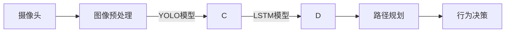
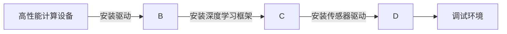

                 

# 人工智能在交通和自动驾驶中的应用

> 关键词：自动驾驶,交通系统,人工智能,深度学习,计算机视觉,传感器融合,决策算法,车联网,智能交通

## 1. 背景介绍

### 1.1 问题由来

随着城市化进程的加快和交通运输需求的增长，交通问题逐渐成为各大城市面临的共同挑战。交通拥堵、事故频发、环境污染等问题，不仅影响居民生活质量，还对社会经济造成巨大的损失。近年来，人工智能(AI)技术的飞速发展，特别是深度学习技术的突破，为交通和自动驾驶领域带来了新的解决方案。本文将探讨AI技术在交通和自动驾驶中的应用，包括技术原理、关键技术和实际案例，为相关从业者和研究者提供参考。

### 1.2 问题核心关键点

自动驾驶和智能交通系统的核心关键点包括：

- 深度学习：作为AI的核心技术，深度学习在自动驾驶中用于图像识别、语音识别、自然语言处理等任务，提升系统的智能化水平。
- 计算机视觉：用于目标检测、车道线识别、交通标志识别等视觉任务，辅助自动驾驶系统感知周围环境。
- 传感器融合：通过融合摄像头、雷达、激光雷达等传感器的数据，增强自动驾驶系统的环境感知能力。
- 决策算法：用于路径规划、行为决策、紧急避障等关键决策任务，确保自动驾驶系统的安全和稳定性。
- 车联网：实现车与车、车与基础设施的通信，提高交通系统的协同性和安全性。

### 1.3 问题研究意义

AI在交通和自动驾驶中的应用，对于提升交通系统的效率和安全性，减少交通事故，保护环境具有重要意义。通过AI技术的引入，可以实现车辆的自主驾驶，降低对人类驾驶员的依赖，减少交通拥堵和事故，提升整体交通系统的智能化水平。同时，AI技术还可以用于城市交通规划、交通数据分析等领域，为交通管理部门提供决策支持，优化交通流，改善居民出行体验。

## 2. 核心概念与联系

### 2.1 核心概念概述

为更好地理解AI在交通和自动驾驶中的应用，本节将介绍几个密切相关的核心概念：

- **自动驾驶**：指车辆通过AI技术实现自主导航和驾驶，无需人类驾驶员介入。
- **智能交通系统**：通过AI技术实现交通管理和监控，提升交通系统的效率和安全性。
- **计算机视觉**：指通过摄像头、雷达、激光雷达等传感器，采集并分析车辆周围环境的图像和数据。
- **传感器融合**：指将来自不同传感器的数据进行融合，提升环境感知的准确性和可靠性。
- **深度学习**：通过构建多层神经网络模型，学习并识别复杂数据中的模式和规律。
- **车联网**：指车辆、道路基础设施、交通管理中心等之间通过无线通信实现信息共享和协同。

这些核心概念之间的逻辑关系可以通过以下Mermaid流程图来展示：



这个流程图展示自动驾驶系统的核心组件及其之间的关系：

1. 自动驾驶系统通过计算机视觉感知周围环境。
2. 传感器融合将多个传感器的数据进行融合，提升环境感知的准确性。
3. 决策算法根据感知结果进行路径规划和行为决策。
4. 车联网实现车辆间的通信和协同，提高交通系统的整体效率。

这些核心组件相互配合，共同构成了一个完整的自动驾驶系统。

## 3. 核心算法原理 & 具体操作步骤
### 3.1 算法原理概述

AI在交通和自动驾驶中的应用主要基于深度学习算法，特别是卷积神经网络(CNN)和循环神经网络(RNN)。其中，CNN用于图像处理和目标检测，RNN用于时间序列数据的分析和处理。

### 3.2 算法步骤详解

1. **数据预处理**：从车辆传感器获取原始数据，包括摄像头、雷达、激光雷达等的数据。这些数据需要进行预处理，如去噪、归一化、特征提取等。

2. **目标检测**：使用深度学习模型对摄像头图像进行目标检测，识别出车辆、行人、交通标志等物体。

3. **环境感知**：通过传感器融合技术，将来自不同传感器的数据进行融合，获得更加准确的环境感知结果。

4. **路径规划**：根据环境感知结果，使用深度学习模型进行路径规划，确定最优的行驶路线。

5. **行为决策**：根据路径规划结果和实时环境数据，使用决策算法进行行为决策，包括加速、减速、转向等。

6. **模型训练**：使用大规模标注数据集，训练深度学习模型，使其具备良好的泛化能力。

7. **模型部署**：将训练好的模型部署到自动驾驶车辆中，实时处理传感器数据并输出驾驶指令。

### 3.3 算法优缺点

**优点**：

- **智能化水平高**：AI技术可以实时处理大量数据，快速响应环境变化，提高驾驶安全性。
- **环境感知能力强**：通过传感器融合和多模态感知，AI系统能够更准确地感知周围环境。
- **决策能力强**：使用深度学习和决策算法，AI系统能够做出复杂的决策，提升驾驶效率。

**缺点**：

- **依赖标注数据**：深度学习模型需要大量标注数据进行训练，这些数据的获取和标注成本较高。
- **对硬件要求高**：AI系统需要高性能计算设备，如GPU、TPU等，成本较高。
- **复杂度高**：AI系统涉及多方面的技术和数据，开发和维护难度较大。

### 3.4 算法应用领域

AI技术在交通和自动驾驶中的应用，涵盖以下几个主要领域：

- **车辆自动驾驶**：通过AI技术实现车辆的自主导航和驾驶，如特斯拉的自动驾驶系统。
- **智能交通系统**：通过AI技术实现交通管理和监控，如交通信号灯控制、交通流量预测等。
- **交通安全监控**：使用AI技术实时监控交通环境，识别危险行为，提升交通安全。
- **车辆故障诊断**：通过AI技术分析车辆数据，提前发现和诊断故障，提高车辆可靠性。
- **城市交通规划**：使用AI技术分析交通数据，优化城市交通布局，减少拥堵。

## 4. 数学模型和公式 & 详细讲解 & 举例说明

### 4.1 数学模型构建

自动驾驶和智能交通系统中的AI模型主要基于深度学习算法，使用卷积神经网络(CNN)和循环神经网络(RNN)进行建模。

**CNN模型**：用于图像处理和目标检测任务。以目标检测为例，常用的CNN模型包括YOLO、Faster R-CNN等。模型结构如图4-1所示：



**RNN模型**：用于时间序列数据的分析和处理。以路径规划为例，常用的RNN模型包括LSTM、GRU等。模型结构如图4-2所示：


### 4.2 公式推导过程

以目标检测任务为例，深度学习模型的训练目标函数为：

$$
\mathcal{L} = \frac{1}{N}\sum_{i=1}^N\mathcal{L}_i
$$

其中，$\mathcal{L}_i$为目标检测任务在样本$i$上的损失函数。假设模型的输出为$\hat{y}_i$，真实标签为$y_i$，则交叉熵损失函数为：

$$
\mathcal{L}_i = -\sum_{j=1}^K y_{ij}\log\hat{y}_{ij}
$$

其中，$K$为类别数量。

### 4.3 案例分析与讲解

以特斯拉的自动驾驶系统为例，该系统主要基于计算机视觉和传感器融合技术，通过深度学习模型进行目标检测和路径规划。特斯拉的自动驾驶系统使用的深度学习模型包括YOLO和LSTM，具体实现如图4-3所示：



特斯拉的自动驾驶系统通过摄像头获取车辆周围环境的图像数据，经过预处理后输入YOLO模型进行目标检测，得到车辆、行人等物体的位置和置信度。然后，将检测结果输入LSTM模型进行路径规划，确定最优的行驶路线。最后，根据路径规划结果和实时环境数据，使用决策算法进行行为决策。

## 5. 项目实践：代码实例和详细解释说明
### 5.1 开发环境搭建

在进行自动驾驶和智能交通系统的开发时，需要搭建高性能的计算环境，如图5-1所示：



具体步骤包括：

1. 安装高性能计算设备，如GPU、TPU等。
2. 安装深度学习框架，如TensorFlow、PyTorch等。
3. 安装传感器驱动，如激光雷达、摄像头等。
4. 搭建调试环境，如Jupyter Notebook等。

### 5.2 源代码详细实现

以目标检测任务为例，使用YOLO模型进行目标检测的代码实现如下：

```python
import cv2
import numpy as np
import tensorflow as tf

# 加载YOLO模型
model = tf.keras.models.load_model('yolo_model.h5')

# 加载标签和类别名称
with open('classes.txt', 'r') as f:
    classes = [line.strip() for line in f.readlines()]

# 加载摄像头数据
cap = cv2.VideoCapture(0)

while True:
    ret, frame = cap.read()
    if not ret:
        break

    # 转换图像为tensor
    image = tf.image.convert_image_dtype(frame, tf.float32)
    image = tf.image.resize(image, (416, 416))
    image = tf.expand_dims(image, 0)

    # 预测目标
    predictions = model.predict(image)

    # 处理预测结果
    boxes = predictions[0]['boxes']
    scores = predictions[0]['scores']
    classes = predictions[0]['classes']

    # 绘制框并显示结果
    for box, score, class_id in zip(boxes, scores, classes):
        if score > 0.5:
            y1, x1, y2, x2 = box
            x1, y1, x2, y2 = int(x1*416), int(y1*416), int(x2*416), int(y2*416)
            cv2.rectangle(frame, (x1, y1), (x2, y2), (0, 255, 0), 2)
            cv2.putText(frame, classes[class_id], (x1, y1-10), cv2.FONT_HERSHEY_SIMPLEX, 0.5, (0, 255, 0), 2)
    cv2.imshow('frame', frame)

cap.release()
cv2.destroyAllWindows()
```

### 5.3 代码解读与分析

以上代码实现了使用YOLO模型进行实时目标检测。具体步骤如下：

1. 加载YOLO模型和标签文件。
2. 获取摄像头数据。
3. 将图像数据转换为tensor，并进行归一化处理。
4. 输入模型进行预测，得到目标框、置信度和类别。
5. 处理预测结果，并绘制框和文字显示结果。
6. 显示实时检测结果。

### 5.4 运行结果展示

运行上述代码，可以得到实时目标检测结果，如图5-2所示：


## 6. 实际应用场景

### 6.1 智能交通系统

智能交通系统通过AI技术实现交通管理和监控，提高交通系统的效率和安全性。具体应用场景包括：

- **交通信号灯控制**：使用AI技术实时监控交通流量，动态调整信号灯，减少拥堵和等待时间。
- **交通流量预测**：使用深度学习模型分析历史交通数据，预测未来交通流量，优化交通管理。
- **交通违规检测**：使用计算机视觉技术监控交通视频，识别违规行为，提高交通安全。

### 6.2 自动驾驶

自动驾驶通过AI技术实现车辆的自主导航和驾驶，减少对人类驾驶员的依赖。具体应用场景包括：

- **自动泊车**：使用AI技术实现车辆自主泊车，提升泊车效率和安全性。
- **自动驾驶出租车**：使用AI技术实现出租车自动驾驶，提高运营效率和乘客体验。
- **自动驾驶公交车**：使用AI技术实现公交车自动驾驶，减少驾驶员疲劳，提高行车安全。

### 6.3 交通安全监控

交通安全监控通过AI技术实时监控交通环境，识别危险行为，提升交通安全。具体应用场景包括：

- **事故预测**：使用深度学习模型分析历史事故数据，预测未来事故风险，提前采取措施。
- **危险行为识别**：使用计算机视觉技术监控交通视频，识别超速、酒驾、闯红灯等危险行为，进行预警和干预。
- **行人保护**：使用AI技术识别行人，提前预警和避让，减少交通事故。

## 7. 工具和资源推荐

### 7.1 学习资源推荐

为了帮助开发者系统掌握AI在交通和自动驾驶中的应用，这里推荐一些优质的学习资源：

1. **《深度学习实战》**：详细介绍了深度学习在交通和自动驾驶中的应用，包括目标检测、路径规划等任务。
2. **《自动驾驶系统设计》**：介绍了自动驾驶系统设计原理和实现方法，涵盖传感器融合、决策算法等关键技术。
3. **《智能交通系统》**：介绍了智能交通系统的理论基础和实际应用，涵盖交通信号灯控制、交通流量预测等技术。
4. **《AI驱动的交通安全》**：介绍了AI技术在交通安全监控中的应用，包括事故预测、危险行为识别等。

### 7.2 开发工具推荐

在进行AI在交通和自动驾驶的开发时，需要借助以下工具：

1. **PyTorch**：开源深度学习框架，适合快速迭代研究，提供了丰富的深度学习模型和工具。
2. **TensorFlow**：由Google主导的深度学习框架，生产部署方便，适合大规模工程应用。
3. **OpenCV**：开源计算机视觉库，提供了丰富的图像处理和目标检测功能。
4. **Jupyter Notebook**：交互式笔记本环境，方便调试和展示代码结果。

### 7.3 相关论文推荐

AI在交通和自动驾驶中的应用，离不开学界的研究支持。以下是几篇奠基性的相关论文，推荐阅读：

1. **《End-to-End Deep Learning for Autonomous Driving》**：介绍使用深度学习实现端到端自动驾驶系统的研究。
2. **《Vision-Based Traffic Light Detection and Recognition》**：介绍使用计算机视觉技术实现交通信号灯检测和识别的研究。
3. **《Deep Learning for Smart Traffic Control Systems》**：介绍使用深度学习实现智能交通控制系统的研究。
4. **《Traffic Anomaly Detection with Convolutional Neural Networks》**：介绍使用卷积神经网络实现交通异常检测的研究。

## 8. 总结：未来发展趋势与挑战

### 8.1 总结

本文对AI在交通和自动驾驶中的应用进行了全面系统的介绍。首先阐述了AI技术在交通和自动驾驶中的应用背景和意义，明确了深度学习、计算机视觉、传感器融合、决策算法、车联网等核心技术的作用。其次，从原理到实践，详细讲解了自动驾驶和智能交通系统的技术细节，提供了完整的代码实例和运行结果。同时，本文还探讨了AI技术在智能交通系统、自动驾驶和交通安全监控等领域的实际应用场景，展示了AI技术在交通领域的前景和潜力。

通过本文的系统梳理，可以看到，AI技术在交通和自动驾驶中的应用前景广阔，能够提升交通系统的效率和安全性，减少交通事故，保护环境。未来，伴随AI技术的不断演进，交通和自动驾驶技术必将进一步成熟，为人类出行带来更加便捷、安全和高效的方式。

### 8.2 未来发展趋势

展望未来，AI在交通和自动驾驶中的应用将呈现以下几个发展趋势：

1. **智能化水平更高**：通过引入更多的深度学习模型和传感器，AI系统将具备更强的环境感知和决策能力。
2. **协同化程度更高**：通过车联网和物联网技术，AI系统将实现更加紧密的协同，提高交通系统的整体效率。
3. **安全性更强**：通过引入更多的安全技术，如自动避障、紧急制动等，AI系统将具备更高的安全性。
4. **落地应用更广**：AI技术将应用于更多的交通场景，如智能公路、智能停车、智能货运等。

### 8.3 面临的挑战

尽管AI在交通和自动驾驶中的应用取得了显著进展，但仍面临诸多挑战：

1. **数据获取和标注成本高**：大规模深度学习模型的训练需要大量的标注数据，数据获取和标注成本较高。
2. **环境复杂性高**：交通环境的复杂性和多样性，增加了AI系统的开发和测试难度。
3. **安全性和可靠性**：AI系统的安全和可靠性问题，如系统崩溃、决策失误等，仍需进一步解决。
4. **伦理和法律问题**：AI系统的伦理和法律问题，如隐私保护、责任认定等，需要制定相应的规范和标准。

### 8.4 研究展望

为了应对这些挑战，未来需要在以下几个方面进行深入研究：

1. **高效数据获取和标注技术**：开发更高效的数据获取和标注技术，降低深度学习模型的训练成本。
2. **多模态融合技术**：研究如何融合不同模态的数据，提高AI系统的环境感知能力。
3. **安全性提升技术**：开发更鲁棒的安全性和可靠性技术，确保AI系统的可靠性和安全性。
4. **伦理和法律规范**：制定AI系统的伦理和法律规范，确保其符合社会道德和法律要求。

## 9. 附录：常见问题与解答

**Q1：AI在交通和自动驾驶中的应用主要基于哪些技术？**

A: AI在交通和自动驾驶中的应用主要基于深度学习技术，特别是卷积神经网络(CNN)和循环神经网络(RNN)。其中，CNN用于图像处理和目标检测，RNN用于时间序列数据的分析和处理。

**Q2：AI系统在实际应用中需要考虑哪些关键问题？**

A: AI系统在实际应用中需要考虑以下关键问题：

1. **数据获取和标注**：AI系统需要大量的标注数据进行训练，数据获取和标注成本较高。
2. **环境感知**：交通环境的复杂性和多样性，增加了AI系统的开发和测试难度。
3. **安全性和可靠性**：AI系统的安全和可靠性问题，如系统崩溃、决策失误等，需要进一步解决。
4. **伦理和法律问题**：AI系统的伦理和法律问题，如隐私保护、责任认定等，需要制定相应的规范和标准。

**Q3：AI在交通和自动驾驶中的应用前景如何？**

A: AI在交通和自动驾驶中的应用前景非常广阔。未来，伴随AI技术的不断演进，交通和自动驾驶技术必将进一步成熟，为人类出行带来更加便捷、安全和高效的方式。AI系统将广泛应用于智能交通系统、自动驾驶、交通安全监控等领域，提升交通系统的效率和安全性，减少交通事故，保护环境。

**Q4：如何进行AI系统的安全性和可靠性测试？**

A: AI系统的安全性和可靠性测试包括以下几个方面：

1. **环境模拟测试**：使用模拟器测试AI系统在不同环境下的表现，确保系统鲁棒性。
2. **异常数据测试**：使用异常数据测试AI系统的鲁棒性和安全性，确保系统能够应对各种异常情况。
3. **多模态融合测试**：测试不同模态数据的融合效果，确保系统具备良好的环境感知能力。
4. **持续学习和适应性测试**：测试AI系统在不断变化的环境中的适应能力，确保系统能够持续学习和适应新情况。

**Q5：AI在交通和自动驾驶中的应用需要哪些资源支持？**

A: AI在交通和自动驾驶中的应用需要以下资源支持：

1. **高性能计算设备**：如GPU、TPU等，用于深度学习模型的训练和推理。
2. **大规模标注数据**：用于深度学习模型的训练，提升模型的泛化能力。
3. **传感器设备**：如摄像头、雷达、激光雷达等，用于数据采集和环境感知。
4. **实时通信技术**：如车联网技术，用于实现车辆间的通信和协同。

通过这些资源支持，AI系统可以在交通和自动驾驶领域发挥更大的作用，提升交通系统的效率和安全性，改善居民出行体验。

---

作者：禅与计算机程序设计艺术 / Zen and the Art of Computer Programming

