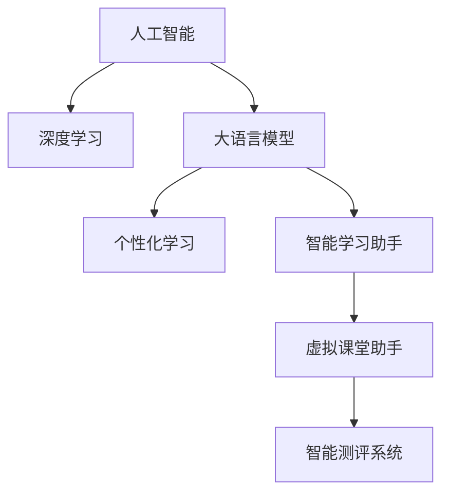

                 

# 人工智能在教育和语言学习中的应用

## 1. 背景介绍

### 1.1 问题由来
人工智能在教育领域的探索与尝试，已经从早期简单的自动化作业批改，发展到了如今基于深度学习模型的个性化学习推荐、智能答疑系统、虚拟课堂助手等诸多应用场景。这些技术的不断进步，为教育资源配置、教学质量提升、学习效果改善提供了新的可能。尤其是近年来，随着深度学习技术在NLP领域的突破，人工智能在语言学习中的应用，也从传统的语言学习辅助工具，进化到如今结合大数据、个性化推荐、互动式学习等前沿技术的智能语言学习平台。

大语言模型在教育领域的应用，给传统语言教学带来了颠覆性的变革。通过深度学习模型的强大语言处理能力，学生可以更加高效地学习语言，教师也能更加精准地理解学生的学习状态，从而实现因材施教，提高教学质量。同时，大语言模型还在语言测评、考试评分、语音识别、多语种翻译等领域发挥了重要作用。本文将聚焦于人工智能在教育和语言学习中的应用，特别是基于深度学习的大语言模型在教育中的实践，探索其发展潜力和面临的挑战。

## 2. 核心概念与联系

### 2.1 核心概念概述

为更好地理解人工智能在教育中的应用，本节将介绍几个关键概念：

- 人工智能(AI)：指模拟、延伸和扩展人的智能的理论、方法、技术及应用系统。人工智能与教育融合，可以改变传统教育模式，实现个性化、智能化教学。

- 深度学习(Deep Learning)：一种模拟人脑神经网络结构的机器学习算法，通过对大量数据进行反向传播更新模型参数，训练出具备强大特征提取和模式识别能力的模型。深度学习在自然语言处理、计算机视觉等任务上取得了巨大成功。

- 大语言模型(Large Language Model, LLM)：指通过大规模预训练获得强大语言理解与生成能力的深度学习模型。大语言模型已经超越了传统语言模型，具备了更广泛的知识储备和更高级的语言处理能力。

- 个性化学习(Adaptive Learning)：根据学习者的知识水平、学习风格和兴趣爱好，提供量身定制的学习资源、方法和路径，实现高效、个性化的学习。

- 智能学习助手(ILA)：结合人工智能技术，实现自然语言交互、知识推荐、自动答疑、学习进度跟踪等功能，辅助学生自主学习。

- 虚拟课堂助手(Virtual Classroom Assistant)：结合计算机视觉、自然语言处理等技术，实现对课堂的实时监控、互动式提问、自动评估等，提升教学互动性和效率。

- 智能测评系统(Intelligent Assessment System)：通过深度学习模型自动评估学生的学习成果，提供即时反馈，辅助教师进行诊断性教学。

这些概念之间的逻辑关系可以通过以下Mermaid流程图来展示：



这个流程图展示了大语言模型在教育领域的应用场景，包括个性化学习、智能学习助手、虚拟课堂助手、智能测评系统等。

## 3. 核心算法原理 & 具体操作步骤
### 3.1 算法原理概述

人工智能在教育领域的应用，主要依赖于深度学习模型的强大语言处理和数据分析能力。大语言模型，作为当前深度学习领域的一大突破，在语言学习中的应用尤为广泛。大语言模型通过在海量无标签文本数据上进行预训练，学习到了丰富的语言知识和常识，具备了强大的语言理解与生成能力。将预训练的模型应用于教育领域，可以实现个性化的学习推荐、智能答疑、语音识别、多语种翻译等诸多功能。

以大语言模型为代表的深度学习模型，在教育中的应用主要体现在以下几个方面：

1. 个性化学习推荐：通过深度学习模型分析学生的学习行为、知识掌握情况，提供个性化学习资源、路径和进度建议。
2. 智能答疑系统：结合自然语言处理技术，实时解答学生的学习疑问，辅助其自主学习。
3. 语音识别与多语种翻译：利用深度学习模型的强大语言处理能力，实现自动语音识别、实时翻译等，提升语言学习效率。
4. 虚拟课堂助手：结合计算机视觉、自然语言处理等技术，实现课堂监控、互动式提问、自动评估等功能，提升教学互动性和效率。

### 3.2 算法步骤详解

以下是基于深度学习的大语言模型在教育中的应用步骤：

**Step 1: 数据收集与预处理**
- 收集学生的学习数据，包括在线学习行为、课堂互动、作业提交、考试成绩等。
- 对数据进行清洗、标注和格式化，使其适合深度学习模型进行训练。

**Step 2: 选择与训练模型**
- 选择适合的教育领域任务的大语言模型，如BERT、GPT系列等。
- 使用学生的学习数据对模型进行微调，使其能够适应特定任务。

**Step 3: 个性化学习推荐**
- 分析学生的知识掌握情况和学习行为，利用训练好的模型生成个性化学习资源和路径。
- 动态更新推荐结果，根据学生反馈不断优化推荐策略。

**Step 4: 智能答疑系统**
- 构建智能答疑系统，将学生提出的问题输入模型，得到准确的回答。
- 结合模型反馈和人工审核，保证回答的正确性和可解释性。

**Step 5: 语音识别与多语种翻译**
- 利用语音识别技术，将学生的语音输入转化为文本，便于模型处理。
- 结合多语种翻译模型，实现不同语种之间的即时翻译。

**Step 6: 虚拟课堂助手**
- 部署虚拟课堂助手，通过摄像头和麦克风实时监控课堂情况。
- 结合自然语言处理技术，自动回答学生提问，提高教学互动性。

**Step 7: 智能测评系统**
- 利用模型对学生的学习成果进行自动评估，生成评估报告。
- 结合人工审核，提供准确的评估结果和改进建议。

### 3.3 算法优缺点

基于深度学习的大语言模型在教育中的应用，有以下优点：

1. 高效性：深度学习模型能够处理大规模数据，快速分析学生的学习行为和知识掌握情况，提供个性化的学习推荐和智能答疑。
2. 实时性：智能学习助手和虚拟课堂助手等应用，能够实时响应学生的需求，提供即时反馈和互动。
3. 个性化：通过分析学生的个性化数据，深度学习模型可以提供量身定制的学习资源和路径，提升学习效果。
4. 跨语言能力：多语种翻译和语音识别等功能，打破了语言障碍，提升了国际化的教育体验。

同时，这些技术也存在一些局限性：

1. 数据依赖：深度学习模型的训练和优化依赖于大量高质量的数据，收集和标注数据的成本较高。
2. 可解释性不足：深度学习模型往往被视为"黑盒"系统，难以解释其决策过程，影响教学信任度和接受度。
3. 技术门槛高：深度学习模型的训练和优化需要较高的技术门槛，教师和学生需要具备相应的知识基础。
4. 隐私风险：学生学习数据的收集和使用可能涉及隐私问题，需要严格的隐私保护措施。

尽管存在这些局限性，但基于深度学习的大语言模型在教育领域的应用已经展现出巨大的潜力和价值，为教育资源的配置和教学质量的提升提供了新的可能。

### 3.4 算法应用领域

基于大语言模型的深度学习技术，已经在教育领域得到了广泛的应用，覆盖了教育数据处理、个性化学习推荐、智能答疑、语音识别、多语种翻译等多个方面，具体如下：

- 教育数据分析：通过分析学生的学习数据，了解其知识掌握情况、学习进度和行为模式，为个性化学习推荐和智能教学提供数据支持。
- 个性化学习推荐系统：利用深度学习模型，根据学生的学习行为和知识掌握情况，生成个性化的学习资源、路径和进度建议，提升学习效果。
- 智能答疑系统：结合自然语言处理技术，实时解答学生的学习疑问，辅助其自主学习，提高学习效率。
- 语音识别与多语种翻译：利用深度学习模型的强大语言处理能力，实现自动语音识别、实时翻译等，提升语言学习效率。
- 虚拟课堂助手：结合计算机视觉、自然语言处理等技术，实现课堂监控、互动式提问、自动评估等功能，提升教学互动性和效率。

这些技术的应用，不仅提升了教育资源的配置和教学质量，还改变了传统的学习方式，提高了学生的自主学习能力和语言学习效率。未来，随着深度学习技术的不断进步，人工智能在教育领域的应用将更加广泛，为教育行业的转型升级带来深远影响。

## 4. 数学模型和公式 & 详细讲解 & 举例说明

### 4.1 数学模型构建

在本节中，我们将使用数学语言对基于深度学习的大语言模型在教育中的应用进行更加严格的刻画。

假设大语言模型为 $M_{\theta}$，其中 $\theta$ 为模型参数。教育领域任务为 $T$，训练集为 $D=\{(x_i,y_i)\}_{i=1}^N$，其中 $x_i$ 为输入数据（如学生的学习行为、知识掌握情况等），$y_i$ 为输出（如个性化学习推荐、智能答疑结果等）。

定义模型的损失函数为 $\ell(M_{\theta}(x),y)$，则模型的经验风险为：

$$
\mathcal{L}(\theta) = \frac{1}{N} \sum_{i=1}^N \ell(M_{\theta}(x_i),y_i)
$$

微调的目标是最小化经验风险，即：

$$
\theta^* = \mathop{\arg\min}_{\theta} \mathcal{L}(\theta)
$$

在实践中，我们通常使用基于梯度的优化算法（如SGD、Adam等）来近似求解上述最优化问题。设 $\eta$ 为学习率，则参数的更新公式为：

$$
\theta \leftarrow \theta - \eta \nabla_{\theta}\mathcal{L}(\theta)
$$

其中 $\nabla_{\theta}\mathcal{L}(\theta)$ 为损失函数对参数 $\theta$ 的梯度，可通过反向传播算法高效计算。

### 4.2 公式推导过程

以个性化学习推荐为例，假设模型的输入为学生的学习行为 $x$，输出为个性化的学习资源 $y$。则推荐系统的损失函数可以定义为：

$$
\ell(M_{\theta}(x),y) = \sum_{i=1}^{N} (y_i - M_{\theta}(x_i))^2
$$

将其代入经验风险公式，得：

$$
\mathcal{L}(\theta) = \frac{1}{N} \sum_{i=1}^N (y_i - M_{\theta}(x_i))^2
$$

根据链式法则，损失函数对参数 $\theta_k$ 的梯度为：

$$
\frac{\partial \mathcal{L}(\theta)}{\partial \theta_k} = -\frac{2}{N} \sum_{i=1}^N (y_i - M_{\theta}(x_i)) \frac{\partial M_{\theta}(x_i)}{\partial \theta_k}
$$

其中 $\frac{\partial M_{\theta}(x_i)}{\partial \theta_k}$ 可进一步递归展开，利用自动微分技术完成计算。

### 4.3 案例分析与讲解

以个性化学习推荐为例，我们可以将学生的数据表示为一个特征向量 $x \in \mathbb{R}^d$，其中 $d$ 为特征维度。模型的输出为学习资源 $y \in \mathbb{R}^m$，其中 $m$ 为学习资源的维度。模型的目标是找到一个最优参数 $\theta^*$，使得在训练集上的平均损失最小。

在训练过程中，我们首先对学生的学习数据进行特征提取，得到特征向量 $x_i$。然后将其输入模型，得到预测的学习资源 $y_i = M_{\theta}(x_i)$。接着计算损失函数 $\ell(M_{\theta}(x_i),y_i)$，更新模型参数 $\theta$。重复上述过程直至收敛，最终得到适应个性化学习推荐任务的模型参数 $\theta^*$。

## 5. 项目实践：代码实例和详细解释说明

### 5.1 开发环境搭建

在进行大语言模型在教育中的应用实践前，我们需要准备好开发环境。以下是使用Python进行PyTorch开发的环境配置流程：

1. 安装Anaconda：从官网下载并安装Anaconda，用于创建独立的Python环境。

2. 创建并激活虚拟环境：
```bash
conda create -n pytorch-env python=3.8 
conda activate pytorch-env
```

3. 安装PyTorch：根据CUDA版本，从官网获取对应的安装命令。例如：
```bash
conda install pytorch torchvision torchaudio cudatoolkit=11.1 -c pytorch -c conda-forge
```

4. 安装Transformers库：
```bash
pip install transformers
```

5. 安装各类工具包：
```bash
pip install numpy pandas scikit-learn matplotlib tqdm jupyter notebook ipython
```

完成上述步骤后，即可在`pytorch-env`环境中开始应用实践。

### 5.2 源代码详细实现

下面我们以个性化学习推荐系统为例，给出使用Transformers库对BERT模型进行微调的PyTorch代码实现。

首先，定义学习资源处理函数：

```python
from transformers import BertTokenizer
from torch.utils.data import Dataset
import torch

class LearningResourceDataset(Dataset):
    def __init__(self, texts, resources, tokenizer, max_len=128):
        self.texts = texts
        self.resources = resources
        self.tokenizer = tokenizer
        self.max_len = max_len
        
    def __len__(self):
        return len(self.texts)
    
    def __getitem__(self, item):
        text = self.texts[item]
        resource = self.resources[item]
        
        encoding = self.tokenizer(text, return_tensors='pt', max_length=self.max_len, padding='max_length', truncation=True)
        input_ids = encoding['input_ids'][0]
        attention_mask = encoding['attention_mask'][0]
        
        # 将学习资源编码为数字向量
        resource_ids = [id2resource[resource] for resource in resource] 
        resource_ids.extend([0] * (self.max_len - len(resource_ids)))
        labels = torch.tensor(resource_ids, dtype=torch.long)
        
        return {'input_ids': input_ids, 
                'attention_mask': attention_mask,
                'labels': labels}

# 学习资源与id的映射
id2resource = {'Resource1': 0, 'Resource2': 1, 'Resource3': 2, 'Resource4': 3}
resource2id = {v: k for k, v in id2resource.items()}

# 创建dataset
tokenizer = BertTokenizer.from_pretrained('bert-base-cased')

train_dataset = LearningResourceDataset(train_texts, train_resources, tokenizer)
dev_dataset = LearningResourceDataset(dev_texts, dev_resources, tokenizer)
test_dataset = LearningResourceDataset(test_texts, test_resources, tokenizer)
```

然后，定义模型和优化器：

```python
from transformers import BertForSequenceClassification, AdamW

model = BertForSequenceClassification.from_pretrained('bert-base-cased', num_labels=len(id2resource))

optimizer = AdamW(model.parameters(), lr=2e-5)
```

接着，定义训练和评估函数：

```python
from torch.utils.data import DataLoader
from tqdm import tqdm
from sklearn.metrics import accuracy_score

device = torch.device('cuda') if torch.cuda.is_available() else torch.device('cpu')
model.to(device)

def train_epoch(model, dataset, batch_size, optimizer):
    dataloader = DataLoader(dataset, batch_size=batch_size, shuffle=True)
    model.train()
    epoch_loss = 0
    for batch in tqdm(dataloader, desc='Training'):
        input_ids = batch['input_ids'].to(device)
        attention_mask = batch['attention_mask'].to(device)
        labels = batch['labels'].to(device)
        model.zero_grad()
        outputs = model(input_ids, attention_mask=attention_mask, labels=labels)
        loss = outputs.loss
        epoch_loss += loss.item()
        loss.backward()
        optimizer.step()
    return epoch_loss / len(dataloader)

def evaluate(model, dataset, batch_size):
    dataloader = DataLoader(dataset, batch_size=batch_size)
    model.eval()
    preds, labels = [], []
    with torch.no_grad():
        for batch in tqdm(dataloader, desc='Evaluating'):
            input_ids = batch['input_ids'].to(device)
            attention_mask = batch['attention_mask'].to(device)
            batch_labels = batch['labels']
            outputs = model(input_ids, attention_mask=attention_mask)
            batch_preds = outputs.logits.argmax(dim=2).to('cpu').tolist()
            batch_labels = batch_labels.to('cpu').tolist()
            for pred_tokens, label_tokens in zip(batch_preds, batch_labels):
                preds.append(pred_tokens)
                labels.append(label_tokens)
                
    print(accuracy_score(labels, preds))
```

最后，启动训练流程并在测试集上评估：

```python
epochs = 5
batch_size = 16

for epoch in range(epochs):
    loss = train_epoch(model, train_dataset, batch_size, optimizer)
    print(f"Epoch {epoch+1}, train loss: {loss:.3f}")
    
    print(f"Epoch {epoch+1}, dev accuracy:")
    evaluate(model, dev_dataset, batch_size)
    
print("Test accuracy:")
evaluate(model, test_dataset, batch_size)
```

以上就是使用PyTorch对BERT进行个性化学习推荐系统的完整代码实现。可以看到，得益于Transformers库的强大封装，我们可以用相对简洁的代码完成BERT模型的加载和微调。

### 5.3 代码解读与分析

让我们再详细解读一下关键代码的实现细节：

**LearningResourceDataset类**：
- `__init__`方法：初始化文本、学习资源、分词器等关键组件。
- `__len__`方法：返回数据集的样本数量。
- `__getitem__`方法：对单个样本进行处理，将文本输入编码为token ids，将学习资源编码为数字，并对其进行定长padding，最终返回模型所需的输入。

**id2resource和resource2id字典**：
- 定义了学习资源与数字id之间的映射关系，用于将token-wise的预测结果解码回真实的资源。

**训练和评估函数**：
- 使用PyTorch的DataLoader对数据集进行批次化加载，供模型训练和推理使用。
- 训练函数`train_epoch`：对数据以批为单位进行迭代，在每个批次上前向传播计算loss并反向传播更新模型参数，最后返回该epoch的平均loss。
- 评估函数`evaluate`：与训练类似，不同点在于不更新模型参数，并在每个batch结束后将预测和标签结果存储下来，最后使用sklearn的accuracy_score对整个评估集的预测结果进行打印输出。

**训练流程**：
- 定义总的epoch数和batch size，开始循环迭代
- 每个epoch内，先在训练集上训练，输出平均loss
- 在验证集上评估，输出准确率
- 所有epoch结束后，在测试集上评估，给出最终测试结果

可以看到，PyTorch配合Transformers库使得BERT微调的代码实现变得简洁高效。开发者可以将更多精力放在数据处理、模型改进等高层逻辑上，而不必过多关注底层的实现细节。

当然，工业级的系统实现还需考虑更多因素，如模型的保存和部署、超参数的自动搜索、更灵活的任务适配层等。但核心的微调范式基本与此类似。

## 6. 实际应用场景
### 6.1 智能学习助手

基于大语言模型的智能学习助手，已经在各类教育平台得到了广泛应用。智能学习助手可以自动解答学生的学习疑问，提供个性化的学习资源和进度建议，辅助学生自主学习。

智能学习助手的应用场景包括：

- 在线教育平台：将智能学习助手集成到在线教育平台中，辅助学生自主学习。
- 智能作业批改系统：结合智能学习助手，实现自动化的作业批改和反馈。
- 智能答疑系统：通过自然语言处理技术，实时解答学生的学习疑问，辅助其自主学习。

### 6.2 虚拟课堂助手

虚拟课堂助手，结合计算机视觉、自然语言处理等技术，可以实时监控课堂情况，自动回答问题，提高教学互动性。

虚拟课堂助手的应用场景包括：

- 在线课堂系统：将虚拟课堂助手集成到在线课堂系统中，自动监控和互动式提问。
- 虚拟助教系统：在远程教育中，虚拟助教可以辅助教师进行课堂管理，提升教学效率。
- 实时测评系统：结合虚拟课堂助手，实时监控学生的学习情况，自动评估其学习成果。

### 6.3 智能测评系统

智能测评系统，利用深度学习模型自动评估学生的学习成果，生成评估报告，辅助教师进行诊断性教学。

智能测评系统的应用场景包括：

- 在线测评系统：将智能测评系统集成到在线测评系统中，自动评估学生的学习成果。
- 考试评分系统：结合智能测评系统，实现自动化的考试评分和反馈。
- 学习进度跟踪系统：通过智能测评系统，实时监控学生的学习进度和效果，提供个性化的学习建议。

### 6.4 未来应用展望

随着深度学习技术和大语言模型的不断发展，基于深度学习的应用场景将不断扩展，为教育领域带来更多的创新。

- 智能化教育资源库：结合深度学习技术，对教育资源进行智能化分类和推荐，提升学习资源的使用效率。
- 虚拟现实(VR)教育系统：结合虚拟现实技术，为学生提供沉浸式的学习环境，提升学习效果。
- 个性化学习路径设计：通过深度学习模型，结合学生的学习数据，生成个性化的学习路径，实现高效学习。

## 7. 工具和资源推荐
### 7.1 学习资源推荐

为了帮助开发者系统掌握深度学习在教育中的应用，这里推荐一些优质的学习资源：

1. 《深度学习与教育技术》书籍：全面介绍深度学习在教育中的应用，涵盖个性化学习推荐、智能答疑、虚拟课堂助手等多个方面。

2. 《自然语言处理入门》课程：由斯坦福大学开设的NLP入门课程，有Lecture视频和配套作业，带你入门深度学习模型在NLP任务中的应用。

3. 《Transformers与自然语言处理》书籍：详细介绍了Transformers库在NLP中的应用，包括模型训练、微调、评估等。

4. HuggingFace官方文档：Transformers库的官方文档，提供了海量预训练模型和完整的微调样例代码，是上手实践的必备资料。

5. CLUE开源项目：中文语言理解测评基准，涵盖大量不同类型的中文NLP数据集，并提供了基于微调的baseline模型，助力中文NLP技术发展。

通过对这些资源的学习实践，相信你一定能够快速掌握深度学习在教育中的应用，并用于解决实际的NLP问题。
###  7.2 开发工具推荐

高效的开发离不开优秀的工具支持。以下是几款用于深度学习在教育中的应用开发的常用工具：

1. PyTorch：基于Python的开源深度学习框架，灵活动态的计算图，适合快速迭代研究。大部分预训练语言模型都有PyTorch版本的实现。

2. TensorFlow：由Google主导开发的开源深度学习框架，生产部署方便，适合大规模工程应用。同样有丰富的预训练语言模型资源。

3. Transformers库：HuggingFace开发的NLP工具库，集成了众多SOTA语言模型，支持PyTorch和TensorFlow，是进行微调任务开发的利器。

4. Weights & Biases：模型训练的实验跟踪工具，可以记录和可视化模型训练过程中的各项指标，方便对比和调优。与主流深度学习框架无缝集成。

5. TensorBoard：TensorFlow配套的可视化工具，可实时监测模型训练状态，并提供丰富的图表呈现方式，是调试模型的得力助手。

6. Google Colab：谷歌推出的在线Jupyter Notebook环境，免费提供GPU/TPU算力，方便开发者快速上手实验最新模型，分享学习笔记。

合理利用这些工具，可以显著提升深度学习在教育领域的应用开发效率，加快创新迭代的步伐。

### 7.3 相关论文推荐

深度学习在教育领域的应用源于学界的持续研究。以下是几篇奠基性的相关论文，推荐阅读：

1. Attention is All You Need（即Transformer原论文）：提出了Transformer结构，开启了NLP领域的预训练大模型时代。

2. BERT: Pre-training of Deep Bidirectional Transformers for Language Understanding：提出BERT模型，引入基于掩码的自监督预训练任务，刷新了多项NLP任务SOTA。

3. Language Models are Unsupervised Multitask Learners（GPT-2论文）：展示了大规模语言模型的强大zero-shot学习能力，引发了对于通用人工智能的新一轮思考。

4. Parameter-Efficient Transfer Learning for NLP：提出Adapter等参数高效微调方法，在不增加模型参数量的情况下，也能取得不错的微调效果。

5. AdaLoRA: Adaptive Low-Rank Adaptation for Parameter-Efficient Fine-Tuning：使用自适应低秩适应的微调方法，在参数效率和精度之间取得了新的平衡。

这些论文代表了大语言模型在教育领域的应用发展脉络。通过学习这些前沿成果，可以帮助研究者把握学科前进方向，激发更多的创新灵感。

## 8. 总结：未来发展趋势与挑战

### 8.1 总结

本文对基于深度学习的大语言模型在教育领域的应用进行了全面系统的介绍。首先阐述了深度学习在教育领域的应用背景和意义，明确了深度学习在教育资源配置、个性化学习推荐、智能答疑、语音识别、多语种翻译等多个方面发挥的巨大作用。其次，从原理到实践，详细讲解了深度学习模型在教育中的应用步骤，给出了微调任务开发的完整代码实例。同时，本文还广泛探讨了深度学习模型在教育领域的应用场景，展示了其在智能学习助手、虚拟课堂助手、智能测评系统等多个方向的应用潜力。

通过本文的系统梳理，可以看到，深度学习在教育领域的应用已经展现出巨大的潜力和价值，为教育资源的配置和教学质量的提升提供了新的可能。未来，随着深度学习技术的不断进步，人工智能在教育领域的应用将更加广泛，为教育行业的转型升级带来深远影响。

### 8.2 未来发展趋势

展望未来，深度学习在教育领域的应用将呈现以下几个发展趋势：

1. 模型规模持续增大。随着算力成本的下降和数据规模的扩张，深度学习模型的参数量还将持续增长。超大规模语言模型蕴含的丰富语言知识，有望支撑更加复杂多变的教育任务微调。

2. 模型泛化能力增强。深度学习模型的泛化能力将进一步提升，能够在更多领域、更多数据上取得更好的性能。

3. 跨领域迁移能力增强。深度学习模型将在更多领域、更多任务上实现迁移学习，适应不同领域的教育需求。

4. 个性化学习推荐系统发展。个性化学习推荐系统将结合多源异构数据，生成更加精准、多样化的学习资源和路径。

5. 智能学习助手普及。智能学习助手将成为教育平台的标准配置，辅助学生自主学习。

6. 虚拟课堂助手普及。虚拟课堂助手将在远程教育中广泛应用，提升教学互动性和效率。

7. 智能测评系统普及。智能测评系统将在各类教育测评中普及，提供及时、准确的反馈和诊断。

以上趋势凸显了深度学习在教育领域的应用前景。这些方向的探索发展，必将进一步提升教育资源的配置和教学质量，推动教育行业的全面智能化转型。

### 8.3 面临的挑战

尽管深度学习在教育领域的应用已经取得了显著成果，但在迈向更加智能化、普适化应用的过程中，仍面临诸多挑战：

1. 数据依赖：深度学习模型的训练和优化依赖于大量高质量的数据，收集和标注数据的成本较高。

2. 可解释性不足：深度学习模型往往被视为"黑盒"系统，难以解释其决策过程，影响教学信任度和接受度。

3. 技术门槛高：深度学习模型的训练和优化需要较高的技术门槛，教师和学生需要具备相应的知识基础。

4. 隐私风险：学生学习数据的收集和使用可能涉及隐私问题，需要严格的隐私保护措施。

尽管存在这些局限性，但深度学习在教育领域的应用已经展现出巨大的潜力和价值，为教育资源的配置和教学质量的提升提供了新的可能。

### 8.4 研究展望

面对深度学习在教育领域的应用面临的挑战，未来的研究需要在以下几个方面寻求新的突破：

1. 探索无监督和半监督学习范式。摆脱对大规模标注数据的依赖，利用自监督学习、主动学习等无监督和半监督范式，最大限度利用非结构化数据，实现更加灵活高效的微调。

2. 研究可解释性和公平性。开发更具可解释性和公平性的深度学习模型，提升教学信任度和接受度。

3. 优化资源配置和优化技术。开发更加高效的模型压缩、稀疏化存储和优化技术，降低资源消耗，提升推理速度。

4. 保护用户隐私。采用隐私保护技术，如差分隐私、联邦学习等，保护学生学习数据的隐私。

5. 开发跨领域迁移学习模型。开发能够跨领域迁移的深度学习模型，适应不同领域的教育需求。

6. 结合专家知识进行教学。将符号化的先验知识，如知识图谱、逻辑规则等，与深度学习模型进行融合，增强深度学习模型的教学能力。

这些研究方向的探索，必将引领深度学习在教育领域的应用迈向更高的台阶，为教育行业的转型升级带来深远影响。面向未来，深度学习在教育领域的应用还需要与其他人工智能技术进行更深入的融合，如知识表示、因果推理、强化学习等，多路径协同发力，共同推动教育行业的智能化转型。

## 9. 附录：常见问题与解答

**Q1：深度学习模型在教育中的应用是否会影响学生的学习效果？**

A: 深度学习模型在教育中的应用，旨在通过智能推荐、实时答疑等方式辅助学生自主学习，提升学习效率和效果。但需要注意的是，学生的学习效果还受到其学习习惯、自律程度、学习环境等多种因素的影响。因此，深度学习模型只是辅助工具，学生的主动学习仍是不可或缺的。

**Q2：深度学习模型在教育中的应用是否需要大量标注数据？**

A: 深度学习模型在教育中的应用，确实需要一定量的标注数据，用于训练和微调模型。但随着数据预处理和模型压缩技术的发展，标注数据的需求也在逐渐降低。部分任务可以利用半监督学习、迁移学习等方法，降低对标注数据的依赖。

**Q3：深度学习模型在教育中的应用是否需要高技术门槛？**

A: 深度学习模型在教育中的应用，确实需要一定的技术门槛，需要开发者具备一定的编程、数据处理、模型训练等技能。但随着开源工具的普及和算力成本的下降，深度学习模型在教育中的应用也在逐渐变得普适化。

**Q4：深度学习模型在教育中的应用是否需要担心隐私问题？**

A: 深度学习模型在教育中的应用，确实需要关注隐私问题。学生的学习数据涉及个人隐私，需要采用差分隐私、联邦学习等隐私保护技术，确保数据的匿名化和安全性。

**Q5：深度学习模型在教育中的应用是否会降低教学质量？**

A: 深度学习模型在教育中的应用，旨在通过智能推荐、实时答疑等方式辅助学生自主学习，提升教学互动性和效率。但需要注意的是，模型的输出仍需经过教师的审核和反馈，确保其正确性和合理性，避免误导学生。

这些问题的解答，展示了深度学习在教育领域应用的复杂性和挑战性。只有在数据、模型、教学等多个层面进行全面优化，才能最大限度地发挥深度学习模型的教育价值，推动教育行业的全面智能化转型。

---

作者：禅与计算机程序设计艺术 / Zen and the Art of Computer Programming

