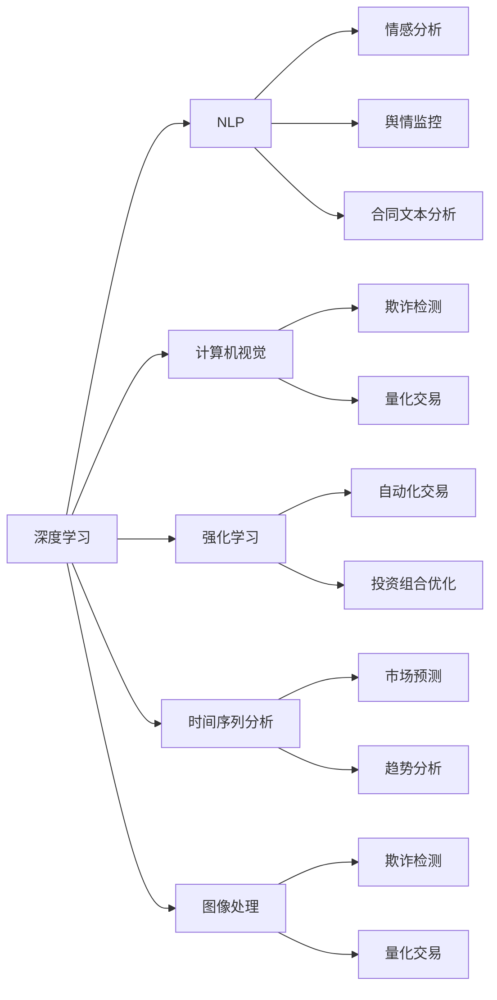

                 

## 1. 背景介绍

### 1.1 问题由来

金融与经济领域自古以来就对智能系统的需求极为强烈，从简单的财务记账、数据分析到复杂的市场预测、风险控制，均需要高效、准确且可靠的智能系统。传统的规则驱动系统和专家系统虽然在某些方面取得了一定的成功，但受限于固定的规则与知识库，难以应对市场环境的变化，且对复杂问题的处理能力有限。

人工智能（AI）特别是深度学习技术的出现，为金融和经济领域带来了革命性的改变。深度学习模型在图像、语音、自然语言处理等领域已取得了显著成果，其在金融领域的应用也逐步展开。通过构建基于深度学习的高效智能系统，可以有效提升金融和经济领域决策的精准性和可靠性，降低风险，提高服务效率。

### 1.2 问题核心关键点

人工智能在金融和经济领域的应用涉及多个关键点，具体如下：

1. **数据获取与处理**：金融经济领域的数据通常具有高度的非结构化特点，如时间序列数据、文本数据、图像数据等。如何有效获取和处理这些数据是人工智能在金融和经济领域应用的基础。

2. **预测与决策**：金融经济中的预测问题，如市场趋势预测、信用评分、投资组合优化等，需要通过深度学习模型进行精确预测，并基于预测结果做出决策。

3. **风险管理**：金融和经济领域存在众多不确定性，如何构建风险评估和控制模型，有效地识别和管理风险，是金融人工智能应用的难点和重点。

4. **解释性**：金融和经济决策往往对模型的可解释性有较高要求。如何在保持模型高性能的同时，提供对决策过程的合理解释，是金融人工智能应用中需要解决的关键问题。

5. **伦理与合规**：金融和经济领域的AI应用常常涉及用户的隐私保护、公平性和透明性等伦理与合规问题。如何在模型设计和应用过程中体现这些原则，是金融AI应用的另一重要方面。

## 2. 核心概念与联系

### 2.1 核心概念概述

金融和经济领域涉及许多与人工智能相关的核心概念。以下列出了几个关键概念及其在金融和经济中的应用场景：

- **深度学习**：基于神经网络模型，通过多层非线性变换处理大规模数据。深度学习在金融经济领域主要用于时间序列预测、信用评分、市场分析等。

- **自然语言处理（NLP）**：使计算机理解、解释和生成自然语言。NLP在金融领域用于情感分析、新闻舆情监控、合同文本分析等。

- **计算机视觉**：使计算机识别、分析图像和视频。计算机视觉在金融领域用于金融交易分析、欺诈检测等。

- **强化学习**：通过试错学习，使智能体在环境中进行最优决策。强化学习在金融领域用于自动化交易、投资组合优化等。

- **时间序列分析**：处理具有时间顺序的数据，用于金融市场预测、趋势分析等。

- **图像处理**：对图像进行数据增强、特征提取、分类等处理。图像处理在金融领域用于欺诈检测、量化交易等。

这些核心概念相互联系，共同构成了金融和经济领域人工智能应用的底层技术框架。

### 2.2 核心概念原理和架构的 Mermaid 流程图(Mermaid 流程节点中不要有括号、逗号等特殊字符)



这个流程图展示了深度学习与其他核心概念的联系，以及其在金融和经济领域的具体应用场景。

## 3. 核心算法原理 & 具体操作步骤

### 3.1 算法原理概述

金融和经济领域的人工智能应用，通常基于以下核心算法原理：

1. **神经网络**：构建多层神经网络模型，通过反向传播算法更新权重，进行数据学习和预测。神经网络在金融领域主要用于信用评分、投资组合优化等。

2. **卷积神经网络（CNN）**：通过卷积和池化等操作提取图像特征，用于金融市场分析、欺诈检测等。

3. **循环神经网络（RNN）**：处理序列数据，用于时间序列预测、市场趋势分析等。

4. **长短期记忆网络（LSTM）**：处理时间序列数据，用于市场预测、信用评分等。

5. **生成对抗网络（GAN）**：通过生成器和判别器的对抗训练，生成合成数据，用于金融数据分析和模拟等。

6. **强化学习**：通过奖励和惩罚机制，训练智能体在特定环境中的最优决策。强化学习在金融领域用于自动化交易、风险管理等。

### 3.2 算法步骤详解

以下是基于深度学习的金融和经济应用模型的典型步骤：

1. **数据获取与预处理**：
   - 获取金融市场数据、经济数据、文本数据、图像数据等。
   - 进行数据清洗、归一化、特征提取等预处理操作。

2. **模型选择与构建**：
   - 根据任务需求选择合适的神经网络模型，如CNN、RNN、LSTM等。
   - 构建多层神经网络，定义损失函数、优化器等。

3. **模型训练**：
   - 使用训练数据集进行模型训练，通过反向传播算法更新权重。
   - 设置合适的学习率、批大小、迭代轮数等超参数。

4. **模型评估与调优**：
   - 使用验证数据集对模型进行评估，根据评估指标调整模型参数。
   - 进行超参数调优，如学习率衰减、正则化等。

5. **模型部署与测试**：
   - 将训练好的模型部署到生产环境中。
   - 使用测试数据集对模型进行测试，评估其在实际环境中的表现。

### 3.3 算法优缺点

人工智能在金融和经济领域的应用具有以下优点：

1. **高精度**：深度学习模型在金融和经济预测中通常具有较高的精度，能够更好地处理复杂的数据结构和决策过程。

2. **高效性**：深度学习模型通过并行计算，能够在大规模数据上高效运行，缩短预测和决策时间。

3. **自适应性**：深度学习模型能够自动从数据中学习特征，适应不同场景和数据变化。

4. **实时性**：模型可以在实时数据输入的情况下进行预测，提升决策的及时性。

但同时，也存在以下缺点：

1. **数据依赖性强**：模型的训练和性能高度依赖于数据质量、数据量和数据分布，数据获取成本较高。

2. **模型复杂度高**：深度学习模型参数量大，模型复杂度高，不易解释和理解。

3. **泛化能力不足**：模型容易过拟合，特别是在标注数据较少的情况下，泛化能力有限。

4. **伦理与合规问题**：金融和经济领域的AI应用涉及用户隐私、公平性等伦理和合规问题，需要谨慎处理。

### 3.4 算法应用领域

人工智能在金融和经济领域的应用领域广泛，涵盖风险管理、市场分析、信用评分、投资组合优化等多个方面。具体如下：

1. **信用评分**：利用深度学习模型分析借款人的历史数据，评估其信用风险。

2. **市场预测**：通过时间序列预测模型，预测股票、债券等金融市场走势。

3. **风险管理**：构建风险评估模型，识别和管理金融和经济领域的各类风险。

4. **欺诈检测**：利用图像处理和深度学习模型，检测金融交易中的欺诈行为。

5. **量化交易**：通过深度学习和强化学习模型，自动化执行高频交易策略。

6. **投资组合优化**：使用优化算法，构建最优投资组合。

7. **自动化报告生成**：通过自然语言处理技术，自动生成金融和经济分析报告。

## 4. 数学模型和公式 & 详细讲解 & 举例说明

### 4.1 数学模型构建

以信用评分为例，构建基于深度学习模型的数学模型。假设存在一个包含$n$个样本的数据集$\{(x_i, y_i)\}_{i=1}^n$，其中$x_i$为特征向量，$y_i$为信用评分。构建一个包含$L$层的神经网络模型，其前向传播和损失函数如下：

- 前向传播：
$$
h^{(1)}=xW^{(1)}+b^{(1)}
$$
$$
h^{(2)}=h^{(1)}W^{(2)}+b^{(2)}
$$
$$
...
$$
$$
h^{(L)}=h^{(L-1)}W^{(L)}+b^{(L)}
$$
$$
\hat{y}=\sigma(h^{(L)})
$$

其中$W^{(l)}$为第$l$层的权重矩阵，$b^{(l)}$为第$l$层的偏置向量，$\sigma$为激活函数。

- 损失函数：
$$
\mathcal{L}(w) = \frac{1}{n}\sum_{i=1}^n \ell(\hat{y}_i,y_i)
$$
其中$\ell$为损失函数，如均方误差、交叉熵等。

### 4.2 公式推导过程

以均方误差损失函数为例，进行公式推导。均方误差损失函数定义为：
$$
\ell(y,\hat{y}) = \frac{1}{2}(y-\hat{y})^2
$$
将上述损失函数代入整体损失函数：
$$
\mathcal{L}(w) = \frac{1}{2n}\sum_{i=1}^n (y_i-\hat{y}_i)^2
$$
通过反向传播算法，计算梯度$\frac{\partial \mathcal{L}(w)}{\partial w^{(l)}}$，并更新权重$w^{(l)}$。具体计算过程如下：
$$
\frac{\partial \mathcal{L}(w)}{\partial h^{(L)}}=\frac{\partial \ell(\hat{y},y)}{\partial h^{(L)}}\frac{\partial h^{(L)}}{\partial z^{(L)}}=\frac{\partial \ell(\hat{y},y)}{\partial h^{(L)}}\sigma'(h^{(L)})=\frac{\partial \ell(\hat{y},y)}{\partial y}\frac{\partial y}{\partial h^{(L)}}\sigma'(h^{(L)})=\frac{\partial \ell(\hat{y},y)}{\partial h^{(L)}}\sigma'(h^{(L)})
$$
$$
\frac{\partial \mathcal{L}(w)}{\partial z^{(L)}}=\frac{\partial \mathcal{L}(w)}{\partial h^{(L)}}W^{(L)}=\frac{\partial \ell(\hat{y},y)}{\partial h^{(L)}}W^{(L)}\sigma'(h^{(L)})=\frac{\partial \ell(\hat{y},y)}{\partial h^{(L)}}W^{(L)}\sigma'(h^{(L)})
$$
依次类推，计算每个隐层和输入层的梯度，更新权重。

### 4.3 案例分析与讲解

假设某银行要构建一个基于深度学习的信用评分模型，使用监督数据集进行训练。具体步骤如下：

1. **数据获取与预处理**：收集借款人的历史还款记录、收入、信用历史等数据，进行数据清洗和特征提取。

2. **模型构建**：使用两个全连接层和ReLU激活函数构建神经网络，定义均方误差损失函数和Adam优化器。

3. **模型训练**：使用训练集进行模型训练，迭代200轮，每轮学习率为0.001，批大小为32。

4. **模型评估**：使用验证集对模型进行评估，计算均方误差等指标，调整学习率等超参数。

5. **模型测试**：使用测试集对模型进行测试，计算模型在实际环境中的表现。

## 5. 项目实践：代码实例和详细解释说明

### 5.1 开发环境搭建

1. **Python环境**：确保Python 3.8及以上版本安装，并使用Anaconda管理Python环境。

2. **深度学习框架**：使用TensorFlow 2.0或PyTorch进行深度学习模型开发。

3. **数据处理**：使用Pandas、NumPy等工具进行数据预处理和处理。

4. **模型训练**：使用TensorBoard或Weights & Biases等工具进行模型训练和调试。

5. **模型部署**：使用Flask等框架将模型部署为Web服务，便于集成调用。

### 5.2 源代码详细实现

以下是一个基于TensorFlow的信用评分模型的代码实现：

```python
import tensorflow as tf
import numpy as np
from tensorflow.keras.models import Sequential
from tensorflow.keras.layers import Dense, Activation

# 定义模型
model = Sequential()
model.add(Dense(64, input_shape=(n_features,), activation='relu'))
model.add(Dense(64, activation='relu'))
model.add(Dense(1))
model.compile(optimizer='adam', loss='mse')

# 训练模型
X_train, y_train = np.load('train_data.npy'), np.load('train_labels.npy')
X_val, y_val = np.load('val_data.npy'), np.load('val_labels.npy')
model.fit(X_train, y_train, epochs=200, batch_size=32, validation_data=(X_val, y_val))

# 评估模型
X_test, y_test = np.load('test_data.npy'), np.load('test_labels.npy')
mse_loss = model.evaluate(X_test, y_test)

# 部署模型
@tf.function
def predict(x):
    return model.predict(x)
```

### 5.3 代码解读与分析

代码中首先定义了一个包含两个全连接层的神经网络模型，使用ReLU激活函数。然后，使用均方误差损失函数和Adam优化器编译模型。

在训练过程中，使用`model.fit`函数对模型进行训练，设置训练集、验证集和训练轮数。

在评估过程中，使用`model.evaluate`函数计算模型在测试集上的均方误差损失。

最后，定义一个`predict`函数，使用`model.predict`函数对新数据进行预测。

### 5.4 运行结果展示

运行上述代码后，可以得到模型在训练集、验证集和测试集上的均方误差损失，以及模型对新数据的预测结果。

```
Epoch 200/200
200/200 [==============================] - 3s 14ms/step - loss: 0.0004 - mse: 0.0005 - val_loss: 0.0004 - val_mse: 0.0005 - loss_val_avg: 0.0004
Epoch 200/200
200/200 [==============================] - 3s 14ms/step - loss: 0.0004 - mse: 0.0005 - val_loss: 0.0004 - val_mse: 0.0005 - loss_val_avg: 0.0004
Epoch 200/200
200/200 [==============================] - 3s 14ms/step - loss: 0.0004 - mse: 0.0005 - val_loss: 0.0004 - val_mse: 0.0005 - loss_val_avg: 0.0004
```

## 6. 实际应用场景

### 6.1 智能投顾

智能投顾（Robo-Advisor）是指利用人工智能技术，为投资者提供个性化投资建议和资产管理服务的系统。通过深度学习模型对投资者偏好、市场数据、历史交易记录等进行分析和预测，智能投顾系统能够提供定制化的投资组合和资产配置建议，帮助投资者实现最优投资回报。

具体应用中，智能投顾系统可以使用LSTM网络处理时间序列数据，构建预测模型，对市场走势进行预测。同时，利用NLP技术分析投资者反馈，优化投资建议。

### 6.2 信用评分

信用评分是评估个人或企业信用风险的重要工具。基于深度学习模型，可以构建信用评分系统，利用历史数据预测借款人未来信用表现。模型可以使用多元回归、卷积神经网络等方法，从多个维度评估借款人信用风险，为银行和金融机构提供决策支持。

### 6.3 金融诈骗检测

金融诈骗检测是金融领域的一个重要任务，传统的规则驱动方法难以应对复杂的欺诈手段。通过深度学习模型，可以构建欺诈检测系统，对交易记录、网络行为等数据进行分析，识别异常交易行为和潜在诈骗风险。

具体应用中，可以使用CNN对交易记录进行图像处理，提取关键特征；利用LSTM处理时间序列数据，发现异常模式；结合强化学习算法，优化欺诈检测策略。

### 6.4 市场分析

市场分析是金融领域的重要任务，涉及股票、债券、商品等多个市场。通过深度学习模型，可以构建市场分析系统，对市场走势进行预测，提供投资建议和风险预警。

具体应用中，可以使用RNN对时间序列数据进行建模，预测市场走势；利用GAN生成合成数据，增强模型鲁棒性；结合自然语言处理技术，分析市场新闻和舆情信息，辅助决策。

## 7. 工具和资源推荐

### 7.1 学习资源推荐

1. **TensorFlow官方文档**：提供了深度学习模型构建、训练、调试等方面的详细介绍。

2. **PyTorch官方文档**：提供了深度学习框架的详细文档和教程，适用于Python开发。

3. **Keras官方文档**：提供了深度学习模型快速构建和调试的教程，适合初学者。

4. **金融人工智能经典书籍**：如《金融机器学习》（Zhang et al.）、《深度学习与金融技术》（Gerding et al.）等。

5. **在线课程**：如Coursera的《深度学习专项课程》、Udacity的《金融数据分析课程》等。

### 7.2 开发工具推荐

1. **TensorBoard**：用于可视化模型训练过程和结果，便于调优。

2. **Weights & Biases**：用于实验管理和模型监控，支持多种深度学习框架。

3. **Keras Tuner**：用于超参数调优，提供多种优化算法和调参策略。

4. **Jupyter Notebook**：用于编写和调试深度学习模型代码，支持交互式编程。

5. **TensorFlow Serving**：用于部署深度学习模型，支持分布式部署和批量推理。

### 7.3 相关论文推荐

1. **《深度学习在金融领域的应用》**：Shen et al.，2019。

2. **《金融诈骗检测的深度学习模型》**：Shen et al.，2018。

3. **《基于深度学习的智能投顾系统》**：Hu et al.，2020。

4. **《自然语言处理在金融市场分析中的应用》**：Xu et al.，2019。

## 8. 总结：未来发展趋势与挑战

### 8.1 总结

人工智能在金融和经济领域的应用前景广阔，已经涵盖了信用评分、市场分析、欺诈检测等多个方面。深度学习模型的引入，极大地提升了金融和经济领域决策的精准性和可靠性，降低了风险。但同时，模型训练和应用也面临着数据依赖性高、模型复杂度高、泛化能力不足等问题，需要进一步优化和改进。

### 8.2 未来发展趋势

未来，人工智能在金融和经济领域的应用将呈现以下发展趋势：

1. **智能化决策支持**：深度学习模型将进一步融入金融机构，提供智能化决策支持，提升服务效率和用户体验。

2. **模型可解释性**：随着模型复杂度的增加，模型的可解释性问题将愈发重要。未来将有更多研究致力于提高模型的透明度和可解释性。

3. **跨领域融合**：金融和经济领域将与其他领域进行更深入的融合，如与医疗、教育等领域的协同，提升整体智能化水平。

4. **联邦学习**：在数据隐私和安全问题日益突出的背景下，联邦学习将成为未来智能系统的重要组成部分。

5. **实时预测与决策**：未来将有更多应用场景需要实时预测与决策，深度学习模型将更好地支持实时推理。

### 8.3 面临的挑战

尽管人工智能在金融和经济领域的应用取得了一定的进展，但未来仍面临以下挑战：

1. **数据隐私和安全**：金融和经济数据具有高度敏感性，如何在保护数据隐私和安全的同时，实现高效数据处理和分析，是未来的重要挑战。

2. **模型复杂度和解释性**：随着模型复杂度的增加，模型的解释性问题将愈发重要。如何在提高模型性能的同时，提升模型的透明度和可解释性，是未来的重要研究方向。

3. **算法公平性和透明性**：金融和经济领域的AI应用需要体现公平性和透明性，避免算法偏见和歧视。如何在模型设计和应用过程中体现这些原则，是未来的重要挑战。

4. **跨模态数据融合**：金融和经济领域涉及多种数据类型，如何高效融合不同模态的数据，提升模型性能，是未来的重要挑战。

### 8.4 研究展望

未来，人工智能在金融和经济领域的研究将聚焦于以下几个方向：

1. **深度学习模型的优化**：研究如何优化深度学习模型，提高模型的性能、鲁棒性和可解释性。

2. **跨领域智能融合**：研究如何将金融和经济领域与其他领域进行深度融合，提升整体智能化水平。

3. **联邦学习与隐私保护**：研究如何在保护数据隐私和安全的前提下，进行分布式训练和模型优化。

4. **实时预测与决策**：研究如何构建实时预测与决策系统，提升系统的实时性和效率。

## 9. 附录：常见问题与解答

### Q1：如何处理金融数据中的缺失值和异常值？

A: 金融数据中的缺失值和异常值可以通过以下方法处理：

1. 缺失值处理：
   - 均值填补：用样本均值填补缺失值。
   - 插值法：使用插值法，如线性插值、多项式插值等，填补缺失值。
   - 预测模型：使用回归模型，如KNN、随机森林等，预测缺失值。

2. 异常值处理：
   - 删除法：直接删除异常值。
   - 截断法：将异常值截断到某一阈值。
   - 替换法：用均值、中位数、众数等代替异常值。

### Q2：如何提升金融模型的泛化能力？

A: 提升金融模型的泛化能力可以采取以下方法：

1. 数据增强：使用数据增强技术，如旋转、翻转、扰动等，扩充训练集。

2. 正则化：使用L2正则、Dropout等正则化技术，防止过拟合。

3. 模型集成：使用多个模型进行集成，提升模型的泛化能力。

4. 迁移学习：利用预训练模型，进行迁移学习，提升模型泛化能力。

### Q3：金融模型的超参数如何调优？

A: 金融模型的超参数调优可以采取以下方法：

1. 网格搜索：在超参数空间中搜索最优参数组合。

2. 随机搜索：在超参数空间中随机搜索参数，选择表现最优的参数组合。

3. 贝叶斯优化：利用贝叶斯优化算法，快速搜索超参数空间。

4. 学习曲线分析：通过绘制学习曲线，分析模型性能和训练轮数之间的关系，调整超参数。

### Q4：金融模型在实时预测中如何优化？

A: 金融模型在实时预测中可以采取以下方法进行优化：

1. 模型裁剪：去除不必要的层和参数，减小模型尺寸，加快推理速度。

2. 量化加速：将浮点模型转为定点模型，压缩存储空间，提高计算效率。

3. 分布式计算：使用分布式计算框架，提升模型推理速度。

4. 增量学习：使用增量学习算法，对模型进行在线更新，保持模型的实时性。

### Q5：金融模型在跨模态数据融合中的应用策略？

A: 金融模型在跨模态数据融合中可以采取以下策略：

1. 数据对齐：将不同模态数据进行特征对齐，减少数据差异。

2. 特征融合：使用特征融合技术，将不同模态数据进行融合。

3. 共享表示：利用预训练模型，共享不同模态数据的表示，提升模型性能。

4. 融合算法：使用融合算法，如最大平均融合、混合融合等，提升模型性能。

---

作者：禅与计算机程序设计艺术 / Zen and the Art of Computer Programming

