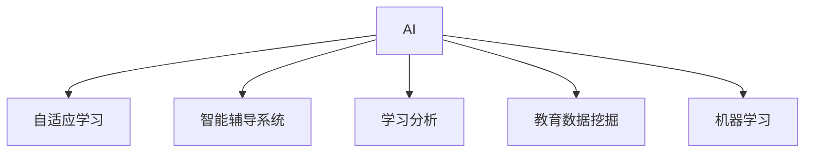

                 

# 人工智能：教育变革的催化剂

人工智能（AI），这门融合了计算机科学、认知科学、心理学等多学科知识的前沿科技，正在以无可阻挡的势头，深入到社会的每一个角落，改变着人类的生活方式和思维方式。而在这一变革浪潮中，教育领域无疑是最受关注的领域之一。随着AI技术的发展和应用，教育领域正经历着前所未有的变革，AI正逐步成为教育变革的催化剂。本文将深入探讨AI在教育领域的应用及其对未来教育的影响，帮助读者全面理解AI如何重塑教育，并展望其未来发展趋势。

## 1. 背景介绍

### 1.1 问题由来
随着信息技术的快速发展和互联网的普及，教育领域正经历着一场深刻的变革。传统教育模式受到数字化、信息化浪潮的冲击，教育资源的获取方式、教学方法、评估方式都正在发生改变。与此同时，AI技术的迅猛发展为教育的智能化、个性化和高效化提供了可能。AI在教育中的应用，包括智能辅导、自适应学习、个性化评估等方面，正在改变着传统教育模式，开启了一个智能化教育的新时代。

### 1.2 问题核心关键点
AI在教育中的应用核心关键点包括：
- 智能化辅导：利用AI进行个性化推荐，为学生提供更精准的学习建议和资源。
- 自适应学习：根据学生的学习情况动态调整教学内容和方法，提升学习效率。
- 个性化评估：通过AI技术实现更加客观、精准的学习评估，帮助教师和学生更好地理解学习进度和问题。
- 智能化管理：借助AI进行学生信息管理和课程排课，提升教育管理效率。

这些关键点共同构成了AI在教育领域的核心应用，使得教育更加智能化、个性化和高效化。

## 2. 核心概念与联系

### 2.1 核心概念概述

为更好地理解AI在教育领域的应用，本节将介绍几个密切相关的核心概念：

- 人工智能（AI）：一种通过计算机模拟人类智能活动的科技，包括学习、推理、感知、决策等方面。
- 自适应学习（Adaptive Learning）：根据学生学习情况，动态调整教学内容和方式，使教学更加贴合学生的个体差异和需求。
- 智能辅导系统（Intelligent Tutoring System, ITS）：利用AI技术，为学生提供个性化、智能化的辅导服务，提升学习效果。
- 学习分析（Learning Analytics）：通过分析学习数据，了解学生的学习行为和表现，为教学优化提供依据。
- 教育数据挖掘（Educational Data Mining, EDM）：从教育数据中挖掘知识，为教育决策提供支持。
- 机器学习（Machine Learning）：AI的核心技术之一，通过数据学习，提升模型的预测和决策能力。

这些核心概念之间的逻辑关系可以通过以下Mermaid流程图来展示：



这个流程图展示了这个AI在教育领域的应用核心概念及其之间的关系：

1. AI是基础，通过机器学习等技术实现。
2. 自适应学习和智能辅导系统是AI在教育中的典型应用。
3. 学习分析和教育数据挖掘为AI在教育中的应用提供了数据支持和决策依据。

## 3. 核心算法原理 & 具体操作步骤

### 3.1 算法原理概述

AI在教育领域的应用，主要基于机器学习和深度学习的算法原理。这些算法通过学习大量的教育数据，不断优化和调整模型，提升预测和决策能力。具体来说，AI在教育中的应用主要包括：

- 自适应学习：通过机器学习算法，分析学生的学习行为和成绩，自动调整教学内容和难度，提高学习效率。
- 智能辅导系统：利用深度学习模型，模拟教师的辅导行为，提供个性化、智能化的学习建议和资源。
- 学习分析：通过数据挖掘和机器学习技术，分析学生的学习数据，了解学生的学习习惯和需求，为教学优化提供依据。

这些算法的基本原理是：通过学习大量的教育数据，构建学生学习模型，预测学生的学习行为和结果，从而实现个性化和智能化的教学和评估。

### 3.2 算法步骤详解

AI在教育中的应用，主要包括以下几个关键步骤：

**Step 1: 数据收集与预处理**
- 收集教育数据，包括学生的学习行为数据、考试成绩、学习资源使用情况等。
- 对数据进行清洗、归一化和特征提取等预处理操作。

**Step 2: 构建学习模型**
- 选择合适的机器学习或深度学习模型，如线性回归、决策树、随机森林、神经网络等。
- 训练模型，利用学习数据不断优化模型参数，提升模型的预测能力。

**Step 3: 学习分析与个性化推荐**
- 分析学生的学习数据，了解学生的学习行为和结果。
- 根据学生的学习情况，进行个性化推荐，如推荐适合的学习资源、调整教学难度等。

**Step 4: 智能辅导与动态评估**
- 利用智能辅导系统，根据学生的学习情况，提供个性化的辅导建议。
- 动态评估学生的学习效果，及时调整教学策略。

**Step 5: 教学优化与效果评估**
- 利用学习分析和评估数据，优化教学策略和课程设计。
- 对教学效果进行评估，不断提升教学质量。

以上是对AI在教育中应用的典型步骤。不同的应用场景可能需要进行不同的优化和调整。

### 3.3 算法优缺点

AI在教育中的应用具有以下优点：
1. 个性化：根据学生个体差异，提供个性化推荐和辅导，提升学习效果。
2. 高效性：利用机器学习技术，自动优化教学策略，提高教学效率。
3. 客观性：通过数据分析，提供客观的学习评估，避免主观偏见。
4. 可扩展性：AI算法易于扩展，适用于不同领域和规模的教育场景。

同时，AI在教育中的应用也存在一些局限性：
1. 数据隐私：教育数据涉及学生隐私，需要严格的数据保护措施。
2. 模型可解释性：AI模型的决策过程难以解释，需要更好的解释机制。
3. 资源依赖：AI应用需要大量的计算资源和数据，对硬件和网络环境要求较高。
4. 依赖高质量数据：模型的效果很大程度上取决于数据的质量和数量。

尽管存在这些局限性，但AI在教育中的应用前景广阔，未来有巨大的发展潜力。

### 3.4 算法应用领域

AI在教育中的应用涵盖了从基础教育到高等教育、从在线教育到传统教育等各个领域。以下是几个典型应用场景：

- **基础教育**：智能辅导系统为小学生提供数学、英语等学科的个性化辅导，帮助学生掌握基础知识。
- **高等教育**：通过学习分析技术，对大学生的学习行为进行研究，提供个性化建议，提升学习效率。
- **在线教育**：利用AI技术，优化在线课程设计和教学策略，提升在线学习体验和效果。
- **职业培训**：利用自适应学习技术，为成人教育提供个性化职业培训，提高职业技能和就业竞争力。

## 4. 数学模型和公式 & 详细讲解  
### 4.1 数学模型构建

在本节中，我们将以机器学习模型为例，介绍其在教育领域的应用。假设我们的目标是构建一个预测学生考试成绩的学习模型。

首先，我们需要准备数据集 $D=\{(x_i,y_i)\}_{i=1}^N$，其中 $x_i$ 是学生的学习行为数据（如课堂参与度、作业完成情况等），$y_i$ 是学生的考试成绩。

我们的目标是最小化损失函数 $L(\theta)$，其中 $\theta$ 是模型的参数。常用的损失函数包括均方误差（MSE）和交叉熵损失（CE）。

### 4.2 公式推导过程

以均方误差损失函数为例，其公式为：

$$
L(\theta) = \frac{1}{N} \sum_{i=1}^N (y_i - \hat{y}_i)^2
$$

其中 $\hat{y}_i$ 是模型的预测值。

我们利用梯度下降算法最小化损失函数，更新模型的参数 $\theta$。梯度下降的公式为：

$$
\theta_{t+1} = \theta_t - \alpha \nabla_{\theta}L(\theta_t)
$$

其中 $\alpha$ 是学习率。

### 4.3 案例分析与讲解

以智能辅导系统为例，我们可以利用机器学习模型分析学生的学习行为，预测学生可能的学习困难，并提供个性化的辅导建议。

例如，我们可以使用决策树模型来分析学生的学习行为，构建决策树如下：

```
tree:
  特征 A1 = 否？
    - 是：A2 = 否？
      - 是：A3 = 是？
        - 是：选择资源 B1
        - 否：选择资源 B2
      - 否：选择资源 B3
    - 否：选择资源 B4
```

在构建决策树后，我们可以根据学生的学习行为，预测其可能的学习困难，并提供相应的资源和建议。

## 5. 项目实践：代码实例和详细解释说明

### 5.1 开发环境搭建

在进行AI在教育中的应用开发前，我们需要准备好开发环境。以下是使用Python进行TensorFlow开发的环境配置流程：

1. 安装Anaconda：从官网下载并安装Anaconda，用于创建独立的Python环境。

2. 创建并激活虚拟环境：
```bash
conda create -n tf-env python=3.8 
conda activate tf-env
```

3. 安装TensorFlow：从官网获取对应的安装命令。例如：
```bash
conda install tensorflow -c tf
```

4. 安装相关库：
```bash
pip install numpy pandas scikit-learn matplotlib
```

完成上述步骤后，即可在`tf-env`环境中开始AI在教育中的项目实践。

### 5.2 源代码详细实现

下面我们以智能辅导系统为例，给出使用TensorFlow进行开发的PyTorch代码实现。

首先，定义学生的学习行为数据和考试成绩：

```python
import tensorflow as tf
import numpy as np

# 学生学习行为数据
x = np.array([[0, 0, 0, 1], [1, 0, 0, 0], [0, 1, 1, 0], [1, 1, 1, 1]])

# 学生考试成绩
y = np.array([80, 60, 90, 70])
```

然后，定义模型参数和损失函数：

```python
# 定义模型参数
theta = tf.Variable(tf.random.normal([4, 1]), name='theta')

# 定义损失函数
def loss(y_pred, y_true):
    return tf.reduce_mean(tf.square(y_pred - y_true))

# 计算损失
y_pred = tf.matmul(x, theta)
loss_value = loss(y_pred, y)
```

接着，定义优化器和训练循环：

```python
# 定义优化器
optimizer = tf.optimizers.Adam()

# 定义训练循环
def train_step(x, y):
    with tf.GradientTape() as tape:
        y_pred = tf.matmul(x, theta)
        loss_value = loss(y_pred, y)
    gradients = tape.gradient(loss_value, theta)
    optimizer.apply_gradients(zip(gradients, [theta]))

# 训练模型
for i in range(100):
    train_step(x, y)
    print('Iteration {}: Loss = {}'.format(i, loss_value.numpy()))
```

最后，输出训练后的模型参数：

```python
print('Final Model Parameters: ', theta.numpy())
```

以上就是使用TensorFlow对学生考试成绩进行预测的完整代码实现。可以看到，利用TensorFlow，我们可以高效地实现AI在教育中的应用，并进行模型训练和优化。

### 5.3 代码解读与分析

让我们再详细解读一下关键代码的实现细节：

**x和y定义**：
- 我们定义了学生学习行为数据x和考试成绩y，用于训练和测试模型。

**模型参数theta**：
- 使用tf.Variable定义模型的参数theta，并初始化为随机数。

**损失函数定义**：
- 定义均方误差损失函数，计算预测值和真实值之间的差异。

**训练循环**：
- 在训练循环中，我们使用tf.GradientTape记录梯度，使用Adam优化器更新模型参数，不断优化损失函数。

**模型输出**：
- 最后输出训练后的模型参数，可以看到模型的参数值已经发生了变化。

可以看到，TensorFlow的深度学习框架使得AI在教育中的应用开发变得简洁高效。开发者可以将更多精力放在数据处理、模型优化等高层逻辑上，而不必过多关注底层的实现细节。

当然，工业级的系统实现还需考虑更多因素，如模型的保存和部署、超参数的自动搜索、更灵活的任务适配层等。但核心的应用开发流程基本与此类似。

## 6. 实际应用场景

### 6.1 智能辅导系统

智能辅导系统是AI在教育中的典型应用之一。利用智能辅导系统，可以为学生提供个性化的学习建议和资源，帮助学生克服学习困难，提高学习效率。

例如，利用机器学习模型分析学生的学习行为，识别出可能的学习困难，并提供相应的辅导建议。在智能辅导系统中，可以实时监测学生的学习状态，根据学生的学习进度和表现，动态调整教学内容和策略，提升学习效果。

### 6.2 自适应学习

自适应学习是AI在教育中的另一个重要应用。通过自适应学习，可以为学生提供个性化的学习方案，提升学习效率。

例如，利用机器学习模型分析学生的学习数据，了解学生的学习习惯和难点，自动调整教学内容和难度，为学生提供个性化的学习方案。在自适应学习中，可以根据学生的学习进度和反馈，实时调整教学策略，确保每个学生都能获得最适合自己的学习方案。

### 6.3 学习分析

学习分析是AI在教育中的核心应用之一。通过学习分析，可以为教师和学生提供学习效果评估，优化教学策略。

例如，利用机器学习模型分析学生的学习数据，了解学生的学习行为和表现，为教师和学生提供学习效果评估。在评估中，可以分析学生的学习数据，识别出学习中的薄弱环节，提供个性化的学习建议。

### 6.4 未来应用展望

随着AI技术的不断发展，其在教育领域的应用前景广阔。未来，AI在教育中的应用将更加广泛和深入，具体展望如下：

- **智能课堂**：利用AI技术，构建智能课堂系统，提供个性化的教学资源和辅导服务，提升课堂教学效果。
- **个性化学习**：通过AI技术，实现个性化学习方案，为每个学生提供最适合的学习路径和资源。
- **自适应评估**：利用AI技术，实现自适应评估系统，动态调整评估内容和标准，提升评估的准确性和公平性。
- **在线教育**：利用AI技术，优化在线教育平台的设计和功能，提升在线学习的体验和效果。
- **教育管理**：利用AI技术，实现教育管理系统的智能化和自动化，提升教育管理效率。

以上应用场景展示了AI在教育领域的广阔前景，未来将有更多创新应用的涌现。

## 7. 工具和资源推荐

### 7.1 学习资源推荐

为了帮助开发者系统掌握AI在教育领域的应用，这里推荐一些优质的学习资源：

1. **TensorFlow官方文档**：TensorFlow的官方文档提供了丰富的学习资源和样例代码，是了解TensorFlow和AI在教育中的应用的基础。

2. **机器学习公开课**：斯坦福大学的机器学习课程（CS229）提供了深入浅出的讲解，适合初学者和进阶者。

3. **深度学习框架教程**：《深度学习框架教程》系列书籍详细介绍了TensorFlow、PyTorch等深度学习框架的使用方法，是AI在教育应用开发的重要参考。

4. **AI教育应用开发指南**：《AI教育应用开发指南》介绍了AI在教育中的应用场景和开发实践，为开发者提供全面的指导。

5. **教育数据分析**：《教育数据分析》书籍详细介绍了教育数据的挖掘、分析和应用，为AI在教育中的应用提供了数据支持。

通过对这些资源的学习实践，相信你一定能够全面掌握AI在教育中的应用，并用于解决实际的NLP问题。

### 7.2 开发工具推荐

高效的开发离不开优秀的工具支持。以下是几款用于AI在教育中的开发工具：

1. **TensorFlow**：由Google主导开发的开源深度学习框架，生产部署方便，适合大规模工程应用。

2. **PyTorch**：由Facebook开发的开源深度学习框架，灵活动态的计算图，适合快速迭代研究。

3. **Keras**：基于TensorFlow和Theano的高级神经网络API，简单易用，适合初学者和快速开发。

4. **Jupyter Notebook**：交互式笔记本环境，适合快速原型设计和代码实验。

5. **TensorBoard**：TensorFlow配套的可视化工具，可实时监测模型训练状态，并提供丰富的图表呈现方式。

6. **Weights & Biases**：模型训练的实验跟踪工具，可以记录和可视化模型训练过程中的各项指标，方便对比和调优。

这些工具在AI在教育中的应用开发中具有广泛的应用，可以显著提升开发效率，加快创新迭代的步伐。

### 7.3 相关论文推荐

AI在教育领域的研究源于学界的持续研究。以下是几篇奠基性的相关论文，推荐阅读：

1. **深度学习在教育中的应用**：《Deep Learning in Education》论文综述了深度学习在教育领域的应用，包括自适应学习、智能辅导等。

2. **基于机器学习的个性化学习**：《Personalized Learning Based on Machine Learning》论文介绍了机器学习在个性化学习中的应用。

3. **自适应学习系统**：《Adaptive Learning Systems》论文探讨了自适应学习系统的构建和应用。

4. **智能辅导系统的设计与实现**：《Design and Implementation of Intelligent Tutoring Systems》论文介绍了智能辅导系统的设计和实现方法。

5. **教育数据分析的挑战与机遇**：《Challenges and Opportunities in Educational Data Analysis》论文探讨了教育数据分析的挑战和机遇。

这些论文代表了大语言模型微调技术的发展脉络。通过学习这些前沿成果，可以帮助研究者把握学科前进方向，激发更多的创新灵感。

## 8. 总结：未来发展趋势与挑战

### 8.1 总结

本文对AI在教育领域的应用进行了全面系统的介绍。首先阐述了AI在教育变革中的重要性和应用前景，明确了AI在教育中的核心应用和关键点。其次，从原理到实践，详细讲解了AI在教育中的应用过程，给出了具体的代码实例。同时，本文还广泛探讨了AI在教育中的应用场景和未来展望，展示了AI在教育中的广阔前景。此外，本文精选了AI在教育中的各类学习资源，力求为读者提供全方位的技术指引。

通过本文的系统梳理，可以看到，AI在教育领域的应用正处于快速发展阶段，具有巨大的潜力和广阔的应用前景。随着AI技术的不断进步，其在教育中的应用将更加广泛和深入，为教育事业的发展带来革命性的变化。

### 8.2 未来发展趋势

展望未来，AI在教育中的应用将呈现以下几个发展趋势：

1. **智能化教学**：利用AI技术，实现智能化的课堂教学和个性化学习方案，提升教学效果和学习体验。
2. **数据驱动的决策**：通过数据分析和机器学习技术，为教育决策提供支持，提升教育管理效率。
3. **人机协同的教育模式**：结合AI和人类教师的优势，构建人机协同的教育模式，提升教育质量。
4. **跨学科的学习**：利用AI技术，实现跨学科的学习和研究，提升学生的综合素质和创新能力。
5. **全球化的教育资源**：利用AI技术，实现教育资源的全球共享和跨文化交流，提升教育的国际化水平。

以上趋势展示了AI在教育领域的广阔前景，未来将有更多创新应用的涌现。

### 8.3 面临的挑战

尽管AI在教育中的应用前景广阔，但在迈向更加智能化、普适化应用的过程中，它仍面临着诸多挑战：

1. **数据隐私**：教育数据涉及学生隐私，需要严格的数据保护措施。
2. **模型可解释性**：AI模型的决策过程难以解释，需要更好的解释机制。
3. **资源依赖**：AI应用需要大量的计算资源和数据，对硬件和网络环境要求较高。
4. **依赖高质量数据**：模型的效果很大程度上取决于数据的质量和数量。
5. **跨文化适应性**：不同国家和地区的教育体系和课程设置存在差异，AI教育应用需要考虑跨文化适应性。

尽管存在这些挑战，但AI在教育中的应用前景广阔，未来有巨大的发展潜力。未来需要从数据保护、模型可解释性、资源优化、数据质量等多方面进行深入研究，才能更好地推进AI在教育中的应用。

### 8.4 研究展望

面向未来，AI在教育中的应用需要在以下几个方面进行深入研究：

1. **跨文化适应性**：研究如何在不同国家和地区的教育体系中应用AI技术，提升跨文化适应性。
2. **数据隐私保护**：研究如何保护学生隐私，防止数据泄露和滥用。
3. **模型可解释性**：研究如何提高AI模型的可解释性，提升教育决策的透明度和可信度。
4. **资源优化**：研究如何优化AI应用的计算资源和数据资源，提升应用效率。
5. **数据质量提升**：研究如何提高教育数据的质量和数量，提升AI模型的效果。

这些研究方向将有助于进一步推动AI在教育中的应用，为教育事业的发展提供有力支持。

## 9. 附录：常见问题与解答

**Q1：AI在教育中的应用有哪些？**

A: AI在教育中的应用包括智能辅导、自适应学习、个性化评估等方面。通过AI技术，可以为学生提供个性化的学习方案和辅导服务，提升学习效果。

**Q2：AI在教育中如何实现自适应学习？**

A: 利用机器学习技术，分析学生的学习数据，了解学生的学习习惯和难点，自动调整教学内容和难度，为学生提供个性化的学习方案。

**Q3：AI在教育中的主要挑战是什么？**

A: AI在教育中的主要挑战包括数据隐私、模型可解释性、资源依赖、依赖高质量数据等。这些挑战需要从技术、政策等多个方面进行综合解决。

**Q4：AI在教育中的应用前景如何？**

A: AI在教育中的应用前景广阔，未来将有更多创新应用的涌现。通过AI技术，可以实现智能化教学、数据驱动的决策、人机协同的教育模式等，提升教育效果和学习体验。

**Q5：AI在教育中的应用如何提升教学效果？**

A: AI在教育中的应用可以提升教学效果的多个方面，如个性化学习、自适应评估、智能辅导等。通过AI技术，可以为学生提供更加精准的学习建议和资源，提升学习效果。

这些问题的解答展示了AI在教育中的应用场景和挑战，未来需要从多个方面进行深入研究，才能更好地推进AI在教育中的应用。

