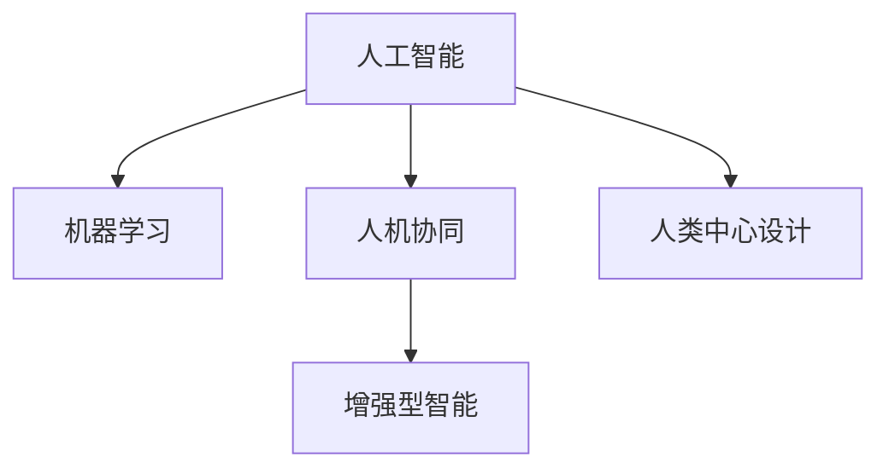

                 

# 人机协同：未来工作的核心竞争力

在当前数字化、智能化快速发展的时代，人工智能(AI)技术已经在各个领域取得了显著进展，从自动驾驶到智能客服，从金融风险预测到医疗诊断，AI的影子无处不在。然而，我们必须清醒地认识到，人工智能并非要完全取代人类，而是要与人类协同工作，共同解决复杂问题。本文将深入探讨人机协同的工作方式及其在未来工作中的核心竞争力，通过逻辑清晰、结构紧凑、简单易懂的专业的技术语言，阐述这一转变将如何重塑我们未来的工作模式，提升生产力，实现可持续发展。

## 1. 背景介绍

### 1.1 问题由来
随着科技的迅猛发展，人工智能在各行各业中的应用日益广泛。传统的以机械重复、体力劳动为主的工作正在逐步被自动化替代，而复杂的决策、创意、人际关系等任务则需要人类与AI的协同完成。在医疗、金融、教育、制造等行业，AI与人类协同工作的场景已经出现，且不断增加。例如，AI可以在医疗影像分析中辅助医生，在金融市场预测中协助分析师，在教育中提供个性化教学，在制造中优化生产流程。人机协同已成为未来工作的重要趋势。

### 1.2 问题核心关键点
当前，人机协同的工作模式正逐渐成为企业和员工共同追求的目标。它不仅仅是技术问题，更是管理、组织、教育等多方面的综合体现。关键点包括：
- 明确人机分工：确定哪些任务适合人类完成，哪些任务适合AI完成，找到最优的分工组合。
- 数据驱动决策：利用AI对大量数据进行分析，辅助人类做出更科学的决策。
- 提升工作效率：通过AI自动化重复性高的工作，使人类专注于更有创造性和价值的工作。
- 增强学习能力：AI可以提供个性化学习路径和反馈，加速员工技能提升。
- 优化资源配置：AI能够实时监控和调整资源分配，提高资源利用率。

### 1.3 问题研究意义
研究人机协同的实际应用，对于提升企业的竞争力、优化组织结构、改善工作方式、提升员工满意度等具有重要意义：

1. 提升效率与质量：通过人机协同，可以大幅提升工作效率和质量，降低人为错误率。
2. 降低成本：自动化重复性高的工作可以显著降低人力成本。
3. 提升员工技能：通过AI辅助学习，员工可以更快掌握新技能，适应新的工作环境。
4. 创新驱动：AI与人类协同工作，可以激发更多创意和创新，推动企业技术进步。
5. 改善工作环境：通过AI优化任务分配和资源配置，员工可以更好地平衡工作与生活，提升幸福感。

## 2. 核心概念与联系

### 2.1 核心概念概述

要理解人机协同的工作方式，首先需要了解几个关键概念：

- 人工智能(AI)：指通过计算机技术模拟人类智能行为的能力，包括感知、学习、推理等。
- 机器学习(ML)：指使机器具有学习能力的过程，通过对数据进行训练，使机器能够自主地做出决策或预测。
- 人机协同(Co-human Collaboration)：指人类与AI在特定任务上的合作，共同完成工作。
- 增强型智能(Enhanced Intelligence)：指通过人机协同，使人类智能得到增强，实现1+1>2的效果。
- 人类中心设计(Human-Centered Design)：指在设计产品和服务时，以人类需求和体验为核心，关注人的感受和使用效果。

这些核心概念之间的关系可以通过以下Mermaid流程图来展示：



这个流程图展示了大语言模型与增强智能和人类中心设计的关系：

1. 人工智能通过机器学习获得学习能力，使其具备智能行为。
2. 人机协同是人工智能与人类合作的方式，共同完成任务。
3. 增强型智能是人工智能与人类协同后的综合表现，实现智能提升。
4. 人类中心设计关注人的需求和体验，确保人机协同系统的人性化和易用性。

这些概念共同构成了人机协同的工作框架，使AI与人类能高效协作，共同解决复杂问题。

## 3. 核心算法原理 & 具体操作步骤
### 3.1 算法原理概述

人机协同的核心在于利用AI的能力，辅助人类完成复杂任务。这一过程通常包括以下几个步骤：

1. 任务定义与分解：将任务细化为AI和人类能够分别处理的部分。
2. 数据准备与收集：为AI提供高质量的数据集，确保其训练效果。
3. AI模型训练：使用机器学习算法训练AI模型，使其具备完成任务的能力。
4. 协同工作流程设计：设计AI与人类协同的工作流程，明确各自的角色和职责。
5. 反馈与优化：通过不断的反馈和优化，提升协同工作的效率和质量。

### 3.2 算法步骤详解

以智能客服系统为例，具体阐述人机协同的实现步骤：

1. **任务定义与分解**：
   - 任务：回答客户问题，处理客户投诉。
   - 分解：智能客服系统负责自动回答常见问题，复杂的或特殊问题转交给人工客服。

2. **数据准备与收集**：
   - 收集历史客服对话数据，标注问题-答案对。
   - 使用无标签对话数据进行预训练，提升语言理解能力。

3. **AI模型训练**：
   - 使用BERT等预训练模型进行微调，适应智能客服任务。
   - 添加适当的任务适配层，如分类器和解码器，设计损失函数。

4. **协同工作流程设计**：
   - 设定对话流程，AI先进行自动回答，人工客服在必要时介入。
   - 设计反馈机制，人工客服对AI回答进行评价，进一步优化AI模型。

5. **反馈与优化**：
   - 实时监控客服系统表现，收集用户反馈。
   - 定期评估AI模型，根据反馈调整模型参数。

### 3.3 算法优缺点

人机协同具有以下优点：
1. 高效性：AI可以自动化重复性高的任务，提高工作效率。
2. 准确性：AI在数据处理和分析方面具有天然优势，降低人为错误率。
3. 可扩展性：人机协同系统可以迅速扩展到其他任务和场景。

同时，人机协同也存在以下局限性：
1. 依赖数据：AI模型需要大量标注数据进行训练，数据获取和标注成本较高。
2. 缺乏创造力：AI在处理需要创新和灵活应变的情况时，仍需人类介入。
3. 技术复杂性：设计和维护协同系统需要较高的技术门槛。
4. 沟通障碍：人机协同过程中，AI和人类之间的沟通仍需解决。

### 3.4 算法应用领域

人机协同技术在多个领域已得到广泛应用，以下是几个典型场景：

1. **医疗诊断**：AI辅助医生进行影像分析、病历分析，提高诊断准确性。
2. **金融风险管理**：AI帮助分析师进行市场预测、风险评估，辅助决策。
3. **智能制造**：AI优化生产流程、设备维护，提高生产效率。
4. **智慧城市**：AI用于交通管理、环境监测，提升城市管理水平。
5. **教育培训**：AI提供个性化学习路径、智能辅导，提升教育效果。

这些领域的应用展示了人机协同的广泛前景和潜力。随着技术的不断进步，人机协同将在更多行业发挥重要作用，推动产业升级和经济增长。

## 4. 数学模型和公式 & 详细讲解 & 举例说明

### 4.1 数学模型构建

假设有一项任务需要人机协同完成，其中AI负责数据处理，人类负责最终决策。设任务完成时间为 $T$，AI完成部分时间为 $T_A$，人类完成部分时间为 $T_H$，AI与人类协同完成时间的总和为 $T_{total}$。

模型的目标是最小化总完成时间 $T_{total}$，即：

$$
\min_{T_A, T_H} T_{total} = T_A + T_H
$$

满足约束条件：

$$
T_A + T_H = T
$$

其中 $T_A$ 和 $T_H$ 为决策变量，需要通过优化算法求解。

### 4.2 公式推导过程

以智能客服系统为例，进行公式推导。设问题处理时间为 $T$，智能客服系统处理时间为 $T_A$，人工客服处理时间为 $T_H$。

假设客服系统在回答常见问题时，AI的平均回答时间为 $t_A$，人工客服的平均回答时间为 $t_H$。设某问题的回答概率为 $p$，人工客服介入的概率为 $p_0$。

则系统的平均回答时间为：

$$
T = p \cdot t_A + (1-p) \cdot (p_0 \cdot t_H + (1-p_0) \cdot T)
$$

最小化平均回答时间 $T$ 即为优化目标。

### 4.3 案例分析与讲解

以医疗影像分析为例，分析人机协同的工作流程。

- 任务：诊断患者影像，确定疾病类型。
- 数据：收集大量医疗影像数据，标注患者信息和疾病类型。
- AI模型：使用预训练模型进行微调，添加分类器，输出疾病预测。
- 协同流程：AI先进行初步诊断，输出可能疾病类型，医生进行复核，最终确定诊断结果。

## 5. 项目实践：代码实例和详细解释说明
### 5.1 开发环境搭建

要实现人机协同，需要搭建一个综合性的开发环境。以下是搭建环境的步骤：

1. 安装Python：选择Python 3.x版本进行安装，确保系统环境支持。
2. 安装必要的依赖库：如TensorFlow、PyTorch、OpenAI Gym等，用于AI模型训练和测试。
3. 搭建AI模型训练环境：可以使用Google Colab、AWS SageMaker等云端平台，也可以搭建本地环境。
4. 部署AI模型：选择合适的方式进行模型部署，如API服务、微服务、容器化等。
5. 集成到业务系统：将AI模型集成到现有业务系统中，实现协同工作。

### 5.2 源代码详细实现

以智能客服系统的实现为例，展示代码实现：

```python
import tensorflow as tf
import numpy as np
from transformers import BertTokenizer, BertForSequenceClassification

# 加载数据集
train_dataset = ...
test_dataset = ...

# 定义模型结构
tokenizer = BertTokenizer.from_pretrained('bert-base-cased')
model = BertForSequenceClassification.from_pretrained('bert-base-cased', num_labels=2)

# 数据预处理
def preprocess_data(text):
    tokens = tokenizer.tokenize(text)
    input_ids = tokenizer.convert_tokens_to_ids(tokens)
    input_ids = [input_ids] * max_len
    attention_mask = [1] * max_len
    return input_ids, attention_mask

# 训练模型
model.compile(optimizer='adam', loss='binary_crossentropy', metrics=['accuracy'])
model.fit(train_dataset, epochs=5, batch_size=32)

# 模型评估
test_loss, test_acc = model.evaluate(test_dataset)
print('Test Accuracy:', test_acc)
```

### 5.3 代码解读与分析

- `BertTokenizer` 和 `BertForSequenceClassification`：用于处理文本数据和构建分类模型。
- `preprocess_data` 函数：将输入文本转换为模型可接受的格式。
- `model.compile` 和 `model.fit`：定义模型的训练过程。
- `model.evaluate`：评估模型的性能。

## 6. 实际应用场景

### 6.1 智能客服系统

智能客服系统是典型的人机协同应用场景。传统的客服模式往往依赖大量人力，响应速度慢，成本高。而基于AI的智能客服系统，通过自然语言处理和机器学习，能够自动回答常见问题，大大提高客服效率和客户满意度。

### 6.2 金融风险管理

在金融领域，AI可以用于市场预测、风险评估，辅助分析师进行决策。AI通过分析大量的历史数据和市场信息，能够快速识别风险信号，预测市场波动，帮助金融机构制定更科学的投资策略。

### 6.3 智慧城市

智慧城市管理中，AI可以用于交通流量监控、环境监测、公共安全等。通过AI和传感器数据的融合，城市管理者可以实时掌握城市运行状况，及时做出调整，提升城市管理水平。

### 6.4 教育培训

在教育领域，AI可以提供个性化学习路径和智能辅导，帮助学生更高效地学习。AI系统通过分析学生的学习行为和表现，能够生成个性化的学习建议，并实时反馈，提高教育效果。

## 7. 工具和资源推荐
### 7.1 学习资源推荐

为了帮助开发者掌握人机协同的核心技术和应用方法，推荐以下学习资源：

1. **《人工智能导论》**：讲解AI的基本概念和算法，适合入门学习。
2. **《深度学习》**：详细介绍了深度学习框架和算法，涵盖卷积、循环、生成等模型。
3. **《强化学习》**：介绍强化学习的基础理论和应用，适用于解决复杂决策问题。
4. **Coursera AI课程**：提供多门AI相关课程，涵盖从入门到高级的内容。
5. **Kaggle竞赛**：参与实际数据竞赛，提高AI应用能力。

### 7.2 开发工具推荐

以下是推荐的人机协同开发工具：

1. **TensorFlow**：支持大规模深度学习模型训练和部署。
2. **PyTorch**：灵活的动态计算图框架，易于调试和优化。
3. **OpenAI Gym**：提供丰富的环境模拟和评估工具，用于测试AI模型。
4. **Jupyter Notebook**：交互式笔记本，方便代码编写和调试。
5. **GitHub**：代码托管平台，支持团队协作和版本控制。

### 7.3 相关论文推荐

为了深入了解人机协同的理论和实践，推荐以下相关论文：

1. **《人机协同智能系统：现状、挑战与展望》**：综述了人机协同系统的研究现状和未来方向。
2. **《人机协同中的强化学习》**：介绍了强化学习在协同系统中的应用和挑战。
3. **《人机协同中的知识共享与协同创新》**：研究了知识共享机制在协同系统中的作用。
4. **《人机协同中的动态优化》**：讨论了协同系统中的优化问题及其解决方案。

## 8. 总结：未来发展趋势与挑战

### 8.1 研究成果总结

人机协同技术正在快速发展，已经在多个领域展示了其强大的应用潜力。其主要研究成果包括：

1. 深度学习模型的应用：通过深度学习模型，提高了人机协同系统的智能化水平。
2. 自然语言处理技术的进步：使AI能够更准确地理解和生成自然语言，提升人机交互质量。
3. 协同框架的设计：提出了多种协同框架，如层次协同、分布式协同等，提高了系统可扩展性和灵活性。

### 8.2 未来发展趋势

人机协同技术未来的发展趋势包括：

1. 多模态协同：将语音、图像、视频等多模态数据融入协同系统中，提升整体智能化水平。
2. 自适应协同：系统能够根据环境和任务的变化，动态调整工作流程和资源分配。
3. 智能人机交互：通过语音识别、自然语言生成等技术，实现更自然的人机交互方式。
4. 端到端协同：从数据获取到任务执行，形成一个完整的协同链条，提升系统整体效率。
5. 持续学习与优化：系统能够不断从新数据中学习，自我优化，适应不断变化的任务需求。

### 8.3 面临的挑战

尽管人机协同技术取得了显著进展，但在实际应用中仍然面临以下挑战：

1. 数据隐私与安全：协同系统中涉及大量敏感数据，如何保护隐私和安全是一大难题。
2. 技术标准化：不同系统的接口、数据格式、协议等不统一，影响协同效果。
3. 人机协作机制：如何设计合理的协作机制，确保人机协同的效率和效果。
4. 系统复杂性：协同系统的设计和维护复杂度较高，需要多方协作。
5. 伦理与社会影响：人机协同系统的广泛应用，对就业、伦理等社会问题产生深远影响。

### 8.4 研究展望

未来，人机协同技术的研究将更加注重以下几个方向：

1. 理论研究：深入探索协同系统的理论基础，推动人机协同的科学化。
2. 技术突破：开发更加高效、灵活、可扩展的协同技术。
3. 应用创新：探索人机协同在更多领域的应用，推动产业升级。
4. 伦理考量：关注协同系统对社会的影响，建立伦理标准和规范。
5. 人机协作：研究如何更好地融合人类智慧和AI技术，实现高效协同。

## 9. 附录：常见问题与解答

**Q1：人机协同与传统自动化有什么不同？**

A: 传统自动化依赖固定的程序和规则，难以应对复杂的任务变化。而人机协同利用AI的能力，与人类共同解决问题，能够适应任务的多样性和复杂性。

**Q2：人机协同如何确保数据隐私与安全？**

A: 通过数据加密、访问控制等技术，确保数据在传输和存储过程中的安全。同时，对于涉及隐私数据的处理，需要遵守相关法律法规。

**Q3：人机协同系统如何实现智能人机交互？**

A: 通过语音识别、自然语言生成等技术，使AI能够理解和生成自然语言，提升交互体验。同时，设计友好的人机界面，增强用户体验。

**Q4：人机协同系统如何进行持续学习与优化？**

A: 利用AI的自我学习能力，不断从新数据中学习，优化模型参数和决策规则。同时，设计有效的反馈机制，及时调整系统行为。

**Q5：人机协同系统如何应对复杂任务变化？**

A: 设计灵活的任务分解和协同机制，使AI和人类能够根据任务变化灵活调整工作方式。同时，通过持续优化和训练，提高系统的适应能力。

---

作者：禅与计算机程序设计艺术 / Zen and the Art of Computer Programming

