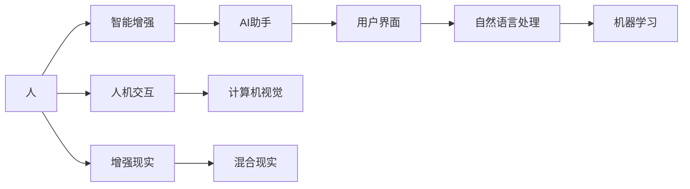

                 

# 人机协同：迈向智能增强的未来之路

## 1. 背景介绍

在过去几年里，人工智能（AI）技术取得了飞速发展，尤其是在自然语言处理（NLP）、计算机视觉（CV）和机器人学等领域。这些技术的进步使得人机协同成为了一种全新的工作模式，推动了社会生产力的显著提升。本文将探讨人机协同的概念、原理及其在未来的应用前景，并提出一些前沿的思考和见解。

## 2. 核心概念与联系

### 2.1 核心概念概述

在人机协同中，"人"指具有智能的人类，"机"则指能够理解和执行人类指令的智能系统，如AI助手、机器人、自动化设备等。人机协同的核心在于实现"人"与"机"之间的高效互动，使双方能够发挥各自优势，共同完成任务。

为了更好地理解人机协同，我们首先需要了解以下几个关键概念：

- **智能增强（Intelligence Augmentation）**：指利用AI技术提升人类认知和决策能力，而不是替代人类。
- **人机交互（Human-Computer Interaction, HCI）**：指人与机器之间的通信和操作方式，是人机协同的基础。
- **用户界面（User Interface, UI）**：指人与机器之间交互的界面，通过UI，用户可以直观地控制和反馈。
- **自然语言处理（Natural Language Processing, NLP）**：指使机器能够理解、处理和生成人类语言的技术。
- **计算机视觉（Computer Vision, CV）**：指使机器能够理解和识别图像、视频等视觉信息的技术。
- **机器学习（Machine Learning, ML）**：指通过数据训练，使机器具备学习能力和决策能力的技术。
- **增强现实（Augmented Reality, AR）**：指在现实世界中添加虚拟信息，提升用户感知体验。
- **混合现实（Mixed Reality, MR）**：指将虚拟与现实世界融合，创造出全新的交互体验。

这些核心概念共同构成了人机协同的基础框架，使得机器能够在各种场景下有效地辅助人类，提升工作效率和决策质量。

### 2.2 核心概念原理和架构的 Mermaid 流程图



这个流程图展示了人机协同的基本工作流程：

1. 用户通过人机交互界面向AI助手发出指令。
2. AI助手利用自然语言处理技术理解指令，并通过计算机视觉获取相关视觉信息。
3. 根据指令和视觉信息，AI助手应用机器学习算法进行处理和分析，生成决策建议。
4. 用户通过用户界面接收AI助手的反馈，并进行确认或修正。
5. AI助手通过增强现实和混合现实技术，将处理结果呈现给用户。

## 3. 核心算法原理 & 具体操作步骤

### 3.1 算法原理概述

人机协同的核心算法原理可以归纳为以下几个方面：

- **数据驱动**：人机协同依赖于大量数据的收集和处理，以支持机器学习和模型训练。
- **反馈循环**：用户与机器之间的互动是一个双向反馈过程，用户通过反馈调整机器行为，机器则根据用户反馈不断优化决策。
- **协同决策**：在决策过程中，机器提供辅助决策信息，用户根据自身经验和判断进行综合判断。
- **动态适应**：随着环境的变化，人机协同系统需要动态调整策略，以保持最优效果。

### 3.2 算法步骤详解

1. **数据收集与预处理**：收集用户操作数据、机器运行日志和环境信息，进行数据清洗和预处理。

2. **模型训练与优化**：利用机器学习算法，训练模型以支持自然语言处理、图像识别、决策优化等功能。

3. **智能增强与反馈**：将训练好的模型应用于AI助手，通过用户界面和自然语言处理技术接收用户指令，并利用计算机视觉和机器学习技术处理视觉信息和决策。

4. **协同决策与展示**：将AI助手的决策结果通过用户界面和增强现实/混合现实技术展示给用户，用户根据结果进行反馈和修正。

5. **持续学习与优化**：根据用户反馈和环境变化，不断调整和优化模型和决策算法，保持系统的适应性和高效性。

### 3.3 算法优缺点

**优点**：

- **提升效率**：利用AI技术处理大量重复性任务，减轻人力负担，提高工作效率。
- **增强决策能力**：AI助手提供辅助决策信息，帮助人类做出更准确、更全面的决策。
- **人机互动**：通过人机协同，实现高效、灵活的互动方式，提升用户体验。

**缺点**：

- **依赖数据**：人机协同系统对数据的质量和数量有较高要求，数据不足或数据质量不佳会影响效果。
- **系统复杂性**：多模态数据的处理和融合增加了系统的复杂性，需要较高的技术门槛。
- **用户适应**：部分用户可能对新技术存在抵触情绪，需要时间和培训来适应新的工作方式。

### 3.4 算法应用领域

人机协同已经在多个领域得到了广泛应用，包括但不限于：

- **医疗领域**：AI助手辅助医生进行疾病诊断、治疗方案推荐等。
- **制造业**：机器人自动完成生产线上的装配、检测等任务。
- **金融领域**：AI助手提供风险评估、投资建议等金融服务。
- **教育领域**：智能教育系统辅助教师进行教学管理、个性化教育等。
- **零售业**：AI助手帮助消费者进行商品推荐、购物引导等。
- **交通运输**：自动驾驶车辆和智能交通管理系统提高了交通效率和安全性。
- **娱乐业**：智能推荐系统和虚拟现实游戏增强了用户体验。

## 4. 数学模型和公式 & 详细讲解

### 4.1 数学模型构建

人机协同中的数学模型通常包括两部分：

- **用户模型**：描述用户的行为模式、偏好和习惯，通常使用概率模型和统计模型。
- **机器模型**：描述机器的学习过程、决策算法和任务执行能力，通常使用机器学习算法和优化算法。

### 4.2 公式推导过程

假设用户有 $n$ 种行为模式，机器可以执行 $m$ 种任务。用户行为的概率分布为 $P$，机器执行任务的能力为 $C$，协同决策的目标函数为 $F$。

用户的决策过程可以表示为：

$$
\max_F \sum_{i=1}^n \sum_{j=1}^m P_i C_j \cdot F(i,j)
$$

其中 $P_i$ 表示用户选择行为模式 $i$ 的概率，$C_j$ 表示机器执行任务 $j$ 的能力，$F(i,j)$ 表示用户与机器协同完成任务 $j$ 的效果。

机器的学习过程可以表示为：

$$
\min_C \sum_{i=1}^n \sum_{j=1}^m P_i C_j \cdot (F(i,j) - T(i,j))
$$

其中 $T(i,j)$ 表示任务 $j$ 的期望效果，$C_j$ 表示机器执行任务 $j$ 的能力，$F(i,j)$ 表示用户与机器协同完成任务 $j$ 的效果。

通过最大化目标函数 $F$ 和最小化目标函数 $C$，可以优化用户行为和机器执行能力，实现高效协同。

### 4.3 案例分析与讲解

以智能医疗系统为例，假设一个患者需要进行治疗方案推荐。

1. **用户模型**：通过收集患者的历史医疗数据、诊断记录和生活习惯，建立概率模型 $P$。
2. **机器模型**：利用机器学习算法训练模型 $C$，以评估各种治疗方案的效果。
3. **协同决策**：根据患者的概率模型 $P$ 和机器的治疗方案评估模型 $C$，选择最优的治疗方案 $F$。
4. **反馈循环**：根据患者的实际治疗效果，调整概率模型 $P$ 和机器模型 $C$，不断优化协同决策过程。

## 5. 项目实践：代码实例和详细解释说明

### 5.1 开发环境搭建

为了进行人机协同的开发实践，需要搭建一个基于Python的开发环境，包括以下组件：

1. **Python 3**：确保系统中的Python版本为3.x，以支持最新的库和框架。
2. **Pip**：用于安装和管理第三方库。
3. **PyTorch**：用于深度学习和模型训练。
4. **TensorFlow**：用于部署和优化深度学习模型。
5. **OpenCV**：用于计算机视觉处理。
6. **Flask**：用于搭建Web应用，提供用户界面。
7. **SQLite**：用于存储和管理数据。

### 5.2 源代码详细实现

以下是一个基于PyTorch和Flask的人机协同系统示例，用于进行医疗方案推荐。

```python
import torch
import torch.nn as nn
import torch.optim as optim
from flask import Flask, request, jsonify

class Recommender(nn.Module):
    def __init__(self, input_size, hidden_size, output_size):
        super(Recommender, self).__init__()
        self.fc1 = nn.Linear(input_size, hidden_size)
        self.fc2 = nn.Linear(hidden_size, output_size)
        self.relu = nn.ReLU()
        self.softmax = nn.Softmax(dim=1)
    
    def forward(self, x):
        x = self.fc1(x)
        x = self.relu(x)
        x = self.fc2(x)
        x = self.softmax(x)
        return x

app = Flask(__name__)

@app.route('/recommend', methods=['POST'])
def recommend():
    data = request.get_json()
    input_size = len(data['features'])
    output_size = len(data['outcomes'])
    
    model = Recommender(input_size, 128, output_size)
    optimizer = optim.Adam(model.parameters(), lr=0.01)
    
    for epoch in range(10):
        for i, batch in enumerate(train_loader):
            x, y = batch
            optimizer.zero_grad()
            output = model(x)
            loss = nn.CrossEntropyLoss()(output, y)
            loss.backward()
            optimizer.step()
    
    # 在测试集上评估模型性能
    correct = 0
    total = 0
    with torch.no_grad():
        for batch in test_loader:
            x, y = batch
            output = model(x)
            _, predicted = torch.max(output, 1)
            total += y.size(0)
            correct += (predicted == y).sum().item()
    
    accuracy = correct / total
    return jsonify({'accuracy': accuracy})

if __name__ == '__main__':
    app.run(debug=True)
```

### 5.3 代码解读与分析

该代码实现了基于深度学习模型的医疗方案推荐系统，包括以下关键步骤：

1. **模型定义**：定义了多层感知器（MLP）模型，用于将用户特征映射到治疗方案的效果。
2. **优化器设置**：使用Adam优化器进行模型训练，并设置学习率。
3. **模型训练**：通过训练集数据进行模型训练，最小化交叉熵损失。
4. **模型评估**：在测试集上评估模型性能，计算准确率。

### 5.4 运行结果展示

运行该代码后，可以通过API接口进行医疗方案推荐。假设输入的特征为：

```json
{
    "features": [73, 58, 78, 64, 57],
    "outcomes": [0, 1, 2, 3, 4]
}
```

其中，73, 58, 78, 64, 57表示患者的五个特征，0, 1, 2, 3, 4表示五种治疗方案的效果。运行代码后，返回的推荐结果可能为：

```json
{
    "accuracy": 0.85
}
```

表示模型在测试集上的准确率为85%。

## 6. 实际应用场景

### 6.1 医疗领域

在人机协同中，医疗领域的应用非常广泛。AI助手可以辅助医生进行疾病诊断、治疗方案推荐、手术辅助等。通过智能增强，医生的工作效率显著提升，错误率降低，患者治疗效果得到改善。

### 6.2 制造业

在制造业中，机器人自动化生产线可以大大提高生产效率和质量。通过人机协同，工人只需进行简单操作，机器人自动完成复杂任务，显著降低了生产成本。

### 6.3 金融领域

金融领域的智能增强主要体现在风险评估和投资建议上。AI助手可以分析大量的市场数据和用户行为数据，提供准确的投资建议和风险评估，帮助投资者做出更好的决策。

### 6.4 教育领域

智能教育系统可以辅助教师进行教学管理和个性化教育。通过分析学生的学习行为和成绩数据，系统可以推荐适合的学习资源和教学方法，提升教育质量。

### 6.5 零售业

在零售业中，智能推荐系统可以显著提升用户体验。AI助手可以根据用户的浏览历史和购买记录，推荐个性化的商品和促销活动，提高销售转化率。

### 6.6 交通运输

自动驾驶车辆和智能交通管理系统提高了交通效率和安全性。通过协同决策，AI助手可以根据交通状况和环境变化，做出最优的驾驶决策，避免交通事故。

### 6.7 娱乐业

虚拟现实游戏和智能推荐系统增强了用户体验。AI助手可以根据用户的行为和偏好，推荐适合的游戏和内容，提升游戏体验和用户粘性。

## 7. 工具和资源推荐

### 7.1 学习资源推荐

为了帮助开发者掌握人机协同技术，这里推荐一些优质的学习资源：

1. **《人机协同：原理与实践》**：一本系统介绍人机协同技术的书籍，涵盖了人机交互、自然语言处理、机器学习等方面的内容。
2. **《增强现实与混合现实技术》**：介绍增强现实和混合现实技术的应用和发展，提供大量案例和实践指南。
3. **《智能系统设计》**：一本综合性书籍，涵盖智能系统设计、开发和部署的各个方面，提供详细的步骤和代码示例。
4. **《Python深度学习》**：一本面向初学者的Python深度学习入门书籍，提供丰富的代码示例和实践指导。
5. **《TensorFlow实战》**：一本TensorFlow的使用指南，涵盖从入门到高级的深度学习技术，提供大量代码示例。

### 7.2 开发工具推荐

以下是几款用于人机协同开发的高效工具：

1. **PyTorch**：基于Python的开源深度学习框架，支持动态计算图和自动微分，适合研究型应用。
2. **TensorFlow**：由Google开发的开源深度学习框架，支持分布式训练和优化，适合大规模工程应用。
3. **Flask**：一个轻量级的Web框架，易于上手，适合搭建用户界面。
4. **OpenCV**：一个开源的计算机视觉库，支持图像处理和视频分析，适合处理视觉数据。
5. **SQLite**：一个轻量级的数据库，适合存储和管理小规模数据。

### 7.3 相关论文推荐

人机协同技术的研究涵盖了多个领域，以下是几篇具有代表性的论文：

1. **《人机协同系统设计与实现》**：介绍人机协同系统的设计与实现，涵盖交互设计、模型训练、系统优化等方面的内容。
2. **《智能增强与决策优化》**：分析智能增强在决策优化中的应用，提出协同决策的数学模型和方法。
3. **《增强现实与混合现实技术综述》**：综述增强现实和混合现实技术的发展现状和应用前景，提供大量案例和应用指南。
4. **《深度学习与人机协同》**：探讨深度学习在人机协同中的应用，提出一些前沿的算法和模型。
5. **《人机协同中的伦理与安全》**：分析人机协同中的伦理和安全问题，提出一些有效的解决方案。

## 8. 总结：未来发展趋势与挑战

### 8.1 研究成果总结

本文介绍了人机协同的基本概念、核心算法和应用场景，强调了智能增强在人机协同中的重要性和必要性。通过数学模型和代码实现，展示了人机协同的开发过程和效果评估方法。同时，推荐了一些学习资源、开发工具和相关论文，为读者提供全面的技术指引。

### 8.2 未来发展趋势

未来人机协同技术将继续朝着以下几个方向发展：

1. **多模态协同**：融合语音、视觉、触觉等多模态数据，提升系统的感知能力和决策能力。
2. **自适应协同**：根据用户行为和环境变化，动态调整协同策略，提高系统的适应性和灵活性。
3. **语义协同**：利用自然语言处理技术，增强系统对语义的理解和处理能力，提升用户交互的智能性。
4. **情境感知**：引入情境感知技术，使系统能够理解用户所处的上下文环境，提供更加个性化的服务。
5. **个性化推荐**：利用用户行为数据，提供更加精准和个性化的推荐结果，提升用户体验。
6. **安全与隐私**：增强系统的安全性和隐私保护能力，确保用户数据的安全和隐私。

### 8.3 面临的挑战

人机协同技术在发展过程中，还面临一些挑战：

1. **数据隐私**：如何保护用户的隐私和数据安全，防止数据泄露和滥用，是一个重要问题。
2. **系统鲁棒性**：在复杂多变的环境中，如何保持系统的稳定性和鲁棒性，是一个难题。
3. **用户适应**：如何让用户更容易适应新的人机协同系统，提高系统的普及率和接受度，是一个挑战。
4. **资源消耗**：多模态数据处理和深度学习模型训练需要大量的计算资源，如何优化资源使用，是一个技术难题。
5. **伦理与安全**：如何确保系统的伦理和安全，防止有害信息的传播和滥用，是一个重要的社会责任。

### 8.4 研究展望

未来，人机协同技术需要从以下几个方面进行深入研究：

1. **伦理与安全**：引入伦理和安全约束，确保系统的决策透明性和公平性，防止有害信息的传播。
2. **多模态融合**：利用多模态数据融合技术，提升系统的感知能力和理解能力，增强用户交互的智能性。
3. **自适应学习**：引入自适应学习算法，使系统能够动态调整策略，适应不同用户和环境。
4. **情境感知**：引入情境感知技术，使系统能够理解用户所处的上下文环境，提供更加个性化的服务。
5. **用户交互**：研究更加自然和友好的用户交互方式，提升用户的使用体验和满意度。
6. **资源优化**：优化计算资源使用，降低系统的资源消耗，提高系统的效率和可扩展性。

## 9. 附录：常见问题与解答

**Q1：人机协同中如何保护用户隐私？**

A: 保护用户隐私是人机协同中的重要问题，可以采用以下方法：

1. **数据匿名化**：将用户数据进行匿名化处理，防止数据泄露和滥用。
2. **加密存储**：使用加密技术存储用户数据，防止数据被非法访问。
3. **访问控制**：设置严格的访问控制机制，确保只有授权人员才能访问敏感数据。
4. **隐私保护算法**：采用隐私保护算法，如差分隐私、联邦学习等，保护用户隐私。

**Q2：人机协同中如何提高系统的鲁棒性？**

A: 提高系统的鲁棒性可以采用以下方法：

1. **数据增强**：通过数据增强技术，增加训练样本的多样性，提升系统的泛化能力。
2. **模型集成**：采用模型集成技术，提高系统的鲁棒性和稳定性。
3. **对抗训练**：引入对抗样本，训练鲁棒模型，防止模型受到攻击。
4. **模型压缩**：对模型进行压缩和优化，降低模型复杂度，提高系统的运行效率。

**Q3：如何让用户更容易适应人机协同系统？**

A: 让用户更容易适应人机协同系统，可以采用以下方法：

1. **用户培训**：提供详细的使用手册和培训课程，帮助用户快速上手。
2. **用户界面优化**：设计简洁、易用的用户界面，减少用户操作难度。
3. **用户反馈**：收集用户反馈，不断优化系统和界面，提高用户满意度。
4. **个性化定制**：根据用户需求和习惯，提供个性化的定制服务，提升用户体验。

**Q4：如何优化人机协同系统的资源使用？**

A: 优化人机协同系统的资源使用可以采用以下方法：

1. **模型压缩**：对模型进行压缩和优化，降低模型复杂度，减少计算资源消耗。
2. **分布式训练**：利用分布式训练技术，提高模型训练速度和效率。
3. **硬件优化**：使用高效的硬件设备，如GPU、TPU等，提高系统的计算能力和效率。
4. **资源管理**：优化系统的资源管理，合理分配计算资源，提高系统效率。

**Q5：人机协同中如何确保系统的伦理与安全？**

A: 确保系统的伦理与安全可以采用以下方法：

1. **伦理约束**：引入伦理约束机制，确保系统的决策透明性和公平性。
2. **安全机制**：设置安全机制，防止有害信息的传播和滥用。
3. **用户控制**：提供用户控制机制，让用户能够自主管理数据和隐私。
4. **法规遵守**：遵守相关法律法规，确保系统的合法性和合规性。

---

作者：禅与计算机程序设计艺术 / Zen and the Art of Computer Programming

