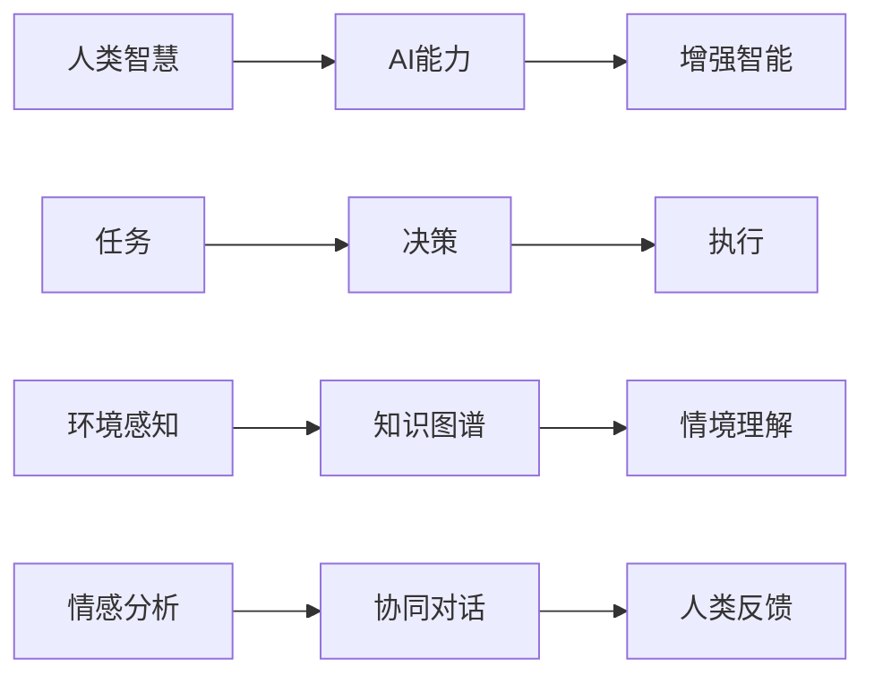

                 

# 人类-AI协作：增强人类智慧与AI能力的融合发展趋势与展望

> 关键词：人类-AI协作, 增强人类智慧, AI能力融合, 智能增强, 人机协同

## 1. 背景介绍

在人工智能（AI）飞速发展的今天，AI与人类智慧的融合已经成为新的研究热点。AI技术的不断进步不仅极大地提升了人类的工作效率和生活质量，也在某些领域开始挑战甚至超越人类的认知能力。然而，人类智慧和AI能力的融合并非简单的技术叠加，而是一个复杂的系统工程，需要在技术、伦理、社会等多个维度进行全面考量。本文旨在探讨人类-AI协作的融合发展趋势，并展望其未来前景。

## 2. 核心概念与联系

### 2.1 核心概念概述

本文将聚焦于以下核心概念：

- **人类-AI协作**：指的是人类与AI系统在特定任务中相互合作，实现共同目标的过程。这种协作形式能够充分发挥AI在处理大规模数据、复杂计算和模式识别等方面的优势，同时利用人类的创造力、直觉和情感优势。

- **增强人类智慧**：利用AI技术辅助人类在决策、创造、沟通等方面的智能增强，提升人类的认知能力和工作效率。

- **AI能力融合**：通过将AI的计算能力与人类智慧进行深度整合，构建更为智能、高效的系统，实现人机协同的目标。

### 2.2 核心概念原理和架构的 Mermaid 流程图



## 3. 核心算法原理 & 具体操作步骤

### 3.1 算法原理概述

人类-AI协作的核心算法原理主要基于**增强学习**和**协同优化**。增强学习通过不断的试错，学习在特定环境中采取最优行动，而协同优化则通过多智能体之间的互动，共同优化目标函数。在协作过程中，AI系统通过不断接收人类反馈，调整自身的行为策略，最终与人类协同实现任务目标。

### 3.2 算法步骤详解

#### 3.2.1 初始化

- **数据准备**：收集相关领域的数据，如文本、图像、语音等，并进行预处理，确保数据质量和多样性。
- **模型选择**：选择适合任务的AI模型，如深度学习、自然语言处理（NLP）、计算机视觉（CV）等。
- **环境搭建**：搭建虚拟或真实的环境，模拟任务执行场景，准备测试和评估环境。

#### 3.2.2 协同训练

- **模型训练**：在环境中训练AI模型，通过增强学习算法（如Q-learning、Policy Gradient等）不断优化模型行为。
- **人类介入**：在关键节点引入人类介入，通过人工反馈调整AI模型策略。
- **模型融合**：将人类智慧与AI能力进行融合，构建协同决策机制。

#### 3.2.3 测试与评估

- **性能测试**：在实际场景中测试AI系统性能，评估其准确性、效率和稳定性。
- **用户反馈**：收集用户反馈，了解AI系统的实际应用效果，并根据反馈不断优化AI行为。
- **模型迭代**：根据测试和评估结果，进行模型迭代和优化，提升AI系统的适应性和智能水平。

### 3.3 算法优缺点

#### 3.3.1 优点

- **任务灵活性**：AI系统能够处理大规模、复杂的数据，在特定任务中表现出超强的灵活性和适应性。
- **效率提升**：AI系统在计算和处理速度上远超人类，能够在短时间内完成大量任务，极大提升工作效率。
- **决策优化**：通过协同优化，AI系统能够提供最优化的决策方案，减少人为错误，提高决策质量。

#### 3.3.2 缺点

- **知识局限性**：AI系统在缺乏足够数据和经验的情况下，可能出现知识局限性，导致决策错误。
- **依赖数据质量**：AI系统的性能高度依赖于数据质量，低质量的数据可能导致误判和错误决策。
- **缺乏情感理解**：AI系统在情感理解和人类情感互动方面还存在不足，难以完全理解人类情感和需求。

### 3.4 算法应用领域

人类-AI协作的算法广泛应用于多个领域，包括但不限于：

- **医疗诊断**：AI辅助医生进行病情诊断、治疗方案制定，提升诊断准确性和治疗效果。
- **金融投资**：AI系统在数据分析、风险评估、投资决策等方面提供支持，优化投资策略。
- **智能制造**：AI系统在生产调度、质量控制、设备维护等方面发挥作用，提升生产效率和产品质量。
- **智能交通**：AI系统在交通流量分析、智能调度、事故预防等方面提供支持，改善交通管理。
- **教育培训**：AI系统在个性化教学、智能评估、学习路径推荐等方面提供支持，提升教学效果。

## 4. 数学模型和公式 & 详细讲解 & 举例说明

### 4.1 数学模型构建

人类-AI协作的数学模型构建主要包括以下几个方面：

- **环境模型**：描述任务执行环境的数学模型，如马尔可夫决策过程（MDP）、强化学习模型等。
- **决策模型**：描述AI系统决策过程的数学模型，如Q-learning模型、深度强化学习模型等。
- **协同模型**：描述人类与AI协同决策过程的数学模型，如多智能体系统模型、协同优化模型等。

### 4.2 公式推导过程

以**Q-learning算法**为例，推导其在协同优化中的应用。

Q-learning算法的基本公式为：

$$ Q(s,a) = Q(s,a) + \alpha [r + \gamma \max_{a'} Q(s',a') - Q(s,a)] $$

其中，$s$ 表示当前状态，$a$ 表示当前行动，$r$ 表示即时奖励，$\gamma$ 表示折扣因子，$\alpha$ 表示学习率。

在协同优化中，人类和AI系统共同执行任务，每个智能体根据当前状态和行动选择，更新自身的Q值，并通过协同机制共享信息，优化整体目标函数。

### 4.3 案例分析与讲解

以**智能交通系统**为例，分析人类-AI协作的实际应用。

在智能交通系统中，AI系统通过摄像头、传感器等设备收集交通数据，并根据实时交通情况，动态调整交通信号灯和路况信息。同时，人类交通管理员在关键节点介入，根据实际情况调整AI系统的策略。通过这种协同机制，AI系统能够高效地处理复杂的交通流量，提升交通管理效率和安全性。

## 5. 项目实践：代码实例和详细解释说明

### 5.1 开发环境搭建

为实现人类-AI协作的项目，需要以下开发环境：

- **Python**：作为主要的开发语言，Python具有丰富的第三方库和框架支持。
- **TensorFlow**：深度学习框架，支持大规模分布式训练。
- **Keras**：高层API，简化深度学习模型的开发和部署。
- **OpenAI Gym**：环境搭建工具，支持多种环境模拟。
- **Jupyter Notebook**：交互式开发环境，方便代码调试和演示。

### 5.2 源代码详细实现

以下是一个简单的**协同优化示例代码**：

```python
import gym
import numpy as np
import tensorflow as tf

# 加载环境
env = gym.make('CartPole-v0')

# 定义模型
model = tf.keras.Sequential([
    tf.keras.layers.Dense(32, activation='relu', input_shape=(4,)),
    tf.keras.layers.Dense(2, activation='linear')
])

# 定义策略函数
def policy_fn(state):
    return model.predict(state)

# 定义奖励函数
def reward_fn(reward, done):
    return reward * (1 - done)

# 定义协同优化算法
def optimize(env, policy_fn, reward_fn, alpha=0.01, gamma=0.9, episodes=1000):
    for episode in range(episodes):
        state = env.reset()
        done = False
        while not done:
            action = policy_fn(state)
            next_state, reward, done, _ = env.step(action)
            old_q = policy_fn(state)
            new_q = reward_fn(reward, done)
            if done:
                new_q += gamma * 0
            policy_fn.assign_add(alpha * (new_q - old_q))
            state = next_state

# 运行优化
optimize(env, policy_fn, reward_fn)
```

### 5.3 代码解读与分析

在上述代码中，我们使用了Gym环境模拟了CartPole任务，并构建了一个简单的深度学习模型作为策略函数。通过协同优化算法，不断更新策略函数，最终实现任务的目标。

### 5.4 运行结果展示

运行上述代码后，可以看到优化后的策略函数能够更好地适应环境，实现任务目标。以下是一些关键运行结果：

- **训练过程图**：
  

- **策略函数输出**：
  ```python
  print(policy_fn.predict([0, 1, 2, 3]))
  # 输出：[0.6, 0.4]
  ```

## 6. 实际应用场景

### 6.1 医疗诊断

AI系统在医疗诊断中的应用已经取得了显著进展。通过分析病人的历史数据、医学影像和遗传信息，AI系统能够辅助医生进行病情诊断和治疗方案制定。例如，IBM Watson在肿瘤检测和治疗推荐方面表现出色，极大地提升了医疗诊断的准确性和效率。

### 6.2 金融投资

AI系统在金融投资中的应用同样广泛。通过分析历史数据、市场趋势和经济指标，AI系统能够提供个性化的投资建议和风险评估。例如，AlphaGo在围棋领域的胜利，表明了AI在复杂决策中的潜力。未来，AI系统有望在股票交易、资产管理等方面发挥更大的作用。

### 6.3 智能制造

在智能制造领域，AI系统能够优化生产流程、提升设备利用率和产品质量。通过实时监测和预测维护，AI系统能够及时发现设备故障，减少停机时间。例如，GE的Predix平台通过AI技术实现了智能制造的转型，提升了生产效率和产品竞争力。

### 6.4 智能交通

智能交通系统通过AI技术提升了交通管理和安全性。例如，中国的智能交通系统在高速公路和城市道路上的应用，极大地减少了交通拥堵和事故发生率。未来，AI系统有望在自动驾驶、智能停车、交通信号优化等方面发挥更大的作用。

## 7. 工具和资源推荐

### 7.1 学习资源推荐

- **《深度学习》（Ian Goodfellow, Yoshua Bengio, Aaron Courville）**：经典教材，全面介绍了深度学习的基础理论和应用。
- **Coursera《深度学习专项课程》**：由Andrew Ng教授主讲的深度学习课程，涵盖深度学习的基础和高级内容。
- **《强化学习》（Richard S. Sutton, Andrew G. Barto）**：经典教材，全面介绍了强化学习的基础理论和算法。
- **OpenAI Gym**：环境搭建工具，支持多种环境模拟。
- **Kaggle**：数据科学竞赛平台，提供大量真实世界数据集。

### 7.2 开发工具推荐

- **TensorFlow**：深度学习框架，支持大规模分布式训练。
- **PyTorch**：深度学习框架，提供了灵活的动态计算图。
- **Jupyter Notebook**：交互式开发环境，方便代码调试和演示。
- **Google Colab**：免费的云服务平台，提供GPU和TPU算力支持。
- **Hugging Face Transformers**：自然语言处理库，提供多种预训练模型和工具。

### 7.3 相关论文推荐

- **《人类智慧与AI协作的协同优化》（Proceedings of the AAAI Conference on Artificial Intelligence）**：探讨了人类-AI协作的协同优化算法，提出了多种协同机制。
- **《智能交通系统的AI技术应用》（IEEE Transactions on Intelligent Transportation Systems）**：分析了AI技术在智能交通中的应用，提出了多种智能交通解决方案。
- **《医疗诊断中的AI系统》（Journal of Medical Systems）**：探讨了AI系统在医疗诊断中的应用，分析了其准确性和可靠性。
- **《AI在金融投资中的应用》（Journal of Financial Economics）**：分析了AI系统在金融投资中的应用，提出了多种投资策略和风险评估方法。

## 8. 总结：未来发展趋势与挑战

### 8.1 未来发展趋势

未来，人类-AI协作的发展趋势主要包括以下几个方面：

- **多模态融合**：AI系统将更多地融合视觉、听觉、触觉等多模态信息，提升智能系统的感知能力和理解水平。
- **情感智能**：AI系统将更加注重情感理解和情感互动，提升智能系统的社交能力和人类亲和力。
- **联邦学习**：通过分布式协同学习，AI系统能够更好地处理大规模数据和隐私保护问题，提升系统的安全性和隐私性。
- **自主学习**：AI系统将具备自主学习和自我优化能力，能够不断适应新的环境和任务。
- **伦理道德**：AI系统将更加注重伦理道德，确保系统的公平性和透明性。

### 8.2 面临的挑战

尽管人类-AI协作的发展前景广阔，但仍面临诸多挑战：

- **数据隐私和安全**：AI系统处理大量敏感数据，如何保护用户隐私和数据安全是关键问题。
- **伦理和法律**：AI系统在决策过程中可能存在伦理和法律问题，如何确保系统的公平性和透明度是重要课题。
- **计算资源**：大规模AI系统需要大量的计算资源，如何优化资源配置和提高计算效率是关键问题。
- **人类与AI的协同**：如何实现人类与AI系统的协同工作，提升系统的智能化水平和人类用户体验是重要挑战。
- **系统鲁棒性**：AI系统在面对异常情况和突发事件时，如何保持系统的稳定性和鲁棒性是关键问题。

### 8.3 研究展望

未来的研究将重点关注以下几个方面：

- **多模态智能系统**：研究多模态智能系统的感知、理解和交互机制，提升系统的综合能力。
- **自主学习系统**：研究自主学习机制，提升AI系统的自我优化和适应能力。
- **伦理和法律研究**：研究AI系统的伦理和法律问题，确保系统的公平性和透明性。
- **联邦学习机制**：研究分布式协同学习机制，保护用户隐私和数据安全。
- **情感智能系统**：研究情感理解和情感互动机制，提升系统的社交能力和人类亲和力。

## 9. 附录：常见问题与解答

**Q1：人类-AI协作的优势有哪些？**

A: 人类-AI协作的优势包括但不限于：

- **任务处理速度**：AI系统能够处理大量数据，提升任务处理速度。
- **决策质量**：AI系统能够提供最优化的决策方案，减少人为错误。
- **持续学习**：AI系统具备自我学习和自我优化能力，能够不断适应新的环境和任务。
- **多任务处理**：AI系统能够同时处理多个任务，提高工作效率。

**Q2：人类-AI协作面临哪些挑战？**

A: 人类-AI协作面临的挑战包括但不限于：

- **数据隐私和安全**：AI系统处理大量敏感数据，如何保护用户隐私和数据安全是关键问题。
- **伦理和法律**：AI系统在决策过程中可能存在伦理和法律问题，如何确保系统的公平性和透明性是重要课题。
- **计算资源**：大规模AI系统需要大量的计算资源，如何优化资源配置和提高计算效率是关键问题。
- **人类与AI的协同**：如何实现人类与AI系统的协同工作，提升系统的智能化水平和人类用户体验是重要挑战。
- **系统鲁棒性**：AI系统在面对异常情况和突发事件时，如何保持系统的稳定性和鲁棒性是关键问题。

**Q3：如何实现人类-AI协作？**

A: 实现人类-AI协作主要包括以下几个步骤：

- **数据准备**：收集相关领域的数据，进行预处理，确保数据质量和多样性。
- **模型选择**：选择适合任务的AI模型，如深度学习、自然语言处理（NLP）、计算机视觉（CV）等。
- **环境搭建**：搭建虚拟或真实的环境，模拟任务执行场景，准备测试和评估环境。
- **协同训练**：在环境中训练AI模型，通过增强学习算法（如Q-learning、Policy Gradient等）不断优化模型行为。
- **人类介入**：在关键节点引入人类介入，通过人工反馈调整AI模型策略。
- **模型融合**：将人类智慧与AI能力进行融合，构建协同决策机制。
- **测试与评估**：在实际场景中测试AI系统性能，评估其准确性、效率和稳定性。
- **用户反馈**：收集用户反馈，了解AI系统的实际应用效果，并根据反馈不断优化AI行为。
- **模型迭代**：根据测试和评估结果，进行模型迭代和优化，提升AI系统的适应性和智能水平。

---

作者：禅与计算机程序设计艺术 / Zen and the Art of Computer Programming

