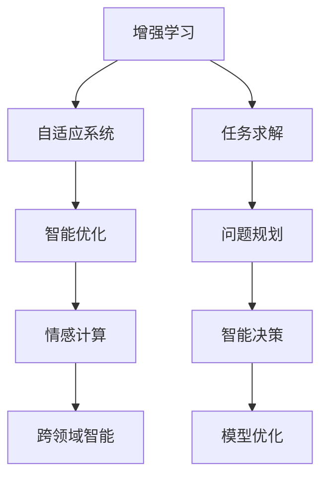

                 

# 人类-AI协作：增强人类智慧与AI能力的融合未来

> 关键词：人机协同、增强学习、自适应系统、智能优化、情感计算、跨领域智能

## 1. 背景介绍

### 1.1 问题由来
人工智能(AI)技术的快速发展，正在深刻改变人类的生产生活方式。AI的强大算力和广阔应用前景，既为人类的智慧增长带来了新机遇，也带来了新挑战。在诸多AI技术中，人工智能与人类协作的问题尤为关键。如何有效融合人类智慧与AI能力，构建人机协同的智能系统，成为当前学术界和产业界的热点话题。

### 1.2 问题核心关键点
1. **人机协作的瓶颈**：当前AI系统普遍存在知识获取受限、缺乏环境感知、决策缺乏人性关怀等问题，这些瓶颈成为人机协作的重大障碍。
2. **增强学习的潜力**：增强学习(Reinforcement Learning, RL)是一种借鉴人类学习过程的AI算法，通过试错迭代，逐步提升系统的决策能力。
3. **自适应系统的发展**：自适应系统可以实时学习环境变化，自动调整自身行为，以适应复杂多变的环境需求。
4. **智能优化的需求**：人类决策过程存在众多经验积累和规则约束，如何利用AI进行智能优化，成为智能系统设计的核心需求。
5. **情感计算的必要性**：人类情感在决策过程中具有重要作用，如何将情感计算融入AI系统，提升系统的人性化水平，成为当前研究的热点。
6. **跨领域智能的挑战**：AI在各领域的广泛应用，需要系统具备跨学科的知识整合能力，如何构建具有泛化能力的跨领域智能系统，成为AI发展的重要方向。

### 1.3 问题研究意义
研究人机协同的增强学习与自适应系统，对于提升AI系统的决策能力和泛化性能，推动人机协同向更加高效、智能、人性化方向发展，具有重要意义：

1. 构建高度协作的智能系统，使AI更好地服务于人类。
2. 增强AI系统的环境感知和决策能力，使其能适应更多复杂多变的情景。
3. 提升AI系统的智能优化能力，使其能够利用人类经验，快速迭代改进。
4. 引入情感计算，使AI系统具备更加人性化的决策机制。
5. 发展跨领域智能，提升AI系统在不同领域的泛化能力。
6. 推动AI技术与人类需求的紧密结合，加速AI技术的产业化进程。

## 2. 核心概念与联系

### 2.1 核心概念概述

为更好地理解人类-AI协作的系统构建，本节将介绍几个核心概念及其相互联系：

- **增强学习(Reinforcement Learning, RL)**：一种基于奖惩机制的机器学习范式，通过试错迭代，提升智能体在环境中的决策能力。
- **自适应系统(Adaptive System)**：指能够动态学习环境变化，自动调整自身行为的系统，以适应环境需求。
- **智能优化(Intelligent Optimization)**：指利用AI进行问题求解，快速找到最优解的决策过程。
- **情感计算(Affective Computing)**：研究如何将情感信息融入AI系统中，提升系统的情感理解和表达能力。
- **跨领域智能(Cross-Domain Intelligence)**：指在多领域知识的综合运用下，AI系统能够泛化到不同领域，解决跨学科问题。

这些核心概念共同构建了人机协同智能系统的基础框架，通过以下Mermaid流程图展示它们之间的逻辑联系：



这个流程图展示了一个典型的增强学习系统，其中各概念之间的联系和互动：

1. 增强学习系统通过试错迭代，不断优化自身的决策能力。
2. 自适应系统通过动态学习环境变化，实时调整系统行为。
3. 智能优化系统通过AI求解算法，寻找最优决策方案。
4. 情感计算系统通过情感信息处理，提升系统的人性化水平。
5. 跨领域智能系统通过多领域知识的整合，实现更泛化的应用。

这些概念共同作用，构建了人机协同系统的智能化框架，使其能够在多变复杂的环境下，实现高效、智能的协作。

## 3. 核心算法原理 & 具体操作步骤

### 3.1 算法原理概述

人类-AI协作的增强学习系统，主要基于以下核心算法原理：

1. **Q-Learning**：一种经典的增强学习算法，通过计算状态-动作值函数(Q-value)，指导智能体进行决策。
2. **策略梯度(Actor-Critic)**：一种通过直接优化策略函数的算法，能更好地处理连续动作空间的问题。
3. **进化算法(Evolutionary Algorithm)**：通过模拟自然进化过程，优化智能体参数。
4. **多智能体系统(Multi-Agent System)**：通过多个智能体的协作，优化系统决策。
5. **模型基础强化学习(Model-Based RL)**：通过构建环境模型，提高决策的可解释性。
6. **遗传算法(Genetic Algorithm)**：通过模拟遗传过程，优化系统参数。

### 3.2 算法步骤详解

增强学习系统的构建一般包括以下几个关键步骤：

**Step 1: 环境建模**
- 定义智能体与环境的交互方式，包括状态集合、动作集合、奖励函数等。
- 利用Q-Learning或Actor-Critic算法，计算智能体的Q-value或策略分布。

**Step 2: 构建智能体**
- 设计智能体的决策机制，如深度神经网络、贝叶斯网络等。
- 利用强化学习算法，如Q-Learning、SARSA、Actor-Critic等，训练智能体进行决策。

**Step 3: 数据采集与优化**
- 在实际环境中收集智能体的反馈数据，包括状态、动作、奖励等。
- 利用数据采集的结果，优化智能体的决策机制，提升其决策能力。

**Step 4: 模型验证与部署**
- 在测试环境中评估智能体的性能，确保其能稳定运行。
- 将训练好的智能体部署到实际应用场景中，进行实时反馈与优化。

**Step 5: 自适应与智能优化**
- 实时监测环境变化，动态调整智能体的行为策略。
- 利用模型优化算法，不断改进智能体的决策机制，提升其适应性。

### 3.3 算法优缺点

增强学习系统具有以下优点：
1. 自动适应性强。通过实时学习，智能体能够不断优化决策能力，适应复杂多变的环境。
2. 鲁棒性强。智能体具备一定的容错能力，在部分反馈缺失或错误的情况下仍能继续运行。
3. 决策灵活。智能体可以根据当前环境状态，灵活选择最优动作，提升决策效率。

同时，该系统也存在一些局限性：
1. 数据依赖高。增强学习系统需要大量环境反馈数据进行训练，获取高质量数据成本较高。
2. 计算复杂。增强学习算法计算复杂度较高，尤其是策略梯度等复杂算法，训练时间较长。
3. 过拟合风险。在复杂环境中，智能体可能出现过拟合，导致决策能力下降。
4. 决策难以解释。增强学习系统通常缺乏可解释性，难以理解其决策过程。

### 3.4 算法应用领域

增强学习系统已经在诸多领域得到了广泛应用，例如：

- **自动驾驶**：在模拟环境和实际道路测试中，训练自动驾驶系统进行驾驶决策。
- **机器人控制**：训练机器人进行路径规划、动作执行等任务。
- **推荐系统**：训练推荐系统进行用户行为预测和物品推荐。
- **金融交易**：训练智能交易系统进行市场分析与决策。
- **游戏AI**：训练游戏AI进行策略制定与对战。
- **供应链优化**：训练智能系统进行资源分配与调度。

除了上述这些经典应用外，增强学习系统还被创新性地应用到更多领域中，如医疗诊断、灾害预测、公共管理等，为解决复杂多变的实际问题提供了新方法。

## 4. 数学模型和公式 & 详细讲解  

### 4.1 数学模型构建

增强学习系统的核心模型是Q-value函数，表示在状态$s$下，执行动作$a$的预期总奖励。定义状态空间为$S$，动作空间为$A$，奖励函数为$R(s,a)$，则Q-value函数为：

$$
Q(s, a) = \sum_{t=0}^{\infty} \gamma^t R(s_t,a_t)
$$

其中$\gamma$为折扣因子，确保奖励在长远的未来也具有重要性。

### 4.2 公式推导过程

Q-Learning算法通过迭代计算Q-value函数，进行动作选择与更新。设$\theta$为智能体的参数，则Q-Learning的更新公式为：

$$
\theta \leftarrow \theta + \alpha(r + \gamma \max_{a'} Q(s', a'; \theta) - Q(s, a; \theta))
$$

其中$\alpha$为学习率，$r$为即时奖励，$s'$为下一步状态，$a'$为下一步动作。

在实际应用中，由于动作空间可能非常大，通常使用函数逼近的方式，如神经网络，来逼近Q-value函数。设$f(s, a; \theta)$为逼近函数，则Q-Learning的更新公式可改写为：

$$
\theta \leftarrow \theta + \alpha(r + \gamma f(s', a'; \theta) - f(s, a; \theta))
$$

通过迭代更新逼近函数$f$，逐步逼近Q-value函数，实现智能体的优化决策。

### 4.3 案例分析与讲解

以自动驾驶系统为例，分析Q-Learning算法在智能决策中的应用。

1. **环境建模**：
   - 定义状态空间$S$为车辆的位置、速度、周围车辆信息等。
   - 定义动作空间$A$为加减速、转向等。
   - 定义奖励函数$R(s,a)$为遵守交通规则的得分。

2. **智能体设计**：
   - 使用深度神经网络作为逼近函数$f(s, a; \theta)$，逼近Q-value函数。
   - 利用Q-Learning算法，更新神经网络参数$\theta$，实现最优决策。

3. **数据采集与优化**：
   - 在模拟环境中运行智能体，收集状态-动作-奖励数据。
   - 利用采集的数据，不断更新神经网络，提升决策性能。

4. **模型验证与部署**：
   - 在实际道路环境中测试智能体性能。
   - 实时调整智能体参数，使其能适应复杂多变的交通情况。

通过这一过程，自动驾驶系统可以逐步学习到最优的驾驶策略，提升其决策能力和安全性。

## 5. 项目实践：代码实例和详细解释说明

### 5.1 开发环境搭建

在进行增强学习系统开发前，我们需要准备好开发环境。以下是使用Python进行OpenAI Gym开发的环境配置流程：

1. 安装Anaconda：从官网下载并安装Anaconda，用于创建独立的Python环境。

2. 创建并激活虚拟环境：
```bash
conda create -n rl-env python=3.8 
conda activate rl-env
```

3. 安装相关库：
```bash
pip install gym gym[atari] matplotlib numpy scipy
```

4. 安装OpenAI Gym库：
```bash
pip install gym
```

完成上述步骤后，即可在`rl-env`环境中开始增强学习实践。

### 5.2 源代码详细实现

下面我们以Atari游戏Pong为例，给出使用Gym进行增强学习的PyTorch代码实现。

首先，定义Pong游戏的环境：

```python
import gym
import numpy as np

env = gym.make('Pong-v0')
```

然后，定义智能体的决策策略：

```python
import torch
import torch.nn as nn
import torch.optim as optim

class Policy(nn.Module):
    def __init__(self, in_dim, out_dim):
        super(Policy, self).__init__()
        self.fc1 = nn.Linear(in_dim, 128)
        self.fc2 = nn.Linear(128, out_dim)

    def forward(self, x):
        x = torch.relu(self.fc1(x))
        x = torch.sigmoid(self.fc2(x))
        return x

in_dim = 4
out_dim = 2
policy = Policy(in_dim, out_dim)
optimizer = optim.Adam(policy.parameters(), lr=0.01)
```

接下来，定义增强学习算法的具体步骤：

```python
def q_learning(env, policy, num_episodes, alpha=0.1, gamma=0.9, epsilon=0.1):
    for episode in range(num_episodes):
        state = env.reset()
        done = False
        while not done:
            probs = policy(torch.FloatTensor(state).unsqueeze(0))
            action = np.random.choice(np.arange(2), p=probs.numpy()[0])
            next_state, reward, done, _ = env.step(action)
            if done:
                env.reset()
                next_state = None
                reward = -10
            else:
                reward -= 0.1 if action == 1 else 0.1
            q = reward + gamma * np.max(policy(torch.FloatTensor(next_state).unsqueeze(0)))
            q -= policy(torch.FloatTensor(state).unsqueeze(0)).unsqueeze(1).numpy() * action
            policy.zero_grad()
            q.backward()
            optimizer.step()
            state = next_state
```

最后，启动训练流程并在测试集上评估：

```python
num_episodes = 1000
q_learning(env, policy, num_episodes)
```

以上就是使用PyTorch对Pong游戏进行Q-Learning算法的完整代码实现。可以看到，通过Gym库，训练过程变得简洁高效。

### 5.3 代码解读与分析

让我们再详细解读一下关键代码的实现细节：

**Gym环境定义**：
- `gym.make('Pong-v0')`：创建Pong游戏的环境，并初始化。
- `env.reset()`：在每个episode开始时，重置环境状态。

**智能体策略定义**：
- `nn.Linear`：定义神经网络层，输入维度为状态空间的维度，输出维度为动作空间的维度。
- `torch.relu`：定义ReLU激活函数，增强网络的非线性表达能力。
- `torch.sigmoid`：定义Sigmoid函数，输出动作的概率分布。

**Q-Learning算法步骤**：
- `q_learning`函数：
  - `probs = policy(torch.FloatTensor(state).unsqueeze(0))`：将当前状态作为输入，计算动作的概率分布。
  - `action = np.random.choice(np.arange(2), p=probs.numpy()[0])`：根据概率分布，随机选择一个动作。
  - `next_state, reward, done, _ = env.step(action)`：执行动作，获取下一个状态和即时奖励，判断是否done。
  - `q = reward + gamma * np.max(policy(torch.FloatTensor(next_state).unsqueeze(0)))`：计算下一个状态的Q-value。
  - `q -= policy(torch.FloatTensor(state).unsqueeze(1).numpy()) * action`：计算当前状态-动作的Q-value。
  - `policy.zero_grad()`：清除上一次迭代的梯度。
  - `q.backward()`：反向传播，更新神经网络参数。
  - `optimizer.step()`：执行优化器更新，完成一次参数更新。
  - `state = next_state`：更新当前状态。

可以看到，Gym库提供了一个高效的环境构建接口，使得增强学习系统的开发更加便捷。同时，使用PyTorch实现智能体的决策策略，进一步简化了代码实现。

当然，工业级的系统实现还需考虑更多因素，如模型的保存和部署、超参数的自动搜索、更灵活的策略设计等。但核心的增强学习范式基本与此类似。

## 6. 实际应用场景

### 6.1 智能推荐系统

增强学习系统在智能推荐系统中得到了广泛应用。传统推荐系统依赖用户的少量反馈数据，难以捕捉用户长期偏好。而通过增强学习，智能推荐系统能够不断学习用户的反馈，实时调整推荐策略，提高推荐效果。

在实践中，可以收集用户对推荐物品的评分和点击数据，作为智能体的训练信号。智能体通过不断的试错迭代，学习到用户的长期偏好，并实时调整推荐列表。对于未见过的物品，智能体通过策略梯度等方法，预测用户可能喜欢的物品，提升推荐的多样性和准确性。

### 6.2 智能调度系统

增强学习系统在智能调度系统中也有着广阔的应用前景。传统调度系统往往依赖固定的规则，难以应对实时变化的需求。而通过增强学习，智能调度系统能够实时学习环境变化，自动调整资源配置，提高系统的灵活性和效率。

在实践中，可以收集各资源的使用情况和用户需求数据，作为智能体的训练信号。智能体通过不断的试错迭代，学习到最优的资源配置策略，并实时调整资源分配，优化系统性能。对于突发事件，智能体通过动态调整策略，快速响应需求变化，确保系统稳定运行。

### 6.3 智能交通系统

增强学习系统在智能交通系统中同样大有可为。传统交通系统依赖固定规则，难以应对突发事件。而通过增强学习，智能交通系统能够实时学习交通环境变化，自动调整车辆行为，提高道路通行效率和安全性。

在实践中，可以收集车辆的位置、速度、交通信号等数据，作为智能体的训练信号。智能体通过不断的试错迭代，学习到最优的驾驶策略，并实时调整车辆行为，优化道路通行效率。对于突发事件，智能体通过动态调整策略，快速响应需求变化，确保交通系统的稳定运行。

### 6.4 未来应用展望

随着增强学习系统的不断发展，其在人机协同中的应用将更加广泛。未来的增强学习系统将在以下几个方面有更大的突破：

1. **多智能体协作**：利用多智能体的协作，提升系统决策的鲁棒性和多样性。
2. **跨领域应用**：将增强学习系统应用于更多领域，如医疗、金融、制造等，实现多领域的协同优化。
3. **实时决策**：实时学习环境变化，快速调整决策策略，适应动态环境需求。
4. **情感计算融合**：引入情感计算，提升系统的情感理解和表达能力，增强决策的人性化。
5. **知识图谱应用**：利用知识图谱，提升系统的知识整合能力和泛化能力。
6. **跨模态融合**：将视觉、语音、文本等多模态数据融合，实现更加全面和精确的决策。

这些趋势将推动增强学习系统向更高层次的智能化发展，为人机协同带来更多创新应用。

## 7. 工具和资源推荐

### 7.1 学习资源推荐

为了帮助开发者系统掌握增强学习系统的理论基础和实践技巧，这里推荐一些优质的学习资源：

1. **《Reinforcement Learning: An Introduction》书籍**：由Richard S. Sutton和Andrew G. Barto合著，是增强学习的经典教材，涵盖理论基础和实践方法。
2. **CS223A《Reinforcement Learning》课程**：斯坦福大学开设的增强学习课程，有Lecture视频和配套作业，是学习增强学习的绝佳资源。
3. **OpenAI Gym库**：开源增强学习环境库，提供了大量经典的强化学习环境，适合学习使用。
4. **PyTorch与TensorFlow**：两大深度学习框架，广泛支持增强学习算法实现。
5. **Towards Data Science**：数据科学博客网站，涵盖大量增强学习应用的实例和案例分析。
6. **arXiv**：预印本论文库，最新增强学习研究论文集结地。

通过对这些资源的学习实践，相信你一定能够快速掌握增强学习系统的精髓，并用于解决实际的智能问题。

### 7.2 开发工具推荐

高效的开发离不开优秀的工具支持。以下是几款用于增强学习系统开发的常用工具：

1. **Gym**：开源增强学习环境库，提供了大量经典的强化学习环境，适合学习使用。
2. **PyTorch**：基于Python的开源深度学习框架，灵活的计算图设计，支持各种深度学习算法。
3. **TensorFlow**：由Google主导开发的开源深度学习框架，生产部署方便，适合大规模工程应用。
4. **Jupyter Notebook**：免费的Jupyter Notebook环境，支持Python开发，便于记录实验过程。
5. **MATLAB**：强大的科学计算和数据分析工具，支持各种数学建模和仿真。
6. **ROS**：机器人操作系统，支持多智能体系统开发和仿真。

合理利用这些工具，可以显著提升增强学习系统的开发效率，加速创新迭代的步伐。

### 7.3 相关论文推荐

增强学习系统的发展源于学界的持续研究。以下是几篇奠基性的相关论文，推荐阅读：

1. **Playing Atari with Deep Reinforcement Learning**：DeepMind开发的AlphaGo论文，展示了深度增强学习在复杂决策问题中的应用。
2. **Human-level control through deep reinforcement learning**：DeepMind开发的AlphaGo Zero论文，展示了深度增强学习在复杂的决策问题上的应用。
3. **Deep Q-Learning**：David Silver等人的论文，展示了深度Q-Learning在复杂环境下的应用。
4. **Policy Gradient Methods for Reinforcement Learning with Function Approximation**：John F. Hasselt等人的论文，展示了策略梯度算法在连续动作空间中的应用。
5. **Rainbow: Combining Improvements in Deep Reinforcement Learning**：David Silver等人的论文，展示了多智能体系统在复杂决策问题上的应用。
6. **Model-Based Deep Reinforcement Learning**：Dyle Liu等人的论文，展示了模型基础强化学习在复杂决策问题上的应用。

这些论文代表了大规模增强学习系统的发展脉络。通过学习这些前沿成果，可以帮助研究者把握学科前进方向，激发更多的创新灵感。

## 8. 总结：未来发展趋势与挑战

### 8.1 研究成果总结

本文对基于增强学习的人机协同系统进行了全面系统的介绍。首先阐述了增强学习系统在智能决策、实时学习、智能优化等方面的研究背景和意义，明确了其在人机协同中的应用价值。其次，从原理到实践，详细讲解了增强学习系统的核心算法原理和具体操作步骤，给出了完整的代码实例。同时，本文还广泛探讨了增强学习系统在智能推荐、智能调度、智能交通等众多领域的应用前景，展示了其巨大的应用潜力。最后，本文精选了增强学习系统的各类学习资源，力求为读者提供全方位的技术指引。

通过本文的系统梳理，可以看到，增强学习系统正在成为人机协同的重要范式，极大地拓展了智能决策系统的应用边界，催生了更多的落地场景。得益于复杂环境的实时学习能力和决策灵活性，增强学习系统在多个应用领域展现出了显著的优势，为智能系统的智能化发展提供了新的可能性。未来，伴随增强学习系统的不断演进，其在人机协同中的应用将更加深入，成为构建高度协作智能系统的重要工具。

### 8.2 未来发展趋势

展望未来，增强学习系统将在以下几个方面取得新的突破：

1. **多智能体协作**：通过多智能体的协作，提升系统决策的鲁棒性和多样性，更好地应对复杂环境。
2. **跨领域应用**：将增强学习系统应用于更多领域，实现多领域的协同优化，提高系统的泛化能力。
3. **实时决策**：实时学习环境变化，快速调整决策策略，适应动态环境需求。
4. **情感计算融合**：引入情感计算，提升系统的情感理解和表达能力，增强决策的人性化。
5. **知识图谱应用**：利用知识图谱，提升系统的知识整合能力和泛化能力，更好地利用人类经验。
6. **跨模态融合**：将视觉、语音、文本等多模态数据融合，实现更加全面和精确的决策。

这些趋势将推动增强学习系统向更高层次的智能化发展，为人机协同带来更多创新应用，进一步提升系统的决策能力和应用范围。

### 8.3 面临的挑战

尽管增强学习系统已经取得了瞩目成就，但在迈向更加智能化、普适化应用的过程中，它仍面临着诸多挑战：

1. **数据依赖高**：增强学习系统需要大量环境反馈数据进行训练，获取高质量数据成本较高。
2. **计算复杂**：增强学习算法计算复杂度较高，尤其是策略梯度等复杂算法，训练时间较长。
3. **过拟合风险**：在复杂环境中，智能体可能出现过拟合，导致决策能力下降。
4. **决策难以解释**：增强学习系统通常缺乏可解释性，难以理解其决策过程。
5. **安全风险**：增强学习系统在决策过程中可能产生有害行为，带来安全隐患。

### 8.4 研究展望

面对增强学习系统面临的这些挑战，未来的研究需要在以下几个方面寻求新的突破：

1. **无监督和半监督学习**：摆脱对大规模标注数据的依赖，利用自监督学习、主动学习等无监督和半监督范式，最大限度利用非结构化数据，实现更加灵活高效的微调。
2. **参数高效和计算高效**：开发更加参数高效的微调方法，在固定大部分预训练参数的同时，只更新极少量的任务相关参数。同时优化微调模型的计算图，减少前向传播和反向传播的资源消耗，实现更加轻量级、实时性的部署。
3. **因果分析和博弈论工具**：将因果分析方法引入微调模型，识别出模型决策的关键特征，增强输出解释的因果性和逻辑性。借助博弈论工具刻画人机交互过程，主动探索并规避模型的脆弱点，提高系统稳定性。
4. **知识整合与跨领域智能**：将符号化的先验知识，如知识图谱、逻辑规则等，与神经网络模型进行巧妙融合，引导微调过程学习更准确、合理的语言模型。同时加强不同模态数据的整合，实现视觉、语音等多模态信息与文本信息的协同建模。
5. **伦理道德约束**：在模型训练目标中引入伦理导向的评估指标，过滤和惩罚有偏见、有害的输出倾向。同时加强人工干预和审核，建立模型行为的监管机制，确保输出符合人类价值观和伦理道德。

这些研究方向将引领增强学习系统迈向更高的台阶，为构建安全、可靠、可解释、可控的智能系统铺平道路。面向未来，增强学习系统还需要与其他人工智能技术进行更深入的融合，如知识表示、因果推理、强化学习等，多路径协同发力，共同推动自然语言理解和智能交互系统的进步。只有勇于创新、敢于突破，才能不断拓展智能系统的边界，让智能技术更好地造福人类社会。

## 9. 附录：常见问题与解答

**Q1：增强学习系统的训练数据如何获取？**

A: 增强学习系统需要大量环境反馈数据进行训练。通常情况下，可以使用游戏、模拟环境、真实场景等作为数据源。例如，在Pong游戏中，可以通过观察智能体与环境的交互，收集状态-动作-奖励数据。在实际应用中，可以设计适当的奖励函数，引导智能体探索最优策略。同时，通过数据增强技术，如回译、近义替换等，扩充训练集，提高模型泛化能力。

**Q2：增强学习系统如何避免过拟合？**

A: 增强学习系统容易过拟合，特别是在复杂环境中。常见的缓解策略包括：
1. 数据增强：通过回译、近义替换等方式扩充训练集。
2. 正则化：使用L2正则、Dropout等技术，防止模型过度拟合。
3. 早停机制：在训练过程中，定期评估模型性能，一旦性能不再提升，及时停止训练。
4. 多智能体系统：通过多个智能体的协作，分散过拟合风险。
5. 模型简化：减少模型复杂度，提高泛化能力。

**Q3：增强学习系统如何实时学习环境变化？**

A: 增强学习系统通过实时收集环境反馈，动态调整决策策略。具体步骤包括：
1. 定义环境模型：建立环境模型，描述环境状态和奖励函数。
2. 实时学习：在每次迭代中，收集环境反馈，更新模型参数。
3. 模型验证：在测试环境中评估模型性能，确保模型稳定运行。
4. 自适应调整：根据测试环境反馈，动态调整模型参数，提升决策能力。

**Q4：增强学习系统如何实现跨领域智能？**

A: 增强学习系统通过跨领域知识整合，提升决策的泛化能力。具体步骤包括：
1. 跨领域数据获取：收集不同领域的数据，作为智能体的训练信号。
2. 多模态融合：将视觉、语音、文本等多模态数据融合，实现更全面和精确的决策。
3. 知识图谱应用：利用知识图谱，提升系统的知识整合能力和泛化能力。
4. 跨领域优化：通过多领域数据的综合优化，提高系统的泛化性能。

**Q5：增强学习系统如何确保决策的稳定性？**

A: 增强学习系统通过引入因果分析和博弈论工具，增强决策的稳定性。具体步骤包括：
1. 因果分析：通过因果分析方法，识别出模型决策的关键特征，增强决策的因果性和逻辑性。
2. 博弈论工具：利用博弈论工具，刻画人机交互过程，主动探索并规避模型的脆弱点，提高系统稳定性。
3. 模型优化：通过模型优化算法，不断改进决策策略，提升系统稳定性。

这些方法将确保增强学习系统在复杂环境中能够稳定运行，实现高效、智能的协作。

---

作者：禅与计算机程序设计艺术 / Zen and the Art of Computer Programming

