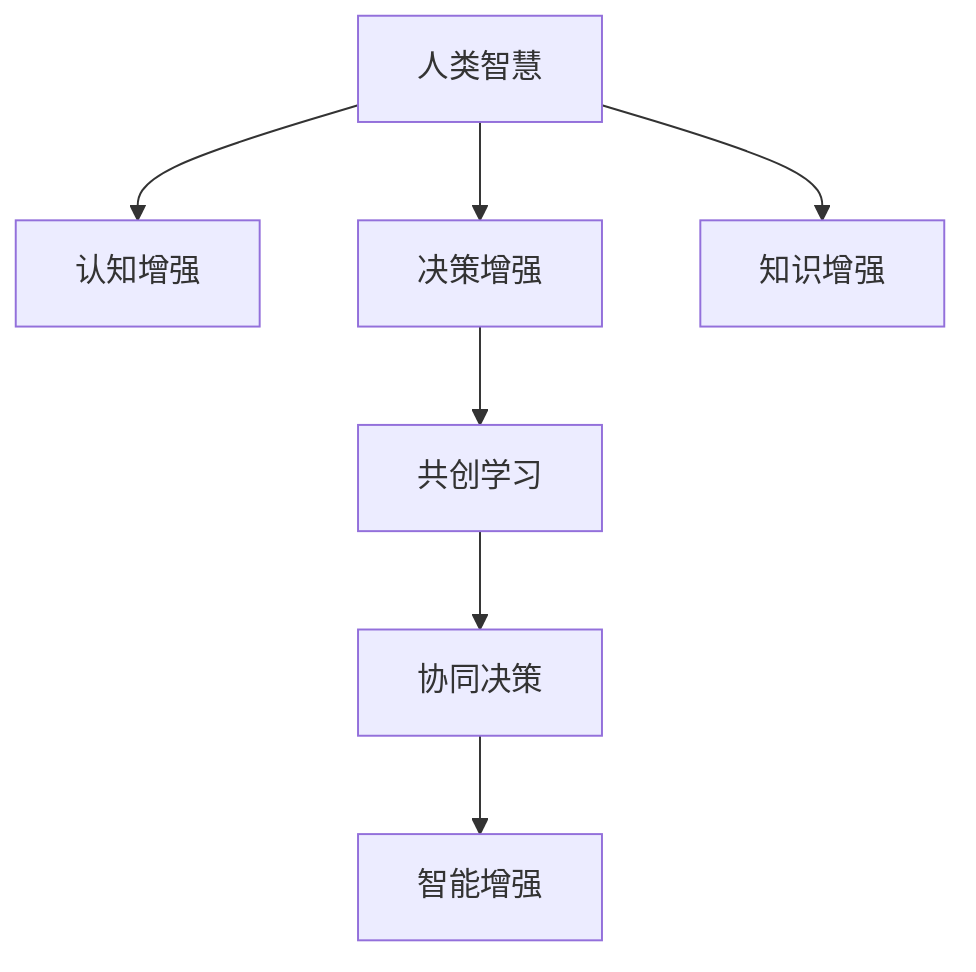

                 

# 人类-AI协作：增强人类智慧与AI能力的融合演进

> 关键词：人类-AI协作, 增强智慧, AI能力, 融合演进

## 1. 背景介绍

### 1.1 问题由来

在21世纪的技术浪潮中，人工智能(AI)已成为推动社会进步和人类福祉的重要力量。然而，人工智能并非取代人类，而是与之紧密合作，共同创造价值。尤其是近年来，随着大语言模型、机器学习、深度学习等技术的迅猛发展，AI与人类协作的模式变得越来越多样化、高效化。

人工智能和人类智慧的融合演进，是AI发展历程中一道亮丽的风景线。通过AI和人类协作，我们可以克服个体能力限制，将AI的优势与人类丰富的经验和直觉相结合，提升生产力，推动社会进步。同时，AI也能通过人机协作，提升自身智能水平，构建更加完善的决策和理解框架。

本博文将系统阐述人类-AI协作的核心原理，探讨增强智慧和AI能力融合演进的技术路径和方法。通过探讨AI在协作中的具体应用场景，我们可以更深入地理解AI技术的发展趋势和未来挑战，为未来的智能时代做出贡献。

### 1.2 问题核心关键点

1. **人类-AI协作模型**：讨论人类智慧与AI能力如何互相补充，构建协同效应的具体模型和方法。
2. **增强智慧与AI能力的融合演进**：通过实例和理论分析，探索如何通过AI技术提升人类智慧，并同时增强AI自身的智能水平。
3. **融合演进中的技术挑战与解决方案**：剖析融合演进过程中可能面临的挑战，并提出相应的技术策略和创新方法。

## 2. 核心概念与联系

### 2.1 核心概念概述

为更好地理解人类-AI协作的技术原理和实施路径，本节将介绍几个关键概念：

- **增强智慧**：指通过引入AI技术，优化和增强人类的认知、决策、学习等智慧能力。
- **AI能力**：指AI系统在自主学习、推理、感知、决策等能力上的表现。
- **融合演进**：指AI与人类智慧互相影响、互相提升的过程，具体表现为协作学习、协同决策、共创知识等形式。

- **认知增强**：利用AI技术帮助人类提升认知能力，如记忆力、注意力、理解力等。
- **决策增强**：借助AI模型提高人类决策的准确性和效率，尤其在复杂和不确定环境下。
- **知识增强**：通过AI与人类协作，共同创建和共享知识，提升群体智慧水平。

- **共创学习**：AI与人类互相学习、互相教学，形成知识共享和技能互补的协作模式。
- **协同决策**：AI与人类结合，共同参与决策过程，提高决策的全面性和正确性。
- **智能增强**：通过与人类协作，AI能够积累更多人类经验，增强自身的学习能力和智能水平。

这些核心概念之间的逻辑关系可以通过以下Mermaid流程图来展示：



这个流程图展示了一些核心概念的相互关系：

1. 人类智慧通过认知增强、决策增强、知识增强等形式，被AI技术辅助提升。
2. 共创学习和协同决策是AI与人类智慧融合演进的重要方式。
3. 智能增强是AI与人类协作的最终目标，即通过学习人类智慧，提升自身的智能水平。

## 3. 核心算法原理 & 具体操作步骤

### 3.1 算法原理概述

人类-AI协作的基本原理在于：人类智慧与AI能力的互补与融合。具体而言，人类在复杂多变的场景下能灵活应对，并具有丰富的经验积累，而AI则在处理大量数据、逻辑推理等方面具备明显优势。

AI与人类协作，通常包括以下几个关键步骤：

1. **知识共享**：AI通过输入人类提供的数据、规则、知识等，吸收人类智慧的结晶，提升自身的理解能力和决策水平。
2. **模型训练**：利用人类标注的数据，AI通过监督学习和强化学习等方法，不断优化自身的预测和决策模型。
3. **交互学习**：AI与人类进行持续的互动，获取反馈和指导，优化模型性能。
4. **协同决策**：AI与人类共同参与决策过程，结合双方优势，形成更全面、准确、鲁棒的决策结果。
5. **知识共创**：AI与人类协作，共同创建新的知识库和模型，为更多应用场景提供支持。

### 3.2 算法步骤详解

以下以医疗诊断为例，详细介绍人类-AI协作的步骤：

**Step 1: 知识共享**

1. **数据收集**：收集医疗案例、专家诊断记录等数据，形成知识库。
2. **规则和模型输入**：将知识库中的案例、规则、模型等输入到AI系统中。

**Step 2: 模型训练**

1. **数据预处理**：对输入数据进行清洗、标注等预处理，确保数据质量。
2. **监督学习**：利用专家标注的数据，训练AI诊断模型。
3. **强化学习**：通过专家反馈，不断调整模型参数，提升模型性能。

**Step 3: 交互学习**

1. **实时反馈**：在AI进行诊断后，人类专家给予实时反馈，指出诊断的错误和不足。
2. **模型优化**：根据专家反馈，优化AI诊断模型，提高诊断准确性。

**Step 4: 协同决策**

1. **集成方案**：将AI与人类专家的诊断意见进行集成，形成综合诊断方案。
2. **方案讨论**：对综合诊断方案进行讨论，补充AI的诊断逻辑和人类专家的经验。

**Step 5: 知识共创**

1. **新知识生成**：AI与人类专家共同分析新的医疗案例，生成新的知识和诊断规则。
2. **知识库更新**：将新知识更新到知识库中，供未来应用使用。

### 3.3 算法优缺点

人类-AI协作具有以下优点：

1. **互补优势**：AI在处理大量数据和复杂推理方面表现优异，而人类在灵活应变和常识判断上更有优势。
2. **效率提升**：通过AI辅助，人类能更快、更准确地完成工作，提高生产效率。
3. **知识创新**：AI与人类协作，可以生成新的知识，推动科学和技术进步。
4. **风险降低**：AI帮助识别潜在风险，增强决策的鲁棒性，减少错误。

同时，这种协作也存在一些缺点：

1. **依赖关系复杂**：AI与人类协作需要良好的沟通和理解，涉及大量的协调工作。
2. **隐私和安全问题**：人类提供的数据和知识可能涉及隐私，需要严格保护。
3. **知识传递限制**：AI无法完全理解人类的情感和背景知识，可能导致信息传递不充分。
4. **技术限制**：AI技术仍存在局限，无法完全替代人类的专业知识和经验。

### 3.4 算法应用领域

人类-AI协作在多个领域都得到了广泛应用，包括但不限于：

1. **医疗健康**：AI辅助诊断、手术规划、个性化治疗等，提升医疗服务质量。
2. **金融分析**：利用AI进行市场预测、风险评估、欺诈检测等，优化金融决策。
3. **教育培训**：AI提供个性化教学、智能评估、知识推荐等，提升教育效果。
4. **智能制造**：AI与人类协作，进行故障诊断、优化生产流程、质量控制等，提升制造效率。
5. **环境保护**：利用AI进行环境监测、污染预测、生态保护等，推动可持续发展。
6. **公共安全**：AI与人类结合，进行犯罪预测、舆情分析、应急响应等，提升公共安全水平。

## 4. 数学模型和公式 & 详细讲解 & 举例说明

### 4.1 数学模型构建

为更好理解人类-AI协作的技术原理，我们引入一个数学模型：

设人类智慧为 $H$，AI能力为 $A$，$F$ 表示融合后的系统能力，则有：

$$
F = H \otimes A
$$

其中 $\otimes$ 表示融合运算，可以是简单的加权平均、加法、乘法等，也可以是更复杂的算法如深度融合、协同过滤等。

### 4.2 公式推导过程

在具体应用中，融合运算可以根据不同的需求进行调整。以下是三种常见的融合方式：

**加权平均融合**：

$$
F = \alpha H + (1-\alpha)A
$$

其中 $\alpha$ 为人类智慧在融合结果中的权重，可根据实际情况调整。

**加法融合**：

$$
F = H + A
$$

这种方式假设人类智慧和AI能力可以相互独立贡献。

**乘法融合**：

$$
F = H \times A
$$

这种方式假设人类智慧和AI能力具有乘性增强效应，更适用于在逻辑推理、决策等方面具有互补作用的情形。

### 4.3 案例分析与讲解

**医疗诊断案例**：

1. **数据输入**：收集医疗案例、专家诊断记录等数据，形成知识库。
2. **模型训练**：利用专家标注的数据，训练AI诊断模型。
3. **实时反馈**：在AI进行诊断后，人类专家给予实时反馈，指出诊断的错误和不足。
4. **协同决策**：将AI与人类专家的诊断意见进行集成，形成综合诊断方案。

以胸痛诊断为例，AI与人类协作的步骤如下：

1. **数据输入**：将医院的历史胸痛病例、专家诊断结果等输入AI系统中。
2. **模型训练**：利用专家的标注数据，训练AI诊断模型。
3. **实时反馈**：在AI进行初步诊断后，人类专家进行实时反馈，指出诊断的错误和不足。
4. **协同决策**：将AI的初步诊断结果和专家的经验集成，形成综合诊断方案。

## 5. 项目实践：代码实例和详细解释说明

### 5.1 开发环境搭建

在进行协作开发前，我们需要准备好开发环境。以下是使用Python进行代码实现的开发环境配置流程：

1. 安装Anaconda：从官网下载并安装Anaconda，用于创建独立的Python环境。

2. 创建并激活虚拟环境：
```bash
conda create -n ai-env python=3.8 
conda activate ai-env
```

3. 安装PyTorch：根据CUDA版本，从官网获取对应的安装命令。例如：
```bash
conda install pytorch torchvision torchaudio cudatoolkit=11.1 -c pytorch -c conda-forge
```

4. 安装TensorFlow：由Google主导开发的开源深度学习框架，生产部署方便，适合大规模工程应用。同样有丰富的预训练语言模型资源。

5. 安装Transformers库：HuggingFace开发的NLP工具库，集成了众多SOTA语言模型，支持PyTorch和TensorFlow，是进行协作任务开发的利器。

6. 安装各类工具包：
```bash
pip install numpy pandas scikit-learn matplotlib tqdm jupyter notebook ipython
```

完成上述步骤后，即可在`ai-env`环境中开始协作开发实践。

### 5.2 源代码详细实现

下面我们以智能推荐系统为例，给出使用Transformers库进行协作开发的PyTorch代码实现。

首先，定义推荐模型的输入输出结构：

```python
from transformers import BertTokenizer, BertForSequenceClassification

class RecommendationModel:
    def __init__(self, num_labels):
        self.tokenizer = BertTokenizer.from_pretrained('bert-base-cased')
        self.model = BertForSequenceClassification.from_pretrained('bert-base-cased', num_labels=num_labels)
        
    def predict(self, input_ids, attention_mask):
        with torch.no_grad():
            outputs = self.model(input_ids, attention_mask=attention_mask)
            logits = outputs.logits
        return logits
```

然后，定义协作模型，将人类专家输入和AI模型输出集成：

```python
class CollaborativeModel:
    def __init__(self, recommendation_model):
        self.recommendation_model = recommendation_model
        
    def integrate(self, human_input, ai_output):
        human_input_tokenized = self.recommendation_model.tokenizer.tokenize(human_input)
        human_input_ids = self.recommendation_model.tokenizer.convert_tokens_to_ids(human_input_tokenized)
        attention_mask = [1] * len(human_input_ids)
        
        ai_output_softmax = F.softmax(ai_output, dim=1)
        recommendation_prob = torch.matmul(ai_output_softmax, human_input_ids)
        
        result = self.recommendation_model.predict(human_input_ids, attention_mask)
        result = F.softmax(result, dim=1)
        final_prob = torch.matmul(result, recommendation_prob)
        
        return final_prob
```

最后，启动协作流程：

```python
if __name__ == "__main__":
    recommendation_model = RecommendationModel(num_labels=5)
    collaborative_model = CollaborativeModel(recommendation_model)
    
    # 人类专家输入
    human_input = "这是一段推荐请求"
    # AI模型输出
    ai_output = torch.randn(1, 5)
    
    result = collaborative_model.integrate(human_input, ai_output)
    print(result)
```

以上就是使用PyTorch进行智能推荐系统协作开发的完整代码实现。可以看到，通过Transformers库的封装，协作开发变得非常便捷。

### 5.3 代码解读与分析

让我们再详细解读一下关键代码的实现细节：

**RecommendationModel类**：
- `__init__`方法：初始化BertTokenizer和BertForSequenceClassification模型。
- `predict`方法：利用模型对输入进行预测，返回预测概率分布。

**CollaborativeModel类**：
- `__init__`方法：初始化协作模型，将推荐模型作为输入。
- `integrate`方法：将人类专家输入和AI模型输出集成，返回最终推荐概率分布。

**协作流程**：
- 定义推荐模型和协作模型。
- 在`__main__`中，模拟人类专家的输入和AI模型的输出。
- 调用`integrate`方法，将专家输入和AI输出集成，返回推荐结果。

通过这段代码，我们能够直观理解人类-AI协作的实现过程，认识到模型训练、实时反馈、协同决策等关键步骤。

## 6. 实际应用场景

### 6.1 智能制造

在智能制造领域，人类-AI协作可以大幅提升生产效率和产品质量。AI可以通过数据分析、异常检测等技术，发现生产中的潜在问题，而人类专家则利用丰富的经验，进行精确的诊断和处理。

例如，某制造企业利用AI与人类专家协作，对生产设备进行故障预测和维护。AI通过分析设备传感器数据，识别异常模式，生成初步故障报告。人类专家则根据故障报告，进行进一步诊断，并提供修复方案。这样，AI与人类专家协同工作，实现了生产设备的快速故障诊断和及时维护，避免了因设备故障导致的停工损失。

### 6.2 智慧农业

智慧农业是另一个典型的应用场景。AI与人类专家在智慧农业中合作，进行气象预测、土壤分析、病虫害诊断等，大大提升了农业生产效率和农产品质量。

例如，某智慧农场利用AI与人类专家合作，进行气象预测和土壤分析。AI通过分析卫星数据、地面传感器数据，预测天气和土壤状况。人类专家则根据AI的预测结果，进行农作物的种植、灌溉、施肥等管理。这样，AI与人类专家协同工作，实现了农作物的精准管理，提高了农作物的产量和质量。

### 6.3 医疗健康

医疗健康领域是人类-AI协作的重要应用领域。AI在辅助诊断、个性化治疗、病历分析等方面具有明显优势，而人类专家则在复杂决策和经验积累上具备优势。

例如，某医院利用AI与人类专家协作，进行手术规划和个性化治疗。AI通过分析患者的历史病历、基因信息等数据，生成初步的手术方案和个性化治疗方案。人类专家则根据AI的方案，进行手术规划和个性化治疗。这样，AI与人类专家协同工作，实现了精准的手术规划和个性化治疗，提升了手术成功率和患者满意度。

### 6.4 未来应用展望

随着AI技术的不断发展和成熟，人类-AI协作将在更多领域得到应用，为社会进步和人类福祉带来新的机遇。

在智慧城市治理中，AI与人类专家合作，进行交通规划、环境监测、公共安全等，提升城市管理的智能化水平。

在智慧教育中，AI与人类教师合作，进行个性化教学、智能评估、知识推荐等，提升教育效果和学习体验。

在智慧交通中，AI与人类驾驶员合作，进行路线规划、交通指挥、事故处理等，提高交通安全性和管理效率。

未来，人类-AI协作将进一步深化，成为推动智能时代发展的重要力量。

## 7. 工具和资源推荐

### 7.1 学习资源推荐

为帮助开发者系统掌握人类-AI协作的理论基础和实践技巧，这里推荐一些优质的学习资源：

1. 《AI与人类协作：未来智能技术发展之路》系列博文：深入探讨AI与人类协作的原理、方法和应用场景。

2. 《深度学习与人类智慧的融合》课程：斯坦福大学开设的课程，介绍了深度学习在人类智慧融合中的作用和应用。

3. 《人类-AI协作：跨学科创新案例》书籍：精选了多个跨学科的协作案例，展示人类-AI协作在不同领域的应用。

4. 《人类-AI协作研究报告》：收集了多项人类-AI协作的研究成果，涵盖了多个应用领域和实现方法。

通过对这些资源的学习实践，相信你一定能够全面理解人类-AI协作的精髓，并用于解决实际的智能问题。

### 7.2 开发工具推荐

高效的开发离不开优秀的工具支持。以下是几款用于人类-AI协作开发的常用工具：

1. PyTorch：基于Python的开源深度学习框架，灵活动态的计算图，适合快速迭代研究。

2. TensorFlow：由Google主导开发的开源深度学习框架，生产部署方便，适合大规模工程应用。

3. Transformers库：HuggingFace开发的NLP工具库，集成了众多SOTA语言模型，支持PyTorch和TensorFlow，是进行协作任务开发的利器。

4. Weights & Biases：模型训练的实验跟踪工具，可以记录和可视化模型训练过程中的各项指标，方便对比和调优。

5. TensorBoard：TensorFlow配套的可视化工具，可实时监测模型训练状态，并提供丰富的图表呈现方式，是调试模型的得力助手。

6. Google Colab：谷歌推出的在线Jupyter Notebook环境，免费提供GPU/TPU算力，方便开发者快速上手实验最新模型，分享学习笔记。

合理利用这些工具，可以显著提升人类-AI协作的开发效率，加快创新迭代的步伐。

### 7.3 相关论文推荐

人类-AI协作技术的发展得益于学界的持续研究。以下是几篇奠基性的相关论文，推荐阅读：

1. 《AI与人类协作：知识增强的协同学习模型》：提出了基于协同学习的知识增强模型，提升了AI与人类协作的知识融合效果。

2. 《人类-AI协作中的知识共享与协同决策》：研究了人类-AI协作中的知识共享和协同决策模型，提出了一系列改进算法。

3. 《增强智慧与AI能力的融合演进》：探讨了人类智慧与AI能力融合演进的机制，提出了多种融合方式和优化策略。

4. 《人类-AI协作中的智能增强与优化》：研究了AI与人类协作中的智能增强方法，提出了多种高效的智能增强算法。

这些论文代表了大语言模型微调技术的发展脉络。通过学习这些前沿成果，可以帮助研究者把握学科前进方向，激发更多的创新灵感。

## 8. 总结：未来发展趋势与挑战

### 8.1 总结

本文系统阐述了人类-AI协作的核心原理和实现方法。通过详细讲解人类智慧与AI能力的互补与融合，以及具体的实现步骤和优化策略，我们深入理解了人类-AI协作的技术路径和应用前景。

通过具体的医疗诊断、智能推荐等实际案例，我们探讨了人类-AI协作在多个领域的应用，展示了协作带来的显著效益。通过详细的代码实现和分析，我们演示了如何利用Python和Transformers库进行协作开发的实践，提供了丰富的开发资源和工具推荐。

通过本文的系统梳理，我们可以看到，人类-AI协作正处于蓬勃发展之中，其广阔的应用前景和技术潜力，将深刻影响未来的智能时代。

### 8.2 未来发展趋势

展望未来，人类-AI协作将呈现以下几个发展趋势：

1. **深度融合**：人类智慧与AI能力将更加深度融合，形成无缝协作的智能系统。
2. **多样协作**：AI与人类将在更多领域、更多场景下进行协作，提升应用效果。
3. **自适应学习**：AI能够更好地理解人类需求和环境变化，进行自适应学习。
4. **智能增强**：AI将通过与人类协作，不断提升自身的智能水平，实现更高的决策和理解能力。
5. **跨模态融合**：AI与人类将在视觉、语音、文本等多模态数据上进行更深入的融合。
6. **伦理道德**：人类-AI协作将更加注重伦理和道德，确保系统决策的公正性和可解释性。

### 8.3 面临的挑战

尽管人类-AI协作技术已经取得了显著进展，但在实现过程中，仍面临诸多挑战：

1. **数据隐私和安全**：人类提供的数据可能涉及隐私，需要严格保护。
2. **知识传递不充分**：AI可能无法完全理解人类的情感和背景知识，导致信息传递不充分。
3. **系统鲁棒性**：AI与人类协作系统需要具备高鲁棒性，避免因人类错误导致系统失效。
4. **技术限制**：AI在特定领域可能存在技术限制，无法完全替代人类专家。

### 8.4 研究展望

面对人类-AI协作面临的挑战，未来的研究需要在以下几个方面寻求新的突破：

1. **知识传递优化**：通过AI技术，提升对人类情感和背景知识的理解，实现更充分的知识传递。
2. **系统鲁棒性增强**：开发鲁棒性强、容错性高的协作系统，确保系统在异常情况下仍然能够稳定运行。
3. **跨模态融合**：研究多模态数据融合算法，提升跨模态协作的效果。
4. **伦理道德框架**：制定并推广伦理道德标准，确保人类-AI协作的公正性和可解释性。

这些研究方向将进一步推动人类-AI协作技术的成熟和应用，为智能社会的构建提供重要支撑。

## 9. 附录：常见问题与解答

**Q1: 人类-AI协作的实现过程中，如何确保数据隐私和安全？**

A: 确保数据隐私和安全是协作开发的重中之重。以下是几种常见的方法：

1. **数据脱敏**：在输入AI模型之前，对数据进行脱敏处理，确保敏感信息不泄露。
2. **访问控制**：对数据访问进行严格的权限控制，确保只有授权人员才能访问敏感数据。
3. **加密存储**：对存储的数据进行加密处理，防止数据泄露。
4. **匿名化处理**：对数据进行匿名化处理，去除个人身份信息，保护隐私。

通过这些方法，可以有效保护数据的隐私和安全，确保人类-AI协作的健康发展。

**Q2: 人类-AI协作中，如何提高知识传递的效果？**

A: 提高知识传递的效果，需要从以下几个方面进行优化：

1. **数据预处理**：对输入数据进行预处理，提取关键信息，确保AI能够理解人类的输入。
2. **模型训练**：使用更加先进的模型，如Transformer、BERT等，提升AI对人类输入的理解能力。
3. **自然语言处理**：使用自然语言处理技术，提升AI对人类语言的理解能力。
4. **反馈机制**：建立反馈机制，通过不断迭代，优化知识传递的效果。

通过这些优化方法，可以有效提高知识传递的效果，提升人类-AI协作的准确性和效率。

**Q3: 在协作开发中，如何平衡人类智慧与AI能力？**

A: 平衡人类智慧与AI能力，需要根据具体任务和场景进行灵活调整：

1. **任务定义**：根据任务特点，合理定义人类智慧和AI能力的权重，平衡双方的贡献。
2. **技术融合**：利用先进的融合技术，如深度融合、协同过滤等，提升协作效果。
3. **人机交互**：通过良好的人机交互界面，提升人类对AI的理解和信任。
4. **动态调整**：根据任务变化，动态调整人类智慧与AI能力的比例，确保协作系统的有效性。

通过这些方法，可以有效平衡人类智慧与AI能力，提升协作系统的整体表现。

**Q4: 在协作开发中，如何处理异常情况和系统鲁棒性问题？**

A: 处理异常情况和系统鲁棒性问题，需要从以下几个方面进行优化：

1. **异常检测**：建立异常检测机制，及时发现异常情况并处理。
2. **容错设计**：设计容错系统，确保系统在异常情况下仍能稳定运行。
3. **鲁棒性测试**：对系统进行鲁棒性测试，发现并解决潜在问题。
4. **多重备份**：设计多重备份机制，确保系统在故障情况下仍能正常运行。

通过这些优化方法，可以有效提升系统的鲁棒性，确保协作开发的稳定性和可靠性。

**Q5: 在协作开发中，如何确保系统的可解释性和公正性？**

A: 确保系统的可解释性和公正性，需要从以下几个方面进行优化：

1. **透明机制**：建立透明的决策机制，确保系统决策的公正性和可解释性。
2. **伦理评估**：引入伦理评估机制，确保系统符合伦理道德标准。
3. **人工干预**：在关键决策环节，引入人工干预机制，确保决策的公正性和透明性。
4. **知识库管理**：对知识库进行严格管理，确保知识库的公正性和可靠性。

通过这些优化方法，可以有效提升系统的可解释性和公正性，确保协作开发的道德和伦理。

**Q6: 在协作开发中，如何确保系统的自适应学习效果？**

A: 确保系统的自适应学习效果，需要从以下几个方面进行优化：

1. **学习机制**：设计先进的学习机制，确保系统能够自适应学习新的知识。
2. **数据更新**：定期更新数据，确保系统能够获取最新的知识信息。
3. **反馈机制**：建立反馈机制，通过不断迭代，提升自适应学习的效果。
4. **知识融合**：将自适应学习与人类智慧融合，提升系统的自适应能力。

通过这些优化方法，可以有效提升系统的自适应学习效果，确保协作开发的高效性和灵活性。

---

作者：禅与计算机程序设计艺术 / Zen and the Art of Computer Programming

