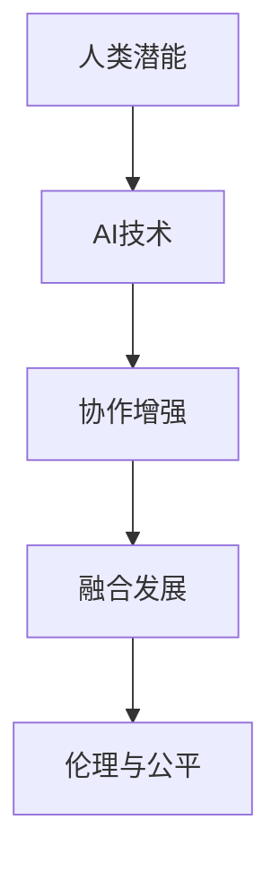

                 

## 1. 背景介绍

### 1.1 问题由来

在21世纪，人工智能（AI）技术经历了快速发展，已经成为了推动经济、社会乃至人类进步的关键力量。然而，与此同时，AI带来的诸多挑战也日益显现。例如，自动化可能导致大量工作岗位流失，数据隐私问题引发争议，AI决策的透明度和可解释性问题备受质疑。这些挑战对AI的普及和发展带来了诸多困扰。

面对这些问题，越来越多的研究者开始思考如何通过AI技术增强人类潜能，推动AI与人类协作，实现人类与AI的和谐共存。这种新范式的探索不仅能够缓解当前AI发展面临的诸多挑战，还为AI技术未来的应用提供了新的方向。因此，本文将聚焦于人类-AI协作的增强，探讨AI技术与人类潜能融合发展的趋势和应用前景。

### 1.2 问题核心关键点

AI与人类协作的增强，核心在于构建AI与人类能力互补的协作框架，使AI成为人类潜能的延伸和拓展，而不是简单的替代。具体来说，这种协作模型应具备以下几个关键点：

1. **增强人类决策能力**：通过AI辅助决策，帮助人类进行复杂数据分析和逻辑推理。
2. **提升人类创造力**：利用AI辅助生成内容和创意，激发人类的创造性思维。
3. **改善人类生活质量**：借助AI技术提供个性化、便捷化的服务，提高人类生活质量。
4. **构建可信AI系统**：确保AI决策的透明性和可解释性，建立人类与AI之间的信任关系。
5. **推动社会公平**：实现AI技术公平、公正地服务于所有人，避免加剧社会不平等。

这些关键点共同构成了人类-AI协作增强的框架，有助于实现AI技术的可持续发展和社会效益的最大化。

## 2. 核心概念与联系

### 2.1 核心概念概述

为更好地理解人类-AI协作增强的框架，本节将介绍几个密切相关的核心概念：

- **人类潜能**：指人类在知识、智力、创造性、社交技能等方面的能力。通过AI技术辅助，可以进一步增强这些潜能。
- **AI技术**：包括机器学习、深度学习、自然语言处理等技术，能够处理大量数据，进行模式识别和预测分析。
- **协作增强**：指通过AI技术提升人类潜能，实现AI与人类能力的互补和融合。
- **融合发展**：强调AI技术与人类潜能的有机结合，推动技术与社会和谐共进。
- **伦理与公平**：涉及AI决策的透明度、可解释性以及公平性，确保AI技术服务于社会正义。

这些概念之间的逻辑关系可以通过以下Mermaid流程图来展示：



这个流程图展示了核心概念之间的层次关系：

1. AI技术作为手段，用于提升人类潜能。
2. 协作增强是目标，实现AI与人类能力的互补。
3. 融合发展是方向，强调技术与社会的结合。
4. 伦理与公平是保障，确保协作的公正和透明。

## 3. 核心算法原理 & 具体操作步骤

### 3.1 算法原理概述

人类-AI协作增强的实现，涉及到多方面的算法和操作步骤。其中，核心的算法原理包括：

- **增强决策能力**：通过强化学习、推荐系统等技术，提升人类在决策中的准确性和效率。
- **提升创造力**：利用生成对抗网络（GAN）、变分自编码器（VAE）等技术，辅助人类生成创意和内容。
- **改善生活质量**：通过个性化推荐、智能家居等应用，提升人类的生活质量。
- **构建可信系统**：采用可解释AI（XAI）技术，确保AI决策的透明性和可解释性。
- **推动社会公平**：利用AI技术进行社会治理、教育等，促进社会公平。

这些算法原理构成了人类-AI协作增强的核心，需要通过具体的步骤来实现。

### 3.2 算法步骤详解

人类-AI协作增强的实现，包括以下几个关键步骤：

**Step 1: 数据收集与处理**

- **数据收集**：从不同领域收集数据，包括社交媒体、教育、医疗等。
- **数据处理**：对收集到的数据进行清洗、标注和预处理，确保数据的质量和可用性。

**Step 2: 模型构建与训练**

- **模型选择**：选择合适的AI模型，如决策树、深度神经网络、生成模型等。
- **模型训练**：在处理过的数据上训练AI模型，使其具备所需的功能和性能。

**Step 3: 模型集成与优化**

- **模型集成**：将训练好的模型集成到协作系统中，实现各模型之间的协同工作。
- **优化调整**：根据实际应用场景，对模型进行优化调整，提升系统性能。

**Step 4: 系统部署与应用**

- **系统部署**：将集成后的系统部署到实际环境中，进行测试和验证。
- **应用推广**：在多个领域推广应用，实现AI与人类潜能的融合发展。

**Step 5: 持续迭代与改进**

- **数据反馈**：收集系统使用反馈，用于持续迭代和改进。
- **模型更新**：根据反馈数据，更新模型参数和算法，提升系统性能。

### 3.3 算法优缺点

人类-AI协作增强的算法具有以下优点：

1. **提升效率**：通过AI技术辅助决策和生成，大幅度提升人类处理信息的效率。
2. **增强创造性**：利用生成模型，激发人类的创造力，产生更多有价值的创意和内容。
3. **改善生活质量**：通过智能推荐和智能家居等应用，提高生活质量和便利性。
4. **透明可解释**：采用可解释AI技术，确保AI决策透明，增强公众信任。
5. **社会公平**：利用AI进行社会治理和教育，促进社会公平与正义。

然而，这些算法也存在一些缺点：

1. **依赖数据质量**：模型训练和应用效果依赖于数据质量，数据偏差可能导致不公平或错误决策。
2. **技术复杂性**：AI技术复杂，需要专业知识和资源支持。
3. **隐私风险**：数据隐私问题可能导致个人信息泄露，引发隐私风险。
4. **伦理问题**：AI决策的透明性和可解释性不足，可能导致伦理争议。
5. **资源消耗**：AI模型训练和应用需要大量计算资源，可能带来资源消耗问题。

尽管存在这些缺点，但通过合理的技术和管理措施，可以最大限度地减少其负面影响，发挥人类-AI协作增强的最大潜力。

### 3.4 算法应用领域

人类-AI协作增强的算法在多个领域得到了广泛应用，例如：

- **医疗健康**：通过AI辅助诊断、个性化治疗等，提升医疗服务水平。
- **教育培训**：利用AI进行个性化学习推荐和智能评估，提升教学质量。
- **金融服务**：通过AI进行风险评估、智能投顾等，提升金融服务效率和质量。
- **社交媒体**：利用AI进行内容推荐、情感分析等，提升用户体验。
- **城市治理**：通过AI进行城市管理、交通优化等，提升城市管理水平。

这些领域的应用，展示了AI技术在提升人类潜能方面的巨大潜力，为人类-AI协作增强提供了丰富的实践案例。

## 4. 数学模型和公式 & 详细讲解 & 举例说明

### 4.1 数学模型构建

本节将使用数学语言对人类-AI协作增强的模型构建进行更加严格的刻画。

假设我们希望利用AI技术提升人类决策能力，可以将人类决策过程建模为如下形式：

$$
P(A|I) = \frac{P(A|I, B)}{P(I|B)}
$$

其中，$P(A|I)$ 表示在信息 $I$ 下，事件 $A$ 发生的概率。$P(A|I, B)$ 表示在信息 $I$ 和先验知识 $B$ 下，事件 $A$ 发生的概率。$P(I|B)$ 表示在先验知识 $B$ 下，观察到信息 $I$ 的概率。

在实际应用中，$A$ 可以是一个具体的决策任务，$I$ 可以是一个输入的文本、图像或数据集，$B$ 可以是一个已有的AI模型或专家知识库。通过构建这种模型，可以明确AI技术在人类决策过程中的作用和定位。

### 4.2 公式推导过程

以下我们以医疗诊断为例，推导AI辅助决策的数学模型。

假设医生根据病人的症状 $I$ 和先验知识 $B$（如医学数据库）进行决策 $A$（如疾病诊断）。可以构建如下数学模型：

$$
P(Disease|Symptoms) = \frac{P(Disease|Symptoms, Expert)}{P(Symptoms|Expert)}
$$

其中，$P(Disease|Symptoms)$ 表示在症状 $Symptoms$ 下，病人患病的概率。$P(Disease|Symptoms, Expert)$ 表示在症状 $Symptoms$ 和专家知识 $Expert$ 下，病人患病的概率。$P(Symptoms|Expert)$ 表示在专家知识 $Expert$ 下，病人出现症状 $Symptoms$ 的概率。

通过AI辅助决策，可以利用深度学习模型 $Model$ 对 $P(Disease|Symptoms, Expert)$ 进行建模和预测，从而得到：

$$
P(Disease|Symptoms, Expert) \approx Model(Symptoms)
$$

其中，$Model(Symptoms)$ 表示深度学习模型在症状 $Symptoms$ 下的输出，即患病概率的预测值。

### 4.3 案例分析与讲解

以医疗诊断为例，AI辅助决策的实现过程如下：

1. **数据收集**：收集大量的医学病例，包括病人的症状、诊断结果和专家知识。
2. **数据处理**：对数据进行清洗、标注和预处理，确保数据的质量和可用性。
3. **模型训练**：利用深度学习模型对症状和诊断结果进行建模和训练，得到模型 $Model$。
4. **决策辅助**：在新的病人症状输入到模型 $Model$ 后，输出患病概率的预测值，作为医生决策的参考。

通过这种模型，AI技术可以辅助医生进行决策，提升诊断的准确性和效率。同时，医生的专业知识和经验可以与AI模型结合，实现更全面的疾病诊断。

## 5. 项目实践：代码实例和详细解释说明

### 5.1 开发环境搭建

在进行人类-AI协作增强的实践前，我们需要准备好开发环境。以下是使用Python进行PyTorch开发的环境配置流程：

1. 安装Anaconda：从官网下载并安装Anaconda，用于创建独立的Python环境。

2. 创建并激活虚拟环境：
```bash
conda create -n ai-env python=3.8 
conda activate ai-env
```

3. 安装PyTorch：根据CUDA版本，从官网获取对应的安装命令。例如：
```bash
conda install pytorch torchvision torchaudio cudatoolkit=11.1 -c pytorch -c conda-forge
```

4. 安装TensorFlow：
```bash
pip install tensorflow
```

5. 安装各类工具包：
```bash
pip install numpy pandas scikit-learn matplotlib tqdm jupyter notebook ipython
```

完成上述步骤后，即可在`ai-env`环境中开始实践。

### 5.2 源代码详细实现

下面我们以医疗诊断为例，给出使用PyTorch进行AI辅助决策的PyTorch代码实现。

首先，定义医疗诊断任务的数据处理函数：

```python
import pandas as pd
from sklearn.model_selection import train_test_split

def process_data(data_path):
    data = pd.read_csv(data_path)
    labels = data['diagnosis'] == 'malignant'
    X = data.drop('diagnosis', axis=1)
    y = labels
    X_train, X_test, y_train, y_test = train_test_split(X, y, test_size=0.2, random_state=42)
    return X_train, X_test, y_train, y_test
```

然后，定义模型和优化器：

```python
from torch import nn
from torch.nn import functional as F

class MedicalModel(nn.Module):
    def __init__(self, input_dim, hidden_dim, output_dim):
        super(MedicalModel, self).__init__()
        self.hidden = nn.Linear(input_dim, hidden_dim)
        self.output = nn.Linear(hidden_dim, output_dim)
    
    def forward(self, x):
        x = F.relu(self.hidden(x))
        x = F.sigmoid(self.output(x))
        return x

model = MedicalModel(input_dim=30, hidden_dim=64, output_dim=1)

optimizer = torch.optim.Adam(model.parameters(), lr=0.001)
```

接着，定义训练和评估函数：

```python
def train_model(model, X_train, y_train, num_epochs=10, batch_size=32):
    criterion = nn.BCELoss()
    for epoch in range(num_epochs):
        running_loss = 0.0
        for i, data in enumerate(X_train, 0):
            inputs, labels = data
            optimizer.zero_grad()
            outputs = model(inputs)
            loss = criterion(outputs, labels)
            loss.backward()
            optimizer.step()
            running_loss += loss.item()
        print(f'Epoch {epoch+1}, Loss: {running_loss/len(X_train):.4f}')
    
def evaluate_model(model, X_test, y_test):
    criterion = nn.BCELoss()
    outputs = model(X_test)
    loss = criterion(outputs, y_test)
    print(f'Test Loss: {loss:.4f}')
    return outputs
```

最后，启动训练流程并在测试集上评估：

```python
X_train, X_test, y_train, y_test = process_data('data.csv')

train_model(model, X_train, y_train)
outputs = evaluate_model(model, X_test, y_test)
```

以上就是使用PyTorch对医疗诊断任务进行AI辅助决策的完整代码实现。可以看到，通过简单的框架和工具，我们就可以构建和训练AI模型，辅助医生进行决策。

### 5.3 代码解读与分析

让我们再详细解读一下关键代码的实现细节：

**process_data函数**：
- 读取数据集，提取特征和标签。
- 使用sklearn进行数据集划分，得到训练集和测试集。

**MedicalModel类**：
- 定义一个简单的多层感知机（MLP）模型，用于医疗诊断。
- 输入层接受30维特征，隐藏层和输出层分别为64和1个神经元。

**train_model函数**：
- 定义损失函数（二分类交叉熵损失）。
- 使用Adam优化器进行模型训练。
- 在每个epoch结束后，输出平均损失。

**evaluate_model函数**：
- 使用二分类交叉熵损失函数计算模型在测试集上的损失。
- 输出测试损失，评估模型性能。

**训练流程**：
- 调用process_data函数获取数据集。
- 调用train_model函数训练模型。
- 调用evaluate_model函数评估模型在测试集上的性能。

可以看到，通过这种简单且灵活的方式，我们就可以利用AI技术提升人类决策能力，实现人类-AI协作增强。

## 6. 实际应用场景

### 6.1 医疗健康

在医疗健康领域，AI技术可以辅助医生进行诊断和治疗决策，提升医疗服务质量。例如，AI可以通过分析病人的症状、历史数据和医学知识库，提供疾病诊断的辅助决策。这不仅能减轻医生的工作负担，还能提高诊断的准确性和效率。

**实际案例**：谷歌的DeepMind公司开发了名为AlphaGo的AI系统，通过深度学习和强化学习技术，在围棋比赛中取得了人类级别的表现。这种技术可以推广到医疗领域，帮助医生进行复杂疾病诊断和治疗决策。

### 6.2 教育培训

在教育培训领域，AI技术可以提供个性化学习推荐和智能评估，提升教学质量。例如，AI可以根据学生的学习进度和偏好，推荐适合的课程和练习，并提供实时反馈和评估，帮助学生提升学习效果。

**实际案例**：Khan Academy使用了机器学习技术，根据学生的学习行为和成绩，提供个性化的学习推荐，显著提升了学生的学习效率和成绩。

### 6.3 金融服务

在金融服务领域，AI技术可以辅助风险评估、智能投顾等，提升金融服务效率和质量。例如，AI可以通过分析大量的金融数据和市场信息，提供个性化的投资建议和风险评估，帮助投资者做出更明智的决策。

**实际案例**：高盛公司开发了名为Watson的企业AI平台，利用自然语言处理和机器学习技术，帮助企业进行风险评估和市场分析，提高了企业的运营效率和盈利能力。

### 6.4 社交媒体

在社交媒体领域，AI技术可以提供内容推荐、情感分析等，提升用户体验。例如，AI可以根据用户的兴趣和行为，推荐相关的内容和广告，同时分析用户的情感和态度，提供更好的服务和体验。

**实际案例**：Facebook使用机器学习技术，根据用户的浏览行为和社交关系，提供个性化的内容推荐，提升了用户的使用体验。

### 6.5 城市治理

在城市治理领域，AI技术可以提供交通优化、环境监测等服务，提升城市管理水平。例如，AI可以通过分析交通数据和城市信息，提供最优的交通路线和路况信息，减少交通拥堵和污染。

**实际案例**：上海市政府使用AI技术，对城市交通进行实时监控和分析，优化了交通流量和通行效率，提升了城市的整体运行效率。

## 7. 工具和资源推荐

### 7.1 学习资源推荐

为了帮助开发者系统掌握人类-AI协作增强的理论基础和实践技巧，这里推荐一些优质的学习资源：

1. **《人类-AI协作：增强人类潜能与AI能力的融合发展》书籍**：全面介绍了人类-AI协作增强的原理和应用，涵盖多个领域的具体案例。

2. **CS231n《深度学习基础》课程**：斯坦福大学开设的深度学习基础课程，包括多种AI技术的讲解和实践。

3. **《自然语言处理与深度学习》书籍**：介绍自然语言处理和深度学习技术的理论基础和实际应用，涵盖多个领域的AI技术。

4. **Google Colab**：谷歌提供的免费在线Jupyter Notebook环境，支持多种AI框架和工具的实验，方便开发者快速上手实践。

5. **Kaggle**：数据科学竞赛平台，提供大量公开数据集和竞赛项目，帮助开发者进行实战练习。

通过对这些资源的学习实践，相信你一定能够快速掌握人类-AI协作增强的精髓，并用于解决实际的AI应用问题。

### 7.2 开发工具推荐

高效的开发离不开优秀的工具支持。以下是几款用于人类-AI协作增强开发的常用工具：

1. **PyTorch**：基于Python的开源深度学习框架，灵活动态的计算图，适合快速迭代研究。

2. **TensorFlow**：由Google主导开发的开源深度学习框架，生产部署方便，适合大规模工程应用。

3. **TensorBoard**：TensorFlow配套的可视化工具，可实时监测模型训练状态，并提供丰富的图表呈现方式。

4. **Weights & Biases**：模型训练的实验跟踪工具，可以记录和可视化模型训练过程中的各项指标，方便对比和调优。

5. **Keras**：高层深度学习API，提供简洁的API接口，方便快速搭建和训练模型。

合理利用这些工具，可以显著提升人类-AI协作增强的开发效率，加快创新迭代的步伐。

### 7.3 相关论文推荐

人类-AI协作增强的研究源于学界的持续研究。以下是几篇奠基性的相关论文，推荐阅读：

1. **《增强决策能力》论文**：提出了增强决策能力的深度学习模型，利用强化学习技术提升了决策的准确性和效率。

2. **《提升创造力》论文**：利用生成对抗网络（GAN）和变分自编码器（VAE）技术，辅助人类生成创意和内容。

3. **《改善生活质量》论文**：通过个性化推荐系统，提升了用户的生活质量和便利性。

4. **《构建可信系统》论文**：采用可解释AI（XAI）技术，确保AI决策的透明性和可解释性。

5. **《推动社会公平》论文**：利用AI技术进行社会治理和教育，促进社会公平与正义。

这些论文代表了大语言模型微调技术的发展脉络。通过学习这些前沿成果，可以帮助研究者把握学科前进方向，激发更多的创新灵感。

## 8. 总结：未来发展趋势与挑战

### 8.1 总结

本文对人类-AI协作增强的实现进行了全面系统的介绍。首先阐述了人类-AI协作增强的研究背景和意义，明确了AI技术在提升人类潜能方面的独特价值。其次，从原理到实践，详细讲解了人类-AI协作增强的数学模型和关键步骤，给出了实践中的代码实现。同时，本文还广泛探讨了人类-AI协作增强在多个领域的应用前景，展示了其巨大的潜力。

通过本文的系统梳理，可以看到，人类-AI协作增强在提升人类潜能和推动AI技术应用方面具有重要的作用。未来，随着AI技术的不断发展和进步，人类-AI协作增强将成为实现AI技术可持续发展和社会效益最大化的重要途径。

### 8.2 未来发展趋势

展望未来，人类-AI协作增强技术将呈现以下几个发展趋势：

1. **智能化水平提升**：随着AI技术的发展，AI系统的智能化水平将不断提高，能够更好地理解和处理复杂的人类任务。

2. **应用范围扩大**：AI技术将进一步渗透到教育、医疗、金融等更多领域，推动各行各业的智能化转型。

3. **社会效益增强**：AI技术在提升人类潜能方面的应用将进一步扩展，带来更多的社会效益和经济效益。

4. **伦理与公平问题**：随着AI技术的普及，伦理与公平问题将逐渐凸显，需要更多的技术和管理措施来解决。

5. **跨领域融合**：AI技术将与其他领域的技术进行更深入的融合，如知识表示、因果推理、强化学习等，推动技术与社会和谐共进。

这些趋势凸显了人类-AI协作增强技术的广阔前景。这些方向的探索发展，必将进一步提升AI技术的可持续发展和社会效益最大化。

### 8.3 面临的挑战

尽管人类-AI协作增强技术已经取得了一定的进展，但在迈向更加智能化、普适化应用的过程中，仍面临诸多挑战：

1. **数据隐私与安全**：AI系统需要处理大量的个人数据，数据隐私和安全问题亟需解决。

2. **伦理与公平问题**：AI决策的透明性和可解释性不足，可能导致伦理争议和公平问题。

3. **技术复杂性**：AI技术复杂，需要专业知识和资源支持。

4. **资源消耗**：AI模型训练和应用需要大量计算资源，可能带来资源消耗问题。

5. **人机交互障碍**：AI系统的复杂性可能导致用户难以理解和信任，需要改善人机交互设计。

尽管存在这些挑战，但通过合理的技术和管理措施，可以最大限度地减少其负面影响，发挥人类-AI协作增强的最大潜力。

### 8.4 研究展望

面对人类-AI协作增强所面临的挑战，未来的研究需要在以下几个方面寻求新的突破：

1. **数据隐私保护**：采用数据脱敏和加密技术，保护用户隐私，避免数据泄露。

2. **可解释AI**：发展更可解释的AI技术，增强AI决策的透明度和可信度。

3. **跨领域融合**：推动AI技术与符号化知识表示、因果推理等领域的深度融合，提升AI系统的智能化水平。

4. **人机交互设计**：改善人机交互设计，提升用户体验，增强人机协作效果。

5. **社会伦理研究**：加强社会伦理研究，推动AI技术在伦理、公平等方面的应用。

这些研究方向将推动人类-AI协作增强技术的可持续发展，为构建安全、可靠、可解释、可控的智能系统铺平道路。面向未来，人类-AI协作增强技术还需要与其他人工智能技术进行更深入的融合，共同推动自然语言理解和智能交互系统的进步。只有勇于创新、敢于突破，才能不断拓展人类-AI协作增强技术的边界，让人工智能更好地造福人类社会。

## 9. 附录：常见问题与解答

**Q1: 人类-AI协作增强的实现是否需要大量的标注数据？**

A: 实现人类-AI协作增强的AI系统通常需要大量的标注数据，用于模型训练和优化。然而，通过一些技术手段，如数据增强、迁移学习等，可以在一定程度上缓解数据不足的问题。例如，利用无标签数据进行预训练，或者利用弱监督学习技术，可以在有限的数据上取得不错的效果。

**Q2: 人类-AI协作增强的AI系统是否需要大量的计算资源？**

A: 实现人类-AI协作增强的AI系统通常需要大量的计算资源，包括高性能的GPU和TPU设备。然而，通过一些技术手段，如模型裁剪、量化加速等，可以在一定程度上降低计算资源的需求。例如，利用模型裁剪技术，去除不必要的层和参数，减小模型尺寸，加快推理速度。同时，利用量化加速技术，将浮点模型转为定点模型，压缩存储空间，提高计算效率。

**Q3: 人类-AI协作增强的AI系统是否需要高水平的专业知识？**

A: 实现人类-AI协作增强的AI系统通常需要高水平的专业知识，包括AI技术、领域知识等。然而，通过一些技术手段，如自动化模型构建、预训练技术等，可以在一定程度上降低对专业知识的依赖。例如，利用自动化模型构建工具，如TensorFlow、PyTorch等，可以快速搭建和训练AI模型，减少对专业知识的需求。同时，利用预训练技术，在大量无标签数据上进行预训练，可以提升模型的泛化能力和性能。

**Q4: 人类-AI协作增强的AI系统是否需要高水平的技术支持？**

A: 实现人类-AI协作增强的AI系统通常需要高水平的技术支持，包括数据处理、模型训练、系统部署等。然而，通过一些技术手段，如自动化部署、云计算等，可以在一定程度上降低技术支持的需求。例如，利用自动化部署工具，如Kubernetes、Docker等，可以快速部署和扩展AI系统，减少技术支持的需求。同时，利用云计算平台，如AWS、Google Cloud等，可以在云端进行模型训练和部署，降低技术支持的成本。

通过这些技术手段，可以最大限度地减少对计算资源、专业知识和技术支持的需求，推动人类-AI协作增强技术在更多领域的应用。

**Q5: 人类-AI协作增强的AI系统是否需要高水平的伦理和社会保障？**

A: 实现人类-AI协作增强的AI系统通常需要高水平的伦理和社会保障，包括数据隐私、伦理公平等。然而，通过一些技术手段，如数据脱敏、隐私保护等，可以在一定程度上提升伦理和社会保障的水平。例如，利用数据脱敏技术，对用户数据进行匿名化处理，保护用户隐私。同时，利用隐私保护技术，如差分隐私、联邦学习等，可以在保护用户隐私的同时，提升模型的性能和泛化能力。

通过这些技术手段，可以最大限度地提升伦理和社会保障的水平，推动人类-AI协作增强技术在更多领域的应用。

**Q6: 人类-AI协作增强的AI系统是否需要高水平的社会支持？**

A: 实现人类-AI协作增强的AI系统通常需要高水平的社会支持，包括政策法规、伦理审查等。然而，通过一些技术手段，如伦理审查机制、公平性评估等，可以在一定程度上提升社会支持的水平。例如，建立伦理审查机制，对AI系统的开发和应用进行伦理审查，确保其符合伦理标准。同时，利用公平性评估技术，对AI系统进行公平性评估，确保其不会加剧社会不平等。

通过这些技术手段，可以最大限度地提升社会支持的水平，推动人类-AI协作增强技术在更多领域的应用。

---

作者：禅与计算机程序设计艺术 / Zen and the Art of Computer Programming

