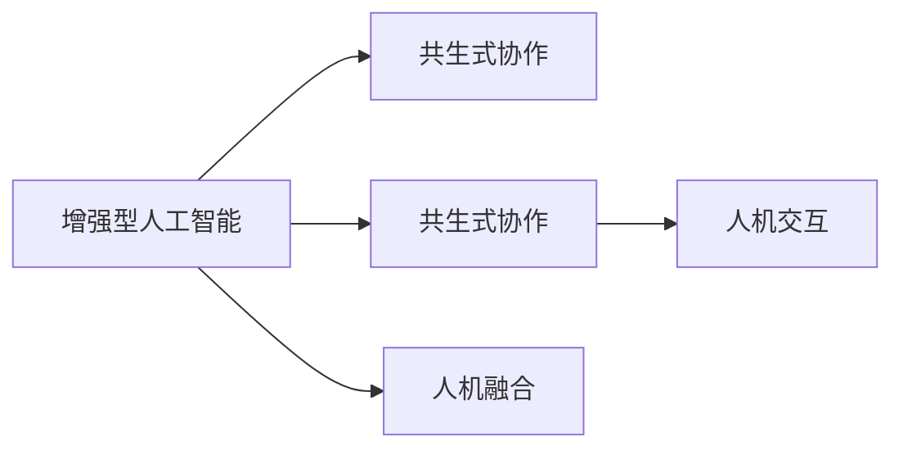

                 

## 1. 背景介绍

在当今信息爆炸的时代，人工智能（AI）技术正以前所未有的速度和规模影响着各个行业。从医疗诊断、金融分析到教育、艺术创作，AI的应用几乎无所不包。然而，尽管AI在许多方面展现了强大的能力，它仍无法完全取代人类在复杂决策、情感理解和创造性思维等方面的优势。因此，人机协作成为了增强人类潜能与AI能力融合发展的最佳途径。本文将从背景、核心概念、算法原理、实际应用及未来展望等方面，深入分析人类-AI协作的发展趋势、机遇与挑战，为行业从业者和研究人员提供参考。

## 2. 核心概念与联系

### 2.1 核心概念概述

- **增强型人工智能**：指通过人机协作，将人类的知识、直觉和经验融入AI系统中，提升AI的决策能力和创造性。
- **共生式协作**：强调人类与AI在任务执行中的互补关系，即AI处理数据和逻辑推理，而人类处理情感、伦理和创新。
- **人机交互**：涵盖自然语言处理、手势识别、情感计算等多种技术，使得人机协作更加自然和高效。
- **人机融合**：指AI系统与人类认知系统在信息处理和决策中的深度融合，实现更高效、更智能的协作。

### 2.2 核心概念原理和架构的 Mermaid 流程图



## 3. 核心算法原理 & 具体操作步骤

### 3.1 算法原理概述

基于增强型人工智能的协作系统通常包括两个核心部分：AI算法和人类决策层。AI算法负责数据处理、模式识别和预测，而人类决策层则负责监督、调整和最终决策。两者之间的协同工作可以显著提升系统的整体性能。

### 3.2 算法步骤详解

1. **数据准备**：收集和标注相关领域的数据，包括结构化数据和半结构化数据。
2. **模型训练**：利用深度学习等技术训练AI模型，使其具备强大的数据处理和预测能力。
3. **融合机制设计**：定义人类和AI之间的协作机制，包括信息传递方式、决策规则等。
4. **人机交互界面设计**：开发易于操作和直观的用户界面，方便人类与AI系统交互。
5. **系统测试与优化**：在实际应用场景中测试系统性能，根据反馈不断优化算法和交互界面。

### 3.3 算法优缺点

#### 优点

- **提升决策质量**：AI在处理数据和逻辑推理方面具有优势，与人类协作可提升决策的准确性和全面性。
- **加速任务执行**：AI的高效处理能力可以显著加快任务执行速度，节省人力成本。
- **增强创造力**：通过人机协作，AI能够从人类创意中获取灵感，提高系统的创造性。

#### 缺点

- **伦理和隐私问题**：AI系统的决策过程和数据处理可能涉及隐私和伦理问题，需要严格监管。
- **系统复杂性增加**：人机协作增加了系统的复杂性，可能导致维护困难。
- **依赖高质量数据**：AI模型的性能依赖于数据质量，低质量数据可能影响协作效果。

### 3.4 算法应用领域

人机协作在多个领域具有广泛应用前景：

- **医疗**：AI辅助诊断、治疗方案推荐、个性化医疗。
- **金融**：风险评估、投资策略、反欺诈检测。
- **教育**：智能辅导、个性化学习、内容推荐。
- **制造业**：质量控制、设备维护、供应链优化。
- **艺术**：内容创作、风格迁移、情感计算。

## 4. 数学模型和公式 & 详细讲解 & 举例说明

### 4.1 数学模型构建

在协作系统中，AI模型的输出通常需要与人类决策进行融合。以医疗诊断为例，AI模型输出的诊断结果需要结合医生的专业知识和临床经验，进行最终的诊断。

假设AI模型输出的概率为 $p_i$，医生的主观判断概率为 $q_i$，最终的诊断结果为 $D$。融合机制可以定义为：

$$D = \text{argmax}_i \{ \sum_{i=1}^n p_i \cdot q_i \}$$

### 4.2 公式推导过程

在实际应用中，为了确保协作系统的稳定性，融合机制可以采用加权平均或投票策略。例如，对于多模态数据，可以定义加权融合公式：

$$D = \sum_{i=1}^n w_i \cdot p_i$$

其中 $w_i$ 为各模态数据的权重，通常由专家或统计分析确定。

### 4.3 案例分析与讲解

以智能财务管理系统为例，AI系统负责分析交易数据、预测市场趋势，而人类决策者负责监督和最终审批。系统输出的投资建议需要结合管理者的经验和直觉，综合生成最终的决策。

假设AI系统输出的投资建议概率为 $p_i$，管理者的直觉判断概率为 $q_i$，最终的投资决策为 $I$。融合机制可以定义为：

$$I = \text{argmax}_i \{ p_i \cdot q_i \}$$

## 5. 项目实践：代码实例和详细解释说明

### 5.1 开发环境搭建

为了开发增强型AI协作系统，需要以下环境：

- **编程语言**：Python、Java等。
- **深度学习框架**：TensorFlow、PyTorch等。
- **数据处理库**：Pandas、NumPy等。
- **人机交互库**：Flask、Kivy等。

### 5.2 源代码详细实现

下面以一个简单的协作系统为例，展示其实现流程。

首先，训练AI模型，例如使用TensorFlow训练一个简单的线性回归模型：

```python
import tensorflow as tf
import numpy as np

# 准备数据
x_train = np.array([[1], [2], [3], [4], [5]])
y_train = np.array([2, 4, 6, 8, 10])

# 定义模型
model = tf.keras.Sequential([
    tf.keras.layers.Dense(1, input_shape=[1])
])

# 编译模型
model.compile(optimizer=tf.keras.optimizers.Adam(), loss='mse')

# 训练模型
model.fit(x_train, y_train, epochs=100, verbose=0)
```

然后，设计融合机制和人机交互界面，例如使用Flask框架开发一个简单的Web应用：

```python
from flask import Flask, request, jsonify

app = Flask(__name__)

# 加载训练好的模型
model = tf.keras.models.load_model('model.h5')

@app.route('/predict', methods=['POST'])
def predict():
    data = request.json
    x = np.array(data['x'])
    result = model.predict(x)
    return jsonify({'result': result[0]})

if __name__ == '__main__':
    app.run(debug=True)
```

### 5.3 代码解读与分析

上述代码展示了简单的AI模型训练和Web应用开发流程。在实际应用中，为了增强系统的复杂性和实用性，可能需要引入更多技术，例如：

- **多模态数据融合**：使用多个AI模型，每个模型处理不同类型的数据，通过融合机制生成最终的决策。
- **用户界面设计**：使用图形化界面，提供更加直观和易用的交互体验。
- **系统集成**：将多个模块和服务集成到统一的平台上，实现高效协作。

### 5.4 运行结果展示

运行上述代码后，可以使用Postman等工具发送测试请求，验证系统的预测和融合效果。

## 6. 实际应用场景

### 6.1 智能财务管理系统

在智能财务管理系统中，AI系统负责分析交易数据、预测市场趋势，而人类决策者负责监督和最终审批。系统输出的投资建议需要结合管理者的经验和直觉，综合生成最终的决策。

### 6.2 智能医疗诊断系统

在智能医疗诊断系统中，AI系统负责分析患者数据、预测疾病风险，而医生负责综合AI建议和自身经验，进行最终诊断。系统输出的诊断结果需要结合医生的专业知识和临床经验，进行最终的诊断。

### 6.3 智能教育辅导系统

在智能教育辅导系统中，AI系统负责分析学生的学习数据、预测学习效果，而教师负责监督和调整教学策略。系统输出的学习建议需要结合教师的经验和直觉，综合生成最终的教学方案。

## 7. 工具和资源推荐

### 7.1 学习资源推荐

为了深入理解人类-AI协作技术，推荐以下学习资源：

- **《增强型人工智能：人机协作的新范式》**：介绍了人机协作的基本原理和应用案例。
- **《深度学习实战》**：详细讲解了深度学习模型训练和调优技巧。
- **《自然语言处理入门》**：介绍了自然语言处理的基本概念和技术。
- **《人机交互设计》**：探讨了人机交互界面的设计原则和实践方法。

### 7.2 开发工具推荐

为了高效开发增强型AI协作系统，推荐以下开发工具：

- **TensorFlow**：强大的深度学习框架，支持多种模型训练和优化算法。
- **Flask**：轻量级的Web框架，支持快速开发和部署Web应用。
- **Jupyter Notebook**：交互式编程环境，支持数据处理和模型训练。

### 7.3 相关论文推荐

为了了解人机协作领域的最新研究进展，推荐以下论文：

- **《增强型人工智能：人机协作的新范式》**：介绍人机协作的基本原理和应用案例。
- **《深度学习在医疗诊断中的应用》**：探讨深度学习在医疗诊断中的实际应用。
- **《智能教育中的增强型学习系统》**：介绍智能教育中的增强型学习系统。

## 8. 总结：未来发展趋势与挑战

### 8.1 研究成果总结

通过以上分析，可以得出以下结论：

- 人类-AI协作技术在多个领域具有广泛应用前景。
- 系统的性能和可靠性依赖于数据质量、算法设计和交互界面设计。

### 8.2 未来发展趋势

未来人机协作技术将呈现以下几个趋势：

- **更加智能的AI系统**：随着技术进步，AI系统将具备更强的数据处理和决策能力。
- **更高效的人机交互**：通过自然语言处理和情感计算，人机交互将更加自然和高效。
- **更加智能化的协作系统**：通过深度学习、因果推理等技术，协作系统将具备更强的智能性和创造力。

### 8.3 面临的挑战

尽管人机协作技术前景广阔，但在实际应用中仍面临诸多挑战：

- **伦理和隐私问题**：AI系统的决策过程和数据处理可能涉及隐私和伦理问题，需要严格监管。
- **系统复杂性增加**：人机协作增加了系统的复杂性，可能导致维护困难。
- **依赖高质量数据**：AI模型的性能依赖于数据质量，低质量数据可能影响协作效果。

### 8.4 研究展望

未来研究需要重点关注以下几个方面：

- **多模态数据融合**：研究如何有效融合多种数据模态，提升系统的智能性和鲁棒性。
- **用户友好性设计**：研究如何设计更加自然和易用的用户界面，提升用户体验。
- **隐私和伦理保护**：研究如何保护用户隐私和伦理，确保系统的透明性和公正性。

## 9. 附录：常见问题与解答

### 9.1 问题一：人类-AI协作是否适用于所有领域？

答：人类-AI协作技术适用于需要复杂决策和创造性思维的领域。例如，金融、医疗、教育等，这些领域中的问题往往具有高度复杂性和不确定性，适合人机协作。

### 9.2 问题二：人机协作系统的训练数据是否需要标注？

答：人机协作系统的训练数据需要标注，以确保系统能够理解人类和AI之间的交互。标注数据应该充分覆盖各种场景和情况，以提高系统的泛化能力。

### 9.3 问题三：如何设计人机交互界面？

答：人机交互界面应该简洁直观，易于操作和使用。可以采用图形化界面、自然语言处理等技术，使系统更加智能和易用。

### 9.4 问题四：如何保护用户隐私和伦理？

答：保护用户隐私和伦理需要从数据采集、处理和存储等多个环节进行严格监管。例如，可以使用匿名化处理、数据加密等技术，确保数据安全。

### 9.5 问题五：人机协作系统是否需要持续优化？

答：是的，人机协作系统需要根据实际应用情况不断优化和改进。可以根据反馈和数据不断调整算法和界面设计，以提升系统性能和用户体验。

---

作者：禅与计算机程序设计艺术 / Zen and the Art of Computer Programming

