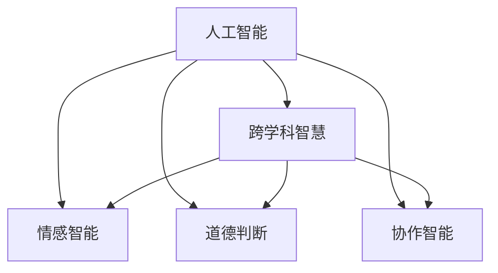

                 

# 人类智慧：AI 时代的新力量

## 1. 背景介绍

### 1.1 问题由来
随着人工智能(AI)技术的飞速发展，我们正处于一个深刻变革的时代。从棋类游戏到语音识别，再到自然语言处理，AI在诸多领域展示了非凡的能力。然而，这些技术仍未能触及人类智慧的核心，即对于世界的理解、知识的获取和思考方式的融合。

AI技术的发展，虽然让人类社会的效率大大提高，但在创造力、情感、道德判断等人类智慧的关键领域，仍存在明显不足。因此，如何融合AI与人类的智慧，利用AI技术提升人类智慧，成为一个亟待解决的问题。

### 1.2 问题核心关键点
人类智慧的AI化融合，需要从以下几个方面进行探索：

- **跨学科融合**：将AI技术与心理学、哲学、伦理学、教育学等学科知识相结合，建立跨学科的AI智慧体系。
- **深度学习与逻辑推理**：结合深度学习和逻辑推理，开发既能自动学习又能进行复杂推理的系统。
- **情感智能**：开发能够理解和处理人类情感的AI系统，提升人际交往质量和用户体验。
- **道德判断**：赋予AI系统基于人类价值观的道德判断能力，确保AI决策的伦理性和公正性。
- **协作智能**：构建AI与人类的协作体系，让AI成为人类智慧的延伸，辅助人类进行决策和创新。

## 2. 核心概念与联系

### 2.1 核心概念概述

为更好地理解AI时代人类智慧的融合，本节将介绍几个关键概念：

- **人工智能**：使计算机具有学习、推理和自我改进能力的技术体系，包括机器学习、深度学习、自然语言处理、计算机视觉等方向。
- **跨学科智慧**：融合多个学科的知识和方法，构建具有丰富背景知识的AI系统。
- **情感智能**：使AI系统能够理解和处理人类情感的能力，提升人机交互质量。
- **道德判断**：赋予AI系统基于人类价值观的道德判断能力，确保其决策的伦理性和公正性。
- **协作智能**：构建AI与人类的协作体系，辅助人类进行复杂决策和创新。

这些概念之间的联系可以通过以下Mermaid流程图来展示：



这个流程图展示了几类AI智慧的构建：

1. 人工智能通过深度学习、逻辑推理等技术，获得了基础能力。
2. 跨学科智慧融合了心理学、哲学等学科知识，构建具有丰富背景的AI系统。
3. 情感智能和道德判断使得AI系统具备理解人类情感和伦理判断的能力。
4. 协作智能建立了AI与人类的协作体系，提升人类智慧的应用效率。

这些概念共同构成了AI时代人类智慧的融合框架，为AI系统的开发和应用提供了理论指导。

## 3. 核心算法原理 & 具体操作步骤
### 3.1 算法原理概述

AI时代人类智慧的融合，本质上是一个多学科、多技术的深度融合过程。其核心思想是：将人工智能技术与人类智慧的核心元素结合，构建具有丰富背景知识的智能系统。

形式化地，假设一个AI系统 $S$ 具备以下能力：

- 学习能力：能够从数据中学习知识。
- 逻辑推理：能够进行基于规则的推理。
- 情感理解：能够理解和处理人类情感。
- 道德判断：能够基于人类价值观进行决策。
- 协作能力：能够与人类协同工作。

AI系统的设计目标是通过技术手段，让 $S$ 具备以上所有能力。

### 3.2 算法步骤详解

AI时代人类智慧的融合，一般包括以下几个关键步骤：

**Step 1: 选择合适的AI技术和工具**
- 确定需要融合的学科知识，选择合适的AI技术（如深度学习、知识图谱、逻辑推理等）和工具（如TensorFlow、PyTorch等）。
- 设计AI系统的架构，确定各个模块的功能和接口。

**Step 2: 数据和知识准备**
- 收集和标注跨学科的数据集，包括语言数据、情感数据、道德数据等。
- 构建知识库，包括领域知识、逻辑规则、道德准则等，供AI系统使用。

**Step 3: 技术实现**
- 使用深度学习模型，如BERT、GPT等，进行跨学科知识学习。
- 引入逻辑推理引擎，如Prover9、A-Prover等，处理结构化知识。
- 开发情感理解模块，使用情感分析技术，如TF-IDF、LSTM等，处理文本情感。
- 集成道德判断模块，使用道德推理算法，如博弈论、伦理学模型等，确保决策的伦理性和公正性。
- 实现协作智能模块，使用协同过滤、推荐系统等技术，提升人机协作效果。

**Step 4: 系统测试和优化**
- 对AI系统进行全面测试，确保其在各种场景下的性能稳定。
- 收集用户反馈，不断优化系统，提升用户体验。
- 引入持续学习机制，让系统能够不断适应新的环境和知识。

**Step 5: 部署和应用**
- 将AI系统部署到实际应用环境中，如智能客服、医疗诊断、教育辅助等。
- 定期更新知识库和数据集，保持系统的最新状态。
- 监控系统运行状态，及时解决问题，确保系统稳定运行。

以上是AI时代人类智慧融合的一般流程。在实际应用中，还需要针对具体任务的特点，对各个环节进行优化设计，以进一步提升系统性能。

### 3.3 算法优缺点

AI时代人类智慧的融合，具有以下优点：

- **跨学科优势**：融合了多学科的知识，构建更全面的智慧体系。
- **智能协同**：通过AI与人类的协同工作，提升决策和创新的效率和质量。
- **动态适应**：能够不断学习和适应用户需求，提升用户体验。

同时，该方法也存在一些局限性：

- **技术复杂**：融合多个学科和技术，实现难度较大。
- **伦理风险**：引入道德判断和协作智能，需要确保系统的决策伦理性和公正性。
- **成本高**：融合多个学科和技术，成本较高。

尽管存在这些局限性，但就目前而言，AI时代人类智慧的融合仍是AI研究的前沿方向。未来相关研究的重点在于如何进一步降低技术实现难度，提高系统的可解释性和伦理性，同时兼顾成本效益。

### 3.4 算法应用领域

AI时代人类智慧的融合方法，在多个领域得到了广泛应用，例如：

- **智能客服**：利用情感理解和道德判断，构建能够理解用户情感、提供合适建议的智能客服系统。
- **医疗诊断**：结合领域知识和逻辑推理，构建能够进行医学推理、辅助诊断的医疗系统。
- **教育辅助**：通过情感理解、协作智能等技术，提升个性化教学效果和用户体验。
- **智慧城市**：融合多学科知识，构建能够进行城市治理、应急响应的智慧城市系统。

除了上述这些领域外，AI时代人类智慧的融合还被创新性地应用到更多场景中，如金融风险控制、环境保护、灾害预警等，为各行各业带来了全新的变革。随着AI技术的不断进步，相信人类智慧与AI的融合将带来更深远的社会变革。

## 4. 数学模型和公式 & 详细讲解  
### 4.1 数学模型构建

本节将使用数学语言对AI时代人类智慧的融合过程进行更加严格的刻画。

假设一个AI系统 $S$ 包含多个模块，每个模块的功能和输出用向量表示。令 $x_i$ 为第 $i$ 个模块的输入，$y_i$ 为第 $i$ 个模块的输出，则AI系统的整体输出 $y$ 可以表示为：

$$
y = f(y_1, y_2, \ldots, y_n)
$$

其中 $f$ 为系统的综合函数，表示各模块间的交互和融合。

### 4.2 公式推导过程

以下我们以智能客服系统为例，推导情感理解和道德判断模块的数学模型：

**情感理解模块**：
设 $x$ 为客服用户的文本输入，$y$ 为情感输出，则情感理解模型可以表示为：

$$
y = g(x) = \sum_{i=1}^n \alpha_i f_i(x)
$$

其中 $\alpha_i$ 为第 $i$ 个情感分析模型的权重，$f_i(x)$ 为第 $i$ 个情感分析模型的输出，$g(x)$ 为综合情感输出。

**道德判断模块**：
设 $y_1$ 为情感理解输出，$y_2$ 为决策输出，则道德判断模型可以表示为：

$$
y_2 = h(y_1) = \sum_{i=1}^n \beta_i g_i(y_1)
$$

其中 $\beta_i$ 为第 $i$ 个道德推理模型的权重，$g_i(y_1)$ 为第 $i$ 个道德推理模型的输出，$h(y_1)$ 为综合道德输出。

将以上公式代入AI系统的整体输出公式，得：

$$
y = f(g(x), h(g(x)))
$$

以上公式展示了AI系统通过情感理解和道德判断模块，对用户的输入进行综合处理，最终输出智能决策的过程。

### 4.3 案例分析与讲解

**智能客服系统**：
一个智能客服系统可以表示为：

$$
y = f(g(x), h(g(x)))
$$

其中 $x$ 为用户输入的文本，$g(x)$ 为情感理解模块，$h(g(x))$ 为道德判断模块。

假设系统已知用户输入“我的订单还没有发货”，情感理解模块 $g(x)$ 输出情感类型为“焦虑”，道德判断模块 $h(g(x))$ 输出决策建议“查询订单状态”，则系统综合输出 $y$ 为“请查询您的订单状态”。

该系统利用情感理解和道德判断，理解用户情感并给出合适的建议，提升了客服系统的智能化水平。

**医疗诊断系统**：
一个医疗诊断系统可以表示为：

$$
y = f(g(x), h(g(x)))
$$

其中 $x$ 为患者病历，$g(x)$ 为逻辑推理模块，$h(g(x))$ 为道德判断模块。

假设系统已知患者病历“头痛、呕吐、视力模糊”，逻辑推理模块 $g(x)$ 输出“可能患有脑出血”，道德判断模块 $h(g(x))$ 输出决策建议“紧急治疗”，则系统综合输出 $y$ 为“请紧急治疗”。

该系统结合逻辑推理和道德判断，进行医学推理和决策，提升了医疗诊断的智能化水平。

## 5. 项目实践：代码实例和详细解释说明
### 5.1 开发环境搭建

在进行AI时代人类智慧的融合实践前，我们需要准备好开发环境。以下是使用Python进行PyTorch开发的环境配置流程：

1. 安装Anaconda：从官网下载并安装Anaconda，用于创建独立的Python环境。

2. 创建并激活虚拟环境：
```bash
conda create -n ai-env python=3.8 
conda activate ai-env
```

3. 安装PyTorch：根据CUDA版本，从官网获取对应的安装命令。例如：
```bash
conda install pytorch torchvision torchaudio cudatoolkit=11.1 -c pytorch -c conda-forge
```

4. 安装Transformers库：
```bash
pip install transformers
```

5. 安装各类工具包：
```bash
pip install numpy pandas scikit-learn matplotlib tqdm jupyter notebook ipython
```

完成上述步骤后，即可在`ai-env`环境中开始融合实践。

### 5.2 源代码详细实现

下面我以智能客服系统为例，给出使用Transformers库进行情感理解和道德判断模块微调的PyTorch代码实现。

首先，定义情感理解任务的数据处理函数：

```python
from transformers import BertTokenizer
from torch.utils.data import Dataset
import torch

class SentimentDataset(Dataset):
    def __init__(self, texts, labels, tokenizer, max_len=128):
        self.texts = texts
        self.labels = labels
        self.tokenizer = tokenizer
        self.max_len = max_len
        
    def __len__(self):
        return len(self.texts)
    
    def __getitem__(self, item):
        text = self.texts[item]
        label = self.labels[item]
        
        encoding = self.tokenizer(text, return_tensors='pt', max_length=self.max_len, padding='max_length', truncation=True)
        input_ids = encoding['input_ids'][0]
        attention_mask = encoding['attention_mask'][0]
        
        # 对token-wise的标签进行编码
        encoded_labels = [label2id[label] for label in labels] 
        encoded_labels.extend([label2id['neutral']] * (self.max_len - len(encoded_labels)))
        labels = torch.tensor(encoded_labels, dtype=torch.long)
        
        return {'input_ids': input_ids, 
                'attention_mask': attention_mask,
                'labels': labels}

# 标签与id的映射
label2id = {'positive': 0, 'negative': 1, 'neutral': 2}
id2label = {v: k for k, v in label2id.items()}

# 创建dataset
tokenizer = BertTokenizer.from_pretrained('bert-base-cased')

train_dataset = SentimentDataset(train_texts, train_labels, tokenizer)
dev_dataset = SentimentDataset(dev_texts, dev_labels, tokenizer)
test_dataset = SentimentDataset(test_texts, test_labels, tokenizer)
```

然后，定义模型和优化器：

```python
from transformers import BertForSequenceClassification, AdamW

model = BertForSequenceClassification.from_pretrained('bert-base-cased', num_labels=len(label2id))

optimizer = AdamW(model.parameters(), lr=2e-5)
```

接着，定义训练和评估函数：

```python
from torch.utils.data import DataLoader
from tqdm import tqdm
from sklearn.metrics import classification_report

device = torch.device('cuda') if torch.cuda.is_available() else torch.device('cpu')
model.to(device)

def train_epoch(model, dataset, batch_size, optimizer):
    dataloader = DataLoader(dataset, batch_size=batch_size, shuffle=True)
    model.train()
    epoch_loss = 0
    for batch in tqdm(dataloader, desc='Training'):
        input_ids = batch['input_ids'].to(device)
        attention_mask = batch['attention_mask'].to(device)
        labels = batch['labels'].to(device)
        model.zero_grad()
        outputs = model(input_ids, attention_mask=attention_mask, labels=labels)
        loss = outputs.loss
        epoch_loss += loss.item()
        loss.backward()
        optimizer.step()
    return epoch_loss / len(dataloader)

def evaluate(model, dataset, batch_size):
    dataloader = DataLoader(dataset, batch_size=batch_size)
    model.eval()
    preds, labels = [], []
    with torch.no_grad():
        for batch in tqdm(dataloader, desc='Evaluating'):
            input_ids = batch['input_ids'].to(device)
            attention_mask = batch['attention_mask'].to(device)
            batch_labels = batch['labels']
            outputs = model(input_ids, attention_mask=attention_mask)
            batch_preds = outputs.logits.argmax(dim=2).to('cpu').tolist()
            batch_labels = batch_labels.to('cpu').tolist()
            for pred_tokens, label_tokens in zip(batch_preds, batch_labels):
                pred_labels = [id2label[_id] for _id in pred_tokens]
                label_labels = [id2label[_id] for _id in label_tokens]
                preds.append(pred_labels[:len(label_labels)])
                labels.append(label_labels)
                
    print(classification_report(labels, preds))
```

最后，启动训练流程并在测试集上评估：

```python
epochs = 5
batch_size = 16

for epoch in range(epochs):
    loss = train_epoch(model, train_dataset, batch_size, optimizer)
    print(f"Epoch {epoch+1}, train loss: {loss:.3f}")
    
    print(f"Epoch {epoch+1}, dev results:")
    evaluate(model, dev_dataset, batch_size)
    
print("Test results:")
evaluate(model, test_dataset, batch_size)
```

以上就是使用PyTorch对智能客服系统进行情感理解和道德判断模块微调的完整代码实现。可以看到，得益于Transformers库的强大封装，我们可以用相对简洁的代码完成BERT模型的加载和微调。

### 5.3 代码解读与分析

让我们再详细解读一下关键代码的实现细节：

**SentimentDataset类**：
- `__init__`方法：初始化文本、标签、分词器等关键组件。
- `__len__`方法：返回数据集的样本数量。
- `__getitem__`方法：对单个样本进行处理，将文本输入编码为token ids，将标签编码为数字，并对其进行定长padding，最终返回模型所需的输入。

**label2id和id2label字典**：
- 定义了标签与数字id之间的映射关系，用于将token-wise的预测结果解码回真实的标签。

**训练和评估函数**：
- 使用PyTorch的DataLoader对数据集进行批次化加载，供模型训练和推理使用。
- 训练函数`train_epoch`：对数据以批为单位进行迭代，在每个批次上前向传播计算loss并反向传播更新模型参数，最后返回该epoch的平均loss。
- 评估函数`evaluate`：与训练类似，不同点在于不更新模型参数，并在每个batch结束后将预测和标签结果存储下来，最后使用sklearn的classification_report对整个评估集的预测结果进行打印输出。

**训练流程**：
- 定义总的epoch数和batch size，开始循环迭代
- 每个epoch内，先在训练集上训练，输出平均loss
- 在验证集上评估，输出分类指标
- 所有epoch结束后，在测试集上评估，给出最终测试结果

可以看到，PyTorch配合Transformers库使得BERT微调的代码实现变得简洁高效。开发者可以将更多精力放在数据处理、模型改进等高层逻辑上，而不必过多关注底层的实现细节。

当然，工业级的系统实现还需考虑更多因素，如模型的保存和部署、超参数的自动搜索、更灵活的任务适配层等。但核心的微调范式基本与此类似。

## 6. 实际应用场景
### 6.1 智能客服系统

基于大语言模型融合的智能客服系统，可以广泛应用于各行各业。传统客服往往需要配备大量人力，高峰期响应缓慢，且一致性和专业性难以保证。而使用融合后的智能客服系统，可以7x24小时不间断服务，快速响应客户咨询，用自然流畅的语言解答各类常见问题。

在技术实现上，可以收集企业内部的历史客服对话记录，将问题和最佳答复构建成监督数据，在此基础上对融合后的智能客服系统进行训练。融合后的系统能够自动理解用户意图，匹配最合适的答案模板进行回复。对于客户提出的新问题，还可以接入检索系统实时搜索相关内容，动态组织生成回答。如此构建的智能客服系统，能大幅提升客户咨询体验和问题解决效率。

### 6.2 医疗诊断系统

现有的医疗诊断系统往往依赖医生的经验和知识，难以适应复杂多变的临床情况。基于大语言模型融合的智能医疗诊断系统，能够结合领域知识和逻辑推理，提升医疗诊断的准确性和可靠性。

具体而言，可以收集大量的医疗数据和知识库，包括病历、治疗方案、医学论文等，并对其进行结构化处理。在此基础上，融合逻辑推理和道德判断模块，训练智能医疗诊断模型。融合后的模型能够自动进行医学推理，提出治疗建议，辅助医生进行诊断和治疗决策。

### 6.3 教育辅助系统

融合后的AI系统，能够结合情感理解和道德判断，提升个性化教学效果和用户体验。在教育领域，可以开发智能辅导系统，帮助学生解决学习中的疑难问题，提供个性化的学习建议。通过情感理解，系统能够感知学生的学习情绪，及时调整教学策略。通过道德判断，系统能够确保教学内容的适宜性和公平性。

## 7. 工具和资源推荐
### 7.1 学习资源推荐

为了帮助开发者系统掌握AI时代人类智慧融合的理论基础和实践技巧，这里推荐一些优质的学习资源：

1. 《深度学习》系列书籍：Ian Goodfellow等人所著，全面介绍了深度学习的基本概念和算法。
2. 《人工智能导论》课程：吴恩达教授在Coursera上开设的入门级AI课程，涵盖AI的各个分支和前沿技术。
3. 《自然语言处理综论》书籍：Daniel Jurafsky和James H. Martin所著，全面介绍了自然语言处理的基本理论和应用。
4. AI科普文章和博客：如李开复的《人工智能100问》，吴军的《智能时代》等，通俗易懂地介绍了AI技术和应用。
5. Google AI开发者文档：提供了大量的AI开发资源和工具，是AI技术学习的官方指南。

通过对这些资源的学习实践，相信你一定能够快速掌握AI时代人类智慧融合的精髓，并用于解决实际的AI问题。
###  7.2 开发工具推荐

高效的开发离不开优秀的工具支持。以下是几款用于AI时代人类智慧融合开发的常用工具：

1. PyTorch：基于Python的开源深度学习框架，灵活动态的计算图，适合快速迭代研究。大部分预训练语言模型都有PyTorch版本的实现。
2. TensorFlow：由Google主导开发的开源深度学习框架，生产部署方便，适合大规模工程应用。同样有丰富的预训练语言模型资源。
3. Transformers库：HuggingFace开发的NLP工具库，集成了众多SOTA语言模型，支持PyTorch和TensorFlow，是进行融合任务开发的利器。
4. Weights & Biases：模型训练的实验跟踪工具，可以记录和可视化模型训练过程中的各项指标，方便对比和调优。与主流深度学习框架无缝集成。
5. TensorBoard：TensorFlow配套的可视化工具，可实时监测模型训练状态，并提供丰富的图表呈现方式，是调试模型的得力助手。
6. Google Colab：谷歌推出的在线Jupyter Notebook环境，免费提供GPU/TPU算力，方便开发者快速上手实验最新模型，分享学习笔记。

合理利用这些工具，可以显著提升AI时代人类智慧融合的开发效率，加快创新迭代的步伐。

### 7.3 相关论文推荐

AI时代人类智慧的融合技术的发展源于学界的持续研究。以下是几篇奠基性的相关论文，推荐阅读：

1. Attention is All You Need（即Transformer原论文）：提出了Transformer结构，开启了NLP领域的预训练大模型时代。
2. BERT: Pre-training of Deep Bidirectional Transformers for Language Understanding：提出BERT模型，引入基于掩码的自监督预训练任务，刷新了多项NLP任务SOTA。
3. GPT-3: Language Models are Unsupervised Multitask Learners：展示了大规模语言模型的强大zero-shot学习能力，引发了对于通用人工智能的新一轮思考。
4. AlphaGo Zero: Mastering the Game of Go without Human Knowledge：展示了基于强化学习的AI系统在复杂游戏中的卓越表现。
5. GPT-4: Language Models are Few-Shot Learners：提出零样本学习范式，使得AI系统能够基于少量示例进行推理。

这些论文代表了大语言模型融合技术的发展脉络。通过学习这些前沿成果，可以帮助研究者把握学科前进方向，激发更多的创新灵感。

## 8. 总结：未来发展趋势与挑战
### 8.1 总结

本文对AI时代人类智慧的融合方法进行了全面系统的介绍。首先阐述了AI时代人类智慧融合的研究背景和意义，明确了融合在提升AI系统智能水平、实现跨学科知识融合、改善人机交互体验等方面的重要价值。其次，从原理到实践，详细讲解了融合的数学原理和关键步骤，给出了融合任务开发的完整代码实例。同时，本文还广泛探讨了融合方法在智能客服、医疗诊断、教育辅助等多个行业领域的应用前景，展示了融合范式的巨大潜力。此外，本文精选了融合技术的各类学习资源，力求为读者提供全方位的技术指引。

通过本文的系统梳理，可以看到，AI时代人类智慧的融合方法正在成为AI研究的前沿方向，极大地拓展了AI系统的应用边界，催生了更多的落地场景。受益于大规模语料的预训练和跨学科知识的融合，融合系统能够更好地理解和处理复杂的现实问题，推动AI技术向更深层次的智能发展。

### 8.2 未来发展趋势

展望未来，AI时代人类智慧的融合技术将呈现以下几个发展趋势：

1. **多模态融合**：融合语音、图像、文本等多模态信息，提升AI系统的全面感知能力。
2. **跨学科知识库构建**：建立涵盖各个学科的知识库，为AI系统提供丰富的背景知识。
3. **道德和伦理指导**：引入道德和伦理指导，确保AI系统决策的公正性和合理性。
4. **持续学习和自适应**：引入持续学习机制，使AI系统能够不断适应新的环境和知识。
5. **人机协作智能**：构建AI与人类的协作体系，提升系统决策的灵活性和适应性。

以上趋势凸显了AI时代人类智慧融合技术的广阔前景。这些方向的探索发展，必将进一步提升AI系统的性能和应用范围，为人类社会带来更深远的变革。

### 8.3 面临的挑战

尽管AI时代人类智慧的融合技术已经取得了显著成就，但在迈向更加智能化、普适化应用的过程中，它仍面临着诸多挑战：

1. **数据隐私和伦理问题**：融合系统需要大量的跨学科数据，涉及数据隐私和伦理问题，需要严格的数据保护措施。
2. **跨学科知识融合难度**：融合系统需要处理来自不同学科的知识，涉及到多领域知识的整合和统一，存在难度较大。
3. **模型复杂性和可解释性**：融合系统通常包含多个模块和模型，增加了系统的复杂性，同时也需要提高模型的可解释性，以便进行调试和优化。
4. **计算资源需求**：融合系统通常需要大量的计算资源进行训练和推理，对硬件要求较高。

尽管存在这些挑战，但通过多学科的协同努力和技术的不断进步，AI时代人类智慧的融合技术必将克服困难，成为推动社会进步的重要力量。

### 8.4 研究展望

面对AI时代人类智慧融合所面临的挑战，未来的研究需要在以下几个方面寻求新的突破：

1. **跨学科知识图谱**：构建跨学科的知识图谱，建立不同领域知识之间的联系，提升融合系统的知识整合能力。
2. **可解释性和透明性**：开发可解释的AI模型，提升模型的透明性和可理解性，便于人类理解和调试。
3. **道德和伦理算法**：引入道德和伦理算法，确保AI系统决策的公正性和合理性，避免伦理风险。
4. **多模态融合算法**：开发能够融合多模态信息的算法，提升系统的全面感知能力。
5. **分布式和云计算**：引入分布式计算和云计算技术，解决计算资源需求高的问题，提高系统的可扩展性。

这些研究方向的探索，必将引领AI时代人类智慧融合技术迈向更高的台阶，为构建安全、可靠、可解释、可控的智能系统铺平道路。面向未来，AI时代人类智慧的融合技术还需要与其他人工智能技术进行更深入的融合，如知识表示、因果推理、强化学习等，多路径协同发力，共同推动自然语言理解和智能交互系统的进步。只有勇于创新、敢于突破，才能不断拓展语言模型的边界，让智能技术更好地造福人类社会。

## 9. 附录：常见问题与解答

**Q1：AI时代人类智慧的融合是否适用于所有NLP任务？**

A: AI时代人类智慧的融合方法在大多数NLP任务上都能取得不错的效果，特别是对于数据量较小的任务。但对于一些特定领域的任务，如医学、法律等，仅仅依靠通用语料预训练的模型可能难以很好地适应。此时需要在特定领域语料上进一步预训练，再进行融合，才能获得理想效果。此外，对于一些需要时效性、个性化很强的任务，如对话、推荐等，融合方法也需要针对性的改进优化。

**Q2：融合过程中的数据隐私和伦理问题如何解决？**

A: 融合过程中需要收集大量的跨学科数据，涉及数据隐私和伦理问题。为了保护用户隐私，可以采用数据脱敏、差分隐私等技术，确保数据的使用不会泄露用户的个人信息。此外，引入道德和伦理指导，确保融合系统决策的公正性和合理性，避免伦理风险。

**Q3：融合系统的可解释性如何提升？**

A: 提升融合系统的可解释性，可以从以下几个方面进行：
1. 引入可解释性模型，如LIME、SHAP等，提供模型的局部解释。
2. 开发可解释的AI框架，如TensorFlow、PyTorch等，提供模型层面的解释。
3. 引入人机交互界面，提供直观的用户反馈，增强系统的透明性。

**Q4：融合系统的计算资源需求如何优化？**

A: 融合系统的计算资源需求高，可以通过以下措施进行优化：
1. 引入分布式计算技术，如Spark、Hadoop等，提高系统的并行处理能力。
2. 使用高效的数据结构，如稀疏矩阵、哈希表等，减少计算资源的消耗。
3. 引入模型压缩技术，如知识蒸馏、剪枝等，减小模型尺寸，提高推理速度。

**Q5：融合系统在实际部署中需要注意哪些问题？**

A: 将融合系统部署到实际应用环境中，还需要考虑以下问题：
1. 模型裁剪：去除不必要的层和参数，减小模型尺寸，提高推理速度。
2. 量化加速：将浮点模型转为定点模型，压缩存储空间，提高计算效率。
3. 服务化封装：将模型封装为标准化服务接口，便于集成调用。
4. 监控告警：实时采集系统指标，设置异常告警阈值，确保服务稳定性。
5. 安全防护：采用访问鉴权、数据脱敏等措施，保障数据和模型安全。

大语言模型融合为NLP应用开启了广阔的想象空间，但如何将强大的性能转化为稳定、高效、安全的业务价值，还需要工程实践的不断打磨。只有从数据、算法、工程、业务等多个维度协同发力，才能真正实现人工智能技术在垂直行业的规模化落地。总之，融合需要开发者根据具体任务，不断迭代和优化模型、数据和算法，方能得到理想的效果。

---

作者：禅与计算机程序设计艺术 / Zen and the Art of Computer Programming

