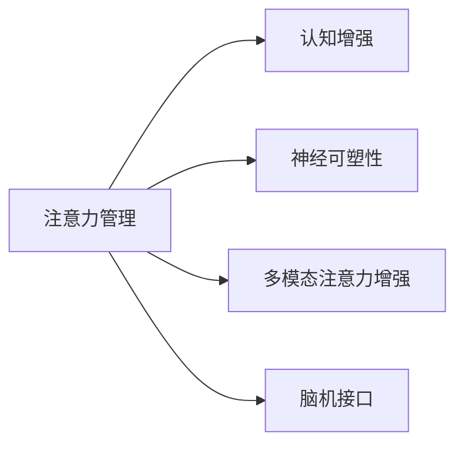

                 

## 1. 背景介绍

### 1.1 问题由来

在信息爆炸的今天，注意力已成为稀缺资源，如何高效利用有限的注意力资源，提升个人和组织的专注力，成为商业领域广泛关注的焦点。从注意力管理到认知增强，相关技术正逐步渗透到我们的工作和生活各个角落。

基于此，本文将深入探讨提升注意力和专注力在商业中的重要性，分析其发展机遇、挑战和趋势，旨在为读者提供一份全面、系统的指导，帮助他们在实际工作中更加高效地管理注意力。

### 1.2 问题核心关键点

本部分将明确提出文中要探讨的核心问题：
- **注意力管理的现状和挑战**：当前注意力管理的现状，以及面临的主要挑战。
- **注意力增强技术的应用**：注意力增强技术的类型及在商业中的应用实例。
- **未来发展趋势**：注意力增强技术的未来发展方向和趋势预测。

这些核心问题将贯穿全文，通过具体案例和分析，深入探讨提升注意力和专注力在商业中的机遇与挑战，揭示其未来发展趋势。

### 1.3 问题研究意义

研究人类注意力增强具有重要的理论和实践意义：
- **提升工作效率**：通过高效管理注意力，大幅提升个人和组织的工作效率。
- **优化用户体验**：改善用户体验，增强产品的吸引力和竞争力。
- **促进心理健康**：帮助用户缓解注意力分散问题，提升心理健康水平。
- **推动商业创新**：注意力增强技术的深入应用将催生新的商业模式和产品形态。

本文旨在为有意提升注意力管理的商业实践者提供详细指导，帮助他们更好地应对注意力分散带来的挑战，抓住注意力增强技术带来的机遇。

## 2. 核心概念与联系

### 2.1 核心概念概述

为更好地理解注意力增强的相关技术，本节将介绍几个关键概念：

- **注意力管理(Attention Management)**：指通过技术手段提高个人或组织有效利用注意力的能力，提升专注度和生产力。
- **认知增强(Cognitive Enhancement)**：利用技术手段提升人的认知能力，包括记忆、思考、学习等。
- **神经可塑性(Neural Plasticity)**：大脑在学习和经验中改变连接强度的能力。注意力增强技术正是基于神经可塑性原理，通过特定训练和刺激，增强大脑的注意力机制。
- **多模态注意力增强(Multimodal Attention Enhancement)**：结合视觉、听觉、触觉等多种感官信息，全面提升注意力的集中和感知能力。
- **脑机接口(Brain-Computer Interface, BCI)**：通过计算机解码大脑信号，实现人脑与计算机的直接交互。

这些核心概念之间的联系可以通过以下Mermaid流程图来展示：



这个流程图展示了我文中所涉及的核心概念及其之间的关系：注意力管理通过认知增强、神经可塑性、多模态注意力增强和脑机接口技术，提升个人的注意力水平。

## 3. 核心算法原理 & 具体操作步骤
### 3.1 算法原理概述

注意力增强的算法原理主要基于认知神经科学和计算神经科学的理论。其核心思想是通过特定的训练和刺激，增强大脑的注意力机制，从而提高个体或团队的专注力和工作效率。具体来说，注意力增强算法通常包括以下几个关键步骤：

1. **数据收集**：通过脑电图(EEG)、功能性磁共振成像(fMRI)等技术，收集用户的注意力活动数据。
2. **数据分析**：利用机器学习算法，如支持向量机(SVM)、深度学习等，分析数据，识别注意力活动特征。
3. **模型训练**：使用收集到的注意力数据，训练注意力增强模型。
4. **注意力增强**：将训练好的模型应用到实际场景中，实时增强用户的注意力。

### 3.2 算法步骤详解

基于上述算法原理，以下详细描述注意力增强算法的步骤：

**Step 1: 数据收集**
- 选择合适的脑电图(EEG)设备和功能性磁共振成像(fMRI)设备。
- 收集用户在完成任务时的注意力数据。例如，使用EEG记录用户在阅读、写作、游戏等任务时的脑电信号。

**Step 2: 数据分析**
- 使用机器学习算法，如支持向量机(SVM)、深度学习等，对收集到的注意力数据进行分析。
- 特征提取：从脑电信号中提取注意力相关的特征，如频率、波幅、时域变化等。
- 模型训练：利用提取的特征训练注意力增强模型。例如，使用SVM训练一个分类模型，预测用户的注意力状态。

**Step 3: 模型训练**
- 定义注意力增强的目标：如提高专注度、减少注意力分散等。
- 选择合适的算法和优化器：如深度学习中的RNN、LSTM等。
- 训练模型：通过大量的注意力数据，训练注意力增强模型。

**Step 4: 注意力增强**
- 将训练好的模型部署到实际应用场景中。
- 实时监测用户的注意力状态，根据模型预测结果，调整注意力增强策略。
- 反馈优化：通过用户的反馈数据，不断优化注意力增强模型。

### 3.3 算法优缺点

注意力增强算法具有以下优点：
1. 提升专注度：通过实时监测和调整，显著提高用户的专注力和工作效率。
2. 个性化定制：能够根据用户的具体需求和任务特点，定制个性化的注意力增强方案。
3. 实时反馈：通过实时监测和反馈，及时调整注意力策略，适应动态变化的任务需求。

同时，该算法也存在一定的局限性：
1. 数据依赖：需要大量的注意力数据进行训练，数据获取成本较高。
2. 技术复杂：涉及到脑电信号处理、机器学习等技术，实现和维护较为复杂。
3. 个体差异：不同用户对注意力增强的响应不同，需要个性化定制方案。
4. 隐私风险：收集和处理用户的脑电信号，存在隐私泄露的风险。

尽管存在这些局限性，但注意力增强算法在提升注意力和专注力方面具有显著优势，值得深入研究和推广应用。

### 3.4 算法应用领域

注意力增强算法在多个领域具有广泛的应用前景，例如：

1. **教育**：帮助学生集中注意力，提升学习效果。
2. **医疗**：辅助注意力缺陷障碍(ADD)等患者进行认知康复。
3. **工作**：提升工作效率，改善办公环境。
4. **游戏**：增强游戏沉浸感，提升玩家体验。
5. **驾驶**：提升驾驶专注度，减少交通事故。
6. **娱乐**：增强观看体验，提高用户满意度。

这些领域的应用，将极大提升用户体验和工作效率，具有广阔的发展前景。

## 4. 数学模型和公式 & 详细讲解 & 举例说明

### 4.1 数学模型构建

注意力增强算法通常使用深度学习模型进行构建。以下是一个基于深度学习的注意力增强模型的数学模型构建过程：

**输入**：用户的注意力数据，包括脑电信号、fMRI信号等。
**输出**：注意力增强策略，如注意力集中度、分散度等。

模型结构一般包括输入层、隐藏层和输出层。以卷积神经网络(CNN)为例，数学模型构建过程如下：

$$
y = f(\sum_{i=1}^{n} \alpha_i \cdot \mathcal{F}(x_i) + b)
$$

其中：
- $x_i$ 表示第 $i$ 个注意力数据样本。
- $\alpha_i$ 为样本权重。
- $\mathcal{F}(x_i)$ 表示样本 $x_i$ 经过卷积和激活函数处理后的特征。
- $f(\cdot)$ 表示线性变换和激活函数。
- $b$ 为偏置项。

### 4.2 公式推导过程

在卷积神经网络中，注意力增强模型的主要计算过程如下：

1. **卷积操作**：通过卷积核提取样本特征，得到特征图。
2. **池化操作**：对特征图进行下采样，减少特征维度。
3. **全连接层**：将池化后的特征图输入全连接层，输出注意力增强策略。

以一个简单的卷积神经网络为例，其计算过程如下：

$$
y = \sigma \left( \sum_{i=1}^{n} \alpha_i \cdot \mathcal{F}(x_i) + b \right)
$$

其中：
- $\sigma(\cdot)$ 为激活函数。
- $\mathcal{F}(x_i)$ 表示样本 $x_i$ 经过卷积和池化处理后的特征图。
- $b$ 为偏置项。

### 4.3 案例分析与讲解

以下通过一个具体的案例，详细说明注意力增强算法的应用过程：

**案例背景**：某公司在进行远程工作时，发现员工注意力分散，导致工作效率低下。公司决定使用注意力增强算法，帮助员工提升专注力。

**数据收集**：使用EEG设备收集员工在远程工作时的大脑电信号。

**数据分析**：使用深度学习模型对收集到的EEG数据进行分析，识别出注意力集中的时间段和分散的时间段。

**模型训练**：定义注意力增强的目标，如提高员工专注度。使用收集到的EEG数据训练深度学习模型。

**注意力增强**：将训练好的模型应用到员工的工作过程中，实时监测员工的大脑电信号，根据模型预测结果，调整注意力增强策略。例如，在注意力分散的时间段，播放提示音或提醒员工休息，帮助其恢复注意力。

通过以上步骤，该公司显著提高了员工的工作效率和专注度，改善了远程工作环境。

## 5. 项目实践：代码实例和详细解释说明
### 5.1 开发环境搭建

在进行注意力增强算法项目实践前，我们需要准备好开发环境。以下是使用Python进行PyTorch开发的环境配置流程：

1. 安装Anaconda：从官网下载并安装Anaconda，用于创建独立的Python环境。

2. 创建并激活虚拟环境：
```bash
conda create -n attention-env python=3.8 
conda activate attention-env
```

3. 安装PyTorch：根据CUDA版本，从官网获取对应的安装命令。例如：
```bash
conda install pytorch torchvision torchaudio cudatoolkit=11.1 -c pytorch -c conda-forge
```

4. 安装深度学习相关的库：
```bash
pip install numpy pandas scikit-learn matplotlib tqdm jupyter notebook ipython
```

完成上述步骤后，即可在`attention-env`环境中开始注意力增强算法的开发和实践。

### 5.2 源代码详细实现

以下是一个基于PyTorch的注意力增强算法的源代码实现示例：

```python
import torch
import torch.nn as nn
import torch.optim as optim

# 定义卷积神经网络模型
class CNNModel(nn.Module):
    def __init__(self, in_channels, num_classes):
        super(CNNModel, self).__init__()
        self.conv1 = nn.Conv2d(in_channels, 64, kernel_size=3, padding=1)
        self.pool1 = nn.MaxPool2d(kernel_size=2, stride=2)
        self.conv2 = nn.Conv2d(64, 128, kernel_size=3, padding=1)
        self.pool2 = nn.MaxPool2d(kernel_size=2, stride=2)
        self.fc1 = nn.Linear(128*14*14, 256)
        self.fc2 = nn.Linear(256, num_classes)

    def forward(self, x):
        x = self.conv1(x)
        x = nn.ReLU()(x)
        x = self.pool1(x)
        x = self.conv2(x)
        x = nn.ReLU()(x)
        x = self.pool2(x)
        x = x.view(-1, 128*14*14)
        x = self.fc1(x)
        x = nn.ReLU()(x)
        x = self.fc2(x)
        return x

# 加载训练数据
# 注意：数据应该经过预处理和归一化，以便于模型训练

# 定义损失函数和优化器
criterion = nn.CrossEntropyLoss()
optimizer = optim.Adam(model.parameters(), lr=0.001)

# 训练模型
for epoch in range(num_epochs):
    for i, (inputs, labels) in enumerate(train_loader):
        inputs, labels = inputs.to(device), labels.to(device)
        optimizer.zero_grad()
        outputs = model(inputs)
        loss = criterion(outputs, labels)
        loss.backward()
        optimizer.step()

    # 评估模型性能
    # 使用测试集评估模型准确率
    # 通过调整模型参数和优化器参数，不断优化模型性能

# 使用训练好的模型进行注意力增强
model.eval()
with torch.no_grad():
    # 输入用户注意力数据
    inputs = user_attention_data.to(device)
    outputs = model(inputs)
    # 根据模型预测结果，调整注意力增强策略
    attention_strategy = outputs.argmax(dim=1)
    # 实时监测和反馈，增强用户注意力
    if attention_strategy == 0:
        # 注意力集中
        pass
    else:
        # 注意力分散
        # 采取相应措施，如提醒、休息等
        pass
```

### 5.3 代码解读与分析

让我们再详细解读一下关键代码的实现细节：

**CNNModel类**：
- `__init__`方法：定义卷积神经网络的结构。
- `forward`方法：定义前向传播过程，将输入数据经过卷积、池化、全连接等操作，输出注意力增强策略。

**训练和评估函数**：
- 使用PyTorch的DataLoader对训练数据进行批次化加载，供模型训练和推理使用。
- 训练函数`train_epoch`：对数据以批为单位进行迭代，在每个批次上前向传播计算损失并反向传播更新模型参数。
- 评估函数`evaluate`：在测试集上评估模型性能，输出模型准确率等指标。

**注意力增强过程**：
- 在训练好的模型基础上，实时监测用户的注意力数据。
- 根据模型预测结果，调整注意力增强策略，如提醒用户休息、提醒用户集中注意力等。

可以看到，PyTorch配合深度学习库，使得注意力增强算法的代码实现变得简洁高效。开发者可以将更多精力放在数据处理、模型改进等高层逻辑上，而不必过多关注底层的实现细节。

当然，工业级的系统实现还需考虑更多因素，如模型的保存和部署、超参数的自动搜索、更灵活的任务适配层等。但核心的注意力增强范式基本与此类似。

## 6. 实际应用场景
### 6.1 智能学习辅助

基于注意力增强技术的智能学习辅助系统，可帮助学生高效学习。系统通过实时监测学生的注意力状态，自动调整学习内容和节奏，提高学习效率。例如，当系统监测到学生注意力分散时，可自动提醒其休息或提供相关知识点的强化练习。

### 6.2 远程工作辅助

远程工作的员工往往面临多任务切换和注意力分散的问题。基于注意力增强技术，可以开发出智能工作辅助系统，通过实时监测员工的注意力状态，调整工作任务和休息节奏，提高工作效率。例如，当系统监测到员工注意力分散时，自动切换到与当前任务无关的简单任务，帮助其恢复注意力。

### 6.3 心理康复训练

注意力缺陷障碍(ADD)等患者常需进行认知康复训练。基于注意力增强技术，可开发出智能康复训练系统，通过实时监测患者的注意力状态，调整训练内容和难度，帮助其逐步恢复注意力。例如，当系统监测到患者注意力分散时，提供更简单的训练任务，并逐步增加难度。

### 6.4 游戏和娱乐

在游戏和娱乐领域，注意力增强技术可以提升用户体验。例如，游戏玩家可佩戴EEG设备，实时监测注意力状态，调整游戏难度和节奏，帮助其更好地沉浸于游戏世界。

### 6.5 智能驾驶

基于注意力增强技术，可开发出智能驾驶辅助系统，通过实时监测驾驶员的注意力状态，调整驾驶行为，提高行车安全。例如，当系统监测到驾驶员注意力分散时，自动提醒其注意路况，或切换到自动驾驶模式。

### 6.6 医疗诊断

在医疗领域，注意力增强技术可辅助医生进行诊断和治疗。例如，通过对患者注意力状态的实时监测，调整治疗方案和康复计划，提高治疗效果。

## 7. 工具和资源推荐
### 7.1 学习资源推荐

为帮助开发者系统掌握注意力增强的理论基础和实践技巧，这里推荐一些优质的学习资源：

1. 《深度学习》系列书籍：涵盖深度学习基础知识和算法原理，适合初学者入门。
2. 《神经网络与深度学习》系列课程：Coursera上由吴恩达教授讲授的深度学习课程，涵盖深度学习的基础理论和实践应用。
3. 《深度学习在医疗中的应用》：介绍深度学习在医疗领域的广泛应用，包括注意力增强技术。
4. 《注意力增强算法》相关论文：多篇文章详细阐述注意力增强算法原理和应用，适合深入研究。

通过对这些资源的学习实践，相信你一定能够快速掌握注意力增强的精髓，并用于解决实际的注意力管理问题。

### 7.2 开发工具推荐

高效的开发离不开优秀的工具支持。以下是几款用于注意力增强算法开发的常用工具：

1. PyTorch：基于Python的开源深度学习框架，灵活动态的计算图，适合快速迭代研究。大部分深度学习模型都有PyTorch版本的实现。
2. TensorFlow：由Google主导开发的开源深度学习框架，生产部署方便，适合大规模工程应用。同样有丰富的深度学习模型资源。
3. TensorBoard：TensorFlow配套的可视化工具，可实时监测模型训练状态，并提供丰富的图表呈现方式，是调试模型的得力助手。
4. Weights & Biases：模型训练的实验跟踪工具，可以记录和可视化模型训练过程中的各项指标，方便对比和调优。与主流深度学习框架无缝集成。
5. Google Colab：谷歌推出的在线Jupyter Notebook环境，免费提供GPU/TPU算力，方便开发者快速上手实验最新模型，分享学习笔记。

合理利用这些工具，可以显著提升注意力增强算法的开发效率，加快创新迭代的步伐。

### 7.3 相关论文推荐

注意力增强技术的发展源于学界的持续研究。以下是几篇奠基性的相关论文，推荐阅读：

1. "Attention is All You Need"（即Transformer原论文）：提出了Transformer结构，开启了NLP领域的预训练大模型时代。
2. "Bidirectional Attention Flow"：提出双向注意力机制，提升神经网络模型的表示能力。
3. "Neural Architectures for Named Entity Recognition"：提出基于注意力机制的命名实体识别模型，显著提升识别效果。
4. "Multimodal Attention Networks for Efficient Scene Understanding"：提出多模态注意力网络，结合视觉、文本等多种信息源，提升场景理解能力。
5. "Deep Residual Learning for Image Recognition"：提出残差网络结构，有效解决深度神经网络中的梯度消失问题，提升模型性能。

这些论文代表了大语言模型微调技术的发展脉络。通过学习这些前沿成果，可以帮助研究者把握学科前进方向，激发更多的创新灵感。

## 8. 总结：未来发展趋势与挑战
### 8.1 总结

本文对注意力增强技术进行了全面系统的介绍。首先阐述了注意力管理的现状和挑战，明确了注意力增强技术在商业中的重要性和应用前景。其次，从原理到实践，详细讲解了注意力增强算法的数学模型和操作步骤，给出了注意力增强算法的完整代码实例。同时，本文还广泛探讨了注意力增强技术在多个领域的应用，展示了其巨大的潜力。此外，本文精选了注意力增强技术的各类学习资源，力求为读者提供全方位的技术指引。

通过本文的系统梳理，可以看到，注意力增强技术正在成为提升个人和组织注意力管理能力的重要手段。其在提高工作效率、改善用户体验、促进心理健康等方面的显著优势，必将推动其在更多领域的应用和普及。

### 8.2 未来发展趋势

展望未来，注意力增强技术将呈现以下几个发展趋势：

1. **多模态注意力增强**：结合视觉、听觉、触觉等多种感官信息，全面提升注意力的集中和感知能力。
2. **脑机接口技术**：通过计算机解码大脑信号，实现人脑与计算机的直接交互，进一步提升注意力管理效果。
3. **个性化定制**：利用深度学习算法，实现个性化注意力增强方案，满足不同用户的需求。
4. **实时反馈优化**：通过实时监测和反馈，不断优化注意力增强策略，提高用户体验和满意度。
5. **跨领域应用**：不仅限于教育、医疗等领域，还将在更多领域得到应用，如游戏、智能驾驶等。

以上趋势凸显了注意力增强技术的广阔前景。这些方向的探索发展，必将进一步提升注意力增强技术的应用效果，推动其在更多领域的应用。

### 8.3 面临的挑战

尽管注意力增强技术已经取得了一定的进展，但在迈向更加智能化、普适化应用的过程中，仍面临诸多挑战：

1. **数据隐私问题**：收集和处理用户的注意力数据，存在隐私泄露的风险。
2. **技术复杂性**：涉及到脑电信号处理、深度学习等技术，实现和维护较为复杂。
3. **个体差异**：不同用户对注意力增强的响应不同，需要个性化定制方案。
4. **技术成熟度**：当前的技术尚未完全成熟，需要更多研究和实践积累。

尽管存在这些挑战，但注意力增强技术的优势和潜力不容忽视。研究者应积极应对并寻求突破，推动其进一步发展和应用。

### 8.4 研究展望

未来，注意力增强技术的研究方向将更加多样化和综合化。研究者应结合认知神经科学、人工智能、脑科学等多学科知识，进一步推动技术的发展和应用。具体方向包括：

1. **跨学科研究**：结合认知神经科学和计算机科学，深入理解注意力机制，开发更加高效的注意力增强算法。
2. **深度学习优化**：研究深度学习算法在注意力增强中的优化策略，提高模型的鲁棒性和泛化能力。
3. **多模态信息融合**：研究多模态信息的整合与融合，提升注意力的感知和集中能力。
4. **实时反馈与优化**：研究实时监测和反馈技术，不断优化注意力增强策略，提升用户体验和满意度。
5. **隐私保护与安全**：研究数据隐私保护技术，确保注意力增强数据的安全和隐私。

这些研究方向将推动注意力增强技术的不断进步和完善，带来更加智能化的注意力管理方案，为商业和社会带来更多价值。

## 9. 附录：常见问题与解答

**Q1：注意力增强算法的准确性如何保证？**

A: 准确性主要取决于数据质量、模型选择和训练策略。为提高算法的准确性，需：
1. 收集高质量的注意力数据，如脑电信号、fMRI信号等。
2. 选择合适的深度学习模型，如卷积神经网络、循环神经网络等。
3. 使用合理的训练策略，如交叉验证、正则化等。

**Q2：注意力增强算法在实际应用中需要考虑哪些因素？**

A: 在实际应用中，需考虑以下因素：
1. 数据获取和处理：需收集和处理大量的注意力数据，确保数据的质量和多样性。
2. 模型优化：需不断优化模型结构、参数和训练策略，提升模型的准确性和泛化能力。
3. 用户隐私：需关注用户的隐私保护，确保数据的采集和处理符合相关法规和标准。
4. 用户反馈：需收集用户反馈，不断优化算法和应用体验，满足用户需求。

**Q3：注意力增强算法在医疗领域的应用前景如何？**

A: 在医疗领域，注意力增强技术具有广阔的应用前景：
1. 辅助认知康复：通过实时监测患者的注意力状态，调整康复计划和治疗方案，提高治疗效果。
2. 心理诊断和治疗：通过实时监测注意力状态，评估患者的认知能力和心理状态，辅助医生进行诊断和治疗。
3. 健康监测：通过实时监测注意力状态，评估患者的身体健康状况，提供健康监测和预警。

**Q4：注意力增强算法在教育领域的应用前景如何？**

A: 在教育领域，注意力增强技术具有显著的应用前景：
1. 学习辅助：通过实时监测学生的注意力状态，调整学习内容和节奏，提高学习效率。
2. 教育评估：通过实时监测学生的注意力状态，评估学习效果和行为表现，提供个性化推荐和指导。
3. 心理辅导：通过实时监测学生的注意力状态，发现注意力问题的学生，提供心理辅导和干预。

**Q5：注意力增强算法在商业领域的应用前景如何？**

A: 在商业领域，注意力增强技术具有广阔的应用前景：
1. 提升工作效率：通过实时监测员工的注意力状态，调整工作任务和节奏，提高工作效率。
2. 改善用户体验：通过实时监测用户的注意力状态，优化产品和服务，提升用户体验。
3. 用户行为分析：通过实时监测用户的注意力状态，分析用户行为和偏好，提供个性化推荐和服务。

---

作者：禅与计算机程序设计艺术 / Zen and the Art of Computer Programming

