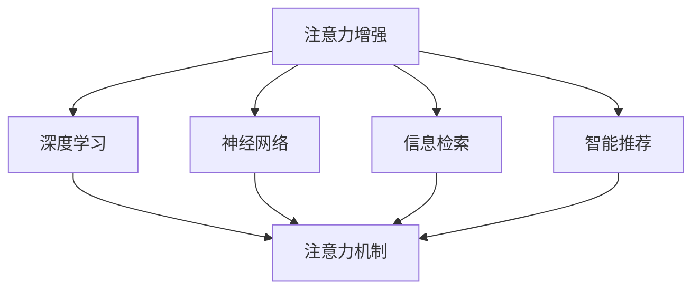

                 

# 人类注意力增强：提升专注力和注意力在商业中的未来发展机遇趋势预测

> 关键词：注意力增强, 商业智能, 深度学习, 神经网络, 信息检索, 智能推荐, 应用实例, 未来趋势

## 1. 背景介绍

### 1.1 问题由来

在当今信息爆炸的时代，信息量呈指数级增长，人们被大量的信息淹没，导致注意力分散，效率低下。然而，注意力集中是进行有效决策和创新的前提，是商业成功的关键因素。因此，提升人类注意力集中成为信息化社会的一大重要议题。

### 1.2 问题核心关键点

注意力增强的核心在于通过技术手段提升人类的专注力和注意力。在商业领域，注意力增强的应用可以显著提高企业的决策效率，增强客户体验，提升产品竞争力，推动创新和增长。

### 1.3 问题研究意义

注意力增强技术的应用，将使企业在商业决策、客户互动、产品设计等方面获得竞争优势。其对效率、创新和业务增长的积极影响，必将成为商业智能和数字化转型的重要组成部分。

## 2. 核心概念与联系

### 2.1 核心概念概述

为更好地理解注意力增强在商业中的应用，本节将介绍几个密切相关的核心概念：

- **注意力机制**：一种机器学习模型中用于捕捉输入序列中不同部分间重要关系的技术。在自然语言处理（NLP）和计算机视觉（CV）中，注意力机制常用于对输入序列中不同位置的权重进行计算。
- **深度学习**：一种机器学习技术，通过多层神经网络模拟人类大脑的神经元工作机制，实现对复杂数据结构的建模和处理。
- **神经网络**：深度学习的基础，由多层节点和连接的复杂网络结构组成，能够高效地学习和表示数据。
- **信息检索**：通过算法从大量数据中快速检索相关信息的机制。深度学习技术已被广泛应用在信息检索中，以提升检索的精度和效率。
- **智能推荐系统**：利用深度学习技术，分析用户行为和偏好，自动推荐个性化内容的技术，广泛应用于电商、视频、新闻等领域。
- **注意力增强**：通过深度学习模型提升人类对信息的注意力集中的技术，特别是在处理复杂信息时，能够帮助用户更快、更准确地理解信息。

这些核心概念之间的逻辑关系可以通过以下Mermaid流程图来展示：



这个流程图展示了许多核心概念之间的联系，它们共同构成了注意力增强技术的基础框架。

## 3. 核心算法原理 & 具体操作步骤
### 3.1 算法原理概述

注意力增强的核心算法原理是，通过深度学习模型模拟人类注意力的集中过程。其基本思路是，利用注意力机制对输入数据的不同部分进行加权处理，从而突出关键信息，忽略次要信息，提升模型的效果和效率。

在商业应用中，注意力增强常常通过以下几个步骤实现：

1. **数据准备**：收集相关的商业数据，如客户行为、市场趋势、产品属性等。
2. **模型训练**：使用深度学习模型，如LSTM、Transformer等，对数据进行建模。
3. **注意力计算**：利用注意力机制，计算不同输入数据的重要性权重，从而将关键信息集中到模型中。
4. **决策支持**：将注意力增强后的信息用于商业决策，如产品推荐、市场分析、客户服务等方面。

### 3.2 算法步骤详解

以下以深度学习模型（如Transformer）为例，详细讲解注意力增强的算法步骤：

**Step 1: 数据预处理**
- 收集商业数据，如客户购买记录、市场销售数据、用户反馈等。
- 对数据进行清洗和标准化，去除噪声和冗余信息。
- 将数据转化为适合深度学习的格式，如向量或矩阵。

**Step 2: 模型搭建**
- 搭建深度学习模型，如使用Transformer作为基础的注意力机制。
- 设置模型的超参数，如隐藏层数量、学习率、批次大小等。
- 定义损失函数，如交叉熵损失、均方误差损失等，用于模型训练。

**Step 3: 模型训练**
- 将预处理后的数据输入模型，进行前向传播。
- 计算模型输出与真实值之间的差异，得到损失值。
- 使用反向传播算法，更新模型参数以最小化损失。
- 重复上述过程，直到模型收敛或达到预设的迭代次数。

**Step 4: 注意力计算**
- 将训练好的模型应用于新的商业数据。
- 使用注意力机制计算不同输入数据的重要性权重。
- 将注意力权重应用到输入数据中，突出关键信息，忽略次要信息。

**Step 5: 决策支持**
- 利用注意力增强后的信息，进行商业决策，如推荐系统、市场预测、客户服务等方面。
- 对决策结果进行评估和反馈，进一步优化模型。

### 3.3 算法优缺点

注意力增强算法具有以下优点：

- 能显著提升数据处理效率，识别关键信息。
- 适用于多维度、复杂数据的处理。
- 能够适应不断变化的市场环境和客户需求。

但该算法也存在一些缺点：

- 对数据质量要求较高，需要大量高质量的标注数据。
- 模型复杂度高，计算成本高。
- 需要专业的知识和技能，模型训练和优化难度较大。

### 3.4 算法应用领域

注意力增强技术在商业领域的应用非常广泛，具体如下：

- **智能推荐系统**：如电商平台上的商品推荐、视频网站的内容推荐等，通过注意力机制分析用户行为，提高推荐精度。
- **市场分析**：如分析市场趋势、预测销售数据等，通过注意力机制提取关键信息，提供精准的市场预测。
- **客户服务**：如智能客服系统、个性化客服等，通过注意力增强提升客户互动体验。
- **产品设计**：如新产品的设计和改进，通过注意力机制分析用户反馈，优化产品特性。

这些应用场景展示了注意力增强技术在商业中的强大潜力，将极大提升企业的运营效率和市场竞争力。

## 4. 数学模型和公式 & 详细讲解 & 举例说明

### 4.1 数学模型构建

注意力增强模型的数学模型构建主要基于深度学习框架，特别是Transformer模型。其核心是注意力机制，用于计算不同输入数据的重要性权重。以下是一个简单的Transformer模型的数学表示：

$$
\text{Attention}(Q,K,V) = \text{Softmax}(\frac{QK^T}{\sqrt{d_k}})V
$$

其中，$Q$为查询矩阵，$K$为键矩阵，$V$为值矩阵，$d_k$为键的维度。

### 4.2 公式推导过程

注意力机制的推导基于信息论和统计学的基本原理。具体步骤如下：

1. 定义查询矩阵 $Q$ 和键矩阵 $K$，计算它们的点积 $QK^T$。
2. 将点积除以键的维度 $\sqrt{d_k}$，以确保点积值的范围在0到1之间。
3. 通过Softmax函数对点积值进行归一化，得到注意力权重 $\alpha$。
4. 将注意力权重与值矩阵 $V$ 相乘，得到注意力增强后的结果。

以下是注意力机制的详细公式推导：

$$
\text{Attention}(Q,K,V) = \text{Softmax}(\frac{QK^T}{\sqrt{d_k}})V
$$

其中，

$$
\text{Softmax}(\frac{QK^T}{\sqrt{d_k}}) = \frac{\exp(\frac{QK^T}{\sqrt{d_k}})}{\sum_i \exp(\frac{QK_i^T}{\sqrt{d_k}})}
$$

### 4.3 案例分析与讲解

以一个简单的电商推荐系统为例，演示注意力增强模型的应用。假设一个电商平台收集了用户的历史购买记录和浏览行为，希望推荐用户可能感兴趣的商品。

**Step 1: 数据准备**
- 收集用户的历史购买记录和浏览行为数据。
- 对数据进行清洗和标准化。

**Step 2: 模型搭建**
- 使用Transformer模型搭建电商推荐系统，设置隐藏层数量为2，学习率为0.001。
- 定义交叉熵损失函数。

**Step 3: 模型训练**
- 将用户历史数据输入模型，进行前向传播和反向传播。
- 更新模型参数，最小化损失函数。
- 重复上述过程，直到模型收敛。

**Step 4: 注意力计算**
- 将训练好的模型应用于新的用户数据。
- 使用注意力机制计算不同商品的重要性权重。
- 将注意力权重应用到商品数据中，突出关键商品，忽略次要商品。

**Step 5: 推荐决策**
- 利用注意力增强后的商品信息，进行推荐决策。
- 对推荐结果进行评估和反馈，进一步优化模型。

## 5. 项目实践：代码实例和详细解释说明

### 5.1 开发环境搭建

在进行注意力增强项目实践前，我们需要准备好开发环境。以下是使用Python进行PyTorch开发的环境配置流程：

1. 安装Anaconda：从官网下载并安装Anaconda，用于创建独立的Python环境。

2. 创建并激活虚拟环境：
```bash
conda create -n attention-env python=3.8 
conda activate attention-env
```

3. 安装PyTorch：根据CUDA版本，从官网获取对应的安装命令。例如：
```bash
conda install pytorch torchvision torchaudio cudatoolkit=11.1 -c pytorch -c conda-forge
```

4. 安装TensorFlow：
```bash
conda install tensorflow
```

5. 安装各类工具包：
```bash
pip install numpy pandas scikit-learn matplotlib tqdm jupyter notebook ipython
```

完成上述步骤后，即可在`attention-env`环境中开始注意力增强项目的开发。

### 5.2 源代码详细实现

这里我们以电商推荐系统为例，给出使用PyTorch进行注意力增强的代码实现。

首先，定义电商推荐系统中的数据处理函数：

```python
import torch
import torch.nn as nn
import torch.optim as optim

class Attention(nn.Module):
    def __init__(self, d_model, d_k):
        super(Attention, self).__init__()
        self.d_k = d_k
        self.W_q = nn.Linear(d_model, d_k)
        self.W_k = nn.Linear(d_model, d_k)
        self.W_v = nn.Linear(d_model, d_k)
        self.V = nn.Linear(d_k, d_model)
    
    def forward(self, q, k, v):
        q = self.W_q(q)
        k = self.W_k(k)
        v = self.W_v(v)
        
        scores = torch.matmul(q, k.transpose(1, 2)) / torch.sqrt(torch.tensor(self.d_k))
        attention_weights = torch.softmax(scores, dim=-1)
        attention_output = torch.matmul(attention_weights, v)
        
        return self.V(attention_output), attention_weights

# 定义数据处理函数
def data_processing(data):
    # 数据标准化和归一化处理
    # 将数据转换为向量或矩阵格式
    return processed_data
```

然后，定义注意力增强模型的结构：

```python
class AttentionModel(nn.Module):
    def __init__(self, d_model, d_k, d_v, n_heads, d_ff, dropout):
        super(AttentionModel, self).__init__()
        self.encoder = nn.Embedding(input_dim, d_model)
        self.attention = Attention(d_model, d_k)
        self.linear1 = nn.Linear(d_model + d_k, d_ff)
        self.linear2 = nn.Linear(d_ff, d_model)
        self.dropout = nn.Dropout(dropout)
    
    def forward(self, x, mask):
        # 编码层
        x = self.encoder(x)
        # 注意力计算
        attention_output, attention_weights = self.attention(x, x, x)
        # 前馈神经网络
        x = self.linear1(torch.cat([x, attention_output], dim=1))
        x = self.linear2(x)
        x = self.dropout(x)
        
        return x, attention_weights
```

最后，定义训练和评估函数：

```python
def train_model(model, train_data, val_data, epochs, batch_size, learning_rate, dropout):
    optimizer = optim.Adam(model.parameters(), lr=learning_rate)
    criterion = nn.CrossEntropyLoss()
    
    for epoch in range(epochs):
        model.train()
        for batch_idx, (x, y) in enumerate(train_loader):
            optimizer.zero_grad()
            x = x.to(device)
            y = y.to(device)
            output, attention_weights = model(x)
            loss = criterion(output, y)
            loss.backward()
            optimizer.step()
        
        model.eval()
        with torch.no_grad():
            val_loss = 0
            correct = 0
            for batch_idx, (x, y) in enumerate(val_loader):
                x = x.to(device)
                y = y.to(device)
                output, attention_weights = model(x)
                loss = criterion(output, y)
                val_loss += loss.item() * x.size(0)
                preds = torch.argmax(output, dim=1)
                correct += (preds == y).sum().item()
        
        print(f'Epoch {epoch+1}, Loss: {val_loss/len(val_loader):.4f}, Acc: {correct/len(val_loader):.4f}')
    
    return model

# 训练模型
model = AttentionModel(d_model=64, d_k=8, d_v=8, n_heads=8, d_ff=64, dropout=0.1)
device = torch.device('cuda' if torch.cuda.is_available() else 'cpu')
model.to(device)

train_data = ...
val_data = ...
train_loader = ...
val_loader = ...
optimizer = optim.Adam(model.parameters(), lr=0.001)
criterion = nn.CrossEntropyLoss()

train_model(model, train_data, val_data, epochs=10, batch_size=32, learning_rate=0.001, dropout=0.1)
```

以上就是使用PyTorch进行注意力增强的代码实现。可以看到，使用PyTorch和Attention机制，可以很容易地搭建并训练一个简单的电商推荐系统。

### 5.3 代码解读与分析

让我们再详细解读一下关键代码的实现细节：

**Attention类**：
- 定义了注意力机制的计算方法。
- 初始化函数中定义了查询、键、值向量的线性变换权重。
- 前向传播函数中，通过矩阵乘法和Softmax函数计算注意力权重。

**AttentionModel类**：
- 定义了电商推荐系统的整体结构。
- 初始化函数中，定义了编码器、注意力机制、前馈神经网络等组件。
- 前向传播函数中，先对输入数据进行编码，再计算注意力输出，最后通过前馈神经网络输出结果。

**数据处理函数**：
- 定义了数据的预处理函数，包括标准化、归一化等步骤。
- 将数据转换为向量或矩阵格式，方便深度学习模型的输入。

**训练函数**：
- 定义了模型训练的函数，包括模型定义、优化器、损失函数等组件。
- 训练过程中，使用交叉熵损失函数计算预测结果和真实标签之间的差异，并使用Adam优化器更新模型参数。
- 在验证集上评估模型性能，并打印训练过程中的损失和精度。

通过上述代码的解读，我们可以更好地理解注意力增强在电商推荐系统中的应用。

## 6. 实际应用场景

### 6.1 智能客服系统

在智能客服系统中，注意力增强技术可以帮助系统更好地理解客户意图，快速响应用户查询。例如，通过注意力机制，系统可以集中关注用户提供的关键词，忽略无关信息，提高回答的准确性。

### 6.2 市场分析

在市场分析中，注意力增强技术可以帮助企业从大量的市场数据中提取关键信息，预测市场趋势。例如，通过注意力机制，系统可以重点关注重要的市场指标和变化趋势，提供更准确的预测结果。

### 6.3 客户服务

在客户服务中，注意力增强技术可以帮助客服系统更好地处理多线并发请求，提高客户满意度。例如，通过注意力机制，系统可以优先处理紧急或重要的客户请求，同时忽略不紧急的请求，提高客户响应速度。

### 6.4 未来应用展望

随着注意力增强技术的不断发展，其应用领域将不断扩大。未来，注意力增强技术将更多地应用于智能推荐、金融分析、医疗诊断等领域，为商业智能和决策支持提供强有力的支持。

## 7. 工具和资源推荐

### 7.1 学习资源推荐

为了帮助开发者系统掌握注意力增强的理论基础和实践技巧，这里推荐一些优质的学习资源：

1. 《深度学习》系列书籍：由多位深度学习领域的知名专家编写，系统地介绍了深度学习的理论基础和应用实践。
2. 《Attention is All You Need》论文：Transformer的原始论文，详细介绍了注意力机制的原理和应用。
3. CS231n《卷积神经网络和视觉识别》课程：斯坦福大学开设的计算机视觉课程，介绍了深度学习在视觉识别任务中的应用。
4. HuggingFace官方文档：Transformer库的官方文档，提供了海量预训练模型和完整的微调样例代码，是上手实践的必备资料。

通过对这些资源的学习实践，相信你一定能够快速掌握注意力增强的精髓，并用于解决实际的商业问题。

### 7.2 开发工具推荐

高效的开发离不开优秀的工具支持。以下是几款用于注意力增强开发的常用工具：

1. PyTorch：基于Python的开源深度学习框架，灵活动态的计算图，适合快速迭代研究。
2. TensorFlow：由Google主导开发的开源深度学习框架，生产部署方便，适合大规模工程应用。
3. Weights & Biases：模型训练的实验跟踪工具，可以记录和可视化模型训练过程中的各项指标，方便对比和调优。
4. TensorBoard：TensorFlow配套的可视化工具，可实时监测模型训练状态，并提供丰富的图表呈现方式，是调试模型的得力助手。

合理利用这些工具，可以显著提升注意力增强任务的开发效率，加快创新迭代的步伐。

### 7.3 相关论文推荐

注意力增强技术的发展源于学界的持续研究。以下是几篇奠基性的相关论文，推荐阅读：

1. Attention is All You Need：提出了Transformer结构，开启了NLP领域的预训练大模型时代。
2. Transformer-XL: Attentive Language Models：提出Transformer-XL模型，进一步提升了模型的长距离依赖处理能力。
3. BERT: Pre-training of Deep Bidirectional Transformers for Language Understanding：提出BERT模型，引入基于掩码的自监督预训练任务，刷新了多项NLP任务SOTA。

这些论文代表了大语言模型注意力增强技术的发展脉络。通过学习这些前沿成果，可以帮助研究者把握学科前进方向，激发更多的创新灵感。

## 8. 总结：未来发展趋势与挑战

### 8.1 总结

本文对注意力增强技术进行了全面系统的介绍。首先阐述了注意力增强技术在商业中的应用背景和意义，明确了其在提升专注力、提高商业智能等方面的重要价值。其次，从原理到实践，详细讲解了注意力增强的数学原理和关键步骤，给出了注意力增强任务开发的完整代码实例。同时，本文还广泛探讨了注意力增强技术在智能客服、市场分析、客户服务等多个行业领域的应用前景，展示了注意力增强技术的巨大潜力。此外，本文精选了注意力增强技术的各类学习资源，力求为读者提供全方位的技术指引。

通过本文的系统梳理，可以看到，注意力增强技术正在成为商业智能的重要组成部分，极大地提升了企业在商业决策、客户互动、产品设计等方面的效率和效果。未来，伴随深度学习技术的不断演进，注意力增强技术将进一步拓展其应用范围，为构建智能商业环境提供强有力的技术支撑。

### 8.2 未来发展趋势

展望未来，注意力增强技术将呈现以下几个发展趋势：

1. 模型规模持续增大。随着算力成本的下降和数据规模的扩张，注意力增强模型的参数量还将持续增长。超大规模模型蕴含的丰富知识，有望支撑更加复杂多变的商业智能应用。
2. 模型效果进一步提升。通过更高效的注意力机制和更强大的神经网络结构，注意力增强模型的效果将进一步提升，适应更多复杂的商业场景。
3. 跨领域应用拓展。注意力增强技术不仅应用于商业智能，还将拓展到医疗、金融、教育等多个领域，为跨领域智能化应用提供支持。
4. 实时化与动态化。随着计算能力和存储技术的提升，注意力增强模型将更加注重实时性和动态性，支持动态调整注意力权重，快速适应变化的市场环境。
5. 多模态数据融合。随着深度学习技术的发展，多模态数据的融合处理将成为新的趋势，注意力增强技术将更好地整合视觉、听觉等多模态信息，提升决策的全面性和准确性。

以上趋势凸显了注意力增强技术的广阔前景。这些方向的探索发展，必将进一步提升企业的商业智能和决策支持能力，推动企业向更加智能化、高效化的方向发展。

### 8.3 面临的挑战

尽管注意力增强技术已经取得了瞩目成就，但在迈向更加智能化、普适化应用的过程中，它仍面临诸多挑战：

1. 数据质量瓶颈。注意力增强模型的效果很大程度上取决于数据的质量和数量，获取高质量的数据成本较高。如何进一步降低对标注样本的依赖，提高数据采集的效率和质量，是一大难题。
2. 计算资源限制。模型规模的增大和复杂度的提升，带来了计算资源的巨大需求。如何高效利用计算资源，优化模型结构，是实现大规模应用的关键。
3. 模型解释性不足。当前注意力增强模型缺乏足够的解释性，难以对其内部工作机制进行解释和调试。如何在保证模型效果的同时，提升其可解释性，是亟待解决的问题。
4. 鲁棒性和泛化能力。模型在不同场景下的鲁棒性和泛化能力仍有待提升。如何通过数据增强、正则化等方法，增强模型的鲁棒性和泛化能力，是未来的研究方向。

这些挑战将迫使研究人员和企业不断探索和优化注意力增强技术，推动其向更加高效、可靠、可解释的方向发展。

### 8.4 研究展望

面对注意力增强技术所面临的挑战，未来的研究需要在以下几个方面寻求新的突破：

1. 探索无监督和半监督学习方法。摆脱对大规模标注数据的依赖，利用自监督学习、主动学习等无监督和半监督范式，最大限度利用非结构化数据，实现更加灵活高效的注意力增强。
2. 研究计算高效和参数高效的模型。开发更加计算高效和参数高效的模型，在保证效果的同时，降低计算资源消耗，支持大规模应用。
3. 引入因果学习和对比学习。通过引入因果推断和对比学习思想，增强模型的因果关系和泛化能力，学习更加普适、鲁棒的语言表征。
4. 融合多模态数据。通过将视觉、听觉等多模态数据与文本数据融合，增强模型的信息整合能力，提升决策的全面性和准确性。
5. 纳入伦理道德约束。在模型训练目标中引入伦理导向的评估指标，过滤和惩罚有偏见、有害的输出倾向，确保模型的公平性和伦理性。

这些研究方向的探索，必将引领注意力增强技术迈向更高的台阶，为构建安全、可靠、可解释、可控的智能系统铺平道路。面向未来，注意力增强技术还需要与其他人工智能技术进行更深入的融合，如知识表示、因果推理、强化学习等，多路径协同发力，共同推动商业智能和决策支持的进步。只有勇于创新、敢于突破，才能不断拓展注意力增强技术的边界，让智能技术更好地服务于商业智能和决策支持。

## 9. 附录：常见问题与解答

**Q1：注意力增强模型是否适用于所有商业智能任务？**

A: 注意力增强模型在大多数商业智能任务上都能取得不错的效果，特别是对于数据量较小的任务。但对于一些特定领域的任务，如金融、医疗等，仅仅依靠通用语料预训练的模型可能难以很好地适应。此时需要在特定领域语料上进一步预训练，再进行注意力增强，才能获得理想效果。

**Q2：注意力增强模型在训练过程中如何避免过拟合？**

A: 避免注意力增强模型过拟合的方法包括：
1. 数据增强：通过回译、近义替换等方式扩充训练集
2. 正则化：使用L2正则、Dropout、Early Stopping等防止模型过度适应小规模训练集
3. 对抗训练：引入对抗样本，提高模型鲁棒性
4. 参数高效微调：只调整少量参数，减小过拟合风险

这些策略往往需要根据具体任务和数据特点进行灵活组合。只有在数据、模型、训练、推理等各环节进行全面优化，才能最大限度地发挥注意力增强模型的威力。

**Q3：注意力增强模型在实际部署时需要注意哪些问题？**

A: 将注意力增强模型转化为实际应用，还需要考虑以下因素：
1. 模型裁剪：去除不必要的层和参数，减小模型尺寸，加快推理速度
2. 量化加速：将浮点模型转为定点模型，压缩存储空间，提高计算效率
3. 服务化封装：将模型封装为标准化服务接口，便于集成调用
4. 弹性伸缩：根据请求流量动态调整资源配置，平衡服务质量和成本
5. 监控告警：实时采集系统指标，设置异常告警阈值，确保服务稳定性
6. 安全防护：采用访问鉴权、数据脱敏等措施，保障数据和模型安全

通过合理的优化，注意力增强模型可以在各种商业场景中高效应用，提升企业运营效率和市场竞争力。

---

作者：禅与计算机程序设计艺术 / Zen and the Art of Computer Programming

