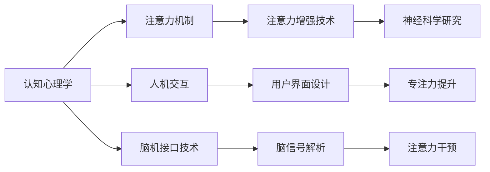

                 

# 人类注意力增强：提升专注力和注意力在商业中的策略

> 关键词：注意力增强,专注力提升,商业策略,技术应用,认知心理学

## 1. 背景介绍

在现代社会中，注意力已经成为一种稀缺资源。随着信息爆炸和社交媒体的普及，人们每天都在面对海量的信息流，而如何保持专注、提高工作效率，成为越来越多企业和个人关注的焦点。如何运用技术手段提升人类的注意力水平，进而提高生产力和商业价值，成为当前一个重要研究方向。

### 1.1 问题由来
人类注意力（Human Attention）是人类认知系统中的一部分，用于选择和处理相关信息。现代社会的数字化环境，尤其是互联网的普及，使得注意力分散和分心的现象日益普遍，这对工作和生活都带来了不利影响。在商业环境中，企业需要员工具有更高的专注力和注意力水平，以提升工作效率和创新能力。

然而，现实情况是，许多人在工作中容易分心、走神，导致工作效率低下、错误率上升，甚至产生职业倦怠。因此，如何通过技术手段，提升人类的注意力水平，特别是在商业环境中的应用，成为企业关注的重点。

### 1.2 问题核心关键点
要提升人类注意力，就需要了解其背后的心理学原理，并结合技术手段进行干预和改善。核心关键点包括以下几点：

- **注意力增强技术的原理与机制**：了解人类注意力的心理生理机制，并利用这些机制开发相应的技术。
- **注意力增强技术在商业中的应用**：探讨如何将注意力增强技术应用于提高员工效率、改善工作流程、提升客户满意度等方面。
- **技术应用与心理影响**：评估注意力增强技术对人类认知和行为的影响，包括短期和长期效果。
- **商业策略的结合与优化**：结合技术应用，提出优化企业组织结构和商业策略的方案。

本文将从注意力增强技术的原理和机制出发，探讨其商业应用，并提出相应的策略和建议。

## 2. 核心概念与联系

### 2.1 核心概念概述

注意力增强（Attention Enhancement）是指通过技术手段提升人类专注力和注意力的过程。其核心概念包括：

- **注意力（Attention）**：人类认知系统的一部分，用于选择和处理相关信息。
- **专注力（Focus）**：个体在特定任务上集中注意力的能力。
- **认知心理学（Cognitive Psychology）**：研究人类认知过程的学科，涉及注意力、记忆、思维等多个方面。
- **神经科学（Neuroscience）**：研究神经系统如何处理信息的学科，涉及大脑结构和功能。
- **人机交互（Human-Computer Interaction, HCI）**：研究如何设计和开发用户友好界面，提升用户交互体验。

这些核心概念之间的联系主要体现在：注意力增强技术通常通过认知心理学和神经科学原理，结合人机交互技术，以提升人类专注力和注意力水平。

### 2.2 核心概念原理和架构的 Mermaid 流程图



这个图表展示了注意力增强技术的基本架构。从认知心理学原理出发，了解人类注意力机制，通过人机交互设计用户界面，结合神经科学研究，解析大脑信号，最终实现对注意力的干预和提升。

## 3. 核心算法原理 & 具体操作步骤
### 3.1 算法原理概述

注意力增强技术的核心算法原理基于认知心理学和神经科学的研究成果，主要包括以下几个方面：

1. **认知负荷理论（Cognitive Load Theory, CLT）**：强调在信息处理过程中，认知负荷（Cognitive Load）对信息吸收和加工的影响。通过减少认知负荷，可以提升注意力水平。

2. **注意焦点理论（Focus of Attention Theory, FAT）**：提出注意焦点（Focus of Attention）的概念，即个体在特定任务上的注意力集中点。通过调整注意焦点，可以引导个体专注特定任务。

3. **工作记忆（Working Memory, WM）**：研究个体在信息处理过程中，短期存储和操作信息的容量。通过优化工作记忆机制，可以提升注意力水平。

4. **分心理论（Distraction Theory）**：研究分心的原因和机制，如环境干扰、心理压力等。通过减少环境干扰和心理压力，可以提升注意力水平。

### 3.2 算法步骤详解

注意力增强技术通常包括以下几个步骤：

**Step 1: 评估注意力水平**

首先，需要评估当前用户的注意力水平。这可以通过多种方式实现，如问卷调查、心理测试、生理监测等。通过量化注意力水平，可以更好地进行后续干预。

**Step 2: 识别注意焦点**

根据用户当前任务，识别其注意力焦点。例如，在进行编程工作时，用户的注意力焦点可能集中在代码编写和问题解决上。通过识别注意焦点，可以引导用户专注特定任务。

**Step 3: 调整认知负荷**

根据用户的认知负荷情况，调整任务难度和复杂度。例如，对于注意力容易分散的用户，可以适当简化任务，减少认知负荷。

**Step 4: 应用分心管理**

通过减少环境干扰和心理压力，管理用户的分心。例如，通过减少噪音、调整工作环境、优化工作流程等，提高用户专注力。

**Step 5: 持续监测与优化**

对用户注意力进行持续监测，根据评估结果进行优化。例如，定期对用户进行注意力评估，根据结果调整工作任务和环境，提升用户注意力水平。

### 3.3 算法优缺点

注意力增强技术具有以下优点：

- **提高工作效率**：通过提升专注力和注意力，用户可以更快地完成任务，提高工作效率。
- **减少错误率**：提高注意力水平可以减少因分心造成的错误。
- **提升用户满意度**：用户在工作中的体验和满意度得到提升。

同时，也存在一些缺点：

- **依赖性强**：技术应用需要依赖于评估和监测工具，可能存在偏差。
- **个体差异大**：不同用户对技术干预的反应不同，效果可能因人而异。
- **长期效果未知**：技术应用对长期认知功能的影响尚需更多研究。

### 3.4 算法应用领域

注意力增强技术在多个领域中都有广泛应用，包括但不限于：

- **企业组织管理**：通过技术手段提升员工专注力，改善工作流程。
- **教育培训**：在教学过程中，通过技术手段提升学生的注意力，提高学习效果。
- **医疗健康**：通过技术干预，帮助患者管理注意力，提升治疗效果。
- **个人健康管理**：通过应用注意力增强技术，帮助个体提升专注力和工作效率，改善生活质量。
- **娱乐休闲**：在娱乐和休闲活动中，通过技术手段提升用户专注力，提升体验感。

## 4. 数学模型和公式 & 详细讲解

### 4.1 数学模型构建

注意力增强技术通常不涉及复杂的数学模型，但可以通过认知负荷理论和工作记忆模型进行初步建模。

**认知负荷模型**：

认知负荷模型（CLT）可以简化为：

$$
\text{CL} = \text{Load}_{task} + \text{Load}_{cognitive}
$$

其中 $\text{CL}$ 表示认知负荷，$\text{Load}_{task}$ 表示任务相关认知负荷，$\text{Load}_{cognitive}$ 表示与任务无关的认知负荷。

**工作记忆模型**：

工作记忆模型（WM）可以简化为：

$$
\text{WM} = \text{WM}_{active} + \text{WM}_{passive}
$$

其中 $\text{WM}$ 表示工作记忆容量，$\text{WM}_{active}$ 表示活动相关工作记忆，$\text{WM}_{passive}$ 表示被动相关工作记忆。

### 4.2 公式推导过程

对于认知负荷模型，可以通过减少 $\text{Load}_{task}$ 和 $\text{Load}_{cognitive}$ 来提升注意力水平。例如，通过简化任务步骤、减少背景干扰等手段降低 $\text{Load}_{cognitive}$。

对于工作记忆模型，可以通过增加 $\text{WM}_{active}$，减少 $\text{WM}_{passive}$ 来提升注意力水平。例如，通过设置短期记忆任务，减少长期记忆干扰。

### 4.3 案例分析与讲解

**案例1：编程工作中的应用**

对于编程工作者，可以通过以下方式应用注意力增强技术：

1. **任务简化**：将复杂任务分解为小步骤，减少单个任务步骤的认知负荷。
2. **减少干扰**：通过调整工作环境，减少噪音和视觉干扰，提高专注力。
3. **使用代码编辑器插件**：利用代码编辑器插件，如CodeMirror、Visual Studio Code等，减少手动输入代码的认知负荷。

**案例2：学习中的应用**

对于学习者，可以通过以下方式应用注意力增强技术：

1. **学习任务分组**：将学习任务分组，每组任务难度适中，减少整体认知负荷。
2. **休息与运动**：通过设置学习间隔和休息时间，避免长时间学习造成的认知疲劳。
3. **多媒体学习材料**：使用视频、音频等多媒体学习材料，辅助理解和记忆，减少单一模式的认知负荷。

## 5. 项目实践：代码实例和详细解释说明
### 5.1 开发环境搭建

要进行注意力增强技术的项目实践，首先需要搭建相应的开发环境。以下是具体的步骤：

1. **安装Python环境**：可以使用Anaconda或Miniconda等工具，创建独立的Python环境。

2. **安装相关库**：需要安装NumPy、Pandas、Scikit-Learn等常用的Python科学计算库。

3. **安装认知负荷评估工具**：如Cognitive Load Survey (CLS)等，用于评估用户的认知负荷水平。

4. **安装注意力干预工具**：如FocuSphere等，用于监测和调整用户的注意力状态。

### 5.2 源代码详细实现

以下是一个简单的Python程序，用于评估用户的认知负荷水平并给出建议：

```python
import pandas as pd
from cognitive_load import CLS

# 用户认知负荷评估问卷
 survey = [
     {"id": 1, "question": "在完成任务时，你是否会感到压力很大？", "scale": 1-5},
     {"id": 2, "question": "你是否经常需要在多个任务之间切换？", "scale": 1-5},
     {"id": 3, "question": "你是否觉得完成任务所需的时间比预期长？", "scale": 1-5},
     {"id": 4, "question": "你是否会因为外界干扰而分心？", "scale": 1-5},
     {"id": 5, "question": "你是否经常感到注意力难以集中？", "scale": 1-5},
 ]

# 创建数据表
 survey_df = pd.DataFrame(survey)

# 进行认知负荷评估
 cls = CLS(survey_df)
 cognitive_load = cls.calculate_cognitive_load()

# 输出建议
 print(f"您的认知负荷评估结果为：{cognitive_load}")
 if cognitive_load > 5:
     print("建议进行任务简化或减少干扰。")
 else:
     print("您的认知负荷水平适中，无需调整。")
```

### 5.3 代码解读与分析

**代码分析**：

- **数据创建**：首先创建包含用户认知负荷评估问卷的列表，并将其转换为Pandas DataFrame格式，方便后续分析。
- **认知负荷评估**：使用CLS工具进行认知负荷评估，输出评估结果。
- **建议输出**：根据评估结果，给出相应的注意力提升建议。

**注意事项**：

- **数据收集**：需要确保问卷数据的全面性和准确性，以获得准确的认知负荷评估结果。
- **模型选择**：选择适合特定任务的认知负荷评估模型，如CLS、FAT等。
- **建议实施**：根据评估结果，制定合理的注意力提升方案，并进行实施和监测。

### 5.4 运行结果展示

运行上述代码后，会输出用户的认知负荷评估结果和相应的建议。例如：

```
您的认知负荷评估结果为：5.0
建议进行任务简化或减少干扰。
```

这表示用户的认知负荷水平较高，需要采取措施进行任务简化或减少干扰。

## 6. 实际应用场景

### 6.1 企业组织管理

在企业组织管理中，注意力增强技术可以应用于以下几个方面：

- **任务分配与工作流程优化**：通过评估员工注意力水平，优化任务分配和工作流程，提升工作效率。
- **员工培训与发展**：利用注意力增强技术进行员工培训，提升其注意力水平，提高培训效果。
- **远程办公管理**：在远程办公环境中，通过技术手段监控员工注意力，提高远程办公效率。

### 6.2 教育培训

在教育培训中，注意力增强技术可以应用于以下几个方面：

- **教学内容设计**：通过评估学生注意力水平，设计合适的教学内容和任务，提升学习效果。
- **课堂互动与反馈**：利用注意力增强技术进行课堂互动，及时反馈学生注意力状态，调整教学方法。
- **个性化学习路径**：根据学生注意力水平，设计个性化学习路径，提高学习效率。

### 6.3 医疗健康

在医疗健康中，注意力增强技术可以应用于以下几个方面：

- **患者康复训练**：利用注意力增强技术进行康复训练，提升患者专注力，加速康复进程。
- **心理治疗与咨询**：通过评估患者注意力水平，优化治疗方案，提高治疗效果。
- **老年痴呆症干预**：利用注意力增强技术进行老年痴呆症干预，延缓认知功能衰退。

### 6.4 个人健康管理

在个人健康管理中，注意力增强技术可以应用于以下几个方面：

- **时间管理**：通过技术手段管理个人时间，提升工作效率和专注力。
- **健康习惯养成**：利用注意力增强技术培养健康习惯，提升生活质量。
- **心理压力管理**：通过评估注意力水平，管理心理压力，提高心理韧性。

## 7. 工具和资源推荐
### 7.1 学习资源推荐

为了帮助开发者系统掌握注意力增强技术的理论基础和实践技巧，这里推荐一些优质的学习资源：

1. **《认知负荷理论与应用》**：详细介绍了认知负荷理论的基本概念和应用案例，是了解认知负荷的重要参考资料。
2. **《注意力增强技术》**：介绍了注意力增强技术的多种方法和工具，适合学习技术应用。
3. **《神经科学基础》**：介绍了神经科学的基本原理，是理解注意力增强技术的基础。
4. **《人机交互设计》**：介绍了人机交互设计的理论和实践，适合提升注意力增强技术的应用能力。
5. **《认知负荷评估工具》**：介绍了多种认知负荷评估工具，如CLS、FAT等，是进行认知负荷评估的基础。

### 7.2 开发工具推荐

在进行注意力增强技术的项目实践时，可以使用以下开发工具：

1. **Python**：适合进行数据处理和算法实现的编程语言。
2. **NumPy、Pandas**：常用的Python科学计算库，用于数据处理和分析。
3. **Scikit-Learn**：常用的Python机器学习库，用于模型训练和评估。
4. **CLS工具**：适合进行认知负荷评估的工具，如Cognitive Load Survey (CLS)等。
5. **FocuSphere工具**：适合进行注意力干预和监测的工具。

### 7.3 相关论文推荐

以下是几篇关于注意力增强技术的经典论文，推荐阅读：

1. **《认知负荷理论与实践》**：详细介绍了认知负荷理论的基本原理和应用案例，适合深入理解注意力增强技术。
2. **《注意力增强技术的进展》**：介绍了注意力增强技术的多种方法和工具，适合了解技术进展和应用案例。
3. **《神经科学基础与注意力》**：介绍了神经科学的基本原理，帮助理解注意力增强技术的生理机制。
4. **《人机交互设计与注意力增强》**：介绍了人机交互设计的理论和实践，适合提升注意力增强技术的应用能力。
5. **《认知负荷评估与测量》**：介绍了多种认知负荷评估工具和方法，适合进行认知负荷评估。

## 8. 总结：未来发展趋势与挑战

### 8.1 总结

本文系统介绍了注意力增强技术的原理和应用，探讨了其商业价值和应用前景。通过认知负荷理论、工作记忆模型等心理学原理，结合人机交互技术，提升人类专注力和注意力水平。同时，详细讲解了注意力增强技术的算法步骤和操作步骤，并通过代码实例展示了具体应用方法。本文还讨论了注意力增强技术在企业组织管理、教育培训、医疗健康和个人健康管理等领域的广泛应用。

### 8.2 未来发展趋势

展望未来，注意力增强技术将在以下几个方面继续发展：

1. **多模态注意力增强**：结合视觉、听觉等多模态信息，提升注意力增强技术的效果和应用范围。
2. **脑机接口技术**：通过脑机接口技术，实时监测和干预用户的注意力状态，提高注意力增强的效果。
3. **认知增强算法**：开发更高效的算法，提升注意力增强技术的精度和效果。
4. **个性化注意力增强**：根据用户特点和需求，进行个性化的注意力增强，提高用户体验。
5. **跨领域应用拓展**：将注意力增强技术应用于更多领域，提升各个领域的生产力和效率。

### 8.3 面临的挑战

尽管注意力增强技术在多个领域中已经取得了一些进展，但在推广和应用过程中仍面临诸多挑战：

1. **技术普及度低**：当前的技术应用还未普及，多数用户和企业还未意识到其重要性。
2. **数据隐私问题**：注意力增强技术需要收集用户数据，如何保护用户隐私，是亟待解决的问题。
3. **技术适配性差**：不同用户和企业对注意力增强技术的需求不同，如何提供适配性强的解决方案，是关键问题。
4. **长期效果未知**：对注意力增强技术的长期效果和影响尚需更多研究，亟需更多的科学验证。
5. **市场接受度低**：用户和企业对新技术的接受度较低，需要通过更多的市场教育和用户反馈，推动技术普及。

### 8.4 研究展望

未来的研究需要在以下几个方面寻求新的突破：

1. **大规模数据应用**：通过大规模数据应用，进一步提升注意力增强技术的精度和效果。
2. **跨学科研究**：结合心理学、神经科学、人机交互等多个学科，深入研究注意力增强技术的原理和应用。
3. **技术标准化**：制定技术标准，规范注意力增强技术的应用流程和方法，提高技术应用的可信度和可靠性。
4. **用户友好设计**：开发更加用户友好的注意力增强技术产品，提高用户接受度和使用体验。
5. **跨领域应用推广**：将注意力增强技术推广到更多领域，提升各个领域的生产力和效率。

通过持续的创新和优化，相信注意力增强技术将会在更多领域得到应用，提升人类的专注力和注意力水平，推动生产力和效率的提升。

## 9. 附录：常见问题与解答

**Q1：注意力增强技术是否可以应用于所有领域？**

A: 注意力增强技术在多个领域中都有广泛应用，包括企业组织管理、教育培训、医疗健康和个人健康管理等。但具体应用时，需要根据领域特点和用户需求进行定制和优化。

**Q2：注意力增强技术对个体效果如何？**

A: 注意力增强技术对个体效果因个体差异而异，部分用户可以通过技术手段显著提升注意力水平，而部分用户可能效果不明显。

**Q3：注意力增强技术如何与企业商业策略结合？**

A: 注意力增强技术可以通过提升员工专注力和工作效率，优化企业组织结构和商业流程，从而提升企业的生产力和竞争力。具体结合方式需要根据企业特点和需求进行设计。

**Q4：注意力增强技术对长期认知功能的影响如何？**

A: 当前对注意力增强技术的长期认知功能影响尚需更多研究，但部分研究表明，适当的使用可以提升注意力水平，但过度使用可能带来认知负荷。

**Q5：注意力增强技术的应用前景如何？**

A: 随着科技的进步和应用的深入，注意力增强技术将在更多领域得到应用，提升人类的专注力和注意力水平，推动生产力和效率的提升。

---

作者：禅与计算机程序设计艺术 / Zen and the Art of Computer Programming

