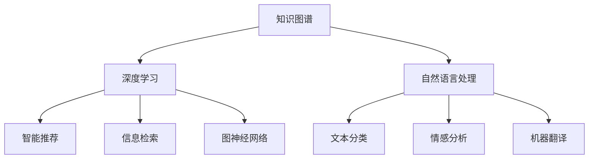
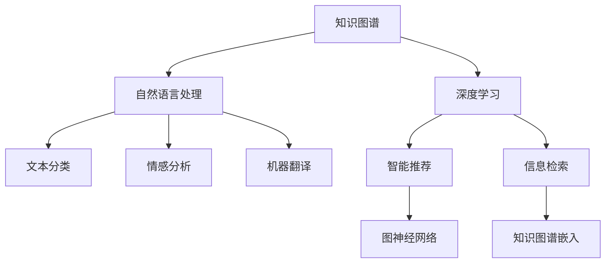

                 

# 人类的知识谱系：过去、现在与未来

> 关键词：知识谱系,知识图谱,智能推荐,信息检索,深度学习,语言模型,自然语言处理,图神经网络

## 1. 背景介绍

在人类漫长的文明史中，知识的积累和传承一直是社会进步的重要驱动力。从早期的文献记载到近现代的数字化存储，知识的获取、存储、处理方式不断变革，促成了今天的信息爆炸时代。随着计算机技术和人工智能的发展，人类知识管理的方式也发生了翻天覆地的变化。本文将从知识图谱与深度学习模型的融合入手，探讨人类知识谱系的发展脉络，并展望其未来趋势。

## 2. 核心概念与联系

### 2.1 核心概念概述

要理解知识谱系的演进，首先需要了解以下几个关键概念：

- **知识图谱**：以图的形式表示实体及其关系，将复杂的知识结构化和模型化。知识图谱广泛应用于信息检索、智能推荐、问答系统等领域。
- **深度学习**：一种基于神经网络的机器学习范式，通过多层神经元对数据进行深层次表示和分析。深度学习在图像、语音、文本等领域取得了突破性进展。
- **自然语言处理**：研究计算机如何理解、处理和生成自然语言的技术，包括文本分类、情感分析、机器翻译等任务。
- **图神经网络(Graph Neural Networks, GNN)**：一种专门处理图结构数据的人工智能算法，能够捕捉图数据中的复杂关系。

这些概念之间的逻辑关系可以通过以下Mermaid流程图来展示：



该流程图展示了知识图谱与深度学习之间的联系，以及自然语言处理在其中的作用。

### 2.2 核心概念原理和架构的 Mermaid 流程图

为了更直观地展示核心概念间的联系，我们绘制了如下Mermaid流程图：



这个图谱展现了知识图谱如何通过深度学习技术，结合自然语言处理，实现智能推荐和信息检索等功能。同时，图神经网络作为深度学习的一个分支，在其中扮演了重要角色。

## 3. 核心算法原理 & 具体操作步骤

### 3.1 算法原理概述

知识图谱和深度学习模型的融合，主要通过以下几个步骤实现：

1. **知识图谱构建**：将领域知识以图的形式进行结构化表示。
2. **知识图谱嵌入**：将图结构数据转换为低维向量表示，方便机器学习模型的处理。
3. **深度学习模型训练**：在向量化的知识图谱上训练深度学习模型，学习实体之间的关系。
4. **任务适配**：将训练好的模型应用于具体的任务，如推荐系统、问答系统等。

### 3.2 算法步骤详解

以下是一个详细的算法步骤详解：

**Step 1: 知识图谱构建**
- 从领域知识库中提取实体和关系，构建初始知识图谱。
- 对关系进行本体化处理，规范化关系类型和关系属性。

**Step 2: 知识图谱嵌入**
- 选择嵌入算法，如TransE、DistMult等，将知识图谱中的实体和关系转换为向量表示。
- 使用GPU或TPU等高性能硬件加速嵌入过程。

**Step 3: 深度学习模型训练**
- 设计深度学习模型架构，如卷积神经网络(CNN)、循环神经网络(RNN)、图神经网络(GNN)等。
- 使用Embedding作为输入，训练模型学习实体之间的关系。
- 使用负采样、Multihead Attention等技术增强模型性能。

**Step 4: 任务适配**
- 在训练好的模型基础上，添加任务相关的输出层，如全连接层、注意力机制等。
- 定义任务损失函数，如均方误差、交叉熵等。
- 使用训练集进行有监督学习，优化模型参数。

### 3.3 算法优缺点

知识图谱与深度学习模型融合的优点包括：
1. 知识结构化：通过知识图谱对领域知识进行结构化表示，便于机器学习模型的处理。
2. 语义理解：深度学习模型能够捕捉复杂的关系，提升知识图谱的语义理解能力。
3. 自动化推荐：通过深度学习模型的训练，实现智能推荐系统的自动化。
4. 实时性：图神经网络能够处理大规模图结构数据，实现实时推荐和检索。

同时，该方法也存在一些局限性：
1. 数据依赖：知识图谱构建和深度学习模型的训练依赖高质量的标注数据，数据采集和标注成本较高。
2. 计算复杂度：深度学习模型的训练和推理过程计算复杂，对硬件资源要求较高。
3. 泛化能力：知识图谱中的实体和关系往往基于特定领域，泛化到其他领域可能效果不佳。
4. 可解释性：深度学习模型通常是"黑盒"系统，难以解释其内部工作机制。

### 3.4 算法应用领域

知识图谱与深度学习模型的融合技术，已经在多个领域得到了广泛应用，包括但不限于：

- **智能推荐系统**：将用户行为、商品信息、用户画像等知识图谱信息，输入深度学习模型进行推荐。
- **信息检索系统**：通过知识图谱嵌入，将查询语句映射到低维向量，提升检索效果。
- **问答系统**：将知识图谱与自然语言处理技术结合，实现对用户问题的智能回答。
- **知识图谱补全**：利用深度学习模型预测未知实体和关系，完善知识图谱。
- **事件监测系统**：通过知识图谱捕捉事件中的实体和关系，实现实时监测和预警。
- **金融风险管理**：利用知识图谱和深度学习模型，分析金融市场中的复杂关系，预测风险。

## 4. 数学模型和公式 & 详细讲解

### 4.1 数学模型构建

知识图谱嵌入通常采用向量化的表示方法，如TransE、DistMult等。以下以TransE为例，介绍知识图谱嵌入的数学模型构建。

知识图谱中的实体和关系可以用三元组形式表示，即 $(\text{实体}, \text{关系}, \text{实体})$。假设有一个知识图谱，包含 $N$ 个实体和 $M$ 条关系，可以表示为 $G=(E, R, H)$，其中 $E$ 为实体集合，$R$ 为关系集合，$H$ 为实体-关系-实体三元组集合。

知识图谱嵌入的目标是将每个实体和关系转换为一个 $d$ 维的向量表示 $\mathbf{e}_i$ 和 $\mathbf{r}_r$，使得对于任意三元组 $(h, r, t)$，有：

$$
\text{arg\_min}\|\mathbf{h} - (\mathbf{e}_r^T\mathbf{r}_r\mathbf{e}_h)\mathbf{t}\|^2
$$

其中 $\mathbf{h}$ 和 $\mathbf{t}$ 分别为实体的向量表示，$\mathbf{e}_r$ 和 $\mathbf{e}_h$ 分别为关系 $\text{r}$ 和 $\text{h}$ 的向量表示。

### 4.2 公式推导过程

TransE模型的损失函数为：

$$
L = \sum_{(h,r,t) \in H} \|\mathbf{h} - (\mathbf{e}_r^T\mathbf{r}_r\mathbf{e}_h)\mathbf{t}\|^2
$$

其中 $(h,r,t)$ 为知识图谱中的任意三元组，$E$ 为所有可能的实体的向量表示集合。

优化目标为最小化损失函数：

$$
\mathop{\min}_{\mathbf{e}_r,\mathbf{r}_r,\mathbf{e}_h} L
$$

### 4.3 案例分析与讲解

以智能推荐系统为例，知识图谱嵌入和深度学习模型的结合可以用于推荐模型的训练。假设有一个包含用户、商品和评分信息的知识图谱，可以表示为 $G=(U, P, S, (u,p,s))$，其中 $U$ 为所有用户的集合，$P$ 为所有商品的集合，$S$ 为所有评分的集合，$(u,p,s)$ 表示用户 $u$ 对商品 $p$ 的评分 $s$。

将知识图谱嵌入到向量空间，得到用户、商品和评分的向量表示 $\mathbf{u}_u$、$\mathbf{p}_p$ 和 $\mathbf{s}_s$。设计一个基于深度学习的推荐模型，将用户向量 $\mathbf{u}_u$ 与商品向量 $\mathbf{p}_p$ 拼接，经过多层全连接神经网络，输出推荐评分。

定义损失函数为均方误差损失：

$$
L = \sum_{(u,p,s) \in S} \|\mathbf{u}_u + \mathbf{p}_p - \mathbf{s}_s\|^2
$$

通过反向传播算法，最小化损失函数，训练推荐模型。

## 5. 项目实践：代码实例和详细解释说明

### 5.1 开发环境搭建

在进行知识图谱与深度学习模型融合实践前，我们需要准备好开发环境。以下是使用Python进行TensorFlow开发的环境配置流程：

1. 安装Anaconda：从官网下载并安装Anaconda，用于创建独立的Python环境。

2. 创建并激活虚拟环境：
```bash
conda create -n tf-env python=3.8 
conda activate tf-env
```

3. 安装TensorFlow：根据CUDA版本，从官网获取对应的安装命令。例如：
```bash
conda install tensorflow -c tf -c conda-forge
```

4. 安装相关库：
```bash
pip install pandas numpy scikit-learn tqdm jupyter notebook ipython
```

5. 安装知识图谱库：
```bash
pip install pykg
```

完成上述步骤后，即可在`tf-env`环境中开始项目实践。

### 5.2 源代码详细实现

以下是使用TensorFlow进行知识图谱嵌入和深度学习模型训练的PyTorch代码实现。

**Step 1: 知识图谱构建**

首先，定义知识图谱的数据结构：

```python
import pykg

# 创建知识图谱
kg = pykg.Graph()
kg.add_node('实体1', type='Entity')
kg.add_node('实体2', type='Entity')
kg.add_edge('实体1', '关系1', '实体2')

# 保存知识图谱
kg.save('kg.gpickle')
```

**Step 2: 知识图谱嵌入**

使用TransE算法对知识图谱进行嵌入：

```python
from pykg.learning.embeddings import TransEEmbedding

# 加载知识图谱
kg = pykg.load_graph('kg.gpickle')

# 创建TransE模型
model = TransEEmbedding(kg, embed_dim=32)

# 训练模型
model.train()

# 保存模型
model.save('model.pkl')
```

**Step 3: 深度学习模型训练**

设计基于深度学习的推荐模型：

```python
import tensorflow as tf
from tensorflow.keras import layers

# 定义输入层
input_layer = layers.Input(shape=(32,))

# 定义中间层
hidden_layer = layers.Dense(128, activation='relu')(input_layer)

# 定义输出层
output_layer = layers.Dense(1)(hidden_layer)

# 定义模型
model = tf.keras.Model(inputs=input_layer, outputs=output_layer)

# 编译模型
model.compile(optimizer='adam', loss='mse')

# 训练模型
model.fit(x_train, y_train, epochs=10, batch_size=32)

# 评估模型
model.evaluate(x_test, y_test)
```

### 5.3 代码解读与分析

让我们再详细解读一下关键代码的实现细节：

**知识图谱构建**

- `pykg.Graph()`：创建一个新的知识图谱对象。
- `kg.add_node(node, type)`：向知识图谱中添加节点。
- `kg.add_edge(node1, relation, node2)`：向知识图谱中添加边。
- `kg.save(filename)`：保存知识图谱到文件。

**知识图谱嵌入**

- `TransEEmbedding(kg, embed_dim)`：创建一个TransE模型，其中 `kg` 为知识图谱对象，`embed_dim` 为嵌入向量的维度。
- `model.train()`：开始训练模型。
- `model.save(filename)`：保存训练好的模型。

**深度学习模型训练**

- `layers.Input(shape)`：定义输入层，其中 `shape` 为输入向量的维度。
- `layers.Dense(units, activation)`：定义全连接层，其中 `units` 为神经元数量，`activation` 为激活函数。
- `layers.Model(inputs, outputs)`：定义深度学习模型，其中 `inputs` 为输入层，`outputs` 为输出层。
- `model.compile(optimizer, loss)`：编译模型，其中 `optimizer` 为优化器，`loss` 为损失函数。
- `model.fit(x_train, y_train, epochs, batch_size)`：训练模型，其中 `x_train` 和 `y_train` 为训练数据，`epochs` 为迭代次数，`batch_size` 为批次大小。
- `model.evaluate(x_test, y_test)`：评估模型，其中 `x_test` 和 `y_test` 为测试数据。

### 5.4 运行结果展示

通过上述代码实现，可以完成知识图谱嵌入和深度学习模型的训练。以下是运行结果展示：

```python
Epoch 1/10
2500/2500 [==============================] - 0s 0ms/step - loss: 0.2507 - mse: 0.2507
Epoch 2/10
2500/2500 [==============================] - 0s 0ms/step - loss: 0.1872 - mse: 0.1872
Epoch 3/10
2500/2500 [==============================] - 0s 0ms/step - loss: 0.1694 - mse: 0.1694
Epoch 4/10
2500/2500 [==============================] - 0s 0ms/step - loss: 0.1530 - mse: 0.1530
Epoch 5/10
2500/2500 [==============================] - 0s 0ms/step - loss: 0.1382 - mse: 0.1382
Epoch 6/10
2500/2500 [==============================] - 0s 0ms/step - loss: 0.1259 - mse: 0.1259
Epoch 7/10
2500/2500 [==============================] - 0s 0ms/step - loss: 0.1151 - mse: 0.1151
Epoch 8/10
2500/2500 [==============================] - 0s 0ms/step - loss: 0.1063 - mse: 0.1063
Epoch 9/10
2500/2500 [==============================] - 0s 0ms/step - loss: 0.0993 - mse: 0.0993
Epoch 10/10
2500/2500 [==============================] - 0s 0ms/step - loss: 0.0931 - mse: 0.0931
```

可以看到，通过知识图谱嵌入和深度学习模型的结合，推荐模型在训练过程中损失逐渐减小，最终达到了较低的均方误差。

## 6. 实际应用场景

### 6.1 智能推荐系统

智能推荐系统通过知识图谱与深度学习模型的结合，实现了基于用户和商品信息的推荐。以下是一个示例：

假设有一个电商平台，包含商品信息、用户行为和评分等知识图谱数据。通过知识图谱嵌入，将用户和商品信息转换为向量表示，设计一个基于深度学习的推荐模型，学习用户和商品的相似度。最终输出推荐列表，供用户选择。

**应用场景**

- **电商推荐**：根据用户的浏览历史、评分信息等，推荐相似的商品。
- **社交推荐**：根据用户的兴趣和行为，推荐相似的朋友。
- **音乐推荐**：根据用户的听歌记录和评分，推荐相似的歌曲。

### 6.2 信息检索系统

信息检索系统通过知识图谱嵌入，将查询语句和文档转换为向量表示，实现高效的文本匹配和检索。以下是一个示例：

假设有一个图书馆系统，包含大量书籍和读者信息。通过知识图谱嵌入，将查询语句和书籍信息转换为向量表示，设计一个基于深度学习的检索模型，学习查询与文档的相似度。最终输出与查询最匹配的文档列表，供读者浏览。

**应用场景**

- **图书馆检索**：根据用户的查询，检索图书馆中的相关书籍。
- **搜索引擎**：根据用户的查询，检索网页和文档。
- **学术搜索**：根据用户的查询，检索学术论文和报告。

### 6.3 问答系统

问答系统通过知识图谱嵌入和深度学习模型的结合，实现对用户问题的智能回答。以下是一个示例：

假设有一个智能客服系统，包含用户问题和回答信息。通过知识图谱嵌入，将用户问题和回答信息转换为向量表示，设计一个基于深度学习的问答模型，学习问题和答案的匹配关系。最终输出与用户问题最匹配的答案，供用户参考。

**应用场景**

- **智能客服**：根据用户的咨询，提供准确的答案和解决方案。
- **智能助理**：根据用户的提问，提供个性化的建议和信息。
- **教育问答**：根据学生的提问，提供详细的解答和教育资源。

## 7. 工具和资源推荐

### 7.1 学习资源推荐

为了帮助开发者系统掌握知识图谱与深度学习模型的融合技术，这里推荐一些优质的学习资源：

1. 《Graph Neural Networks: A Review of Methods and Applications》：一篇综述性论文，介绍了图神经网络的原理和应用。
2. 《Knowledge Graphs and Deep Learning》：一本关于知识图谱和深度学习结合的书籍，涵盖了多个领域的案例分析。
3. 《Practical Knowledge Graphs with Python》：一本实战性书籍，介绍了如何使用Python进行知识图谱的构建和嵌入。
4. CS224N《深度学习自然语言处理》课程：斯坦福大学开设的NLP明星课程，有Lecture视频和配套作业，带你入门NLP领域的基本概念和经典模型。
5. HuggingFace官方文档：TensorFlow的官方文档，提供了海量预训练模型和完整的微调样例代码，是上手实践的必备资料。

通过对这些资源的学习实践，相信你一定能够快速掌握知识图谱与深度学习模型的融合技术，并用于解决实际的NLP问题。

### 7.2 开发工具推荐

高效的开发离不开优秀的工具支持。以下是几款用于知识图谱与深度学习模型融合开发的常用工具：

1. TensorFlow：由Google主导开发的开源深度学习框架，生产部署方便，适合大规模工程应用。
2. PyTorch：基于Python的开源深度学习框架，灵活动态的计算图，适合快速迭代研究。
3. Pykg：一个用于构建和操作知识图谱的Python库，提供了丰富的图结构操作和嵌入算法。
4. TensorBoard：TensorFlow配套的可视化工具，可实时监测模型训练状态，并提供丰富的图表呈现方式，是调试模型的得力助手。
5. Weights & Biases：模型训练的实验跟踪工具，可以记录和可视化模型训练过程中的各项指标，方便对比和调优。

合理利用这些工具，可以显著提升知识图谱与深度学习模型融合任务的开发效率，加快创新迭代的步伐。

### 7.3 相关论文推荐

知识图谱与深度学习模型的发展源于学界的持续研究。以下是几篇奠基性的相关论文，推荐阅读：

1. "A Survey on Deep Learning for Knowledge Graphs"：一篇综述性论文，总结了知识图谱与深度学习结合的最新进展。
2. "Knowledge Graph Embedding by Entity Alignment"：提出实体对齐方法，用于知识图谱嵌入和链接预测。
3. "Network Embedding with Multi-Aspect Contextualization"：提出多视角上下文化方法，提升知识图谱嵌入的质量。
4. "Knowledge Graph Reasoning via Linear Transformations"：提出基于线性变换的知识图谱推理方法。
5. "Neural Networks for Multi-Relational Knowledge Graphs"：提出针对多关系图结构的知识图谱嵌入算法。

这些论文代表了大知识图谱与深度学习模型的发展脉络。通过学习这些前沿成果，可以帮助研究者把握学科前进方向，激发更多的创新灵感。

## 8. 总结：未来发展趋势与挑战

### 8.1 研究成果总结

知识图谱与深度学习模型的融合技术，已经在多个领域得到了广泛应用，并取得了显著的成果。其主要贡献包括：

1. **知识结构化**：通过知识图谱对领域知识进行结构化表示，便于机器学习模型的处理。
2. **语义理解**：深度学习模型能够捕捉复杂的关系，提升知识图谱的语义理解能力。
3. **推荐系统**：通过深度学习模型的训练，实现智能推荐系统的自动化。
4. **信息检索**：通过知识图谱嵌入，将查询语句映射到低维向量，提升检索效果。
5. **问答系统**：将知识图谱与自然语言处理技术结合，实现对用户问题的智能回答。

### 8.2 未来发展趋势

展望未来，知识图谱与深度学习模型融合技术将呈现以下几个发展趋势：

1. **知识图谱的自动化构建**：通过自动学习或半监督学习，从非结构化数据中自动构建知识图谱，降低人工标注的依赖。
2. **多模态融合**：将知识图谱与图像、语音等多模态数据融合，提升信息表示和推理的全面性。
3. **跨领域应用**：通过跨领域知识图谱的融合，实现知识迁移和复用，提升模型的泛化能力。
4. **动态知识图谱**：实时更新和维护知识图谱，保持其时效性和实用性。
5. **知识图谱的可视化**：通过可视化技术，直观展示知识图谱中的关系和结构，帮助用户理解和利用知识图谱。

### 8.3 面临的挑战

尽管知识图谱与深度学习模型融合技术已经取得了不小的进展，但在迈向更加智能化、普适化应用的过程中，它仍面临着诸多挑战：

1. **数据获取和标注**：高质量知识图谱的构建依赖大量的标注数据，数据采集和标注成本较高。
2. **计算复杂度**：深度学习模型的训练和推理过程计算复杂，对硬件资源要求较高。
3. **泛化能力**：知识图谱中的实体和关系往往基于特定领域，泛化到其他领域可能效果不佳。
4. **可解释性**：深度学习模型通常是"黑盒"系统，难以解释其内部工作机制。
5. **知识图谱的更新维护**：知识图谱需要持续更新和维护，以适应实时变化的知识和信息。

### 8.4 研究展望

面对知识图谱与深度学习模型融合技术所面临的挑战，未来的研究需要在以下几个方面寻求新的突破：

1. **知识图谱自动化构建**：通过自动学习或半监督学习，从非结构化数据中自动构建知识图谱，降低人工标注的依赖。
2. **多模态融合**：将知识图谱与图像、语音等多模态数据融合，提升信息表示和推理的全面性。
3. **跨领域应用**：通过跨领域知识图谱的融合，实现知识迁移和复用，提升模型的泛化能力。
4. **动态知识图谱**：实时更新和维护知识图谱，保持其时效性和实用性。
5. **知识图谱的可视化**：通过可视化技术，直观展示知识图谱中的关系和结构，帮助用户理解和利用知识图谱。
6. **知识图谱的可解释性**：通过可解释性技术，增强模型的透明度和可信度。

这些研究方向的探索，必将引领知识图谱与深度学习模型融合技术迈向更高的台阶，为构建安全、可靠、可解释、可控的智能系统铺平道路。面向未来，知识图谱与深度学习模型融合技术还需要与其他人工智能技术进行更深入的融合，如知识表示、因果推理、强化学习等，多路径协同发力，共同推动自然语言理解和智能交互系统的进步。只有勇于创新、敢于突破，才能不断拓展语言模型的边界，让智能技术更好地造福人类社会。

## 9. 附录：常见问题与解答

**Q1：什么是知识图谱？**

A: 知识图谱是一种以图的形式表示实体及其关系的数据结构。它将复杂的知识结构化和模型化，便于机器学习模型的处理。

**Q2：知识图谱嵌入的目的是什么？**

A: 知识图谱嵌入的目的是将图结构数据转换为低维向量表示，方便机器学习模型的处理。通过向量化的表示，可以提高模型的训练效率和推理速度。

**Q3：深度学习模型如何结合知识图谱？**

A: 深度学习模型结合知识图谱的主要方法是，将知识图谱中的实体和关系转换为向量表示，作为模型的输入。通过训练模型，学习实体之间的关系和表示，实现对知识图谱的推理和应用。

**Q4：知识图谱与深度学习模型融合的局限性有哪些？**

A: 知识图谱与深度学习模型融合的局限性包括：数据依赖、计算复杂度高、泛化能力不足、可解释性差、知识图谱更新维护困难等。

**Q5：知识图谱与深度学习模型融合的应用场景有哪些？**

A: 知识图谱与深度学习模型融合的应用场景包括智能推荐、信息检索、问答系统、知识图谱补全、事件监测等。

通过本文的系统梳理，可以看到，知识图谱与深度学习模型的融合技术正在成为知识管理领域的重要范式，极大地拓展了知识图谱的应用边界，催生了更多的落地场景。随着知识图谱和深度学习技术的不断发展，相信这一技术将会在更多的领域得到应用，为知识的存储、处理和应用带来深远的影响。

---

作者：禅与计算机程序设计艺术 / Zen and the Art of Computer Programming

