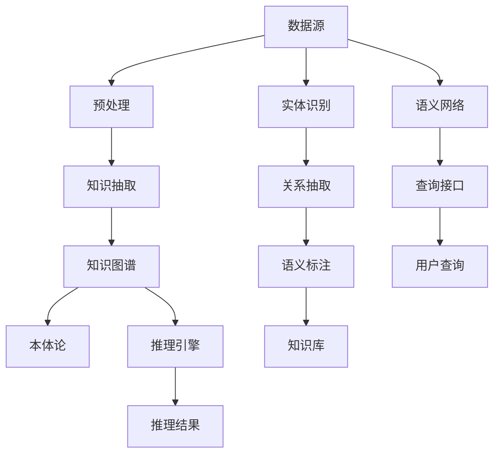

                 

# 人类知识体系的构建与更新：知识发现引擎的任务

## 1. 背景介绍

### 1.1 问题由来

人类文明史在很大程度上是知识积累和知识传播的历史。知识的积累源自人类的探索和实践，而知识的传播则依赖于书籍、文献、教育、科技等手段。但面对日益增长的知识量和复杂度，如何高效地获取、组织、更新和应用这些知识，已成为信息时代的重要课题。

现代科技的进步，尤其是计算机和互联网技术的普及，为知识发现与更新带来了新的可能性。通过智能化、自动化的方式，可以从海量的数据中提取有用的信息，揭示知识之间的联系，构建出庞大的知识体系，并不断地注入新的内容，以适应时代的发展。

### 1.2 问题核心关键点

在知识发现和更新的过程中，构建高效的知识发现引擎(Knowledge Discovery Engine, KDE)是关键。KDE的目标是从大规模数据集(如互联网文本、科学文献、知识图谱等)中自动识别、挖掘和组织知识，辅助人类进行知识探索、决策支持等任务。核心问题包括：

1. 如何从海量数据中提取出有价值的信息？
2. 如何构建高效、准确的知识图谱？
3. 如何实现知识图谱的动态更新？
4. 如何确保知识图谱的时效性和准确性？

这些问题的解决，将极大提升人类获取和应用知识的能力，为科学研究、工业生产、社会治理等领域带来革命性的变化。

## 2. 核心概念与联系

### 2.1 核心概念概述

知识发现引擎是一种利用人工智能和机器学习技术，从数据中自动提取、组织和更新知识的系统。它主要涉及以下几个核心概念：

1. **知识图谱(Knowledge Graph, KG)**：以图形化方式描述实体、属性和关系的数据结构，是知识表示和组织的基础。
2. **本体论(Ontology)**：定义了实体、属性和关系的逻辑结构，确保数据的一致性和准确性。
3. **语义网络(Semantic Network)**：用于描述知识图谱中实体和关系之间的语义关系。
4. **推理引擎(Inference Engine)**：基于知识图谱和本体论，自动进行逻辑推理和推理验证。
5. **知识抽取(Knowledge Extraction, KE)**：自动从原始数据中提取知识，并转化为结构化形式。
6. **实体识别(Entity Recognition)**：从文本中自动识别出具体的实体。
7. **关系抽取(Relation Extraction)**：识别出实体之间的关系。
8. **语义标注(Semantic Annotation)**：对文本进行语义标注，以支持知识抽取和推理。

这些概念之间通过数据流、逻辑推理和算法模型相互关联，共同构建起知识发现引擎的基础框架。

### 2.2 核心概念原理和架构的 Mermaid 流程图



此流程图展示了知识发现引擎的基本数据流和功能模块，包括数据预处理、知识抽取、知识图谱构建、本体论定义、推理引擎使用和查询接口设计。

## 3. 核心算法原理 & 具体操作步骤

### 3.1 算法原理概述

知识发现引擎的核心算法原理主要围绕以下三个步骤展开：数据预处理、知识抽取和知识图谱构建。

**数据预处理**：对原始数据进行清洗、标准化、分割等处理，以便后续的抽取和推理工作。

**知识抽取**：使用自然语言处理(NLP)、信息提取(IE)等技术，从文本、数据库等数据源中自动提取出知识片段，转化为结构化的实体和关系。

**知识图谱构建**：将抽取的知识片段整合入知识图谱中，形成语义化的知识表示，并利用本体论确保知识的一致性和正确性。

### 3.2 算法步骤详解

#### 数据预处理

数据预处理的步骤通常包括：

1. **数据清洗**：去除噪声数据，处理缺失值和异常值。
2. **数据标准化**：将不同格式的数据转换为标准格式，便于后续处理。
3. **数据分割**：将数据划分为训练集、验证集和测试集。
4. **特征工程**：选择和构建特征向量，以提高后续模型的表现。

#### 知识抽取

知识抽取的主要任务包括实体识别和关系抽取。常用的方法包括：

1. **命名实体识别(Named Entity Recognition, NER)**：识别出文本中的命名实体，如人名、地名、组织名等。
2. **关系抽取(Relation Extraction, RE)**：识别出实体之间的关系，如“约翰是比尔的同事”。

这些抽取任务通常依赖于规则、统计模型和深度学习技术。

#### 知识图谱构建

知识图谱的构建通常包括以下步骤：

1. **实体建模**：定义实体类型和属性，构建实体模型。
2. **关系建模**：定义实体之间的关系类型，构建关系模型。
3. **图谱整合**：将抽取的知识片段整合入知识图谱中。
4. **本体论定义**：定义知识图谱的本体论，确保知识的一致性和正确性。
5. **推理验证**：使用推理引擎对知识图谱进行推理验证，发现和修正错误。

### 3.3 算法优缺点

知识发现引擎的核心算法具有以下优点：

1. **自动化和智能化**：通过机器学习技术，自动从数据中提取知识，无需人工干预，提高了效率和准确性。
2. **可扩展性**：可以处理大规模数据集，构建庞大、全面的知识图谱。
3. **动态更新**：基于最新数据，自动更新知识图谱，保持其时效性。
4. **多源融合**：支持从不同数据源中整合知识，提供更加全面、多样化的信息。

同时，也存在一些缺点：

1. **数据质量依赖**：知识抽取和推理依赖于数据的质量，数据噪声和错误可能导致不准确的抽取结果。
2. **计算资源需求高**：构建和维护大规模知识图谱需要大量的计算资源，尤其是内存和存储。
3. **推理难度大**：复杂推理任务（如因果推断、深度推理等）的实现较为困难，需要更高级的算法和模型。
4. **缺乏解释性**：知识抽取和推理过程缺乏可解释性，难以理解其内部机制。

### 3.4 算法应用领域

知识发现引擎在多个领域中得到了广泛应用，包括但不限于：

1. **医疗健康**：构建医学知识图谱，辅助医疗决策和临床研究。
2. **金融行业**：构建金融知识图谱，进行风险管理和投资策略优化。
3. **科学研究**：构建科学知识图谱，支持科学发现和知识传播。
4. **社会治理**：构建社会知识图谱，辅助公共政策制定和社会治理。
5. **教育培训**：构建教育知识图谱，优化教学内容和评估方法。

## 4. 数学模型和公式 & 详细讲解 & 举例说明

### 4.1 数学模型构建

在知识图谱构建中，我们通常使用图论和语义网模型来表示知识。以医学知识图谱为例，可以构建一个三元组(RDF)形式的知识图谱：

- 实体(Entity)：如“约翰”、“心脏”。
- 属性(Property)：如“年龄”、“症状”。
- 关系(Relation)：如“年龄为”、“症状为”。

可以表示为：

$$(实体, 属性, 关系)$$

如：

$$(约翰, 年龄, 35岁)$$

### 4.2 公式推导过程

知识图谱的构建和推理通常依赖于以下公式：

- **本体论定义**：

$$
\text{实体} \in \{A, B, C, \ldots\}
$$

$$
\text{属性} \in \{a, b, c, \ldots\}
$$

$$
\text{关系} \in \{r, s, t, \ldots\}
$$

其中，A、B、C等表示实体类型，a、b、c等表示属性类型，r、s、t等表示关系类型。

- **知识表示**：

$$
(实体_1, 属性, 实体_2) \in KG
$$

其中，$KG$表示知识图谱，$实体_1$和$实体_2$为实体，属性为连接它们的桥梁。

- **推理验证**：

$$
(实体_1, 关系, 实体_2) \in KG \rightarrow (实体_1, 属性, 实体_2) \in KG
$$

表示如果存在$实体_1$和$实体_2$之间的关系，则它们之间必定存在某个属性。

### 4.3 案例分析与讲解

以医学知识图谱为例，分析其构建和应用过程。

**案例背景**：构建一个描述心脏病治疗的医学知识图谱，包含以下实体和关系：

- 实体：医生、患者、药物、治疗方案。
- 属性：年龄、性别、病情、症状、治疗效果。
- 关系：诊断、治疗、建议、预防。

**构建步骤**：

1. **数据收集**：收集医学文献、临床记录、病人数据等。
2. **实体识别**：使用NER技术识别出文本中的实体，如“约翰”、“心脏”。
3. **关系抽取**：使用RE技术识别出实体之间的关系，如“约翰诊断了心脏疾病”。
4. **知识整合**：将抽取的知识片段整合入知识图谱中，构建出医生、患者、药物、治疗方案之间的连接。
5. **本体论定义**：定义实体和关系的逻辑结构，确保知识的一致性和正确性。
6. **推理验证**：使用推理引擎验证知识图谱的正确性，发现和修正错误。

**应用场景**：

- **临床决策支持**：医生可以根据知识图谱，快速找到最适合的治疗方案。
- **药品研发**：药物研发机构可以查询最新的治疗效果，加速新药开发。
- **健康管理**：患者可以通过知识图谱，了解自己的病情和治疗建议。

## 5. 项目实践：代码实例和详细解释说明

### 5.1 开发环境搭建

知识发现引擎的开发需要依赖于多种工具和框架，以下是常用的开发环境搭建流程：

1. **安装Python**：
```bash
sudo apt-get update
sudo apt-get install python3-pip python3-dev python3-venv
```

2. **创建虚拟环境**：
```bash
python3 -m venv kde-env
source kde-env/bin/activate
```

3. **安装依赖包**：
```bash
pip install pandas numpy torch transformers py2neo
```

其中，`torch`用于深度学习模型，`transformers`用于处理自然语言文本，`py2neo`用于构建和查询图谱。

### 5.2 源代码详细实现

以下是使用PyTorch和Transformers库构建医学知识图谱的示例代码：

```python
import torch
import torch.nn as nn
from transformers import BertTokenizer, BertForTokenClassification
from py2neo import Graph

# 定义模型
class MedKDE(nn.Module):
    def __init__(self, num_labels):
        super(MedKDE, self).__init__()
        self.bert = BertForTokenClassification.from_pretrained('bert-base-cased', num_labels=num_labels)
        self.fc = nn.Linear(768, num_labels)

    def forward(self, input_ids, attention_mask, labels=None):
        outputs = self.bert(input_ids, attention_mask=attention_mask)
        pooled_output = outputs.pooler_output
        logits = self.fc(pooled_output)
        if labels is not None:
            loss_fct = nn.CrossEntropyLoss()
            loss = loss_fct(logits.view(-1, self.num_labels), labels.view(-1))
            return loss
        return logits

# 定义训练函数
def train_epoch(model, dataset, optimizer, device, loss_fct, num_labels):
    model.train()
    total_loss = 0
    for batch in dataset:
        input_ids = batch['input_ids'].to(device)
        attention_mask = batch['attention_mask'].to(device)
        labels = batch['labels'].to(device)
        optimizer.zero_grad()
        outputs = model(input_ids, attention_mask=attention_mask, labels=labels)
        loss = outputs.loss
        total_loss += loss.item()
        loss.backward()
        optimizer.step()
    return total_loss / len(dataset)

# 定义推理函数
def inference(model, dataset, device, num_labels):
    model.eval()
    total_loss = 0
    for batch in dataset:
        input_ids = batch['input_ids'].to(device)
        attention_mask = batch['attention_mask'].to(device)
        outputs = model(input_ids, attention_mask=attention_mask)
        logits = outputs.logits
        return logits

# 连接Neo4j数据库
graph = Graph('http://localhost:7474', auth=('neo4j', 'password'))

# 训练数据
train_dataset = ...

# 测试数据
test_dataset = ...

# 模型
model = MedKDE(num_labels)

# 训练
optimizer = torch.optim.Adam(model.parameters(), lr=2e-5)
device = torch.device('cuda' if torch.cuda.is_available() else 'cpu')
model.to(device)
for epoch in range(epochs):
    loss = train_epoch(model, train_dataset, optimizer, device, loss_fct, num_labels)
    print(f"Epoch {epoch+1}, loss: {loss:.3f}")
```

### 5.3 代码解读与分析

代码中，我们定义了一个基于BERT的医学知识图谱模型`MedKDE`，使用PyTorch进行模型的前向传播、损失计算和参数更新。训练函数`train_epoch`和推理函数`inference`分别实现了模型的训练和推理过程。

需要注意的是，知识图谱的构建和查询通常依赖于图数据库如Neo4j，因此还需要连接Neo4j数据库，将训练和推理结果保存到图谱中。

## 6. 实际应用场景

### 6.1 医疗健康

在医疗健康领域，知识发现引擎可以帮助医生快速诊断疾病、制定治疗方案，辅助临床研究，甚至进行医学图像识别。通过构建医学知识图谱，可以实现如下应用：

- **临床决策支持系统**：医生可以根据患者病情和历史数据，查询最合适的治疗方案。
- **医学图像识别**：使用图像处理和深度学习技术，识别医学影像中的病变区域和特征。
- **药物研发**：通过查询知识图谱，快速找到相关药物和治疗效果。

### 6.2 金融行业

在金融行业，知识发现引擎可以构建金融知识图谱，辅助风险管理、投资策略和市场预测。具体应用包括：

- **风险管理**：识别出高风险的投资组合和交易。
- **投资策略优化**：通过查询知识图谱，找到最佳的投资组合和时机。
- **市场预测**：预测股票、商品等金融产品的价格走势。

### 6.3 科学研究

在科学研究领域，知识发现引擎可以构建科学知识图谱，支持科学发现、知识传播和学术合作。具体应用包括：

- **科学发现**：通过查询知识图谱，发现新的研究方向和成果。
- **知识传播**：利用知识图谱，加速科学知识的传播和交流。
- **学术合作**：通过查询知识图谱，找到相关的学术合作机会和资源。

### 6.4 未来应用展望

未来，知识发现引擎将在更多领域得到应用，成为推动人类进步的重要工具。以下列举一些未来应用趋势：

1. **智能交互**：通过知识图谱和推理引擎，构建智能问答系统、对话系统和推荐系统。
2. **跨领域知识融合**：将不同领域的知识图谱进行融合，形成更加全面和丰富的知识体系。
3. **人机协作**：通过知识图谱，实现人与机器的高效协作，提升决策支持能力。
4. **智能教育**：利用知识图谱和推理引擎，构建智能教育系统，个性化推荐学习内容和评估方法。
5. **智慧城市**：通过知识图谱和推理引擎，构建智慧城市治理系统，提高城市管理效率和智能化水平。

## 7. 工具和资源推荐

### 7.1 学习资源推荐

1. **《知识图谱与语义网》**：一本系统介绍知识图谱和语义网的书籍，适合初学者和研究人员参考。
2. **Stanford University的课程**：Stanford大学开设的CS224N《自然语言处理》课程，涵盖知识图谱构建和应用。
3. **IBM Watson**：IBM Watson提供了丰富的知识图谱构建和查询服务，适合实践学习和应用开发。
4. **Knowledge Graphs and Semantic Web**：知识图谱和语义网领域的权威期刊，发表论文和最新研究成果。

### 7.2 开发工具推荐

1. **PyTorch**：一个灵活的深度学习框架，适合进行模型训练和推理。
2. **Transformers**：一个用于NLP任务的库，包含多种预训练模型和任务适配器。
3. **Py2neo**：一个基于Neo4j的Python库，适合构建和查询知识图谱。
4. **ELK Stack**：Elasticsearch、Logstash、Kibana的组合，适合进行大数据处理和可视化。
5. **NLTK**：一个Python库，用于自然语言处理和文本分析。

### 7.3 相关论文推荐

1. **《Knowledge Graphs for Healthcare Decision Support》**：讨论了知识图谱在医疗决策支持中的应用。
2. **《A Survey on Multi-Relational Knowledge Graphs》**：综述了多关系知识图谱的研究现状和应用。
3. **《Knowledge Discovery and Data Mining: An Introduction》**：介绍知识发现和数据挖掘的基本概念和方法。
4. **《Neo4j》**：官方文档和教程，介绍Neo4j数据库的安装、配置和使用。

## 8. 总结：未来发展趋势与挑战

### 8.1 总结

本文对知识发现引擎的核心算法和应用进行了详细阐述。知识图谱的构建和推理，将知识自动从海量数据中提取、组织和更新，为各行各业带来了智能化、高效化的服务。知识发现引擎在医疗健康、金融行业、科学研究等多个领域展现了广阔的应用前景，具有重要的实用价值。

### 8.2 未来发展趋势

未来，知识发现引擎将继续向着智能化、高效化、协同化方向发展。以下趋势将推动其不断进步：

1. **智能化**：通过机器学习和深度学习技术，知识发现引擎将具备更加智能化的推理和决策能力。
2. **高效化**：采用分布式计算和资源优化技术，提高知识图谱的构建和查询效率。
3. **协同化**：通过跨领域知识融合，构建更加全面和丰富的知识体系，支持多学科合作。

### 8.3 面临的挑战

知识发现引擎在发展过程中，仍面临诸多挑战：

1. **数据质量**：知识抽取和推理依赖于数据的质量，需要高效的预处理和清洗技术。
2. **计算资源**：大规模知识图谱的构建和维护需要大量的计算资源，尤其是不支持分布式计算的Neo4j。
3. **推理复杂度**：复杂推理任务（如因果推断、深度推理等）的实现较为困难，需要更高级的算法和模型。
4. **缺乏解释性**：知识抽取和推理过程缺乏可解释性，难以理解其内部机制。

### 8.4 研究展望

面对这些挑战，未来的研究需要在以下几个方面进行深入探索：

1. **数据增强**：提高数据预处理和清洗的自动化和智能化，减少人工干预。
2. **分布式计算**：采用分布式计算框架，提高知识图谱的构建和查询效率。
3. **模型优化**：研发更加高效、准确的推理模型，支持复杂推理任务。
4. **可解释性**：提高知识图谱推理过程的可解释性，增强其可信度和可用性。

通过不断探索和优化，知识发现引擎必将在未来实现更广泛的应用，为人类文明的发展带来更深刻的变革。

## 9. 附录：常见问题与解答

**Q1: 如何处理知识图谱中的实体歧义问题？**

A: 实体歧义是知识图谱构建中常见的问题。解决实体歧义的方法包括：

1. **上下文分析**：利用上下文信息，通过规则或机器学习技术，确定实体的具体含义。
2. **消歧算法**：使用消歧算法（如上下文无关文法、信息检索等），自动识别和修正实体歧义。
3. **用户反馈**：通过用户反馈，对知识图谱中的歧义实体进行修正和更新。

**Q2: 如何保证知识图谱的时效性和准确性？**

A: 保证知识图谱的时效性和准确性需要多方面的努力：

1. **持续更新**：定期更新知识图谱，增加新的实体和关系，删除过时的内容。
2. **数据质量监控**：建立数据质量监控机制，及时发现和纠正错误。
3. **模型优化**：使用更加高级的算法和模型，提高知识抽取和推理的准确性。
4. **人工审核**：定期进行人工审核，对知识图谱进行校验和修正。

**Q3: 知识图谱与大数据技术的结合有哪些方向？**

A: 知识图谱与大数据技术的结合方向包括：

1. **大数据知识抽取**：利用大数据技术，自动从海量数据中提取知识，构建知识图谱。
2. **分布式图谱存储**：采用分布式存储技术，提高知识图谱的查询效率。
3. **实时图谱更新**：利用实时数据流处理技术，实现知识图谱的动态更新。
4. **图谱分析**：使用大数据分析技术，发现知识图谱中的潜在模式和关系。

**Q4: 知识图谱在医学领域的应用有哪些？**

A: 知识图谱在医学领域的应用包括：

1. **临床决策支持系统**：帮助医生快速诊断疾病、制定治疗方案。
2. **医学图像识别**：识别医学影像中的病变区域和特征。
3. **药物研发**：查询最新的治疗效果，加速新药开发。
4. **健康管理**：提供个性化的健康建议和管理方案。

通过这些应用，知识图谱在医学领域展现出了强大的实用价值，为医疗健康事业的发展提供了有力支持。

---

作者：禅与计算机程序设计艺术 / Zen and the Art of Computer Programming

