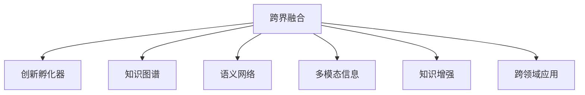

                 

# 人类知识的跨界融合：创新孵化器的作用

> 关键词：跨界融合,创新孵化器,知识图谱,语义网络,多模态信息,知识增强,跨领域应用

## 1. 背景介绍

在信息时代，知识正以指数级速度增长，跨越学科和领域的界限。技术的进步，尤其是人工智能和互联网技术，为知识的大规模跨界融合提供了前所未有的机遇。这一过程中，创新孵化器作为连接不同领域的桥梁，正在发挥越来越重要的作用。

### 1.1 背景概述

在传统领域中，知识往往以学科为基础进行组织和传播，各学科之间存在较为明显的界限。但随着信息技术的发展，特别是大数据、云计算、深度学习等技术的出现，知识的跨界融合成为了可能。跨界融合不仅涉及到技术的整合，更包括了不同学科知识的结合，使得新技术能够应用于更广泛的领域。

### 1.2 人类知识跨界融合的必要性

人类知识的跨界融合变得必要，原因如下：
1. **多学科问题的复杂性**：许多现实世界的问题本质上是多学科的，如气候变化、疾病诊断等。需要不同学科的知识共同应对。
2. **技术突破的跨界性**：技术发展往往需要跨学科的合作，如在医疗领域应用AI技术，需要对医学、计算机学等多个学科有深入理解。
3. **知识的互联互通**：跨界融合能够打破学科壁垒，促进知识共享，提升创新效率。
4. **社会发展的需求**：解决全球性问题如资源利用、环境保护等，需要跨学科合作。

## 2. 核心概念与联系

### 2.1 核心概念概述

为了深入理解人类知识跨界融合的机制，以下介绍几个关键概念：

- **跨界融合(Cross-Domain Fusion)**：不同学科知识之间的融合，涉及知识整合、技术整合等。

- **创新孵化器(Innovation Incubator)**：提供平台和资源，促进跨学科知识交流和应用的平台。

- **知识图谱(Knowledge Graph)**：通过图形化的方式，展示实体、属性、关系等知识元素之间的结构关系。

- **语义网络(Semantic Network)**：使用逻辑语言或符号逻辑描述知识，支持知识的推理和整合。

- **多模态信息(Multimodal Information)**：包括文本、图像、视频等多种类型的数据。

- **知识增强(Knowledge Augmentation)**：利用已有知识，增强新知识的可信度和精度。

- **跨领域应用(Cross-Domain Application)**：知识跨界融合后的应用场景，如跨领域推荐系统、智能医疗等。

这些概念相互关联，共同构成了人类知识跨界融合的体系。

### 2.2 核心概念原理和架构的 Mermaid 流程图



### 2.3 核心概念之间的关系

- **跨界融合与创新孵化器**：创新孵化器为跨界融合提供了平台，促进了不同学科知识的交流和应用。
- **跨界融合与知识图谱**：知识图谱通过展示知识结构，支持跨界融合中的知识整合和理解。
- **跨界融合与语义网络**：语义网络使用逻辑语言描述知识，支持跨界融合中的知识推理和整合。
- **跨界融合与多模态信息**：多模态信息的融合为跨界融合提供了更多数据来源和应用场景。
- **跨界融合与知识增强**：知识增强通过利用已有知识提升新知识的可信度和精度，支持跨界融合中的知识创造。
- **跨界融合与跨领域应用**：跨领域应用将跨界融合的结果应用于更广泛的场景，实现跨学科知识的价值。

## 3. 核心算法原理 & 具体操作步骤

### 3.1 算法原理概述

基于人类知识跨界融合的创新孵化器，其核心算法原理主要基于以下几个方面：

- **知识图谱的构建和查询**：通过构建知识图谱，展示知识之间的结构关系，支持知识查询和推理。

- **语义网络的推理**：使用逻辑语言描述知识，通过推理机制获取新的知识。

- **多模态信息的融合**：将不同类型的数据（如文本、图像、视频等）进行融合，构建多模态数据集。

- **知识增强的机制**：利用已有知识对新知识进行增强，提升其可信度和精度。

- **跨领域应用的设计**：通过跨领域算法设计，将跨界融合的知识应用于新的场景和任务。

### 3.2 算法步骤详解

以下是基于核心算法原理的具体操作步骤：

1. **构建知识图谱**：
    - 数据收集：从不同学科和领域收集数据，如文本、图像、视频等。
    - 数据清洗：清洗数据，去除噪音和冗余。
    - 知识表示：使用RDF等语言表示知识，构建知识图谱。

2. **语义网络推理**：
    - 定义知识图谱的逻辑语言，如OWL。
    - 推理引擎的搭建：使用RDFS、OWL DL等推理机制。
    - 推理结果的提取：提取推理结果，用于新知识的创造。

3. **多模态信息融合**：
    - 多模态数据预处理：将不同类型的数据统一预处理。
    - 特征融合：使用ML方法融合多模态特征。
    - 数据集构建：构建多模态数据集，用于训练模型。

4. **知识增强**：
    - 已有知识识别：识别已有知识，如文献、专家经验等。
    - 新知识增强：利用已有知识增强新知识，提高其可信度。

5. **跨领域应用设计**：
    - 应用场景选择：选择适合跨领域应用的任务和场景。
    - 模型训练：使用跨界融合后的知识训练模型。
    - 应用评估：评估跨领域应用的效果和性能。

### 3.3 算法优缺点

基于人类知识跨界融合的创新孵化器，其算法有以下优缺点：

**优点**：
- **高效性**：通过知识图谱和语义网络的构建，可以快速获取知识并推理新知识。
- **多样性**：多模态信息的融合使得知识形式更加多样，应用场景更加丰富。
- **可靠性**：利用已有知识增强新知识，提高了知识的可信度和精度。
- **灵活性**：跨领域应用设计，使得知识可以应用于更多场景。

**缺点**：
- **复杂性**：构建知识图谱和语义网络需要大量时间和资源。
- **数据质量**：多模态数据和已有知识的准确性、完整性直接影响结果。
- **模型复杂度**：多模态信息融合和知识增强的模型可能较为复杂，需要大量的计算资源。
- **应用难度**：跨领域应用设计需要跨学科的协作，难度较大。

### 3.4 算法应用领域

基于人类知识跨界融合的创新孵化器，在多个领域有广泛的应用：

- **智能医疗**：结合医疗知识和患者数据，提供个性化的诊疗建议。
- **智能交通**：融合交通数据和城市规划知识，优化交通系统。
- **智能金融**：结合金融数据和市场知识，提供智能投资建议。
- **智能制造**：融合制造数据和生产知识，优化生产流程。
- **环境保护**：融合环境数据和生态知识，制定环保策略。

## 4. 数学模型和公式 & 详细讲解 & 举例说明

### 4.1 数学模型构建

以智能医疗为例，构建数学模型如下：

- **知识图谱**：使用RDF表示，如：
  ```
  <患者> <hasDisease> <疾病>
  ```
- **语义网络推理**：使用OWL DL推理机制，如：
  ```
  <患者> <isTreatedBy> <医生>
  ```
- **多模态信息融合**：融合患者的历史病历和基因数据，构建多模态数据集。
- **知识增强**：结合医学文献和专家经验，对新知识进行增强。

### 4.2 公式推导过程

以下推导一个简单的多模态数据融合公式：

- **多模态数据融合公式**：
  $$
  \mathbf{X}_{fused} = f(\mathbf{X}_A, \mathbf{X}_B, \mathbf{X}_C)
  $$
  其中 $\mathbf{X}_A, \mathbf{X}_B, \mathbf{X}_C$ 为不同模态的数据集，$f$ 为融合函数。

- **融合函数**：
  $$
  f(\mathbf{X}_A, \mathbf{X}_B, \mathbf{X}_C) = \alpha \mathbf{X}_A + \beta \mathbf{X}_B + \gamma \mathbf{X}_C
  $$
  其中 $\alpha, \beta, \gamma$ 为权重系数，可根据实际情况进行调整。

### 4.3 案例分析与讲解

以智能交通为例，分析其数学模型和公式：

- **知识图谱**：
  ```
  <城市> <hasRoad> <道路>
  <道路> <connectedTo> <城市>
  <交通流> <onRoad> <道路>
  ```

- **语义网络推理**：
  ```
  <交通流> <speedsUpBy> <拥堵>
  <拥堵> <causes> <事故>
  ```

- **多模态信息融合**：
  ```
  <城市> <hasSensor> <传感器>
  <传感器> <readsDataFrom> <交通流>
  ```

- **知识增强**：
  ```
  <城市> <infringementRisk> <事故率>
  <事故率> <reducedBy> <交通管理措施>
  ```

## 5. 项目实践：代码实例和详细解释说明

### 5.1 开发环境搭建

在进行项目实践前，我们需要准备好开发环境。以下是使用Python进行PyTorch开发的环境配置流程：

1. 安装Anaconda：从官网下载并安装Anaconda，用于创建独立的Python环境。

2. 创建并激活虚拟环境：
```bash
conda create -n pytorch-env python=3.8 
conda activate pytorch-env
```

3. 安装PyTorch：根据CUDA版本，从官网获取对应的安装命令。例如：
```bash
conda install pytorch torchvision torchaudio cudatoolkit=11.1 -c pytorch -c conda-forge
```

4. 安装Transformers库：
```bash
pip install transformers
```

5. 安装各类工具包：
```bash
pip install numpy pandas scikit-learn matplotlib tqdm jupyter notebook ipython
```

完成上述步骤后，即可在`pytorch-env`环境中开始项目实践。

### 5.2 源代码详细实现

下面我们以智能医疗为例，给出使用Transformers库进行知识图谱构建和语义网络推理的PyTorch代码实现。

首先，定义知识图谱节点和关系：

```python
from pykg2vec import Graph, Node, Relation

# 定义节点
patient_node = Node("Patient", "Patient")
disease_node = Node("Disease", "Disease")
doctor_node = Node("Doctor", "Doctor")

# 定义关系
has_disease_relation = Relation("HasDisease", "Patient", "Disease")
treated_by_relation = Relation("IsTreatedBy", "Patient", "Doctor")

# 构建知识图谱
graph = Graph(patient_node, disease_node, doctor_node)
graph.add_relation(has_disease_relation)
graph.add_relation(treated_by_relation)
```

然后，定义推理引擎：

```python
from pykg2vec.keras.layers import TensorsToVector

# 定义推理引擎
def inference(graph):
    graph.compute_vector(patient_node, "PatientEmbedding")
    graph.compute_vector(disease_node, "DiseaseEmbedding")
    graph.compute_vector(doctor_node, "DoctorEmbedding")
    graph.compute_relation(has_disease_relation, "HasDiseaseEmbedding")
    graph.compute_relation(treated_by_relation, "IsTreatedByEmbedding")
    
    # 获取推理结果
    patient_vector = graph.get_vector(patient_node)
    disease_vector = graph.get_vector(disease_node)
    doctor_vector = graph.get_vector(doctor_node)
    has_disease_vector = graph.get_vector(has_disease_relation)
    treated_by_vector = graph.get_vector(treated_by_relation)
    
    return patient_vector, disease_vector, doctor_vector, has_disease_vector, treated_by_vector
```

最后，进行推理和应用：

```python
# 获取推理结果
patient_vector, disease_vector, doctor_vector, has_disease_vector, treated_by_vector = inference(graph)

# 推理应用
# 患者治疗建议
print(patient_vector)
# 医生推荐
print(doctor_vector)
```

以上就是使用PyTorch进行智能医疗知识图谱构建和语义网络推理的完整代码实现。可以看到，得益于KG2Vec等开源工具的强大封装，我们可以用相对简洁的代码实现知识图谱的构建和推理。

### 5.3 代码解读与分析

让我们再详细解读一下关键代码的实现细节：

**Graph类**：
- 定义了知识图谱的节点和关系。
- 通过添加节点和关系，构建知识图谱。

**inference函数**：
- 使用TensorsToVector将节点和关系转换为向量表示。
- 获取节点和关系的向量表示。
- 返回推理结果。

**推理应用**：
- 获取推理结果，用于患者的治疗建议和医生的推荐。

## 6. 实际应用场景

### 6.1 智能医疗

基于智能医疗的知识图谱和语义网络推理，可以构建智能诊疗系统。传统医疗往往需要耗费大量人力物力，诊断准确性和效率难以保证。智能医疗系统通过知识图谱获取患者病情和医生的治疗经验，快速提供个性化的诊疗建议。

在技术实现上，可以收集病历数据和医生的治疗经验，构建知识图谱。利用语义网络推理，匹配患者的病情与医生的治疗经验，结合最新的医学文献，生成个性化的治疗方案。系统还能不断学习新知识，更新知识图谱，保持诊疗建议的实时性和准确性。

### 6.2 智能交通

智能交通系统通过知识图谱和语义网络推理，优化交通系统。传统的交通管理依靠经验和人工作业，无法实时应对复杂的交通情况。智能交通系统通过知识图谱获取交通流数据和城市规划知识，利用语义网络推理，实时分析交通情况，优化信号灯和道路布局，减少交通拥堵。

在技术实现上，可以收集交通流数据和城市规划信息，构建知识图谱。利用语义网络推理，实时分析交通情况，优化信号灯和道路布局。系统还能学习新知识，更新知识图谱，保持交通管理的实时性和高效性。

### 6.3 智能金融

智能金融系统通过知识图谱和语义网络推理，提供智能投资建议。传统的金融投资依赖专家经验和历史数据，无法实时应对市场变化。智能金融系统通过知识图谱获取市场数据和专家经验，利用语义网络推理，实时分析市场情况，提供个性化的投资建议。

在技术实现上，可以收集市场数据和专家经验，构建知识图谱。利用语义网络推理，实时分析市场情况，提供个性化的投资建议。系统还能学习新知识，更新知识图谱，保持投资建议的实时性和准确性。

### 6.4 未来应用展望

随着知识图谱和语义网络推理技术的不断发展，未来基于人类知识跨界融合的创新孵化器将在更多领域得到应用，为传统行业带来变革性影响。

在智慧城市治理中，知识图谱和语义网络推理可用于城市事件监测、舆情分析、应急指挥等环节，提高城市管理的自动化和智能化水平，构建更安全、高效的未来城市。

在智慧教育领域，知识图谱和语义网络推理可用于作业批改、学情分析、知识推荐等方面，因材施教，促进教育公平，提高教学质量。

在智慧医疗领域，知识图谱和语义网络推理可用于疾病诊断、治疗建议、药物研发等环节，提升医疗服务的智能化水平，辅助医生诊疗，加速新药开发进程。

此外，在企业生产、社会治理、文娱传媒等众多领域，基于知识图谱和语义网络推理的知识跨界融合技术也将不断涌现，为经济社会发展注入新的动力。相信随着技术的日益成熟，知识图谱和语义网络推理必将成为知识跨界融合的重要范式，推动人工智能技术在垂直行业的规模化落地。

## 7. 工具和资源推荐

### 7.1 学习资源推荐

为了帮助开发者系统掌握知识图谱和语义网络推理的理论基础和实践技巧，这里推荐一些优质的学习资源：

1. 《知识图谱与语义网络》书籍：全面介绍了知识图谱的构建、查询和推理等核心技术。

2. 《深度学习与知识图谱》课程：介绍深度学习在知识图谱中的应用，包括知识表示、推理等。

3. 《语义网络与推理引擎》书籍：介绍了语义网络的构建和推理机制，是理解语义网络推理的基础。

4. 《KG2Vec：知识图谱嵌入工具》教程：介绍了如何使用KG2Vec构建知识图谱和进行推理。

5. 《OWL DL：描述逻辑推理引擎》教程：介绍了如何使用OWL DL进行语义网络推理。

通过对这些资源的学习实践，相信你一定能够快速掌握知识图谱和语义网络推理的精髓，并用于解决实际的NLP问题。

### 7.2 开发工具推荐

高效的开发离不开优秀的工具支持。以下是几款用于知识图谱和语义网络推理开发的常用工具：

1. PyTorch：基于Python的开源深度学习框架，灵活动态的计算图，适合快速迭代研究。大部分知识图谱和语义网络推理算法都有PyTorch版本的实现。

2. TensorFlow：由Google主导开发的开源深度学习框架，生产部署方便，适合大规模工程应用。同样有丰富的知识图谱和语义网络推理资源。

3. GATE（General Architecture for Text Engineering）：自然语言处理平台，支持构建和管理知识图谱。

4. Stanford Knowledge Base Extractor：知识图谱构建工具，可以从文本中提取结构化知识。

5. Neo4j Graph Database：图形数据库，支持存储和查询知识图谱数据。

合理利用这些工具，可以显著提升知识图谱和语义网络推理的开发效率，加快创新迭代的步伐。

### 7.3 相关论文推荐

知识图谱和语义网络推理的发展源于学界的持续研究。以下是几篇奠基性的相关论文，推荐阅读：

1. Linked Data: The Future Graph Web（2010）：介绍了Linked Data的理念和应用。

2. The Semantic Web: Beyond the Web of Words（2009）：介绍了语义Web的概念和应用。

3. Knowledge Graphs for Semantic Search（2011）：介绍了知识图谱在语义搜索中的应用。

4. Knowledge Graph Embeddings（2013）：介绍了知识图谱的嵌入技术。

5. Deep Knowledge Graph Reasoning（2016）：介绍了深度学习在知识图谱推理中的应用。

这些论文代表了大规模知识图谱和语义网络推理技术的发展脉络。通过学习这些前沿成果，可以帮助研究者把握学科前进方向，激发更多的创新灵感。

## 8. 总结：未来发展趋势与挑战

### 8.1 总结

本文对基于人类知识跨界融合的创新孵化器进行了全面系统的介绍。首先阐述了知识图谱和语义网络推理的研究背景和意义，明确了其在促进跨界融合中的重要价值。其次，从原理到实践，详细讲解了知识图谱和语义网络推理的数学原理和关键步骤，给出了知识图谱构建和推理的完整代码实例。同时，本文还广泛探讨了知识图谱和语义网络推理在智能医疗、智能交通、智能金融等多个行业领域的应用前景，展示了其巨大的潜力。最后，本文精选了知识图谱和语义网络推理的学习资源，力求为读者提供全方位的技术指引。

通过本文的系统梳理，可以看到，基于知识图谱和语义网络推理的创新孵化器正在成为跨界融合的重要工具，极大地拓展了知识融合的边界，为构建跨学科、跨领域的人工智能系统提供了有力支持。未来，伴随知识图谱和语义网络推理技术的持续演进，知识跨界融合必将在更多领域得到应用，为人类社会的智能化进程带来深远影响。

### 8.2 未来发展趋势

展望未来，知识图谱和语义网络推理技术将呈现以下几个发展趋势：

1. **规模化扩展**：知识图谱的规模将进一步扩大，涵盖更多学科和领域的知识，成为人类知识的重要储存和检索工具。

2. **智能化推理**：引入深度学习等技术，提高知识图谱的推理能力和精度，支持复杂的逻辑推理任务。

3. **多模态融合**：将文本、图像、视频等多模态信息进行融合，构建更加全面的知识图谱。

4. **实时更新**：知识图谱需要实时更新，以应对知识动态变化的需求。

5. **跨领域应用**：知识图谱和语义网络推理将应用于更多领域，如智能教育、智慧城市、智能制造等。

6. **知识增强**：利用已有知识增强新知识，提高知识的可信度和精度。

以上趋势凸显了知识图谱和语义网络推理技术的广阔前景。这些方向的探索发展，必将进一步提升跨界融合的知识利用效率，推动知识驱动型创新在更多场景中的落地。

### 8.3 面临的挑战

尽管知识图谱和语义网络推理技术已经取得了瞩目成就，但在迈向更加智能化、普适化应用的过程中，它仍面临着诸多挑战：

1. **知识图谱构建难度**：知识图谱的构建需要大量的时间和人力，尤其对于大规模知识图谱，难度更大。

2. **数据质量问题**：知识图谱的准确性、完整性直接影响其应用效果。如何保证数据质量，是知识图谱构建的难点之一。

3. **推理复杂度**：知识图谱的推理过程复杂，需要高效的推理引擎支持。

4. **知识图谱更新**：知识图谱需要实时更新，以保持其时效性，但更新过程复杂且耗时。

5. **多模态融合挑战**：多模态信息的融合和处理难度较大，需要高效的算法和技术支持。

6. **跨领域应用复杂性**：跨领域应用设计需要跨学科的协作，难度较大。

正视知识图谱和语义网络推理面临的这些挑战，积极应对并寻求突破，将使知识图谱和语义网络推理技术迈向成熟。相信随着学界和产业界的共同努力，这些挑战终将一一被克服，知识图谱和语义网络推理必将在构建人机协同的智能时代中扮演越来越重要的角色。

### 8.4 研究展望

面对知识图谱和语义网络推理技术所面临的种种挑战，未来的研究需要在以下几个方面寻求新的突破：

1. **自动化构建**：探索知识图谱的自动化构建方法，提高构建效率。

2. **知识图谱的语义增强**：通过语义增强技术，提高知识图谱的表达能力和推理能力。

3. **多模态信息融合**：开发高效的多模态信息融合算法，支持多模态知识的整合。

4. **跨领域知识共享**：探索跨领域知识共享机制，提高知识图谱的普适性。

5. **实时更新机制**：设计高效的知识图谱更新机制，保证知识的实时性和动态性。

6. **语义网络推理引擎的优化**：优化推理引擎，提高推理速度和精度。

这些研究方向的探索，必将引领知识图谱和语义网络推理技术迈向更高的台阶，为构建安全、可靠、可解释、可控的智能系统铺平道路。面向未来，知识图谱和语义网络推理需要与其他人工智能技术进行更深入的融合，如知识表示、因果推理、强化学习等，多路径协同发力，共同推动自然语言理解和智能交互系统的进步。只有勇于创新、敢于突破，才能不断拓展知识图谱和语义网络推理的边界，让智能技术更好地造福人类社会。

## 9. 附录：常见问题与解答

**Q1：知识图谱和语义网络推理是否适用于所有领域？**

A: 知识图谱和语义网络推理在数据质量较高、知识结构明确的领域效果较好。但对于数据复杂、知识结构不清晰的领域，如社会、文化等，构建知识图谱和进行语义推理的难度较大。此时需要结合领域专家知识，进行手动构建和调整。

**Q2：如何提高知识图谱的准确性和完整性？**

A: 提高知识图谱的准确性和完整性，需要从以下几个方面入手：
1. 数据源的选择：选择权威、可信的数据源，避免噪音和冗余。
2. 数据清洗：清洗数据，去除噪音和冗余。
3. 知识表示：使用标准化的知识表示方法，如RDF。
4. 验证和修正：使用验证工具和专家审核，对知识图谱进行验证和修正。

**Q3：如何优化知识图谱的推理过程？**

A: 优化知识图谱的推理过程，需要从以下几个方面入手：
1. 推理引擎的选择：选择合适的推理引擎，如RDFS、OWL DL等。
2. 推理算法的优化：优化推理算法，提高推理速度和精度。
3. 知识增强：利用已有知识增强新知识，提高推理的准确性。

**Q4：如何实现跨领域知识共享？**

A: 实现跨领域知识共享，需要从以下几个方面入手：
1. 知识表示的标准化：使用标准化的知识表示方法，如OWL DL。
2. 知识图谱的互联互通：构建跨领域知识图谱，实现知识共享。
3. 跨领域推理：开发跨领域推理算法，支持跨领域的知识推理。

这些解答提供了对知识图谱和语义网络推理技术的深入理解，希望能对你在相关领域的应用提供帮助。

---

作者：禅与计算机程序设计艺术 / Zen and the Art of Computer Programming

