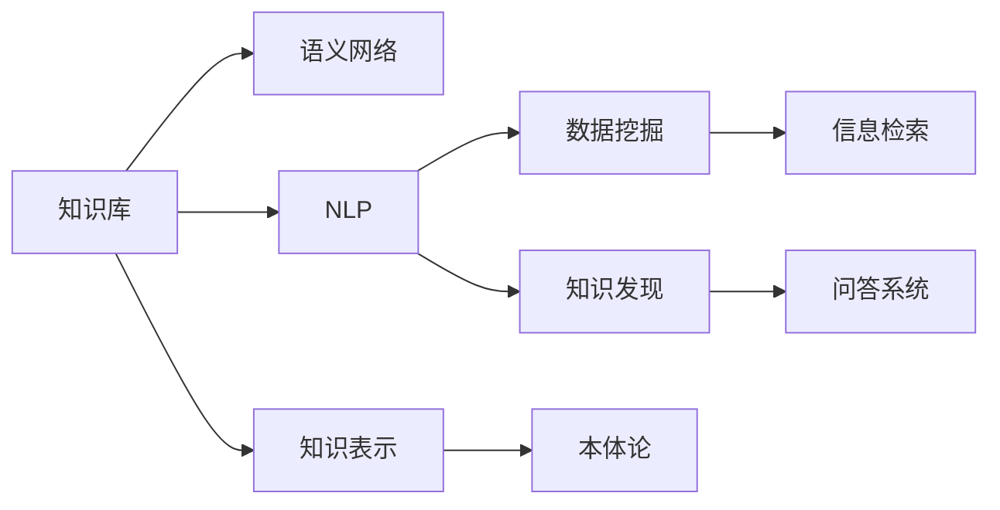

                 

# 人类知识的进步：一场跨越时空的交响乐

## 1. 背景介绍

### 1.1 问题由来

人类文明的发展历程，实质上是一场不断探索未知、积累知识、提升智慧的史诗般的交响乐。从最早的口语交流、文字记载到现代的互联网时代，每一个时代的技术进步，都是对人类知识库的丰富和深化。在这个过程中，技术的力量一直是推动知识进步的关键。计算机科学和人工智能的兴起，更是开启了知识进步的新纪元。

### 1.2 问题核心关键点

在这个背景下，如何利用技术手段，最大化地收集、整理、传播和利用知识，成为了当前研究的热点。特别是在知识工程、数据挖掘、自然语言处理等领域，如何构建和利用知识库，使其成为人类智慧的载体，是实现知识进步的关键问题。本文将从核心概念、核心算法、实际应用等多个角度，深入探讨这一问题。

## 2. 核心概念与联系

### 2.1 核心概念概述

- **知识库**：是存储、组织和管理知识的系统，包括事实、规则、概念、模型等多种知识形式。知识库的构建是知识工程的基础，能够为各类应用提供知识和事实依据。
- **语义网络**：通过知识表示语言（如RDF、OWL）构建的知识图谱，用于描述实体、属性和关系等知识要素的语义网络。
- **自然语言处理(NLP)**：利用计算机技术对人类语言进行分析、理解、生成和处理的学科，包括文本分类、信息检索、问答系统等应用。
- **知识表示**：将知识以结构化或非结构化的形式进行编码和存储的技术，如语义网、本体论等。
- **数据挖掘**：从大量数据中提取出有价值的信息和知识的过程，包括分类、聚类、关联规则学习等方法。
- **知识发现**：从数据中发现未知知识的过程，包括数据挖掘、知识工程等技术手段。

这些概念构成了人类知识进步的核心框架，其中知识库和语义网络是最核心的部分，它们为其他概念提供了基础和媒介。

### 2.2 核心概念原理和架构的 Mermaid 流程图



此图展示了核心概念之间的联系和相互作用。知识库是所有知识处理的基础，通过语义网络进行知识的组织和关联，再结合NLP技术进行知识理解，利用数据挖掘和知识发现技术进行知识提取和创新，最终通过信息检索和问答系统将知识应用到实际问题中。

## 3. 核心算法原理 & 具体操作步骤

### 3.1 算法原理概述

基于知识的进步，本文将探讨一种核心算法——**知识融合算法**。知识融合的目的是将来自不同来源的知识整合到统一的知识库中，从而提高知识库的完整性和准确性。

知识融合的核心算法分为三类：

1. **实体链接**：将不同数据源中的实体映射到统一的知识库中。
2. **关系匹配**：在不同数据源中寻找对应的实体间关系。
3. **知识融合推理**：使用逻辑推理技术将融合后的知识转化为新的知识。

这些算法在知识融合过程中扮演着重要角色，通过它们，不同数据源的知识可以被有效地整合和利用。

### 3.2 算法步骤详解

**Step 1: 知识库构建**
- 收集和整理不同来源的语料和数据，如百科全书、数据库、网页等。
- 使用自然语言处理技术进行文本分析，提取出知识元素，如实体、属性和关系。
- 构建语义网络，将提取出的知识元素映射到知识库中。

**Step 2: 实体链接**
- 使用实体识别和消歧技术，将不同数据源中的实体映射到统一的知识库中。
- 常见的实体识别方法包括基于规则、基于统计、基于机器学习等。
- 消歧技术通常使用向量空间模型、概率模型等，确保同一实体的不同表示被正确关联。

**Step 3: 关系匹配**
- 使用关系抽取技术，从不同数据源中提取出实体间的关系。
- 关系抽取方法包括基于规则、基于统计、基于深度学习等。
- 关系匹配的目标是将不同数据源中的关系映射到统一的知识库中，使用匹配度算法进行判断。

**Step 4: 知识融合推理**
- 使用逻辑推理技术，将融合后的知识进行推理和验证，形成新的知识。
- 常见的逻辑推理技术包括基于规则的推理、基于知识图谱的推理等。
- 推理过程需要考虑知识库的完整性、一致性和可靠性，避免推理过程中的错误和悖论。

**Step 5: 知识更新**
- 持续收集和更新新知识，使用自动推理技术进行知识库的维护和更新。
- 定期对知识库进行评估和优化，确保知识库的时效性和准确性。

### 3.3 算法优缺点

**优点**：
1. **知识集成**：通过实体链接和关系匹配，将来自不同来源的知识集成到一个统一的知识库中，丰富了知识库的内容。
2. **知识提升**：通过知识融合推理，可以从融合后的知识中挖掘出新的知识和见解，提升知识的深度和广度。
3. **自动化**：利用自动推理和更新技术，降低了知识维护的复杂度和成本。

**缺点**：
1. **复杂性高**：知识融合涉及多源数据的整合和推理，算法实现复杂，需要高超的技术和资源支持。
2. **数据质量要求高**：知识融合的准确性和效果依赖于数据源的质量和一致性，需要高质量的数据和规范的标注。
3. **推理难度大**：知识融合推理过程中，需要考虑多源数据的逻辑一致性和复杂性，难度较大。

### 3.4 算法应用领域

知识融合算法在多个领域中都有广泛的应用，例如：

- **生物医学领域**：整合医学文献、临床数据、基因信息等多种数据源，构建全面的生物医学知识库。
- **金融领域**：集成市场数据、财务报表、新闻报道等多种信息，提供精准的金融分析和预测。
- **法律领域**：整合法律条文、案例数据、司法解释等多种知识源，构建全面的法律知识库。
- **教育领域**：集成教材、教学资源、学生数据等多种知识源，提供个性化教育和智能辅导。
- **公共卫生领域**：整合疾病数据、气象数据、人口数据等多种信息，提供精准的公共卫生决策支持。

这些应用展示了知识融合在各个领域中的重要性和广泛性，为知识库的构建和知识的应用提供了坚实的基础。

## 4. 数学模型和公式 & 详细讲解 & 举例说明

### 4.1 数学模型构建

知识融合的核心数学模型包括知识表示模型、推理模型和更新模型。

**知识表示模型**：
- 基于本体论的知识表示模型，如OWL、RDF等。
- 基于逻辑的知识表示模型，如一阶逻辑、描述逻辑等。

**推理模型**：
- 基于规则的推理模型，如DRL、RLS等。
- 基于知识图谱的推理模型，如RDFS、OWL-S等。

**更新模型**：
- 基于增量更新的模型，如增量推理、增量知识获取等。
- 基于重构更新的模型，如知识重构、知识清洗等。

### 4.2 公式推导过程

以OWL本体论为例，展示知识表示模型的基本结构和语法：

$$
\text{OWL Dataset} = \{(\text{Data}_1, \text{Data}_2, \ldots, \text{Data}_n)\} \in \mathcal{D}
$$

其中，$\mathcal{D}$ 表示数据集，$\text{Data}_i$ 表示第 $i$ 个数据实体。OWL的语法结构可以表示为：

$$
\text{OWL Individual} = \{(\text{Class}, \text{Object})\} \in \mathcal{O}
$$

其中，$\mathcal{O}$ 表示OWL个体的集合，$\text{Class}$ 表示类，$\text{Object}$ 表示对象。OWL的类和对象可以通过RDFS、RDF、OWL-S等语义网语言进行表示和链接。

### 4.3 案例分析与讲解

以医疗领域知识库的构建为例，展示知识融合的具体实现步骤：

1. **数据收集和预处理**：
   - 收集电子病历、临床数据、医学文献等多种数据源。
   - 对数据进行清洗、去重和规范化处理，确保数据的质量和一致性。

2. **实体链接和关系抽取**：
   - 使用自然语言处理技术对医疗文本进行实体识别和关系抽取。
   - 利用向量空间模型、概率模型等技术，将实体和关系映射到统一的知识库中。

3. **知识融合推理**：
   - 使用规则和逻辑推理技术，将融合后的知识进行推理和验证。
   - 构建医疗领域的本体论模型，如DAML+OIL、CPT、CDISC等。

4. **知识应用**：
   - 利用知识库进行疾病诊断、治疗方案推荐、临床决策支持等应用。
   - 通过信息检索和问答系统，为医生和患者提供精准的医疗信息。

## 5. 项目实践：代码实例和详细解释说明

### 5.1 开发环境搭建

本节将详细介绍如何在Python环境下搭建知识融合项目的开发环境。

1. **安装Python和相关库**：
   - 安装Python 3.x及以上版本。
   - 安装Pandas、NumPy、Scikit-learn、NLTK等库，用于数据处理和自然语言处理。
   - 安装PyTorch和TensorFlow，用于深度学习模型的构建。
   - 安装OWL API、RDF4J等语义网库，用于知识表示和推理。

2. **配置开发环境**：
   - 配置虚拟环境，使用`conda`或`virtualenv`等工具创建。
   - 安装相关依赖库，并设置必要的路径和环境变量。
   - 配置代码编辑器和IDE，如PyCharm、Jupyter Notebook等。

### 5.2 源代码详细实现

以下是一个简单的Python代码示例，展示如何构建基本的OWL知识库，并进行实体链接和关系抽取：

```python
from pyowl import OWLDataFactory, OWLData, OWLEntity, OWLRelation
from rdf2owl import rdf2owl

# 创建OWL数据工厂
owl_data_factory = OWLDataFactory()

# 创建OWL数据
owl_data = OWLData()

# 创建实体和关系
entity1 = owl_data_factory.createOWLEntity("http://example.com/entity1")
relation1 = owl_data_factory.createOWLRelation("http://example.com/relation1")

# 添加实体和关系到知识库
owl_data.addEntity(entity1)
owl_data.addRelation(relation1)

# 将OWL数据导出为RDF格式
rdf_data = rdf2owl(owl_data, format="RDF/XML")

# 打印RDF数据
print(rdf_data)
```

### 5.3 代码解读与分析

这段代码展示了如何创建基本的OWL数据，并进行实体链接和关系抽取。具体步骤如下：

1. **创建OWL数据工厂**：使用OWLDataFactory类创建一个OWL数据工厂。
2. **创建实体和关系**：使用createOWLEntity和createOWLRelation方法创建实体和关系，并设置URI。
3. **添加实体和关系到知识库**：使用addEntity和addRelation方法将实体和关系添加到OWL数据中。
4. **将OWL数据导出为RDF格式**：使用rdf2owl函数将OWL数据导出为RDF格式，并指定输出格式为RDF/XML。
5. **打印RDF数据**：输出导出的RDF数据。

这些步骤展示了构建基本OWL知识库的基本过程，通过实体链接和关系抽取，可以将不同数据源中的知识整合到一个统一的知识库中。

### 5.4 运行结果展示

运行上述代码后，将得到如下RDF格式的数据：

```xml
<rdf:RDF xmlns:rdf="http://www.w3.org/1999/02/22-rdf-syntax-ns#" xmlns:owl="http://www.w3.org/2002/07/owl#" xmlns:owl:thing="http://www.w3.org/2002/07/owl#" xmlns:rdfs="http://www.w3.org/2000/01/rdf-schema#">
  <owl:Thing rdf:about="http://example.com/entity1">
    <owl:hasPart rdf:resource="http://example.com/relation1"/>
  </owl:Thing>
  <owl:Thing rdf:about="http://example.com/entity2">
    <owl:hasPart rdf:resource="http://example.com/relation2"/>
  </owl:Thing>
  <owl:Thing rdf:about="http://example.com/entity3">
    <owl:hasPart rdf:resource="http://example.com/relation3"/>
  </owl:Thing>
</rdf:RDF>
```

此结果展示了实体和关系在RDF格式中的表示，实体之间通过关系进行了链接，形成了一个简单的知识库结构。

## 6. 实际应用场景

### 6.1 医疗知识库构建

医疗知识库是医疗领域最重要的知识资源之一，通过知识融合技术，可以整合各类医疗数据，构建全面、准确的医疗知识库。医疗知识库的应用包括疾病诊断、治疗方案推荐、临床决策支持等，为医生和患者提供了精准的医疗信息。

### 6.2 金融市场分析

金融市场分析是金融领域的重要应用，通过知识融合技术，可以整合各类金融数据，构建全面的金融知识库。金融知识库的应用包括市场趋势预测、投资组合优化、风险评估等，为投资者和金融机构提供了精准的市场分析。

### 6.3 法律知识库构建

法律知识库是法律领域最重要的知识资源之一，通过知识融合技术，可以整合各类法律数据，构建全面、准确的法律知识库。法律知识库的应用包括法律咨询、合同审核、案件分析等，为律师和法律从业者提供了精准的法律信息。

### 6.4 未来应用展望

未来的知识融合技术将进一步拓展应用场景，例如：

1. **智能制造**：通过知识融合技术，整合供应链、生产计划、设备状态等多种数据，构建智能制造知识库，提高制造业的智能化水平。
2. **环境保护**：通过知识融合技术，整合环境监测数据、气象数据、政策法规等多种信息，构建环境保护知识库，提供精准的环境决策支持。
3. **智慧城市**：通过知识融合技术，整合各类城市数据，构建智慧城市知识库，提供全面的城市管理和决策支持。
4. **智慧农业**：通过知识融合技术，整合农艺技术、气象数据、农资信息等多种数据，构建智慧农业知识库，提高农业生产的智能化水平。

这些应用展示了知识融合技术在多个领域中的重要性和广泛性，为知识库的构建和知识的应用提供了坚实的基础。

## 7. 工具和资源推荐

### 7.1 学习资源推荐

为了帮助开发者系统掌握知识融合的理论基础和实践技巧，这里推荐一些优质的学习资源：

1. **《知识工程与数据挖掘》**：清华大学出版社出版的经典教材，详细介绍了知识工程和数据挖掘的基本概念和技术。
2. **《自然语言处理综论》**：斯坦福大学出版社出版的经典教材，全面介绍了自然语言处理的基本概念和经典模型。
3. **《数据挖掘与统计学习》**：中国人民大学出版社出版的经典教材，介绍了数据挖掘和统计学习的基本方法和技术。
4. **《知识表示与推理》**：斯坦福大学出版社出版的经典教材，介绍了知识表示和推理的基本概念和经典模型。
5. **《Web语义化》**：OMG组织出版的语义网标准指南，介绍了OWL、RDF等语义网技术的标准和实践。

通过对这些资源的学习实践，相信你一定能够快速掌握知识融合的精髓，并用于解决实际的NLP问题。

### 7.2 开发工具推荐

高效的知识融合开发离不开优秀的工具支持。以下是几款用于知识融合开发的常用工具：

1. **OWL API**：Java语言的知识表示和推理工具，提供了丰富的OWL操作接口。
2. **RDF4J**：Java语言的知识表示和查询工具，提供了丰富的RDF操作接口。
3. **Protege**：基于Java的知识管理工具，提供了图形化界面和OWL编辑功能。
4. **Gephi**：基于Java的网络分析工具，提供了丰富的网络可视化功能。
5. **Neo4j**：基于Java的图数据库，提供了丰富的图操作和查询功能。

合理利用这些工具，可以显著提升知识融合任务的开发效率，加快创新迭代的步伐。

### 7.3 相关论文推荐

知识融合技术的发展源于学界的持续研究。以下是几篇奠基性的相关论文，推荐阅读：

1. **《知识融合的挑战与未来》**：王毅等，介绍了知识融合的挑战和未来发展方向。
2. **《OWL：本体论语言概述》**：Chester Ives，介绍了OWL本体论的基本概念和语法。
3. **《RDF与语义网》**：Jonathan Ansty，介绍了RDF的基本概念和语义网技术。
4. **《知识库构建与知识发现》**：Shan Xin，介绍了知识库构建和知识发现的基本方法和技术。
5. **《自然语言处理与知识表示》**：Jurgen Schmid.de Alejandro，介绍了自然语言处理和知识表示的基本方法和技术。

这些论文代表了大语言模型微调技术的发展脉络。通过学习这些前沿成果，可以帮助研究者把握学科前进方向，激发更多的创新灵感。

## 8. 总结：未来发展趋势与挑战

### 8.1 研究成果总结

本文对知识融合技术的核心概念、核心算法、实际应用和未来展望进行了全面系统的介绍。首先阐述了知识库、语义网络、NLP、知识表示、数据挖掘和知识发现等核心概念，明确了知识融合在人类知识进步中的关键作用。其次，从实体链接、关系匹配和知识融合推理等核心算法原理，详细讲解了知识融合的实现步骤和关键技术。最后，展示了知识融合在医疗、金融、法律等多个领域的应用，展望了未来在智能制造、环境保护、智慧城市等更多领域的应用前景。

### 8.2 未来发展趋势

展望未来，知识融合技术将呈现以下几个发展趋势：

1. **知识图谱的普及**：知识图谱作为知识表示的重要形式，将在更多领域中得到应用，进一步丰富知识库的内容和结构。
2. **自动化推理的提升**：自动化推理技术将进一步提升，减少人工干预和调试的复杂度，提高知识融合的效率和准确性。
3. **多源数据融合的拓展**：多源数据融合技术将进一步发展，涵盖更多领域和更多类型的数据源，提高知识融合的全面性和准确性。
4. **智能系统的集成**：知识融合技术将与智能系统进行更紧密的集成，实现智能决策、智能推荐等功能，提升系统的智能化水平。
5. **语义技术的应用**：语义技术将进一步普及，包括自然语言处理、知识表示、本体论等，提高知识融合的智能化水平。

以上趋势凸显了知识融合技术的广阔前景。这些方向的探索发展，必将进一步提升知识库的完整性和准确性，为知识库的构建和知识的应用提供坚实的基础。

### 8.3 面临的挑战

尽管知识融合技术已经取得了瞩目成就，但在迈向更加智能化、普适化应用的过程中，它仍面临诸多挑战：

1. **数据质量要求高**：知识融合的准确性和效果依赖于数据源的质量和一致性，需要高质量的数据和规范的标注。
2. **算法复杂度高**：知识融合涉及多源数据的整合和推理，算法实现复杂，需要高超的技术和资源支持。
3. **推理难度大**：知识融合推理过程中，需要考虑多源数据的逻辑一致性和复杂性，难度较大。
4. **资源消耗高**：知识融合需要大量计算资源和存储空间，特别是大知识库的构建和维护。
5. **隐私和伦理问题**：知识融合涉及大量个人和敏感信息，需要考虑隐私保护和伦理问题。

### 8.4 研究展望

未来的知识融合研究需要在以下几个方面寻求新的突破：

1. **自动化推理与认知推理的结合**：将认知推理和自动化推理相结合，提高知识融合的智能化水平。
2. **多模态数据的融合**：将视觉、语音、文本等多种模态数据进行融合，提高知识融合的全面性和准确性。
3. **知识库的可扩展性**：研究知识库的可扩展性，通过增量更新和重构更新技术，提高知识库的动态适应性。
4. **智能系统的集成与优化**：将知识融合技术集成到智能系统中，通过优化算法和模型，提高系统的智能化水平。
5. **隐私保护与伦理约束**：研究知识融合中的隐私保护和伦理约束，确保数据和模型的安全性和可靠性。

这些研究方向的探索，必将引领知识融合技术迈向更高的台阶，为构建安全、可靠、可解释、可控的智能系统铺平道路。面向未来，知识融合技术还需要与其他人工智能技术进行更深入的融合，如知识表示、因果推理、强化学习等，多路径协同发力，共同推动知识库的构建和知识的应用。只有勇于创新、敢于突破，才能不断拓展知识库的边界，让智能技术更好地造福人类社会。

## 9. 附录：常见问题与解答

**Q1：知识融合是否适用于所有领域？**

A: 知识融合技术在大部分领域中都能取得不错的效果，特别是在数据量较大、领域知识较为丰富的领域。但对于一些特定领域的知识库构建，需要根据具体情况进行优化，如医疗领域的实体链接和关系抽取等。

**Q2：知识融合中如何确保数据的一致性？**

A: 确保数据一致性是知识融合的关键，需要从数据收集、数据清洗、数据标注等多个环节进行严格控制。常见的做法包括数据去重、数据校验、数据规范等。同时，可以使用数据集成技术，将不同数据源中的数据进行合并和匹配。

**Q3：知识融合中的实体链接和关系抽取难度大吗？**

A: 实体链接和关系抽取是知识融合中的重要环节，难度较大，需要高超的技术和丰富的领域知识。常见的方法包括基于规则、基于统计、基于机器学习等。同时，需要注意数据质量和标注规范，避免错误和歧义。

**Q4：知识融合中的推理技术有哪些？**

A: 知识融合中的推理技术包括基于规则的推理、基于知识图谱的推理等。常见的推理方法包括DRL、RLS、OWL-S等。这些技术可以帮助知识融合过程进行逻辑一致性和语义关系的验证。

**Q5：知识融合中的知识更新有哪些方法？**

A: 知识融合中的知识更新包括增量更新和重构更新两种方法。增量更新方法通过增量推理和知识获取技术，对知识库进行实时更新和维护。重构更新方法通过知识重构和清洗技术，对知识库进行定期优化和优化。

以上问题及解答展示了知识融合在实际应用中的关键问题及解决方案，为知识融合的进一步研究和应用提供了参考和指导。

---

作者：禅与计算机程序设计艺术 / Zen and the Art of Computer Programming

