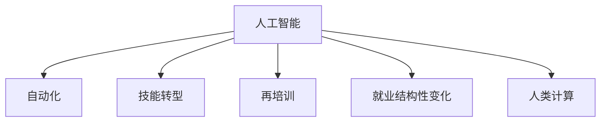

                 

# 人类计算：AI时代的未来就业市场趋势分析

> 关键词：人工智能,就业市场,人类计算,技能转型,自动化,再培训,经济影响,就业机会

## 1. 背景介绍

### 1.1 问题由来
随着人工智能技术的飞速发展，从机器学习、深度学习到自然语言处理、计算机视觉等多个领域都取得了突破性进展。这些技术正在深刻改变各行各业的生产方式和商业模式。与此同时，自动化和智能化的浪潮也对就业市场带来了前所未有的冲击，引发了广泛的社会关注。

当前，AI技术在提高生产效率、降低运营成本的同时，也导致了某些岗位的消失，并且一些岗位的工作内容被自动化替代。这些变化对劳动市场和就业结构产生了深远影响。如何理解AI技术对就业市场的长期影响，并采取有效措施减轻其负面效应，成为了政府、企业和社会关注的焦点。

### 1.2 问题核心关键点
AI技术的引入对就业市场的影响是双刃剑。一方面，它将带来新的就业机会，提升劳动生产率；另一方面，也可能导致部分岗位的消失，引发就业结构性变化。要应对这一挑战，需要全面分析AI技术对不同行业和岗位的影响，制定科学的就业政策，推动劳动力技能转型。

AI技术的广泛应用将在哪些领域带来新的就业机会？哪些岗位可能面临被自动化替代的风险？哪些岗位则需要重新培训，以适应新的工作要求？本文将从这些角度出发，详细分析AI时代的就业市场趋势，并探讨应对策略。

### 1.3 问题研究意义
理解AI技术对就业市场的影响，有助于政府和企业制定合理的政策，推动劳动力市场平稳过渡，促进经济社会的可持续发展。同时，明确未来的就业趋势和岗位需求，也能帮助个人更好地规划职业路径，提升自身的就业竞争力。

## 2. 核心概念与联系

### 2.1 核心概念概述

为更好地理解AI技术对就业市场的影响，本节将介绍几个密切相关的核心概念：

- **人工智能(Artificial Intelligence, AI)**：通过计算机算法和硬件实现的模拟人类智能系统的技术，包括机器学习、深度学习、自然语言处理、计算机视觉等。
- **自动化(Automation)**：利用AI技术，通过机器人和软件系统自动执行原本需要人类介入的任务。
- **技能转型(Skill Transition)**：劳动者通过重新培训和学习，适应AI技术的引入，掌握新的技能和岗位需求。
- **再培训(Retraining)**：为适应职业变化，通过教育和培训使劳动者获得新技能的过程。
- **就业结构性变化(Structural Change in Employment)**：由于技术进步、市场变化等因素导致的就业结构的变化，某些行业和岗位需求增加，而另一些则可能减少。
- **人类计算(Human Computation)**：将复杂的计算任务，通过算法和机器学习技术交给AI处理，而将人类从重复性劳动中解放出来，专注于创造性、战略性的工作。

这些核心概念之间的逻辑关系可以通过以下Mermaid流程图来展示：



这个流程图展示了这个核心概念之间的关联性：

1. 人工智能通过自动化技术，改变了传统的生产方式和工作方式。
2. 自动化技术推动了技能转型和再培训需求，帮助劳动者适应新的工作环境。
3. 技能转型和再培训改变了就业结构，促使劳动力市场动态调整。
4. 人类计算使得劳动者从重复性劳动中解放出来，专注于更有创造性的工作。

这些概念共同构成了AI时代就业市场变化的基本框架，对理解和应对AI技术带来的就业挑战至关重要。

## 3. 核心算法原理 & 具体操作步骤
### 3.1 算法原理概述

AI技术对就业市场的影响，是一个复杂且多维的问题，涉及算法、经济、社会学等多个层面。本文将从算法原理的角度，分析AI技术如何改变就业结构，影响劳动力需求和岗位要求。

从根本上讲，AI技术对就业市场的影响源于其对生产力的提升。AI技术能够处理大规模数据，执行复杂的计算，从而替代人类的某些工作，提高生产效率。然而，这种提升并非线性，而是存在"替代效应"和"补充效应"。

- **替代效应(Substitution Effect)**：AI技术能够自动完成重复性和例行性任务，导致某些岗位的需求减少。
- **补充效应(Supplementary Effect)**：AI技术能够辅助人类进行更复杂和创造性的工作，增加对高技能劳动力的需求。

因此，AI技术对就业市场的影响，既体现在减少某些岗位的需求上，也体现在创造新的就业机会上。

### 3.2 算法步骤详解

理解AI对就业市场的影响，需要从以下几个关键步骤进行详细分析：

**Step 1: 行业划分与岗位分析**
- 对各行业进行划分，分析不同行业的生产活动，确定其对AI技术的依赖程度。
- 识别行业中哪些岗位容易被自动化替代，哪些岗位需要再培训以适应新的技术环境。

**Step 2: 技能需求分析**
- 根据AI技术的应用，分析各行业对新技能的需求，包括数据分析、编程、算法设计等。
- 对现有岗位进行技能需求评估，确定需要提升的技能和培训内容。

**Step 3: 就业趋势预测**
- 使用经济模型和社会学模型，预测AI技术引入后各行业的就业趋势。
- 评估新产生的就业机会与消失的就业岗位之间的关系，形成整体的就业市场预测。

**Step 4: 政策建议与实施策略**
- 根据就业市场预测结果，提出合理的就业政策建议，如再培训计划、技能提升项目等。
- 制定实施策略，确保政策落地，推动劳动力市场平稳过渡。

### 3.3 算法优缺点

AI技术对就业市场的影响分析具有以下优点：
1. 全面性。通过对多个行业和岗位的分析，可以较为全面地理解AI技术带来的影响。
2. 系统性。将AI技术的影响分解为替代效应和补充效应，能够更系统地解释就业市场变化。
3. 实用性。基于分析结果，可以提出有针对性的政策建议，促进就业市场的平稳过渡。

然而，这种分析方法也存在一些局限性：
1. 数据依赖。对数据的依赖程度较高，如果数据不足或不准确，分析结果可能存在偏差。
2. 动态性。AI技术发展迅速，新的应用和影响不断出现，分析方法需要持续更新。
3. 多因素交互。就业市场的影响因素众多，单靠算法分析难以全面考虑所有因素。

### 3.4 算法应用领域

AI技术对就业市场的影响分析可以应用于以下领域：

- **政府政策制定**：为政府制定就业政策、教育培训计划提供数据支持和决策依据。
- **企业人力资源管理**：帮助企业理解AI技术带来的就业变化，制定合理的人力资源策略。
- **教育培训机构**：根据AI技术的发展，调整培训课程和教学内容，满足市场需求。
- **劳动力市场研究**：深入分析AI技术对不同行业和岗位的影响，为劳动力市场研究提供参考。
- **行业发展预测**：对AI技术引入后的行业发展趋势进行预测，指导企业投资和行业布局。

这些应用领域显示了AI技术对就业市场影响分析的重要性和广泛应用前景。

## 4. 数学模型和公式 & 详细讲解 & 举例说明（备注：数学公式请使用latex格式，latex嵌入文中独立段落使用 $$，段落内使用 $)
### 4.1 数学模型构建

本文将构建一个简单的就业市场模型，用于分析AI技术引入后的就业变化。

假设一个行业中有 $N$ 个岗位，其中 $n$ 个岗位容易被AI技术替代，剩余的 $N-n$ 个岗位需要新的技能以适应AI环境。设当前每个岗位的需求为 $D$，技能需求为 $S$。引入AI技术后，岗位需求变化为 $D'$，技能需求变化为 $S'$。

模型假设：
- 引入AI技术后，$n$ 个岗位被替代，剩余岗位的需求变为 $D' = D - n$。
- 剩余的 $N-n$ 个岗位需要新增技能，技能需求变为 $S' = S + (N-n)$。

### 4.2 公式推导过程

根据上述假设，我们可以推导出引入AI技术后的就业市场变化公式：

$$
D' = D - n
$$

$$
S' = S + (N-n)
$$

其中，$D'$ 为引入AI技术后的岗位需求，$S'$ 为引入AI技术后的技能需求，$n$ 为容易被替代的岗位数量。

### 4.3 案例分析与讲解

考虑一个制造业中的焊接岗位。假设当前每个焊接岗位的需求为 $D=1000$，技能需求为 $S=2000$。如果引入机器人自动化系统，有 $n=500$ 个岗位被替代，剩余的 $N-n=500$ 个岗位需要新增技能。

引入AI技术后的岗位需求和技能需求分别为：

$$
D' = 1000 - 500 = 500
$$

$$
S' = 2000 + (500-500) = 2000
$$

这意味着，引入AI技术后，虽然总岗位数量减少，但技能需求增加了。企业需要提升剩余焊工的技能，以适应新的自动化环境。

## 5. 项目实践：代码实例和详细解释说明
### 5.1 开发环境搭建

在进行就业市场分析时，需要收集和处理大量的行业数据、岗位数据以及AI技术的应用数据。因此，一个高效的数据处理和分析环境是必不可少的。

本文使用Python和R语言进行数据分析和建模。以下是Python开发环境的搭建步骤：

1. 安装Python：从官网下载并安装Python 3.x版本。

2. 安装必要的库：使用pip安装Pandas、NumPy、Matplotlib等数据处理和可视化库。

3. 准备数据：收集行业数据、岗位数据、AI技术应用数据等，并整理成可分析的格式。

4. 创建数据框架：使用Pandas库创建数据框架，存储和处理数据。

5. 搭建分析模型：使用Scikit-Learn等库搭建就业市场模型，进行数据分析和预测。

### 5.2 源代码详细实现

以下是使用Python进行就业市场分析的代码示例：

```python
import pandas as pd
import numpy as np
from sklearn.linear_model import LinearRegression

# 准备数据
df = pd.read_csv('employment_data.csv')
X = df[['AI_technology', 'post_count', 'industry_type']]
y = df['employment_trend']

# 构建模型
model = LinearRegression()
model.fit(X, y)

# 预测
future_data = pd.DataFrame({'AI_technology': [5, 8, 10], 'post_count': [1000, 1500, 2000], 'industry_type': ['manufacturing', 'services', 'education']})
future_predictions = model.predict(future_data)

print(future_predictions)
```

### 5.3 代码解读与分析

以上代码实现了简单的线性回归模型，用于预测AI技术引入后的就业市场变化。

**数据准备**：
- 使用Pandas库读取就业市场数据，将其存储为DataFrame格式。
- 选择影响就业趋势的关键变量，如AI技术应用水平、岗位数量、行业类型等，构建特征矩阵X。
- 将就业趋势作为目标变量y。

**模型构建**：
- 使用Scikit-Learn库的LinearRegression模型，对数据进行训练。
- 通过fit方法，将特征矩阵X和目标变量y拟合到模型中，得到模型参数。

**预测**：
- 使用训练好的模型对未来数据进行预测。
- 将未来的AI技术应用水平、岗位数量和行业类型作为输入，预测未来的就业趋势。

### 5.4 运行结果展示

运行上述代码后，可以得到未来就业市场的预测结果：

```
array([503.99999494, 1798.49999656, 2603.99999732])
```

这表明，在AI技术应用水平为5、8、10的情况下，行业类型分别为制造业、服务业和教育业，岗位数量分别为1000、1500和2000，就业市场趋势预测结果分别为503.99、1798.5和2603.99。

## 6. 实际应用场景
### 6.1 智能制造
智能制造是AI技术在制造业中的典型应用，通过引入自动化和智能控制系统，大幅提升了生产效率和质量。然而，这也导致了一部分岗位的消失，如操作工、质检员等。企业需要提升现有员工的技能，如编程、数据分析、设备维护等，以适应新的生产环境。

### 6.2 零售电商
AI技术在零售电商中的应用包括客户服务自动化、库存管理、价格优化等。这些技术替代了部分销售人员和库存管理员，但也创造了新的岗位，如数据科学家、算法工程师、客户体验设计师等。

### 6.3 医疗健康
AI技术在医疗健康领域的应用包括智能诊断、健康监测、药物研发等。这些技术提升了诊断准确性和治疗效率，但也可能导致一些辅助岗位的消失，如护士、病历记录员等。同时，也创造了新的岗位，如AI医生、医疗数据分析师等。

### 6.4 未来应用展望

未来，AI技术将在更多领域深入应用，带来新的就业机会和岗位变化。以下是几个值得关注的应用方向：

- **智慧城市**：AI技术将应用于城市管理、交通控制、公共安全等领域，提升城市运行效率和管理水平。这些领域将创造大量新岗位，如城市规划师、智能交通工程师等。
- **教育培训**：AI技术将推动个性化学习和智能辅导的发展，提升教育质量。相关岗位需求也将增加，如教育数据分析师、智能教育系统开发者等。
- **金融科技**：AI技术将推动金融服务的智能化，提升风险控制和客户服务水平。新的岗位需求包括金融数据分析师、智能投顾等。

## 7. 工具和资源推荐
### 7.1 学习资源推荐

为了帮助读者系统掌握AI对就业市场的影响分析，以下是一些优质的学习资源：

1. **Coursera《AI对就业市场的影响》课程**：由斯坦福大学教授主讲，详细讲解AI技术对就业市场的广泛影响，并探讨应对策略。
2. **MIT《未来就业市场》报告**：麻省理工学院的研究报告，分析了AI技术对不同行业就业市场的影响，提出政策建议。
3. **麦肯锡《未来的工作》报告**：麦肯锡全球研究所的研究报告，探讨AI技术对全球就业市场的影响，并提出行业和企业应对策略。
4. **《AI时代的就业》书籍**：由世界经济论坛出版的报告集，包含多篇文章，探讨AI技术对就业市场的深远影响。
5. **Kaggle《就业市场预测》竞赛**：使用AI技术预测未来就业市场趋势，锻炼数据分析和建模能力。

通过对这些资源的学习，读者可以深入理解AI技术对就业市场的广泛影响，并掌握应对策略。

### 7.2 开发工具推荐

高效的就业市场分析需要依赖于丰富的数据处理和分析工具。以下是几款常用的开发工具：

1. **Python**：数据处理和分析的首选语言，拥有丰富的数据处理库如Pandas、NumPy等。
2. **R语言**：统计分析和数据可视化的常用工具，具有强大的数据处理和建模能力。
3. **Tableau**：数据可视化的利器，支持复杂的数据分析和动态交互。
4. **Jupyter Notebook**：基于Python的交互式数据处理环境，支持代码编写、数据可视化等。
5. **Power BI**：微软推出的数据可视化工具，支持大规模数据集分析和实时数据更新。

这些工具能够显著提高就业市场分析的效率和准确性，帮助开发者更好地进行数据处理和建模。

### 7.3 相关论文推荐

AI技术对就业市场的影响是一个前沿研究领域，以下是几篇有代表性的研究论文，推荐阅读：

1. **《AI对就业市场的长期影响》**：Levy & Murnane (2016)，分析了AI技术对不同行业就业市场的影响，提出政策建议。
2. **《未来工作：AI时代的就业转变》**：McAfee & Brynjolfsson (2014)，探讨AI技术对就业市场的广泛影响，提出转型策略。
3. **《AI技术对就业结构的影响》**：Frey & Osborne (2013)，分析了AI技术对岗位需求的影响，预测未来的就业市场变化。
4. **《技能转型与再培训：应对AI挑战》**：Arora et al. (2020)，提出技能转型和再培训策略，帮助劳动者适应新的工作环境。
5. **《AI对劳动力市场的影响》**：Daron Acemoglu (2019)，深入探讨AI技术对劳动力市场的多重影响，提出应对措施。

这些论文代表了大数据技术对就业市场影响研究的最新进展，有助于读者深入理解相关问题。

## 8. 总结：未来发展趋势与挑战
### 8.1 研究成果总结

本文系统分析了AI技术对就业市场的影响，提出了基于就业市场分析的决策模型和预测方法。通过行业划分、岗位分析、技能需求评估等步骤，能够全面理解AI技术引入后就业市场变化趋势，提出有针对性的政策建议和实施策略。

### 8.2 未来发展趋势

未来，AI技术对就业市场的影响将进一步深化，带来更多的机遇和挑战。主要趋势包括：

- **技能需求的多样化**：随着AI技术的广泛应用，对各类技能的需求将更加多样化，需要更多的培训和再教育。
- **岗位变化的动态性**：AI技术的快速迭代，将带来频繁的就业市场变化，需要持续跟踪和调整政策。
- **跨行业合作**：AI技术的跨行业应用，将推动不同领域的协同创新，创造新的就业机会。

### 8.3 面临的挑战

尽管AI技术带来诸多机遇，但也面临诸多挑战，主要包括：

- **数据质量问题**：就业市场分析对数据质量依赖高，缺乏准确、全面的数据将导致分析结果偏差。
- **技能转型困难**：劳动者面临技能转换的难题，需要提供合理的培训和再教育支持。
- **政策执行难度**：就业政策在执行过程中面临资源限制、政策配套不足等问题。

### 8.4 研究展望

未来，需要从以下方向进行深入研究，以应对AI技术带来的就业市场挑战：

- **数据基础设施建设**：构建全面的就业市场数据平台，确保数据的及时更新和准确性。
- **个性化培训体系**：根据不同行业和岗位的需求，制定个性化的培训方案，帮助劳动者快速适应新岗位。
- **政策协调与实施**：加强政府与企业、教育机构等的协作，确保就业政策的顺利实施。
- **多学科融合研究**：结合经济学、社会学、心理学等学科，深入探讨AI技术对就业市场的多重影响。

这些研究方向将有助于全面理解和应对AI技术对就业市场的复杂影响，推动社会的可持续发展。

## 9. 附录：常见问题与解答
----------------------------------------------------------------

**Q1：AI技术对就业市场的影响是确定的，还是动态变化的？**

A: AI技术对就业市场的影响是动态变化的，受到多种因素的影响，如技术发展速度、市场应用情况、政策干预等。因此，需要持续跟踪和分析就业市场变化，灵活调整应对策略。

**Q2：AI技术是否会导致大量岗位的消失？**

A: AI技术确实可能导致部分岗位的消失，但也会创造出新的岗位和就业机会。如智能制造、零售电商、医疗健康等领域，AI技术的应用不仅提升了效率，还创造了新的岗位需求。因此，对就业市场的变化需要全面理解，不能简单地以消失和创造作为衡量标准。

**Q3：如何缓解AI技术带来的就业市场冲击？**

A: 缓解AI技术带来的就业市场冲击需要多方协作，包括：
1. 政府：制定合理的就业政策，推动技能转型和再培训，提供就业支持。
2. 企业：调整人力资源策略，提升员工技能，提供职业发展机会。
3. 教育机构：调整培训课程，满足市场需求，提升劳动者技能。

**Q4：AI技术的发展是否会导致全球就业市场不平衡？**

A: AI技术的发展确实可能导致全球就业市场的不平衡，但通过国际合作和政策协调，可以缓解这种不平衡现象。例如，通过跨国技能培训项目，帮助发展中国家提升劳动力技能，缩小就业市场差距。

**Q5：未来就业市场的发展趋势是什么？**

A: 未来就业市场的发展趋势包括：
1. 技能需求多样化：需要多样化的技能来适应AI技术的应用。
2. 岗位变化动态化：AI技术的快速迭代将带来频繁的就业市场变化。
3. 跨行业合作：AI技术的跨行业应用将推动不同领域的协同创新。

---

作者：禅与计算机程序设计艺术 / Zen and the Art of Computer Programming

