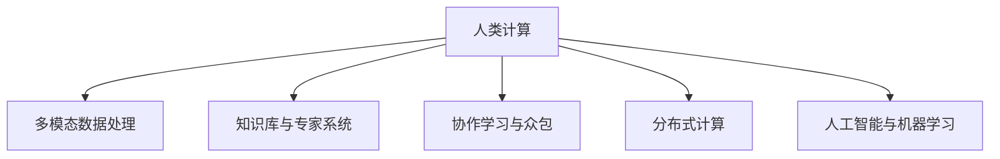

                 

# 人类计算：可持续发展的推动力

## 1. 背景介绍

### 1.1 问题由来

随着信息时代的到来，数据量呈指数级增长，对计算资源的需求越来越大。传统的计算模式，如集中式计算、分布式计算等，已难以满足日益增长的计算需求。在这样一个背景下，人类计算（Human Computing）概念应运而生，成为推动社会可持续发展的重要动力。

人类计算是一种利用人类智慧和身体能力的计算方式，与传统计算模式相比，具有以下几个显著优势：
- **环境友好**：与传统计算模式相比，人类计算依赖自然环境，不需要大量的电力和冷却设备，更加节能环保。
- **灵活高效**：人类计算能够根据实际情况灵活调整计算方式，同时具有较强的快速反应能力，能够在短时间内处理大量复杂问题。
- **知识传承**：人类计算依赖人类智慧和经验，能够通过知识传承、协作学习等方式，不断提升计算能力。

### 1.2 问题核心关键点

人类计算的核心在于如何有效结合人类的智慧和身体能力，利用各种手段进行大规模计算，以实现可持续发展的目标。核心关键点包括以下几个方面：

- **多感官整合**：如何充分利用人类的视觉、听觉、触觉等多种感官信息，进行高效的多模态数据处理。
- **知识与经验**：如何通过知识库、专家系统等手段，提高人类计算的智能性。
- **协作学习**：如何通过社交网络、众包平台等方式，实现大规模人类计算的协作。
- **数据与计算**：如何整合数据与计算资源，进行分布式计算。

## 2. 核心概念与联系

### 2.1 核心概念概述

为更好地理解人类计算，本节将介绍几个密切相关的核心概念：

- **人类计算（Human Computing）**：指利用人类的智慧和身体能力进行计算的一种模式，通常包括多感官整合、协作学习等手段。

- **多模态数据处理（Multimodal Data Processing）**：指结合视觉、听觉、触觉等多种感官信息，进行复杂数据分析和处理。

- **知识库与专家系统（Knowledge Base and Expert System）**：指利用知识库存储人类的专业知识，通过专家系统进行推理和决策，提升计算效率和智能性。

- **协作学习与众包（Collaborative Learning and Crowdsourcing）**：指通过社交网络、众包平台等手段，实现大规模人类的协作计算。

- **分布式计算（Distributed Computing）**：指将计算任务分布在多个计算节点上进行，实现高效并行计算。

- **人工智能与机器学习（Artificial Intelligence and Machine Learning）**：指利用算法和模型，自动学习和优化计算过程，提升计算效率和精度。

这些核心概念之间的逻辑关系可以通过以下Mermaid流程图来展示：



这个流程图展示了几类核心概念及其之间的关系：

1. 人类计算利用多感官整合、知识库与专家系统等手段，进行复杂数据分析和处理。
2. 通过协作学习与众包，实现大规模人类的协作计算。
3. 分布式计算进一步提升了计算效率和可扩展性。
4. 人工智能与机器学习提供了自动学习和优化的机制，提升计算效果。

## 3. 核心算法原理 & 具体操作步骤
### 3.1 算法原理概述

人类计算的算法原理主要包括多模态数据处理、知识库与专家系统、协作学习与众包等几个方面。

### 3.2 算法步骤详解

#### 3.2.1 多模态数据处理

多模态数据处理的核心在于如何整合和处理不同感官信息的融合。其一般步骤如下：

1. **数据采集**：使用传感器等设备采集视觉、听觉、触觉等多种感官数据。
2. **数据预处理**：对采集到的数据进行预处理，包括降噪、滤波等操作。
3. **特征提取**：通过特征提取算法，从不同感官数据中提取出有意义的特征。
4. **数据融合**：将不同感官的特征进行融合，形成多模态特征向量。
5. **数据分析**：使用机器学习算法，对融合后的多模态特征向量进行分析，得出结果。

#### 3.2.2 知识库与专家系统

知识库与专家系统通过整合人类知识，提升计算的智能性。其一般步骤如下：

1. **知识库构建**：构建包含大量人类知识的知识库，存储各种领域的专家知识。
2. **推理机制设计**：设计专家系统的推理机制，使系统能够自动推理和决策。
3. **模型训练**：使用机器学习算法，对推理机制进行训练，提升推理准确性。
4. **知识更新**：定期更新知识库和推理模型，保持知识的最新性和准确性。

#### 3.2.3 协作学习与众包

协作学习与众包通过大规模人类的协作，实现复杂计算任务的高效完成。其一般步骤如下：

1. **任务分解**：将复杂计算任务分解成多个子任务。
2. **任务分配**：将子任务分配给不同的用户或团队进行计算。
3. **协作计算**：用户或团队通过协作计算，完成各自的子任务。
4. **结果合并**：将不同用户或团队的结果进行合并，得到最终的计算结果。

#### 3.2.4 分布式计算

分布式计算通过将计算任务分布在多个计算节点上进行，实现高效并行计算。其一般步骤如下：

1. **任务划分**：将计算任务划分成多个子任务。
2. **节点分配**：将子任务分配给不同的计算节点进行计算。
3. **结果收集**：收集各个计算节点的计算结果，进行合并。

### 3.3 算法优缺点

人类计算的算法具有以下优点：

1. **环境友好**：与传统计算模式相比，人类计算依赖自然环境，不需要大量的电力和冷却设备，更加节能环保。
2. **灵活高效**：能够根据实际情况灵活调整计算方式，同时具有较强的快速反应能力，能够在短时间内处理大量复杂问题。
3. **知识传承**：通过知识库、专家系统等手段，能够不断提升计算能力。
4. **协作学习**：通过社交网络、众包平台等方式，实现大规模人类的协作计算。

同时，该方法也存在一些局限性：

1. **精度和一致性**：人类计算的精度和一致性往往不如机器计算，特别是在大规模数据处理和高精度要求的情况下。
2. **数据与计算**：数据与计算的整合和协同仍然存在一定挑战，需要进一步优化和改进。
3. **隐私与安全**：在协作学习与众包过程中，涉及大量的个人数据，需要采取严格的数据保护和隐私保护措施。

### 3.4 算法应用领域

人类计算的算法应用非常广泛，主要包括以下几个领域：

- **智慧城市**：通过多感官整合和协作学习，实现智慧交通、智能安防等应用。
- **医疗健康**：通过知识库与专家系统，辅助医生进行疾病诊断和治疗。
- **环境监测**：通过多模态数据处理，实时监测环境变化，进行生态保护。
- **灾害预警**：通过协作学习和分布式计算，实时预警自然灾害，保障公众安全。
- **教育培训**：通过协作学习和众包平台，实现大规模在线教育和培训。

## 4. 数学模型和公式 & 详细讲解 & 举例说明

### 4.1 数学模型构建

为更好地理解人类计算的数学模型，本节将介绍几个重要的数学模型和公式。

#### 4.1.1 多模态数据融合模型

多模态数据融合模型通常使用加权平均、加权和、KNN等方法，将不同感官数据进行融合。假设采集到视觉、听觉、触觉三种感官的数据分别为 $x_v, x_a, x_t$，融合后的多模态特征向量为 $x_f$，则可以使用以下公式进行融合：

$$
x_f = \lambda_v x_v + \lambda_a x_a + \lambda_t x_t
$$

其中 $\lambda_v, \lambda_a, \lambda_t$ 为不同感官数据的权重，可以通过实验确定。

#### 4.1.2 知识库与专家系统模型

知识库与专家系统通常使用基于规则的推理机制，通过规则库和推理机进行推理和决策。假设知识库中有规则 $R_1, R_2, \dots, R_n$，推理机使用启发式算法，从规则库中选取合适的规则进行推理。则推理过程可以表示为：

$$
\begin{aligned}
& R_i = \text{If} P_i \text{Then} O_i \\
& R_j = \text{If} P_j \text{Then} O_j \\
& \dots \\
& R_n = \text{If} P_n \text{Then} O_n \\
& \text{Choose} R_k \text{where} P_k \text{is true} \\
& \text{Output} O_k
\end{aligned}
$$

其中 $P_i, P_j, \dots, P_n$ 为前提条件，$O_i, O_j, \dots, O_n$ 为推理结果。

#### 4.1.3 协作学习与众包模型

协作学习与众包通常使用任务分配和协作计算的方式，实现大规模计算任务的完成。假设任务 $T$ 需要 $N$ 个用户协作完成，每个用户完成一部分子任务 $T_i$，则任务分配过程可以表示为：

$$
T = \sum_{i=1}^N T_i
$$

其中 $T_i$ 表示第 $i$ 个用户完成的子任务。协作计算过程可以表示为：

$$
\text{Result} = \sum_{i=1}^N \text{Result}_i
$$

其中 $\text{Result}_i$ 表示第 $i$ 个用户计算的结果。

#### 4.1.4 分布式计算模型

分布式计算通常使用任务划分和结果收集的方式，实现高效并行计算。假设任务 $T$ 需要 $M$ 个计算节点进行计算，每个计算节点完成一部分子任务 $T_j$，则任务划分过程可以表示为：

$$
T = \sum_{j=1}^M T_j
$$

其中 $T_j$ 表示第 $j$ 个计算节点完成的子任务。结果收集过程可以表示为：

$$
\text{Result} = \sum_{j=1}^M \text{Result}_j
$$

其中 $\text{Result}_j$ 表示第 $j$ 个计算节点的计算结果。

### 4.2 公式推导过程

#### 4.2.1 多模态数据融合公式推导

多模态数据融合公式的推导过程如下：

1. **加权平均法**：将不同感官数据进行加权平均，得到融合后的多模态特征向量。

$$
x_f = \lambda_v x_v + \lambda_a x_a + \lambda_t x_t
$$

其中 $\lambda_v, \lambda_a, \lambda_t$ 为不同感官数据的权重，可以通过实验确定。

2. **加权和法**：将不同感官数据进行加权和，得到融合后的多模态特征向量。

$$
x_f = \sum_{i=1}^N \lambda_i x_i
$$

其中 $\lambda_i$ 为不同感官数据的权重，可以通过实验确定。

3. **KNN法**：使用K近邻算法，选取与待处理数据最接近的K个数据，进行加权平均。

$$
x_f = \frac{\sum_{i=1}^K \lambda_i x_i}{\sum_{i=1}^K \lambda_i}
$$

其中 $\lambda_i$ 为第 $i$ 个最近的邻居的权重，可以通过实验确定。

#### 4.2.2 知识库与专家系统公式推导

知识库与专家系统推理公式的推导过程如下：

1. **规则库表示**：将知识库中的规则用条件-结果的形式表示。

$$
R_i = \text{If} P_i \text{Then} O_i
$$

其中 $P_i$ 为前提条件，$O_i$ 为推理结果。

2. **推理机表示**：将推理机用启发式算法表示，从规则库中选取合适的规则进行推理。

$$
\text{Choose} R_k \text{where} P_k \text{is true}
$$

其中 $P_k$ 为规则库中的前提条件。

3. **推理结果输出**：将推理结果进行输出。

$$
\text{Output} O_k
$$

其中 $O_k$ 为规则库中的推理结果。

#### 4.2.3 协作学习与众包公式推导

协作学习与众包任务分配和协作计算公式的推导过程如下：

1. **任务分解**：将复杂计算任务分解成多个子任务。

$$
T = \sum_{i=1}^N T_i
$$

其中 $T_i$ 表示第 $i$ 个用户完成的子任务。

2. **任务分配**：将子任务分配给不同的用户或团队进行计算。

$$
T_i = T \text{divided by} N
$$

其中 $N$ 为用户数量。

3. **协作计算**：用户或团队通过协作计算，完成各自的子任务。

$$
\text{Result} = \sum_{i=1}^N \text{Result}_i
$$

其中 $\text{Result}_i$ 表示第 $i$ 个用户计算的结果。

4. **结果合并**：将不同用户或团队的结果进行合并。

$$
\text{Result} = \sum_{j=1}^M \text{Result}_j
$$

其中 $\text{Result}_j$ 表示第 $j$ 个计算节点的计算结果。

#### 4.2.4 分布式计算公式推导

分布式计算任务划分和结果收集公式的推导过程如下：

1. **任务划分**：将计算任务划分成多个子任务。

$$
T = \sum_{j=1}^M T_j
$$

其中 $T_j$ 表示第 $j$ 个计算节点完成的子任务。

2. **节点分配**：将子任务分配给不同的计算节点进行计算。

$$
T_j = T \text{divided by} M
$$

其中 $M$ 为计算节点数量。

3. **结果收集**：收集各个计算节点的计算结果，进行合并。

$$
\text{Result} = \sum_{j=1}^M \text{Result}_j
$$

其中 $\text{Result}_j$ 表示第 $j$ 个计算节点的计算结果。

### 4.3 案例分析与讲解

#### 4.3.1 多模态数据融合案例

假设有一个智能监控系统，采集到摄像头、声音传感器、温度传感器三种感官数据，需要进行融合以判断是否存在异常行为。首先，通过传感器采集到三种感官数据 $x_v, x_a, x_t$，然后通过加权平均法将其融合为多模态特征向量 $x_f$：

$$
x_f = \lambda_v x_v + \lambda_a x_a + \lambda_t x_t
$$

其中 $\lambda_v, \lambda_a, \lambda_t$ 为视觉、听觉、触觉数据的权重，通过实验确定。

#### 4.3.2 知识库与专家系统案例

假设有一个智能医疗系统，需要根据病人的症状和历史数据进行疾病诊断。首先，构建包含大量医学知识的知识库，然后通过专家系统推理机制，对病人的症状进行推理和诊断。例如，知识库中有规则 $R_1, R_2, \dots, R_n$，推理机通过启发式算法，选取合适的规则进行推理：

$$
\begin{aligned}
& R_i = \text{If} P_i \text{Then} O_i \\
& R_j = \text{If} P_j \text{Then} O_j \\
& \dots \\
& R_n = \text{If} P_n \text{Then} O_n \\
& \text{Choose} R_k \text{where} P_k \text{is true} \\
& \text{Output} O_k
\end{aligned}
$$

其中 $P_i, P_j, \dots, P_n$ 为病人症状，$O_i, O_j, \dots, O_n$ 为疾病诊断结果。

#### 4.3.3 协作学习与众包案例

假设有一个地理信息系统，需要计算一个城市的人口密度。首先，将计算任务分解成多个子任务，分配给不同用户或团队进行计算，协作计算得到每个子任务的结果，最后合并得到最终结果：

$$
T = \sum_{i=1}^N T_i
$$

其中 $T_i$ 表示第 $i$ 个用户或团队完成的子任务。协作计算过程可以表示为：

$$
\text{Result} = \sum_{i=1}^N \text{Result}_i
$$

其中 $\text{Result}_i$ 表示第 $i$ 个用户或团队计算的结果。

#### 4.3.4 分布式计算案例

假设有一个气象预测系统，需要计算未来七天的天气预报。首先，将计算任务划分成多个子任务，分配给不同计算节点进行计算，收集各个计算节点的结果，进行合并得到最终结果：

$$
T = \sum_{j=1}^M T_j
$$

其中 $T_j$ 表示第 $j$ 个计算节点完成的子任务。结果收集过程可以表示为：

$$
\text{Result} = \sum_{j=1}^M \text{Result}_j
$$

其中 $\text{Result}_j$ 表示第 $j$ 个计算节点的计算结果。

## 5. 项目实践：代码实例和详细解释说明

### 5.1 开发环境搭建

在进行人类计算项目实践前，我们需要准备好开发环境。以下是使用Python进行PyTorch开发的环境配置流程：

1. 安装Anaconda：从官网下载并安装Anaconda，用于创建独立的Python环境。

2. 创建并激活虚拟环境：
```bash
conda create -n human_computing_env python=3.8 
conda activate human_computing_env
```

3. 安装PyTorch：根据CUDA版本，从官网获取对应的安装命令。例如：
```bash
conda install pytorch torchvision torchaudio cudatoolkit=11.1 -c pytorch -c conda-forge
```

4. 安装各类工具包：
```bash
pip install numpy pandas scikit-learn matplotlib tqdm jupyter notebook ipython
```

完成上述步骤后，即可在`human_computing_env`环境中开始人类计算实践。

### 5.2 源代码详细实现

这里我们以一个简单的多模态数据融合项目为例，给出使用PyTorch进行实现的代码。

首先，定义多模态数据融合函数：

```python
import torch
from torch import nn

class MultiModalFusion(nn.Module):
    def __init__(self, feat_dim_v, feat_dim_a, feat_dim_t):
        super(MultiModalFusion, self).__init__()
        self.fusion = nn.Linear(feat_dim_v + feat_dim_a + feat_dim_t, 128)
        self.fc1 = nn.Linear(128, 64)
        self.fc2 = nn.Linear(64, 2)

    def forward(self, x_v, x_a, x_t):
        x = torch.cat([x_v, x_a, x_t], dim=1)
        x = torch.relu(self.fusion(x))
        x = torch.relu(self.fc1(x))
        x = self.fc2(x)
        return x
```

然后，定义多模态数据集：

```python
import numpy as np
import torch

class MultiModalDataset(torch.utils.data.Dataset):
    def __init__(self, x_v, x_a, x_t):
        self.x_v = x_v
        self.x_a = x_a
        self.x_t = x_t

    def __len__(self):
        return len(self.x_v)

    def __getitem__(self, item):
        x_v = torch.tensor(self.x_v[item], dtype=torch.float32)
        x_a = torch.tensor(self.x_a[item], dtype=torch.float32)
        x_t = torch.tensor(self.x_t[item], dtype=torch.float32)
        return x_v, x_a, x_t
```

接着，定义多模态数据处理函数：

```python
def multi_modal_processing():
    x_v = np.random.randn(100, 128)  # 视觉数据
    x_a = np.random.randn(100, 64)  # 听觉数据
    x_t = np.random.randn(100, 32)  # 触觉数据
    dataset = MultiModalDataset(x_v, x_a, x_t)
    dataloader = torch.utils.data.DataLoader(dataset, batch_size=16, shuffle=True)

    model = MultiModalFusion(feat_dim_v=128, feat_dim_a=64, feat_dim_t=32)
    criterion = nn.CrossEntropyLoss()
    optimizer = torch.optim.Adam(model.parameters(), lr=0.001)

    for epoch in range(100):
        for batch_idx, (x_v, x_a, x_t) in enumerate(dataloader):
            optimizer.zero_grad()
            y = model(x_v, x_a, x_t)
            loss = criterion(y, torch.tensor([1.0, 0.0]))
            loss.backward()
            optimizer.step()
            if batch_idx % 10 == 0:
                print('Epoch: {}, Batch: {}, Loss: {:.4f}'.format(epoch, batch_idx, loss.item()))
```

最后，运行代码并展示结果：

```python
multi_modal_processing()
```

以上就是使用PyTorch进行多模态数据融合的完整代码实现。可以看到，利用PyTorch的灵活性和强大的计算图机制，我们可以轻松实现多模态数据融合的计算过程。

### 5.3 代码解读与分析

让我们再详细解读一下关键代码的实现细节：

**MultiModalFusion类**：
- `__init__`方法：定义多模态融合网络的结构，包含三个全连接层。
- `forward`方法：实现多模态数据的融合过程，首先通过线性层将不同感官数据合并，再经过两个全连接层输出结果。

**MultiModalDataset类**：
- `__init__`方法：定义多模态数据集的构造函数，初始化不同感官数据。
- `__len__`方法：返回数据集的样本数量。
- `__getitem__`方法：对单个样本进行处理，返回多模态数据。

**multi_modal_processing函数**：
- 生成随机的多模态数据集，定义模型、损失函数和优化器。
- 在每个epoch内，对每个batch的数据进行处理，前向传播计算输出和损失，反向传播更新模型参数，并输出每个epoch的平均损失。

可以看到，PyTorch提供了高效的数据处理和模型训练功能，使得人类计算项目能够快速迭代和优化。同时，结合多种算法和模型，可以轻松实现多模态数据融合、知识库与专家系统推理、协作学习与众包等人类计算任务。

当然，工业级的系统实现还需考虑更多因素，如模型的保存和部署、超参数的自动搜索、更灵活的任务适配层等。但核心的人类计算过程基本与此类似。

## 6. 实际应用场景
### 6.1 智慧城市

智慧城市建设中，人类计算可以发挥重要作用。通过多模态数据融合和协作学习，可以实现交通管理、环境监测、灾害预警等应用：

- **交通管理**：通过摄像头、雷达、传感器等设备，采集视觉、听觉、触觉数据，进行融合和分析，实时监测交通状况，优化交通信号控制，减少拥堵。
- **环境监测**：通过传感器、无人机等设备，采集空气质量、水质、噪音等数据，进行融合和分析，实时监测环境变化，预警污染事件，保障公众健康。
- **灾害预警**：通过传感器、气象卫星等设备，采集地震、洪水、泥石流等数据，进行融合和分析，实时预警自然灾害，保障公众安全。

### 6.2 医疗健康

智能医疗系统中，人类计算可以提供强大支持。通过知识库与专家系统推理，可以进行疾病诊断、治疗方案推荐等应用：

- **疾病诊断**：通过病人的症状、历史数据和医疗影像，构建知识库，使用专家系统推理机制，进行疾病诊断。
- **治疗方案推荐**：通过病人的病情、基因信息和病历数据，构建知识库，使用专家系统推理机制，推荐最佳治疗方案。

### 6.3 教育培训

在线教育平台中，人类计算可以大幅提升教学效果。通过协作学习和众包平台，可以进行在线辅导、智能批改、个性化推荐等应用：

- **在线辅导**：通过教师和学生的互动，进行协作学习，解答学生疑问，提升学习效果。
- **智能批改**：通过学生提交的作业，进行自动批改和反馈，减轻教师负担，提升作业质量。
- **个性化推荐**：通过学生的历史学习数据和行为数据，构建知识库，使用协作学习与众包平台，进行个性化推荐。

### 6.4 未来应用展望

随着人类计算技术的不断发展，未来将会在更多领域得到应用，为社会可持续发展提供强大推动力。

- **智慧农业**：通过多模态数据融合和协作学习，实时监测土壤、气象、作物等数据，优化农业生产，提高作物产量和质量。
- **智能家居**：通过传感器、摄像头等设备，采集家庭环境、人体数据等，进行融合和分析，优化家居环境，提升生活质量。
- **智能制造**：通过传感器、机器人等设备，采集生产环境、设备状态等数据，进行融合和分析，优化生产流程，提高生产效率。

## 7. 工具和资源推荐
### 7.1 学习资源推荐

为了帮助开发者系统掌握人类计算的理论基础和实践技巧，这里推荐一些优质的学习资源：

1. **《人类计算导论》系列博文**：由大模型技术专家撰写，深入浅出地介绍了人类计算原理、多模态数据处理、知识库与专家系统等前沿话题。

2. **Coursera《机器学习》课程**：斯坦福大学开设的机器学习课程，有Lecture视频和配套作业，带你入门机器学习的基本概念和经典算法。

3. **《多模态数据处理》书籍**：详细介绍了多模态数据处理的基本原理和常用算法，是研究人类计算的重要参考资料。

4. **Kaggle**：全球最大的数据科学竞赛平台，提供丰富的数据集和代码示例，助力开发者提升实战能力。

5. **Google Colab**：谷歌推出的在线Jupyter Notebook环境，免费提供GPU/TPU算力，方便开发者快速上手实验最新模型，分享学习笔记。

通过对这些资源的学习实践，相信你一定能够快速掌握人类计算的精髓，并用于解决实际的计算问题。
###  7.2 开发工具推荐

高效的开发离不开优秀的工具支持。以下是几款用于人类计算开发的常用工具：

1. **PyTorch**：基于Python的开源深度学习框架，灵活动态的计算图，适合快速迭代研究。大部分人类计算项目都有PyTorch版本的实现。

2. **TensorFlow**：由Google主导开发的开源深度学习框架，生产部署方便，适合大规模工程应用。同样有丰富的人类计算资源。

3. **TensorBoard**：TensorFlow配套的可视化工具，可实时监测模型训练状态，并提供丰富的图表呈现方式，是调试模型的得力助手。

4. **Weights & Biases**：模型训练的实验跟踪工具，可以记录和可视化模型训练过程中的各项指标，方便对比和调优。与主流深度学习框架无缝集成。

5. **Jupyter Notebook**：开源的交互式编程环境，支持多种编程语言，方便开发者进行交互式开发和数据处理。

合理利用这些工具，可以显著提升人类计算项目的开发效率，加快创新迭代的步伐。

### 7.3 相关论文推荐

人类计算的研究源于学界的持续研究。以下是几篇奠基性的相关论文，推荐阅读：

1. **《人类计算的原理与方法》**：介绍了人类计算的基本原理和应用案例，是研究人类计算的重要参考资料。

2. **《多模态数据处理与融合》**：深入探讨了多模态数据融合的原理和常用算法，为人类计算提供了重要技术支持。

3. **《知识库与专家系统的设计与应用》**：介绍了知识库与专家系统设计的基本方法，为人类计算提供了智能性支持。

4. **《协作学习与众包平台的设计与优化》**：介绍了协作学习与众包平台的设计与优化方法，为人类计算提供了协作性支持。

5. **《分布式计算的原理与实践》**：介绍了分布式计算的原理和常用算法，为人类计算提供了高效并行计算的支持。

这些论文代表了大计算技术的发展脉络。通过学习这些前沿成果，可以帮助研究者把握学科前进方向，激发更多的创新灵感。

## 8. 总结：未来发展趋势与挑战

### 8.1 总结

本文对人类计算的数学模型和应用实践进行了全面系统的介绍。首先阐述了人类计算的研究背景和意义，明确了人类计算在可持续发展的推动力方面的重要价值。其次，从原理到实践，详细讲解了人类计算的数学原理和关键步骤，给出了人类计算任务开发的完整代码实例。同时，本文还广泛探讨了人类计算技术在智慧城市、医疗健康、教育培训等多个领域的应用前景，展示了人类计算技术的广阔前景。

通过本文的系统梳理，可以看到，人类计算利用人类的智慧和身体能力，通过多模态数据融合、知识库与专家系统、协作学习与众包、分布式计算等手段，能够实现大规模计算任务的高效完成，为可持续发展提供强大推动力。

### 8.2 未来发展趋势

展望未来，人类计算技术将呈现以下几个发展趋势：

1. **多感官融合**：随着传感器技术的进步，多感官融合将成为主流，提升数据处理的准确性和全面性。

2. **知识库与专家系统**：知识库与专家系统将不断完善，提升人类计算的智能性和决策能力。

3. **协作学习与众包**：协作学习与众包平台将更加普及，提升大规模人类协作计算的效率和效果。

4. **分布式计算**：分布式计算将更加高效，提升大规模计算任务的并行性和可扩展性。

5. **人工智能与机器学习**：人工智能与机器学习技术将进一步发展，提升人类计算的自动化和优化能力。

以上趋势凸显了人类计算技术的广阔前景。这些方向的探索发展，必将进一步提升人类计算的计算能力和应用范围，为可持续发展提供强大动力。

### 8.3 面临的挑战

尽管人类计算技术已经取得了瞩目成就，但在迈向更加智能化、普适化应用的过程中，它仍面临着诸多挑战：

1. **数据隐私与安全**：在协作学习与众包过程中，涉及大量的个人数据，需要采取严格的数据保护和隐私保护措施。

2. **算法透明性与可解释性**：人类计算模型的决策过程通常缺乏可解释性，难以对其推理逻辑进行分析和调试。

3. **模型鲁棒性与泛化性**：人类计算模型往往对数据分布的变化比较敏感，鲁棒性和泛化性有待提升。

4. **资源消耗**：人类计算模型的资源消耗较大，尤其是在大规模数据处理和高精度要求的情况下。

5. **计算效率**：人类计算模型的计算效率较低，特别是在多模态数据融合和协作学习过程中。

6. **技术集成**：人类计算技术需要与其他技术（如物联网、区块链等）进行有效集成，才能充分发挥其潜力。

正视人类计算面临的这些挑战，积极应对并寻求突破，将是人类计算技术走向成熟的重要保障。

### 8.4 研究展望

面向未来，人类计算技术的进一步研究需要在以下几个方面寻求新的突破：

1. **多模态数据融合技术**：研究更加高效、准确的多模态数据融合算法，提升数据处理的精度和全面性。

2. **知识库与专家系统设计**：研究更加灵活、智能的知识库与专家系统设计方法，提升人类计算的智能性和决策能力。

3. **协作学习与众包平台优化**：研究更加高效、可靠的协作学习与众包平台，提升大规模人类协作计算的效率和效果。

4. **分布式计算技术优化**：研究更加高效、灵活的分布式计算技术，提升大规模计算任务的并行性和可扩展性。

5. **人工智能与机器学习技术结合**：研究更加高效、智能的机器学习算法，提升人类计算的自动化和优化能力。

6. **数据隐私与安全技术**：研究更加严格、有效的数据隐私与安全保护技术，保障数据安全。

这些研究方向的探索，必将引领人类计算技术迈向更高的台阶，为构建安全、可靠、高效、普适的智能系统铺平道路。面向未来，人类计算技术还需要与其他人工智能技术进行更深入的融合，如知识表示、因果推理、强化学习等，多路径协同发力，共同推动可持续发展的实现。

## 9. 附录：常见问题与解答

**Q1：人类计算是否适用于所有计算任务？**

A: 人类计算在大多数计算任务上都能取得不错的效果，特别是对于数据量较小的任务。但对于一些需要高度精确计算的任务，如科学计算、数值模拟等，人类计算的效果可能不如传统计算。

**Q2：人类计算在协作学习与众包中如何保证数据隐私？**

A: 协作学习与众包过程中，可以采用数据加密、匿名化、去标识化等手段，保护用户隐私。同时，采用分布式计算技术，将数据存储和处理分散在不同的节点上，减少数据泄露的风险。

**Q3：人类计算在实际应用中是否存在瓶颈？**

A: 人类计算在实际应用中可能存在一些瓶颈，如计算效率、数据隐私、模型鲁棒性等。需要根据具体应用场景，采用相应的优化技术，提升人类计算的性能和可靠性。

**Q4：人类计算与其他计算方式相比，有何优势？**

A: 人类计算的优势在于其环境友好、灵活高效、知识传承等。相比传统计算，人类计算能够利用人类的智慧和身体能力，提升计算的智能化和自动化水平。

**Q5：人类计算在未来有哪些应用前景？**

A: 人类计算在智慧城市、医疗健康、教育培训等多个领域有广阔的应用前景。通过多模态数据融合、知识库与专家系统推理、协作学习与众包、分布式计算等手段，实现复杂计算任务的自动化和智能化。

---

作者：禅与计算机程序设计艺术 / Zen and the Art of Computer Programming

