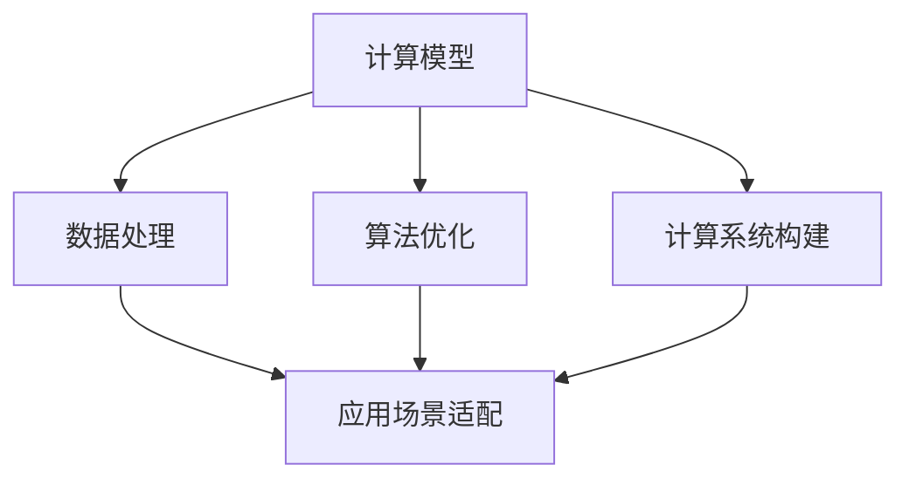

                 

# 人类计算：应用与案例分析

> 关键词：人类计算,人工智能,机器学习,深度学习,计算复杂性,模型选择,应用场景

## 1. 背景介绍

### 1.1 问题由来

随着计算技术的飞速发展，人类计算的概念和应用越来越广泛。在过去，人类计算主要指手动完成数据处理、计算任务等，但在现代社会，人类计算更侧重于通过算法、模型等工具，辅助人类完成复杂计算、数据分析、决策支持等任务。

人工智能（AI）和大数据技术的发展，使得人类计算可以借助机器学习和深度学习等手段，实现更高效、更准确的计算。这种计算不仅仅是传统的数据处理，还包括对海量数据进行模式识别、预测分析、自然语言处理、计算机视觉等高级计算任务。

然而，面对复杂计算任务，人类计算依然面临诸多挑战。如何选择合适的计算模型、如何优化算法效率、如何构建可靠的计算系统，都是当前亟待解决的问题。这些问题不仅关系到计算任务的完成质量，还影响到计算系统的可扩展性、稳定性、安全性等关键指标。

### 1.2 问题核心关键点

为了更好地理解人类计算，我们需关注以下几个核心关键点：

- **计算模型选择**：选择适当的计算模型，如线性回归、决策树、神经网络等，是高效计算的前提。
- **算法优化**：优化算法的计算复杂度和时间复杂度，提升计算速度和效率。
- **数据处理**：合理处理数据，减少数据噪声和冗余，提升计算准确性。
- **计算系统构建**：构建可靠的计算系统，保证计算任务的稳定性和安全性。
- **应用场景适配**：根据具体应用场景，适配合适的计算方案。

### 1.3 问题研究意义

人类计算的研究对于推动科技发展、促进社会进步具有重要意义：

1. **效率提升**：通过高效的计算模型和算法，可以快速处理大量数据，提升工作效率。
2. **决策支持**：计算模型和算法可以为决策提供数据支持和分析结果，辅助决策过程。
3. **创新推动**：计算技术的发展，推动了科技创新和应用场景的拓展。
4. **社会应用**：计算技术在医疗、金融、教育、交通等领域有广泛应用，提升社会服务水平。
5. **经济增长**：计算技术的发展，带动了相关产业的增长和就业机会的增加。

## 2. 核心概念与联系

### 2.1 核心概念概述

为了更好地理解人类计算的核心概念，本节将介绍几个关键概念，并展示它们之间的联系：

- **计算模型**：指用于处理数据的算法和模型，如线性回归、神经网络、决策树等。
- **算法优化**：通过优化算法实现计算效率的最大化，包括参数调优、模型压缩、并行计算等。
- **数据处理**：对原始数据进行清洗、特征提取、降维等预处理，减少数据噪声和冗余，提升数据质量。
- **计算系统构建**：构建可靠的计算系统，包括数据存储、计算资源管理、安全防护等。
- **应用场景适配**：根据具体应用场景，选择合适的计算模型和算法。

这些概念之间的关系可以通过以下Mermaid流程图来展示：



这个流程图展示了几大核心概念及其相互联系：

1. 计算模型是数据处理的基础。
2. 算法优化可以提升计算效率。
3. 数据处理是计算准确性的保障。
4. 计算系统构建是计算任务的基础设施。
5. 应用场景适配决定了计算方案的选择。

通过理解这些核心概念，我们可以更好地把握人类计算的原理和应用方法。

## 3. 核心算法原理 & 具体操作步骤

### 3.1 算法原理概述

人类计算的核心算法原理，主要涉及以下几个方面：

- **数据预处理**：包括数据清洗、特征提取、降维等，是计算准确性的基础。
- **模型选择**：根据任务特点，选择合适的计算模型，如线性回归、神经网络等。
- **算法优化**：通过优化算法参数和结构，提升计算效率和效果。
- **系统构建**：构建可靠的计算系统，保证计算任务的安全和稳定。

### 3.2 算法步骤详解

下面详细介绍人类计算的具体操作步骤：

**Step 1: 数据预处理**
- 收集原始数据，进行清洗、去重、填充缺失值等处理，确保数据质量。
- 进行特征提取，将原始数据转换为模型可用的特征向量。
- 进行降维处理，减少特征维度，提升模型训练效率。

**Step 2: 模型选择**
- 根据任务特点，选择合适的计算模型，如线性回归、决策树、神经网络等。
- 确定模型的参数和结构，并进行初步调优。

**Step 3: 算法优化**
- 使用正则化技术，如L2正则、Dropout等，防止过拟合。
- 应用优化算法，如梯度下降、Adam等，提升模型训练效率。
- 对模型进行剪枝、量化等参数优化，减少计算资源消耗。

**Step 4: 系统构建**
- 选择合适的计算平台，如CPU、GPU、TPU等。
- 配置计算资源，包括内存、存储、网络带宽等。
- 构建安全防护机制，防止数据泄露、系统攻击等。

**Step 5: 应用场景适配**
- 根据具体应用场景，适配合适的计算方案。
- 进行模型部署和测试，确保计算任务的成功执行。
- 不断优化计算方案，提升计算效果和效率。

### 3.3 算法优缺点

人类计算的算法优缺点如下：

**优点**：
1. **高效性**：通过算法优化和参数调优，可以显著提升计算效率。
2. **适应性强**：可以适应多种计算场景，如大数据处理、图像识别、自然语言处理等。
3. **精度高**：通过合理的模型选择和数据处理，可以保证计算的准确性。

**缺点**：
1. **计算资源需求高**：处理大规模数据和高维度特征需要高性能计算资源。
2. **模型复杂度较高**：复杂的模型结构可能导致过拟合等问题。
3. **算法选择困难**：选择合适的计算模型和算法是技术挑战之一。

### 3.4 算法应用领域

人类计算的算法应用领域广泛，涵盖数据科学、机器学习、深度学习、自然语言处理等多个领域。以下是几个典型应用场景：

- **数据分析**：通过算法对大规模数据进行统计分析、模式识别等。
- **图像识别**：使用卷积神经网络（CNN）进行图像分类、目标检测等。
- **自然语言处理**：使用循环神经网络（RNN）、Transformer等模型进行语言翻译、情感分析等。
- **推荐系统**：通过协同过滤、矩阵分解等算法，推荐用户可能感兴趣的商品、内容等。
- **智能控制**：使用强化学习、决策树等算法，实现智能系统的决策和控制。

## 4. 数学模型和公式 & 详细讲解 & 举例说明

### 4.1 数学模型构建

本节将介绍几个常用的数学模型，并说明其构建过程。

**线性回归模型**：
$$
y = \beta_0 + \beta_1 x_1 + \beta_2 x_2 + \cdots + \beta_n x_n + \epsilon
$$
其中，$y$ 为因变量，$x_1, x_2, \cdots, x_n$ 为自变量，$\beta_0, \beta_1, \beta_2, \cdots, \beta_n$ 为模型参数，$\epsilon$ 为随机误差。

**决策树模型**：
$$
T = \left\{ \begin{array}{ll}
    R_0, & \text{if } f(x) \leq \theta \\
    R_1, & \text{if } f(x) > \theta
\end{array} \right.
$$
其中，$T$ 为决策树，$R_0, R_1$ 为子节点，$f(x)$ 为特征函数，$\theta$ 为特征阈值。

**神经网络模型**：
$$
y = \sum_{i=1}^n w_i h_i(x) + b
$$
其中，$y$ 为输出，$h_i(x)$ 为激活函数，$w_i$ 为权重，$b$ 为偏置。

### 4.2 公式推导过程

以下我们以线性回归模型为例，推导其参数估计公式：

假设训练集为 $\{(x_1, y_1), (x_2, y_2), \cdots, (x_n, y_n)\}$，目标是最小化均方误差损失函数：

$$
\min_{\beta_0, \beta_1, \cdots, \beta_n} \sum_{i=1}^n (y_i - (\beta_0 + \beta_1 x_{1i} + \beta_2 x_{2i} + \cdots + \beta_n x_{ni}))^2
$$

将损失函数对每个参数求偏导，得到参数估计公式：

$$
\beta_j = \frac{1}{n} \sum_{i=1}^n (x_{ji} - \bar{x}_{j})(y_i - \bar{y})
$$
其中，$\bar{x}_j, \bar{y}$ 分别为自变量和因变量的均值。

### 4.3 案例分析与讲解

假设我们需要对某电商平台的销售额进行预测，目标变量为销售额（$y$），自变量包括时间（$x_1$）、广告投放量（$x_2$）、促销活动（$x_3$）等。我们可以使用线性回归模型进行预测：

1. 收集历史销售数据，包括销售额、时间、广告投放量、促销活动等。
2. 对数据进行清洗和特征提取，如将时间转换为日期特征。
3. 使用线性回归模型进行训练，得到模型参数 $\beta_0, \beta_1, \beta_2, \beta_3$。
4. 使用训练好的模型对未来销售额进行预测。

## 5. 项目实践：代码实例和详细解释说明

### 5.1 开发环境搭建

在进行人类计算项目实践前，我们需要准备好开发环境。以下是使用Python进行TensorFlow开发的环境配置流程：

1. 安装Anaconda：从官网下载并安装Anaconda，用于创建独立的Python环境。

2. 创建并激活虚拟环境：
```bash
conda create -n tf-env python=3.8 
conda activate tf-env
```

3. 安装TensorFlow：根据CUDA版本，从官网获取对应的安装命令。例如：
```bash
conda install tensorflow -c tensorflow -c conda-forge
```

4. 安装其他必要的库：
```bash
pip install numpy pandas matplotlib scikit-learn tqdm
```

完成上述步骤后，即可在`tf-env`环境中开始人类计算项目的实践。

### 5.2 源代码详细实现

下面我们以线性回归模型为例，给出使用TensorFlow进行数据预处理和模型训练的PyTorch代码实现。

```python
import tensorflow as tf
import numpy as np

# 构造训练数据
x = np.array([[1, 2], [2, 4], [3, 6], [4, 8]])
y = np.array([2, 4, 6, 8])

# 定义模型参数
beta = tf.Variable(tf.zeros([2]))

# 定义损失函数
loss_fn = tf.keras.losses.MeanSquaredError()

# 定义优化器
optimizer = tf.keras.optimizers.SGD(learning_rate=0.01)

# 训练模型
for i in range(1000):
    with tf.GradientTape() as tape:
        y_pred = beta * x
        loss = loss_fn(y, y_pred)
    gradients = tape.gradient(loss, beta)
    optimizer.apply_gradients(zip(gradients, beta))
    if i % 100 == 0:
        print("Step %d, Loss: %f" % (i, loss))

# 预测新数据
new_data = np.array([[5, 10]])
y_pred = beta * new_data
print("Prediction for [5, 10]: %f" % y_pred)
```

### 5.3 代码解读与分析

让我们再详细解读一下关键代码的实现细节：

**数据构造**：
- 构造了一个简单的训练数据集，包含4个样本，每个样本包含两个自变量和1个因变量。

**模型定义**：
- 定义了模型参数 $\beta$，用于线性回归模型的输出。
- 使用TensorFlow的内置函数定义了均方误差损失函数。

**优化器选择**：
- 使用随机梯度下降优化器（SGD），设置学习率为0.01。

**模型训练**：
- 使用for循环进行1000次迭代，每次迭代计算损失函数，并使用梯度下降更新模型参数。
- 每隔100次迭代打印一次损失函数值。

**模型预测**：
- 使用训练好的模型对新数据进行预测，得到预测值。

通过上述代码，我们实现了线性回归模型的训练和预测，展示了人类计算的基本流程。

## 6. 实际应用场景

### 6.1 智能推荐系统

智能推荐系统在电商、视频、音乐等领域有广泛应用。通过分析用户行为数据，推荐系统可以为用户推荐最感兴趣的商品、视频、歌曲等。

在技术实现上，可以使用协同过滤、矩阵分解等算法，对用户行为数据进行处理，构建推荐模型。使用TensorFlow等深度学习框架，可以实现模型训练和预测。

**代码示例**：
```python
import tensorflow as tf
import numpy as np

# 构造用户行为数据
user_id = np.array([1, 2, 3, 4, 5, 6])
item_id = np.array([1, 2, 3, 4, 5, 6])
rating = np.array([5, 3, 4, 2, 5, 1])

# 定义模型参数
latent_factor = 10
user_matrix = tf.Variable(tf.random.normal([6, latent_factor]))
item_matrix = tf.Variable(tf.random.normal([6, latent_factor]))

# 定义损失函数
loss_fn = tf.keras.losses.MeanSquaredError()

# 定义优化器
optimizer = tf.keras.optimizers.SGD(learning_rate=0.01)

# 训练模型
for i in range(1000):
    with tf.GradientTape() as tape:
        user_latent = tf.matmul(tf.reshape(user_id, [-1, 1]), user_matrix)
        item_latent = tf.matmul(tf.reshape(item_id, [-1, 1]), item_matrix)
        prediction = tf.matmul(user_latent, tf.transpose(item_latent))
        loss = loss_fn(rating, prediction)
    gradients = tape.gradient(loss, [user_matrix, item_matrix])
    optimizer.apply_gradients(zip(gradients, [user_matrix, item_matrix]))
    if i % 100 == 0:
        print("Step %d, Loss: %f" % (i, loss))

# 预测新数据
new_user_id = 7
new_item_id = 7
new_user_latent = tf.matmul(tf.reshape(new_user_id, [-1, 1]), user_matrix)
new_item_latent = tf.matmul(tf.reshape(new_item_id, [-1, 1]), item_matrix)
new_prediction = tf.matmul(new_user_latent, tf.transpose(new_item_latent))
print("Prediction for [7, 7]: %f" % new_prediction)
```

通过上述代码，我们实现了协同过滤算法的训练和预测，展示了智能推荐系统的实现流程。

### 6.2 自然语言处理

自然语言处理（NLP）在智能客服、自动翻译、文本分类等领域有广泛应用。通过分析自然语言文本，NLP系统可以实现文本理解、情感分析、自动翻译等任务。

在技术实现上，可以使用RNN、LSTM、Transformer等模型，对自然语言文本进行处理，构建NLP模型。使用TensorFlow等深度学习框架，可以实现模型训练和预测。

**代码示例**：
```python
import tensorflow as tf
import numpy as np

# 构造文本数据
text = np.array(["This is a good book.", "This is a bad book."])
label = np.array([1, 0])

# 定义模型参数
vocab_size = 100
embedding_dim = 10
rnn_units = 32

# 定义模型
model = tf.keras.Sequential([
    tf.keras.layers.Embedding(vocab_size, embedding_dim, input_length=10),
    tf.keras.layers.Bidirectional(tf.keras.layers.LSTM(rnn_units)),
    tf.keras.layers.Dense(1, activation='sigmoid')
])

# 编译模型
model.compile(optimizer='adam', loss='binary_crossentropy', metrics=['accuracy'])

# 训练模型
model.fit(text, label, epochs=10, batch_size=1)

# 预测新数据
new_text = np.array(["This is an amazing book."])
new_text = tf.keras.preprocessing.text.text_to_sequence(new_text)
new_text = np.array(new_text)
new_text = tf.keras.preprocessing.sequence.pad_sequences(new_text, maxlen=10)
new_label = model.predict(new_text)
print("Prediction for [This is an amazing book.]: %f" % new_label)
```

通过上述代码，我们实现了自然语言处理模型的训练和预测，展示了NLP系统的实现流程。

## 7. 工具和资源推荐

### 7.1 学习资源推荐

为了帮助开发者系统掌握人类计算的理论基础和实践技巧，这里推荐一些优质的学习资源：

1. **《深度学习》（Deep Learning）**：由Ian Goodfellow、Yoshua Bengio和Aaron Courville共同撰写，深入浅出地介绍了深度学习的基本原理和应用。
2. **《机器学习实战》（Machine Learning in Action）**：一本经典的机器学习入门书籍，涵盖机器学习的核心概念和实际应用案例。
3. **Kaggle数据科学竞赛**：Kaggle提供了大量的数据科学竞赛，可以通过参与竞赛来学习和实践机器学习算法。
4. **Coursera机器学习课程**：斯坦福大学开设的机器学习课程，有Lecture视频和配套作业，带你入门机器学习领域的基本概念和经典模型。
5. **Google AI博客**：Google AI博客定期发布机器学习和深度学习的最新研究成果和应用案例，是了解最新技术动态的好去处。

通过对这些资源的学习实践，相信你一定能够快速掌握人类计算的精髓，并用于解决实际的计算问题。

### 7.2 开发工具推荐

高效的开发离不开优秀的工具支持。以下是几款用于人类计算开发的常用工具：

1. **TensorFlow**：由Google主导开发的开源深度学习框架，生产部署方便，适合大规模工程应用。
2. **PyTorch**：由Facebook开发的开源深度学习框架，灵活易用，适合快速迭代研究。
3. **Jupyter Notebook**：开源的交互式编程工具，支持多种编程语言，适合进行数据探索和模型实验。
4. **Scikit-learn**：开源的机器学习库，提供了大量常用的机器学习算法和工具。
5. **TensorBoard**：TensorFlow配套的可视化工具，可实时监测模型训练状态，并提供丰富的图表呈现方式。

合理利用这些工具，可以显著提升人类计算的开发效率，加快创新迭代的步伐。

### 7.3 相关论文推荐

人类计算的研究源于学界的持续研究。以下是几篇奠基性的相关论文，推荐阅读：

1. **《神经网络与深度学习》（Neural Networks and Deep Learning）**：深度学习领域的经典书籍，由Michael Nielsen撰写，介绍了深度学习的基本原理和应用。
2. **《大数据分析》（Big Data Analytics）**：介绍大数据分析的基本概念和常用技术，涵盖数据收集、处理、分析和可视化等方面。
3. **《强化学习》（Reinforcement Learning）**：由Richard S. Sutton和Andrew G. Barto共同撰写，介绍了强化学习的核心概念和应用。
4. **《计算复杂性理论》（Computational Complexity Theory）**：介绍计算复杂性的基本概念和理论，是理论计算的重要分支。
5. **《分布式计算》（Distributed Computing）**：介绍分布式计算的基本概念和常用技术，涵盖任务调度、数据分区、容错机制等方面。

这些论文代表了大计算技术的发展脉络。通过学习这些前沿成果，可以帮助研究者把握学科前进方向，激发更多的创新灵感。

## 8. 总结：未来发展趋势与挑战

### 8.1 总结

本文对人类计算的应用与案例进行了全面系统的介绍。首先阐述了人类计算的背景和意义，明确了人类计算在高效计算、数据处理、决策支持等方面的价值。其次，从原理到实践，详细讲解了人类计算的数学模型和操作步骤，给出了具体代码实现。同时，本文还广泛探讨了人类计算在推荐系统、自然语言处理等多个领域的应用前景，展示了人类计算的广阔应用范围。此外，本文精选了人类计算的学习资源，力求为读者提供全方位的技术指引。

通过本文的系统梳理，可以看到，人类计算在现代社会有着广泛的应用，其高效、准确、智能的特性，使得其在多个领域带来了显著的变革。未来，随着计算技术的不断发展，人类计算将更加深入地融入到生产生活中，成为推动科技和社会进步的重要力量。

### 8.2 未来发展趋势

展望未来，人类计算的发展趋势如下：

1. **计算模型多样化**：未来的计算模型将更加多样化，涵盖神经网络、图模型、量子计算等。
2. **算法优化智能化**：随着AI和自动化技术的发展，算法优化将变得更加智能化，能够自动调整参数和结构。
3. **数据处理自动化**：自动化数据清洗、特征提取、降维等技术将逐步普及，提升数据处理效率。
4. **计算系统云化**：云计算和大数据技术的发展，使得计算系统更加云化，方便部署和扩展。
5. **计算任务场景化**：未来的计算任务将更加场景化，根据具体需求定制化的计算方案将越来越普遍。

### 8.3 面临的挑战

尽管人类计算已经取得了显著成就，但在迈向更加智能化、普适化应用的过程中，它仍面临诸多挑战：

1. **计算资源需求高**：处理大规模数据和高维度特征需要高性能计算资源。
2. **模型复杂度较高**：复杂的模型结构可能导致过拟合等问题。
3. **算法选择困难**：选择合适的计算模型和算法是技术挑战之一。
4. **计算效率提升有限**：计算效率提升的瓶颈逐步显现，需要新的计算模型和技术。
5. **数据安全问题**：大规模数据处理和存储，带来了数据安全问题，需要可靠的数据保护措施。

### 8.4 研究展望

未来的研究需要在以下几个方面寻求新的突破：

1. **新计算模型的探索**：探索新的计算模型，如量子计算、神经形态计算等，提升计算能力。
2. **智能算法的研发**：开发智能算法，自动调整参数和结构，提升计算效率和效果。
3. **自动化数据处理技术**：开发自动化数据清洗、特征提取等技术，提升数据处理效率。
4. **云平台建设**：建设可靠的云平台，提供高性能计算资源，支持大规模数据处理。
5. **计算任务场景化**：根据具体需求，定制化的计算方案，提升计算任务的效果和效率。

这些研究方向将推动人类计算技术不断进步，为各行各业带来新的变革和创新。

## 9. 附录：常见问题与解答

**Q1：人类计算的计算模型选择有哪些？**

A: 常用的计算模型包括线性回归、决策树、神经网络、RNN、LSTM、Transformer等。根据任务特点，选择合适的计算模型是计算成功的关键。

**Q2：如何优化计算模型的训练过程？**

A: 可以使用正则化技术，如L2正则、Dropout等，防止过拟合。同时，使用优化算法，如梯度下降、Adam等，提升模型训练效率。

**Q3：人类计算的数据处理主要包括哪些步骤？**

A: 数据处理主要包括数据清洗、特征提取、降维等步骤。通过合理的预处理，可以提升数据质量，减少数据噪声和冗余。

**Q4：人类计算的应用场景有哪些？**

A: 人类计算的应用场景广泛，包括智能推荐系统、自然语言处理、图像识别、视频处理、金融分析等。

**Q5：如何使用TensorFlow进行模型训练？**

A: 可以使用TensorFlow的Keras API进行模型训练，通过定义模型结构、编译模型、训练模型等步骤，实现模型的训练和预测。

通过本文的系统梳理，可以看到，人类计算在现代社会有着广泛的应用，其高效、准确、智能的特性，使得其在多个领域带来了显著的变革。未来，随着计算技术的不断发展，人类计算将更加深入地融入到生产生活中，成为推动科技和社会进步的重要力量。

