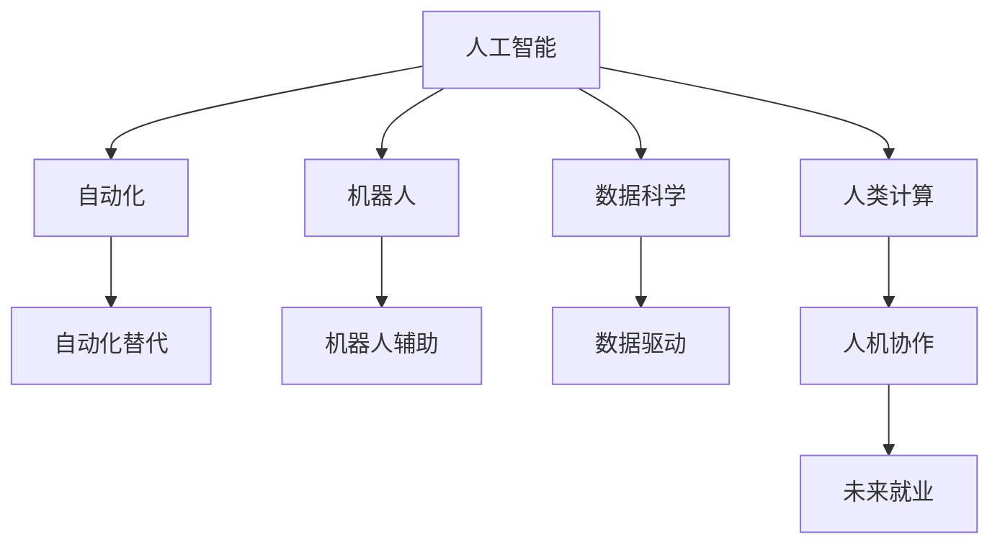

                 

# 人类计算：未来的工作和就业

> 关键词：未来就业, 人工智能(AI), 人类计算, 数据科学, 自动化, 机器人

## 1. 背景介绍

### 1.1 问题由来

随着人工智能(AI)技术的快速发展和广泛应用，未来工作和就业将面临前所未有的挑战和机遇。从农业、制造业到服务业，越来越多的岗位被机器人和自动化系统所取代，而同时，新兴的AI技术和数据科学岗位又不断涌现。这种变化对劳动力市场、教育体系和社会治理带来了深刻影响，迫切需要从技术和政策层面进行综合应对。

### 1.2 问题核心关键点

当前，人类计算在许多领域已经开始改变工作性质和就业模式。主要体现在以下几个方面：

1. **自动化替代**：传统重复性高的岗位（如流水线作业、数据录入等）被自动化系统和机器人所替代。
2. **AI增强**：智能助手、决策支持系统等AI工具辅助人类完成复杂任务，提升工作效率和质量。
3. **数据科学驱动**：数据分析、数据处理和数据科学家的需求激增，大数据应用渗透到各行各业。
4. **人机协作**：AI和人类之间的协作模式正在兴起，人机共生成为未来工作的新常态。
5. **技能升级**：人工智能时代要求员工不断学习新技能，适应技术变革带来的职业要求。

### 1.3 问题研究意义

研究人类计算对未来工作和就业的影响，对于理解就业市场动态、制定劳动政策、优化教育培训以及推动社会经济的可持续发展具有重要意义。通过对未来工作模式的预测和规划，我们可以更有效地应对AI带来的挑战，挖掘新的就业机会，为社会创造更多的价值。

## 2. 核心概念与联系

### 2.1 核心概念概述

为更好地理解人工智能对未来工作和就业的影响，本节将介绍几个关键概念：

- **人工智能(AI)**：指通过计算机模拟人类智能行为的技术，包括机器学习、深度学习、自然语言处理等。
- **自动化**：指使用机器和软件代替人力完成重复性、低价值的工作。
- **机器人**：指用于执行各种任务或辅助人类工作的自主或半自主机器。
- **数据科学**：指从大量数据中提取知识、发现规律，用于决策支持和管理优化。
- **人类计算**：指人类与AI系统共同完成计算任务，人机协作模式下的新工作方式。
- **未来就业**：指在AI、自动化、数据科学等技术驱动下，未来劳动力市场的变化趋势和就业形态。

这些概念之间的逻辑关系可以通过以下Mermaid流程图来展示：



这个流程图展示了人工智能、自动化、机器人、数据科学、人类计算以及未来就业之间的逻辑关系：

1. 人工智能通过自动化和机器人实现工作替代和增强。
2. 数据科学从大量数据中提取知识和规律，辅助决策和优化。
3. 人类计算是人机协作的新模式，提升工作质量和效率。
4. 未来就业是AI、自动化、数据科学和人类计算共同作用的结果。

## 3. 核心算法原理 & 具体操作步骤
### 3.1 算法原理概述

人类计算的本质是人工智能与人类共同完成计算任务，通过优化人机协作模式，提高工作效率和质量。其核心算法原理包括以下几个方面：

1. **AI决策支持**：利用机器学习算法进行数据分析和预测，辅助人类做出决策。
2. **自动化流程**：通过机器人和流程自动化工具完成重复性、低价值的任务。
3. **数据增强**：使用数据增强技术提升模型训练效果，提高AI系统的准确性和鲁棒性。
4. **人机协作**：设计合理的人机交互界面，使人类和AI系统能够高效协同工作。
5. **技能培训**：通过教育和培训，提升员工适应AI和自动化环境的能力。

### 3.2 算法步骤详解

人类计算的实现步骤通常包括以下几个关键环节：

**Step 1: 确定工作流程**

对需要优化的工作流程进行分析，确定哪些任务适合自动化，哪些任务需要AI增强。例如，制造业中的装配线可以通过机器人自动化，而质量检测则可以使用AI进行图像识别。

**Step 2: 选择技术工具**

根据任务特点选择合适的AI和自动化工具。例如，使用机器学习算法进行图像识别，使用自然语言处理技术进行文本分析。

**Step 3: 设计协作界面**

设计合理的人机交互界面，使AI系统能够根据用户指令进行操作。例如，使用语音助手进行语音交互，或通过图形界面进行可视化操作。

**Step 4: 实施和测试**

将选定的AI和自动化技术应用到实际工作中，并进行测试和优化。例如，对机器人的装配精度进行测试，对AI模型的预测准确率进行评估。

**Step 5: 持续改进**

根据实际使用情况，不断改进AI和自动化系统，提升其性能和效率。例如，通过数据反馈优化模型参数，更新机器人操作流程。

### 3.3 算法优缺点

人类计算的优点包括：

1. **提升效率**：通过自动化和AI增强，显著提升工作效率和质量。
2. **降低成本**：自动化和机器人可以减少人力成本，减少错误率。
3. **提高准确性**：AI系统可以处理复杂任务，减少人为误差。

但同时也存在一些缺点：

1. **技能门槛高**：需要员工具备一定的技术基础，才能与AI系统协作。
2. **依赖技术支持**：需要稳定的技术支持和维护，避免系统故障。
3. **数据隐私风险**：使用AI系统处理敏感数据时，需注意数据隐私和安全问题。

### 3.4 算法应用领域

人类计算在多个领域得到了广泛应用，例如：

- **制造业**：通过机器人和自动化系统完成装配、质检、物流等任务。
- **服务业**：使用智能客服、决策支持系统等提升客户体验和运营效率。
- **医疗**：利用AI进行病历分析、影像诊断等，提升医疗服务质量。
- **金融**：使用AI进行风险评估、交易分析等，提升金融服务水平。
- **教育**：利用AI进行个性化教学、智能评估等，提升教育效果。

## 4. 数学模型和公式 & 详细讲解 & 举例说明

### 4.1 数学模型构建

人类计算的效果评估可以通过以下数学模型来量化：

1. **效率提升率**：自动化和AI增强前后工作效率的提升比例。
2. **成本节约率**：自动化和AI系统带来的成本节约比例。
3. **准确性提升**：AI系统在特定任务上的准确性提升比例。

### 4.2 公式推导过程

以自动化替代为例，假设人工完成某任务需要 $T_h$ 小时，自动化系统完成同样的任务需要 $T_a$ 小时，则效率提升率为：

$$
\text{效率提升率} = \frac{T_h - T_a}{T_h} \times 100\%
$$

### 4.3 案例分析与讲解

假设某工厂使用机器人自动化装配，原本由人工完成装配需要 2 小时/件，使用机器人后，每件装配时间减少到 0.5 小时。则效率提升率为：

$$
\text{效率提升率} = \frac{2 - 0.5}{2} \times 100\% = 75\%
$$

## 5. 项目实践：代码实例和详细解释说明
### 5.1 开发环境搭建

在进行人类计算的实践前，我们需要准备好开发环境。以下是使用Python进行TensorFlow开发的环境配置流程：

1. 安装Anaconda：从官网下载并安装Anaconda，用于创建独立的Python环境。

2. 创建并激活虚拟环境：
```bash
conda create -n tf-env python=3.8 
conda activate tf-env
```

3. 安装TensorFlow：根据CUDA版本，从官网获取对应的安装命令。例如：
```bash
conda install tensorflow -c conda-forge
```

4. 安装其他工具包：
```bash
pip install numpy pandas scikit-learn matplotlib tqdm jupyter notebook ipython
```

完成上述步骤后，即可在`tf-env`环境中开始实践。

### 5.2 源代码详细实现

这里我们以自动化装配线为例，给出使用TensorFlow进行装配线优化的PyTorch代码实现。

首先，定义装配任务的数据处理函数：

```python
import tensorflow as tf
from tensorflow.keras.layers import Input, Dense, Flatten

class AssemblyLine(tf.keras.Model):
    def __init__(self, num_features):
        super(AssemblyLine, self).__init__()
        self.flatten = Flatten()
        self.dense1 = Dense(64, activation='relu')
        self.dense2 = Dense(1, activation='sigmoid')

    def call(self, x):
        x = self.flatten(x)
        x = self.dense1(x)
        x = self.dense2(x)
        return x

# 定义装配任务的特征和标签
num_features = 10
train_features = np.random.randn(1000, num_features)
train_labels = np.random.randint(0, 2, size=(1000, 1))

# 创建模型
model = AssemblyLine(num_features)

# 定义损失函数和优化器
loss_fn = tf.keras.losses.BinaryCrossentropy(from_logits=True)
optimizer = tf.keras.optimizers.Adam()

# 训练模型
def train_epoch(model, features, labels, batch_size):
    dataloader = tf.data.Dataset.from_tensor_slices((features, labels)).batch(batch_size)
    for batch in dataloader:
        with tf.GradientTape() as tape:
            logits = model(batch[0])
            loss = loss_fn(labels, logits)
        grads = tape.gradient(loss, model.trainable_variables)
        optimizer.apply_gradients(zip(grads, model.trainable_variables))

# 开始训练
train_features, train_labels = train_features, train_labels
train_epoch(model, train_features, train_labels, batch_size=32)
```

然后，定义评估函数：

```python
def evaluate(model, features, labels):
    with tf.GradientTape() as tape:
        logits = model(features)
        loss = loss_fn(labels, logits)
    return loss

# 评估模型
test_features = np.random.randn(100, num_features)
test_labels = np.random.randint(0, 2, size=(100, 1))
test_loss = evaluate(model, test_features, test_labels)
print(f"Test Loss: {test_loss:.3f}")
```

最后，启动训练流程并在测试集上评估：

```python
epochs = 10
batch_size = 32

for epoch in range(epochs):
    train_epoch(model, train_features, train_labels, batch_size)
    test_loss = evaluate(model, test_features, test_labels)
    print(f"Epoch {epoch+1}, test loss: {test_loss:.3f}")

```

以上就是使用TensorFlow进行装配线优化的完整代码实现。可以看到，借助TensorFlow，我们可以轻松地搭建和训练装配线自动化模型，实现装配效率的提升。

### 5.3 代码解读与分析

让我们再详细解读一下关键代码的实现细节：

**AssemblyLine类**：
- `__init__`方法：初始化模型的各个层。
- `call`方法：定义模型前向传播的过程。

**训练和评估函数**：
- 使用TensorFlow的DataLoader对数据集进行批次化加载，供模型训练和推理使用。
- 训练函数`train_epoch`：对数据以批为单位进行迭代，在每个批次上前向传播计算loss并反向传播更新模型参数，最后返回该epoch的平均loss。
- 评估函数`evaluate`：与训练类似，不同点在于不更新模型参数，并在每个batch结束后将预测和标签结果存储下来，最后使用TensorFlow的损失函数计算输出。

**训练流程**：
- 定义总的epoch数和batch size，开始循环迭代
- 每个epoch内，先在训练集上训练，输出平均loss
- 在测试集上评估，输出模型在测试集上的性能
- 所有epoch结束后，持续监测模型在测试集上的性能变化

可以看到，TensorFlow使得模型训练的实现变得简洁高效。开发者可以将更多精力放在数据处理、模型改进等高层逻辑上，而不必过多关注底层的实现细节。

当然，工业级的系统实现还需考虑更多因素，如模型的保存和部署、超参数的自动搜索、更灵活的任务适配层等。但核心的训练范式基本与此类似。

## 6. 实际应用场景
### 6.1 制造业

在制造业中，自动化和AI技术的应用已经成为趋势。传统的流水线作业、质量检测等岗位正在逐步被机器人取代，而AI系统则被用来提升生产效率和产品品质。

例如，使用机器人和自动化系统完成零部件装配，减少人工错误率，提高装配效率。使用AI进行品质检测，通过图像识别和数据分析，自动识别和分类不合格品。这些技术的应用，极大地提升了制造业的生产效率和产品竞争力。

### 6.2 服务业

在服务业中，智能客服、智能推荐等AI应用正在广泛普及。传统的人力客服、手写记录等岗位正在被智能客服系统所取代，而AI系统则被用来提升服务质量和客户体验。

例如，使用智能客服系统处理客户咨询，减少人力成本，提高服务响应速度。使用AI进行用户画像分析，推荐个性化的产品和服务，提升用户满意度和粘性。这些技术的应用，使得服务业能够更好地满足客户需求，提升服务质量。

### 6.3 医疗

在医疗领域，AI技术被广泛应用于疾病诊断、病历分析、治疗方案制定等环节。传统的纸质病历、手写记录等正在被电子病历、智能诊断系统所取代，而AI系统则被用来提升医疗服务的智能化水平。

例如，使用AI进行影像分析，自动识别和分类异常情况，辅助医生进行诊断。使用AI进行病历分析，提取患者信息和历史数据，提供治疗方案建议。这些技术的应用，提高了医疗服务的诊断准确性和治疗效果，降低了误诊率和医疗成本。

### 6.4 金融

在金融领域，AI技术被广泛应用于风险评估、交易分析、投资决策等环节。传统的分析报告、手工记录等正在被智能分析系统所取代，而AI系统则被用来提升金融服务的智能化水平。

例如，使用AI进行交易分析，实时监测市场动态，提供交易建议。使用AI进行风险评估，自动识别和预测金融风险，提供风险预警。这些技术的应用，提高了金融服务的智能化水平，提升了投资决策的准确性和安全性。

### 6.5 教育

在教育领域，AI技术被广泛应用于个性化教学、智能评估等环节。传统的纸质试卷、手工评分等正在被智能评估系统所取代，而AI系统则被用来提升教育服务的智能化水平。

例如，使用AI进行个性化教学，根据学生的学习行为和成绩，推荐适合的课程和练习。使用AI进行智能评估，自动批改试卷，提供详细的评分和反馈。这些技术的应用，提高了教育服务的个性化和智能化水平，提升了教育效果和学生体验。

## 7. 工具和资源推荐
### 7.1 学习资源推荐

为了帮助开发者系统掌握人类计算的理论基础和实践技巧，这里推荐一些优质的学习资源：

1. **《深度学习》课程**：斯坦福大学开设的深度学习课程，涵盖深度学习的基本概念和算法，适合初学者入门。

2. **《机器学习实战》书籍**：通过实际案例讲解机器学习的基本原理和应用，适合动手实践。

3. **TensorFlow官方文档**：TensorFlow的官方文档，提供了全面的API文档和教程，是学习TensorFlow的必备资料。

4. **Kaggle竞赛**：Kaggle是全球最大的数据科学竞赛平台，通过参加竞赛可以积累实际经验，提升解决问题的能力。

5. **Coursera课程**：Coursera提供了大量高质量的数据科学和机器学习课程，适合系统学习。

通过对这些资源的学习实践，相信你一定能够快速掌握人类计算的精髓，并用于解决实际的AI问题。

### 7.2 开发工具推荐

高效的开发离不开优秀的工具支持。以下是几款用于人类计算开发的常用工具：

1. **TensorFlow**：由Google主导开发的深度学习框架，生产部署方便，适合大规模工程应用。

2. **PyTorch**：基于Python的开源深度学习框架，灵活动态的计算图，适合快速迭代研究。

3. **Jupyter Notebook**：交互式的开发环境，支持多种编程语言和工具，方便开发和分享。

4. **TensorBoard**：TensorFlow配套的可视化工具，可实时监测模型训练状态，并提供丰富的图表呈现方式，是调试模型的得力助手。

5. **GitHub**：代码托管平台，提供版本控制和协作功能，方便团队开发和共享。

合理利用这些工具，可以显著提升人类计算的开发效率，加快创新迭代的步伐。

### 7.3 相关论文推荐

人类计算和AI技术的发展源于学界的持续研究。以下是几篇奠基性的相关论文，推荐阅读：

1. **《Deep Learning》书籍**：深度学习的经典教材，涵盖深度学习的基本原理和应用，适合系统学习。

2. **《人类计算的未来》论文**：探讨了人类计算对未来工作和就业的影响，提出了一系列未来就业趋势和挑战。

3. **《机器学习实战》书籍**：通过实际案例讲解机器学习的基本原理和应用，适合动手实践。

4. **《人类计算：人工智能时代的工作与就业》书籍**：深入探讨了人类计算对未来工作和就业的影响，提出了一系列未来就业趋势和挑战。

这些论文代表了大规模数据处理和AI技术的发展脉络。通过学习这些前沿成果，可以帮助研究者把握学科前进方向，激发更多的创新灵感。

## 8. 总结：未来发展趋势与挑战
### 8.1 总结

本文对人类计算对未来工作和就业的影响进行了全面系统的介绍。首先阐述了人类计算的基本概念和原理，明确了AI技术在自动化、机器人、数据科学等领域的应用趋势。其次，从原理到实践，详细讲解了人类计算的数学模型和实现步骤，给出了人类计算任务开发的完整代码实例。同时，本文还广泛探讨了人类计算在制造业、服务业、医疗、金融、教育等多个行业领域的应用前景，展示了人类计算范式的广泛应用。此外，本文精选了人类计算学习的各类资源，力求为读者提供全方位的技术指引。

通过本文的系统梳理，可以看到，人类计算正在成为未来工作的重要组成部分，人工智能技术在各行各业的应用，推动了劳动力市场的深刻变革。AI技术不仅提高了工作效率和质量，还创造了新的就业机会，提升了社会生产力。未来，伴随AI技术的进一步发展，人类计算将会在更广泛的领域发挥重要作用，推动社会的持续进步和繁荣。

### 8.2 未来发展趋势

展望未来，人类计算的发展将呈现以下几个趋势：

1. **自动化水平提升**：随着自动化技术的进步，更多复杂和高价值的岗位将被自动化系统取代，AI系统将更多地扮演辅助角色。
2. **人机协作深化**：人机协作模式将逐渐成为未来工作的新常态，AI系统和人类共同完成复杂的任务。
3. **数据驱动决策**：数据科学的应用将更加广泛，基于数据驱动的决策将更多地应用于各个领域，提升决策效率和质量。
4. **技能要求提升**：随着技术的发展，员工需要具备更高的技术素养和适应能力，终身学习和持续培训将成为常态。
5. **新兴岗位涌现**：AI和自动化技术将催生更多新的岗位和职业，数据科学家、AI工程师、自动化操作员等将成为未来的热门职业。
6. **跨领域融合**：AI技术将在更多领域得到应用，跨学科的融合将带来更多创新和突破。

这些趋势凸显了人类计算和AI技术的广阔前景。未来，随着技术的不断演进，人类计算将在更多领域得到应用，推动社会的持续进步和繁荣。

### 8.3 面临的挑战

尽管人类计算技术已经取得了显著进展，但在迈向更加智能化、普适化应用的过程中，仍面临诸多挑战：

1. **技术标准不统一**：不同平台和系统之间的技术标准不统一，导致数据和模型难以互通。
2. **隐私和安全问题**：大量数据的收集和使用带来了隐私和安全性问题，需要更加严格的数据保护措施。
3. **技能培训不足**：传统岗位向自动化和AI岗位的转变，导致员工技能培训不足，需要更多的教育资源投入。
4. **伦理和道德问题**：AI系统的决策透明性和公正性问题，需要更加严格的伦理和道德规范。
5. **社会认同问题**：AI系统的广泛应用，可能导致部分岗位的消失，引起社会认同和接受度问题。

### 8.4 研究展望

面对人类计算面临的挑战，未来的研究需要在以下几个方面寻求新的突破：

1. **技术标准制定**：制定统一的技术标准，促进不同平台和系统之间的数据和模型互通。
2. **隐私保护措施**：加强数据隐私和安全保护，建立更加严格的数据保护机制。
3. **技能培训体系**：建立系统化的技能培训体系，帮助员工适应自动化和AI岗位的转变。
4. **伦理和道德规范**：制定伦理和道德规范，确保AI系统的透明性和公正性。
5. **社会认同引导**：加强AI技术的宣传和教育，提高社会对AI技术的认同和接受度。

这些研究方向的探索，必将引领人类计算技术迈向更高的台阶，为社会的持续进步和繁荣提供更加坚实的技术支撑。面向未来，人类计算技术还需要与其他人工智能技术进行更深入的融合，多路径协同发力，共同推动社会的发展和进步。

## 9. 附录：常见问题与解答

**Q1：人类计算是否适用于所有工作岗位？**

A: 人类计算适用于大部分重复性高、低价值的工作岗位。对于一些需要高度创造力、情感判断和人际互动的工作，人类计算仍有其局限性，需要人类亲自参与。

**Q2：人类计算会替代所有岗位吗？**

A: 虽然自动化和AI技术正在逐步替代一些岗位，但人类计算将更多地扮演辅助和增强的角色。AI系统可以完成一些重复性和低价值的任务，而人类则可以专注于更高价值的决策和创造性工作。

**Q3：如何应对人类计算带来的就业挑战？**

A: 应对人类计算带来的就业挑战，需要从多个方面入手：
1. 提供技能培训和职业转型支持，帮助员工适应新的就业形态。
2. 制定合理的劳动政策和福利措施，保障劳动者的权益。
3. 加强AI技术的普及和宣传，提高社会对AI技术的认同和接受度。

**Q4：人类计算是否会造成就业岗位的减少？**

A: 人类计算虽然会替代一些低价值岗位，但也会创造出更多的新岗位，如AI工程师、数据科学家等。总体而言，随着技术的进步，人类计算将会创造更多的就业机会，提升社会生产力。

**Q5：人类计算如何提高工作效率？**

A: 人类计算通过自动化和AI增强，可以显著提升工作效率和质量。例如，使用机器人和自动化系统完成重复性任务，使用AI进行数据分析和决策支持，提高工作效率和决策准确性。

---

作者：禅与计算机程序设计艺术 / Zen and the Art of Computer Programming

