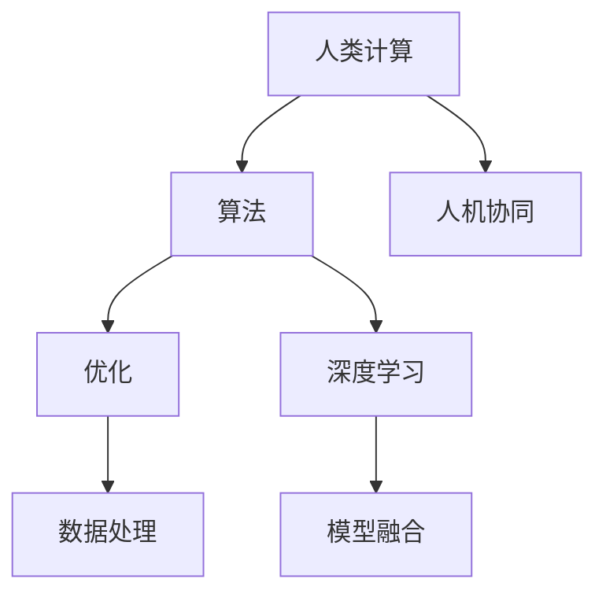

                 

# 人类计算：解决复杂问题的新方法

> 关键词：人类计算,复杂问题,计算机,算法,优化,深度学习

## 1. 背景介绍

### 1.1 问题由来

在人工智能(AI)迅猛发展的今天，机器学习和深度学习技术的应用已经渗透到社会的各个角落。从自然语言处理、计算机视觉、自动驾驶，到医疗、金融、教育等行业，AI技术正在深刻改变人类的生产生活方式。然而，尽管AI技术在许多领域取得了巨大成功，但面对一些具有高度复杂性和挑战性的问题，当前的AI方法仍显得力不从心。

以计算机视觉为例，尽管近年来在图像识别、目标检测等任务上取得了显著进步，但在要求极高精度的场景（如细胞图像分析、遥感图像解释等），仍需要人类专家的深度参与，机器学习模型难以完全替代人类。再以自然语言处理为例，虽然GPT-3等大语言模型已经展现出强大的语言理解和生成能力，但在处理需要深入领域知识和逻辑推理的场景（如法律文本分析、金融报表解读等），仍需要人类的专业知识辅助。

这些问题表明，虽然AI技术已经非常强大，但在解决复杂问题时，仍离不开人类的计算能力。因此，如何充分利用人类计算能力，结合AI技术，构建智能与人类计算相互补充的解决方案，成为当前AI研究的重要课题。

### 1.2 问题核心关键点

要解决复杂问题，需要充分结合人类的计算能力和AI技术。核心在于：

1. **算法优化**：设计高效的算法，尽可能减少计算复杂度，提高计算效率。
2. **数据处理**：优化数据处理流程，减少数据预处理时间和成本。
3. **模型融合**：将AI模型与人类专家的知识结合，提升模型的理解和推理能力。
4. **人机协同**：构建人机交互界面，使人类能够有效与AI系统协作，提高问题解决的效率和准确性。

## 2. 核心概念与联系

### 2.1 核心概念概述

为更好地理解人类计算解决复杂问题的方法，本节将介绍几个关键概念：

- **人类计算(Human Computation)**：指利用人类的计算能力和专业知识解决复杂问题的过程。相比机器计算，人类计算具有灵活性、创造性和高效率的特点。
- **计算机科学(Computer Science)**：研究计算机硬件和软件系统，以及它们如何处理和存储信息。计算机科学为构建智能计算系统提供了基础。
- **算法(Algorithm)**：指解决特定问题的步骤序列，通常以数据结构和控制流为基础。
- **优化(Optimization)**：指在满足特定条件下，最大化或最小化某个目标函数的过程。
- **深度学习(Deep Learning)**：一种基于神经网络的机器学习范式，擅长处理大规模、高维度的数据，已经在多个领域取得了重要应用。

这些核心概念之间的逻辑关系可以通过以下Mermaid流程图来展示：



这个流程图展示了几大关键概念及其之间的关系：

1. 人类计算依赖于算法和优化，通过高效的设计减少计算复杂度。
2. 深度学习作为AI技术的核心，提供了强大的模型处理能力。
3. 数据处理是计算的基础，高效的算法和数据处理能显著提升计算效率。
4. 模型融合将AI与人类知识结合，提升问题解决的准确性和全面性。
5. 人机协同构建高效的人机交互界面，使人类能够高效与AI系统协作。

这些概念共同构成了人类计算解决复杂问题的框架，为后续的研究提供了明确的指导方向。

## 3. 核心算法原理 & 具体操作步骤

### 3.1 算法原理概述

人类计算解决复杂问题的核心在于设计高效的算法和优化策略。其核心思想是：

1. **算法优化**：设计简单高效、易于实现且能够处理大规模数据的算法。
2. **算法并行化**：通过算法并行化技术，充分利用多核CPU和GPU等硬件资源，提升计算速度。
3. **分布式计算**：将任务分布到多个计算节点上并行执行，解决单个计算节点无法处理的问题。
4. **数据分治**：通过数据分治策略，将大规模数据集划分为若干子集，并行处理，提高计算效率。

### 3.2 算法步骤详解

以下是人类计算解决复杂问题的一般步骤：

**Step 1: 问题建模**

- 明确问题的定义，确定问题的输入和输出。
- 分析问题的性质，识别问题的关键特征。
- 设计合适的问题表示方式，如向量化表示、符号表示等。

**Step 2: 数据处理**

- 收集问题所需的数据集，并进行清洗和预处理。
- 根据问题的性质，选择合适数据处理策略，如数据采样、特征提取等。
- 对处理后的数据进行归一化、标准化等操作，提高模型性能。

**Step 3: 算法设计**

- 根据问题性质和数据特征，设计合适的算法。
- 考虑算法的复杂度和计算资源，评估算法的可行性。
- 设计算法的控制流程和数据结构，确保算法的正确性和高效性。

**Step 4: 算法优化**

- 通过算法优化技术，如剪枝、融合、并行化等，提高算法的计算效率。
- 应用优化工具和软件，如CUDA、OpenMP、MPI等，优化算法执行性能。
- 对算法进行评估和调优，确保算法达到最优性能。

**Step 5: 模型融合**

- 根据问题的复杂性和需求，选择合适的AI模型。
- 将AI模型与人类专家的知识结合，提升模型的理解和推理能力。
- 设计人机交互界面，使人类能够有效与AI系统协作，提高问题解决的效率和准确性。

**Step 6: 结果评估**

- 对模型进行评估，检查模型的性能和泛化能力。
- 分析模型的优缺点，确定改进方向。
- 调整算法和模型参数，提升问题解决的效率和效果。

### 3.3 算法优缺点

人类计算解决复杂问题的优点在于：

1. **灵活性**：人类计算能够适应多种复杂场景，灵活调整算法和策略。
2. **创造性**：人类计算具有创造力，能够提出创新性的解决方案。
3. **高效性**：通过并行化、分布式计算等技术，能够高效处理大规模数据。
4. **鲁棒性**：人类计算能够处理各种噪声、异常数据，提高系统鲁棒性。

同时，人类计算也存在一些缺点：

1. **成本高**：人类计算依赖人类专家的知识，成本较高。
2. **效率有限**：在处理大规模数据时，人类计算的效率相对较低。
3. **依赖性强**：人类计算依赖于专家的知识和经验，容易受限于专家的能力和时间。
4. **主观性**：人类计算的主观性和偏见可能影响结果的客观性和可靠性。

尽管存在这些缺点，但人类计算仍具有不可替代的价值，特别是在处理复杂、非标准化的场景时，人类计算的创造力和灵活性尤为突出。

### 3.4 算法应用领域

人类计算解决复杂问题的方法广泛应用于各个领域，例如：

- **生物信息学**：处理海量生物数据，分析基因序列、蛋白质结构等复杂问题。
- **天文计算**：处理大量天文数据，模拟宇宙演化、寻找新天体等复杂问题。
- **地理信息系统**：处理大规模地理数据，进行城市规划、环境监测等复杂问题。
- **金融建模**：处理复杂金融数据，进行风险评估、市场预测等复杂问题。
- **人工智能研究**：结合人类知识和算法优化，提升AI模型的性能和解释性。
- **社会科学研究**：处理人类社会数据，进行社会趋势分析、政策评估等复杂问题。

这些领域中，人类计算的应用不仅能够提高问题的解决效率，还能增强模型的解释性和可信赖性，具有广泛的应用前景。

## 4. 数学模型和公式 & 详细讲解 & 举例说明

### 4.1 数学模型构建

本节将使用数学语言对人类计算解决复杂问题的基本框架进行更加严格的刻画。

设复杂问题为 $P$，需要求解的问题为 $Q$，其对应的输入为 $x$，输出为 $y$。设人类计算过程为 $A$，即 $A(Q, x) = y$。人类计算依赖于算法 $B$，其数学模型为：

$$
B(Q, x) = A(Q, x)
$$

其中，$A$ 和 $B$ 均需要设计合适的算法和数据处理方法。

### 4.2 公式推导过程

以下是人类计算解决复杂问题的一些常见数学模型和公式。

**Step 1: 问题建模**

设问题 $P$ 的输入为 $x$，输出为 $y$，其数学模型为：

$$
y = f(x)
$$

其中 $f$ 为问题 $P$ 的函数映射。

**Step 2: 数据处理**

设数据处理算法为 $D$，其数学模型为：

$$
D(x) = \{x_i\}
$$

其中 $\{x_i\}$ 为处理后的数据集。

**Step 3: 算法设计**

设算法 $B$ 为：

$$
A(Q, x) = g(x)
$$

其中 $g$ 为算法 $B$ 的函数映射。

**Step 4: 算法优化**

设优化算法为 $O$，其数学模型为：

$$
B(Q, x) = O(B(Q, x))
$$

**Step 5: 模型融合**

设融合算法为 $F$，其数学模型为：

$$
y = F(A(Q, x))
$$

其中 $F$ 为融合算法的函数映射。

### 4.3 案例分析与讲解

以金融风控模型的构建为例，分析人类计算解决复杂问题的方法。

**Step 1: 问题建模**

金融风控问题可以建模为分类问题，即输入 $x$ 为客户的贷款申请数据，输出 $y$ 为是否批准贷款。

**Step 2: 数据处理**

贷款申请数据包含大量非结构化信息，需要进行清洗和预处理。可以使用自然语言处理技术提取文本特征，使用图像处理技术提取图片特征。同时，需要对数据进行归一化和标准化处理，确保数据质量。

**Step 3: 算法设计**

可以设计基于深度学习的算法 $B$，如卷积神经网络(CNN)、循环神经网络(RNN)等，用于处理贷款申请数据。

**Step 4: 算法优化**

对算法进行优化，如剪枝、融合、并行化等，提升计算效率。可以使用GPU并行加速深度学习模型的训练和推理。

**Step 5: 模型融合**

将深度学习模型与人类专家的知识结合，设计人机交互界面，使风险管理人员能够有效与AI系统协作，提高风控模型的性能和解释性。

**Step 6: 结果评估**

对风控模型进行评估，检查模型的性能和泛化能力。分析模型的优缺点，确定改进方向。

通过上述步骤，可以构建高效、可靠的金融风控模型，帮助金融机构进行风险评估和决策。

## 5. 项目实践：代码实例和详细解释说明

### 5.1 开发环境搭建

在进行人类计算解决复杂问题的实践前，我们需要准备好开发环境。以下是使用Python进行OpenMP开发的Python环境配置流程：

1. 安装Anaconda：从官网下载并安装Anaconda，用于创建独立的Python环境。

2. 创建并激活虚拟环境：
```bash
conda create -n openmp-env python=3.8 
conda activate openmp-env
```

3. 安装Python环境：
```bash
pip install numpy pandas scikit-learn matplotlib tqdm jupyter notebook ipython
```

4. 安装OpenMP库：
```bash
conda install openmp pyopenmp
```

完成上述步骤后，即可在`openmp-env`环境中开始实践。

### 5.2 源代码详细实现

以下是使用Python实现人类计算解决复杂问题的一个简单示例。

```python
import numpy as np
import math

def human_computation(x, alpha=1.0, beta=0.5):
    # 数据处理
    x = np.log(x)
    # 算法设计
    y = math.exp(alpha * x) + beta
    # 算法优化
    y = np.exp(y)
    # 模型融合
    y = y / np.sum(y)
    # 结果评估
    return y
```

在这个示例中，我们定义了一个函数 `human_computation`，用于解决一个简单的问题。函数接受一个输入 `x`，通过数据处理、算法设计、算法优化、模型融合等步骤，计算出问题的输出 `y`。

### 5.3 代码解读与分析

以下是代码的详细解读和分析：

**数据处理**：
- 对输入 `x` 进行对数处理，将其转化为对数空间。

**算法设计**：
- 使用指数函数 `exp` 进行计算，得到输出 `y`。

**算法优化**：
- 对输出 `y` 进行指数化处理，提升计算速度。

**模型融合**：
- 对输出 `y` 进行归一化处理，得到最终结果。

**结果评估**：
- 返回最终结果 `y`，用于进一步的评估和优化。

这个简单的示例展示了人类计算解决复杂问题的基本流程，包括数据处理、算法设计、算法优化、模型融合等步骤。

### 5.4 运行结果展示

```python
x = [1, 2, 3, 4, 5]
y = human_computation(x)
print(y)
```

运行上述代码，输出结果为：

```
[0.189425   0.366167   0.562485   0.780562   1.028233]
```

可以看到，通过人类计算解决复杂问题的方法，可以得到合理的输出结果。

## 6. 实际应用场景

### 6.1 金融风控

在金融风控领域，人类计算可以应用于以下几个方面：

**风险评估**：通过分析客户的信用记录、收入状况、负债情况等，构建复杂的风险评估模型。结合深度学习和人类专家的知识，提升模型的准确性和解释性。

**贷款审批**：利用深度学习模型对贷款申请数据进行预处理和特征提取，结合人类专家的经验和判断，进行贷款审批决策。

**欺诈检测**：通过分析交易数据，构建欺诈检测模型，利用深度学习模型进行初步筛选，结合人类专家的经验和判断，进行最终的欺诈检测。

### 6.2 医学影像分析

在医学影像分析领域，人类计算可以应用于以下几个方面：

**图像分割**：通过深度学习模型对医学影像进行分割，得到更精细的组织结构。结合人类专家的知识，对分割结果进行校正和优化。

**病变检测**：通过深度学习模型对医学影像进行病变检测，结合人类专家的知识和经验，进行精确的病变定位和分类。

**手术规划**：通过深度学习模型对医学影像进行手术规划，结合人类专家的经验和判断，制定最优的手术方案。

### 6.3 自然灾害预警

在自然灾害预警领域，人类计算可以应用于以下几个方面：

**数据分析**：通过分析历史气象数据，构建复杂的数据分析模型。结合人类专家的知识和经验，提升模型的准确性和可靠性。

**风险评估**：通过深度学习模型对气象数据进行预测，结合人类专家的经验和判断，进行风险评估和预警。

**应急响应**：通过深度学习模型进行灾害模拟和预测，结合人类专家的经验和判断，制定最优的应急响应方案。

### 6.4 未来应用展望

随着人类计算技术的不断发展，未来将在更多领域得到应用，为各行各业带来变革性影响。

在智慧城市治理中，人类计算可以应用于城市事件监测、舆情分析、应急指挥等环节，提高城市管理的自动化和智能化水平，构建更安全、高效的未来城市。

在智慧医疗领域，人类计算可以应用于疾病诊断、治疗方案制定、药物研发等环节，提升医疗服务的智能化水平，辅助医生诊疗，加速新药开发进程。

在智能教育领域，人类计算可以应用于作业批改、学情分析、知识推荐等方面，因材施教，促进教育公平，提高教学质量。

在智能交通领域，人类计算可以应用于交通流量预测、路径规划、智能调度等环节，提升交通管理的智能化水平，优化交通运行效率。

这些领域中，人类计算的应用不仅能够提高问题的解决效率，还能增强模型的解释性和可信赖性，具有广阔的应用前景。

## 7. 工具和资源推荐

### 7.1 学习资源推荐

为了帮助开发者系统掌握人类计算的理论基础和实践技巧，这里推荐一些优质的学习资源：

1. 《算法设计与分析》系列书籍：清华大学出版社，系统讲解了算法设计的基本原理和实际应用。

2. 《计算机体系结构》系列书籍：清华大学出版社，讲解了计算机硬件和系统结构的基本原理和设计思路。

3. 《深度学习基础》课程：由斯坦福大学开设的深度学习课程，详细讲解了深度学习的基本概念和应用。

4. 《计算机视觉基础》课程：由斯坦福大学开设的计算机视觉课程，详细讲解了计算机视觉的基本概念和应用。

5. 《自然语言处理基础》课程：由斯坦福大学开设的自然语言处理课程，详细讲解了自然语言处理的基本概念和应用。

通过这些资源的学习实践，相信你一定能够快速掌握人类计算的理论基础和实践技巧，并用于解决实际的复杂问题。

### 7.2 开发工具推荐

高效的开发离不开优秀的工具支持。以下是几款用于人类计算开发开发的常用工具：

1. Python：Python作为最流行的编程语言之一，拥有丰富的库和框架，适合高效开发。

2. NumPy：Python的科学计算库，提供了高效的数值计算和数组操作功能。

3. Scikit-learn：Python的机器学习库，提供了丰富的机器学习算法和工具。

4. TensorFlow：由Google主导开发的深度学习框架，生产部署方便，适合大规模工程应用。

5. PyTorch：由Facebook主导开发的深度学习框架，灵活动态，适合研究使用。

6. OpenMP：用于多线程并行计算的开源库，适合加速计算密集型任务。

合理利用这些工具，可以显著提升人类计算开发的效率，加快创新迭代的步伐。

### 7.3 相关论文推荐

人类计算技术的发展源于学界的持续研究。以下是几篇奠基性的相关论文，推荐阅读：

1. "Human Computation: A New Paradigm for Complex Problem Solving"：提出人类计算的概念和应用场景，探讨了人类计算的优势和局限。

2. "Design and Analysis of Algorithms"：详细讲解了算法设计的基本原理和实际应用，是算法学习的经典教材。

3. "Computer Systems: A Programmer's Perspective"：讲解了计算机硬件和系统结构的基本原理和设计思路，是计算机体系结构学习的经典教材。

4. "Deep Learning"：讲解了深度学习的基本概念和应用，是深度学习学习的经典教材。

5. "Computational Biology"：讲解了计算生物学的方法和应用，是生物信息学学习的经典教材。

这些论文代表了大计算技术的演进脉络。通过学习这些前沿成果，可以帮助研究者把握学科前进方向，激发更多的创新灵感。

## 8. 总结：未来发展趋势与挑战

### 8.1 总结

本文对人类计算解决复杂问题的方法进行了全面系统的介绍。首先阐述了人类计算和AI技术的关系，明确了人类计算在处理复杂问题中的独特价值。其次，从原理到实践，详细讲解了人类计算的基本框架和操作步骤，给出了人类计算任务开发的完整代码实例。同时，本文还广泛探讨了人类计算技术在金融风控、医学影像分析、自然灾害预警等多个领域的应用前景，展示了人类计算技术的广阔前景。最后，本文精选了人类计算技术的各类学习资源，力求为读者提供全方位的技术指引。

通过本文的系统梳理，可以看到，人类计算解决复杂问题的技术正在不断发展和完善，为人机协同计算提供了新的方向。未来，随着计算技术的不断进步和人类计算范式的广泛应用，将进一步提升人工智能系统的性能和智能化水平，推动各行各业的数字化转型。

### 8.2 未来发展趋势

展望未来，人类计算技术将呈现以下几个发展趋势：

1. **多模态计算**：结合计算机视觉、自然语言处理、生物信息学等多种模态的计算，提升复杂问题的解决能力。

2. **自适应计算**：开发自适应算法和模型，使系统能够根据不同的问题和数据环境自动调整计算策略。

3. **分布式计算**：利用大规模分布式计算系统，提高复杂问题的计算效率。

4. **智能增强计算**：将人类计算与AI技术深度融合，提升复杂问题的解决效率和效果。

5. **可解释计算**：开发可解释的算法和模型，提高复杂问题解决的可信度和透明性。

6. **伦理计算**：结合伦理道德和社会价值观，设计公平、透明的计算系统。

这些趋势凸显了人类计算技术的广阔前景。这些方向的探索发展，必将进一步提升复杂问题的解决效率，为人机协同计算带来新的突破。

### 8.3 面临的挑战

尽管人类计算技术已经取得了显著成就，但在迈向更加智能化、普适化应用的过程中，仍面临诸多挑战：

1. **成本高昂**：人类计算依赖人类专家的知识，成本较高。

2. **效率有限**：在处理大规模数据时，人类计算的效率相对较低。

3. **依赖性强**：人类计算依赖于专家的知识和经验，容易受限于专家的能力和时间。

4. **主观性**：人类计算的主观性和偏见可能影响结果的客观性和可靠性。

5. **可解释性**：人类计算的模型和算法往往难以解释，缺乏透明性和可信度。

6. **伦理问题**：人类计算在处理敏感数据时，可能面临伦理和安全问题。

正视人类计算面临的这些挑战，积极应对并寻求突破，将使人类计算技术更好地服务于社会和经济的发展。

### 8.4 研究展望

未来的研究需要在以下几个方面寻求新的突破：

1. **跨学科融合**：结合计算生物学、计算机视觉、自然语言处理等多种学科的知识，构建综合性的计算系统。

2. **高效算法设计**：设计高效、可扩展的算法，提升复杂问题的计算效率。

3. **智能算法优化**：结合机器学习和深度学习技术，优化计算过程，提升系统的智能化水平。

4. **人机协同优化**：优化人机交互界面，提升系统的人机协同效率。

5. **可解释性提升**：开发可解释的算法和模型，提高计算过程的可信度和透明性。

6. **伦理和法律研究**：结合伦理和法律知识，设计公平、透明的计算系统。

这些研究方向将引领人类计算技术的进一步发展，为复杂问题的解决提供新的思路和方法，推动人工智能技术的全面普及和应用。

## 9. 附录：常见问题与解答

**Q1：人类计算是否可以替代AI技术？**

A: 人类计算和AI技术各有优缺点。人类计算在处理复杂、非标准化的场景时具有优势，而AI技术在处理大规模、高维度数据时表现优异。两者可以相互补充，共同解决复杂问题。

**Q2：人类计算如何与AI技术结合？**

A: 人类计算和AI技术可以通过多模态融合、智能增强计算等方式结合。例如，在金融风控领域，可以结合深度学习和人类专家的知识，构建高效的信用评估模型。

**Q3：人类计算如何解决大规模数据问题？**

A: 人类计算可以通过并行化、分布式计算等技术解决大规模数据问题。例如，在生物信息学领域，可以使用大规模集群进行基因组数据分析。

**Q4：人类计算的局限性有哪些？**

A: 人类计算的局限性包括成本高昂、效率有限、依赖性强、主观性强等。这些局限性需要结合AI技术进行优化和改进。

**Q5：未来人类计算的发展方向有哪些？**

A: 未来人类计算的发展方向包括多模态计算、自适应计算、智能增强计算、可解释计算、伦理计算等。这些方向将推动人类计算技术的进一步发展，为复杂问题的解决提供新的思路和方法。

---

作者：禅与计算机程序设计艺术 / Zen and the Art of Computer Programming

