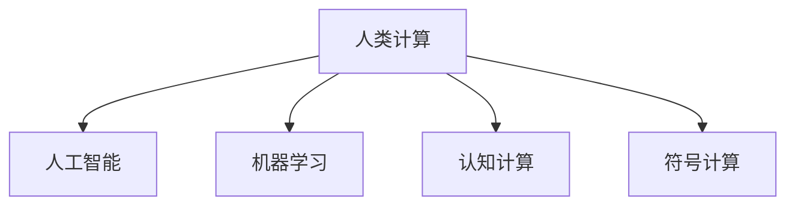

                 

# 人类计算：连接人与机器的桥梁

> 关键词：人类计算，人工智能，机器学习，计算机程序设计，认知计算

## 1. 背景介绍

在信息爆炸的时代，数据的处理、分析和应用成为了现代社会的基础。从科学研究到工业生产，从日常生活到国家治理，海量数据无处不在。然而，数据的价值并非仅仅通过存贮和检索来实现，其真正的潜力在于通过计算挖掘出深层次的规律和知识，驱动社会进步和创新。这一过程中，“人类计算”扮演了至关重要的桥梁角色，将人类智能与机器计算紧密相连，使得数据驱动的决策和行动变得更加高效和智能。

### 1.1 问题由来
随着科技的飞速发展，人工智能(AI)和机器学习(ML)已成为现代信息社会的核心驱动力。传统的数据处理方式依赖人工操作，效率低下，难以应对大规模数据和复杂计算任务。机器学习技术的引入，使得机器能够自动处理和分析数据，从模式识别到自然语言处理，从图像识别到语音识别，机器学习技术在各个领域展示了其巨大潜力。然而，机器学习算法仍然依赖于大量数据和计算资源，且其性能很大程度上依赖于人类专家的知识和经验。因此，如何在充分发挥机器计算能力的同时，有效利用人类智慧，成为信息时代的重要命题。

### 1.2 问题核心关键点
本论文将探讨“人类计算”的概念，并通过具体案例说明其在人工智能和机器学习中的应用。人类计算旨在通过人机协作，最大化地利用人类的知识、创造力和直觉，结合机器的计算能力和数据处理能力，提升决策和行动的质量。

## 2. 核心概念与联系

### 2.1 核心概念概述

为深入理解人类计算的概念，本节将介绍几个核心概念及其相互联系：

- **人类计算(Human Computing)**：指利用人类智慧与机器计算相结合，优化数据处理和决策过程的计算范式。人类计算不仅依赖于算力，还依托于人类的直觉、经验、创造力等智慧资源。

- **人工智能(Artificial Intelligence, AI)**：以计算机系统为基础，模拟人类智能行为的技术。包括感知、推理、学习、决策等能力，旨在实现机器的自我提升和智能扩展。

- **机器学习(Machine Learning, ML)**：通过算法使机器从数据中学习规律，提升自主决策和预测能力。人类计算与机器学习相结合，可以通过人机协同的方式，进一步提升机器学习的效果。

- **认知计算(Cognitive Computing)**：结合心理学、认知科学和计算机科学，研究如何模拟人类认知过程，提升机器对复杂问题的处理能力。人类计算是认知计算的重要实践形式。

- **符号计算(Symbolic Computation)**：利用符号操作而非数值操作，提升计算的精确性和可解释性。人类计算在符号计算中的应用，可以通过人类的逻辑推理和语义理解，增强机器处理复杂问题的能力。

这些概念之间的逻辑关系可以通过以下Mermaid流程图来展示：



这个流程图展示了几大核心概念之间的关系：

1. 人类计算是人工智能、机器学习和认知计算的重要组成部分。
2. 人工智能与机器学习通过大量数据训练，提升自主决策和预测能力。
3. 认知计算研究如何模拟人类认知过程，提升机器的复杂问题处理能力。
4. 符号计算通过符号操作，增强计算的精确性和可解释性。

## 3. 核心算法原理 & 具体操作步骤
### 3.1 算法原理概述

人类计算的算法原理可以总结为以下几个步骤：

1. **数据采集与预处理**：收集需要处理的数据，并进行清洗、标注和格式化，使之适应机器算法的要求。
2. **人机协作设计**：设计人机交互界面，利用人类智慧进行初步分析，提炼关键特征和问题。
3. **模型训练与优化**：根据人机协作的结果，训练机器学习模型，并进行优化，提升模型性能。
4. **结果验证与反馈**：对模型输出结果进行验证，结合人类反馈调整模型参数，实现迭代优化。
5. **部署与应用**：将优化后的模型部署到实际应用中，结合人类决策，提升整体效能。

这一过程充分利用了人类的直觉、经验、创造力，结合机器的高效计算能力，最大化地发挥了人机协同的优势。

### 3.2 算法步骤详解

以下以医学图像分析为例，详细说明人类计算的具体操作步骤：

1. **数据采集**：收集医院中的医学影像数据，包括CT、MRI等。
2. **人机协作**：选择有经验的放射科医生对部分影像进行初步分析，标注异常区域。
3. **模型训练**：利用标注好的数据集，训练机器学习模型，如卷积神经网络(CNN)，进行病变检测。
4. **优化调整**：结合医生的反馈，调整模型参数，优化检测效果。
5. **部署应用**：将优化后的模型部署到医院信息系统(ISP)中，辅助医生进行日常诊断，提高诊断准确率。

### 3.3 算法优缺点

人类计算具有以下优点：

1. **融合人机智慧**：结合人类直觉和机器计算，提升数据处理的深度和广度。
2. **应对复杂问题**：通过人机协作，可以有效处理复杂、非结构化的问题。
3. **提升决策质量**：结合人类智慧，提升决策的合理性和可解释性。
4. **灵活性高**：可以针对不同应用场景，灵活调整人机协作方式。

同时，人类计算也存在以下缺点：

1. **依赖专家经验**：需要依赖人类专家的知识和经验，对专家的依赖度较高。
2. **时间成本高**：人机协作的设计、训练和优化过程耗费大量时间。
3. **复杂度增加**：人机协同增加了系统的复杂度，可能导致运行效率下降。
4. **数据隐私问题**：处理敏感数据时，需要重视数据隐私和安全性。

尽管如此，人类计算以其独特的优势，在人工智能和机器学习领域展现出巨大的潜力，成为推动数据价值挖掘和决策智能化的重要手段。

### 3.4 算法应用领域

人类计算技术在多个领域展示了其应用潜力，具体包括：

- **医疗健康**：利用机器学习结合医生经验，提升医学影像诊断、病历分析、药物研发等。
- **金融风险管理**：结合数据分析师和机器学习模型，进行市场预测、信用评估、风险管理等。
- **智能制造**：利用机器学习与工人经验，优化生产流程、质量控制、设备维护等。
- **社会治理**：结合数据分析和政策制定者的智慧，提升公共服务、城市管理、应急响应等。
- **智能交通**：利用机器学习与交通管理人员的协作，优化交通流量控制、安全预警等。

## 4. 数学模型和公式 & 详细讲解  
### 4.1 数学模型构建

在实际应用中，人类计算的数学模型构建往往需要结合具体的领域知识和问题场景。以医学图像分析为例，可以构建以下数学模型：

设输入数据集为 $\mathcal{X}$，输出标签集为 $\mathcal{Y}$，训练集为 $D=\{(x_i,y_i)\}_{i=1}^N$。定义机器学习模型为 $f: \mathcal{X} \rightarrow \mathcal{Y}$，其中 $f$ 为函数映射，$\theta$ 为模型参数。

定义模型在数据样本 $(x,y)$ 上的损失函数为 $\ell(f(x),y)$，则在数据集 $D$ 上的经验风险为：

$$
\mathcal{L}(\theta) = \frac{1}{N} \sum_{i=1}^N \ell(f(x_i),y_i)
$$

优化目标是最小化经验风险，即找到最优参数：

$$
\theta^* = \mathop{\arg\min}_{\theta} \mathcal{L}(\theta)
$$

### 4.2 公式推导过程

以二分类问题为例，假设模型 $f$ 的输出为 $\hat{y}=f(x)$，真实标签 $y \in \{0,1\}$。则二分类交叉熵损失函数定义为：

$$
\ell(f(x),y) = -[y\log \hat{y} + (1-y)\log (1-\hat{y})]
$$

将其代入经验风险公式，得：

$$
\mathcal{L}(\theta) = -\frac{1}{N}\sum_{i=1}^N [y_i\log f(x_i)+(1-y_i)\log(1-f(x_i))]
$$

根据链式法则，损失函数对参数 $\theta_k$ 的梯度为：

$$
\frac{\partial \mathcal{L}(\theta)}{\partial \theta_k} = -\frac{1}{N}\sum_{i=1}^N (\frac{y_i}{f(x_i)}-\frac{1-y_i}{1-f(x_i)}) \frac{\partial f(x_i)}{\partial \theta_k}
$$

其中 $\frac{\partial f(x_i)}{\partial \theta_k}$ 可进一步递归展开，利用自动微分技术完成计算。

### 4.3 案例分析与讲解

以医学影像分析为例，通过人机协作训练的模型可以有效地识别出影像中的病变区域。模型通过学习大量标注数据，自动提取病变区域的特征，并通过医生反馈进一步优化模型。这一过程中，人类计算的数学模型构建和优化过程如下：

1. **特征提取**：利用卷积神经网络提取影像中的特征图。
2. **损失函数选择**：选择交叉熵损失函数衡量模型预测与真实标签之间的差异。
3. **梯度计算**：利用反向传播算法计算梯度，更新模型参数。
4. **参数优化**：通过梯度下降等优化算法，最小化损失函数。
5. **结果验证**：利用医生标注的影像数据验证模型性能，结合医生反馈调整模型参数。

## 5. 项目实践：代码实例和详细解释说明
### 5.1 开发环境搭建

在进行人类计算的实践时，需要准备一定的开发环境。以下是Python环境下进行深度学习开发的环境配置流程：

1. 安装Anaconda：从官网下载并安装Anaconda，用于创建独立的Python环境。

2. 创建并激活虚拟环境：
```bash
conda create -n human-computing python=3.8 
conda activate human-computing
```

3. 安装必要的深度学习库：
```bash
conda install pytorch torchvision torchaudio cudatoolkit=11.1 -c pytorch -c conda-forge
```

4. 安装TensorFlow和其他常用工具包：
```bash
pip install tensorflow numpy pandas scikit-learn matplotlib tqdm jupyter notebook ipython
```

5. 配置GPU环境：
```bash
nvidia-smi
```

6. 安装必要的深度学习框架：
```bash
pip install tensorflow-gpu
```

完成上述步骤后，即可在`human-computing`环境中进行人类计算的实践。

### 5.2 源代码详细实现

下面以医学影像分析为例，给出使用TensorFlow和Keras进行模型训练的代码实现。

首先，定义数据预处理和模型构建函数：

```python
from tensorflow.keras import layers, models, optimizers

def build_model(input_shape, num_classes):
    model = models.Sequential([
        layers.Conv2D(32, 3, activation='relu', input_shape=input_shape),
        layers.MaxPooling2D(2),
        layers.Conv2D(64, 3, activation='relu'),
        layers.MaxPooling2D(2),
        layers.Flatten(),
        layers.Dense(128, activation='relu'),
        layers.Dense(num_classes, activation='sigmoid')
    ])
    model.compile(optimizer=optimizers.Adam(learning_rate=0.001), loss='binary_crossentropy', metrics=['accuracy'])
    return model

def preprocess_data(x_train, y_train, x_test, y_test):
    x_train = x_train.reshape(-1, 64, 64, 1) / 255.0
    x_test = x_test.reshape(-1, 64, 64, 1) / 255.0
    y_train = y_train.reshape(-1, 1)
    y_test = y_test.reshape(-1, 1)
    return x_train, y_train, x_test, y_test
```

然后，加载数据并进行模型训练：

```python
# 加载数据
x_train, y_train, x_test, y_test = load_data()

# 数据预处理
x_train, y_train, x_test, y_test = preprocess_data(x_train, y_train, x_test, y_test)

# 模型构建
model = build_model(input_shape=(64, 64, 1), num_classes=1)

# 训练模型
model.fit(x_train, y_train, batch_size=32, epochs=10, validation_data=(x_test, y_test))
```

以上代码实现了医学影像分析的简单实现，通过卷积神经网络进行病变区域识别。通过人机协作的方式，选择合适的模型结构和参数，并进行迭代优化，最终得到较为准确的病变区域检测模型。

### 5.3 代码解读与分析

在代码实现中，我们首先定义了数据预处理和模型构建函数。数据预处理包括将图像数据归一化、调整数据形状等步骤，以便于模型训练。模型构建包括多个卷积层、池化层、全连接层等，最终输出二分类预测结果。

在训练过程中，我们使用了Adam优化器和二分类交叉熵损失函数，进行了10个epochs的训练，并在每个epoch结束时验证模型性能。通过不断调整模型参数和数据增强等手段，逐步提升模型性能，最终得到一个能够有效检测病变区域的模型。

## 6. 实际应用场景
### 6.1 智能制造

在智能制造领域，人类计算可以通过结合工人经验和机器学习模型，优化生产流程和质量控制。例如，在汽车生产线上，利用机器学习模型结合工人经验，可以实时监测设备状态，预测设备故障，提前进行维护。同时，工人可以通过实时反馈调整模型参数，提升预测准确率，优化生产效率。

### 6.2 医疗健康

在医疗健康领域，人类计算可以通过结合医生经验和机器学习模型，提升医学影像诊断、病历分析、药物研发等。例如，利用医学影像数据分析模型，结合放射科医生的初步诊断，可以自动检测影像中的病变区域，辅助医生进行精准诊断。同时，模型也可以通过医生反馈进行持续优化，提升诊断准确率和效率。

### 6.3 金融风险管理

在金融风险管理领域，人类计算可以通过结合分析师经验和机器学习模型，进行市场预测、信用评估、风险管理等。例如，利用交易数据训练的机器学习模型，结合分析师的市场观察，可以预测股票价格的走势，评估企业的信用风险。同时，分析师可以通过实时反馈调整模型参数，提升预测准确率，降低风险损失。

### 6.4 未来应用展望

随着人类计算技术的不断发展，未来将会在更多领域展现出其应用潜力。以下是几个可能的未来应用场景：

1. **智慧城市**：结合城市管理人员的智慧，利用机器学习模型进行交通流量控制、公共安全管理、应急响应等。
2. **智能交通**：利用机器学习模型结合交通管理人员的协作，优化交通流量控制、安全预警等。
3. **社会治理**：结合数据分析和政策制定者的智慧，提升公共服务、城市管理、应急响应等。
4. **智能农业**：利用机器学习模型结合农业专家的经验，进行农作物种植、病虫害预测、农业机器人控制等。

## 7. 工具和资源推荐
### 7.1 学习资源推荐

为了帮助开发者系统掌握人类计算的理论基础和实践技巧，这里推荐一些优质的学习资源：

1. 《人工智能基础》课程：斯坦福大学开设的入门级人工智能课程，全面介绍人工智能的基本概念和关键技术。

2. 《深度学习》书籍：Ian Goodfellow等著，全面介绍深度学习的基本理论和实践技巧。

3. 《认知计算导论》书籍：Joel Mitchell著，详细探讨认知计算的基本概念和应用方法。

4. 《TensorFlow实战》书籍：Manning Publications出版，全面介绍TensorFlow的使用方法和实践案例。

5. Coursera和edX等在线课程：提供大量高质量的机器学习和人工智能课程，涵盖从入门到高级的内容。

通过对这些资源的学习实践，相信你一定能够快速掌握人类计算的精髓，并用于解决实际的机器学习问题。

### 7.2 开发工具推荐

高效的开发离不开优秀的工具支持。以下是几款用于深度学习开发和人类计算实践的工具：

1. TensorFlow：由Google主导开发的深度学习框架，支持分布式计算，适合大规模工程应用。

2. PyTorch：基于Python的深度学习框架，动态计算图，适合快速迭代研究。

3. Keras：高层神经网络API，使用简单，易于上手，适合快速构建原型。

4. Jupyter Notebook：开源的交互式笔记本，支持多种编程语言，方便开发者调试和分享代码。

5. TensorBoard：TensorFlow配套的可视化工具，可以实时监测模型训练状态，并提供丰富的图表呈现方式。

6. Weights & Biases：模型训练的实验跟踪工具，可以记录和可视化模型训练过程中的各项指标，方便对比和调优。

合理利用这些工具，可以显著提升人类计算任务的开发效率，加快创新迭代的步伐。

### 7.3 相关论文推荐

人类计算技术的发展源于学界的持续研究。以下是几篇奠基性的相关论文，推荐阅读：

1. Human-Computer Interaction: A Tutorial（人机交互综述）：Stephen J. Mankoff等著，全面介绍人机交互的基本概念和应用方法。

2. Computational Cognition: An Introduction（认知计算导论）：Joel Mitchell著，详细探讨认知计算的基本概念和应用方法。

3. Symbolic and Subsymbolic Approaches to Reasoning（符号与子符号推理）：Douglas R. Hofstadter著，探讨符号计算与子符号计算的区别与联系。

4. Human-in-the-Loop Machine Learning（人机协同机器学习）：Ian H. Foster等著，探讨人机协同学习的基本概念和应用方法。

这些论文代表了大规模计算技术的发展脉络。通过学习这些前沿成果，可以帮助研究者把握学科前进方向，激发更多的创新灵感。

## 8. 总结：未来发展趋势与挑战

### 8.1 研究成果总结

人类计算技术在人工智能和机器学习领域取得了显著成果，具体体现在以下几个方面：

1. **提升数据处理效率**：结合人机协作，可以更高效地处理海量数据，挖掘出深层次的规律和知识。
2. **增强决策质量**：结合人类直觉和经验，可以提升决策的合理性和可解释性。
3. **解决复杂问题**：通过人机协作，可以有效应对复杂、非结构化的问题。

### 8.2 未来发展趋势

展望未来，人类计算技术将呈现以下几个发展趋势：

1. **更高效的计算范式**：通过人机协作，进一步提升计算效率和精度，解决复杂问题。
2. **更智能的决策支持**：结合人工智能技术，提升决策的智能化水平，辅助人类进行复杂决策。
3. **更广泛的跨领域应用**：人类计算技术将在更多领域得到应用，如医疗、金融、交通等。
4. **更深入的理论研究**：结合认知科学和计算机科学，研究如何模拟人类认知过程，提升机器的复杂问题处理能力。

### 8.3 面临的挑战

尽管人类计算技术已经取得了显著成果，但在迈向更加智能化、普适化应用的过程中，仍面临诸多挑战：

1. **数据获取和处理**：需要获取大量高质量的数据，并进行预处理和标注，耗时耗力。
2. **模型可解释性**：机器学习模型的决策过程难以解释，对于高风险应用，可解释性尤为重要。
3. **隐私和安全问题**：处理敏感数据时，需要重视数据隐私和安全性，避免泄露和滥用。
4. **计算资源需求**：处理大规模数据和复杂问题需要高性能计算资源，资源需求较高。

### 8.4 研究展望

面对人类计算技术面临的挑战，未来的研究需要在以下几个方面寻求新的突破：

1. **提高数据获取效率**：探索更高效的数据采集和预处理技术，减少对人工标注的依赖。
2. **增强模型可解释性**：结合符号计算和认知计算，提升模型的可解释性和透明性。
3. **提升隐私保护能力**：研究数据加密、差分隐私等技术，确保数据安全和隐私保护。
4. **优化计算资源利用**：研究分布式计算、量子计算等新技术，提升计算资源的利用效率。

这些研究方向的探索，将推动人类计算技术向更高的台阶发展，为构建安全、可靠、可解释、可控的智能系统提供新的技术支持。

## 9. 附录：常见问题与解答

**Q1：人类计算是否适用于所有机器学习任务？**

A: 人类计算适用于数据密集、任务复杂、需要人类智慧参与的机器学习任务。对于数据量较小、任务较为简单的任务，完全可以通过机器学习算法处理，无需人机协作。

**Q2：人类计算是否需要依赖于人类的经验？**

A: 人类计算需要结合人类经验，但并非完全依赖于专家。通过人机协作的方式，可以将人类经验和机器学习算法结合起来，提升系统的整体效能。

**Q3：人类计算的效率如何？**

A: 人类计算的效率取决于人机协作的设计和实现。通过合理设计人机交互界面和任务，可以有效提升系统的处理速度。同时，利用机器学习算法进行任务优化，进一步提升效率。

**Q4：人类计算的局限性是什么？**

A: 人类计算的局限性在于需要大量数据和计算资源，以及依赖人类经验和智慧。对于一些简单任务，完全可以通过机器学习算法处理，无需人机协作。

**Q5：如何构建高效的人类计算系统？**

A: 构建高效的人类计算系统需要结合具体应用场景，设计合理的人机协作流程和任务。同时，需要选择合适的机器学习算法，并结合人类经验进行迭代优化。

这些问题的回答，展示了人类计算技术的潜力、局限性和实现方法，希望能为未来的研究和实践提供有益的参考。

---

作者：禅与计算机程序设计艺术 / Zen and the Art of Computer Programming

