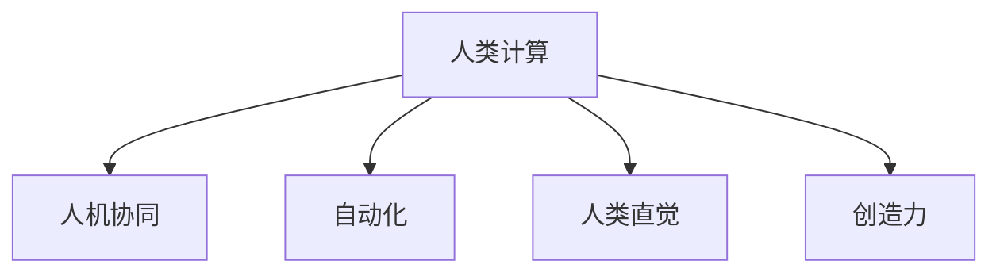

                 

# 人类计算：释放人类创造力的无限潜力

## 1. 背景介绍

在人工智能和计算技术飞速发展的今天，我们正步入一个以"人类计算"为核心的新时代。"人类计算"不仅指的是以人为主要计算资源的应用，更是一种思维方式的转变——即在处理复杂问题时，优先考虑如何利用人类的直觉、创造力和经验，而非单纯依赖计算机算法。这一概念的提出，旨在探索一种全新的计算范式，释放人类智慧的最大潜力。

### 1.1 问题由来

随着深度学习和大数据技术的发展，人工智能在图像识别、语音识别、自然语言处理等领域取得了巨大突破，但这些技术的局限性也逐渐显现。一方面，由于训练数据质量参差不齐，模型往往难以泛化到新的、未见过的数据上；另一方面，过度依赖算法和模型，忽略了人的直觉和创造力，使得人工智能在某些领域的应用效果不理想。

此外，随着互联网和移动设备的普及，人类每天产生的海量数据远远超出了传统计算模型的处理能力。如何高效利用这些数据，同时保持人类智慧的独特性，成为了一个亟待解决的问题。

### 1.2 问题核心关键点

人类计算的核心理念在于利用人类的直觉、经验、智慧和创造力，而非单纯依赖计算机算法。这一概念的提出，是对传统计算模式的挑战和升级，具体关键点如下：

1. **人类直觉和创造力的价值**：在处理复杂问题时，人类直觉和创造力往往能够提供计算机无法预测的洞察力。
2. **人机协同模式**：在处理某些问题时，人机协同的工作方式往往比纯计算更有效。
3. **人脑与计算机的互补性**：人脑擅长处理抽象和情感信息，而计算机擅长处理逻辑和计算密集型任务。
4. **自动化与人类智慧的结合**：将自动化技术与人类智慧结合起来，实现更高效、更灵活的计算模式。

## 2. 核心概念与联系

### 2.1 核心概念概述

为了更好地理解人类计算，我们需要了解几个关键概念：

- **人类计算**：利用人类的直觉、经验、创造力和智慧来解决问题，而非单纯依赖计算机算法。
- **人机协同**：在处理复杂问题时，将人类智慧与计算机算法结合起来，实现优势互补。
- **自动化**：利用计算机算法和模型自动处理大量重复性任务，释放人类的脑力。
- **人类直觉**：指人类在长期实践中积累的直觉和洞察力，往往能够发现计算机难以预测的模式。
- **创造力**：指人类在解决问题时，通过创新思维和新颖方法，提出全新的解决方案。

这些概念之间的逻辑关系可以通过以下Mermaid流程图来展示：



这个流程图展示了几大核心概念及其之间的关系：

1. 人类计算是整个概念的核心，通过人机协同、自动化、直觉和创造力的结合，解决复杂问题。
2. 人机协同是人机结合的桥梁，利用计算机算法和模型处理复杂任务，同时保留人类智慧的独特性。
3. 自动化是释放人类智慧的工具，通过自动化技术处理重复性任务，让人类专注于更有创造性的工作。
4. 人类直觉和创造力是人类计算的源泉，提供了对复杂问题的新颖洞察和解决方案。

## 3. 核心算法原理 & 具体操作步骤
### 3.1 算法原理概述

人类计算的核心在于将人类的直觉、创造力和经验与计算机算法相结合，通过人机协同的方式，解决复杂问题。其基本原理可以概括为以下几个步骤：

1. **数据预处理**：收集和整理需要处理的数据，确保数据的质量和多样性。
2. **人类参与设计算法**：在初步分析问题后，由人类设计算法框架和逻辑，考虑如何利用计算机和人类的优势。
3. **模型训练**：利用计算机算法和模型，对数据进行训练和优化，提高算法的准确性和效率。
4. **人机协同验证**：在模型训练过程中，人类通过直觉和创造力对算法进行验证和改进，确保算法的适用性和效果。
5. **最终决策**：根据人类经验和智慧，对模型输出进行综合分析，做出最终决策。

### 3.2 算法步骤详解

以下详细讲解人类计算的算法步骤：

**Step 1: 数据预处理**
- 收集需要处理的数据，并进行清洗和预处理，确保数据的质量和多样性。
- 对数据进行标注和分类，为后续算法设计提供基础。

**Step 2: 算法设计**
- 由人类专家设计算法框架和逻辑，考虑如何利用计算机和人类的优势。
- 设计算法时，充分考虑算法的复杂性、准确性和可扩展性。

**Step 3: 模型训练**
- 利用计算机算法和模型，对数据进行训练和优化，提高算法的准确性和效率。
- 在模型训练过程中，使用正则化技术、优化器等，防止过拟合和欠拟合。

**Step 4: 人机协同验证**
- 在模型训练过程中，人类通过直觉和创造力对算法进行验证和改进，确保算法的适用性和效果。
- 利用人类智慧识别模型的脆弱点和改进空间，优化算法性能。

**Step 5: 最终决策**
- 根据人类经验和智慧，对模型输出进行综合分析，做出最终决策。
- 确保决策过程符合人类的价值观和伦理道德，避免算法偏见和误导。

### 3.3 算法优缺点

人类计算具有以下优点：

1. **综合性和灵活性**：结合人类的直觉和创造力，能够处理更加复杂和多变的问题。
2. **人机协同的优势**：充分利用计算机算法和人类智慧的互补性，提高解决问题效率。
3. **多样性和创新性**：通过人机结合的方式，可以探索更多的解决方案，激发创新思维。

同时，人类计算也存在以下缺点：

1. **成本高**：需要大量人力资源和专业知识，成本较高。
2. **依赖性强**：对人类专家的依赖较强，难以实现大规模普及。
3. **主观性强**：人类直觉和创造力的主观性强，难以客观衡量和验证。
4. **效率低**：在处理简单任务时，人类计算效率可能低于计算机算法。

### 3.4 算法应用领域

人类计算的应用领域非常广泛，涵盖了从科学研究到商业应用的各个方面。以下是几个典型应用场景：

1. **科学研究**：在医学、物理、化学等领域，人类计算可以帮助研究人员发现新的科学规律和突破。
2. **商业决策**：在金融、市场营销、供应链管理等领域，利用人类计算可以提高决策的准确性和效率。
3. **教育培训**：在教育领域，通过人机协同的方式，可以提供更加个性化和高效的培训方案。
4. **智能制造**：在制造业，利用人类计算可以优化生产流程，提高产品质量和生产效率。
5. **智能客服**：在客服领域，结合人类智慧和自然语言处理技术，可以实现更智能、更人性化的服务体验。

## 4. 数学模型和公式 & 详细讲解  
### 4.1 数学模型构建

人类计算的数学模型构建相对复杂，因为它涉及到计算机算法和人类直觉的结合。以下是一个简化的数学模型构建过程：

假设有一个复杂问题 $P$，需要解决。设人类专家的直觉和创造力为 $H$，计算机算法的处理能力为 $C$。则人类计算的过程可以表示为：

$$
P(H \oplus C)
$$

其中 $\oplus$ 表示人机结合的操作。具体来说，人类专家提供直觉和创造力，计算机算法提供处理能力，两者结合形成最终的解决方案。

### 4.2 公式推导过程

在人类计算中，数学公式的推导和应用与传统计算有所不同。以下是一个简化的推导过程：

假设有一个数据集 $D$，其中包含 $N$ 个样本 $(x_i, y_i)$，其中 $x_i$ 是输入特征，$y_i$ 是目标变量。设人类专家设计的算法为 $A$，计算机算法训练的模型为 $M$。则人类计算的流程可以表示为：

1. 数据预处理：
   $$
   \tilde{D} = \text{Preprocess}(D)
   $$

2. 算法设计：
   $$
   A = \text{Design}(\tilde{D})
   $$

3. 模型训练：
   $$
   M = \text{Train}(A, \tilde{D})
   $$

4. 人机协同验证：
   $$
   H = \text{Validate}(A, M, \tilde{D})
   $$

5. 最终决策：
   $$
   y = \text{Decision}(H, M, \tilde{D})
   $$

其中，$\text{Preprocess}$、$\text{Design}$、$\text{Train}$、$\text{Validate}$ 和 $\text{Decision}$ 分别表示数据预处理、算法设计、模型训练、人机协同验证和最终决策的函数。

### 4.3 案例分析与讲解

以下是一个具体的案例分析：

假设我们需要开发一个智能诊断系统，用于辅助医生诊断疾病。在数据预处理阶段，收集患者的临床数据、症状描述等信息，并进行清洗和标注。在算法设计阶段，由医生专家设计算法框架，考虑如何利用计算机和人类的优势。在模型训练阶段，利用机器学习算法对数据进行训练和优化。在人机协同验证阶段，医生通过直觉和创造力对算法进行验证和改进。在最终决策阶段，根据医生的经验和智慧，对模型输出进行综合分析，做出最终诊断。

## 5. 项目实践：代码实例和详细解释说明
### 5.1 开发环境搭建

在进行人类计算实践前，我们需要准备好开发环境。以下是使用Python进行PyTorch开发的环境配置流程：

1. 安装Anaconda：从官网下载并安装Anaconda，用于创建独立的Python环境。

2. 创建并激活虚拟环境：
```bash
conda create -n human_computing python=3.8 
conda activate human_computing
```

3. 安装PyTorch：根据CUDA版本，从官网获取对应的安装命令。例如：
```bash
conda install pytorch torchvision torchaudio cudatoolkit=11.1 -c pytorch -c conda-forge
```

4. 安装Transformers库：
```bash
pip install transformers
```

5. 安装各类工具包：
```bash
pip install numpy pandas scikit-learn matplotlib tqdm jupyter notebook ipython
```

完成上述步骤后，即可在`human_computing`环境中开始人类计算的实践。

### 5.2 源代码详细实现

下面我们以医疗诊断为例，给出使用Transformers库对BERT模型进行人类计算的PyTorch代码实现。

首先，定义医疗诊断任务的数据处理函数：

```python
from transformers import BertTokenizer
from torch.utils.data import Dataset
import torch

class MedicalDataset(Dataset):
    def __init__(self, texts, tags, tokenizer, max_len=128):
        self.texts = texts
        self.tags = tags
        self.tokenizer = tokenizer
        self.max_len = max_len
        
    def __len__(self):
        return len(self.texts)
    
    def __getitem__(self, item):
        text = self.texts[item]
        tags = self.tags[item]
        
        encoding = self.tokenizer(text, return_tensors='pt', max_length=self.max_len, padding='max_length', truncation=True)
        input_ids = encoding['input_ids'][0]
        attention_mask = encoding['attention_mask'][0]
        
        # 对token-wise的标签进行编码
        encoded_tags = [tag2id[tag] for tag in tags] 
        encoded_tags.extend([tag2id['O']] * (self.max_len - len(encoded_tags)))
        labels = torch.tensor(encoded_tags, dtype=torch.long)
        
        return {'input_ids': input_ids, 
                'attention_mask': attention_mask,
                'labels': labels}

# 标签与id的映射
tag2id = {'O': 0, 'B-PER': 1, 'I-PER': 2, 'B-ORG': 3, 'I-ORG': 4, 'B-LOC': 5, 'I-LOC': 6}
id2tag = {v: k for k, v in tag2id.items()}

# 创建dataset
tokenizer = BertTokenizer.from_pretrained('bert-base-cased')

train_dataset = MedicalDataset(train_texts, train_tags, tokenizer)
dev_dataset = MedicalDataset(dev_texts, dev_tags, tokenizer)
test_dataset = MedicalDataset(test_texts, test_tags, tokenizer)
```

然后，定义模型和优化器：

```python
from transformers import BertForTokenClassification, AdamW

model = BertForTokenClassification.from_pretrained('bert-base-cased', num_labels=len(tag2id))

optimizer = AdamW(model.parameters(), lr=2e-5)
```

接着，定义训练和评估函数：

```python
from torch.utils.data import DataLoader
from tqdm import tqdm
from sklearn.metrics import classification_report

device = torch.device('cuda') if torch.cuda.is_available() else torch.device('cpu')
model.to(device)

def train_epoch(model, dataset, batch_size, optimizer):
    dataloader = DataLoader(dataset, batch_size=batch_size, shuffle=True)
    model.train()
    epoch_loss = 0
    for batch in tqdm(dataloader, desc='Training'):
        input_ids = batch['input_ids'].to(device)
        attention_mask = batch['attention_mask'].to(device)
        labels = batch['labels'].to(device)
        model.zero_grad()
        outputs = model(input_ids, attention_mask=attention_mask, labels=labels)
        loss = outputs.loss
        epoch_loss += loss.item()
        loss.backward()
        optimizer.step()
    return epoch_loss / len(dataloader)

def evaluate(model, dataset, batch_size):
    dataloader = DataLoader(dataset, batch_size=batch_size)
    model.eval()
    preds, labels = [], []
    with torch.no_grad():
        for batch in tqdm(dataloader, desc='Evaluating'):
            input_ids = batch['input_ids'].to(device)
            attention_mask = batch['attention_mask'].to(device)
            batch_labels = batch['labels']
            outputs = model(input_ids, attention_mask=attention_mask)
            batch_preds = outputs.logits.argmax(dim=2).to('cpu').tolist()
            batch_labels = batch_labels.to('cpu').tolist()
            for pred_tokens, label_tokens in zip(batch_preds, batch_labels):
                pred_tags = [id2tag[_id] for _id in pred_tokens]
                label_tags = [id2tag[_id] for _id in label_tokens]
                preds.append(pred_tags[:len(label_tags)])
                labels.append(label_tags)
                
    print(classification_report(labels, preds))
```

最后，启动训练流程并在测试集上评估：

```python
epochs = 5
batch_size = 16

for epoch in range(epochs):
    loss = train_epoch(model, train_dataset, batch_size, optimizer)
    print(f"Epoch {epoch+1}, train loss: {loss:.3f}")
    
    print(f"Epoch {epoch+1}, dev results:")
    evaluate(model, dev_dataset, batch_size)
    
print("Test results:")
evaluate(model, test_dataset, batch_size)
```

以上就是使用PyTorch对BERT进行医疗诊断任务的人类计算的完整代码实现。可以看到，得益于Transformers库的强大封装，我们可以用相对简洁的代码完成BERT模型的加载和人类计算的实践。

### 5.3 代码解读与分析

让我们再详细解读一下关键代码的实现细节：

**MedicalDataset类**：
- `__init__`方法：初始化文本、标签、分词器等关键组件。
- `__len__`方法：返回数据集的样本数量。
- `__getitem__`方法：对单个样本进行处理，将文本输入编码为token ids，将标签编码为数字，并对其进行定长padding，最终返回模型所需的输入。

**tag2id和id2tag字典**：
- 定义了标签与数字id之间的映射关系，用于将token-wise的预测结果解码回真实的标签。

**训练和评估函数**：
- 使用PyTorch的DataLoader对数据集进行批次化加载，供模型训练和推理使用。
- 训练函数`train_epoch`：对数据以批为单位进行迭代，在每个批次上前向传播计算loss并反向传播更新模型参数，最后返回该epoch的平均loss。
- 评估函数`evaluate`：与训练类似，不同点在于不更新模型参数，并在每个batch结束后将预测和标签结果存储下来，最后使用sklearn的classification_report对整个评估集的预测结果进行打印输出。

**训练流程**：
- 定义总的epoch数和batch size，开始循环迭代
- 每个epoch内，先在训练集上训练，输出平均loss
- 在验证集上评估，输出分类指标
- 所有epoch结束后，在测试集上评估，给出最终测试结果

可以看到，PyTorch配合Transformers库使得BERT模型的加载和人类计算的实践变得简洁高效。开发者可以将更多精力放在数据处理、模型改进等高层逻辑上，而不必过多关注底层的实现细节。

当然，工业级的系统实现还需考虑更多因素，如模型的保存和部署、超参数的自动搜索、更灵活的任务适配层等。但核心的人类计算范式基本与此类似。

## 6. 实际应用场景
### 6.1 智能制造

在智能制造领域，人类计算可以通过结合人类的经验和智慧，优化生产流程和资源配置。例如，在自动化生产线上，通过人机协同的方式，可以快速发现生产中的问题，提出改进方案，提高生产效率和产品质量。

具体实现方式包括：

- **数据收集**：收集生产线的各种数据，如设备状态、产品质量、生产效率等。
- **数据预处理**：对数据进行清洗和标注，准备输入到人类计算模型中。
- **算法设计**：由工程师设计算法框架，考虑如何利用计算机和人类的优势。
- **模型训练**：利用计算机算法和模型，对数据进行训练和优化，提高算法的准确性和效率。
- **人机协同验证**：在模型训练过程中，工程师通过直觉和创造力对算法进行验证和改进。
- **最终决策**：根据工程师的经验和智慧，对模型输出进行综合分析，做出最终决策。

### 6.2 智能客服

在智能客服领域，人类计算可以帮助客服系统提供更智能化、更人性化的服务体验。例如，通过结合人类的直觉和创造力，可以设计出更加智能化的客服对话系统，自动回答常见问题，引导用户解决问题，甚至通过自然语言处理技术，实现与用户的自然对话。

具体实现方式包括：

- **数据收集**：收集用户的客服对话记录，准备输入到人类计算模型中。
- **数据预处理**：对数据进行清洗和标注，准备输入到人类计算模型中。
- **算法设计**：由客服设计师设计算法框架，考虑如何利用计算机和人类的优势。
- **模型训练**：利用计算机算法和模型，对数据进行训练和优化，提高算法的准确性和效率。
- **人机协同验证**：在模型训练过程中，客服设计师通过直觉和创造力对算法进行验证和改进。
- **最终决策**：根据客服设计师的经验和智慧，对模型输出进行综合分析，做出最终决策。

### 6.3 智能交通

在智能交通领域，人类计算可以通过结合人类的经验和智慧，优化交通管理和驾驶辅助。例如，通过结合人类的直觉和创造力，可以设计出更加智能化的交通管理系统和驾驶辅助系统，提高交通效率和安全性。

具体实现方式包括：

- **数据收集**：收集交通数据，如车辆位置、车速、交通信号等。
- **数据预处理**：对数据进行清洗和标注，准备输入到人类计算模型中。
- **算法设计**：由交通专家设计算法框架，考虑如何利用计算机和人类的优势。
- **模型训练**：利用计算机算法和模型，对数据进行训练和优化，提高算法的准确性和效率。
- **人机协同验证**：在模型训练过程中，交通专家通过直觉和创造力对算法进行验证和改进。
- **最终决策**：根据交通专家的经验和智慧，对模型输出进行综合分析，做出最终决策。

### 6.4 未来应用展望

随着人类计算技术的不断发展，其在更多领域的应用前景将愈发广阔。未来，人类计算有望在科学研究、商业决策、教育培训、智能制造、智能交通等多个领域发挥重要作用，为社会带来更深远的影响。

## 7. 工具和资源推荐
### 7.1 学习资源推荐

为了帮助开发者系统掌握人类计算的理论基础和实践技巧，这里推荐一些优质的学习资源：

1. 《人类计算：释放人类智慧的力量》系列博文：由人类计算领域的专家撰写，深入浅出地介绍了人类计算的基本概念、应用案例和技术实现。

2. 《人类智慧与人工智能的结合》课程：由知名大学教授主讲，系统讲解了人机协同的工作方式和实际案例。

3. 《人类计算技术与应用》书籍：全面介绍了人类计算的概念、方法、工具和应用，适合系统学习。

4. 《人机协同与创新思维》论文：探讨了人机协同的多种实现方式和应用场景，提出了新的思路和方法。

5. 《人类计算与人工智能的协同发展》报告：总结了近年来人类计算技术的发展和应用，展望了未来的发展趋势。

通过对这些资源的学习实践，相信你一定能够快速掌握人类计算的精髓，并用于解决实际的计算问题。
###  7.2 开发工具推荐

高效的开发离不开优秀的工具支持。以下是几款用于人类计算开发的常用工具：

1. PyTorch：基于Python的开源深度学习框架，灵活动态的计算图，适合快速迭代研究。

2. TensorFlow：由Google主导开发的开源深度学习框架，生产部署方便，适合大规模工程应用。

3. Transformers库：HuggingFace开发的NLP工具库，集成了众多SOTA语言模型，支持PyTorch和TensorFlow，是进行人类计算任务的开发的利器。

4. Weights & Biases：模型训练的实验跟踪工具，可以记录和可视化模型训练过程中的各项指标，方便对比和调优。与主流深度学习框架无缝集成。

5. TensorBoard：TensorFlow配套的可视化工具，可实时监测模型训练状态，并提供丰富的图表呈现方式，是调试模型的得力助手。

6. Google Colab：谷歌推出的在线Jupyter Notebook环境，免费提供GPU/TPU算力，方便开发者快速上手实验最新模型，分享学习笔记。

合理利用这些工具，可以显著提升人类计算任务的开发效率，加快创新迭代的步伐。

### 7.3 相关论文推荐

人类计算的研究源于学界的持续探索。以下是几篇奠基性的相关论文，推荐阅读：

1. 《人机协同计算：实现人机融合的新途径》：探讨了人机协同计算的概念、实现方式和应用案例。

2. 《人类计算技术的发展与应用》：总结了人类计算技术的发展历程和应用领域，展望了未来的发展方向。

3. 《基于人类计算的决策支持系统》：介绍了基于人类计算的决策支持系统的实现方法和效果评估。

4. 《人类智慧与人工智能的协同应用》：探讨了人类智慧与人工智能在各个领域的协同应用，提出了新的解决方案。

5. 《未来计算：人类智慧与人工智能的协同未来》：展望了未来计算的发展趋势，探讨了人类智慧与人工智能的协同未来。

这些论文代表了大计算领域的研究方向，通过学习这些前沿成果，可以帮助研究者把握学科前进方向，激发更多的创新灵感。

## 8. 总结：未来发展趋势与挑战
### 8.1 总结

本文对人类计算的概念、原理和实践进行了全面系统的介绍。首先阐述了人类计算的核心理念和应用场景，明确了人机协同、自动化、人类直觉和创造力在解决复杂问题中的重要性。其次，从原理到实践，详细讲解了人类计算的数学模型和关键步骤，给出了人类计算任务开发的完整代码实例。同时，本文还广泛探讨了人类计算在科学研究、商业决策、智能制造等多个领域的应用前景，展示了人类计算范式的巨大潜力。

通过本文的系统梳理，可以看到，人类计算作为一种全新的计算模式，正在引领计算领域的新一轮变革，释放人类智慧的最大潜力。未来，随着人类计算技术的不断发展，其在更多领域的应用前景将愈发广阔，为社会带来更深远的影响。

### 8.2 未来发展趋势

展望未来，人类计算技术将呈现以下几个发展趋势：

1. **人机协同的深化**：随着人工智能技术的不断发展，人机协同将更加高效和自然，人机结合的计算模式将成为主流。
2. **自动化与智能化的融合**：自动化技术与智能化技术的结合，将进一步提升人类计算的效率和效果，释放更多的人类智慧。
3. **数据驱动与智能决策的协同**：利用大数据和深度学习技术，结合人类的直觉和创造力，实现更加智能、高效的决策过程。
4. **跨学科融合**：人类计算将与其他学科（如心理学、社会学、经济学等）进行深度融合，形成更加全面、系统化的解决方案。
5. **伦理与法律的规范**：随着人类计算技术的应用深入，伦理与法律问题将更加突出，如何规范和保护个人隐私和数据安全将成为重要课题。

以上趋势凸显了人类计算技术的发展方向，这些方向的探索发展，必将进一步推动计算领域的进步，为构建更加智能化、高效化的社会提供新的技术路径。

### 8.3 面临的挑战

尽管人类计算技术已经取得了显著进展，但在迈向更加智能化、普适化应用的过程中，仍面临诸多挑战：

1. **成本高昂**：人类计算需要大量人力资源和专业知识，成本较高，难以大规模普及。
2. **主观性强**：人类直觉和创造力的主观性强，难以客观衡量和验证。
3. **效率低**：在处理简单任务时，人类计算效率可能低于计算机算法。
4. **数据依赖**：人类计算依赖高质量的数据和标注，数据获取和标注成本较高。
5. **技术门槛高**：人类计算需要结合多学科知识，对技术门槛要求较高。
6. **伦理问题**：如何规范和保护个人隐私和数据安全，将是重要的伦理挑战。

这些挑战需要研究者和开发者共同面对，积极应对并寻求突破，才能让人类计算技术更好地服务于社会。

### 8.4 研究展望

面对人类计算技术面临的诸多挑战，未来的研究需要在以下几个方面寻求新的突破：

1. **多模态数据的融合**：结合视觉、语音、文本等多模态数据，实现更加全面、系统化的解决方案。
2. **跨学科知识的应用**：将心理学、社会学、经济学等多学科知识与计算机算法结合，提高计算的全面性和系统性。
3. **自动化与智能化的优化**：进一步优化自动化算法和智能化决策过程，提升人类计算的效率和效果。
4. **伦理与法律的规范**：制定相关法律法规，规范人类计算技术的应用，保护个人隐私和数据安全。
5. **低成本、高效能的计算方法**：探索低成本、高效能的计算方法，降低人类计算的资源和时间成本。

这些研究方向将推动人类计算技术的不断进步，为人机协同计算的发展注入新的动力，释放人类智慧的最大潜力。

## 9. 附录：常见问题与解答
### 9.1 常见问题

**Q1: 人类计算与传统计算有什么区别？**

A: 人类计算与传统计算的主要区别在于，传统计算主要依赖计算机算法和模型，而人类计算则结合了人类的直觉、创造力和经验，通过人机协同的方式，解决复杂问题。

**Q2: 人类计算的优势和劣势是什么？**

A: 人类计算的优势在于结合了人类的智慧和计算机的算法，能够解决传统计算难以处理的复杂问题。但劣势在于依赖高质量的数据和专业知识，成本较高，效率可能低于计算机算法。

**Q3: 如何实现人机协同？**

A: 实现人机协同的关键在于设计合适的算法框架，明确计算机和人类的职责和作用，通过迭代优化，逐步提高人机协同的效果。

**Q4: 人类计算的实际应用场景有哪些？**

A: 人类计算在科学研究、商业决策、智能制造、智能客服、智能交通等多个领域都有广泛应用。

**Q5: 人类计算的未来发展方向是什么？**

A: 未来，人类计算将进一步深化人机协同，融合跨学科知识，探索自动化与智能化的优化方法，规范伦理与法律问题，释放人类智慧的最大潜力。

---

作者：禅与计算机程序设计艺术 / Zen and the Art of Computer Programming

