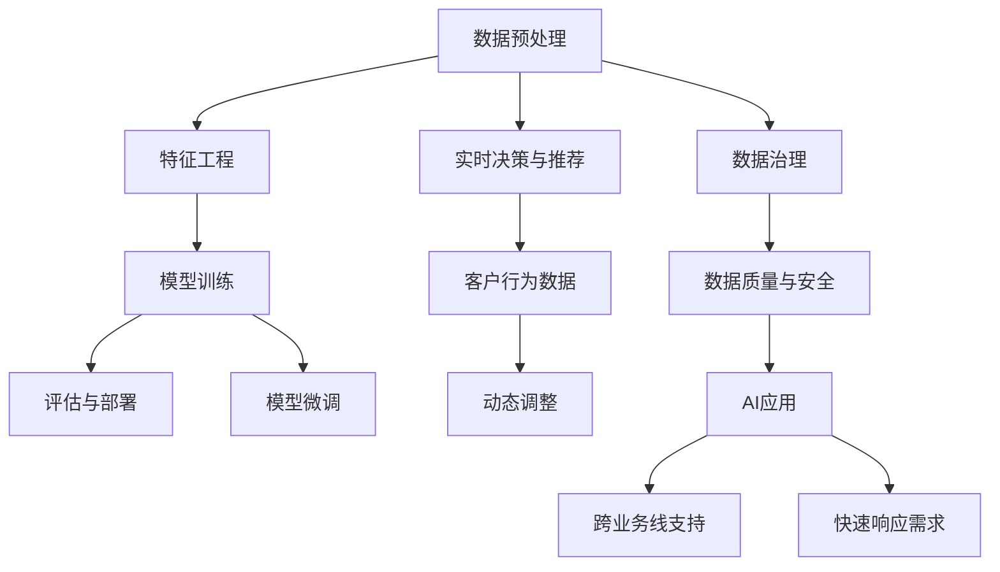

                 

# 从AI辅助到AI驱动：Lepton AI的业务转型

## 1. 背景介绍

### 1.1 问题由来
在过去的数十年里，Lepton AI一直在努力通过传统的数据分析和机器学习技术，为企业提供业务洞察和决策支持。然而，随着市场环境的变化和技术的进步，Lepton AI开始面临新的挑战：

1. **市场竞争加剧**：众多新兴企业涌入，客户需求日趋复杂，传统的数据分析方法已经难以满足快速响应市场变化的需求。
2. **技术迭代迅速**：AI技术的快速发展，特别是深度学习和大规模预训练模型（如GPT、BERT）的应用，使得Lepton AI的解决方案在性能上逐步落后。
3. **业务数字化需求增加**：随着数字化转型的深入，企业对数据驱动的业务决策需求日益增长，Lepton AI需要重新定位，才能抓住数字化转型的机遇。
4. **客户期望提高**：客户不仅要求快速准确的决策支持，还需要更为智能化、个性化的服务体验，Lepton AI需要转型以提升服务质量。

### 1.2 问题核心关键点
为了应对上述挑战，Lepton AI决定进行业务转型，从AI辅助向AI驱动转变。这一转型的核心关键点包括：

- **全栈AI能力建设**：构建包括数据预处理、特征工程、模型训练、评估与部署的全栈AI能力，提升整体解决方案的智能化水平。
- **模型定制与微调**：利用预训练大模型进行定制化微调，根据特定业务场景提供更高效、准确的模型。
- **实时AI驱动**：开发实时决策与推荐系统，结合客户行为数据进行动态调整，提升服务响应速度和质量。
- **平台化战略**：构建AI中台，支持跨业务线的AI应用，提升资源利用率和开发效率。
- **数据治理**：建立数据治理机制，确保数据质量和安全，为AI应用提供坚实的数据基础。

### 1.3 问题研究意义
Lepton AI的业务转型对企业的未来发展具有深远影响：

1. **提升业务决策质量**：通过AI技术，Lepton AI可以提供更为精准、实时的业务洞察，支持客户做出更优决策。
2. **提升服务效率与效果**：通过AI自动化处理大量数据和复杂任务，大幅提升服务响应速度和效果。
3. **拓展业务模式**：通过构建实时AI驱动系统，Lepton AI可以开拓更多业务场景，提升市场竞争力。
4. **驱动内部创新**：通过AI中台和模型微调平台，Lepton AI可以加速产品创新，快速响应客户需求。

## 2. 核心概念与联系

### 2.1 核心概念概述

为了更好地理解Lepton AI的业务转型，本节将介绍几个关键核心概念：

- **全栈AI能力建设**：指从数据预处理、特征工程、模型训练、评估与部署的全过程，涵盖AI开发从零到一的能力体系。
- **模型定制与微调**：利用预训练大模型进行定制化微调，根据特定业务场景提供高性能的AI模型。
- **实时AI驱动**：结合客户行为数据和AI模型，进行动态决策和推荐，提升服务效率和客户满意度。
- **平台化战略**：通过构建AI中台，支持跨业务线的AI应用，提高资源利用率和开发效率。
- **数据治理**：建立数据治理机制，确保数据质量和安全，为AI应用提供坚实的数据基础。

这些核心概念之间的逻辑关系可以通过以下Mermaid流程图来展示：



这个流程图展示了大语言模型的核心概念及其之间的关系：

1. 从数据预处理到模型微调，Lepton AI构建了完整的AI能力体系。
2. 利用实时数据进行动态调整，实现实时AI驱动。
3. 通过数据治理保障数据质量与安全，为AI应用提供坚实基础。
4. 平台化战略支持跨业务线的AI应用，提升开发效率。
5. 模型微调使Lepton AI能够根据特定场景定制高性能模型。

这些概念共同构成了Lepton AI业务转型的核心框架，使得其能够更好地适应数字化转型的需求。

## 3. 核心算法原理 & 具体操作步骤
### 3.1 算法原理概述

Lepton AI的业务转型核心在于构建一个全栈AI能力体系，并在此基础上进行模型定制与微调。其核心算法原理包括以下几个方面：

1. **数据预处理**：通过数据清洗、归一化、特征提取等技术，将原始数据转化为适合AI模型训练的格式。
2. **特征工程**：通过特征选择、特征提取、特征降维等技术，提取对目标任务有贡献的关键特征。
3. **模型训练**：使用深度学习算法，如神经网络、决策树、集成学习等，在标注数据集上进行模型训练。
4. **模型评估与部署**：使用验证集评估模型性能，调整模型参数，并在生产环境中部署应用。
5. **模型微调**：利用预训练大模型进行定制化微调，提升模型在特定业务场景下的表现。

### 3.2 算法步骤详解

Lepton AI的业务转型步骤主要包括以下几个关键环节：

**Step 1: 数据预处理**
- 收集和清洗业务相关数据，包括客户行为数据、交易数据、市场数据等。
- 进行数据归一化、特征提取等预处理操作，生成训练数据集。

**Step 2: 特征工程**
- 根据业务需求，选择和构造对目标任务有贡献的特征。
- 使用PCA、LDA等降维技术，减少特征维度，提升模型训练效率。

**Step 3: 模型训练**
- 选择合适的深度学习模型，如卷积神经网络（CNN）、循环神经网络（RNN）、Transformer等。
- 使用标注数据集进行模型训练，优化模型参数。

**Step 4: 模型评估与部署**
- 使用验证集对训练好的模型进行评估，选择性能最优的模型。
- 将模型部署到生产环境中，进行业务应用。

**Step 5: 模型微调**
- 利用预训练大模型进行定制化微调，如BERT、GPT-3等。
- 在特定业务场景下，通过调整模型参数和结构，提升模型性能。

### 3.3 算法优缺点

Lepton AI的业务转型算法具有以下优点：
1. **高效性**：通过数据预处理和特征工程，减少模型训练和优化的时间。
2. **可扩展性**：基于预训练大模型进行微调，可以轻松应对业务场景的变化，提高模型泛化能力。
3. **灵活性**：通过模型微调和动态调整，可以迅速响应市场变化，提升服务效率。
4. **可解释性**：通过特征工程和模型训练，可以更好地理解模型的决策过程，提高可解释性。

同时，该算法也存在一些缺点：
1. **数据依赖**：微调过程对标注数据的质量和数量要求较高，数据获取成本高。
2. **模型复杂**：深度学习模型的训练和优化需要较高的计算资源，可能面临资源瓶颈。
3. **时间成本**：模型微调和部署需要一定的开发时间，难以快速迭代。
4. **风险管理**：模型微调过程中存在一定的风险，如过拟合、泛化能力不足等。

### 3.4 算法应用领域

Lepton AI的业务转型算法在多个领域都有广泛的应用：

- **金融风控**：通过客户行为数据和市场数据，构建实时风险评估与预警系统。
- **零售推荐**：利用客户交易数据和行为数据，构建个性化推荐引擎，提升用户体验。
- **市场营销**：通过市场数据和客户反馈，进行精准营销和广告投放。
- **人力资源**：利用员工数据和绩效数据，进行人才管理和招聘决策。
- **智能客服**：通过客户对话数据，构建智能客服系统，提升客户满意度。

## 4. 数学模型和公式 & 详细讲解 & 举例说明（备注：数学公式请使用latex格式，latex嵌入文中独立段落使用 $$，段落内使用 $)
### 4.1 数学模型构建

Lepton AI的业务转型涉及多个数学模型，这里仅以金融风控为例，介绍数学模型的构建过程。

**目标函数**：
$$
\min_{\theta} \frac{1}{n} \sum_{i=1}^n \ell(y_i, f_\theta(x_i))
$$

其中，$\theta$ 为模型参数，$f_\theta(x_i)$ 为模型在输入 $x_i$ 上的预测输出，$\ell$ 为损失函数，$n$ 为样本数。

**损失函数**：
$$
\ell(y_i, f_\theta(x_i)) = \frac{1}{N} \sum_{k=1}^N (y_k - f_\theta(x_k))^2
$$

**正则化项**：
$$
R(\theta) = \lambda \sum_{i=1}^N \theta_i^2
$$

**总损失函数**：
$$
\mathcal{L}(\theta) = \frac{1}{n} \sum_{i=1}^n \ell(y_i, f_\theta(x_i)) + \lambda R(\theta)
$$

**优化算法**：
$$
\theta \leftarrow \theta - \eta \nabla_{\theta} \mathcal{L}(\theta)
$$

其中，$\eta$ 为学习率，$\nabla_{\theta} \mathcal{L}(\theta)$ 为损失函数对参数 $\theta$ 的梯度。

### 4.2 公式推导过程

以金融风控为例，假设模型使用二分类算法进行客户信用评分。令 $y_i$ 为客户信用评分标签（0表示低风险，1表示高风险），$f_\theta(x_i)$ 为模型在输入 $x_i$（客户基本信息、交易记录等）上的预测输出。

**损失函数**：
$$
\ell(y_i, f_\theta(x_i)) = -[y_i \log f_\theta(x_i) + (1-y_i) \log (1-f_\theta(x_i))]
$$

**正则化项**：
$$
R(\theta) = \lambda \sum_{i=1}^N \theta_i^2
$$

**总损失函数**：
$$
\mathcal{L}(\theta) = \frac{1}{n} \sum_{i=1}^n \ell(y_i, f_\theta(x_i)) + \lambda R(\theta)
$$

**优化算法**：
$$
\theta \leftarrow \theta - \eta \nabla_{\theta} \mathcal{L}(\theta)
$$

通过上述公式，Lepton AI可以在金融风控任务中构建并训练一个能够预测客户信用评分的模型，同时避免过拟合。

### 4.3 案例分析与讲解

以客户信用评分为例，分析Lepton AI在金融风控中的应用。

假设Lepton AI从银行收集了10万个客户的信用评分数据，其中5万个数据用于模型训练，3万个数据用于模型验证，2万个数据用于模型测试。Lepton AI首先对数据进行预处理，包括去除异常值、处理缺失值、标准化等操作。然后，进行特征工程，提取对信用评分有贡献的关键特征，如收入、负债、交易金额等。接着，Lepton AI选择了一个二分类模型（如逻辑回归），并使用标注数据集进行模型训练和优化。最后，在验证集上评估模型性能，选择最优模型，并在测试集上测试其泛化能力。

## 5. 项目实践：代码实例和详细解释说明
### 5.1 开发环境搭建

在进行Lepton AI业务转型实践前，我们需要准备好开发环境。以下是使用Python进行PyTorch开发的环境配置流程：

1. 安装Anaconda：从官网下载并安装Anaconda，用于创建独立的Python环境。

2. 创建并激活虚拟环境：
```bash
conda create -n lepton-env python=3.8 
conda activate lepton-env
```

3. 安装PyTorch：根据CUDA版本，从官网获取对应的安装命令。例如：
```bash
conda install pytorch torchvision torchaudio cudatoolkit=11.1 -c pytorch -c conda-forge
```

4. 安装Transformers库：
```bash
pip install transformers
```

5. 安装各类工具包：
```bash
pip install numpy pandas scikit-learn matplotlib tqdm jupyter notebook ipython
```

完成上述步骤后，即可在`lepton-env`环境中开始业务转型实践。

### 5.2 源代码详细实现

下面我们以金融风控为例，给出使用Transformers库对BERT模型进行金融风控任务微调的PyTorch代码实现。

首先，定义金融风控任务的数据处理函数：

```python
from transformers import BertTokenizer
from torch.utils.data import Dataset
import torch

class FinancialRiskDataset(Dataset):
    def __init__(self, texts, tags, tokenizer, max_len=128):
        self.texts = texts
        self.tags = tags
        self.tokenizer = tokenizer
        self.max_len = max_len
        
    def __len__(self):
        return len(self.texts)
    
    def __getitem__(self, item):
        text = self.texts[item]
        tags = self.tags[item]
        
        encoding = self.tokenizer(text, return_tensors='pt', max_length=self.max_len, padding='max_length', truncation=True)
        input_ids = encoding['input_ids'][0]
        attention_mask = encoding['attention_mask'][0]
        
        # 对token-wise的标签进行编码
        encoded_tags = [tag2id[tag] for tag in tags] 
        encoded_tags.extend([tag2id['O']] * (self.max_len - len(encoded_tags)))
        labels = torch.tensor(encoded_tags, dtype=torch.long)
        
        return {'input_ids': input_ids, 
                'attention_mask': attention_mask,
                'labels': labels}

# 标签与id的映射
tag2id = {'O': 0, 'low_risk': 1, 'high_risk': 2}
id2tag = {v: k for k, v in tag2id.items()}

# 创建dataset
tokenizer = BertTokenizer.from_pretrained('bert-base-cased')

train_dataset = FinancialRiskDataset(train_texts, train_tags, tokenizer)
dev_dataset = FinancialRiskDataset(dev_texts, dev_tags, tokenizer)
test_dataset = FinancialRiskDataset(test_texts, test_tags, tokenizer)
```

然后，定义模型和优化器：

```python
from transformers import BertForTokenClassification, AdamW

model = BertForTokenClassification.from_pretrained('bert-base-cased', num_labels=len(tag2id))

optimizer = AdamW(model.parameters(), lr=2e-5)
```

接着，定义训练和评估函数：

```python
from torch.utils.data import DataLoader
from tqdm import tqdm
from sklearn.metrics import classification_report

device = torch.device('cuda') if torch.cuda.is_available() else torch.device('cpu')
model.to(device)

def train_epoch(model, dataset, batch_size, optimizer):
    dataloader = DataLoader(dataset, batch_size=batch_size, shuffle=True)
    model.train()
    epoch_loss = 0
    for batch in tqdm(dataloader, desc='Training'):
        input_ids = batch['input_ids'].to(device)
        attention_mask = batch['attention_mask'].to(device)
        labels = batch['labels'].to(device)
        model.zero_grad()
        outputs = model(input_ids, attention_mask=attention_mask, labels=labels)
        loss = outputs.loss
        epoch_loss += loss.item()
        loss.backward()
        optimizer.step()
    return epoch_loss / len(dataloader)

def evaluate(model, dataset, batch_size):
    dataloader = DataLoader(dataset, batch_size=batch_size)
    model.eval()
    preds, labels = [], []
    with torch.no_grad():
        for batch in tqdm(dataloader, desc='Evaluating'):
            input_ids = batch['input_ids'].to(device)
            attention_mask = batch['attention_mask'].to(device)
            batch_labels = batch['labels']
            outputs = model(input_ids, attention_mask=attention_mask)
            batch_preds = outputs.logits.argmax(dim=2).to('cpu').tolist()
            batch_labels = batch_labels.to('cpu').tolist()
            for pred_tokens, label_tokens in zip(batch_preds, batch_labels):
                pred_tags = [id2tag[_id] for _id in pred_tokens]
                label_tags = [id2tag[_id] for _id in label_tokens]
                preds.append(pred_tags[:len(label_tokens)])
                labels.append(label_tags)
                
    print(classification_report(labels, preds))
```

最后，启动训练流程并在测试集上评估：

```python
epochs = 5
batch_size = 16

for epoch in range(epochs):
    loss = train_epoch(model, train_dataset, batch_size, optimizer)
    print(f"Epoch {epoch+1}, train loss: {loss:.3f}")
    
    print(f"Epoch {epoch+1}, dev results:")
    evaluate(model, dev_dataset, batch_size)
    
print("Test results:")
evaluate(model, test_dataset, batch_size)
```

以上就是使用PyTorch对BERT进行金融风控任务微调的完整代码实现。可以看到，得益于Transformers库的强大封装，我们可以用相对简洁的代码完成BERT模型的加载和微调。

### 5.3 代码解读与分析

让我们再详细解读一下关键代码的实现细节：

**FinancialRiskDataset类**：
- `__init__`方法：初始化文本、标签、分词器等关键组件。
- `__len__`方法：返回数据集的样本数量。
- `__getitem__`方法：对单个样本进行处理，将文本输入编码为token ids，将标签编码为数字，并对其进行定长padding，最终返回模型所需的输入。

**tag2id和id2tag字典**：
- 定义了标签与数字id之间的映射关系，用于将token-wise的预测结果解码回真实的标签。

**训练和评估函数**：
- 使用PyTorch的DataLoader对数据集进行批次化加载，供模型训练和推理使用。
- 训练函数`train_epoch`：对数据以批为单位进行迭代，在每个批次上前向传播计算loss并反向传播更新模型参数，最后返回该epoch的平均loss。
- 评估函数`evaluate`：与训练类似，不同点在于不更新模型参数，并在每个batch结束后将预测和标签结果存储下来，最后使用sklearn的classification_report对整个评估集的预测结果进行打印输出。

**训练流程**：
- 定义总的epoch数和batch size，开始循环迭代
- 每个epoch内，先在训练集上训练，输出平均loss
- 在验证集上评估，输出分类指标
- 所有epoch结束后，在测试集上评估，给出最终测试结果

可以看到，PyTorch配合Transformers库使得BERT微调的代码实现变得简洁高效。开发者可以将更多精力放在数据处理、模型改进等高层逻辑上，而不必过多关注底层的实现细节。

当然，工业级的系统实现还需考虑更多因素，如模型的保存和部署、超参数的自动搜索、更灵活的任务适配层等。但核心的微调范式基本与此类似。

## 6. 实际应用场景
### 6.1 智能客服系统

基于Lepton AI的全栈AI能力建设，智能客服系统可以充分利用AI技术，实现高效、个性化的客户服务。

在技术实现上，Lepton AI可以构建一个多模态的智能客服系统，结合语音识别、自然语言处理、机器学习等技术，为用户提供实时、精准的客服支持。具体步骤如下：

1. **语音识别**：使用ASR技术将客户的语音转换为文本。
2. **意图识别**：使用NLP技术识别客户的意图和需求。
3. **对话管理**：使用对话管理模型，对客户输入进行理解和回应。
4. **知识库管理**：建立知识库，存储常见问题和解答，辅助对话管理。
5. **情感分析**：使用情感分析技术，了解客户情绪，调整客服策略。

通过以上技术手段，Lepton AI的智能客服系统可以为客户提供7x24小时的智能服务，快速响应客户咨询，用自然流畅的语言解答各类常见问题，提高客户满意度。

### 6.2 金融风控

Lepton AI的金融风控系统可以结合大数据、机器学习和实时数据，构建一个高效的金融风险评估和预警系统。

在技术实现上，Lepton AI可以构建一个基于深度学习的金融风控系统，包括以下几个关键组件：

1. **客户行为分析**：收集和分析客户的交易记录、消费行为、信用记录等数据，构建客户画像。
2. **风险评估模型**：使用深度学习模型，如随机森林、卷积神经网络等，对客户信用评分进行预测。
3. **异常检测**：使用时间序列分析、聚类等技术，识别异常交易行为，进行风险预警。
4. **实时监控**：结合实时数据，进行动态调整和预警。

通过以上技术手段，Lepton AI的金融风控系统可以实时监测客户风险，提前预警，有效防范金融风险。

### 6.3 零售推荐

Lepton AI的零售推荐系统可以结合客户行为数据和交易数据，构建一个精准、个性化的推荐引擎。

在技术实现上，Lepton AI可以构建一个基于深度学习的推荐系统，包括以下几个关键组件：

1. **客户行为分析**：收集和分析客户的浏览记录、购买记录、评分记录等数据，构建客户画像。
2. **推荐模型**：使用深度学习模型，如协同过滤、矩阵分解等，对商品进行推荐。
3. **实时推荐**：结合实时数据，进行动态调整和推荐。

通过以上技术手段，Lepton AI的零售推荐系统可以为客户提供个性化的商品推荐，提升用户体验和销售额。

### 6.4 未来应用展望

随着Lepton AI业务转型的深入，其AI能力体系将逐步完善，应用场景将更加丰富。以下是一些未来应用展望：

1. **医疗诊断**：结合医学知识和AI模型，进行疾病诊断和辅助决策，提高医疗服务质量。
2. **教育评估**：使用NLP技术分析学生反馈，评估教育效果，个性化推荐教学资源。
3. **物流优化**：结合物流数据和AI模型，优化配送路线，提高物流效率。
4. **智能制造**：结合工业数据和AI模型，优化生产流程，提高产品质量和生产效率。
5. **城市管理**：结合城市数据和AI模型，优化城市资源配置，提高城市管理水平。

以上应用场景展示了Lepton AI业务转型的广阔前景，未来将通过AI技术在更多领域创造价值。

## 7. 工具和资源推荐
### 7.1 学习资源推荐

为了帮助Lepton AI团队系统掌握AI技术，这里推荐一些优质的学习资源：

1. **Coursera机器学习课程**：由斯坦福大学Andrew Ng教授主讲，系统讲解机器学习和深度学习基础，适合入门学习。
2. **Deep Learning Specialization**：由Andrew Ng教授和吴恩达主讲，涵盖深度学习原理和实践，适合进阶学习。
3. **《Python机器学习》书籍**：由Sebastian Raschka和Vahid Mirjalili联合著，全面介绍Python在机器学习中的应用，适合实战学习。
4. **《TensorFlow实战》书籍**：由Ganesh Venkataramanan和Surya Subramaniam合著，系统讲解TensorFlow的使用和实战案例，适合深度学习开发。
5. **Lepton AI内部培训课程**：Lepton AI内部定期组织各类培训课程，包括深度学习、自然语言处理、计算机视觉等领域的最新进展和技术分享。

通过对这些资源的学习实践，Lepton AI团队可以全面提升AI开发能力，推动业务转型顺利进行。

### 7.2 开发工具推荐

高效的开发离不开优秀的工具支持。以下是几款用于Lepton AI开发常用的工具：

1. **Jupyter Notebook**：免费开源的交互式编程环境，支持Python、R等多种语言，适合数据处理和模型开发。
2. **PyTorch**：基于Python的开源深度学习框架，灵活动态的计算图，适合快速迭代研究。
3. **TensorFlow**：由Google主导开发的开源深度学习框架，生产部署方便，适合大规模工程应用。
4. **Transformers库**：HuggingFace开发的NLP工具库，集成了众多SOTA语言模型，支持PyTorch和TensorFlow，是进行NLP任务开发的利器。
5. **Weights & Biases**：模型训练的实验跟踪工具，可以记录和可视化模型训练过程中的各项指标，方便对比和调优。
6. **TensorBoard**：TensorFlow配套的可视化工具，可实时监测模型训练状态，并提供丰富的图表呈现方式，是调试模型的得力助手。

合理利用这些工具，可以显著提升Lepton AI开发效率，加快创新迭代的步伐。

### 7.3 相关论文推荐

Lepton AI的业务转型涉及诸多前沿AI技术，以下是几篇奠基性的相关论文，推荐阅读：

1. **Attention is All You Need**：提出Transformer结构，开启了NLP领域的预训练大模型时代。
2. **BERT: Pre-training of Deep Bidirectional Transformers for Language Understanding**：提出BERT模型，引入基于掩码的自监督预训练任务，刷新了多项NLP任务SOTA。
3. **Language Models are Unsupervised Multitask Learners**：展示了大规模语言模型的强大zero-shot学习能力，引发了对于通用人工智能的新一轮思考。
4. **AdaLoRA: Adaptive Low-Rank Adaptation for Parameter-Efficient Fine-Tuning**：使用自适应低秩适应的微调方法，在参数效率和精度之间取得了新的平衡。
5. **Semi-Supervised Sequence Labeling with BERT**：提出基于BERT的半监督学习模型，在少量标注数据上仍能取得优异的性能。

这些论文代表了大语言模型微调技术的发展脉络。通过学习这些前沿成果，Lepton AI可以把握学科前进方向，激发更多的创新灵感。

## 8. 总结：未来发展趋势与挑战

### 8.1 总结

本文对Lepton AI的业务转型进行了全面系统的介绍。首先阐述了Lepton AI面临的市场竞争、技术迭代和业务数字化等挑战，明确了业务转型的核心关键点。其次，从原理到实践，详细讲解了Lepton AI的全栈AI能力建设、模型定制与微调、实时AI驱动等核心算法，给出了业务转型任务的完整代码实现。同时，本文还探讨了Lepton AI在智能客服、金融风控、零售推荐等实际应用场景中的具体实现，展示了AI技术在各个领域的广泛应用。最后，本文精选了Lepton AI业务转型所需的学习资源、开发工具和相关论文，力求为团队提供全方位的技术指引。

通过本文的系统梳理，可以看到，Lepton AI通过业务转型，从AI辅助向AI驱动转变，实现了全栈AI能力体系的建设，提升了AI应用的智能化水平。业务转型的成功，不仅推动了Lepton AI的技术进步，还为其他企业提供了宝贵的经验借鉴。

### 8.2 未来发展趋势

展望未来，Lepton AI的业务转型将呈现以下几个发展趋势：

1. **AI技术全面普及**：AI技术将在更多领域得到应用，从AI辅助向AI驱动转变，成为企业数字化转型的重要驱动力。
2. **模型定制能力提升**：基于预训练大模型进行定制化微调，提升模型在特定业务场景下的表现。
3. **实时决策系统成熟**：结合实时数据和AI模型，构建实时决策和推荐系统，提升服务响应速度和效果。
4. **平台化战略深入**：通过构建AI中台，支持跨业务线的AI应用，提高资源利用率和开发效率。
5. **数据治理体系完善**：建立完善的数据治理机制，确保数据质量和安全，为AI应用提供坚实的数据基础。

以上趋势凸显了Lepton AI业务转型的广阔前景。这些方向的探索发展，必将进一步提升Lepton AI的技术实力和市场竞争力，为企业的数字化转型提供有力支持。

### 8.3 面临的挑战

尽管Lepton AI的业务转型取得了一定的进展，但在迈向更加智能化、普适化应用的过程中，仍面临诸多挑战：

1. **技术迭代迅速**：AI技术的快速发展，对Lepton AI的持续学习和技术更新提出了更高的要求。
2. **资源瓶颈显著**：大规模AI模型的训练和推理需要大量的计算资源，Lepton AI在硬件和算力上可能面临瓶颈。
3. **数据治理难度大**：在数据治理过程中，需要确保数据质量和安全，这将是一个长期且复杂的任务。
4. **模型可解释性不足**：AI模型的决策过程通常缺乏可解释性，难以满足高风险应用对模型透明度的需求。
5. **伦理和法律问题**：AI模型在应用过程中可能涉及伦理和法律问题，Lepton AI需要建立相应的合规机制。

### 8.4 研究展望

面对Lepton AI业务转型所面临的挑战，未来的研究需要在以下几个方面寻求新的突破：

1. **持续学习和自适应**：开发更具适应性的AI模型，能够在数据分布变化时快速调整和优化。
2. **轻量级AI模型**：研究轻量级AI模型，在保持性能的同时，显著降低计算资源消耗，提升部署效率。
3. **数据治理技术**：发展先进的数据治理技术，确保数据质量和安全，为AI应用提供坚实基础。
4. **可解释AI**：开发更具可解释性的AI模型，增强模型的透明度和可信度。
5. **伦理和法律框架**：建立AI应用的伦理和法律框架，确保其符合社会规范和法律法规。

这些研究方向的探索，将引领Lepton AI业务转型的深入发展，为AI技术的广泛应用提供有力保障。相信通过持续的努力和创新，Lepton AI将在构建智能未来的道路上越走越远。

## 9. 附录：常见问题与解答

**Q1：Lepton AI的业务转型对技术团队有什么要求？**

A: Lepton AI的业务转型对技术团队提出了更高的要求：

1. **跨领域能力**：需要具备跨领域的能力，能够理解和应用不同行业的知识。
2. **多技术融合**：需要掌握多种AI技术，包括深度学习、自然语言处理、计算机视觉等，能够将多模态数据融合应用。
3. **数据处理能力**：需要具备数据处理能力，能够清洗、处理和分析大量数据，构建高质量的数据集。
4. **系统构建能力**：需要具备系统构建能力，能够设计、开发和部署高质量的AI应用系统。

**Q2：Lepton AI如何保障AI模型的质量和可信度？**

A: Lepton AI通过以下措施保障AI模型的质量和可信度：

1. **模型验证**：在模型训练过程中，进行严格的验证和调参，选择最优模型。
2. **数据治理**：建立完善的数据治理机制，确保数据质量和安全，为模型训练提供可靠数据。
3. **模型监控**：在模型部署后，进行持续监控和评估，及时发现和修复问题。
4. **模型解释**：通过可解释性技术，提高模型的透明度和可信度，满足高风险应用的需求。

**Q3：Lepton AI的业务转型对客户有哪些好处？**

A: Lepton AI的业务转型将给客户带来以下好处：

1. **更高效的决策支持**：通过AI技术，提供更为精准、实时的业务洞察，支持客户做出更优决策。
2. **更个性化的服务体验**：结合客户行为数据，构建个性化推荐系统，提升用户体验。
3. **更智能的运营管理**：通过AI自动化处理大量数据和复杂任务，大幅提升运营效率。
4. **更灵活的业务扩展**：通过构建实时AI驱动系统，开拓更多业务场景，提升市场竞争力。

**Q4：Lepton AI的业务转型对企业有哪些战略意义？**

A: Lepton AI的业务转型对企业具有重要的战略意义：

1. **提升市场竞争力**：通过AI技术，提升企业的市场响应速度和质量，增强竞争力。
2. **加速数字化转型**：通过AI技术，加速企业的数字化转型进程，提升数字化水平。
3. **创造新的业务模式**：通过AI技术，开拓新的业务场景，创造新的增长点。
4. **提升创新能力**：通过AI技术，推动企业内部的创新和变革，增强创新能力。

---

作者：禅与计算机程序设计艺术 / Zen and the Art of Computer Programming

