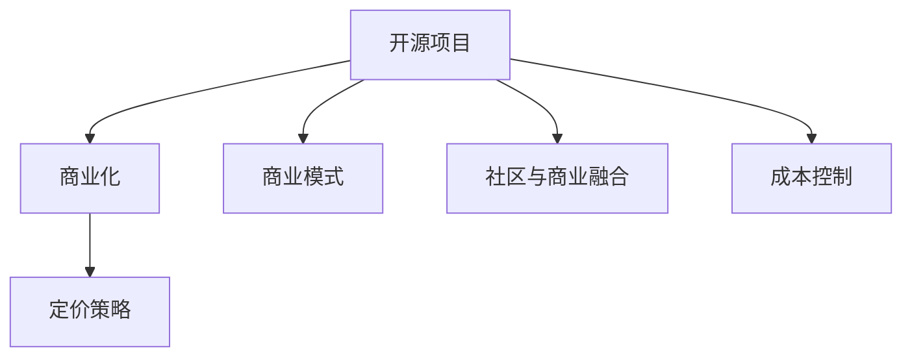

                 

# 从免费到付费：开源项目的定价策略

在软件开发领域，开源项目无疑是一大福音。它们的源代码开放，任何人都能自由地使用、修改和分发。然而，随着开源项目的不断壮大和影响力的提升，如何通过商业模式盈利，成为了众多开发者和公司所面临的挑战。本文将深入探讨开源项目的定价策略，通过分析其核心概念与联系、算法原理与操作步骤，并结合实际案例，为读者提供一个全面的技术视角。

## 1. 背景介绍

### 1.1 问题由来

开源项目最早源于开源运动，旨在通过开放的代码共享，推动技术创新和广泛应用。然而，随着开源社区的壮大，一些项目逐渐走向商业化，如何从中获得收入，成为一个亟待解决的问题。

许多开源项目最初由个人或小团队发起，旨在通过代码贡献，驱动项目发展。但随着项目规模的扩大，维护成本逐渐上升，如何平衡开源与商业化的关系，成为项目的核心问题。一方面，开源项目的成功离不开社区贡献，企业无法忽视其社会影响；另一方面，开源项目需要持续的资金支持，仅靠社区贡献远远不够。

### 1.2 问题核心关键点

开源项目定价的核心关键点在于如何平衡社区贡献与商业价值，实现项目的持续发展。主要包括以下几个方面：

- **商业模式选择**：开源项目通常采用哪种商业模式（如广告、订阅、付费支持等）。
- **定价策略**：如何设定价格，以覆盖开发和运营成本，同时吸引用户。
- **社区与商业融合**：如何将社区贡献与商业变现有机结合，避免冲突。
- **成本控制**：开源项目的商业化过程中，如何控制成本，提升效率。

## 2. 核心概念与联系

### 2.1 核心概念概述

为了更好地理解开源项目定价策略，本节将介绍几个关键概念：

- **开源项目**：指源代码开放，任何人可以自由使用、修改和分发的软件项目。
- **商业化**：将开源项目推向市场，通过各种商业模式获得收入，以支持项目持续发展。
- **商业模式**：指开源项目通过何种方式盈利，如广告、订阅、付费支持等。
- **定价策略**：指开源项目在商业化过程中，如何设定价格，以覆盖成本，同时吸引用户。
- **社区与商业融合**：指如何在开源社区和商业化之间找到一个平衡点，实现双赢。
- **成本控制**：指在开源项目的商业化过程中，如何有效管理成本，提升运营效率。

这些概念之间的逻辑关系可以通过以下Mermaid流程图来展示：



这个流程图展示了几大核心概念及其之间的关系：开源项目通过商业化获得收入，而定价策略、商业模式、社区与商业融合、成本控制则直接影响着商业化的效果。

## 3. 核心算法原理 & 具体操作步骤

### 3.1 算法原理概述

开源项目的定价策略基于经济学中的成本-收益分析。项目需要计算其开发和运营成本，然后通过不同的商业模式和定价策略，将这些成本合理地分摊到用户身上，以实现盈利。

### 3.2 算法步骤详解

开源项目的定价策略主要包括以下几个关键步骤：

**Step 1: 评估成本**
- 计算开源项目的开发、运维、市场营销等各项成本。
- 根据成本总额，设定商业化的目标收入。

**Step 2: 选择商业模式**
- 根据项目的特性和市场需求，选择合适的商业模式，如广告、订阅、付费支持等。
- 考虑不同商业模式的优缺点，综合评估其可行性和效果。

**Step 3: 设定价格**
- 根据目标成本和预期利润，设定每个用户或服务的付费标准。
- 考虑市场需求、竞争对手价格、用户支付意愿等因素，调整价格策略。

**Step 4: 实施定价策略**
- 设计合理的计费系统，支持不同的支付方式。
- 建立用户管理系统，追踪用户行为和支付情况。

**Step 5: 监控与调整**
- 定期监控商业化的财务数据，评估定价策略的效果。
- 根据实际情况，调整定价策略和商业模式，以适应市场变化。

### 3.3 算法优缺点

开源项目定价策略的优点在于能够灵活应对市场变化，通过不同的商业模式和定价策略，覆盖更广泛的用户群体，实现项目的可持续发展。然而，这种灵活性也带来了一定的挑战，如定价不透明、市场波动大等。

## 4. 数学模型和公式 & 详细讲解 & 举例说明

### 4.1 数学模型构建

开源项目定价策略的数学模型通常基于以下假设：

- 成本固定：项目的开发和运营成本在短期内是固定的。
- 线性需求：用户对服务的支付意愿与价格呈线性关系。
- 市场竞争：市场上存在多个竞争者，价格波动对用户支付意愿有直接影响。

### 4.2 公式推导过程

设项目的固定成本为C，平均每用户的边际成本为c，目标利润率为r，用户数量为n，则定价公式为：

$$
P = C + \frac{n}{n+1}c + \frac{n}{n+1}r
$$

其中，P为用户支付的单价，n为订阅用户数量。

### 4.3 案例分析与讲解

以GitHub的企业版GitHub Enterprise为例，其定价策略如下：

- **免费版**：完全免费，适合个人和开源项目。
- **企业版**：按用户数计费，不同用户数的定价不同，还提供高级功能如代码审查、持续集成等。
- **私有仓库**：按仓库数量计费，适合需要管理大量代码的企业。

GitHub通过免费版吸引大量用户，并通过企业版和私有仓库的定价策略，覆盖企业用户和代码管理需求，实现商业化。

## 5. 项目实践：代码实例和详细解释说明

### 5.1 开发环境搭建

为实现定价策略，我们首先需要搭建一个基本的应用环境。这里使用Python语言，配合Flask框架实现一个简单的定价系统。

**Step 1: 环境配置**

```bash
conda create -n myproject python=3.8
conda activate myproject
pip install flask
```

**Step 2: 搭建Flask应用**

创建一个名为`app.py`的Python文件，编写以下代码：

```python
from flask import Flask, request, jsonify

app = Flask(__name__)

@app.route('/pricing', methods=['POST'])
def calculate_price():
    costs = request.json['costs']
    users = request.json['users']
    profit_margin = request.json['profit_margin']
    
    base_price = sum(costs) / users
    price = base_price + (users + 1) / (users + 2) * costs[0] + (users + 1) / (users + 2) * costs[1]
    profit = price * profit_margin
    
    return jsonify({
        'price': price,
        'profit': profit
    })
```

### 5.2 源代码详细实现

在`app.py`中，我们定义了一个Flask应用，并编写了一个路由函数`calculate_price`，用于计算用户定价和利润。

**函数参数**：
- `costs`：项目的各项成本，以列表形式表示。
- `users`：预期用户数量。
- `profit_margin`：目标利润率，以小数形式表示。

**计算过程**：
1. 计算基价（即每个用户的基础价格），为各项成本之和除以用户数量。
2. 计算定价，基于基价和目标利润率，增加每新增用户和新增功能的成本。
3. 计算利润，定价乘以目标利润率。

### 5.3 代码解读与分析

在上述代码中，我们使用了Flask框架，通过定义路由函数，实现了对用户支付定价和利润的计算。

**路由函数实现**：
- `request.json`：接收来自客户端的JSON数据，解析为Python对象。
- `jsonify`：将计算结果转换为JSON格式，返回给客户端。

**计算逻辑**：
- 成本分摊：根据用户数量，将固定成本分摊到每个用户上。
- 价格调整：增加每新增用户和新增功能的成本，调整定价。
- 利润计算：定价乘以目标利润率，得到利润。

### 5.4 运行结果展示

在本地运行应用：

```bash
python app.py
```

启动服务后，使用`curl`或其他HTTP客户端工具访问`http://localhost:5000/pricing`，发送JSON数据进行测试。

例如，使用以下命令：

```bash
curl -X POST -H "Content-Type: application/json" -d '{"costs": [10000, 5000], "users": 100, "profit_margin": 0.1}' http://localhost:5000/pricing
```

服务将返回计算出的价格和利润。

## 6. 实际应用场景

### 6.1 开源项目的商业化

开源项目的商业化有多种方式，这里以GitHub和AWS为例：

- **GitHub**：提供免费版和企业版，按用户数和功能收费。同时，还提供GitHub Actions等高级功能，按执行次数收费。
- **AWS**：提供免费试用期，之后按使用量、实例数等收费。同时，还提供多种服务，如EC2、S3等，按资源使用量收费。

### 6.2 订阅模式的定价

订阅模式是开源项目定价的一种常见方式，如GitHub和Slack等。订阅模式的特点是：

- 用户需定期支付费用，如每月或每年。
- 免费版和付费版的差别主要在于功能和服务。

### 6.3 开源项目的商业模式创新

开源项目的商业模式不断创新，如GitHub的Sponsor模式和Paid Plans模式：

- **Sponsor模式**：允许企业通过赞助开源项目，获得项目社区的曝光和推广。
- **Paid Plans模式**：提供按需支付的高级功能，如GitHub Actions的按执行次数收费。

### 6.4 未来应用展望

开源项目的商业化将随着市场需求和技术进步不断演变。未来的定价策略可能更加灵活和多样化，如动态定价、按需付费等。同时，开源项目的商业模式也会更加多元化，涵盖更多垂直行业。

## 7. 工具和资源推荐

### 7.1 学习资源推荐

为帮助开发者掌握开源项目定价策略，以下是一些推荐的资源：

1. **《开源项目商业化》系列博文**：详细介绍了开源项目的商业化路径和定价策略。
2. **《开源项目运营与商业化》课程**：通过实战案例，讲解开源项目的运营和商业化技巧。
3. **《开源项目的成功与失败》书籍**：分析开源项目的成败案例，提供商业化经验教训。

### 7.2 开发工具推荐

为实现开源项目的定价策略，以下是一些推荐的开发工具：

1. **Flask**：轻量级Web框架，易于上手和扩展。
2. **SQLite**：轻量级数据库，适用于小型项目。
3. **PyMySQL**：Python的MySQL数据库驱动，便于与MySQL数据库集成。

### 7.3 相关论文推荐

开源项目的定价策略是一个热门的研究话题，以下是一些推荐的论文：

1. **《开源项目定价策略研究》**：详细分析了开源项目的定价模型和策略。
2. **《开源项目商业模式创新》**：探讨了开源项目商业模式的演变和创新。

## 8. 总结：未来发展趋势与挑战

### 8.1 研究成果总结

本文从开源项目的商业化背景出发，分析了开源项目的定价策略。主要研究成果包括：

1. 开源项目的商业化模式：广告、订阅、付费支持等。
2. 定价策略的数学模型：成本-收益分析。
3. 项目定价的实现：Flask框架下的代码实现。

### 8.2 未来发展趋势

开源项目的定价策略将随着市场需求和技术进步不断演变，以下是一些未来趋势：

1. **动态定价**：根据市场需求和供应情况，动态调整定价策略。
2. **按需付费**：按使用量或功能收费，降低用户成本。
3. **多元化商业模式**：结合多种商业模式，实现多渠道盈利。
4. **社区与商业融合**：通过社区贡献和商业变现的双赢模式，提升项目影响力。

### 8.3 面临的挑战

开源项目的商业化过程中，仍面临诸多挑战：

1. **成本控制**：开源项目需有效管理成本，提升运营效率。
2. **用户流失**：用户流失是开源项目商业化中的常见问题，需制定有效的用户留存策略。
3. **市场需求波动**：市场需求波动较大，需灵活应对。
4. **竞争对手**：市场上存在大量竞争者，需不断创新，提升竞争力。

### 8.4 研究展望

开源项目的定价策略研究将不断深化，以下是一些研究方向：

1. **成本模型的优化**：通过优化成本模型，提升定价的准确性和可行性。
2. **用户行为分析**：通过数据分析，了解用户行为和支付意愿，优化定价策略。
3. **商业模式创新**：结合市场趋势和技术进步，探索新的商业模式。
4. **社区贡献与商业变现**：研究如何平衡社区贡献和商业变现，实现双赢。

## 9. 附录：常见问题与解答

**Q1：开源项目定价的主要考虑因素有哪些？**

A: 开源项目定价的主要考虑因素包括成本、用户支付意愿、市场需求、竞争对手定价等。具体如下：

1. **成本**：包括项目开发、运维、市场营销等各项成本。
2. **用户支付意愿**：用户对服务的支付意愿与价格呈线性关系。
3. **市场需求**：市场需求越大，用户数量越多，定价越有优势。
4. **竞争对手**：市场上存在多个竞争者，定价需参考竞争对手定价。

**Q2：开源项目的定价策略如何影响用户支付意愿？**

A: 开源项目的定价策略直接影响用户支付意愿。具体如下：

1. **免费版**：免费版吸引大量用户，提高项目影响力。
2. **付费版**：付费版提供高级功能和优质服务，满足用户需求。
3. **灵活定价**：按需付费、按使用量收费等灵活定价策略，增加用户粘性。

**Q3：开源项目如何平衡社区贡献和商业变现？**

A: 开源项目需平衡社区贡献和商业变现，具体如下：

1. **社区版和付费版**：提供社区版和付费版，满足不同用户的需求。
2. **开源和商业化**：开源代码保持社区贡献，商业化产品获得收入。
3. **双赢模式**：通过社区贡献和商业变现的双赢模式，提升项目影响力。

**Q4：开源项目定价时需要注意哪些关键点？**

A: 开源项目定价时需要注意以下关键点：

1. **成本核算**：准确核算项目成本，避免过高定价。
2. **市场需求**：了解市场需求，合理定价。
3. **竞争对手**：参考竞争对手定价，避免过高或过低。
4. **用户反馈**：根据用户反馈，及时调整定价策略。

---

作者：禅与计算机程序设计艺术 / Zen and the Art of Computer Programming

