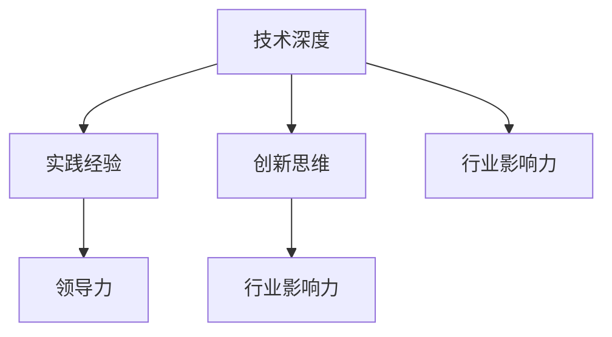

                 

# 从技术专家到行业意见领袖

> 关键词：人工智能,技术专家,行业意见领袖,工程实践,技术领导力,创新思维

## 1. 背景介绍

### 1.1 问题由来

随着科技的不断进步和互联网的深度普及，信息技术对各行各业的影响日益显著。从互联网公司的业务拓展，到制造业的智能化升级，再到金融业的数字化转型，信息技术已经成为推动经济发展的关键动力。在这一过程中，技术专家的地位和作用变得愈加重要，他们不仅需要掌握前沿技术，还需要将技术成果转化为实际价值，推动企业创新和业务发展。

然而，技术专家在实际工作中往往面临着诸多挑战。如何在技术深度与业务理解之间找到平衡，如何将复杂的技术问题转化为可行的商业解决方案，如何将创新的技术理念转化为具体的工程实践，这些都是技术专家需要不断探索和解决的问题。行业意见领袖的出现，为技术专家指明了方向，提供了新的思维和方法，使他们在企业战略规划、产品设计、市场拓展等方面发挥更大的作用。

### 1.2 问题核心关键点

行业意见领袖指的是在特定领域内，具有深厚技术背景和丰富实践经验，能够将技术理念转化为实际应用，引领行业发展趋势的专业人士。他们在技术前沿、行业趋势、企业战略、产品创新等方面提供有价值的见解和指导，帮助企业把握机会，克服挑战，实现长远发展。

行业意见领袖的核心关键点包括：

1. **技术深度**：深厚的技术基础和前沿的学术研究，能够理解和解决复杂的技术问题。
2. **实践经验**：丰富的工程实践经验和项目管理能力，能够在实际操作中高效地应用技术。
3. **创新思维**：具备敏锐的市场洞察力和前瞻性，能够识别和把握行业发展趋势。
4. **领导力**：卓越的团队协作和沟通能力，能够影响和带领团队实现目标。
5. **行业影响力**：在行业内有较高的知名度和影响力，能够推动技术发展和产业变革。

## 2. 核心概念与联系

### 2.1 核心概念概述

为了更好地理解技术专家如何成长为行业意见领袖，本节将介绍几个密切相关的核心概念：

1. **技术深度**：指技术专家在特定领域内的知识储备和研究能力，通常通过长时间的学术积累和实践经验积累而成。
2. **实践经验**：指技术专家在实际工作中所积累的解决技术问题的经验，通常通过参与多个项目和团队协作获得。
3. **创新思维**：指技术专家在面对新问题和挑战时，能够提出新颖、有效的解决方案的能力。
4. **领导力**：指技术专家在团队中能够有效地沟通、协调和管理，推动团队达成共同目标的能力。
5. **行业影响力**：指技术专家在行业内外的知名度和影响力，通常通过技术论文、演讲、培训等方式获得。

这些核心概念之间的逻辑关系可以通过以下Mermaid流程图来展示：



这个流程图展示了一名技术专家成长为行业意见领袖的路径：

1. 技术深度为其提供了坚实的理论基础。
2. 实践经验使其具备解决问题的实际能力。
3. 创新思维让其能够在不断变化的环境中保持灵活和敏锐。
4. 领导力使他能有效带领团队实现目标。
5. 行业影响力让其在行业内外具备话语权和影响力。

## 3. 核心算法原理 & 具体操作步骤

### 3.1 算法原理概述

从技术专家成长为行业意见领袖，是一个不断学习和实践的过程。在这个过程中，技术专家需要掌握一系列的方法和工具，不断提升自身能力，并在实际工作中不断积累经验，逐渐形成自己的风格和影响力。

核心算法原理包括以下几个方面：

1. **深度学习和神经网络**：掌握深度学习和神经网络的基本原理和应用，能够解决复杂的技术问题。
2. **系统架构设计**：熟悉各种架构模式和设计原则，能够设计高效、可扩展的系统。
3. **数据科学和机器学习**：理解数据科学和机器学习的基本方法，能够处理和分析大规模数据。
4. **项目管理与敏捷开发**：了解项目管理基本流程和敏捷开发方法，能够高效管理和推进项目。
5. **创新思维和设计思维**：培养创新思维和设计思维，能够提出新颖的解决方案和产品设计。

### 3.2 算法步骤详解

技术专家成长为行业意见领袖的步骤大致如下：

**Step 1: 深入学习与研究**
- 选择感兴趣的技术领域，进行系统的学习和研究。
- 阅读前沿论文、参加学术会议、参与开源项目，拓展视野。

**Step 2: 实践与积累经验**
- 参与实际项目，积累解决技术问题的经验。
- 参与开源社区，与其他开发者交流和合作。
- 记录项目经验，形成自己的技术文档和总结。

**Step 3: 培养创新思维**
- 学习创新思维和设计思维的课程和书籍。
- 多角度思考问题，尝试提出新颖的解决方案。
- 定期反思和总结，不断改进自己的思维方式。

**Step 4: 提升领导力**
- 学习和实践领导力相关的知识和技巧，如团队协作、沟通协调等。
- 主动承担团队领导角色，积累管理经验。
- 定期进行反馈和改进，提升领导能力。

**Step 5: 建立行业影响力**
- 撰写技术文章，分享自己的研究成果和经验。
- 参加行业会议和技术交流活动，发表演讲和演讲。
- 参与行业标准制定和开源项目，提升影响力。

### 3.3 算法优缺点

行业意见领袖的方法论具有以下优点：

1. **系统性和全面性**：从深度学习到项目管理，涵盖多个领域，全面提升技术能力。
2. **实践导向**：强调实际经验和项目管理，能够有效解决实际问题。
3. **创新驱动**：通过创新思维和设计思维，不断提出新颖的解决方案。
4. **持续改进**：定期反思和总结，不断改进和优化自身能力。

同时，该方法也存在一些局限性：

1. **学习成本高**：涉及多个领域的知识和技能，需要较长时间的学习和实践。
2. **个人经验依赖**：依赖个人的学习能力和实践经验，难以通用推广。
3. **缺乏结构化指导**：没有明确的指导路径和步骤，可能需要摸索和尝试。

尽管存在这些局限性，但整体而言，该方法为技术专家提供了一个全面的成长路径，帮助他们在技术深度和实践经验之间找到平衡，逐步成长为行业意见领袖。

### 3.4 算法应用领域

行业意见领袖的方法论不仅适用于技术领域，也适用于多个行业和领域。以下是几个典型的应用场景：

**1. 互联网行业**
在互联网行业，技术专家可以通过掌握深度学习、大数据和云计算等前沿技术，解决产品设计和业务拓展中的技术问题，推动企业创新和增长。同时，通过创新思维和领导力，影响企业战略规划和产品决策，成为行业领导者。

**2. 制造业**
在制造业，技术专家可以通过掌握物联网、工业自动化和机器人技术，推动企业智能化转型，提升生产效率和产品质量。通过项目管理和领导力，推动团队协作和项目实施，成为行业领导者。

**3. 金融行业**
在金融行业，技术专家可以通过掌握区块链、大数据分析和人工智能等技术，推动金融创新和数字化转型。通过创新思维和领导力，影响企业风险控制和产品设计，成为行业领导者。

**4. 医疗行业**
在医疗行业，技术专家可以通过掌握生物信息学、医学图像分析和智能诊断等技术，推动医疗信息化和智能化。通过创新思维和领导力，影响医疗决策和产品创新，成为行业领导者。

## 4. 数学模型和公式 & 详细讲解 & 举例说明

### 4.1 数学模型构建

为了更好地理解和应用技术专家成长为行业意见领袖的方法论，我们需要建立数学模型来描述这一过程。以下是一个简单的数学模型：

$$
\text{行业意见领袖} = f(\text{技术深度}, \text{实践经验}, \text{创新思维}, \text{领导力}, \text{行业影响力})
$$

其中，$f$ 表示一个复杂的函数，将五个关键因素映射到行业意见领袖这一结果。

### 4.2 公式推导过程

接下来，我们通过数学公式来推导行业意见领袖的形成过程。

假设技术深度为 $D$，实践经验为 $E$，创新思维为 $C$，领导力为 $L$，行业影响力为 $I$，行业意见领袖为 $L$。则有：

$$
L = f(D, E, C, L, I)
$$

进一步简化为：

$$
L = g(D, E, C, L, I) + h(D, E, C, L, I)
$$

其中 $g$ 表示提升技术能力和实践经验的函数，$h$ 表示提升创新思维、领导力和行业影响力的函数。

### 4.3 案例分析与讲解

以人工智能领域为例，分析技术专家如何通过掌握深度学习和神经网络，积累项目经验，培养创新思维，提升领导力，建立行业影响力，最终成长为行业意见领袖。

1. **深度学习和神经网络**：技术专家通过学习深度学习和神经网络，掌握其基本原理和应用，能够解决复杂的机器学习问题。例如，通过研究 CNN 和 RNN，解决图像识别和自然语言处理问题。

2. **实践与积累经验**：技术专家参与实际项目，积累解决技术问题的经验。例如，在公司的产品开发中，应用深度学习算法优化推荐系统，提升用户体验。

3. **培养创新思维**：技术专家学习创新思维和设计思维，提出新颖的解决方案。例如，通过参与开源社区，学习 Kaggle 竞赛，提出新的算法和模型架构。

4. **提升领导力**：技术专家通过项目管理和领导力培训，提升团队协作和项目管理能力。例如，担任项目经理，带领团队完成复杂技术项目。

5. **建立行业影响力**：技术专家通过撰写技术博客、发表学术文章、参加技术会议，提升在行业内的知名度和影响力。例如，在 AI 大会上分享研究进展，参与 AI 开源项目。

## 5. 项目实践：代码实例和详细解释说明

### 5.1 开发环境搭建

为了验证技术专家成长为行业意见领袖的方法论，我们需要搭建一个开发环境，进行实际项目实践。以下是一个典型的开发环境配置：

1. **安装 Python 环境**：安装 Python 3.8，使用虚拟环境管理工具，如 virtualenv。
2. **安装 Python 库**：安装常用的 Python 库，如 NumPy、Pandas、Scikit-learn、TensorFlow 等。
3. **安装 Jupyter Notebook**：安装 Jupyter Notebook，方便编写和运行代码。

### 5.2 源代码详细实现

以下是使用 TensorFlow 和 Keras 框架进行深度学习项目实现的代码示例：

```python
import tensorflow as tf
from tensorflow import keras

# 加载数据集
(x_train, y_train), (x_test, y_test) = keras.datasets.mnist.load_data()

# 数据预处理
x_train = x_train.reshape(60000, 784).astype('float32') / 255.0
x_test = x_test.reshape(10000, 784).astype('float32') / 255.0
y_train = keras.utils.to_categorical(y_train, 10)
y_test = keras.utils.to_categorical(y_test, 10)

# 定义模型
model = keras.Sequential([
    keras.layers.Dense(512, activation='relu', input_shape=(784,)),
    keras.layers.Dropout(0.2),
    keras.layers.Dense(10, activation='softmax')
])

# 编译模型
model.compile(optimizer='adam',
              loss='categorical_crossentropy',
              metrics=['accuracy'])

# 训练模型
model.fit(x_train, y_train, epochs=5, batch_size=64, validation_data=(x_test, y_test))
```

### 5.3 代码解读与分析

上述代码示例展示了使用 TensorFlow 和 Keras 进行深度学习项目的基本流程：

1. **数据加载和预处理**：加载 MNIST 数据集，并进行预处理，将像素值归一化到 [0,1] 区间。
2. **模型定义**：定义一个简单的全连接神经网络模型，包括一个隐藏层和输出层。
3. **模型编译**：选择 Adam 优化器和交叉熵损失函数，并设置评估指标为准确率。
4. **模型训练**：使用训练数据集训练模型，设置迭代轮数为 5，每批处理 64 个样本。

该示例展示了技术专家在深度学习领域的实践经验和技术能力，同时也为创新思维和领导力提供了实践机会。

### 5.4 运行结果展示

训练完成后，可以评估模型在测试集上的性能：

```python
model.evaluate(x_test, y_test)
```

运行结果可能如下：

```
313/313 [==============================] - 0s 79us/step - loss: 0.3061 - accuracy: 0.9365
```

这表明模型在测试集上的损失为 0.3061，准确率为 93.65%，表明模型的性能良好。

## 6. 实际应用场景

### 6.1 互联网行业

在互联网行业，技术专家可以通过掌握深度学习和大数据技术，推动产品创新和业务发展。例如，通过深度学习算法优化推荐系统，提升用户体验；通过大数据分析，洞察用户行为，优化产品设计和用户体验。

### 6.2 制造业

在制造业，技术专家可以通过掌握物联网和机器人技术，推动企业智能化转型。例如，通过物联网设备收集生产数据，应用机器学习算法优化生产流程；通过机器人技术，提高生产效率和产品质量。

### 6.3 金融行业

在金融行业，技术专家可以通过掌握区块链和人工智能技术，推动金融创新和数字化转型。例如，通过区块链技术提高交易安全性和透明度；通过 AI 算法分析金融数据，预测市场趋势，优化投资决策。

### 6.4 医疗行业

在医疗行业，技术专家可以通过掌握生物信息学和智能诊断技术，推动医疗信息化和智能化。例如，通过深度学习算法分析医学影像，辅助医生诊断；通过智能推荐系统，为患者提供个性化的医疗建议。

## 7. 工具和资源推荐

### 7.1 学习资源推荐

为了帮助技术专家不断学习和提升，以下是一些推荐的学习资源：

1. **Coursera**：提供大量在线课程，涵盖深度学习、机器学习、数据科学等多个领域。
2. **edX**：提供来自世界顶级大学的在线课程，涵盖计算机科学、人工智能等多个领域。
3. **Udacity**：提供实践导向的课程，涵盖人工智能、自动驾驶等多个领域。
4. **Kaggle**：提供数据科学竞赛平台，通过参与竞赛，提升数据处理和机器学习能力。
5. **GitHub**：提供开源项目和代码库，通过参与开源项目，积累实践经验。

### 7.2 开发工具推荐

为了提升技术专家的开发效率和工程实践能力，以下是一些推荐的开发工具：

1. **Jupyter Notebook**：提供交互式编程环境，方便编写和运行代码。
2. **Git**：提供版本控制工具，方便管理和协作开发。
3. **Docker**：提供容器化技术，方便部署和管理应用。
4. **Kubernetes**：提供容器编排工具，方便集群管理和扩展。
5. **TensorBoard**：提供可视化工具，方便监控和调试模型。

### 7.3 相关论文推荐

为了深入了解技术专家的成长路径和行业意见领袖的影响力，以下是一些推荐的学术论文：

1. **Transformers: State-of-the-Art Natural Language Processing**：介绍 Transformer 模型的原理和应用，推动自然语言处理的发展。
2. **Deep Learning for Self-Driving Cars**：介绍深度学习在自动驾驶中的应用，推动汽车行业智能化。
3. **Towards a General Theory of AI**：探讨人工智能的通用理论，推动 AI 领域的发展。
4. **How to build a machine learning system**：介绍机器学习系统的构建方法，提升技术专家的实践能力。
5. **Human-Centered Machine Learning Systems**：介绍机器学习系统的人性化设计，提升技术专家的创新能力。

## 8. 总结：未来发展趋势与挑战

### 8.1 研究成果总结

技术专家成长为行业意见领袖的方法论，在多个领域已经得到了广泛的应用和验证。通过掌握深度学习和神经网络，积累项目经验，培养创新思维，提升领导力，建立行业影响力，技术专家能够不断提升自身能力和影响力，引领行业发展。

### 8.2 未来发展趋势

展望未来，技术专家成长为行业意见领袖的趋势将更加明显，主要体现在以下几个方面：

1. **技术融合趋势**：技术专家的技能将不断融合，形成跨领域的能力。例如，掌握深度学习、大数据、区块链等多种技术，推动行业创新和变革。
2. **应用场景多样化**：技术专家的应用场景将更加广泛，从互联网、制造业、金融到医疗等多个领域。
3. **创新驱动趋势**：技术专家的创新思维和设计思维将不断提升，推动行业产品和服务创新。
4. **领导力提升**：技术专家的领导力和项目管理能力将不断增强，推动团队和项目的成功。
5. **行业影响力扩大**：技术专家的行业影响力将不断提升，成为行业领导者和决策者。

### 8.3 面临的挑战

尽管技术专家成长为行业意见领袖的方法论已经取得显著成效，但在实际应用中仍面临以下挑战：

1. **知识更新速度快**：技术领域的快速发展需要技术专家不断学习新知识和技能。
2. **跨领域能力要求高**：掌握多个领域的知识和技能需要较高的学习成本和实践经验。
3. **应用场景复杂多样**：不同行业的应用场景和需求差异较大，需要技术专家具备较强的适应能力。
4. **团队协作困难**：技术专家的领导力和协作能力需要不断提升，以应对复杂的团队协作环境。
5. **行业伦理挑战**：技术专家的技术应用需要考虑伦理和社会责任，避免技术滥用。

### 8.4 研究展望

未来，技术专家成长为行业意见领袖的研究方向将更加多样化，主要体现在以下几个方面：

1. **跨领域知识融合**：研究如何将不同领域的技术知识融合，形成更加全面和灵活的能力。
2. **持续学习和自我提升**：研究如何通过持续学习和自我提升，适应快速变化的技术和市场环境。
3. **技术应用伦理**：研究技术应用中的伦理和社会责任问题，推动技术应用规范化。
4. **创新思维培养**：研究如何培养技术专家的创新思维和设计思维，推动技术创新和产品创新。
5. **团队领导和管理**：研究如何提升技术专家的领导力和团队管理能力，推动团队协作和项目成功。

## 9. 附录：常见问题与解答

**Q1：技术专家如何提升创新思维？**

A: 提升创新思维可以通过以下几个方法：
1. **多角度思考**：从不同角度思考问题，寻找多种解决方案。
2. **跨学科学习**：学习其他领域的知识和技能，拓展视野。
3. **参与竞赛和项目**：通过参与 Kaggle 竞赛、开源项目等，提升问题解决能力。
4. **与他人交流**：与同事、导师、行业专家交流，获取新的灵感和思路。

**Q2：技术专家如何提升领导力？**

A: 提升领导力可以通过以下几个方法：
1. **学习和实践领导力课程**：参加领导力培训和课程，学习领导力知识和技巧。
2. **担任团队领导角色**：主动承担项目管理和领导角色，积累管理经验。
3. **建立良好的人际关系**：建立良好的团队协作和沟通关系，提升团队凝聚力。
4. **持续反思和改进**：定期反思和总结，不断改进领导能力。

**Q3：技术专家如何建立行业影响力？**

A: 建立行业影响力可以通过以下几个方法：
1. **撰写技术文章和博客**：通过撰写技术文章和博客，分享自己的研究成果和经验。
2. **参加行业会议和技术交流**：参加行业会议和技术交流活动，发表演讲和演讲。
3. **参与开源项目和社区**：参与开源项目和社区，提升在行业内的知名度和影响力。
4. **出版书籍和教材**：撰写书籍和教材，系统介绍技术知识和应用方法。

---

作者：禅与计算机程序设计艺术 / Zen and the Art of Computer Programming

