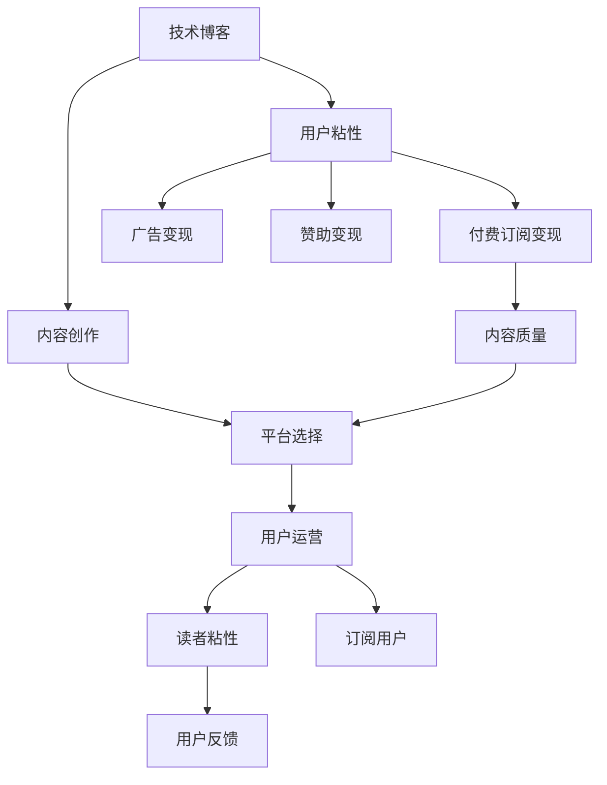

                 

## 1. 背景介绍

在当今互联网时代，技术博客已成为程序员、软件架构师、CTO等IT从业者的重要知识输出渠道。技术博客不仅能够分享自己的技术见解和实践经验，还能借助搜索引擎的流量红利，吸引大量有需求的读者。然而，单纯的技术博客往往难以形成稳定的商业变现渠道，大部分优质内容只能通过广告、赞助等方式获取微薄收益。付费专栏作为新兴的内容变现方式，凭借付费订阅模式、读者粘性高、商业变现能力强等优势，逐渐成为技术领域的内容创作者们的首选。

本文旨在探讨从技术博客到付费专栏的进阶之路，帮助IT从业者系统地理解付费专栏的运营模式和商业变现机制，掌握从内容创作到用户运营的全流程技巧，最终实现内容变现的目标。

## 2. 核心概念与联系

### 2.1 核心概念概述

为更好地理解从技术博客到付费专栏的进阶过程，本节将介绍几个关键概念：

- 技术博客：指程序员、技术从业者、技术爱好者在技术相关主题上的原创文章，主要通过免费的方式进行知识分享。
- 付费专栏：指技术创作者在专业领域内发布的一组高质量、有深度的文章集合，通常需要付费才能阅读，具备较强的商业变现能力。
- 内容变现：指技术创作者通过内容分享，将自身的知识、技能、经验等价值转化为商业收入的过程，包括广告、赞助、付费订阅等多种形式。
- 平台选择：技术创作者需要根据自身的内容特色和目标读者，选择合适的技术博客平台和付费专栏平台。
- 用户运营：指技术创作者对订阅用户的管理和服务，通过互动、反馈等方式提高用户的粘性和满意度。

这些核心概念之间的关系如下图所示：



这个流程图展示了技术博客到付费专栏的各个环节及其之间的联系：

1. 技术博客为内容创作提供平台。
2. 通过内容创作，提升用户粘性和内容质量。
3. 借助广告、赞助和付费订阅等变现形式，实现内容变现。
4. 选择合适的平台进行内容发布。
5. 通过用户运营，提高读者粘性和订阅用户数量。
6. 根据读者反馈，持续优化内容质量。

这些概念共同构成了从技术博客到付费专栏的完整流程，使内容创作者能够系统地从内容创作到商业变现，从而实现自我价值的最大化。

## 3. 核心算法原理 & 具体操作步骤

### 3.1 算法原理概述

从技术博客到付费专栏的进阶，本质上是内容创作者通过持续的高质量内容创作和运营管理，不断提升自身品牌影响力和商业变现能力的过程。这一过程遵循以下算法原理：

1. **内容创作**：内容创作者不断输出高质量的原创文章，并通过技术博客平台进行发布。通过内容质量提升，吸引并留存目标读者。

2. **平台选择**：根据内容主题和目标读者的特点，选择合适的技术博客平台或付费专栏平台。平台的特点决定了内容分发的效率和效果。

3. **用户运营**：通过互动、反馈等方式，提高订阅用户粘性，并持续优化内容和运营策略。

4. **商业变现**：结合广告变现、赞助变现和付费订阅变现等模式，实现内容变现。

### 3.2 算法步骤详解

1. **内容创作**
   - **主题定位**：根据自身的专业背景和兴趣点，选择合适的技术主题进行创作。
   - **质量把控**：确保文章内容的准确性、新颖性和实用性，定期进行内容审查和优化。
   - **格式设计**：文章内容应包括标题、正文、图片、代码段等，并按照合适的格式进行排版。
   - **SEO优化**：通过关键词优化、元数据设置等方式，提升文章在搜索引擎中的排名。

2. **平台选择**
   - **平台调研**：调查不同平台的用户群体、技术栈、平台规则等，选择合适的平台进行内容发布。
   - **平台申请**：根据平台要求，提交申请并完成平台审核。
   - **内容迁移**：将技术博客上的文章逐步迁移到新平台，并根据平台规则进行调整。

3. **用户运营**
   - **互动回应**：及时回复读者的评论、留言等互动内容，提升用户粘性。
   - **社群建设**：建立技术交流群、邮件列表等社群，提供额外的知识分享和交流渠道。
   - **用户反馈**：定期收集订阅用户的反馈，持续改进内容和运营策略。
   - **数据分析**：通过平台提供的数据分析工具，跟踪用户行为、内容表现等指标。

4. **商业变现**
   - **广告变现**：在文章中加入广告位，根据阅读量获得广告收入。
   - **赞助变现**：与技术公司、工具厂商等合作，通过赞助获取商业资源。
   - **付费订阅变现**：开设付费专栏，提供深度技术文章、独家视频教程等付费内容，吸引订阅用户。

### 3.3 算法优缺点

从技术博客到付费专栏的进阶，具有以下优点：

- **高收益**：付费专栏具备较强的商业变现能力，能够快速实现内容变现。
- **品牌提升**：高质量的专栏内容可以提升作者的品牌影响力和专业声誉。
- **读者粘性**：付费专栏具备较强的读者粘性，读者对内容的依赖度较高。
- **独立运营**：内容创作者可以根据自身需求，独立运营付费专栏，无需受制于第三方平台。

同时，这一过程也存在以下缺点：

- **内容创作难度高**：高质量的专栏内容需要持续的高水平创作和优化。
- **用户运营复杂**：付费专栏的用户运营涉及多方面的工作，需要投入较多时间和精力。
- **市场竞争激烈**：技术领域的内容创作者众多，市场竞争激烈。
- **初期投入大**：开设付费专栏需要投入一定的资金和技术支持，初期成本较高。

尽管存在这些缺点，但从技术博客到付费专栏的进阶仍是大势所趋，为内容创作者提供了更加稳定、高效的内容变现途径。

### 3.4 算法应用领域

从技术博客到付费专栏的进阶方法，适用于各类技术领域的创作者，包括但不限于：

- 软件开发：介绍最新技术趋势、编程技巧、框架使用等。
- 数据科学：分享数据分析、机器学习、数据可视化等领域的深度文章。
- 云计算：探讨云计算平台、云服务、DevOps等技术的实践经验。
- 人工智能：介绍AI模型、算法、应用场景等前沿技术。
- 网络安全：分享安全漏洞、防护策略、网络攻防技巧等。
- 物联网：介绍IoT设备、协议、应用开发等技术。

这些领域的内容创作者都可以借鉴本文介绍的方法，系统性地规划和实现内容变现，提高自身的商业价值。

## 4. 数学模型和公式 & 详细讲解 & 举例说明

### 4.1 数学模型构建

假设内容创作者在技术博客平台上有$N$篇高质量的文章，每篇文章的阅读次数为$R_i$，平台广告收费率为$\alpha$元/次。此外，创作者开设了付费专栏，每月订阅用户数为$U$，订阅费用为$\beta$元/月。设内容创作者从广告变现、赞助变现和付费订阅变现中获得的总收益为$G$。

则总收益$G$的计算公式为：

$$
G = \alpha \sum_{i=1}^{N} R_i + \gamma S + \delta \times U \times \beta
$$

其中：
- $S$为内容创作者获得的赞助费用，$\gamma$为赞助费用率。
- $\delta$为订阅用户付费比例，即订阅用户中愿意支付订阅费用的比例。

### 4.2 公式推导过程

对上述公式进行推导：

1. **广告变现**：每篇文章的阅读次数$R_i$乘以广告收费率$\alpha$，求和得到广告收入。
2. **赞助变现**：赞助费用$S$乘以赞助费用率$\gamma$，得到赞助收入。
3. **付费订阅变现**：订阅用户数$U$乘以订阅费用$\beta$，再乘以订阅付费比例$\delta$，得到订阅收入。

### 4.3 案例分析与讲解

假设内容创作者在技术博客平台上每月发布10篇文章，平均阅读次数为1000次/篇，广告收费率为0.1元/次，获得赞助费用为1000元/月，赞助费用率为0.2，每月订阅用户数为100人，订阅费用为10元/人/月，订阅付费比例为0.8。

则总收益$G$的计算如下：

$$
G = 0.1 \times 1000 \times 10 + 0.2 \times 1000 + 0.8 \times 100 \times 10 = 11000 + 200 + 800 = 12000
$$

从这个案例可以看出，广告变现、赞助变现和付费订阅变现在内容创作者总收入中占据了重要地位。创作者需要根据自身的内容特色和市场需求，合理规划和分配这些变现形式的比例，以最大化收益。

## 5. 项目实践：代码实例和详细解释说明

### 5.1 开发环境搭建

在开始技术博客和付费专栏的内容创作和运营之前，需要搭建相应的开发环境。以下是搭建开发环境的步骤：

1. **选择博客平台**：选择适合自己内容特色和技术栈的博客平台，如GitHub Pages、Medium、CSDN等。
2. **选择专栏平台**：选择适合付费专栏运营的平台，如Zhihu Live、博客园、知乎等。
3. **注册账号**：在选定的平台注册账号，并完成平台审核。
4. **安装开发工具**：安装Markdown编辑器、代码高亮工具、文章发布工具等。
5. **配置域名和SSL证书**：配置博客平台的域名和SSL证书，确保网站安全稳定。

### 5.2 源代码详细实现

以下是一个简单的技术博客文章发布代码示例：

```python
import os
from pygments import highlight
from pygments.lexers import PythonLexer
from pygments.formatters import MarkdownFormatter

def publish_article(title, content):
    # 创建文章目录
    os.makedirs(f'blog/{title}', exist_ok=True)
    
    # 创建Markdown文件
    with open(f'blog/{title}/article.md', 'w') as f:
        f.write(f'# {title}\n\n{content}\n')
    
    # 创建代码高亮文件
    with open(f'blog/{title}/code.py', 'w') as f:
        f.write('def hello_world():\n    print("Hello, World!")')
    
    # 使用Pygments进行代码高亮
    code_content = highlight('''
import os
from pygments import highlight
from pygments.lexers import PythonLexer
from pygments.formatters import MarkdownFormatter

def publish_article(title, content):
    # 创建文章目录
    os.makedirs(f'blog/{title}', exist_ok=True)
    
    # 创建Markdown文件
    with open(f'blog/{title}/article.md', 'w') as f:
        f.write(f'# {title}\n\n{content}\n')
    
    # 创建代码高亮文件
    with open(f'blog/{title}/code.py', 'w') as f:
        f.write('def hello_world():\n    print("Hello, World!")')
    
    # 使用Pygments进行代码高亮
    code_content = highlight('''
import os
from pygments import highlight
from pygments.lexers import PythonLexer
from pygments.formatters import MarkdownFormatter
''', PythonLexer(), MarkdownFormatter())
    
    # 发布文章
    with open(f'blog/{title}/index.md', 'w') as f:
        f.write(f'# {title}\n\n{code_content}\n')
    
    # 发布代码
    with open(f'blog/{title}/code.md', 'w') as f:
        f.write(f'# {title} Code Example\n\n{code_content}\n')
```

### 5.3 代码解读与分析

这个简单的代码示例实现了以下功能：

1. **创建文章目录**：根据文章标题创建目录，并确保目录存在。
2. **创建Markdown文件**：将文章标题和内容写入Markdown文件。
3. **创建代码高亮文件**：将Python代码写入代码高亮文件。
4. **使用Pygments进行代码高亮**：使用Pygments库对代码进行高亮，生成代码块。
5. **发布文章**：将文章标题和代码高亮块写入Markdown文件，发布文章。
6. **发布代码**：将Python代码写入代码高亮文件，发布代码。

通过这个示例，我们可以看到，技术博客和付费专栏的内容创作和发布过程，本质上是通过程序化的方式实现对内容的格式化、高亮和发布。这对于大规模内容创作和运营具有重要的意义。

### 5.4 运行结果展示

运行上述代码后，将在博客平台上创建一篇新的技术文章，包括文章标题、Markdown内容和代码高亮块。文章发布后，读者可以在博客平台上阅读完整内容，并进行互动评论。

## 6. 实际应用场景

### 6.1 技术博客

技术博客是内容创作者分享知识、交流技术的重要平台。通过技术博客，创作者可以展示自己的技术水平和专业素养，吸引有需求的读者关注。技术博客不仅有助于提升创作者的知名度和影响力，还能积累长期的粉丝基础，为后续付费专栏的运营奠定基础。

### 6.2 付费专栏

付费专栏是在技术博客基础上，进一步深化内容质量和商业变现的一种形式。通过付费专栏，创作者可以提供更加深入、系统的技术文章，吸引有需求的高质量用户订阅。付费专栏通常具备较强的商业变现能力，能够快速实现内容变现，为创作者提供稳定的经济收入。

### 6.3 内容变现

内容变现是指通过内容创作和运营，将自身知识、技能、经验等价值转化为商业收入的过程。内容变现的具体形式包括广告变现、赞助变现和付费订阅变现等。

### 6.4 未来应用展望

从技术博客到付费专栏的进阶，未来将呈现出以下几个趋势：

1. **视频内容兴起**：随着短视频平台的兴起，越来越多的创作者开始制作技术视频，通过视频形式分享知识。视频内容能够更好地展示技术细节和实践经验，吸引更多的用户关注。
2. **社区互动加强**：内容创作者将更加注重社区互动，通过技术交流群、问答社区等方式，增强与读者的互动和粘性。
3. **个性化推荐**：利用推荐算法，为订阅用户提供个性化的内容推荐，提高用户满意度和订阅粘性。
4. **多平台运营**：内容创作者将更多地进行多平台运营，扩大受众群体，实现更大的商业价值。
5. **内容付费市场化**：随着内容付费市场的成熟，内容创作者将更加注重内容的质量和原创性，提供更加系统和深入的技术文章，满足用户的高质量需求。

## 7. 工具和资源推荐

### 7.1 学习资源推荐

为了帮助内容创作者系统掌握从技术博客到付费专栏的进阶过程，这里推荐一些优质的学习资源：

1. **内容创作**：
   - 《内容营销的艺术》：介绍如何通过内容创作吸引用户、提高用户粘性、实现内容变现的实战经验。
   - 《内容编排的艺术》：介绍如何设计吸引人的文章结构、使用图片和代码高亮等技巧。

2. **平台选择**：
   - **博客平台**：
     - Medium：提供高质量的Markdown编辑器，支持多种语言高亮，用户群体庞大。
     - GitHub Pages：免费的静态网站托管服务，支持自定义域名和SSL证书。
   - **专栏平台**：
     - Zhihu Live：提供详细的专栏运营指南，支持订阅和付费功能。
     - 博客园：提供丰富的Markdown和HTML编辑工具，支持多平台同步。

3. **用户运营**：
   - **互动工具**：
     - Slack：提供强大的团队协作工具，支持多用户互动和消息管理。
     - Discord：提供实时聊天和社区建设功能，支持多种语言和主题。
   - **分析工具**：
     - Google Analytics：提供详细的用户行为分析报告，帮助内容创作者了解用户需求。
     - HubSpot：提供全面的CRM和营销自动化功能，帮助内容创作者进行用户管理和互动。

### 7.2 开发工具推荐

1. **Markdown编辑器**：
   - Visual Studio Code：免费的开源代码编辑器，支持多种语言和插件，适合技术博客和付费专栏的内容创作。
   - Sublime Text：轻量级的文本编辑器，支持代码高亮、Markdown渲染等功能。

2. **代码高亮工具**：
   - Pygments：开源的代码高亮库，支持多种语言和样式，适用于技术博客和付费专栏的内容创作。
   - Prism：轻量级的代码高亮库，支持多种语言和插件，适用于前端和后端开发。

3. **发布工具**：
   - Hugo：免费的静态网站生成器，支持多种主题和插件，适合技术博客和付费专栏的发布。
   - WordPress：功能强大的内容管理系统，支持多用户管理和插件扩展。

### 7.3 相关论文推荐

1. **内容创作**：
   - "Content Marketing in the Digital Age"：介绍数字时代内容营销的最新趋势和实战经验。
   - "The Power of Storytelling in Content Marketing"：介绍故事叙述在内容创作中的重要性。

2. **平台选择**：
   - "Comparing Content Management Systems"：对比不同内容管理系统的优缺点，帮助内容创作者选择合适的平台。
   - "Building Your Own Blog Platform"：介绍如何自建博客平台，满足特定需求。

3. **用户运营**：
   - "User Experience Design for Content Platforms"：介绍如何设计良好的用户界面，提升用户体验。
   - "Engaging Users with Community Building"：介绍如何通过社区建设提高用户粘性和互动。

## 8. 总结：未来发展趋势与挑战

### 8.1 总结

本文详细介绍了从技术博客到付费专栏的进阶之路，帮助内容创作者系统地理解付费专栏的运营模式和商业变现机制，掌握从内容创作到用户运营的全流程技巧。通过系统性的方法，创作者可以实现内容变现的目标，提升自身的商业价值。

### 8.2 未来发展趋势

展望未来，从技术博客到付费专栏的进阶将呈现以下几个趋势：

1. **内容多样性**：随着技术领域的不断拓展，内容创作者将推出更多样化的内容形式，包括视频、直播、播客等，以满足用户的多样化需求。
2. **商业变现创新**：内容创作者将探索更多商业变现形式，如会员制、知识付费、在线课程等，实现多渠道变现。
3. **AI辅助创作**：利用人工智能技术，帮助内容创作者自动生成内容、优化文章结构、提高创作效率。
4. **品牌影响力提升**：内容创作者将更加注重品牌建设，通过内容营销和社区互动，提升品牌知名度和影响力。
5. **国际化拓展**：随着互联网的全球化，内容创作者将更多地进行国际化运营，拓展全球受众，实现更大的商业价值。

### 8.3 面临的挑战

尽管从技术博客到付费专栏的进阶过程充满机遇，但也面临诸多挑战：

1. **内容创作难度高**：高质量的专栏内容需要持续的高水平创作和优化，创作者需要投入大量时间和精力。
2. **用户运营复杂**：付费专栏的用户运营涉及多方面的工作，需要投入较多时间和精力。
3. **市场竞争激烈**：技术领域的内容创作者众多，市场竞争激烈。
4. **初期投入大**：开设付费专栏需要投入一定的资金和技术支持，初期成本较高。
5. **技术门槛高**：技术博客和付费专栏的内容创作和运营，需要掌握一定的技术工具和平台知识。

尽管存在这些挑战，但从技术博客到付费专栏的进阶仍是大势所趋，为内容创作者提供了更加稳定、高效的内容变现途径。通过不断优化和改进，创作者可以克服这些挑战，实现自身价值的最大化。

### 8.4 研究展望

未来的研究需要在以下几个方面寻求新的突破：

1. **内容创作效率提升**：开发更加智能化的内容创作工具，帮助创作者快速生成高质量内容。
2. **用户互动优化**：利用人工智能和机器学习技术，提高用户互动的智能性和个性化。
3. **商业变现模式创新**：探索更多的商业变现模式，如会员制、知识付费、在线课程等，实现多渠道变现。
4. **品牌影响力建设**：通过内容营销和社区互动，提升品牌知名度和影响力。
5. **国际化运营**：拓展全球受众，实现国际化运营，提升内容创作者的商业价值。

这些研究方向的探索，将为从技术博客到付费专栏的进阶提供新的动力，推动内容创作者实现更加广泛和深入的技术分享和商业变现。

## 9. 附录：常见问题与解答

**Q1：如何提高内容创作的质量和原创性？**

A: 提高内容创作的质量和原创性，可以从以下几个方面入手：

1. **持续学习**：不断学习最新的技术趋势和最佳实践，积累丰富的知识和经验。
2. **专业认证**：考取相关领域的专业认证，提升自身专业素养和权威性。
3. **阅读优秀作品**：多阅读优秀的技术博客和论文，吸收和学习作者的写作风格和思路。
4. **参与社区**：积极参与技术社区，与同行交流和讨论，获取反馈和建议。
5. **工具辅助**：使用写作辅助工具，如Grammarly、Hemingway等，提高文章的可读性和逻辑性。

**Q2：如何选择合适的付费专栏平台？**

A: 选择合适的付费专栏平台，需要考虑以下几个因素：

1. **用户群体**：选择平台的用户群体是否与自身内容目标受众匹配。
2. **技术支持**：平台的API和工具是否满足内容创作和运营的需求。
3. **变现模式**：平台是否支持广告变现、赞助变现和付费订阅变现等多种变现模式。
4. **平台规则**：平台的规则和政策是否明确，是否容易操作。
5. **订阅价格**：订阅价格是否合理，是否能够吸引目标用户。

**Q3：如何提高用户的互动和粘性？**

A: 提高用户的互动和粘性，可以从以下几个方面入手：

1. **内容互动**：在文章中加入互动元素，如问答、投票、评论等，增加用户的参与感。
2. **社群建设**：建立技术交流群、邮件列表等社群，提供额外的知识分享和交流渠道。
3. **定期更新**：定期发布高质量的新内容，保持用户的关注和兴趣。
4. **用户反馈**：定期收集用户反馈，了解用户需求和意见，及时改进内容。
5. **个性化推荐**：利用推荐算法，为订阅用户提供个性化的内容推荐，提高用户满意度和订阅粘性。

**Q4：如何应对市场竞争？**

A: 应对市场竞争，可以从以下几个方面入手：

1. **差异化定位**：根据自身优势和特色，找到差异化定位，形成独特的品牌特色。
2. **内容多样化**：推出多种形式的内容，如视频、播客、课程等，满足用户的多样化需求。
3. **高质量输出**：不断提升内容质量，提供更加系统、深入的技术文章，满足用户的高质量需求。
4. **品牌建设**：通过内容营销和社区互动，提升品牌知名度和影响力，形成忠实的粉丝基础。
5. **技术创新**：利用人工智能、机器学习等前沿技术，提升创作效率和内容质量，保持市场竞争力。

---

作者：禅与计算机程序设计艺术 / Zen and the Art of Computer Programming

