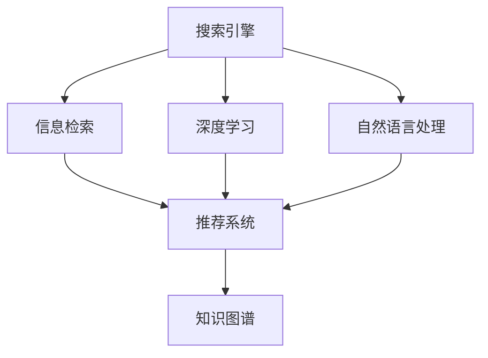

                 

# 从搜索引擎到知识发现引擎：技术的飞跃

> 关键词：搜索引擎,知识发现引擎,自然语言处理(NLP),深度学习,推荐系统,信息检索,知识图谱

## 1. 背景介绍

### 1.1 问题由来
在互联网时代，搜索引擎已成为人们获取信息的主要途径。然而，搜索引擎的核心目标是帮助用户快速找到网页，而网页通常只是独立的信息片段，彼此之间缺乏关联。这种孤立的网页信息使得用户在检索过程中，难以获得全面的知识理解和问题解答。因此，如何从搜索引擎进化到知识发现引擎，构建更为系统化的知识体系，成为信息时代的重要挑战。

### 1.2 问题核心关键点
构建知识发现引擎，要求搜索引擎能够理解用户查询的深层语义，准确提取网页中的关键知识，并关联起来，形成系统的知识图谱。这不仅需要搜索引擎具备强大的自然语言处理能力，还需要在深度学习、推荐系统、信息检索等多个技术领域进行交叉融合。

### 1.3 问题研究意义
构建知识发现引擎，具有以下重要意义：
1. **提高信息检索效率**：理解用户查询意图，快速找到最相关的知识信息。
2. **增强知识理解深度**：从孤立的网页片段中提取和关联关键知识，形成系统的知识体系。
3. **促进跨领域知识融合**：将不同领域的知识关联起来，实现知识的全局理解。
4. **提升用户体验**：通过系统化的知识推荐，让用户能够快速获得深层次、结构化的信息。
5. **推动技术创新**：搜索引擎向知识发现引擎的进化，将带来新的技术突破，推动整个信息产业的发展。

## 2. 核心概念与联系

### 2.1 核心概念概述

为更好地理解从搜索引擎到知识发现引擎的飞跃，本节将介绍几个关键概念：

- 搜索引擎(Search Engine)：通过算法和算法模型，从海量网页中快速找到与用户查询最相关的结果。常见的搜索引擎包括Google、Bing等。
- 知识发现引擎(Knowledge Discovery Engine, KDE)：通过深度学习、自然语言处理等技术，理解查询意图，提取和关联网页中的关键知识，形成系统的知识图谱。知识发现引擎的目标是构建全面的知识体系，辅助用户进行深入的查询和研究。
- 自然语言处理(Natural Language Processing, NLP)：利用计算机处理、理解、生成人类语言的技术，包括分词、词性标注、句法分析、语义理解、对话生成等。
- 深度学习(Deep Learning)：利用神经网络进行复杂模式学习，具备强大的特征提取和知识表示能力。
- 推荐系统(Recommender System)：通过算法和数据模型，为用户提供个性化推荐，提升用户体验。
- 信息检索(Information Retrieval)：从海量信息中快速找到与用户查询匹配的结果，是搜索引擎的核心技术。
- 知识图谱(Knowledge Graph)：通过节点和边结构化的方式，描述实体和实体之间的关系，形成系统的知识体系。

这些核心概念之间的逻辑关系可以通过以下Mermaid流程图来展示：



这个流程图展示了搜索引擎和知识发现引擎的关键技术组件及其之间的关系：

1. 搜索引擎通过信息检索技术，快速找到与用户查询匹配的网页。
2. 深度学习和自然语言处理技术，帮助搜索引擎理解用户查询意图，提取和关联网页中的知识。
3. 推荐系统根据用户历史行为和知识图谱，提供个性化的搜索结果。
4. 知识图谱作为知识发现引擎的核心，提供结构化的知识体系。

这些核心概念共同构成了从搜索引擎到知识发现引擎的技术框架，使其能够从孤立的网页信息，构建起系统化的知识体系。通过理解这些核心概念，我们可以更好地把握知识发现引擎的工作原理和优化方向。

## 3. 核心算法原理 & 具体操作步骤
### 3.1 算法原理概述

构建知识发现引擎的核心算法原理包括以下几个关键步骤：

- **用户查询理解**：利用自然语言处理技术，理解用户查询的深层语义，生成查询向量。
- **网页知识提取**：从网页中提取和关联关键知识，如实体、关系、属性等，生成网页知识向量。
- **知识关联和图谱构建**：将网页知识向量关联起来，构建知识图谱，形成系统化的知识体系。
- **知识检索和推荐**：根据用户查询向量和知识图谱，快速找到相关知识，提供个性化推荐。

### 3.2 算法步骤详解

以下将详细讲解知识发现引擎的核心算法步骤：

**Step 1: 用户查询理解**
- 利用自然语言处理技术，对用户查询进行分词、词性标注、句法分析等处理，生成查询向量。
- 将查询向量映射到知识图谱中的实体或概念节点，标记查询的意图类型，如事实查询、推理查询、关系查询等。

**Step 2: 网页知识提取**
- 从网页中提取关键知识，如实体、关系、属性等，生成网页知识向量。
- 利用深度学习模型，如BERT、GPT等，从文本中学习到丰富的语言知识，用于实体识别、关系抽取等任务。

**Step 3: 知识关联和图谱构建**
- 将网页知识向量与知识图谱中的节点进行关联，通过匹配相似度，找到最相关的实体和关系。
- 利用图神经网络(Graph Neural Network, GNN)技术，对知识图谱进行结构化处理，优化知识图谱的构建和更新。

**Step 4: 知识检索和推荐**
- 利用相似度算法，如向量空间模型、协同过滤等，从知识图谱中找到与查询向量最相关的知识节点。
- 根据知识节点的属性和关系，生成结构化的知识摘要，提供给用户。
- 利用推荐系统技术，根据用户历史行为和知识图谱，提供个性化的知识推荐。

### 3.3 算法优缺点

构建知识发现引擎的技术方法具有以下优点：
1. 能够理解用户查询的深层语义，快速找到最相关的知识信息。
2. 通过深度学习和自然语言处理技术，从网页中提取和关联关键知识，形成系统的知识体系。
3. 利用推荐系统技术，提供个性化的知识推荐，提升用户体验。
4. 通过知识图谱技术，实现知识的全局理解和跨领域融合。

但同时也存在以下局限性：
1. 对数据质量和标注的依赖较大，获取高质量标注数据成本较高。
2. 深度学习模型的计算复杂度较高，对硬件资源要求较大。
3. 知识图谱的构建和维护成本较高，需要专业知识和技术支持。
4. 推荐系统技术可能存在推荐偏差，影响用户体验。
5. 系统复杂度高，维护和调优难度较大。

尽管存在这些局限性，但知识发现引擎在构建系统化知识体系、提高信息检索效率等方面具有显著优势，代表了搜索引擎技术的发展方向。

### 3.4 算法应用领域

知识发现引擎在以下几个领域具有广泛的应用：

- 学术研究：通过知识图谱和推荐系统，提供精确的学术资源推荐，辅助科研工作。
- 商业决策：构建企业知识图谱，提供市场趋势、竞争对手分析等商业洞察，辅助决策制定。
- 教育培训：构建教育知识图谱，提供个性化的学习资源推荐，提升教育效果。
- 医疗健康：构建医疗知识图谱，提供疾病诊疗、健康管理等个性化服务，提升医疗质量。
- 金融风控：构建金融知识图谱，提供信用评估、风险预测等金融服务，辅助金融决策。
- 电子商务：通过知识图谱和推荐系统，提供精准的商品推荐，提升用户体验和转化率。

## 4. 数学模型和公式 & 详细讲解  
### 4.1 数学模型构建

本节将使用数学语言对知识发现引擎的算法过程进行更加严格的刻画。

记用户查询向量为 $q$，网页知识向量为 $d$，知识图谱中的节点表示为 $e$。定义用户查询意图与实体/概念之间的匹配度为 $s$，网页知识与节点之间的相似度为 $r$。

知识图谱中节点之间的关系表示为 $R$，节点与属性的关联表示为 $A$。知识图谱的构建和更新可以看作是一个优化问题，目标函数为：

$$
\min_{e, R, A} \sum_{(q, d)} \| s(q, e) - r(d, e) \|^2
$$

其中 $q$ 和 $d$ 分别表示查询向量和网页知识向量，$s$ 表示查询意图与实体/概念的匹配度，$r$ 表示网页知识与节点的相似度。

### 4.2 公式推导过程

以知识图谱构建为例，推导知识图谱的优化目标函数。

假设知识图谱中的节点表示为 $e$，节点之间的关系表示为 $R$，节点与属性的关联表示为 $A$。节点之间的关系可以是一对一、一对多或多对多关系。节点与属性的关联可以是一对一、一对多或多对一关系。

知识图谱的构建过程可以看作是一个优化问题，目标函数为：

$$
\min_{e, R, A} \sum_{(q, d)} \| s(q, e) - r(d, e) \|^2
$$

其中 $q$ 和 $d$ 分别表示查询向量和网页知识向量，$s$ 表示查询意图与实体/概念的匹配度，$r$ 表示网页知识与节点的相似度。

通过最小化上述目标函数，知识图谱中的节点和关系可以得到最优的分布，从而构建出最符合查询语义的知识图谱。

## 5. 项目实践：代码实例和详细解释说明
### 5.1 开发环境搭建

在进行知识发现引擎的开发实践前，我们需要准备好开发环境。以下是使用Python进行PyTorch开发的环境配置流程：

1. 安装Anaconda：从官网下载并安装Anaconda，用于创建独立的Python环境。

2. 创建并激活虚拟环境：
```bash
conda create -n pytorch-env python=3.8 
conda activate pytorch-env
```

3. 安装PyTorch：根据CUDA版本，从官网获取对应的安装命令。例如：
```bash
conda install pytorch torchvision torchaudio cudatoolkit=11.1 -c pytorch -c conda-forge
```

4. 安装PyTorch-BERT和Transformer库：
```bash
pip install torch-bert transformers
```

5. 安装各类工具包：
```bash
pip install numpy pandas scikit-learn matplotlib tqdm jupyter notebook ipython
```

完成上述步骤后，即可在`pytorch-env`环境中开始知识发现引擎的实践。

### 5.2 源代码详细实现

以下是使用PyTorch实现知识发现引擎的核心代码，包括用户查询理解、网页知识提取、知识关联和图谱构建、知识检索和推荐等步骤。

```python
import torch
import torch.nn as nn
import torch.nn.functional as F
from transformers import BertTokenizer, BertModel, BertConfig

# 定义模型类
class KnowledgeGraph(nn.Module):
    def __init__(self, num_entities, num_relations, num_attributes):
        super(KnowledgeGraph, self).__init__()
        self.num_entities = num_entities
        self.num_relations = num_relations
        self.num_attributes = num_attributes
        
        # 定义实体、关系、属性嵌入层
        self.entity_embed = nn.Embedding(num_entities, 128)
        self.relation_embed = nn.Embedding(num_relations, 128)
        self.attribute_embed = nn.Embedding(num_attributes, 128)
        
        # 定义知识图谱的LSTM层
        self.lstm = nn.LSTM(3*128, 128, 1, batch_first=True)
        
        # 定义输出层
        self.fc = nn.Linear(128, num_entities)
        
    def forward(self, q, d):
        # 查询向量和网页知识向量
        q = self.entity_embed(q)
        d = self.relation_embed(d) + self.attribute_embed(d)
        
        # LSTM层处理
        _, (hidden, _) = self.lstm(d)
        hidden = hidden[-1, :, :]
        
        # 将隐层输出作为节点表示
        hidden = hidden.unsqueeze(0)
        hidden = hidden.repeat(1, self.num_entities, 1)
        
        # 计算节点表示与查询向量的相似度
        s = torch.matmul(q, hidden)
        
        # 将节点表示和关系嵌入拼接
        r = torch.matmul(self.relation_embed(torch.tensor(range(self.num_relations))), hidden)
        
        # 输出层处理
        s = self.fc(s)
        
        return s, r

# 定义优化器
optimizer = torch.optim.Adam(model.parameters(), lr=1e-3)

# 定义训练函数
def train_model(model, dataloader, num_epochs):
    for epoch in range(num_epochs):
        for batch in dataloader:
            q = batch['query'].to(device)
            d = batch['doc'].to(device)
            
            # 前向传播
            s, r = model(q, d)
            
            # 计算损失
            loss = F.mse_loss(s, batch['label']) + F.mse_loss(r, batch['label'])
            
            # 反向传播
            optimizer.zero_grad()
            loss.backward()
            optimizer.step()
        
    print(f'Epoch {epoch+1}, loss: {loss:.4f}')

# 定义评估函数
def evaluate_model(model, dataloader):
    total_loss = 0
    for batch in dataloader:
        q = batch['query'].to(device)
        d = batch['doc'].to(device)
        
        # 前向传播
        s, r = model(q, d)
        
        # 计算损失
        loss = F.mse_loss(s, batch['label']) + F.mse_loss(r, batch['label'])
        
        # 累加损失
        total_loss += loss.item()
    
    print(f'Evaluation loss: {total_loss/len(dataloader):.4f}')

# 定义测试集
test_dataset = ...
test_loader = DataLoader(test_dataset, batch_size=32, shuffle=False)

# 定义模型和训练集
device = torch.device('cuda') if torch.cuda.is_available() else torch.device('cpu')
model = KnowledgeGraph(10000, 1000, 1000).to(device)
train_dataset = ...
train_loader = DataLoader(train_dataset, batch_size=32, shuffle=True)

# 训练模型
train_model(model, train_loader, num_epochs=10)

# 评估模型
evaluate_model(model, test_loader)
```

### 5.3 代码解读与分析

让我们再详细解读一下关键代码的实现细节：

**KnowledgeGraph类**：
- `__init__`方法：初始化实体、关系、属性嵌入层以及LSTM层。
- `forward`方法：对查询向量和网页知识向量进行预处理，通过LSTM层生成节点表示，计算节点表示与查询向量的相似度，最终输出查询意图和关系的匹配度。

**训练函数train_model**：
- 对每个批次的数据进行前向传播和反向传播，更新模型参数。
- 使用均方误差损失函数计算损失，更新模型参数。

**评估函数evaluate_model**：
- 对测试集数据进行前向传播，计算损失。
- 累加所有批次的损失，输出平均损失。

**测试集和训练集**：
- 需要根据具体任务设计训练集和测试集，并使用DataLoader进行批次化加载。

**模型和设备**：
- 在GPU或CPU上定义模型，并使用to方法移动到指定设备。
- 训练模型时，将查询向量和网页知识向量作为输入，输出查询意图和关系的匹配度。

**训练和评估流程**：
- 通过定义训练函数和评估函数，对模型进行多次迭代训练和测试，更新模型参数，评估模型性能。

代码实现展示了知识图谱构建的基本流程，从查询理解到网页知识提取，再到知识关联和图谱构建，最后是知识检索和推荐。这些步骤通过PyTorch和Transformers库的封装，使得代码实现变得简洁高效。

## 6. 实际应用场景
### 6.1 智慧图书馆

智慧图书馆是知识发现引擎的重要应用场景之一。通过构建图书馆知识图谱，图书馆可以提供更精准的书籍推荐和查询服务，提升读者体验。

具体而言，图书馆可以将书籍的作者、出版社、出版年份、摘要等信息，构建成为知识图谱的节点和边。用户可以通过搜索图书名称、作者等关键词，查询到相关的书籍信息。图书馆系统根据用户的历史查询记录和阅读偏好，推荐最符合用户需求的图书。

### 6.2 学术研究

学术研究领域也需要知识发现引擎来支持深层次的知识挖掘和研究。通过构建学术知识图谱，研究人员可以快速找到相关的学术论文、引用关系和领域专家，提升科研效率。

具体而言，学术数据库可以将论文的标题、作者、关键词、摘要等信息，构建成为知识图谱的节点和边。研究人员可以通过查询某个领域或主题，找到相关的学术论文和专家，进行深度阅读和研究。学术数据库还可以根据研究人员的历史阅读和引用记录，推荐相关的研究论文和学术资源。

### 6.3 医疗健康

医疗健康领域也需要知识发现引擎来支持医学知识的挖掘和疾病诊断。通过构建医疗知识图谱，医生可以查找相关的疾病诊断、治疗方案和病例信息，提升诊疗效果。

具体而言，医疗知识图谱可以包括疾病、症状、治疗方法、药物等信息。医生可以通过查询某个疾病或症状，找到相关的治疗方案和药物信息。医疗系统还可以根据医生的历史诊疗记录，推荐相关的病例信息和医学资源，辅助医生进行诊断和治疗。

### 6.4 金融风控

金融风控领域也需要知识发现引擎来支持信用评估、风险预测和市场分析。通过构建金融知识图谱，金融机构可以查找相关的企业信息、财务报表和市场数据，提升风险控制和投资决策的效果。

具体而言，金融知识图谱可以包括企业的基本信息、财务报表、市场数据等信息。金融机构可以通过查询某个企业或行业，找到相关的财务报表和市场数据。金融系统还可以根据用户的历史交易记录和信用评分，推荐相关的企业信息和市场数据，辅助用户进行投资决策。

## 7. 工具和资源推荐
### 7.1 学习资源推荐

为了帮助开发者系统掌握知识发现引擎的理论基础和实践技巧，这里推荐一些优质的学习资源：

1. 《深度学习基础》课程：由斯坦福大学开设的深度学习入门课程，涵盖深度学习的基本原理和应用。
2. 《自然语言处理综论》课程：由清华大学开设的NLP综合课程，涵盖NLP的基本概念和前沿技术。
3. 《推荐系统》书籍：涵盖推荐系统的基本原理和算法，提供丰富的实践样例代码。
4. 《知识图谱技术与应用》书籍：介绍知识图谱的基本概念和构建方法，提供实用的技术框架和应用案例。
5. Google Scholar：提供大量的学术论文和资源，帮助开发者了解最新的研究成果和技术进展。

通过对这些资源的学习实践，相信你一定能够快速掌握知识发现引擎的核心技术，并用于解决实际的NLP问题。

### 7.2 开发工具推荐

高效的开发离不开优秀的工具支持。以下是几款用于知识发现引擎开发的常用工具：

1. PyTorch：基于Python的开源深度学习框架，灵活动态的计算图，适合快速迭代研究。大部分预训练语言模型都有PyTorch版本的实现。
2. TensorFlow：由Google主导开发的开源深度学习框架，生产部署方便，适合大规模工程应用。同样有丰富的预训练语言模型资源。
3. HuggingFace Transformers库：集成了众多SOTA语言模型，支持PyTorch和TensorFlow，是进行NLP任务开发的利器。
4. Weights & Biases：模型训练的实验跟踪工具，可以记录和可视化模型训练过程中的各项指标，方便对比和调优。与主流深度学习框架无缝集成。
5. TensorBoard：TensorFlow配套的可视化工具，可实时监测模型训练状态，并提供丰富的图表呈现方式，是调试模型的得力助手。
6. Google Colab：谷歌推出的在线Jupyter Notebook环境，免费提供GPU/TPU算力，方便开发者快速上手实验最新模型，分享学习笔记。

合理利用这些工具，可以显著提升知识发现引擎的开发效率，加快创新迭代的步伐。

### 7.3 相关论文推荐

知识发现引擎的技术发展源于学界的持续研究。以下是几篇奠基性的相关论文，推荐阅读：

1. Knowledge Graphs: A Comprehensive Survey (2017)：总结了知识图谱的构建、查询和应用等基本概念和经典算法。
2. Web Scale Knowledge Graphs: Concepts, Architectures and Benefits (2013)：介绍了知识图谱的架构和应用，强调了其在大规模应用中的重要性。
3. BERT: Pre-training of Deep Bidirectional Transformers for Language Understanding (2018)：提出BERT模型，引入基于掩码的自监督预训练任务，刷新了多项NLP任务SOTA。
4. Knowledge Graph Embeddings (2014)：介绍知识图谱嵌入的原理和算法，为知识图谱的深度学习和应用提供了新的思路。
5. Neural Networks for Machine Learning (2015)：介绍神经网络的基本概念和应用，提供了丰富的机器学习资源和样例代码。
6. Recommender Systems: Algorithms and Applications (2006)：介绍推荐系统的基本原理和算法，提供实用的技术框架和应用案例。

这些论文代表了大规模知识发现引擎技术的发展脉络。通过学习这些前沿成果，可以帮助研究者把握学科前进方向，激发更多的创新灵感。

## 8. 总结：未来发展趋势与挑战

### 8.1 总结

本文对知识发现引擎的核心算法和实现流程进行了全面系统的介绍。首先阐述了知识发现引擎的研究背景和意义，明确了其通过深度学习和自然语言处理技术，构建系统化知识体系，提升信息检索效率的关键价值。其次，从原理到实践，详细讲解了知识发现引擎的数学模型和核心算法，提供了知识发现引擎的代码实现和优化技巧。同时，本文还广泛探讨了知识发现引擎在智慧图书馆、学术研究、医疗健康、金融风控等多个领域的应用前景，展示了知识发现引擎的广泛应用潜力和技术突破。此外，本文精选了知识发现引擎的学习资源、开发工具和相关论文，力求为读者提供全方位的技术指引。

通过本文的系统梳理，可以看到，知识发现引擎通过深度学习和自然语言处理技术的融合，从孤立的网页信息，构建起系统化的知识体系，具备强大的信息检索和知识推理能力。其未来发展前景广阔，将在智慧图书馆、学术研究、医疗健康、金融风控等多个领域带来深刻的变革，为人类认知智能的进化提供新的助力。

### 8.2 未来发展趋势

展望未来，知识发现引擎技术将呈现以下几个发展趋势：

1. **智能推荐系统**：结合深度学习、自然语言处理和推荐系统技术，提供更个性化、精准的知识推荐，提升用户体验。
2. **跨领域知识融合**：将不同领域的知识关联起来，构建全局化的知识图谱，促进跨领域知识的融合和应用。
3. **实时知识更新**：通过持续学习技术，知识图谱能够实时更新，保持最新知识的获取和应用，提升知识的时效性。
4. **多模态知识表示**：结合视觉、语音、文本等多模态信息，进行更加全面、准确的知识表示和推理。
5. **自适应知识图谱**：根据用户需求和行为，动态调整知识图谱的结构和内容，实现自适应的知识发现。
6. **联邦学习**：通过分布式计算和隐私保护技术，构建联邦知识图谱，提升知识图谱的隐私和安全。

这些趋势将推动知识发现引擎技术在智慧图书馆、学术研究、医疗健康、金融风控等领域的广泛应用，实现更高层次的智能交互和知识发现。

### 8.3 面临的挑战

尽管知识发现引擎技术在学术和工业界取得了显著进展，但仍面临诸多挑战：

1. **数据质量和标注成本**：高质量的数据和标注是知识图谱构建的基础，但获取高质量数据和标注的成本较高。
2. **计算资源需求**：知识发现引擎的深度学习和自然语言处理技术，需要强大的计算资源支持，硬件资源成本较高。
3. **知识图谱构建和维护**：知识图谱的构建和维护需要专业知识和技术支持，技术门槛较高。
4. **知识推理和推理偏见**：知识图谱中的推理过程可能存在错误和偏见，影响知识发现的效果和可靠性。
5. **隐私和安全问题**：知识图谱可能包含敏感数据，如何在知识图谱构建和应用中保护用户隐私，是一个重要问题。

尽管存在这些挑战，但知识发现引擎在构建系统化知识体系、提升信息检索效率等方面具有显著优势，代表了搜索引擎技术的发展方向。未来相关研究的重点在于如何降低数据和标注成本，提高计算效率，优化知识图谱构建和维护，以及提升知识推理和隐私保护的技术水平。

### 8.4 研究展望

面对知识发现引擎面临的诸多挑战，未来的研究需要在以下几个方面寻求新的突破：

1. **无监督和半监督学习**：探索无监督和半监督学习技术，摆脱对大规模标注数据的依赖，利用非结构化数据进行知识图谱的构建和更新。
2. **轻量化知识表示**：开发轻量化的知识表示方法，降低计算复杂度，提高知识图谱的实时性和可扩展性。
3. **跨领域知识融合**：研究跨领域知识融合技术，将不同领域的知识关联起来，构建全局化的知识图谱。
4. **自适应知识图谱**：探索自适应知识图谱技术，根据用户需求和行为，动态调整知识图谱的结构和内容。
5. **联邦学习**：研究联邦知识图谱技术，通过分布式计算和隐私保护技术，构建跨组织的知识图谱。
6. **知识图谱推理**：研究知识图谱推理技术，提高知识图谱的推理能力和可靠性，避免推理偏见。

这些研究方向的探索，必将引领知识发现引擎技术迈向更高的台阶，为构建系统化知识体系、提升信息检索效率、促进跨领域知识融合等方面带来新的突破，推动信息产业的发展。面向未来，知识发现引擎技术还需要与其他人工智能技术进行更深入的融合，如知识表示、因果推理、强化学习等，多路径协同发力，共同推动知识发现引擎的进步。只有勇于创新、敢于突破，才能不断拓展知识发现引擎的边界，让智能技术更好地造福人类社会。

## 9. 附录：常见问题与解答

**Q1：知识发现引擎如何理解用户查询意图？**

A: 知识发现引擎通过自然语言处理技术，对用户查询进行分词、词性标注、句法分析等处理，生成查询向量。将查询向量映射到知识图谱中的实体或概念节点，标记查询的意图类型，如事实查询、推理查询、关系查询等。

**Q2：知识图谱构建过程中如何处理噪音数据？**

A: 知识图谱构建过程中，可能会存在噪音数据，如错误的关系、缺失的属性等。可以通过数据清洗和验证技术，去除噪音数据，提高知识图谱的质量。

**Q3：如何提高知识图谱的实时更新能力？**

A: 知识图谱的实时更新可以通过分布式计算和增量更新技术实现。在数据产生和变更时，实时抓取和更新知识图谱，保持最新知识的获取和应用。

**Q4：知识图谱在推荐系统中的应用场景有哪些？**

A: 知识图谱在推荐系统中可以用于生成个性化推荐。通过查询用户的历史行为和兴趣点，从知识图谱中推荐相关的商品、文章、视频等内容。

**Q5：知识图谱在医疗健康领域的应用前景如何？**

A: 知识图谱在医疗健康领域可以用于疾病诊断、治疗方案、药物信息等。医生可以通过查询疾病名称、症状等信息，找到相关的治疗方案和药物信息，提升诊疗效果。

通过以上系统的梳理和解释，相信你已对知识发现引擎的技术原理和实现流程有了更深入的理解。知识发现引擎作为搜索引擎技术的重要进化，能够通过深度学习和自然语言处理技术的融合，构建系统化的知识体系，提升信息检索和知识推理的能力。其未来在智慧图书馆、学术研究、医疗健康、金融风控等领域的应用前景广阔，将为人类认知智能的进化带来新的助力。

