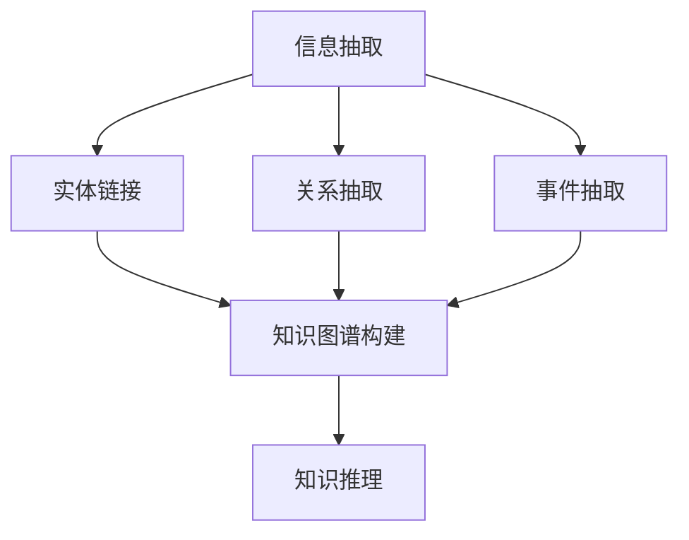

                 

# 从海量信息中提炼知识：知识发现引擎的作用

> 关键词：知识发现引擎,信息提取,自然语言处理,知识图谱,人工智能

## 1. 背景介绍

### 1.1 问题由来

在互联网时代，数据量呈指数级增长，但信息的质量和结构却参差不齐。面对海量的文本、图片、视频等结构化及非结构化数据，如何从中高效提取有用的知识，成为了当前数据科学和人工智能研究的重要课题。为此，知识发现引擎应运而生，成为了信息抽取、文本挖掘、自然语言处理等领域的热门工具。

### 1.2 问题核心关键点

知识发现引擎的核心目标是自动地从文本中抽取实体、关系、事件等信息，构建知识图谱，辅助人们高效理解和利用海量信息。其工作原理和流程大致如下：

1. **信息抽取**：识别出文本中的关键实体，如人名、地名、机构名等，并将其映射到统一的知识表示中。
2. **关系抽取**：从文本中抽取实体之间的关系，如“张三在阿里工作”。
3. **事件抽取**：从文本中提取出描述特定事件的信息，如“腾讯收购Supercell”。
4. **实体链接**：将抽取出的实体与已有的知识库或百科全书进行链接，确保实体的一致性和正确性。
5. **知识图谱构建**：将抽取的信息整合构建为知识图谱，形成结构化的知识网络。

这些步骤不仅需要强大的自然语言处理能力，还需要对知识表示和推理技术的深度理解。知识发现引擎的诞生，使得非专家也能通过输入简单的自然语言描述，快速构建出精准的领域知识图谱，为决策支持、数据驱动的创新提供有力支撑。

### 1.3 问题研究意义

知识发现引擎在提升信息处理效率、降低人工标注成本、支持智能决策等方面具有重要意义：

1. **提升效率**：自动化抽取和整合知识，大幅降低信息处理的成本和周期。
2. **降低成本**：通过自动化的数据标注和信息提取，减少人工标注的误差和费用。
3. **支持决策**：构建精准的知识图谱，辅助企业决策和风险控制。
4. **驱动创新**：整合多源异构数据，为学术研究和行业应用提供有力支持。

## 2. 核心概念与联系

### 2.1 核心概念概述

为更好地理解知识发现引擎的工作原理，本节将介绍几个核心概念及其联系：

- **知识图谱**：以图结构表示实体、属性和关系的数据模型，用于构建结构化的知识表示。
- **信息抽取**：从非结构化文本中自动抽取出结构化的实体、关系等知识信息。
- **自然语言处理**：利用计算机技术实现对自然语言的理解、生成和处理，是知识发现引擎的基础。
- **实体链接**：将抽取出的实体链接到已有的知识库或百科全书，确保实体的准确性和一致性。
- **知识推理**：利用图结构对知识图谱进行推理和预测，获取更丰富的知识表达。

这些核心概念之间的联系可以通过以下Mermaid流程图来展示：



这个流程图展示了几大核心概念及其之间的关系：

1. 从非结构化文本中抽取信息，并通过实体链接连接至知识库。
2. 抽取关系和事件，丰富知识图谱的内容。
3. 构建的知识图谱进行推理，形成预测和推断。

## 3. 核心算法原理 & 具体操作步骤
### 3.1 算法原理概述

知识发现引擎的核心算法可以归纳为信息抽取和知识图谱构建两大步骤。信息抽取旨在从文本中识别关键实体和关系，构建初始的知识图谱。知识图谱构建则是在此基础上，通过关系抽取、实体链接和知识推理等技术，丰富和完善知识图谱的结构。

### 3.2 算法步骤详解

**Step 1: 信息抽取**

信息抽取通常分为两个阶段：实体识别和关系抽取。

1. **实体识别**：
   - 使用命名实体识别(NER)模型，识别出文本中的实体，如人名、地名、机构名等。
   - 将识别的实体映射到统一的实体类型，如PER(人名)、LOC(地点)、ORG(组织)等。
   - 常用的命名实体识别模型包括BIO(Begin-Inside-Outside)、BIOES(Begin-Inside-Outside-End-Single)、CRF(条件随机场)等。

2. **关系抽取**：
   - 通过依存句法分析，解析句子结构，获取实体之间的关系。
   - 常用的关系抽取模型包括基于规则的方法、基于统计的方法和基于深度学习的方法。
   - 深度学习方法通常使用LSTM、CNN、BERT等模型，通过上下文嵌入提取关系特征。

**Step 2: 知识图谱构建**

1. **实体链接**：
   - 将抽取出的实体链接至知识库，如Wikipedia、Freebase等。
   - 使用自然语言处理技术解析实体名称和链接文本，判断实体是否匹配。
   - 常用的实体链接算法包括MapReduce、SPARQL、基于深度学习的方法等。

2. **知识推理**：
   - 利用图结构进行推理，获取新的知识和关系。
   - 常用的知识推理算法包括基于规则的推理、基于逻辑的推理、基于图神经网络的推理等。
   - 图神经网络通过节点和边之间的消息传递，学习知识图谱中的复杂关系。

### 3.3 算法优缺点

知识发现引擎的优点包括：

1. 自动化信息抽取和知识构建，大幅提升信息处理效率。
2. 降低人工标注成本，减少人为误差。
3. 支持多源异构数据整合，形成更丰富的知识表示。

同时，该方法也存在一些局限性：

1. 对数据质量和标注准确性要求高。
2. 构建的知识图谱可能存在噪音和偏差。
3. 知识推理模型复杂度较高，推理效率有限。

尽管存在这些局限性，但知识发现引擎在知识图谱构建和信息抽取领域仍具有重要地位。未来研究重点在于如何提升知识图谱的质量和效率，以及优化知识推理算法。

### 3.4 算法应用领域

知识发现引擎在多个领域得到了广泛应用，例如：

- 金融领域：从新闻、报告中抽取公司财务数据、人物关系等信息，辅助投资决策。
- 医疗领域：从病历、文献中抽取疾病信息、治疗方法等，支持临床研究。
- 情报分析：从社交媒体、新闻中抽取事件信息、人物关系，支持反恐情报分析。
- 新闻推荐：从新闻中抽取关键词、主题，推荐相关新闻，提高用户阅读体验。
- 智慧城市：从交通、环保数据中抽取事件、关系，支持城市管理决策。

## 4. 数学模型和公式 & 详细讲解 & 举例说明

### 4.1 数学模型构建

知识发现引擎的数学模型主要涉及命名实体识别、关系抽取和知识推理三个部分。这里以命名实体识别为例，介绍其数学模型的构建。

**命名实体识别模型**：
- **输入**：文本序列 $x_1,x_2,...,x_n$。
- **输出**：每个位置对应的标签序列 $y_1,y_2,...,y_n$。
- **目标**：最大化条件概率 $P(y|x)$。

常用的数学模型包括：

1. **条件随机场(CRF)**：
   - 定义状态转移概率 $T(x_i,y_i;x_{i-1},y_{i-1})$。
   - 定义发射概率 $E(x_i,y_i)$。
   - 定义全局概率 $P(y|x)=\prod_{i=1}^n T(x_i,y_i;x_{i-1},y_{i-1})E(x_i,y_i)$。

2. **循环神经网络(RNN)**：
   - 定义隐状态 $h_i=f(h_{i-1},x_i)$。
   - 定义标注概率 $P(y_i|x_i,h_i)$。
   - 定义全局概率 $P(y|x)=\prod_{i=1}^n P(y_i|x_i,h_i)$。

**关系抽取模型**：
- **输入**：两个实体序列 $e_1,e_2,...,e_n$。
- **输出**：关系序列 $r_1,r_2,...,r_n$。
- **目标**：最大化条件概率 $P(r|e)$。

常用的数学模型包括：

1. **基于规则的方法**：
   - 定义规则集合 $R$。
   - 定义关系概率 $P(r|e)=\prod_{i=1}^n P(r_i|e_i,r_{i-1})$。

2. **基于统计的方法**：
   - 定义统计概率 $P(r|e)=\sum_{i=1}^n P(r_i|e_i,r_{i-1})$。

3. **基于深度学习的方法**：
   - 定义嵌入向量 $v=E(e)$。
   - 定义关系概率 $P(r|v)=softmax(Wv+b)$。

### 4.2 公式推导过程

**命名实体识别公式推导**：
$$
P(y|x)=\prod_{i=1}^n T(x_i,y_i;x_{i-1},y_{i-1})E(x_i,y_i)
$$
其中 $T(x_i,y_i;x_{i-1},y_{i-1})$ 和 $E(x_i,y_i)$ 分别为状态转移概率和发射概率。

**关系抽取公式推导**：
$$
P(r|e)=\prod_{i=1}^n P(r_i|e_i,r_{i-1})
$$
其中 $r_i$ 为关系，$e_i$ 为实体。

### 4.3 案例分析与讲解

**案例1: 金融领域知识图谱构建**
- **数据来源**：金融新闻、公司财报。
- **信息抽取**：从新闻中抽取公司名称、市值、营收、CEO等实体，从财报中抽取年度财务数据、季度报表等。
- **实体链接**：将抽取出的公司名称链接至Wikipedia，抽取的财报数据链接至Yahoo Finance。
- **知识推理**：构建公司-CEO、公司-市值、公司-营收等关系图谱，辅助投资者决策。

**案例2: 医疗领域知识图谱构建**
- **数据来源**：病历记录、医学文献。
- **信息抽取**：从病历中抽取病人姓名、诊断结果、治疗方案等，从文献中抽取疾病名称、治疗方法、研究进展等。
- **实体链接**：将抽取出的病人姓名链接至医院数据库，抽取的疾病名称链接至梅奥诊所知识库。
- **知识推理**：构建病人-诊断、疾病-治疗、治疗-效果等关系图谱，支持医生决策和临床研究。

## 5. 项目实践：代码实例和详细解释说明

### 5.1 开发环境搭建

在进行知识发现引擎实践前，我们需要准备好开发环境。以下是使用Python进行SpaCy开发的环境配置流程：

1. 安装Anaconda：从官网下载并安装Anaconda，用于创建独立的Python环境。

2. 创建并激活虚拟环境：
```bash
conda create -n spacy-env python=3.8 
conda activate spacy-env
```

3. 安装SpaCy：
```bash
conda install spacy
```

4. 下载预训练模型：
```bash
python -m spacy download en_core_web_sm
```

5. 安装各类工具包：
```bash
pip install numpy pandas scikit-learn matplotlib tqdm jupyter notebook ipython
```

完成上述步骤后，即可在`spacy-env`环境中开始知识发现引擎的开发实践。

### 5.2 源代码详细实现

下面我们以命名实体识别任务为例，给出使用SpaCy进行知识抽取的PyTorch代码实现。

首先，定义命名实体识别器：

```python
import spacy
from spacy.pipeline import EntityRecognizer

nlp = spacy.load('en_core_web_sm')
ner = nlp.get_pipe('ner')

text = "Apple is looking at buying U.K. startup for $1 billion"

doc = nlp(text)
print([(ent.text, ent.label_) for ent in doc.ents])
```

然后，定义关系抽取器：

```python
import spacy
from spacy.pipeline import SentenceMatcher

nlp = spacy.load('en_core_web_sm')
matcher = nlp.get_pipe('matcher')

# 定义规则模式
pattern = [{'TEXT': {'OP': '?'}, 'DEP': {'OP': '?'}}]

# 创建匹配器
matcher.add('rule1', None, pattern)

# 执行匹配
doc = nlp("Apple bought Google for $12 billion")
matches = matcher(doc)

# 输出匹配结果
for match_id, start, end in matches:
    matched_span = doc[start:end]
    print(matched_span.text, matched_span.dep_)
```

最后，定义知识图谱构建器：

```python
import spacy
from spacy.graph import DependencyGraph

nlp = spacy.load('en_core_web_sm')
graph = nlp.vocab.graph
graph.add_node(1)
graph.add_node(2)
graph.add_edge(1, 2, head=1, deprel='nsubj')

graph.add_node(1)
graph.add_node(3)
graph.add_edge(1, 3, head=1, deprel='dobj')

# 获取图结构
edges = graph.edges()

# 打印图结构
for edge in edges:
    print(edge)
```

以上就是使用SpaCy进行知识抽取和知识图谱构建的完整代码实现。可以看到，SpaCy提供了丰富的自然语言处理工具，极大地方便了知识发现引擎的开发。

### 5.3 代码解读与分析

让我们再详细解读一下关键代码的实现细节：

**命名实体识别器**：
- `nlp.get_pipe('ner')`：获取命名实体识别器。
- `doc.ents`：返回文本中的命名实体。

**关系抽取器**：
- `spacy.pipeline.SentenceMatcher`：用于定义和匹配模式。
- `matcher.add`：添加匹配模式。
- `doc.span`：返回匹配到的实体。

**知识图谱构建器**：
- `spacy.graph.DependencyGraph`：用于构建图结构。
- `graph.add_node`：添加节点。
- `graph.add_edge`：添加边。
- `graph.edges()`：返回图的边。

通过上述代码的实现，我们可以清晰地看到SpaCy在知识发现引擎中的应用。开发者可以在此基础上进行更多扩展和优化，如引入实体链接、知识推理等更多功能。

## 6. 实际应用场景

### 6.1 金融领域

在金融领域，知识发现引擎可以自动从新闻、财报中抽取公司、交易、市场数据等信息，构建公司-CEO、公司-市值、公司-营收等关系图谱，辅助投资者做出更明智的决策。

### 6.2 医疗领域

在医疗领域，知识发现引擎可以自动从病历、医学文献中抽取疾病、治疗、药物等信息，构建病人-诊断、疾病-治疗、治疗-效果等关系图谱，支持医生进行更精准的诊断和治疗方案选择。

### 6.3 情报分析

在情报分析领域，知识发现引擎可以自动从社交媒体、新闻中抽取事件、人物关系等信息，构建事件-参与者、事件-地点、事件-时间等关系图谱，支持反恐情报分析。

### 6.4 新闻推荐

在新闻推荐领域，知识发现引擎可以自动从新闻中抽取关键词、主题等信息，构建新闻-关键词、新闻-主题等关系图谱，推荐相关新闻，提高用户阅读体验。

### 6.5 智慧城市

在智慧城市领域，知识发现引擎可以自动从交通、环保数据中抽取事件、关系等信息，构建交通-事件、环保-事件等关系图谱，支持城市管理决策。

## 7. 工具和资源推荐

### 7.1 学习资源推荐

为了帮助开发者系统掌握知识发现引擎的理论基础和实践技巧，这里推荐一些优质的学习资源：

1. **《知识图谱: 构建、查询与应用》**：介绍知识图谱的基本概念、构建方法和应用场景，适合初学者系统学习。
2. **CS229《机器学习》课程**：斯坦福大学开设的机器学习经典课程，涵盖深度学习、结构化学习等知识，为知识发现引擎的学习打下坚实基础。
3. **KDD《知识发现与数据挖掘》会议论文集**：汇集了大量知识发现和数据挖掘领域的经典论文，适合研究者深入学习。
4. **KnowledgeGraphs.org**：知识图谱领域的权威网站，提供丰富的资源和教程，适合学习者全面掌握知识图谱的构建和应用。

通过对这些资源的学习实践，相信你一定能够快速掌握知识发现引擎的精髓，并用于解决实际的NLP问题。

### 7.2 开发工具推荐

高效的开发离不开优秀的工具支持。以下是几款用于知识发现引擎开发的常用工具：

1. **SpaCy**：提供强大的自然语言处理功能，支持命名实体识别、依存句法分析、知识图谱构建等任务。
2. **NLTK**：提供自然语言处理的基础工具，支持词性标注、句法分析、语义分析等。
3. **Stanford CoreNLP**：提供全面的自然语言处理功能，支持命名实体识别、关系抽取、句法分析等。
4. **GATE**：提供综合的自然语言处理平台，支持信息抽取、知识图谱构建、文本挖掘等任务。
5. **OpenIE**：提供自动抽取实体和关系的工具，支持基于规则和机器学习的方法。

合理利用这些工具，可以显著提升知识发现引擎的开发效率，加快创新迭代的步伐。

### 7.3 相关论文推荐

知识发现引擎的发展源于学界的持续研究。以下是几篇奠基性的相关论文，推荐阅读：

1. **《知识图谱构建与挖掘》**：作者Brda Wroblewski，详细介绍了知识图谱的构建和挖掘方法，适合研究者深入学习。
2. **《信息抽取与实体识别》**：作者Russell Bates，介绍信息抽取和实体识别的基本方法，适合入门学习。
3. **《知识图谱的构建与应用》**：作者Gerhard Weikum，介绍了知识图谱的构建方法和应用场景，适合研究者深入学习。
4. **《基于深度学习的信息抽取》**：作者Yu Chen，介绍了基于深度学习的信息抽取方法，适合研究者深入学习。

这些论文代表了大语言模型微调技术的发展脉络。通过学习这些前沿成果，可以帮助研究者把握学科前进方向，激发更多的创新灵感。

## 8. 总结：未来发展趋势与挑战

### 8.1 总结

本文对知识发现引擎进行了全面系统的介绍。首先阐述了知识发现引擎在信息处理、知识构建等方面的研究背景和意义，明确了信息抽取和知识图谱构建在知识发现引擎中的核心地位。其次，从原理到实践，详细讲解了知识发现引擎的数学模型和关键步骤，给出了知识抽取和知识图谱构建的代码实例。同时，本文还广泛探讨了知识发现引擎在金融、医疗、情报分析等众多领域的应用前景，展示了其在知识图谱构建和信息抽取中的强大能力。最后，本文精选了知识发现引擎的学习资源和开发工具，力求为读者提供全方位的技术指引。

通过本文的系统梳理，可以看到，知识发现引擎在提升信息处理效率、降低人工标注成本、支持智能决策等方面具有重要意义。知识图谱的构建和信息抽取技术的不断进步，将为智慧城市、医疗、金融等领域提供更强大、更全面的数据支撑。知识发现引擎的研究与应用，必将推动人工智能技术在各个领域的广泛应用，带来深远的影响。

### 8.2 未来发展趋势

展望未来，知识发现引擎的发展趋势将呈现以下几个方面：

1. **自动化程度提升**：自动化抽取和构建知识图谱的效率将大幅提升，更多复杂任务将被自动化处理。
2. **跨模态融合**：将文本、图像、语音等多模态数据整合，构建更丰富的知识图谱。
3. **语义理解深化**：引入更多语义理解和推理技术，提升知识图谱的语义丰富性和逻辑性。
4. **跨领域扩展**：在医疗、金融、教育等更多领域应用知识图谱，推动跨领域知识的整合与共享。
5. **智能决策支持**：知识图谱将更深入地应用于智能决策支持系统，辅助企业和政府做出更精准的决策。

这些趋势展示了知识发现引擎广阔的发展前景，也为未来的研究指明了方向。

### 8.3 面临的挑战

尽管知识发现引擎在信息抽取和知识图谱构建方面取得了一定的成就，但在迈向更加智能化、普适化应用的过程中，仍面临诸多挑战：

1. **数据质量和标注成本**：高质量数据和准确标注是知识图谱构建的基础，但这些资源的获取成本较高。
2. **知识图谱噪音和偏差**：构建的知识图谱可能存在噪音和偏差，需要进一步优化和修正。
3. **知识图谱推理复杂性**：知识图谱推理涉及复杂的图结构和逻辑推理，效率和准确性仍需提升。
4. **知识图谱更新和维护**：知识图谱需要实时更新以反映最新的信息，更新和维护的成本较高。

尽管存在这些挑战，知识发现引擎的潜力仍不可忽视，未来的研究需要在数据、算法和系统设计等方面进行深入探索。

### 8.4 研究展望

面向未来，知识发现引擎的研究方向可以归纳为以下几个方面：

1. **跨领域知识图谱构建**：研究如何将知识图谱应用于更多领域，提升跨领域知识的整合与共享能力。
2. **多模态知识抽取**：研究如何整合文本、图像、语音等多模态数据，构建更丰富的知识图谱。
3. **知识图谱智能推理**：研究如何通过深度学习和图神经网络等技术，提升知识图谱的推理效率和准确性。
4. **知识图谱自动构建**：研究如何通过自动化抽取和构建知识图谱，提高知识图谱构建的效率和质量。
5. **知识图谱更新与维护**：研究如何通过实时更新和维护知识图谱，确保知识图谱的时效性和准确性。

这些研究方向的探索，必将引领知识发现引擎向更高的技术水平迈进，为智慧城市、医疗、金融等领域提供更强大的数据支撑，推动人工智能技术的广泛应用。

## 9. 附录：常见问题与解答

**Q1：知识图谱构建和信息抽取是否适用于所有领域？**

A: 知识图谱构建和信息抽取主要适用于结构化数据的处理，如金融、医疗、情报等领域。但对于非结构化数据丰富的领域，如文学、艺术、社会学等，需要结合其他技术进行处理，如文本挖掘、情感分析等。

**Q2：知识图谱构建过程中如何处理噪音和偏差？**

A: 知识图谱构建过程中，噪音和偏差是不可避免的。常用的处理方法包括：
1. 数据清洗：去除重复、无关、错误的实体和关系。
2. 实体链接：通过链接多个知识源，消除单个知识源的偏差。
3. 知识推理：通过推理机制，修正和补充知识图谱中的错误信息。
4. 人工审核：引入人工审核机制，及时发现和纠正错误信息。

**Q3：如何提高知识图谱的推理效率和准确性？**

A: 提高知识图谱的推理效率和准确性，需要从以下几个方面入手：
1. 优化知识图谱结构：合理设计知识图谱的结构，减少推理过程中的复杂度。
2. 引入图神经网络：通过图神经网络，学习知识图谱中的复杂关系，提高推理准确性。
3. 融合其他数据源：引入多源数据，增加知识图谱的信息量和多样性，提高推理效果。
4. 实时更新和维护：通过实时更新和维护知识图谱，确保知识图谱的时效性和准确性。

**Q4：知识图谱在实际应用中面临哪些挑战？**

A: 知识图谱在实际应用中面临的挑战包括：
1. 数据获取难度大：高质量数据和标注资源获取成本较高。
2. 知识图谱更新难：知识图谱需要实时更新以反映最新的信息，更新和维护成本较高。
3. 推理复杂度高：知识图谱推理涉及复杂的图结构和逻辑推理，效率和准确性仍需提升。
4. 应用复杂度高：知识图谱的应用场景复杂多样，需要结合具体需求进行定制化设计。

这些挑战需要通过不断的技术创新和实际应用经验的积累，逐步克服。相信随着知识图谱技术的不断进步，其应用领域将更加广泛，对各行各业的影响也将更加深远。

**Q5：知识图谱与信息抽取的区别和联系是什么？**

A: 知识图谱和信息抽取是知识发现引擎中紧密相关的两个环节。
- **区别**：信息抽取主要是从文本中抽取实体和关系，构建初始的知识图谱。而知识图谱构建则是在此基础上，通过实体链接和知识推理等技术，丰富和完善知识图谱的内容。
- **联系**：信息抽取是知识图谱构建的基础，实体和关系抽取的准确性直接影响知识图谱的质量。知识图谱构建是在信息抽取的基础上，通过更深入的推理和整合，形成更加丰富的知识表示。

总之，知识图谱和信息抽取是知识发现引擎的两个重要环节，两者相互补充，共同构建更加全面和精准的知识图谱。

---

作者：禅与计算机程序设计艺术 / Zen and the Art of Computer Programming

