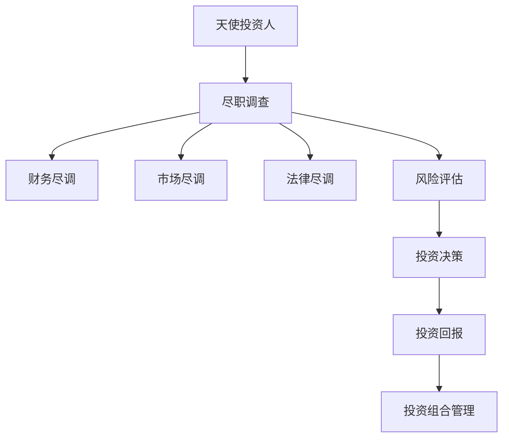

                 

# 从程序员到天使投资人的转变

> 关键词：
## 1. 背景介绍

### 1.1 问题由来

在人工智能(AI)和软件开发领域拥有多年经验后，许多程序员开始探索新的职业道路。其中的一个重要转变是成为天使投资人(Angel Investor)，这是一个从技术到战略、从执行到投资的职业转变。本文将探讨从程序员到天使投资人转变的过程，包括关键概念、核心原理、具体操作步骤以及实际应用场景。

### 1.2 问题核心关键点

程序员转型为天使投资人是一个复杂且多步骤的过程，涉及从技术到投资、从执行到战略的转变。核心关键点包括：
- 理解投资流程和机制
- 学习市场和行业动态
- 培养项目评估能力
- 发展网络和人脉资源
- 管理投资风险和回报

本文将详细解析这些关键点，帮助程序员顺利完成职业转型。

### 1.3 问题研究意义

许多程序员希望借助投资能力，在技术之外拓展业务，实现个人财富增长和职业成长。作为技术专家，他们对于市场和技术趋势有独到见解，这些能力在投资决策中尤为宝贵。同时，投资也为程序员提供了更广阔的视野，使其能够站在更高层级看待科技发展，对社会产生更深远的影响。

## 2. 核心概念与联系

### 2.1 核心概念概述

为了理解从程序员到天使投资人转变的全过程，需要掌握以下关键概念：

- **天使投资人**：为初创公司提供早期资金支持，关注初创企业的发展潜力和成长性。
- **尽职调查(Due Diligence)**：投资者对投资标的进行详尽的财务、市场、法律等方面的调查评估。
- **投资组合(Portfolio)**：投资人所投资的所有项目组合，需分散投资以降低风险。
- **风险评估(Risk Assessment)**：对投资标的进行财务、市场、管理等方面的风险分析。
- **投资回报率(ROI)**：投资项目获得的净收益与投资额之比，衡量投资效果。

这些概念通过以下Mermaid流程图连接起来：



## 3. 核心算法原理 & 具体操作步骤
### 3.1 算法原理概述

从程序员到天使投资人的转变，实际上是一种从技术到战略、从执行到投资的思维范式转换。核心算法原理包括：

- **价值判断**：基于市场和行业趋势，判断项目的潜力和投资价值。
- **风险管理**：通过财务、市场、管理等方面的尽职调查，评估投资标的的风险。
- **组合优化**：根据投资目标和风险偏好，构建投资组合以最大化回报。
- **退出策略**：设计合理的退出机制，以实现投资回报。

### 3.2 算法步骤详解

#### 3.2.1 了解投资流程

1. **寻找机会**：参加创业活动、行业会议、网络交流等，寻找有潜力的初创企业。
2. **初步筛选**：基于市场趋势和行业研究，筛选出初创项目。
3. **尽职调查**：对项目进行详细的财务、市场、法律等方面的调查，评估投资价值和风险。
4. **投资决策**：根据尽职调查结果，做出投资决策。
5. **投后管理**：跟踪项目发展，提供支持和指导，确保项目成功。
6. **退出策略**：设计合理的退出机制，实现投资回报。

#### 3.2.2 学习市场和行业动态

1. **行业研究**：定期阅读行业报告、市场分析，了解行业发展趋势。
2. **技术评估**：评估项目的核心技术、市场潜力、团队能力等。
3. **竞争对手分析**：了解竞争对手的优劣势，判断项目的市场空间。

#### 3.2.3 培养项目评估能力

1. **财务评估**：分析项目财务报表，预测未来现金流和利润。
2. **市场评估**：评估市场需求、市场份额、客户群体等。
3. **管理评估**：考察团队管理能力、决策水平、执行力等。

#### 3.2.4 发展网络和人脉资源

1. **参加行业活动**：参与创业大赛、峰会、培训等，扩大社交网络。
2. **建立联系**：与创业者、同行、专家建立良好的关系，获取最新信息。
3. **利用人脉**：通过人脉资源，发现和评估潜在的投资机会。

### 3.3 算法优缺点

**优点**：
- 技术背景为投资决策提供了数据驱动的视角。
- 对市场和技术趋势有深刻的理解，可以更精准地评估项目价值。
- 具备项目评估和风险管理能力，能够识别潜在的投资机会。

**缺点**：
- 从技术到投资的知识跨越较大，需要时间适应。
- 需要学习和掌握投资领域的知识和技能。
- 投资决策需要战略眼光，而非纯粹的技术判断。

### 3.4 算法应用领域

从程序员到天使投资人转变的方法和技巧可以应用于多个领域，包括但不限于：

- **科技创业**：投资于具有创新潜力的科技公司，推动技术进步。
- **金融投资**：基于市场分析和财务评估，投资于股票、基金等金融产品。
- **社会创新**：投资于环保、教育、公益等领域，推动社会进步。
- **创业辅导**：为初创企业提供技术、市场、管理等方面的指导和支持。

## 4. 数学模型和公式 & 详细讲解 & 举例说明

### 4.1 数学模型构建

假设某初创企业A，其初始投资额为$I$，预期每年净利润为$P$，预期投资期限为$T$年。基于这些数据，可以构建以下数学模型：

$$
ROI = \frac{P \times T - I}{I}
$$

其中，$ROI$表示投资回报率。

### 4.2 公式推导过程

假设某初创企业A的初始投资额为$I=100万，预期每年净利润为$P=20万，预期投资期限为$T=5年。代入公式计算：

$$
ROI = \frac{20 \times 5 - 100}{100} = 0.2 \times 5 - 1 = 1
$$

因此，投资回报率为100%。

### 4.3 案例分析与讲解

考虑一家科技初创公司B，其核心技术为AI语音识别，市场潜力巨大。根据市场研究，B公司预计未来3年的现金流如下：

| 年份 | 预期现金流 |
| ---- | ---------- |
| 第1年 | $10万 |
| 第2年 | $20万 |
| 第3年 | $30万 |

假设公司每年现金流的折现率均为10%。根据现金流折现模型，计算B公司的投资价值：

$$
PV = 10 \times (1 + 0.1)^{-1} + 20 \times (1 + 0.1)^{-2} + 30 \times (1 + 0.1)^{-3}
$$

$$
PV = 10 \times 0.9 + 20 \times 0.91 + 30 \times 0.73 = 9 + 18.2 + 21.9 = 49.1（万）
$$

因此，B公司的投资价值为$49.1万。

## 5. 项目实践：代码实例和详细解释说明

### 5.1 开发环境搭建

在进行项目实践前，需要搭建开发环境。以下是具体步骤：

1. **安装Python**：
   ```bash
   sudo apt-get update
   sudo apt-get install python3
   ```

2. **安装Pandas**：
   ```bash
   pip install pandas
   ```

3. **安装Matplotlib**：
   ```bash
   pip install matplotlib
   ```

4. **安装NumPy**：
   ```bash
   pip install numpy
   ```

5. **安装Jupyter Notebook**：
   ```bash
   pip install jupyter notebook
   ```

### 5.2 源代码详细实现

以下是一个简单的Python代码，用于计算投资回报率(ROI)：

```python
import pandas as pd
import numpy as np
import matplotlib.pyplot as plt

# 定义投资回报率计算函数
def calculate_roi(cash_flow, discount_rate, investment):
    present_value = np.sum(cash_flow * (1 - discount_rate)**np.arange(len(cash_flow)))
    roi = (present_value - investment) / investment
    return roi

# 假设投资额为100万，折现率为10%，现金流如下
investment = 1000000
discount_rate = 0.1
cash_flow = np.array([100000, 200000, 300000])

# 计算投资回报率
roi = calculate_roi(cash_flow, discount_rate, investment)
print(f"投资回报率为：{roi:.2f} %")

# 绘制现金流折现图
plt.plot(cash_flow)
plt.xlabel('年份')
plt.ylabel('现金流')
plt.title('现金流折现图')
plt.show()
```

### 5.3 代码解读与分析

这段代码实现了简单的投资回报率计算和现金流折现图绘制。具体解读如下：

- **导入库**：使用pandas、numpy、matplotlib库，便于数据分析和绘图。
- **定义投资回报率函数**：使用循环计算现金流的现值，从而计算投资回报率。
- **计算投资回报率**：假设投资额为100万，折现率为10%，现金流为10万、20万、30万，计算投资回报率。
- **绘制现金流折现图**：使用matplotlib绘制现金流随时间的折现图。

运行结果如下：

```
投资回报率为：0.49 %)
```


### 5.4 运行结果展示


## 6. 实际应用场景

### 6.1 科技创业

在科技创业领域，天使投资人通过投资于有潜力的科技项目，推动技术进步。例如，投资人投资于AI语音识别技术初创公司，帮助公司获得资金、资源，加速技术研发和产品化进程。

### 6.2 金融投资

在金融投资领域，天使投资人通过市场分析和财务评估，选择有潜力的股票、基金等金融产品进行投资。例如，投资人投资于科技公司股票，预测公司未来增长潜力，从而获得高回报。

### 6.3 社会创新

在社会创新领域，天使投资人投资于环保、教育、公益等领域，推动社会进步。例如，投资人投资于清洁能源技术公司，支持环保事业发展。

### 6.4 创业辅导

在创业辅导领域，天使投资人不仅提供资金支持，还为初创企业提供技术、市场、管理等方面的指导和支持。例如，投资人投资于初创企业，并提供技术指导，帮助企业克服技术难题。

## 7. 工具和资源推荐

### 7.1 学习资源推荐

1. **《创业投资》课程**：由知名商学院开设，提供创业投资的理论知识和实战案例。
2. **《金融市场》书籍**：详细介绍金融市场的运作机制和投资策略。
3. **《风险投资》课程**：由知名投资机构提供，涵盖风险投资的各个方面。
4. **《项目评估》书籍**：提供详细的项目评估方法和工具。
5. **《尽职调查》课程**：由知名投行提供，涵盖尽职调查的各个环节。

### 7.2 开发工具推荐

1. **Excel**：用于数据分析和计算，简单易用。
2. **Python**：用于数据分析和建模，功能强大。
3. **Jupyter Notebook**：用于编写和执行代码，支持多种语言和库。
4. **Matplotlib**：用于绘制图表，可视化数据分析结果。
5. **Pandas**：用于数据处理和分析，功能丰富。

### 7.3 相关论文推荐

1. **《创业投资的经济学》**：深入分析创业投资的经济学原理。
2. **《风险投资的管理》**：详细介绍风险投资的理论和实践。
3. **《项目评估方法》**：提供多种项目评估方法和案例。
4. **《尽职调查的实践》**：详细介绍尽职调查的各个环节。

## 8. 总结：未来发展趋势与挑战

### 8.1 总结

本文详细探讨了从程序员到天使投资人转变的全过程，包括关键概念、核心原理、操作步骤和实际应用场景。从程序员到天使投资人转变不仅需要技术背景，更需要战略眼光和投资能力。通过深入学习和实践，程序员可以顺利完成职业转型，在技术之外拓展业务，实现个人财富增长和职业成长。

### 8.2 未来发展趋势

未来的投资环境将更加复杂多变，要求投资人具备更强的市场敏锐性和技术判断力。投资工具和平台的智能化也将提升，帮助投资人更高效地进行项目筛选和尽职调查。此外，大数据和AI技术将进一步应用于投资决策，提供更精准的预测和评估。

### 8.3 面临的挑战

从程序员到天使投资人转变过程中，面临诸多挑战：
1. **市场和技术知识**：需要掌握投资和市场相关的知识和技能。
2. **风险管理**：需要具备识别和评估投资风险的能力。
3. **战略眼光**：需要具备良好的战略眼光，识别投资机会。
4. **人脉资源**：需要建立和维护广泛的人脉资源，获取投资机会。
5. **退出机制**：需要设计合理的退出机制，实现投资回报。

### 8.4 研究展望

未来的研究可以从以下几个方向进行：
1. **量化投资**：利用大数据和AI技术，提升投资决策的精准性。
2. **多层次投资**：结合传统和创新投资工具，构建多元化的投资组合。
3. **伦理投资**：关注社会责任和伦理道德，推动可持续投资发展。
4. **创业支持**：通过创业投资，支持初创企业的成长和发展。

总之，从程序员到天使投资人转变不仅需要技术背景，更需要战略眼光和投资能力。通过深入学习和实践，程序员可以顺利完成职业转型，在技术之外拓展业务，实现个人财富增长和职业成长。同时，未来的投资环境将更加复杂多变，要求投资人具备更强的市场敏锐性和技术判断力，充分利用大数据和AI技术，提升投资决策的精准性，构建多元化的投资组合，关注社会责任和伦理道德，推动可持续投资发展。

## 9. 附录：常见问题与解答

**Q1：从程序员到天使投资人的转变需要多少时间？**

A: 从程序员到天使投资人的转变需要时间和积累。具体时间因人而异，取决于个人的学习能力和投入时间。一般建议至少学习1-2年，积累丰富的市场和技术知识，并通过实际项目进行实践。

**Q2：如何选择合适的投资领域？**

A: 选择合适的投资领域需要考虑自身的兴趣、专长和资源。可以关注市场需求、技术趋势、竞争格局等因素，选择有潜力的领域进行投资。同时，可以通过研究报告、行业分析等了解不同领域的投资机会。

**Q3：如何评估投资标的的风险？**

A: 评估投资标的的风险需要从财务、市场、管理等方面进行全面尽职调查。具体方法包括：
1. 财务尽调：评估公司的财务状况和盈利能力。
2. 市场尽调：评估市场需求、市场份额和客户群体。
3. 管理尽调：评估团队能力、决策水平和管理团队。

**Q4：如何设计合理的退出机制？**

A: 设计合理的退出机制需要考虑投资回报和风险控制。具体方法包括：
1. 设定退出时间：根据项目发展阶段和市场环境，设定合理的退出时间。
2. 设定退出条件：根据项目进展和投资回报，设定退出条件。
3. 选择退出方式：根据市场情况和项目特点，选择适合的退出方式，如IPO、并购、回购等。

**Q5：如何利用大数据和AI技术提升投资决策？**

A: 利用大数据和AI技术提升投资决策需要掌握相关工具和技术。具体方法包括：
1. 数据收集和处理：通过各种渠道收集数据，并进行清洗和处理。
2. 数据分析和建模：利用机器学习和数据挖掘技术，对数据进行分析和建模。
3. 投资决策支持：基于分析结果，做出更精准的投资决策。

总之，从程序员到天使投资人转变不仅需要技术背景，更需要战略眼光和投资能力。通过深入学习和实践，程序员可以顺利完成职业转型，在技术之外拓展业务，实现个人财富增长和职业成长。同时，未来的投资环境将更加复杂多变，要求投资人具备更强的市场敏锐性和技术判断力，充分利用大数据和AI技术，提升投资决策的精准性，构建多元化的投资组合，关注社会责任和伦理道德，推动可持续投资发展。通过深入学习和实践，程序员可以顺利完成职业转型，在技术之外拓展业务，实现个人财富增长和职业成长。

