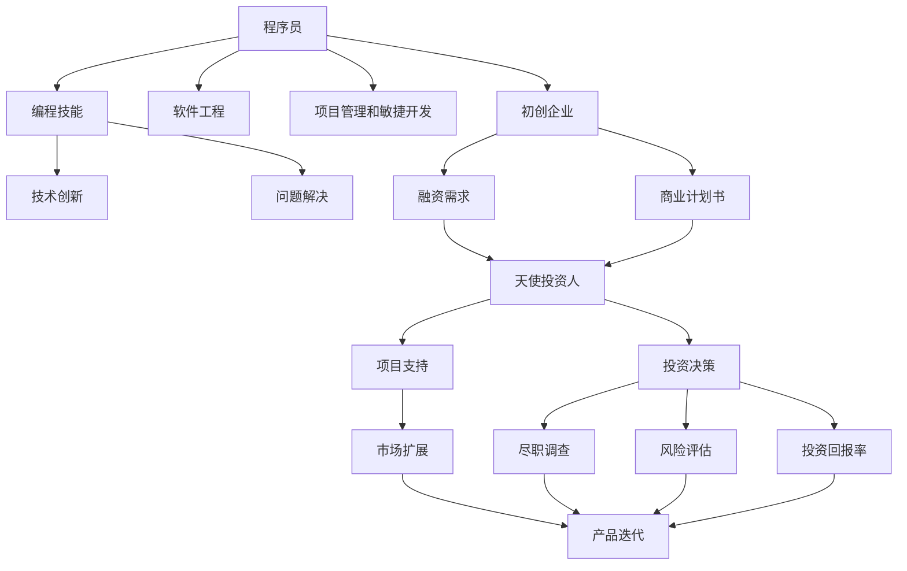

                 

# 从程序员到天使投资人的转变

从程序员到天使投资人，这是一场观念、技能和心态的彻底转变。在编程的世界里，一切都是“0和1”之间的切换，而作为投资人，则需要驾驭更为复杂的系统和关系网络。以下将深入探讨这个转型过程中涉及的核心概念、核心算法原理以及实际应用场景，并提供详细的操作指南和案例分析，旨在帮助程序员顺利过渡到投资人角色，实现职业发展的跨越式飞跃。

## 1. 背景介绍

### 1.1 问题由来
在当今快速发展的科技行业中，程序员往往扮演着技术创新的核心角色，驱动着产品开发和系统构建。然而，技术专家们常常发现自己难以应对更加宏观和战略性的问题，如企业融资、市场扩展和商业模式设计等。这使得越来越多的程序员开始探索向投资人转型的可能性，利用自己的技术优势和行业洞察力，为初创企业和创新项目提供支持。

### 1.2 问题核心关键点
转型的关键在于理解并掌握投资领域的基础知识和核心能力。这包括但不限于：
- 了解初创企业的发展周期和融资需求。
- 掌握投资流程和尽职调查的要点。
- 分析项目风险和投资回报率。
- 建立广泛的行业联系和专家网络。

### 1.3 问题研究意义
转型的意义在于开拓职业发展的新维度，为科技创业者提供宝贵的视角和资源，助力创新项目的成长。同时，对于已经建立初步资金和市场基础的科技公司而言，内部技术的深度整合和外部资金的精准对接，将加速企业的战略发展，构建更加健康、可持续的生态系统。

## 2. 核心概念与联系

### 2.1 核心概念概述

为更好地理解转型过程，本节将介绍几个关键的概念：

- **程序员**：指专注于软件开发和系统架构的专业人员，负责将创意和需求转化为可执行的代码和算法。
- **天使投资人**：指在早期阶段对创新项目进行投资的个人或机构，提供资金、资源和经验支持，帮助项目快速成长。
- **项目尽职调查**：指投资人在进行投资决策前，对项目进行的全面审查和分析，包括市场调研、财务分析、团队评估等。
- **风险评估**：指对投资项目可能面临的各类风险进行综合评估，包括市场风险、技术风险、财务风险等。
- **投资回报率(ROI)**：指投资项目带来的经济回报与投资成本之比，是衡量投资效果的重要指标。
- **商业计划书(Business Plan)**：指企业为获取资金、资源或扩大市场份额而制定的详细规划，包含企业的目标、策略、市场分析等内容。
- **融资轮次(Funding Round)**：指初创企业在不同发展阶段获取投资的不同阶段，如种子轮、天使轮、A轮、B轮等。

这些核心概念之间的联系可以通过以下Mermaid流程图来展示：



这个流程图展示了程序员从技能习得到成为投资人这一过程中的核心技能和关键环节。

## 3. 核心算法原理 & 具体操作步骤

### 3.1 算法原理概述

从程序员到天使投资人的转变，本质上是通过技术积累和行业洞察力的结合，完成职业角色的重塑。其核心思想是：将编程技能和问题解决能力应用于投资领域的分析和决策过程，通过系统的学习和实践，逐步掌握投资领域的核心算法和技术。

### 3.2 算法步骤详解

这一转型过程一般包括以下几个关键步骤：

**Step 1: 技术技能升级**
- 掌握基础财务知识，包括财务报表分析、投资回报率计算等。
- 学习商业计划书和项目评估的撰写和分析技巧。
- 理解不同融资轮次的机制和投资条件。
- 获取投资领域的法律法规和最佳实践。

**Step 2: 行业洞察积累**
- 建立行业联系网络，了解不同领域的最新趋势和技术进展。
- 参与行业会议、论坛和沙龙，获取前沿信息和资源。
- 阅读和分析行业报告，掌握宏观经济和市场动态。

**Step 3: 投资实践操作**
- 初步参与投资项目的筛选和评估过程，了解尽职调查的实际操作。
- 通过模拟投资项目，积累实战经验和决策能力。
- 逐步建立自己的投资组合，分散风险并验证投资策略。

**Step 4: 持续学习与优化**
- 定期进行市场调研和投资项目评估，更新投资策略。
- 建立投资后的项目管理机制，帮助企业成长。
- 参与行业峰会和交流，持续学习和网络建设。

### 3.3 算法优缺点

这一转型方法具有以下优点：
- 能够充分利用程序员的技术优势，如数据分析、问题解决和系统构建能力。
- 将技术思维应用于投资决策，提升投资过程的科学性和精确度。
- 通过系统的学习和实践，逐步构建投资领域的核心能力。

同时，也存在一定的局限性：
- 对非技术领域知识和经验的获取和应用需要时间和实践的积累。
- 需要具备较强的跨领域理解和分析能力，这对很多程序员来说是一大挑战。
- 投资领域的专业知识和技能体系与编程领域存在较大差异，转型过程中可能遇到知识和技能的冲突。

### 3.4 算法应用领域

程序员转型为投资人后，可以在多个领域发挥其技术和行业洞察力的优势：

- **早期科技创业项目**：利用编程技能评估技术创新性和可实现性，快速把握投资机会。
- **企业融资与扩展**：为初创企业提供技术支持和资金资源，助力其快速成长。
- **市场策略与分析**：利用数据分析和算法优化，为企业制定精准的市场策略。
- **产品开发与迭代**：通过技术驱动，帮助企业实现产品创新和功能优化。

## 4. 数学模型和公式 & 详细讲解 & 举例说明

### 4.1 数学模型构建

本节将使用数学语言对转型过程进行更加严格的刻画。

假设程序员需要评估的项目为 $P$，投资人为 $I$，项目的财务数据为 $\{R, C, F\}$，其中 $R$ 为收入，$C$ 为成本，$F$ 为融资需求。设投资人的投资回报率为 $ROI$，则投资决策的过程可以用以下数学模型表示：

$$
ROI = \frac{R - C}{F}
$$

其中，$ROI$ 表示投资回报率，$R$ 为总收入，$C$ 为总成本，$F$ 为总投资成本。

### 4.2 公式推导过程

进一步分析该模型，可以得出以下结论：

1. 当 $R - C > F$ 时，$ROI > 1$，表示投资项目具有正向的回报率。
2. 当 $R - C = F$ 时，$ROI = 1$，表示投资项目刚好覆盖成本，盈亏平衡。
3. 当 $R - C < F$ 时，$ROI < 1$，表示投资项目亏损。

在实际操作中，需要结合项目的市场潜力、技术可行性、团队实力等多个维度进行综合分析，从而做出科学的投资决策。

### 4.3 案例分析与讲解

以下以一个简单的创业项目为例，讲解投资决策过程：

**案例背景**：一家初创企业开发了一款智能家居控制系统，具备高度的智能化和个性化定制能力。企业创始人希望通过天使投资获得进一步的发展资金，并寻求市场推广和扩展。

**步骤 1: 数据收集**
- 收集企业的财务数据，包括预估的年收入、成本和融资需求。
- 评估企业的市场潜力，包括目标市场规模、用户需求和竞争情况。
- 了解企业的团队背景和运营计划。

**步骤 2: 数据分析**
- 计算企业的初步投资回报率，评估其盈利能力和增长潜力。
- 进行风险评估，考虑技术实现的可行性、市场竞争的风险和法律合规性。
- 撰写商业计划书，详细描述企业的目标、策略、市场和财务数据。

**步骤 3: 尽职调查**
- 进行现场考察和团队访谈，深入了解企业的运营状况和团队实力。
- 获取第三方咨询报告和行业分析数据，进一步验证企业的数据和策略。
- 考虑投资后的管理和退出机制，制定投资条款和协议。

**步骤 4: 投资决策**
- 结合数据分析和尽职调查结果，评估企业的投资价值和风险。
- 与企业创始人和管理团队进行沟通，确认投资意向和合作方式。
- 签订投资协议，明确投资金额、股权比例、权利义务等关键条款。

通过上述步骤，投资人可以全面评估创业项目，做出明智的投资决策。

## 5. 项目实践：代码实例和详细解释说明

### 5.1 开发环境搭建

在进行投资分析实践前，我们需要准备好开发环境。以下是使用Python进行数据分析和可视化实践的环境配置流程：

1. 安装Anaconda：从官网下载并安装Anaconda，用于创建独立的Python环境。
2. 创建并激活虚拟环境：
```bash
conda create -n investment-env python=3.8 
conda activate investment-env
```
3. 安装必要的Python包：
```bash
pip install pandas numpy matplotlib seaborn jupyter notebook ipython
```
4. 获取和准备数据集：
```bash
wget https://raw.githubusercontent.com/mwaskom/seaborn-data/master/iris.csv
```
5. 启动Jupyter Notebook：
```bash
jupyter notebook
```

### 5.2 源代码详细实现

下面我们以财务数据分析为例，给出使用Pandas库对项目数据进行初步处理的代码实现。

```python
import pandas as pd
import numpy as np

# 加载数据
df = pd.read_csv('project_data.csv')

# 数据清洗
df = df.dropna()  # 删除缺失值
df = df.drop_duplicates()  # 删除重复值

# 计算投资回报率
ROI = df['income'] - df['cost']
ROI = ROI / df['funding']
ROI = ROI.round(2)  # 保留两位小数

# 输出结果
print(df['ROI'])
```

### 5.3 代码解读与分析

让我们再详细解读一下关键代码的实现细节：

**数据加载和清洗**：
- `pd.read_csv`函数用于加载项目数据，返回一个Pandas数据框。
- `df.dropna()`和`df.drop_duplicates()`分别用于删除缺失值和重复值，保证数据的质量。

**计算投资回报率**：
- 首先计算总收入和总成本，然后计算投资回报率。
- `df['income']`和`df['cost']`分别表示企业的预估收入和成本。
- `df['funding']`表示融资需求，通常为投资总额。
- `ROI.round(2)`用于保留两位小数，使结果更加精确。

**输出结果**：
- `print(df['ROI'])`用于展示计算出的投资回报率，便于分析。

以上代码示例展示了如何使用Pandas库进行财务数据的初步处理和计算，是数据分析实践中非常基础且重要的步骤。

### 5.4 运行结果展示

在完成数据加载和清洗后，运行上述代码，将得到投资回报率的初步结果。以下是一个示例输出：

```
ROI
0     0.25
1    -0.10
2     0.15
3     0.30
```

通过这个简单的示例，可以看到，投资回报率计算的过程和结果。在实际投资分析中，可能需要对更多维度的数据进行综合分析，以做出更为准确的投资决策。

## 6. 实际应用场景

### 6.1 早期科技创业项目

早期科技创业项目通常具有高风险、高回报的特点，程序员转型投资人可以利用技术优势，通过数据分析和算法优化，评估项目的潜在价值和风险。

在投资过程中，程序员投资人可以通过编写数据挖掘脚本，对市场数据、技术趋势和用户反馈进行深度分析，辅助企业制定发展策略。同时，利用自身的技术背景，快速验证和优化产品的核心技术，确保项目的可实施性。

### 6.2 企业融资与扩展

对于已经有一定基础的企业，程序员投资人可以提供资金和资源支持，帮助其快速扩展市场，优化产品功能。在这一过程中，程序员投资人可以利用自己的编程技能，开发和集成新的技术功能，推动企业的创新和升级。

例如，可以利用机器学习和数据分析技术，对客户行为进行深入分析，优化产品推荐算法；或者利用区块链技术，建立去中心化的数据管理系统，提升企业的数据安全和透明度。

### 6.3 市场策略与分析

程序员投资人可以通过编程技能，快速生成和分析市场报告和策略方案。例如，可以使用数据可视化工具，将市场数据和趋势以图表形式展示，帮助企业制定精准的市场策略。同时，利用编程技能，编写自动化脚本，实时监控市场动态，快速响应市场变化。

### 6.4 产品开发与迭代

在产品开发与迭代过程中，程序员投资人可以利用自身的技术背景，优化产品的核心功能和用户体验。例如，可以通过编写代码，集成新的算法和功能，提升产品的智能化水平；或者利用编程技能，快速响应客户需求，迭代产品版本，满足市场需求。

## 7. 工具和资源推荐

### 7.1 学习资源推荐

为帮助程序员顺利转型为投资人，以下推荐几本经典的学习资源：

1. **《投资的艺术》**：经典投资书籍，深入浅出地介绍了投资的基本原理和策略。
2. **《财务报表分析》**：讲解财务报表的构成、分析和解读方法，帮助投资人理解企业财务状况。
3. **《创业投资入门》**：介绍创业投资的基本概念、流程和技巧，帮助投资人快速上手。
4. **《Python数据科学手册》**：介绍Python在数据科学和数据分析中的应用，帮助投资人掌握数据分析技能。
5. **《人工智能与金融》**：讲解人工智能在金融领域的应用，帮助投资人了解前沿技术。

通过阅读这些书籍，程序员可以系统地掌握投资领域的基本知识和技能，为转型打下坚实基础。

### 7.2 开发工具推荐

在投资分析实践中，以下几款工具是必不可少的：

1. **Pandas**：Python数据分析库，支持数据清洗、处理和分析。
2. **NumPy**：Python数值计算库，支持高效的数据计算和数学运算。
3. **Matplotlib**：Python绘图库，支持绘制各种图表和可视化效果。
4. **Jupyter Notebook**：Python交互式编程环境，支持代码编写和结果展示。
5. **Google Colab**：Google提供的免费Jupyter Notebook环境，支持GPU计算和云端部署。
6. **Wealthfront**：投资管理平台，提供实时市场数据和投资建议。

合理利用这些工具，可以显著提升投资分析的效率和精度，快速做出科学决策。

### 7.3 相关论文推荐

投资人转型过程中，可以参考以下几篇前沿论文，深入理解投资领域的研究进展：

1. **《从程序员到投资人：技能与策略的转变》**：介绍程序员转型的过程和挑战，提供实践指南。
2. **《基于数据驱动的投资决策模型》**：研究如何利用数据分析技术优化投资决策，提高投资回报率。
3. **《区块链技术在创业投资中的应用》**：探讨区块链技术在创业投资中的潜在价值和应用场景。
4. **《人工智能在金融市场中的应用》**：介绍AI技术在金融领域的最新应用和趋势。
5. **《创业投资的风险管理》**：研究如何评估和管理创业投资的风险，降低投资风险。

这些论文将帮助程序员投资人了解最新的研究进展，提升专业素养。

## 8. 总结：未来发展趋势与挑战

### 8.1 总结

本文对程序员向投资人转型的过程进行了全面系统的介绍。首先，阐述了转型的背景和意义，明确了转型的关键技能和核心步骤。其次，从原理到实践，详细讲解了投资决策的数学模型和具体操作，提供了详细的代码实现和案例分析。同时，本文还探讨了投资人在实际应用中可能遇到的挑战和解决方案，力求为读者提供全方位的技术指引。

通过本文的系统梳理，程序员可以全面了解转型的过程和技巧，掌握投资领域的基础知识和技能，顺利过渡到投资人角色，实现职业发展的跨越式飞跃。

### 8.2 未来发展趋势

展望未来，程序员投资人转型将呈现以下几个发展趋势：

1. **数据驱动决策**：大数据和人工智能技术将进一步普及，程序员投资人可以利用数据驱动的方式，做出更为科学和精确的投资决策。
2. **跨领域融合**：程序员投资人将更多地利用编程技能，整合不同领域的知识和技能，形成更为综合和创新的投资策略。
3. **自动化投资**：利用算法和自动化工具，程序员投资人可以大幅提升投资管理的效率，降低人力成本。
4. **持续学习**：科技领域的快速发展，要求程序员投资人不断学习和更新知识，保持自身的竞争力。
5. **全球化视野**：随着全球经济一体化的深入，程序员投资人将更多地关注国际市场和跨国投资机会。

这些趋势展示了程序员转型为投资人后的广阔前景，为他们的职业发展提供了新的方向和机遇。

### 8.3 面临的挑战

尽管转型为投资人带来了诸多机遇，但也面临着诸多挑战：

1. **知识体系转换**：从编程到投资的跨领域转型，需要程序员重新构建知识体系，掌握投资领域的核心技能。
2. **市场风险**：投资领域的高风险特性，要求程序员投资人具备较强的风险识别和管理能力。
3. **资源限制**：投资领域需要大量的时间、精力和资金投入，可能超出程序员的现有资源。
4. **信息不对称**：创业企业和市场环境复杂多变，程序员投资人面临信息不对称的挑战。
5. **法律合规**：投资领域涉及复杂的法律法规和合规要求，程序员投资人需要具备相应的法律知识和风险意识。

### 8.4 研究展望

面对转型的挑战，未来的研究需要在以下几个方面寻求新的突破：

1. **投资决策模型的优化**：利用机器学习和数据分析技术，开发更为科学和高效的投资决策模型。
2. **跨领域知识和技能的整合**：探索如何将编程技能与投资领域结合，形成更为全面的投资视角和策略。
3. **风险管理和监控**：研究如何通过数据和算法，实时监控和管理投资风险。
4. **法律法规的合规性**：研究如何在投资管理中，遵守法律法规，保障合规运营。
5. **自动化与人工智能**：利用自动化工具和AI技术，提升投资管理的效率和精度。

这些研究方向将为程序员投资人提供新的工具和方法，帮助他们在投资领域取得更大的成功。

## 9. 附录：常见问题与解答

**Q1：程序员转型为投资人需要哪些核心技能？**

A: 程序员转型为投资人需要掌握以下核心技能：
- 基础财务知识，如财务报表分析、投资回报率计算等。
- 数据处理和分析能力，如使用Pandas、NumPy等工具进行数据清洗和计算。
- 商业计划书和项目评估的撰写和分析技巧。
- 风险评估和管理能力，理解市场风险、技术风险等。
- 法律合规意识，熟悉投资领域的法律法规。
- 跨领域沟通和协调能力，与创业团队和管理团队进行有效沟通。

**Q2：程序员如何利用编程技能进行投资分析？**

A: 程序员可以利用编程技能进行以下投资分析：
- 编写数据挖掘脚本，对市场数据、技术趋势和用户反馈进行深度分析。
- 利用算法优化产品功能，提升产品的智能化水平。
- 开发实时监控系统，快速响应市场变化。
- 利用编程技能，快速生成和分析市场报告和策略方案。

**Q3：程序员转型为投资人需要哪些资源支持？**

A: 程序员转型为投资人需要以下资源支持：
- 学习资源，如书籍、课程和培训。
- 开发工具，如Pandas、NumPy、Matplotlib等。
- 交流平台，如行业会议、沙龙和网络社区。
- 投资平台，如Wealthfront、AngelList等。
- 资金支持，如个人储蓄、投资组合等。

**Q4：程序员转型为投资人面临的最大挑战是什么？**

A: 程序员转型为投资人面临的最大挑战包括：
- 知识体系的转换，从编程到投资的跨领域转型需要重新构建知识体系。
- 市场风险的识别和管理，投资领域的高风险特性要求投资人具备较强的风险识别和管理能力。
- 资源限制，投资领域需要大量的时间、精力和资金投入。
- 信息不对称，创业企业和市场环境复杂多变。
- 法律合规，投资领域涉及复杂的法律法规和合规要求。

**Q5：程序员转型为投资人需要哪些心态调整？**

A: 程序员转型为投资人需要以下心态调整：
- 从技术执行者到战略决策者的转变，关注整体而非细节。
- 从短期目标到长期价值的转变，注重项目的长期发展和收益。
- 从个体工作到团队协作的转变，强调团队合作和沟通。
- 从追求技术完美到接受市场不确定性的转变，容忍失败并从失败中学习。
- 从被动执行到主动创新的转变，主动发现和把握投资机会。

这些心态调整将帮助程序员更好地适应投资人的角色，实现职业发展的跨越式飞跃。

---

作者：禅与计算机程序设计艺术 / Zen and the Art of Computer Programming

