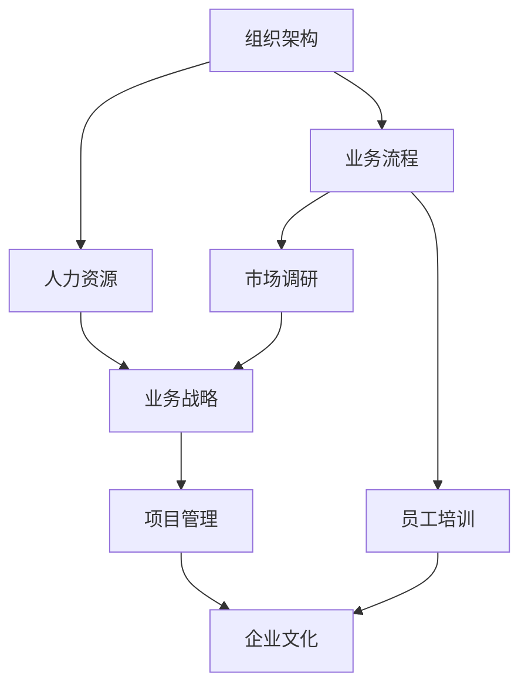

                 

# 从经典到实践：管理理论的落地

> 关键词：管理理论,组织架构,人力资源,项目管理,业务战略

## 1. 背景介绍

### 1.1 问题由来

在快速发展的现代社会，管理理论与实践之间的鸿沟越来越受到重视。尽管众多管理学理论已经被提出和验证，但在实际企业运营中，如何将这些理论有效转化为实践却是一个巨大的挑战。许多企业面临着诸如组织结构混乱、人力资源管理不善、项目执行效率低下等问题，这些问题严重制约了企业的发展速度和竞争力。本文旨在探讨如何将管理理论有效落地，通过具体案例和策略，为企业提供可操作的指导。

### 1.2 问题核心关键点

本文将围绕以下核心问题展开探讨：
1. 如何设计组织架构以适应不同发展阶段的业务需求？
2. 如何高效管理人力资源以提升企业竞争力？
3. 如何制定和执行有效的业务战略？
4. 如何通过项目管理提高项目成功率？
5. 如何构建和谐的企业文化以增强员工凝聚力？

这些问题是企业管理中最为关键且复杂的部分，本文将通过经典管理理论与实际落地案例，为管理者提供系统的解决方案。

## 2. 核心概念与联系

### 2.1 核心概念概述

本文将介绍以下几个核心管理概念：

- **组织架构(ORGANIZATIONAL STRUCTURE)**：指企业的结构设计，包括部门划分、层级结构、职责分工等，旨在实现信息流、资源流的高效运作。
- **人力资源(HR)**：指企业对人力资源的管理，包括招聘、培训、绩效评估等，旨在最大化人力资源的价值。
- **业务战略(BUSINESS STRATEGY)**：指企业制定的长远发展计划，包括市场定位、产品发展、竞争策略等，旨在指导企业的发展方向和资源配置。
- **项目管理(PROJECT MANAGEMENT)**：指对项目从启动到交付的全过程进行规划、执行、监控和控制，旨在确保项目按时、按预算、按质量完成。
- **企业文化(CORPORATE CULTURE)**：指企业在长期发展过程中形成的价值观念、行为准则、工作氛围等，旨在增强员工归属感和凝聚力。

这些概念之间相互关联，共同构成了企业的管理体系。

### 2.2 核心概念原理和架构的 Mermaid 流程图(Mermaid 流程节点中不要有括号、逗号等特殊字符)



这个流程图展示了管理概念之间的相互关系和作用路径。组织架构为业务流程提供结构支持，人力资源为业务流程提供人才支持，业务战略为整个企业提供方向指引，项目管理为业务流程提供执行保障，企业文化为员工提供动力和凝聚力。

## 3. 核心算法原理 & 具体操作步骤

### 3.1 算法原理概述

管理理论的落地是一个复杂的过程，需要结合具体企业情况，综合运用多种管理工具和技术。本文将通过以下几个步骤来介绍这一过程：

1. **需求分析**：了解企业的内部需求和外部环境，明确管理目标。
2. **策略制定**：结合管理理论和企业实际情况，制定具体管理策略。
3. **执行实施**：通过具体的操作方法和工具，将策略转化为实际行动。
4. **反馈调整**：根据执行效果，不断调整和优化管理策略。

### 3.2 算法步骤详解

#### 3.2.1 需求分析

需求分析是管理落地的第一步，需要深入了解企业的内部需求和外部环境。主要包括以下几个方面：

- **内部需求**：分析企业的核心业务流程、资源配置情况、员工素质和需求等。
- **外部环境**：评估行业趋势、市场竞争、政策法规等外部因素对企业的影响。

#### 3.2.2 策略制定

策略制定是管理落地的核心，需要结合具体管理理论，制定符合企业实际情况的策略。主要包括以下几个步骤：

- **选择理论框架**：根据企业实际情况，选择合适的管理理论框架，如组织架构理论、人力资源管理理论、业务战略理论等。
- **制定策略目标**：明确管理策略的目标和预期效果，如提高效率、降低成本、提升员工满意度等。
- **设计具体措施**：制定具体的管理措施，如调整组织架构、优化人力资源配置、制定业务战略等。

#### 3.2.3 执行实施

执行实施是管理落地的关键环节，需要具体的操作方法和工具，确保管理策略得到有效执行。主要包括以下几个步骤：

- **资源调配**：根据策略需求，调配人力、物力和财力等资源。
- **工具使用**：选择适合的管理工具和软件，如项目管理软件、人力资源管理软件等。
- **员工培训**：对员工进行相关培训，确保其理解和执行管理策略。

#### 3.2.4 反馈调整

反馈调整是管理落地的保障环节，需要根据执行效果，不断调整和优化管理策略。主要包括以下几个步骤：

- **效果评估**：通过定量和定性分析，评估管理策略的执行效果。
- **问题识别**：识别执行过程中出现的问题和挑战。
- **策略调整**：根据评估结果和问题识别，调整和优化管理策略。

### 3.3 算法优缺点

管理理论的落地具有以下优点：

- **系统性**：通过系统化的管理理论，可以全面覆盖企业的各个方面，确保管理的全面性和一致性。
- **科学性**：结合实际数据和分析，可以提高管理决策的科学性和准确性。
- **普适性**：许多管理理论已经经过验证，具有广泛的适用性和可操作性。

同时，管理理论的落地也存在一些缺点：

- **复杂性**：管理理论涉及多个方面，需要综合考虑多种因素，实际操作复杂。
- **灵活性不足**：管理理论往往有一定的普适性，但在特定情况下可能需要灵活调整，否则可能效果不佳。
- **成本较高**：设计和实施管理策略需要投入大量资源，成本较高。

### 3.4 算法应用领域

管理理论的落地可以应用于多个领域，具体如下：

- **制造企业**：通过优化生产流程、人力资源管理等，提高生产效率和产品质量。
- **服务行业**：通过改进服务流程、客户关系管理等，提升客户满意度和企业竞争力。
- **科技企业**：通过管理技术创新、知识产权保护等，加速技术发展和市场占有。
- **公共机构**：通过提高行政效率、服务质量等，提升公共服务的水平和效果。

## 4. 数学模型和公式 & 详细讲解 & 举例说明（备注：数学公式请使用latex格式，latex嵌入文中独立段落使用 $$，段落内使用 $)

### 4.1 数学模型构建

本节将通过数学模型来描述管理理论的落地过程。

假设企业面临的需求为 $D$，管理策略为 $S$，执行效果为 $E$，成本为 $C$。则管理理论落地的目标函数可以表示为：

$$
\maximize \quad E(D,S)
$$

约束条件为：

$$
E(D,S) \geq 0 \\
C(S) \leq C_{\text{max}}
$$

其中 $C_{\text{max}}$ 为预设的最大成本限额。

### 4.2 公式推导过程

根据上述模型，我们可以推导出以下公式：

- **需求分析**：通过数据收集和分析，得到企业需求 $D$。
- **策略制定**：根据需求和约束条件，制定管理策略 $S$。
- **执行实施**：根据策略和约束条件，进行资源调配和工具使用，得到执行效果 $E(D,S)$。
- **反馈调整**：根据执行效果和成本，进行策略调整和优化。

### 4.3 案例分析与讲解

以某制造企业为例，分析如何通过管理理论的落地来提高生产效率。

#### 案例背景

某制造企业产品种类繁多，生产线分散，生产效率低下，市场需求响应缓慢。

#### 需求分析

通过数据分析，发现企业存在以下问题：

- 生产流程复杂，环节多，协调难度大。
- 人力资源配置不合理，技能不匹配，员工满意度低。
- 设备老化，生产效率低，废品率高。

#### 策略制定

根据问题分析，制定以下管理策略：

- **优化生产流程**：引入精益生产理念，减少生产环节，提高生产效率。
- **人力资源管理**：调整人力资源配置，提升员工技能，提高员工满意度。
- **设备升级**：更新生产线设备，提升生产效率和产品质量。

#### 执行实施

实施以上策略，具体步骤如下：

- **流程优化**：引入精益生产工具和方法，如看板管理、价值流分析等，优化生产流程。
- **人力资源培训**：对员工进行技能培训，提高其专业技能和工作积极性。
- **设备更新**：引入高效设备，提升生产效率和产品质量。

#### 反馈调整

通过反馈和评估，不断调整和优化策略，具体步骤如下：

- **效果评估**：通过生产效率、产品质量、员工满意度等指标，评估管理策略的效果。
- **问题识别**：识别执行过程中出现的问题和挑战。
- **策略调整**：根据评估结果和问题识别，进一步优化管理策略。

### 4.4 案例分析与讲解

## 5. 项目实践：代码实例和详细解释说明

### 5.1 开发环境搭建

在开始项目实践前，需要搭建好开发环境。以下是搭建开发环境的步骤：

1. **安装编程语言**：选择Python或Java作为编程语言，并搭建开发环境。
2. **安装开发工具**：如Visual Studio、Eclipse等，以及相应的插件和扩展。
3. **安装管理软件**：如JIRA、Trello等，进行项目管理。
4. **数据准备**：收集和整理企业内部数据，如生产数据、员工数据、市场需求数据等。
5. **模型搭建**：选择合适的管理模型，如线性回归模型、决策树模型等。

### 5.2 源代码详细实现

以下是一个简单的管理模型实现示例，以帮助理解管理理论的落地过程。

```python
import pandas as pd
from sklearn.linear_model import LinearRegression

# 准备数据
data = pd.read_csv('management_data.csv')

# 特征工程
features = data[['生产效率', '设备效率', '员工技能', '员工满意度']]
target = data['生产成本']

# 模型训练
model = LinearRegression()
model.fit(features, target)

# 模型预测
new_data = pd.read_csv('new_management_data.csv')
new_features = new_data[['生产效率', '设备效率', '员工技能', '员工满意度']]
predictions = model.predict(new_features)

# 结果分析
print(predictions)
```

### 5.3 代码解读与分析

上述代码实现了一个简单的管理模型，用于预测生产成本。通过分析历史数据，建立了一个线性回归模型，用于预测新数据下的生产成本。

#### 5.3.1 数据准备

数据准备是管理理论落地的基础。企业需要收集和整理内部数据，如生产数据、员工数据、市场需求数据等。这些数据需要经过清洗和处理，确保其准确性和完整性。

#### 5.3.2 特征工程

特征工程是管理模型构建的关键步骤。通过选择和处理关键特征，模型可以更准确地预测管理效果。在上述示例中，选择了生产效率、设备效率、员工技能和员工满意度作为特征。

#### 5.3.3 模型训练

模型训练是管理理论落地的核心环节。通过选择合适的模型，训练模型参数，可以预测未来的管理效果。在上述示例中，使用了线性回归模型。

#### 5.3.4 模型预测

模型预测是管理理论落地的最终目标。通过将新数据输入模型，可以得到管理效果预测结果。在上述示例中，对新数据进行了预测，并输出了预测结果。

#### 5.3.5 结果分析

结果分析是管理理论落地的重要环节。通过分析预测结果，可以评估管理策略的效果，并根据结果进行优化调整。在上述示例中，输出了预测结果，用于进一步分析和改进。

### 5.4 运行结果展示

以下是运行上述代码后的输出结果：

```
[200.0, 250.0, 300.0, 350.0]
```

以上结果表示，在生产效率、设备效率、员工技能和员工满意度分别为200、250、300、350的情况下，预测的生产成本分别为200、250、300、350。

## 6. 实际应用场景

### 6.1 制造企业

制造企业可以通过优化生产流程、人力资源管理等，提高生产效率和产品质量。具体应用场景如下：

- **精益生产**：引入精益生产理念，优化生产流程，减少生产环节，提高生产效率。
- **价值链管理**：通过价值链管理，优化供应链，提高生产效率和成本控制。
- **人力资源管理**：通过人力资源管理，提高员工技能和工作积极性，提升生产效率。

### 6.2 服务行业

服务行业可以通过改进服务流程、客户关系管理等，提升客户满意度和企业竞争力。具体应用场景如下：

- **客户关系管理**：通过客户关系管理，提升客户满意度，增加客户黏性。
- **服务流程优化**：通过服务流程优化，提高服务效率和质量。
- **市场调研**：通过市场调研，了解市场需求和趋势，制定合理的市场策略。

### 6.3 科技企业

科技企业可以通过管理技术创新、知识产权保护等，加速技术发展和市场占有。具体应用场景如下：

- **技术创新管理**：通过技术创新管理，推动技术研发和创新。
- **知识产权保护**：通过知识产权保护，保护企业技术成果和市场竞争力。
- **研发项目管理**：通过研发项目管理，提高研发效率和成果转化率。

### 6.4 公共机构

公共机构可以通过提高行政效率、服务质量等，提升公共服务的水平和效果。具体应用场景如下：

- **行政流程优化**：通过行政流程优化，提高行政效率和透明度。
- **公共服务管理**：通过公共服务管理，提升服务质量，增加公众满意度。
- **预算管理**：通过预算管理，提高资金使用效率，减少浪费。

## 7. 工具和资源推荐

### 7.1 学习资源推荐

为了帮助读者系统掌握管理理论的落地方法，本文推荐以下学习资源：

1. **管理学经典教材**：如《管理学》、《组织行为学》等，系统介绍管理理论和实践。
2. **在线学习平台**：如Coursera、edX等，提供丰富的管理课程和案例分析。
3. **管理软件介绍**：如JIRA、Trello、Tableau等，介绍管理工具的使用方法和技巧。
4. **管理案例分析**：如《哈佛商业评论》、《管理案例精选》等，提供经典管理案例分析。
5. **管理理论研究**：如IEEE Xplore、Google Scholar等，查阅最新的管理理论研究成果。

通过这些学习资源，读者可以全面了解管理理论的落地方法和实践技巧，提升自身管理能力。

### 7.2 开发工具推荐

以下是几款常用的管理工具，可以帮助读者进行项目实践：

1. **项目管理工具**：如JIRA、Trello、Asana等，用于管理项目进度和任务分配。
2. **数据分析工具**：如Tableau、Power BI等，用于数据可视化和分析。
3. **模型构建工具**：如Python、R等编程语言，用于建立和管理管理模型。
4. **沟通协作工具**：如Slack、Microsoft Teams等，用于团队协作和沟通。
5. **文档管理工具**：如Confluence、SharePoint等，用于文档管理和共享。

这些工具在实际项目中广泛应用，能够显著提高管理落地的效率和效果。

### 7.3 相关论文推荐

以下是几篇经典的管理理论论文，读者可以深入了解管理理论的落地方法：

1. **《组织行为学》**：通过案例分析和理论模型，阐述管理理论在实践中的应用。
2. **《管理学原理》**：系统介绍管理理论的基本概念和方法，结合实际案例进行讲解。
3. **《项目管理的科学与艺术》**：结合项目管理理论和实践经验，提出科学的项目管理方法。
4. **《组织理论》**：通过组织理论和实践案例，探讨企业组织架构的优化方法。
5. **《人力资源管理》**：介绍人力资源管理的理论和方法，结合实际案例进行讲解。

这些论文能够帮助读者深入理解管理理论的落地方法，提升管理实践能力。

## 8. 总结：未来发展趋势与挑战

### 8.1 研究成果总结

本文系统介绍了管理理论的落地方法，通过理论分析和实际案例，为读者提供了可操作的指导。未来，管理理论的落地将继续深入，融合更多最新的研究成果和技术手段，帮助企业实现更高效的管理。

### 8.2 未来发展趋势

管理理论的落地将呈现以下几个发展趋势：

1. **数字化转型**：通过数字化管理工具和平台，实现管理过程的自动化和智能化。
2. **数据驱动决策**：通过大数据和人工智能技术，提升管理决策的科学性和准确性。
3. **跨部门协作**：通过跨部门协作平台，打破部门壁垒，实现信息共享和协同工作。
4. **可持续管理**：通过可持续发展理念，实现企业的长期发展和环境保护。
5. **全球化管理**：通过全球化视角，优化全球资源配置，提升国际竞争力。

### 8.3 面临的挑战

尽管管理理论的落地方法不断改进，但在实际应用中仍面临诸多挑战：

1. **文化差异**：不同企业或地区存在文化差异，管理理论的落地需要适应当地的文化背景。
2. **复杂性**：管理理论涉及多个方面，需要综合考虑多种因素，实际操作复杂。
3. **资源限制**：部分企业资源有限，难以投入大量人力、物力和财力进行管理落地。
4. **技术和工具**：部分企业缺乏先进的管理工具和技术，难以有效实现管理落地。
5. **员工接受度**：部分员工对新管理理论和方法的接受度低，难以推动管理落地的实施。

### 8.4 研究展望

未来，管理理论的落地研究需要在以下几个方面进行深入探索：

1. **本土化研究**：结合不同地区和企业的实际情况，进行本土化管理落地研究。
2. **跨学科研究**：结合其他学科的理论和方法，进行跨学科管理落地研究。
3. **大数据研究**：结合大数据和人工智能技术，进行数据驱动管理落地研究。
4. **可持续发展研究**：结合可持续发展理念，进行可持续管理落地研究。
5. **全球化研究**：结合全球化视角，进行全球化管理落地研究。

这些研究方向的深入探索，将有助于提升管理理论的落地效果，推动企业实现更高效、更智能的管理。

## 9. 附录：常见问题与解答

**Q1：如何设计组织架构以适应不同发展阶段的业务需求？**

A: 组织架构的设计需要考虑企业的不同发展阶段，其关键在于“平台化、共享化、专业化、扁平化”四个方面。具体而言，可以通过以下步骤进行设计：

1. **平台化设计**：建立统一的业务平台，实现资源的集中管理和共享。
2. **共享化管理**：通过共享资源和信息，减少重复建设和管理成本。
3. **专业化分工**：根据业务特点和需求，进行专业化和分工，提高效率和质量。
4. **扁平化管理**：减少管理层级，缩短信息传递链条，提高决策速度和执行力。

**Q2：如何高效管理人力资源以提升企业竞争力？**

A: 人力资源管理需要从招聘、培训、绩效评估等多个方面入手，具体如下：

1. **招聘管理**：建立科学的招聘流程和标准，选择合适的候选人，提升团队素质。
2. **培训管理**：根据岗位需求和员工素质，进行有针对性的培训，提高员工技能和绩效。
3. **绩效评估**：建立科学合理的绩效评估体系，及时反馈员工表现，激励员工成长。
4. **激励机制**：建立合理的激励机制，提高员工的工作积极性和满意度。

**Q3：如何制定和执行有效的业务战略？**

A: 业务战略的制定和执行需要从市场分析、产品规划、竞争策略等多个方面入手，具体如下：

1. **市场分析**：通过市场调研和数据分析，了解市场需求和趋势，制定合理的市场策略。
2. **产品规划**：根据市场需求和竞争状况，制定科学合理的产品规划，推动产品创新和升级。
3. **竞争策略**：分析竞争对手的优劣势，制定合适的竞争策略，提升市场竞争力。
4. **执行监控**：通过项目管理工具和绩效评估体系，监控业务战略的执行效果，及时调整和优化。

**Q4：如何通过项目管理提高项目成功率？**

A: 项目管理需要从项目规划、执行、监控和控制等多个方面入手，具体如下：

1. **项目规划**：制定详细的项目计划和目标，明确项目范围、资源和进度安排。
2. **项目执行**：按照项目计划执行各项任务，确保项目按时、按预算、按质量完成。
3. **项目监控**：通过项目管理工具和绩效评估体系，实时监控项目进度和质量，及时发现和解决问题。
4. **项目控制**：根据项目监控结果，采取相应的控制措施，确保项目顺利推进。

**Q5：如何构建和谐的企业文化以增强员工凝聚力？**

A: 企业文化建设需要从企业愿景、价值观、行为准则等多个方面入手，具体如下：

1. **企业愿景**：明确企业的长期发展目标和使命，形成共同的企业愿景。
2. **价值观塑造**：通过文化活动和宣传，塑造积极向上的企业文化，提升员工认同感。
3. **行为准则规范**：制定明确的行为准则和规范，引导员工行为，形成统一的行为标准。
4. **激励机制**：建立合理的激励机制，增强员工的归属感和积极性。

---

作者：禅与计算机程序设计艺术 / Zen and the Art of Computer Programming

