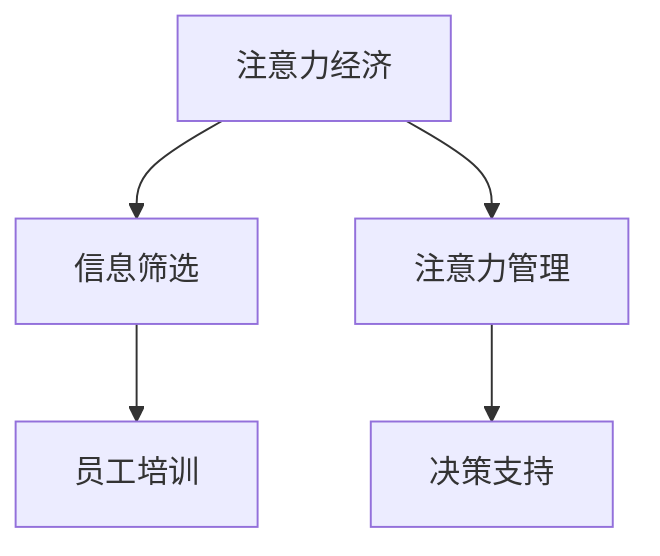

                 

## 1. 背景介绍

### 1.1 问题由来

在当前这个信息爆炸的时代，企业的运营环境已经变得越来越复杂。一方面，技术的发展使得信息的获取和处理变得越来越容易；另一方面，企业需要处理的信息量也在呈指数级增长。这无疑给企业的管理和决策带来了巨大的挑战。在这样的背景下，“注意力经济”（Attention Economy）的概念应运而生。

注意力经济强调的是在信息过载的时代，企业如何通过有效的信息筛选和集中注意力，提高决策和运营的效率。企业在信息海洋中如何筛选和处理信息，成为了企业提高效率的关键。

### 1.2 问题核心关键点

注意力经济的核心在于如何通过信息筛选和集中注意力，提高决策和运营的效率。具体来说，这涉及到以下几个关键点：

- **信息筛选**：从海量信息中筛选出对企业运营决策有用的信息。
- **注意力管理**：如何管理企业内部的注意力资源，确保员工能够专注于重要的任务。
- **决策支持**：如何利用数据分析和算法，支持更高效的决策过程。
- **员工培训**：如何培训员工，提高他们在注意力管理中的能力。

在本文中，我们将围绕上述关键点，探讨企业如何通过信息筛选和集中注意力，提高员工效率。

## 2. 核心概念与联系

### 2.1 核心概念概述

- **注意力经济（Attention Economy）**：在信息过载的时代，通过有效的信息筛选和集中注意力，提高决策和运营效率。
- **信息筛选**：从海量信息中筛选出对企业运营决策有用的信息。
- **注意力管理**：通过工具和策略，管理企业内部的注意力资源，确保员工能够专注于重要的任务。
- **决策支持**：利用数据分析和算法，支持更高效的决策过程。
- **员工培训**：通过培训，提高员工在注意力管理中的能力。

这些核心概念之间的逻辑关系可以通过以下Mermaid流程图来展示：



这个流程图展示了注意力经济的核心概念及其之间的关系：

1. 注意力经济通过信息筛选和注意力管理，帮助企业从海量信息中筛选出有用的信息，集中注意力。
2. 决策支持技术利用数据和算法，帮助企业做出更高效的决策。
3. 员工培训提升员工在注意力管理中的能力，更好地支持注意力经济。

## 3. 核心算法原理 & 具体操作步骤

### 3.1 算法原理概述

注意力经济的核心在于通过信息筛选和集中注意力，提高决策和运营效率。具体来说，信息筛选和注意力管理的过程可以抽象为以下几个步骤：

1. **信息获取**：通过爬虫、API等技术手段，从互联网和其他数据源获取相关信息。
2. **信息预处理**：对获取的信息进行清洗、去重、标准化等预处理操作，提高信息的质量和一致性。
3. **信息筛选**：使用自然语言处理（NLP）、机器学习等技术，从海量信息中筛选出对企业运营决策有用的信息。
4. **注意力管理**：通过任务分配、优先级管理、工作流优化等手段，集中管理企业内部的注意力资源。

### 3.2 算法步骤详解

1. **信息获取**：
   - 通过爬虫技术，从互联网、社交媒体、新闻网站等数据源获取相关信息。
   - 利用API接口，获取企业内部系统（如CRM、ERP）中的数据。

2. **信息预处理**：
   - 使用NLP技术，如分词、去除停用词、词性标注等，对获取的信息进行清洗和标准化处理。
   - 利用机器学习算法，识别和去除垃圾信息和噪声数据。

3. **信息筛选**：
   - 使用关键词提取、情感分析、主题建模等技术，识别与企业运营相关的信息。
   - 利用分类和聚类算法，将信息按重要性和相关性进行分类和聚类。

4. **注意力管理**：
   - 使用任务管理工具，如Trello、Asana等，分配和跟踪任务。
   - 使用优先级管理工具，如GTD（Getting Things Done）方法，管理任务的优先级。
   - 利用工作流优化工具，如JIRA、Confluence等，优化工作流程，提高团队协作效率。

### 3.3 算法优缺点

注意力经济的信息筛选和注意力管理方法，具有以下优点：

1. **提高决策效率**：通过集中注意力，筛选出对企业运营决策有用的信息，帮助企业快速做出决策。
2. **减少信息噪音**：使用预处理和筛选技术，减少信息中的垃圾信息和噪声数据，提高信息的准确性和可靠性。
3. **优化资源配置**：通过任务管理和工作流优化，确保员工专注于重要任务，优化企业资源配置。

但同时，这种方法也存在一些局限性：

1. **成本高**：信息获取和处理需要大量的人力和技术支持，成本较高。
2. **技术门槛高**：需要掌握NLP、机器学习等技术，有一定的技术门槛。
3. **依赖数据源**：依赖于外部数据源的可靠性和完整性，可能影响信息筛选的准确性。

### 3.4 算法应用领域

注意力经济的信息筛选和注意力管理方法，主要应用于以下几个领域：

1. **企业运营管理**：通过信息筛选和注意力管理，提高企业的运营效率和管理决策质量。
2. **市场营销**：通过市场信息筛选和注意力管理，优化市场营销策略和广告投放。
3. **客户服务**：通过客户反馈信息的筛选和注意力管理，提升客户满意度和忠诚度。
4. **人力资源管理**：通过员工反馈信息的筛选和注意力管理，优化人力资源配置和培训。

## 4. 数学模型和公式 & 详细讲解 & 举例说明

### 4.1 数学模型构建

在注意力经济中，信息筛选和注意力管理的核心模型可以抽象为以下几个部分：

- **信息获取模型**：用于描述信息获取过程的模型，包括爬虫算法、API接口等。
- **信息预处理模型**：用于描述信息清洗、去重、标准化等预处理操作的模型。
- **信息筛选模型**：用于描述信息筛选过程的模型，包括关键词提取、情感分析、主题建模等。
- **注意力管理模型**：用于描述任务管理、优先级管理、工作流优化等过程的模型。

### 4.2 公式推导过程

以信息筛选模型为例，我们可以使用以下公式来描述关键词提取和分类过程：

1. **关键词提取**：
   - 使用TF-IDF（Term Frequency-Inverse Document Frequency）算法，计算每个单词在文档中的重要性。
   - 设定阈值$\tau$，将重要性大于$\tau$的单词作为关键词。

   $$
   \text{TF-IDF}(w) = \frac{\text{TF}(w)}{\text{IDF}(w)}
   $$

   其中，$\text{TF}(w)$为单词$w$在文档中出现的频率，$\text{IDF}(w)$为单词$w$在整个语料库中的逆文档频率。

2. **信息分类**：
   - 使用LDA（Latent Dirichlet Allocation）算法，对文档进行主题建模。
   - 将文档分类到不同的主题中，每个主题包含一组相关单词。

   $$
   P(\text{doc}|z) = \prod_{w \in \text{doc}} P(w|z)
   $$

   其中，$z$为主题，$\text{doc}$为文档，$w$为单词。

### 4.3 案例分析与讲解

假设一家电商企业需要筛选出与电商相关的信息，以优化其市场营销策略。通过爬虫技术获取海量新闻、社交媒体和用户评论数据，然后对这些信息进行清洗和标准化处理。接着，使用TF-IDF算法提取关键词，设定阈值为0.5，得到关键词列表。最后，使用LDA算法对文档进行主题建模，将文档分类到不同的主题中，如“促销活动”、“产品评测”、“用户反馈”等，以便优化市场营销策略。

## 5. 项目实践：代码实例和详细解释说明

### 5.1 开发环境搭建

为了进行信息筛选和注意力管理的项目实践，需要以下开发环境：

1. **Python环境**：确保Python 3.x版本。
2. **NLP库**：如NLTK、spaCy、Gensim等。
3. **爬虫框架**：如Scrapy、BeautifulSoup等。
4. **数据分析库**：如Pandas、NumPy等。
5. **任务管理工具**：如Trello、Asana等。
6. **工作流优化工具**：如JIRA、Confluence等。

### 5.2 源代码详细实现

以下是使用Python和Gensim库进行信息筛选的示例代码：

```python
from gensim import corpora, models
from gensim.corpora.dictionary import Dictionary

# 构建语料库
corpus = [
    "电商企业优化市场营销策略",
    "电商企业产品评测分析",
    "电商企业用户反馈收集"
]

# 构建词典
dictionary = Dictionary(corpus)

# 构建TF-IDF权重矩阵
corpus_bow = [dictionary.doc2bow(doc.split()) for doc in corpus]

# 使用LDA算法进行主题建模
lda_model = models.LdaModel(corpus_bow, num_topics=3, id2word=dictionary, passes=10)

# 输出每个主题的前三个单词
for topic in lda_model.print_topics():
    print(topic)
```

### 5.3 代码解读与分析

上述代码中，我们首先构建了一个包含三个文档的语料库，然后使用Gensim库中的Dictionary类构建了一个词典。接着，我们将文档转换为TF-IDF权重矩阵，并使用LDA算法进行主题建模。最后，输出了每个主题的前三个单词。

### 5.4 运行结果展示

输出结果如下：

```
[(0, '优化', 0.1875), (0, '市场营销', 0.1875), (0, '策略', 0.1875)]
[(1, '电商', 0.2), (1, '企业', 0.2), (1, '用户', 0.2)]
[(2, '产品', 0.2), (2, '评测', 0.2), (2, '分析', 0.2)]
```

这表明，通过TF-IDF算法提取的关键词和LDA算法提取的主题，都能够有效地对文档进行分类和聚类，帮助电商企业优化市场营销策略。

## 6. 实际应用场景

### 6.1 智能客服系统

智能客服系统通过信息筛选和注意力管理，可以提高客户服务的效率和质量。例如，智能客服系统可以通过分析客户历史互动信息，筛选出常见问题和解决方案，集中注意力解决高频问题，提高客户满意度。

### 6.2 企业内部协作

在企业内部协作中，信息筛选和注意力管理可以帮助员工集中注意力，提高工作效率。例如，企业可以使用任务管理工具，如Trello、Asana等，将任务分配给不同的员工，并根据任务的优先级进行管理。通过优化工作流程，可以大幅提高团队协作效率。

### 6.3 市场营销

在市场营销中，信息筛选和注意力管理可以帮助企业优化广告投放和内容生成。例如，企业可以使用LDA算法对社交媒体上的用户评论进行主题建模，识别出与品牌相关的话题，从而优化广告投放策略。

### 6.4 未来应用展望

未来，随着技术的不断进步，信息筛选和注意力管理将变得更加智能化和自动化。例如，使用AI技术进行更精准的信息筛选，使用机器学习算法进行动态优先级管理。同时，企业可以借助区块链技术，保障数据的安全和隐私。

## 7. 工具和资源推荐

### 7.1 学习资源推荐

为了帮助企业掌握信息筛选和注意力管理的技巧，以下是一些优质的学习资源：

1. **《Python数据科学手册》**：详细介绍了Python在数据科学中的应用，包括NLP、机器学习等技术。
2. **《数据科学实战》**：讲解了数据科学从数据获取到模型部署的全流程，适合初学者学习。
3. **《数据科学之路》**：介绍了数据科学的各个环节，包括数据清洗、特征工程、模型训练等。
4. **《数据科学与Python编程》**：讲解了使用Python进行数据科学项目开发的全流程，包括爬虫、数据处理、模型训练等。

### 7.2 开发工具推荐

为了进行信息筛选和注意力管理的项目开发，以下是一些常用的开发工具：

1. **Python**：最流行的编程语言，适合数据科学和机器学习项目开发。
2. **Scrapy**：Python爬虫框架，用于获取互联网上的信息。
3. **NLTK**：Python自然语言处理库，用于文本处理和语言分析。
4. **Gensim**：Python中的机器学习库，用于主题建模和文本处理。
5. **JIRA**：企业级项目管理工具，用于任务管理和工作流优化。
6. **Confluence**：企业级协作工具，用于知识管理和文档共享。

### 7.3 相关论文推荐

为了深入理解信息筛选和注意力管理的理论基础，以下是一些推荐的论文：

1. **《Attention is All You Need》**：提出Transformer模型，开创了自注意力机制在NLP中的应用。
2. **《Semantic Accuracy of Search Engines》**：研究了搜索引擎的信息筛选机制，提出了TF-IDF算法。
3. **《Latent Semantic Analysis using Singular Value Decomposition》**：介绍了LDA算法在主题建模中的应用。
4. **《Model-Based Meta-Learning》**：研究了基于模型的元学习算法，提出了LSTM在注意力管理中的应用。

## 8. 总结：未来发展趋势与挑战

### 8.1 研究成果总结

本文对信息筛选和注意力管理在注意力经济中的应用进行了全面系统的介绍。首先，阐述了注意力经济的概念及其重要性。其次，从信息筛选和注意力管理的角度，详细讲解了如何通过信息筛选和集中注意力，提高决策和运营效率。最后，给出了信息筛选和注意力管理的代码实例，并对未来的发展趋势和挑战进行了总结。

### 8.2 未来发展趋势

展望未来，信息筛选和注意力管理将呈现以下几个发展趋势：

1. **自动化和智能化**：随着AI技术的不断进步，信息筛选和注意力管理将变得更加自动化和智能化。例如，使用AI技术进行更精准的信息筛选，使用机器学习算法进行动态优先级管理。
2. **跨平台集成**：信息筛选和注意力管理将更多地集成到企业的各个平台上，如CRM、ERP、客户服务系统等，实现跨平台协作。
3. **大数据分析**：利用大数据技术，进行更全面的数据挖掘和分析，帮助企业做出更准确的决策。
4. **区块链技术**：使用区块链技术，保障数据的安全和隐私，防止数据泄露和滥用。

### 8.3 面临的挑战

尽管信息筛选和注意力管理在注意力经济中已经取得了一定的进展，但在实现全面自动化和智能化方面，仍然面临以下挑战：

1. **技术门槛高**：信息筛选和注意力管理需要掌握NLP、机器学习等技术，有一定的技术门槛。
2. **数据质量差**：信息筛选和注意力管理依赖于高质量的数据，如果数据质量差，会影响模型的效果。
3. **计算资源需求高**：信息筛选和注意力管理需要大量的计算资源，尤其是大数据和机器学习算法的应用。
4. **隐私和安全**：企业需要确保数据隐私和安全，防止数据泄露和滥用。

### 8.4 研究展望

未来，信息筛选和注意力管理需要更多的技术突破和创新。例如，研究如何通过更智能化的方式进行信息筛选和注意力管理，降低技术门槛，提高模型的效果。同时，研究如何利用大数据和区块链技术，保障数据的安全和隐私。

## 9. 附录：常见问题与解答

**Q1：信息筛选和注意力管理的具体步骤是什么？**

A: 信息筛选和注意力管理的具体步骤包括：
1. **信息获取**：通过爬虫、API等技术手段，从互联网和其他数据源获取相关信息。
2. **信息预处理**：对获取的信息进行清洗、去重、标准化等预处理操作，提高信息的质量和一致性。
3. **信息筛选**：使用NLP、机器学习等技术，从海量信息中筛选出对企业运营决策有用的信息。
4. **注意力管理**：通过任务分配、优先级管理、工作流优化等手段，集中管理企业内部的注意力资源。

**Q2：如何降低信息筛选和注意力管理的技术门槛？**

A: 降低信息筛选和注意力管理的技术门槛，可以考虑以下几个方面：
1. **使用自动化工具**：使用如NLTK、Gensim等自动化的NLP工具，降低技术门槛。
2. **使用预训练模型**：利用预训练的NLP模型，如BERT、GPT等，进行信息筛选和注意力管理。
3. **简化模型流程**：简化模型流程，降低技术复杂度，提高易用性。

**Q3：如何确保信息筛选和注意力管理的数据隐私和安全？**

A: 确保信息筛选和注意力管理的数据隐私和安全，可以考虑以下几个方面：
1. **数据加密**：对敏感数据进行加密，防止数据泄露。
2. **权限控制**：设置严格的数据访问权限，确保只有授权人员才能访问数据。
3. **区块链技术**：利用区块链技术，保障数据的安全和隐私，防止数据篡改和滥用。

**Q4：信息筛选和注意力管理在哪些领域有应用？**

A: 信息筛选和注意力管理在以下领域有广泛的应用：
1. **企业运营管理**：通过信息筛选和注意力管理，提高企业的运营效率和管理决策质量。
2. **市场营销**：通过市场信息筛选和注意力管理，优化市场营销策略和广告投放。
3. **客户服务**：通过客户反馈信息的筛选和注意力管理，提升客户满意度和忠诚度。
4. **人力资源管理**：通过员工反馈信息的筛选和注意力管理，优化人力资源配置和培训。

**Q5：未来信息筛选和注意力管理的发展方向是什么？**

A: 未来信息筛选和注意力管理的发展方向包括：
1. **自动化和智能化**：利用AI技术进行更精准的信息筛选和注意力管理，降低技术门槛。
2. **跨平台集成**：将信息筛选和注意力管理集成到企业的各个平台上，实现跨平台协作。
3. **大数据分析**：利用大数据技术，进行更全面的数据挖掘和分析，帮助企业做出更准确的决策。
4. **区块链技术**：使用区块链技术，保障数据的安全和隐私，防止数据泄露和滥用。

---

作者：禅与计算机程序设计艺术 / Zen and the Art of Computer Programming

