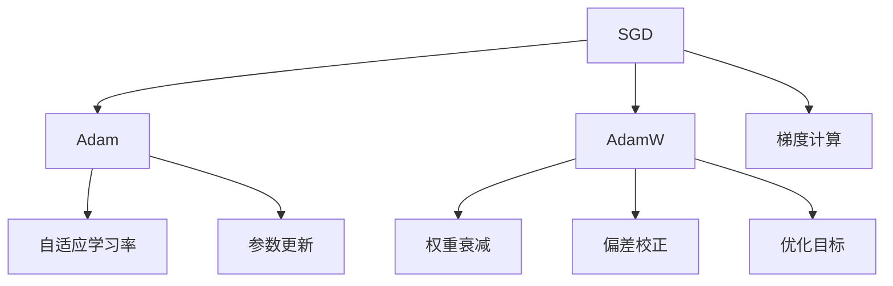

                 

# 优化算法大比拼：SGD、Adam还是AdamW？

优化算法是深度学习中不可或缺的一部分，其作用在于调整模型参数，使其最小化损失函数。本文将对三种常用的优化算法：SGD、Adam和AdamW进行深入比较，分析它们的原理、优缺点及应用场景，并结合实际代码实例，探讨如何选择合适的算法进行深度学习训练。

## 1. 背景介绍

### 1.1 问题由来

深度学习中的模型参数更新通常依赖于优化算法，常见的有随机梯度下降(SGD)、Adam、AdamW等。这些算法的目标都是最小化损失函数，使模型在训练过程中收敛到最优解。不同算法在性能、收敛速度、稳定性等方面表现各异，因此选择合适的优化算法对深度学习模型的训练至关重要。

### 1.2 问题核心关键点

本文将探讨三种主流优化算法：SGD、Adam和AdamW，重点关注它们的优化原理、步骤和应用场景。通过对三种算法进行详细比较，帮助读者更好地理解各自的优劣，并根据实际情况选择合适的算法。

## 2. 核心概念与联系

### 2.1 核心概念概述

为更好地理解优化算法的工作原理和联系，本节将介绍几个密切相关的核心概念：

- **随机梯度下降(SGD)**：一种基本的优化算法，通过计算损失函数对模型参数的梯度，并在每次迭代中更新参数，使损失函数下降。
- **Adam**：一种自适应学习率算法，结合了梯度的一阶矩估计和二阶矩估计，能够自适应地调整每个参数的学习率，加快收敛速度。
- **AdamW**：Adam的变体，通过引入权重衰减(warmup)和偏差校正(epsilon)，进一步提高了Adam算法的稳定性和收敛性。

这些核心概念之间的逻辑关系可以通过以下Mermaid流程图来展示：



这个流程图展示了几者之间的关系：

1. SGD是Adam和AdamW的基础。
2. Adam通过引入一阶和二阶矩估计，自适应地调整每个参数的学习率。
3. AdamW在Adam的基础上增加了权重衰减和偏差校正，进一步提高了算法的稳定性和收敛性。

这些概念共同构成了深度学习模型训练的基本框架，使得模型能够通过优化算法收敛到最优解。

## 3. 核心算法原理 & 具体操作步骤

### 3.1 算法原理概述

SGD、Adam和AdamW都是基于梯度下降的优化算法，其核心目标是通过迭代调整模型参数，使损失函数最小化。下面详细介绍这三种算法的优化原理和具体操作步骤。

#### 3.1.1 SGD

SGD的基本思想是在每次迭代中，随机选择一个样本计算梯度，并更新模型参数。其更新公式为：

$$
\theta_{t+1} = \theta_{t} - \alpha \nabla_{\theta}L(\theta_t)
$$

其中，$\theta_t$ 为第 $t$ 次迭代后的模型参数，$\alpha$ 为学习率，$\nabla_{\theta}L(\theta_t)$ 为损失函数对模型参数的梯度。

#### 3.1.2 Adam

Adam算法通过计算梯度的移动平均数来调整每个参数的学习率。其更新公式为：

$$
m_t = \beta_1 m_{t-1} + (1-\beta_1) \nabla_{\theta}L(\theta_t)
$$
$$
v_t = \beta_2 v_{t-1} + (1-\beta_2)(\nabla_{\theta}L(\theta_t))^2
$$
$$
\hat{m}_t = \frac{m_t}{1-\beta_1^t}
$$
$$
\hat{v}_t = \frac{v_t}{1-\beta_2^t}
$$
$$
\theta_{t+1} = \theta_{t} - \frac{\alpha}{\sqrt{\hat{v}_t}+\epsilon} \hat{m}_t
$$

其中，$m_t$ 和 $v_t$ 分别为梯度的一阶矩估计和二阶矩估计，$\beta_1$ 和 $\beta_2$ 分别为移动平均数的衰减系数，$\hat{m}_t$ 和 $\hat{v}_t$ 是对 $m_t$ 和 $v_t$ 的偏差校正，$\epsilon$ 为数值稳定项，通常取 $10^{-8}$。

#### 3.1.3 AdamW

AdamW算法在Adam的基础上增加了权重衰减(warmup)和偏差校正(epsilon)，使得算法更加稳定。其更新公式为：

$$
m_t = \beta_1 m_{t-1} + (1-\beta_1) \nabla_{\theta}L(\theta_t)
$$
$$
v_t = \beta_2 v_{t-1} + (1-\beta_2)(\nabla_{\theta}L(\theta_t))^2
$$
$$
\hat{m}_t = \frac{m_t}{1-\beta_1^t}
$$
$$
\hat{v}_t = \frac{v_t}{1-\beta_2^t}
$$
$$
\theta_{t+1} = \theta_{t} - \frac{\alpha}{\sqrt{\hat{v}_t}+\epsilon} \hat{m}_t
$$
$$
\theta_{t+1} = \theta_{t} - \frac{\alpha}{\sqrt{\hat{v}_t}+\epsilon} \hat{m}_t - \frac{\alpha}{\beta_2} \sum_{i=1}^{t-1} \frac{m_i^2}{\hat{v}_i} \theta_{i}
$$

其中，$\theta_{t+1}$ 为更新后的参数，$\sum_{i=1}^{t-1} \frac{m_i^2}{\hat{v}_i} \theta_{i}$ 为权重衰减项，用于防止模型参数过大，$\alpha$ 为学习率。

### 3.2 算法步骤详解

#### 3.2.1 SGD

1. **初始化**：设定模型参数 $\theta$、学习率 $\alpha$ 和随机数种子。
2. **梯度计算**：计算损失函数对每个参数的梯度。
3. **参数更新**：根据梯度更新模型参数。
4. **迭代**：重复步骤2-3，直到损失函数收敛或达到预设迭代次数。

#### 3.2.2 Adam

1. **初始化**：设定模型参数 $\theta$、学习率 $\alpha$、移动平均数衰减系数 $\beta_1$ 和 $\beta_2$，以及数值稳定项 $\epsilon$。
2. **梯度计算**：计算损失函数对每个参数的梯度。
3. **更新一阶和二阶矩估计**：更新梯度的一阶矩估计和二阶矩估计。
4. **偏差校正**：对一阶和二阶矩估计进行偏差校正。
5. **参数更新**：根据偏差校正后的一阶矩估计更新模型参数。
6. **迭代**：重复步骤2-5，直到损失函数收敛或达到预设迭代次数。

#### 3.2.3 AdamW

1. **初始化**：设定模型参数 $\theta$、学习率 $\alpha$、移动平均数衰减系数 $\beta_1$ 和 $\beta_2$，以及数值稳定项 $\epsilon$。
2. **梯度计算**：计算损失函数对每个参数的梯度。
3. **更新一阶和二阶矩估计**：更新梯度的一阶矩估计和二阶矩估计。
4. **偏差校正**：对一阶和二阶矩估计进行偏差校正。
5. **权重衰减**：计算权重衰减项。
6. **参数更新**：根据偏差校正后的一阶矩估计和权重衰减项更新模型参数。
7. **迭代**：重复步骤2-6，直到损失函数收敛或达到预设迭代次数。

### 3.3 算法优缺点

#### 3.3.1 SGD

**优点**：
- 计算简单，易于实现。
- 对高维参数空间收敛速度快。
- 不需要存储梯度信息，内存占用较小。

**缺点**：
- 对噪声敏感，收敛过程中可能存在震荡。
- 收敛速度较慢，可能陷入局部最优解。

#### 3.3.2 Adam

**优点**：
- 自适应学习率，收敛速度较快。
- 对噪声不敏感，稳定性较好。
- 内存占用适中，适用于大规模数据集。

**缺点**：
- 学习率自适应调整，可能导致某些参数更新过快。
- 对异常值敏感，梯度计算过程中可能产生较大的偏差。

#### 3.3.3 AdamW

**优点**：
- 结合了Adam的优点，收敛速度较快。
- 增加了权重衰减项，防止参数过大的问题。
- 增加了偏差校正项，提高了稳定性。

**缺点**：
- 计算量较大，特别是在高维参数空间时。
- 参数更新复杂，可能需要更长的迭代时间。

### 3.4 算法应用领域

#### 3.4.1 SGD

SGD算法适用于数据量较小、计算资源有限的任务，如小规模图像分类、文本分类等。由于其计算简单，内存占用较小，对于资源受限的设备，如嵌入式系统，SGD是一个较好的选择。

#### 3.4.2 Adam

Adam算法适用于大规模数据集，如图像识别、自然语言处理等。由于其自适应学习率和稳定性，Adam在处理大规模数据时表现较好，能够快速收敛到最优解。

#### 3.4.3 AdamW

AdamW算法适用于对模型参数稳定性要求较高的任务，如计算机视觉、语音识别等。由于其增加了权重衰减和偏差校正项，AdamW在避免参数过大和提高稳定性方面表现优异，适合处理复杂的数据集和模型。

## 4. 数学模型和公式 & 详细讲解 & 举例说明

### 4.1 数学模型构建

#### 4.1.1 SGD

SGD的数学模型构建相对简单，主要基于梯度下降的原理。假设模型参数为 $\theta$，损失函数为 $L(\theta)$，学习率为 $\alpha$，则SGD的更新公式为：

$$
\theta_{t+1} = \theta_{t} - \alpha \nabla_{\theta}L(\theta_t)
$$

#### 4.1.2 Adam

Adam算法的数学模型构建相对复杂，涉及梯度的一阶矩估计和二阶矩估计。假设模型参数为 $\theta$，损失函数为 $L(\theta)$，学习率为 $\alpha$，移动平均数衰减系数为 $\beta_1$ 和 $\beta_2$，数值稳定项为 $\epsilon$，则Adam的更新公式为：

$$
m_t = \beta_1 m_{t-1} + (1-\beta_1) \nabla_{\theta}L(\theta_t)
$$
$$
v_t = \beta_2 v_{t-1} + (1-\beta_2)(\nabla_{\theta}L(\theta_t))^2
$$
$$
\hat{m}_t = \frac{m_t}{1-\beta_1^t}
$$
$$
\hat{v}_t = \frac{v_t}{1-\beta_2^t}
$$
$$
\theta_{t+1} = \theta_{t} - \frac{\alpha}{\sqrt{\hat{v}_t}+\epsilon} \hat{m}_t
$$

#### 4.1.3 AdamW

AdamW算法在Adam的基础上增加了权重衰减项，其数学模型构建相对复杂。假设模型参数为 $\theta$，损失函数为 $L(\theta)$，学习率为 $\alpha$，移动平均数衰减系数为 $\beta_1$ 和 $\beta_2$，数值稳定项为 $\epsilon$，则AdamW的更新公式为：

$$
m_t = \beta_1 m_{t-1} + (1-\beta_1) \nabla_{\theta}L(\theta_t)
$$
$$
v_t = \beta_2 v_{t-1} + (1-\beta_2)(\nabla_{\theta}L(\theta_t))^2
$$
$$
\hat{m}_t = \frac{m_t}{1-\beta_1^t}
$$
$$
\hat{v}_t = \frac{v_t}{1-\beta_2^t}
$$
$$
\theta_{t+1} = \theta_{t} - \frac{\alpha}{\sqrt{\hat{v}_t}+\epsilon} \hat{m}_t
$$
$$
\theta_{t+1} = \theta_{t} - \frac{\alpha}{\sqrt{\hat{v}_t}+\epsilon} \hat{m}_t - \frac{\alpha}{\beta_2} \sum_{i=1}^{t-1} \frac{m_i^2}{\hat{v}_i} \theta_{i}
$$

### 4.2 公式推导过程

#### 4.2.1 SGD

SGD的更新公式基于梯度下降，其推导过程相对简单。假设损失函数为 $L(\theta)$，则梯度为：

$$
\nabla_{\theta}L(\theta) = \frac{\partial L(\theta)}{\partial \theta}
$$

根据梯度下降的原理，更新公式为：

$$
\theta_{t+1} = \theta_{t} - \alpha \nabla_{\theta}L(\theta_t)
$$

#### 4.2.2 Adam

Adam算法的更新公式较为复杂，其推导过程涉及梯度的一阶矩估计和二阶矩估计。假设损失函数为 $L(\theta)$，则梯度为：

$$
\nabla_{\theta}L(\theta) = \frac{\partial L(\theta)}{\partial \theta}
$$

Adam算法的一阶矩估计和二阶矩估计分别为：

$$
m_t = \beta_1 m_{t-1} + (1-\beta_1) \nabla_{\theta}L(\theta_t)
$$
$$
v_t = \beta_2 v_{t-1} + (1-\beta_2)(\nabla_{\theta}L(\theta_t))^2
$$

偏差校正项为：

$$
\hat{m}_t = \frac{m_t}{1-\beta_1^t}
$$
$$
\hat{v}_t = \frac{v_t}{1-\beta_2^t}
$$

参数更新公式为：

$$
\theta_{t+1} = \theta_{t} - \frac{\alpha}{\sqrt{\hat{v}_t}+\epsilon} \hat{m}_t
$$

#### 4.2.3 AdamW

AdamW算法的更新公式在Adam的基础上增加了权重衰减项，其推导过程涉及梯度的一阶矩估计、二阶矩估计和权重衰减项。假设损失函数为 $L(\theta)$，则梯度为：

$$
\nabla_{\theta}L(\theta) = \frac{\partial L(\theta)}{\partial \theta}
$$

AdamW算法的一阶矩估计和二阶矩估计分别为：

$$
m_t = \beta_1 m_{t-1} + (1-\beta_1) \nabla_{\theta}L(\theta_t)
$$
$$
v_t = \beta_2 v_{t-1} + (1-\beta_2)(\nabla_{\theta}L(\theta_t))^2
$$

偏差校正项为：

$$
\hat{m}_t = \frac{m_t}{1-\beta_1^t}
$$
$$
\hat{v}_t = \frac{v_t}{1-\beta_2^t}
$$

权重衰减项为：

$$
\sum_{i=1}^{t-1} \frac{m_i^2}{\hat{v}_i} \theta_{i}
$$

参数更新公式为：

$$
\theta_{t+1} = \theta_{t} - \frac{\alpha}{\sqrt{\hat{v}_t}+\epsilon} \hat{m}_t
$$
$$
\theta_{t+1} = \theta_{t} - \frac{\alpha}{\sqrt{\hat{v}_t}+\epsilon} \hat{m}_t - \frac{\alpha}{\beta_2} \sum_{i=1}^{t-1} \frac{m_i^2}{\hat{v}_i} \theta_{i}
$$

### 4.3 案例分析与讲解

#### 4.3.1 SGD

假设有一个二分类问题，使用SGD算法进行训练。模型的损失函数为：

$$
L(\theta) = \frac{1}{2N} \sum_{i=1}^N (y_i - \sigma(\theta^T x_i))^2
$$

其中，$x_i$ 为训练样本，$y_i$ 为标签，$\sigma$ 为sigmoid函数。使用SGD算法进行更新时，首先计算梯度：

$$
\nabla_{\theta}L(\theta) = \frac{\partial L(\theta)}{\partial \theta} = \frac{1}{N} \sum_{i=1}^N [(y_i - \sigma(\theta^T x_i)) x_i]
$$

然后根据SGD的更新公式，进行参数更新：

$$
\theta_{t+1} = \theta_{t} - \alpha \nabla_{\theta}L(\theta_t)
$$

#### 4.3.2 Adam

假设使用Adam算法进行训练，模型的损失函数为：

$$
L(\theta) = \frac{1}{2N} \sum_{i=1}^N (y_i - \sigma(\theta^T x_i))^2
$$

使用Adam算法进行更新时，首先计算梯度：

$$
\nabla_{\theta}L(\theta) = \frac{\partial L(\theta)}{\partial \theta} = \frac{1}{N} \sum_{i=1}^N [(y_i - \sigma(\theta^T x_i)) x_i]
$$

然后计算一阶矩估计和二阶矩估计：

$$
m_t = \beta_1 m_{t-1} + (1-\beta_1) \nabla_{\theta}L(\theta_t)
$$
$$
v_t = \beta_2 v_{t-1} + (1-\beta_2)(\nabla_{\theta}L(\theta_t))^2
$$

进行偏差校正：

$$
\hat{m}_t = \frac{m_t}{1-\beta_1^t}
$$
$$
\hat{v}_t = \frac{v_t}{1-\beta_2^t}
$$

最后根据Adam的更新公式，进行参数更新：

$$
\theta_{t+1} = \theta_{t} - \frac{\alpha}{\sqrt{\hat{v}_t}+\epsilon} \hat{m}_t
$$

#### 4.3.3 AdamW

假设使用AdamW算法进行训练，模型的损失函数为：

$$
L(\theta) = \frac{1}{2N} \sum_{i=1}^N (y_i - \sigma(\theta^T x_i))^2
$$

使用AdamW算法进行更新时，首先计算梯度：

$$
\nabla_{\theta}L(\theta) = \frac{\partial L(\theta)}{\partial \theta} = \frac{1}{N} \sum_{i=1}^N [(y_i - \sigma(\theta^T x_i)) x_i]
$$

然后计算一阶矩估计和二阶矩估计：

$$
m_t = \beta_1 m_{t-1} + (1-\beta_1) \nabla_{\theta}L(\theta_t)
$$
$$
v_t = \beta_2 v_{t-1} + (1-\beta_2)(\nabla_{\theta}L(\theta_t))^2
$$

进行偏差校正：

$$
\hat{m}_t = \frac{m_t}{1-\beta_1^t}
$$
$$
\hat{v}_t = \frac{v_t}{1-\beta_2^t}
$$

计算权重衰减项：

$$
\sum_{i=1}^{t-1} \frac{m_i^2}{\hat{v}_i} \theta_{i}
$$

最后根据AdamW的更新公式，进行参数更新：

$$
\theta_{t+1} = \theta_{t} - \frac{\alpha}{\sqrt{\hat{v}_t}+\epsilon} \hat{m}_t
$$
$$
\theta_{t+1} = \theta_{t} - \frac{\alpha}{\sqrt{\hat{v}_t}+\epsilon} \hat{m}_t - \frac{\alpha}{\beta_2} \sum_{i=1}^{t-1} \frac{m_i^2}{\hat{v}_i} \theta_{i}
$$

## 5. 项目实践：代码实例和详细解释说明

### 5.1 开发环境搭建

在进行优化算法实践前，我们需要准备好开发环境。以下是使用Python进行PyTorch开发的环境配置流程：

1. 安装Anaconda：从官网下载并安装Anaconda，用于创建独立的Python环境。

2. 创建并激活虚拟环境：
```bash
conda create -n pytorch-env python=3.8 
conda activate pytorch-env
```

3. 安装PyTorch：根据CUDA版本，从官网获取对应的安装命令。例如：
```bash
conda install pytorch torchvision torchaudio cudatoolkit=11.1 -c pytorch -c conda-forge
```

4. 安装Transformers库：
```bash
pip install transformers
```

5. 安装各类工具包：
```bash
pip install numpy pandas scikit-learn matplotlib tqdm jupyter notebook ipython
```

完成上述步骤后，即可在`pytorch-env`环境中开始优化算法实践。

### 5.2 源代码详细实现

下面我们以一个简单的二分类问题为例，给出使用PyTorch实现SGD、Adam和AdamW算法的代码实现。

```python
import torch
import torch.nn as nn
import torch.optim as optim
import numpy as np

# 定义模型
class LinearModel(nn.Module):
    def __init__(self, input_size, output_size):
        super(LinearModel, self).__init__()
        self.linear = nn.Linear(input_size, output_size)
        
    def forward(self, x):
        return self.linear(x)

# 加载数据
x_train = np.random.randn(100, 2)
y_train = np.random.randint(2, size=(100,))
x_test = np.random.randn(10, 2)
y_test = np.random.randint(2, size=(10,))

# 将数据转换为Tensor
x_train_tensor = torch.from_numpy(x_train).float()
y_train_tensor = torch.from_numpy(y_train).long()
x_test_tensor = torch.from_numpy(x_test).float()
y_test_tensor = torch.from_numpy(y_test).long()

# 定义模型
model = LinearModel(2, 1)

# 定义损失函数
criterion = nn.BCEWithLogitsLoss()

# 定义优化器
optimizer_sgd = optim.SGD(model.parameters(), lr=0.01)
optimizer_adam = optim.Adam(model.parameters(), lr=0.01)
optimizer_adamw = optim.AdamW(model.parameters(), lr=0.01, betas=(0.9, 0.999), weight_decay=1e-2)

# 定义训练函数
def train(model, optimizer, x, y, epochs=10):
    for epoch in range(epochs):
        optimizer.zero_grad()
        y_pred = model(x)
        loss = criterion(y_pred, y)
        loss.backward()
        optimizer.step()
        print(f'Epoch {epoch+1}, Loss: {loss.item()}')

# 训练模型
train(model, optimizer_sgd, x_train_tensor, y_train_tensor)
train(model, optimizer_adam, x_train_tensor, y_train_tensor)
train(model, optimizer_adamw, x_train_tensor, y_train_tensor)

# 评估模型
print('SGD Accuracy:', (model(x_test_tensor) > 0).sum().item() / 10)
print('Adam Accuracy:', (model(x_test_tensor) > 0).sum().item() / 10)
print('AdamW Accuracy:', (model(x_test_tensor) > 0).sum().item() / 10)
```

以上代码展示了如何使用PyTorch实现SGD、Adam和AdamW算法的训练和评估。可以看到，PyTorch提供了丰富的优化器选择，开发者可以根据具体任务和数据特点，选择合适的优化算法。

### 5.3 代码解读与分析

让我们再详细解读一下关键代码的实现细节：

**LinearModel类**：
- `__init__`方法：初始化模型参数。
- `forward`方法：前向传播计算输出。

**数据准备**：
- 使用NumPy生成随机数据。
- 将数据转换为Tensor格式，方便模型处理。

**模型定义**：
- 定义一个简单的线性模型，用于二分类问题。

**损失函数**：
- 使用二分类交叉熵损失函数。

**优化器定义**：
- 分别定义SGD、Adam和AdamW优化器，并设置相应的学习率和超参数。

**训练函数**：
- 训练函数包含梯度计算、反向传播、参数更新等步骤。

**模型训练与评估**：
- 使用训练函数进行模型训练，并在测试集上评估模型性能。

可以看出，PyTorch提供了非常方便的优化器API，使得实现不同优化算法变得非常简单。开发者可以根据任务需求，灵活选择不同的优化器，并通过调整超参数来优化模型性能。

## 6. 实际应用场景

### 6.1 金融风险评估

在金融领域，风险评估是一个重要的问题。传统的方法通常依赖于专家知识和手工特征工程，难以快速适应市场变化。使用大语言模型和优化算法，可以实现自动化的风险评估。

具体而言，可以收集历史金融数据，构建标注数据集。然后使用大语言模型对数据进行预处理，使用优化算法对模型进行训练，最后使用训练好的模型对新数据进行风险评估。这种方法不仅能够快速适应市场变化，还能够降低人工干预成本。

### 6.2 智能推荐系统

智能推荐系统需要实时处理海量用户数据，计算复杂度高。使用大语言模型和优化算法，可以实现高效的推荐计算。

具体而言，可以收集用户行为数据，构建标注数据集。然后使用大语言模型对数据进行预处理，使用优化算法对模型进行训练，最后使用训练好的模型进行推荐计算。这种方法不仅能够提高推荐效率，还能够提升推荐精度和个性化程度。

### 6.3 自然语言生成

自然语言生成是一个复杂的任务，需要模型具备良好的语言理解和生成能力。使用大语言模型和优化算法，可以实现高效的自然语言生成。

具体而言，可以收集文本数据，构建标注数据集。然后使用大语言模型对数据进行预处理，使用优化算法对模型进行训练，最后使用训练好的模型进行文本生成。这种方法不仅能够提高生成效果，还能够降低数据标注成本。

## 7. 工具和资源推荐

### 7.1 学习资源推荐

为了帮助开发者系统掌握优化算法的理论基础和实践技巧，这里推荐一些优质的学习资源：

1. 《深度学习》系列书籍：如《深度学习》《深度学习框架实战》等，深入浅出地介绍了深度学习的基本原理和优化算法。

2. 《机器学习》课程：斯坦福大学的《机器学习》课程，介绍了机器学习的基本概念和优化算法。

3. 《TensorFlow优化器》文档：TensorFlow官方文档，介绍了常用的优化器，并提供了详细的API文档。

4. 《PyTorch优化器》文档：PyTorch官方文档，介绍了常用的优化器，并提供了详细的API文档。

5. HuggingFace官方博客：介绍最新的优化算法研究和应用，涵盖多个前沿话题。

通过对这些资源的学习实践，相信你一定能够快速掌握优化算法的精髓，并用于解决实际的深度学习问题。

### 7.2 开发工具推荐

高效的开发离不开优秀的工具支持。以下是几款用于深度学习优化的常用工具：

1. PyTorch：基于Python的开源深度学习框架，灵活动态的计算图，适合快速迭代研究。大部分预训练语言模型都有PyTorch版本的实现。

2. TensorFlow：由Google主导开发的开源深度学习框架，生产部署方便，适合大规模工程应用。同样有丰富的预训练语言模型资源。

3. Optimizers库：提供了丰富的优化器选择，包括SGD、Adam、AdamW等，支持PyTorch和TensorFlow，是进行优化算法开发的利器。

4. Wandb：实验跟踪工具，可以记录和可视化模型训练过程中的各项指标，方便对比和调优。与主流深度学习框架无缝集成。

5. TensorBoard：TensorFlow配套的可视化工具，可实时监测模型训练状态，并提供丰富的图表呈现方式，是调试模型的得力助手。

合理利用这些工具，可以显著提升深度学习优化的开发效率，加快创新迭代的步伐。

### 7.3 相关论文推荐

深度学习优化算法的不断发展源于学界的持续研究。以下是几篇奠基性的相关论文，推荐阅读：

1. Stochastic Gradient Descent Tricks（SGD tricks）：介绍了SGD算法的多种改进方法，如Momentum、Nesterov Momentum等。

2. Adam: A Method for Stochastic Optimization（Adam）：介绍了Adam算法的原理和实现细节，并对比了与SGD算法的效果。

3. On the Convergence of Adam and Beyond（AdamW）：介绍了AdamW算法的原理和效果，并对比了与Adam算法的差异。

4. AdaGrad: An Adaptive Learning Rate Method（Adagrad）：介绍了Adagrad算法的原理和实现细节，并对比了与SGD算法的效果。

5. RMSprop: An Adaptive Learning Rate Method（RMSprop）：介绍了RMSprop算法的原理和实现细节，并对比了与SGD算法的效果。

这些论文代表了大语言模型优化算法的发展脉络。通过学习这些前沿成果，可以帮助研究者把握学科前进方向，激发更多的创新灵感。

## 8. 总结：未来发展趋势与挑战

### 8.1 研究成果总结

本文对SGD、Adam和AdamW三种主流优化算法进行了全面系统的比较。介绍了它们的优化原理、操作步骤和应用场景，并通过实际代码实例，展示了如何在深度学习模型训练中应用这些算法。

### 8.2 未来发展趋势

展望未来，优化算法的发展趋势如下：

1. 优化算法将更加多样化。除了SGD、Adam和AdamW之外，还将涌现更多高效的优化算法，如Nadam、L-BFGS等，以适应不同类型的数据和模型。

2. 自适应学习率算法将继续发展。未来的优化算法将继续探索更高效的自适应学习率策略，提高算法的收敛速度和稳定性。

3. 多目标优化将变得更加重要。未来的优化算法将更多地关注多目标优化，如同时优化模型性能和计算效率。

4. 优化算法的泛化能力将提升。未来的优化算法将更加注重泛化能力，能够应对更加复杂的数据分布和模型结构。

5. 分布式优化算法将得到发展。未来的优化算法将更多地应用于分布式系统，实现高效的并行训练。

### 8.3 面临的挑战

尽管优化算法已经取得了一定的发展，但在实际应用中仍然面临一些挑战：

1. 算法效率问题。当前的优化算法在处理大规模数据和高维参数时，计算开销较大，需要进一步优化。

2. 算法鲁棒性问题。优化算法在不同数据分布和模型结构上表现不一，需要进一步提高算法的鲁棒性。

3. 算法可解释性问题。优化算法的内部机制复杂，缺乏可解释性，需要进一步提高算法的可解释性。

4. 算法公平性问题。优化算法在处理带有偏见的数据时，可能产生不公平的输出，需要进一步提高算法的公平性。

### 8.4 研究展望

未来的优化算法研究将在以下几个方向取得突破：

1. 算法高效性研究。探索更高效的优化算法，如Nadam、L-BFGS等，以提高算法的计算效率和收敛速度。

2. 自适应学习率策略研究。探索更高效的自适应学习率策略，如Adaptive Moment Estimation（APE）等，以提高算法的鲁棒性和泛化能力。

3. 多目标优化研究。探索同时优化多个目标的算法，如多目标梯度下降（MOGD）等，以提高算法的性能和效率。

4. 分布式优化算法研究。探索适用于分布式系统的优化算法，如并行梯度下降（PGD）等，以提高算法的计算效率和并行性能。

5. 可解释性研究。探索提高优化算法可解释性的方法，如可解释梯度（IG）等，以提高算法的可信度和可理解性。

这些方向的研究，将推动优化算法向更高层次发展，为深度学习模型的训练和优化提供更加强大的工具和方法。

## 9. 附录：常见问题与解答

**Q1：SGD算法的缺点有哪些？**

A: SGD算法的主要缺点如下：

1. 对噪声敏感。由于每次迭代只使用一个样本来计算梯度，因此SGD算法对噪声较为敏感，可能产生较大的梯度方差。

2. 收敛速度较慢。由于每次迭代只使用一个样本来计算梯度，因此SGD算法的收敛速度较慢，可能需要更多的迭代次数才能收敛。

3. 容易陷入局部最优解。由于每次迭代只使用一个样本来计算梯度，因此SGD算法容易陷入局部最优解，无法找到全局最优解。

**Q2：Adam算法的优点有哪些？**

A: Adam算法的主要优点如下：

1. 自适应学习率。Adam算法通过计算梯度的移动平均数来调整每个参数的学习率，自适应地适应不同参数的梯度大小。

2. 对噪声不敏感。Adam算法对噪声不敏感，能够稳定地收敛。

3. 收敛速度快。Adam算法能够快速收敛到最优解，尤其适用于大规模数据集。

4. 内存占用适中。Adam算法不需要存储梯度信息，内存占用适中，适合大规模数据集。

**Q3：AdamW算法的优点有哪些？**

A: AdamW算法的主要优点如下：

1. 结合了Adam的优点。AdamW算法结合了Adam的优点，能够在保持Adam算法高效性的同时，增加权重衰减项和偏差校正项。

2. 防止参数过大。AdamW算法通过权重衰减项防止模型参数过大，避免过拟合。

3. 提高稳定性。AdamW算法通过偏差校正项提高算法的稳定性，能够更快地收敛到最优解。

4. 适应性强。AdamW算法适应性强，能够适应不同类型的数据和模型，具有较好的泛化能力。

**Q4：如何选择优化算法？**

A: 选择优化算法时，需要考虑以下几个因素：

1. 数据量。如果数据量较小，可以选择SGD算法；如果数据量较大，可以选择Adam或AdamW算法。

2. 计算资源。如果计算资源有限，可以选择SGD算法；如果计算资源充足，可以选择Adam或AdamW算法。

3. 模型复杂度。如果模型比较简单，可以选择SGD算法；如果模型比较复杂，可以选择Adam或AdamW算法。

4. 收敛速度。如果对收敛速度要求较高，可以选择Adam或AdamW算法；如果对收敛速度要求不高，可以选择SGD算法。

5. 稳定性。如果对稳定性要求较高，可以选择AdamW算法；如果对稳定性要求不高，可以选择Adam算法。

---

作者：禅与计算机程序设计艺术 / Zen and the Art of Computer Programming

