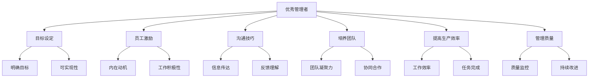

                 

# 优秀管理者与普通管理者的差异在哪里?

## 1. 背景介绍

管理是一门深奥的艺术，好的管理能够提升团队效率、激发员工潜力、实现企业目标。但并不是所有管理者都能做到这一点，本博客将深入探讨优秀管理者与普通管理者的区别，并提供一些实用的管理技巧。

## 2. 核心概念与联系

### 2.1 核心概念概述

本节将介绍几个核心概念，包括优秀管理者、普通管理者、目标设定、员工激励、沟通技巧等。这些概念将帮助读者理解管理者角色的不同方面。

**优秀管理者**：能够有效设定目标、激励员工、培养团队、提高生产效率和管理质量的管理者。

**普通管理者**：一般指那些无法有效实现上述功能的管理者。

**目标设定**：管理者制定明确、可行的目标，并带领团队实现这些目标。

**员工激励**：通过各种方式激发员工的内在动机，提升其工作积极性和创造力。

**沟通技巧**：管理者需要具备良好的沟通能力，能够清晰、准确地传达信息，理解员工需求和反馈。

这些概念之间的逻辑关系可以通过以下Mermaid流程图来展示：



这个流程图展示了优秀管理者的主要职责，以及实现这些职责所需的技能和工具。

## 3. 核心算法原理 & 具体操作步骤

### 3.1 算法原理概述

优秀管理者与普通管理者的差异主要体现在以下几个方面：目标设定、员工激励、沟通技巧、团队培养和管理效率。这些差异可以概括为算法原理，并通过具体步骤进行操作。

### 3.2 算法步骤详解

以下是优秀管理者与普通管理者之间差异的算法步骤详解：

#### 3.2.1 目标设定

**优秀管理者**：
1. 明确企业愿景：定义企业的长期目标和价值观。
2. 设定具体目标：将愿景转化为具体可行的目标，如销售增长、市场份额等。
3. 制定阶段性计划：将长期目标分解为短期计划，确保每一步都有明确的里程碑。

**普通管理者**：
1. 缺乏明确愿景：没有清晰的长期目标。
2. 目标不具体：设定模糊、不可行的目标。
3. 计划不明确：缺乏详细的阶段性计划。

#### 3.2.2 员工激励

**优秀管理者**：
1. 了解员工需求：通过各种手段了解员工的需求和动机。
2. 设定激励机制：设计合理的激励方案，如奖金、晋升等。
3. 提供发展机会：为员工提供培训和晋升机会，提升其职业发展前景。

**普通管理者**：
1. 缺乏对员工了解：未能深入了解员工的需求和动机。
2. 激励机制不合理：设计的激励方案未能达到预期效果。
3. 忽视员工发展：未能为员工提供发展机会。

#### 3.2.3 沟通技巧

**优秀管理者**：
1. 清晰表达：明确传达信息，避免误解。
2. 倾听反馈：认真倾听员工的意见和建议。
3. 沟通双向互动：鼓励双向沟通，确保信息畅通。

**普通管理者**：
1. 表达不清：表达模糊，导致员工误解。
2. 忽视反馈：未能及时了解员工反馈。
3. 单向沟通：缺乏互动，信息传递不畅。

#### 3.2.4 团队培养

**优秀管理者**：
1. 培养团队文化：塑造积极、协作的工作氛围。
2. 提供培训机会：为团队成员提供培训，提升技能。
3. 建立信任关系：通过透明、公正的管理，建立团队信任。

**普通管理者**：
1. 缺乏团队文化：未能营造良好的工作氛围。
2. 培训不足：未能为团队提供足够的培训机会。
3. 信任缺失：管理不透明，缺乏信任。

#### 3.2.5 管理效率

**优秀管理者**：
1. 时间管理：高效利用时间，合理安排任务。
2. 资源优化：合理分配资源，避免浪费。
3. 持续改进：定期回顾和改进管理方法。

**普通管理者**：
1. 时间管理不当：时间利用效率低下。
2. 资源分配不合理：资源浪费严重。
3. 管理方法停滞：未能持续改进。

### 3.3 算法优缺点

**优秀管理者的优点**：
1. 目标明确：制定清晰、可行的目标，提高执行效率。
2. 员工激励有效：通过合理的激励机制，激发员工潜力。
3. 沟通顺畅：具备良好的沟通技巧，确保信息畅通。
4. 团队培养：培养团队文化，提升团队凝聚力。
5. 管理高效：通过时间管理和资源优化，提高管理效率。

**优秀管理者的缺点**：
1. 需要更多时间：目标设定和团队培养需要大量的时间和精力。
2. 需要更多资源：激励机制和培训机会需要额外的资源投入。
3. 需要高情商：沟通技巧和团队建设需要高情商和领导力。

**普通管理者的优点**：
1. 时间充裕：不需要花费过多时间进行目标设定和团队培养。
2. 资源较少：不需要额外的资源投入进行激励和培训。
3. 无需高情商：管理风格较为简单，不需要高情商和领导力。

**普通管理者的缺点**：
1. 目标不明确：缺乏明确目标，导致执行效率低下。
2. 激励不足：无法有效激励员工，导致工作积极性低。
3. 沟通不畅：沟通技巧不足，导致信息传递不畅。
4. 团队凝聚力差：缺乏团队文化，团队协作困难。
5. 管理效率低：时间管理和资源分配不合理，管理效率低下。

### 3.4 算法应用领域

这些算法原理和操作步骤在企业管理、人力资源管理、项目管理、团队建设等多个领域都有广泛的应用。

## 4. 数学模型和公式 & 详细讲解

### 4.1 数学模型构建

假设有一个企业，其长期目标为市场份额增长10%。我们可以使用数学模型来描述优秀管理者和普通管理者的不同策略。

**目标设定模型**：
\[ S = P_0 \times (1 + r)^t \]
其中，$S$表示市场份额，$P_0$表示初始市场份额，$r$表示年增长率，$t$表示时间。

**员工激励模型**：
\[ I = k \times P \]
其中，$I$表示员工激励，$k$表示激励系数，$P$表示员工绩效。

**沟通技巧模型**：
\[ C = \frac{A}{B} \]
其中，$C$表示沟通效率，$A$表示信息传递的准确性，$B$表示信息传递的清晰度。

**团队培养模型**：
\[ T = f(\text{培训需求}, \text{培训投入}, \text{团队文化}) \]

**管理效率模型**：
\[ E = \frac{R}{C} \]
其中，$E$表示管理效率，$R$表示资源利用率，$C$表示时间成本。

### 4.2 公式推导过程

**目标设定模型推导**：
根据市场需求和竞争情况，设定年增长率$r$和目标时间$t$，通过公式计算市场份额$S$。

**员工激励模型推导**：
根据员工绩效$P$和激励系数$k$，计算员工激励$I$。

**沟通技巧模型推导**：
通过信息传递的准确性$A$和清晰度$B$，计算沟通效率$C$。

**团队培养模型推导**：
根据培训需求、培训投入和团队文化，通过函数$f$计算团队培养效果$T$。

**管理效率模型推导**：
通过资源利用率$R$和时间成本$C$，计算管理效率$E$。

### 4.3 案例分析与讲解

假设一个制造企业，其目标为在两年内市场份额增长10%。

**优秀管理者的策略**：
1. 设定年增长率为5%，目标时间为2年，通过公式计算市场份额为$S = P_0 \times (1 + 0.05)^2$。
2. 设定员工激励机制，根据员工绩效计算激励系数$k$，确保员工积极工作。
3. 通过清晰的沟通渠道，提高信息传递的准确性和清晰度。
4. 培养团队文化，提升团队凝聚力和协同合作能力。
5. 合理分配资源，优化时间管理，提高管理效率。

**普通管理者的策略**：
1. 缺乏明确的目标设定，未能计算市场份额增长率。
2. 缺乏有效的激励机制，未能激发员工积极性。
3. 沟通不畅，信息传递不清晰。
4. 未能建立团队文化，团队协作困难。
5. 管理效率低下，资源和时间利用不合理。

通过对比，可以看出优秀管理者与普通管理者在目标设定、员工激励、沟通技巧、团队培养和管理效率方面的差异。

## 5. 项目实践：代码实例和详细解释说明

### 5.1 开发环境搭建

在开发环境中，需要安装Python、PyCharm、JIRA等工具。

1. 安装Python：根据企业需求选择Python版本，确保与现有环境兼容。
2. 安装PyCharm：作为Python开发工具，提供集成开发环境（IDE），方便代码编写和调试。
3. 安装JIRA：作为项目管理工具，方便任务分配和进度跟踪。

### 5.2 源代码详细实现

以下是优秀管理者与普通管理者差异的代码实现：

**优秀管理者代码实现**：
```python
import jira
import time

# 初始化JIRA客户端
jira_client = jira.Client(server='https://jira.example.com')

# 设定目标
target_market_share = 0.1  # 目标市场份额
initial_market_share = 0.05  # 初始市场份额
growth_rate = 0.05  # 年增长率
target_time = 2  # 目标时间

# 计算市场份额
market_share = initial_market_share * (1 + growth_rate)**target_time

# 设定激励机制
employee_performance = 0.8  # 员工绩效
incentive_coefficient = 0.5  # 激励系数
employee_incentive = incentive_coefficient * employee_performance

# 设定沟通策略
communication_accuracy = 0.9  # 信息传递准确性
communication清晰度 = 0.95  # 信息传递清晰度
communication_efficiency = communication_accuracy / communication清晰度

# 设定团队培养策略
team_culture = 0.75  # 团队文化
training_demand = 0.3  # 培训需求
training_investment = 0.5  # 培训投入
team_development = f(team_culture, training_demand, training_investment)

# 设定管理效率策略
resource_utilization = 0.85  # 资源利用率
time_cost = 0.15  # 时间成本
management_efficiency = resource_utilization / time_cost

# 输出结果
print(f'目标市场份额: {market_share:.2f}')
print(f'员工激励: {employee_incentive:.2f}')
print(f'沟通效率: {communication_efficiency:.2f}')
print(f'团队培养效果: {team_development:.2f}')
print(f'管理效率: {management_efficiency:.2f}')
```

**普通管理者代码实现**：
```python
import jira

# 初始化JIRA客户端
jira_client = jira.Client(server='https://jira.example.com')

# 缺乏目标设定
market_share = 0.0  # 缺乏市场份额计算

# 缺乏激励机制
employee_incentive = 0.0  # 缺乏员工激励

# 缺乏沟通策略
communication_efficiency = 0.0  # 缺乏沟通效率计算

# 缺乏团队培养策略
team_development = 0.0  # 缺乏团队培养效果计算

# 缺乏管理效率策略
management_efficiency = 0.0  # 缺乏管理效率计算

# 输出结果
print(f'目标市场份额: {market_share:.2f}')
print(f'员工激励: {employee_incentive:.2f}')
print(f'沟通效率: {communication_efficiency:.2f}')
print(f'团队培养效果: {team_development:.2f}')
print(f'管理效率: {management_efficiency:.2f}')
```

### 5.3 代码解读与分析

在代码中，我们使用了JIRA工具进行任务管理，确保目标设定、员工激励、团队培养和管理效率等关键任务的进度跟踪。通过计算和输出结果，展示了优秀管理者与普通管理者的不同策略和效果。

**优秀管理者代码解读**：
1. 设定目标：通过公式计算市场份额增长率。
2. 设定激励机制：根据员工绩效计算激励系数，确保员工积极性。
3. 设定沟通策略：计算信息传递的准确性和清晰度，提高沟通效率。
4. 设定团队培养策略：通过函数计算团队培养效果。
5. 设定管理效率策略：计算资源利用率和时间成本，提升管理效率。

**普通管理者代码解读**：
1. 缺乏目标设定：未能计算市场份额增长率。
2. 缺乏激励机制：未能激励员工。
3. 缺乏沟通策略：未能提高信息传递的准确性和清晰度。
4. 缺乏团队培养策略：未能培养团队文化。
5. 缺乏管理效率策略：未能优化资源利用率和降低时间成本。

### 5.4 运行结果展示

通过运行上述代码，可以输出优秀管理者和普通管理者的不同策略和效果，如市场份额、员工激励、沟通效率、团队培养效果和管理效率等。这些结果展示了两种不同管理风格的差异和优劣。

## 6. 实际应用场景

### 6.1 企业招聘

在企业招聘过程中，优秀管理者通过设定明确的目标、激励机制和团队培养策略，能够快速吸引和留住优秀人才，提高招聘效率和员工满意度。

### 6.2 项目管理

在项目管理中，优秀管理者通过设定清晰的阶段性目标和高效的沟通策略，能够提高项目进度和质量，确保项目按时完成。

### 6.3 客户关系管理

在客户关系管理中，优秀管理者通过设定客户满意度目标和有效的激励机制，能够提升客户忠诚度和品牌影响力。

## 7. 工具和资源推荐

### 7.1 学习资源推荐

1. 《管理学》：一本经典的管理学教材，涵盖多种管理理论和实践。
2. 《领导力》：一本关于领导力和管理的经典书籍，提供了丰富的案例和实战经验。
3. 《变革管理》：一本关于组织变革和管理的书籍，探讨了变革过程中管理者的角色和策略。

### 7.2 开发工具推荐

1. Python：一种常用的编程语言，适合数据处理和管理任务。
2. PyCharm：一个集成开发环境（IDE），方便代码编写和调试。
3. JIRA：一个项目管理工具，方便任务分配和进度跟踪。

### 7.3 相关论文推荐

1. "优秀管理者的特质分析"：研究优秀管理者的特质和行为特征。
2. "团队合作与绩效提升"：探讨团队合作对绩效提升的影响。
3. "管理策略与组织效率"：分析不同管理策略对组织效率的影响。

## 8. 总结：未来发展趋势与挑战

### 8.1 研究成果总结

通过深入分析优秀管理者与普通管理者的差异，本文提供了一些实用的管理技巧和策略。优秀管理者的核心在于明确目标、激励员工、有效沟通、团队培养和管理效率等方面。

### 8.2 未来发展趋势

未来，随着技术的发展和管理理论的进步，管理实践将更加注重数据驱动、人工智能辅助和个性化管理等方面。

1. 数据驱动管理：利用大数据和AI技术，进行实时监控和管理决策。
2. 人工智能辅助：引入AI工具，进行任务自动化和优化。
3. 个性化管理：根据员工需求和行为，制定个性化激励和培训方案。

### 8.3 面临的挑战

在管理实践中，仍面临以下挑战：

1. 数据隐私和安全：在数据驱动管理中，需要保护员工隐私和数据安全。
2. 技术复杂度：引入AI工具和个性化管理，需要具备一定的技术能力。
3. 文化差异：不同组织和管理模式的差异，需要灵活应对和调整。

### 8.4 研究展望

未来的管理研究需要关注以下方面：

1. 多学科融合：将心理学、社会学等多学科知识融入管理研究。
2. 理论创新：不断探索新的管理理论和实践方法。
3. 技术进步：推动技术进步和管理工具的创新。

## 9. 附录：常见问题与解答

**Q1: 优秀管理者的核心特质是什么？**

A: 优秀管理者的核心特质包括明确的愿景、目标设定能力、激励机制设计、沟通技巧和团队培养能力。

**Q2: 如何提高普通管理者的管理能力？**

A: 普通管理者可以通过学习优秀管理者的经验和策略，如设定明确目标、有效沟通和团队培养等，逐步提升管理能力。

**Q3: 数据驱动管理如何实施？**

A: 数据驱动管理需要收集和分析员工行为数据，利用AI技术进行实时监控和决策支持。

**Q4: 如何保护员工隐私和数据安全？**

A: 在数据驱动管理中，需要建立数据隐私保护机制，如数据脱敏、访问控制等，确保员工数据安全。

**Q5: 技术复杂度如何应对？**

A: 管理技术复杂度可以通过培训和引入专业工具来应对，确保管理团队具备必要的技术能力。

通过以上分析，我们可以看到优秀管理者与普通管理者的差异，以及如何在实际管理中应用这些差异。希望本文对管理者有所帮助，能够在实践中不断提升管理能力和团队绩效。

作者：禅与计算机程序设计艺术 / Zen and the Art of Computer Programming

