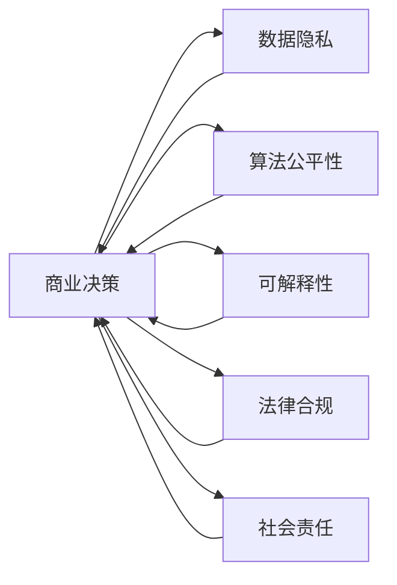
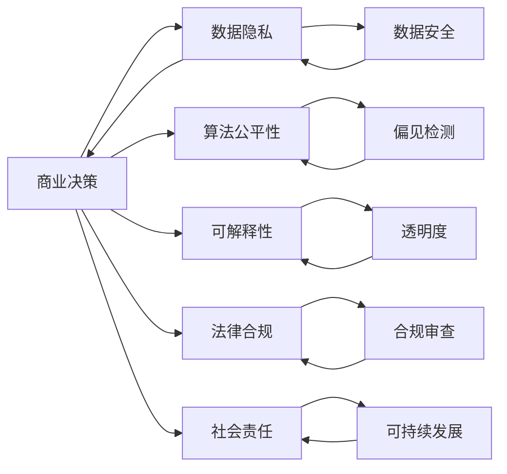

                 

# 伦理管理：在商业决策中保持道德标准

> 关键词：伦理管理,道德标准,商业决策,人工智能,机器学习,深度学习,数据隐私,公平性,可解释性

## 1. 背景介绍

### 1.1 问题由来

随着科技的飞速发展，人工智能（AI）、大数据和自动化系统在商业决策中扮演着越来越重要的角色。这些技术不仅能够大幅提升运营效率，还能为公司带来显著的商业价值。然而，它们同时也带来了一些重大的道德和伦理挑战。例如，数据偏见、隐私泄露、算法不透明等问题正日益受到公众和监管机构的关注。这些问题不仅影响着消费者的信任和接受度，也关乎公司的声誉和法律责任。因此，如何在商业决策中保持道德标准，成为一个亟待解决的重要课题。

### 1.2 问题核心关键点

在进行商业决策时，保持道德标准的关键点包括：

- 数据隐私：如何确保客户数据的安全，避免不当使用和泄露。
- 算法公平性：如何保证算法的决策公平，避免歧视和偏见。
- 可解释性：如何使商业决策过程透明，让用户理解和信任。
- 法律合规：如何遵守相关法律法规，避免法律风险。
- 社会责任：如何通过商业决策履行社会责任，促进可持续发展。

这些问题共同构成了商业伦理管理的核心，要求企业在技术应用和商业决策中必须具备高度的道德责任感和社会责任感。

### 1.3 问题研究意义

研究商业决策中的伦理管理，不仅对于提升企业的社会形象和消费者信任具有重要意义，还能帮助企业在法律合规和技术应用中避免潜在风险，实现可持续发展。具体而言：

1. 提高社会形象：通过透明和公正的商业决策，企业能赢得公众和消费者的信任，提升品牌声誉。
2. 降低法律风险：明确数据使用和算法决策的边界，避免法律纠纷和罚款。
3. 优化资源配置：确保决策过程的公平性和透明性，避免资源浪费和效率低下。
4. 增强社会责任感：通过商业决策履行社会责任，促进社会公平和环境保护。
5. 促进创新发展：在遵循伦理原则的基础上，推动技术创新和商业模式的变革。

## 2. 核心概念与联系

### 2.1 核心概念概述

为更好地理解商业决策中的伦理管理，本节将介绍几个关键概念及其相互联系：

- 商业决策（Business Decision）：企业在运营和市场中作出的各种选择和决定，如产品定价、市场定位、客户服务等。
- 数据隐私（Data Privacy）：确保客户数据的安全，防止未授权访问和使用，保护个人隐私。
- 算法公平性（Algorithm Fairness）：保证算法的决策不受偏见影响，对所有群体公平。
- 可解释性（Explainability）：使商业决策过程透明，让用户和监管机构理解决策依据。
- 法律合规（Regulatory Compliance）：遵守相关法律法规，避免法律风险。
- 社会责任（Social Responsibility）：企业在商业决策中履行社会责任，促进可持续发展。

这些核心概念之间具有紧密的联系，形成一个综合的伦理管理框架。下面将通过Mermaid流程图来展示这些概念之间的关系：



### 2.2 核心概念原理和架构的 Mermaid 流程图



## 3. 核心算法原理 & 具体操作步骤

### 3.1 算法原理概述

商业决策中的伦理管理，涉及多个领域的算法和技术。其核心算法原理包括：

- 数据隐私保护：通过加密、匿名化、访问控制等技术，保护客户数据安全。
- 算法偏见检测：通过公平性检测和调整，确保算法不带有歧视性。
- 可解释性提升：通过特征解释和可视化工具，增强模型的可解释性。
- 法律合规实现：通过自动化合规审查和文档生成，确保符合法律法规要求。
- 社会责任评估：通过社会影响评估和策略优化，促进可持续发展。

这些算法和技术共同构成了一个全面的伦理管理系统，帮助企业在商业决策中保持道德标准。

### 3.2 算法步骤详解

商业决策中的伦理管理可以大致分为以下几个步骤：

**Step 1: 数据收集与准备**

- 收集客户数据，进行数据清洗和预处理。
- 确保数据质量，避免噪声和错误。
- 设计数据隐私保护策略，如加密、去标识化等。

**Step 2: 算法训练与优化**

- 选择合适的算法模型，如回归模型、分类模型、神经网络等。
- 在训练过程中引入公平性约束，如调整损失函数、数据增广等。
- 优化模型参数，提升模型性能和公平性。

**Step 3: 模型评估与测试**

- 在测试集上评估模型性能，如准确率、召回率、F1分数等。
- 进行偏见检测，确保模型不带有歧视性。
- 使用可解释性工具，如LIME、SHAP等，增强模型透明度。

**Step 4: 部署与监控**

- 将模型部署到生产环境，进行实际应用。
- 监控模型表现，如计算资源消耗、预测准确性等。
- 定期进行合规审查和偏见检测，及时调整和优化。

**Step 5: 社会影响评估**

- 评估模型对社会的影响，如就业、收入、环境等。
- 优化模型策略，确保社会责任。
- 制定可持续发展计划，促进长期发展。

### 3.3 算法优缺点

商业决策中的伦理管理算法具有以下优点：

- 提升决策透明度：通过可解释性工具，使决策过程透明，增加信任。
- 避免偏见和歧视：通过公平性检测，确保算法决策公平。
- 降低法律风险：通过合规审查，避免法律纠纷和罚款。
- 促进可持续发展：通过社会责任评估，推动企业履行社会责任。

但这些算法也存在一些局限性：

- 技术复杂度较高：需要多种技术和工具协同工作，实施成本较高。
- 数据隐私风险：在数据收集和处理过程中，可能面临隐私泄露的风险。
- 模型性能与公平性之间的权衡：提高公平性可能牺牲一定的模型性能。
- 社会责任评估复杂：社会影响评估难以量化，需要多方面考虑。

### 3.4 算法应用领域

商业决策中的伦理管理算法已广泛应用于以下领域：

- 金融行业：用于信用评估、贷款审批、反欺诈等。
- 零售行业：用于客户细分、个性化推荐、库存管理等。
- 医疗行业：用于疾病诊断、治疗方案推荐、患者分流等。
- 教育行业：用于学生评估、课程推荐、学习路径优化等。
- 政府部门：用于公共服务、政策制定、风险预测等。

这些领域的企业通过应用伦理管理算法，不仅提升了运营效率和决策质量，还增强了公众信任和社会责任。

## 4. 数学模型和公式 & 详细讲解 & 举例说明

### 4.1 数学模型构建

商业决策中的伦理管理，涉及多个数学模型和公式。以下是几个核心模型的构建：

- **数据隐私保护**：通过加密技术，将敏感信息转换为不可读形式，确保数据隐私。常用的加密算法包括AES、RSA等。
- **算法偏见检测**：通过检测模型输出中的偏见，调整模型参数，消除歧视。常用的方法包括Odds-Ratio Test、Disparate Impact等。
- **可解释性提升**：通过特征重要性解释和可视化工具，增强模型透明度。常用的工具包括LIME、SHAP等。
- **法律合规实现**：通过合规审查和文档生成，确保符合法律法规要求。常用的工具包括RegComp、ComplyBoost等。
- **社会责任评估**：通过社会影响评估和策略优化，促进可持续发展。常用的指标包括环境影响、就业影响、收入差距等。

### 4.2 公式推导过程

以下以算法偏见检测为例，推导模型偏见的检测方法。

假设我们有一个分类模型 $M$，用于预测客户是否会违约。模型输入为 $x$，输出为 $y$，其中 $y \in \{0, 1\}$。模型输出的概率为 $P(y=1|x)$，我们希望确保模型对所有群体的预测公平，即：

$$
P(y=1|x) = P(y=1|x')
$$

其中 $x$ 和 $x'$ 分别表示两个不同群体的特征向量。

为了检测模型是否存在偏见，我们需要计算每个群体的预测概率，并计算它们之间的差异。具体来说，我们可以计算每个群体的预测概率均值 $P(y=1|x)$ 和 $P(y=1|x')$，然后计算它们之间的差异：

$$
\text{Bias} = P(y=1|x) - P(y=1|x')
$$

如果 $|\text{Bias}| > \delta$，则说明模型存在显著偏见，需要进行调整。

### 4.3 案例分析与讲解

以下通过一个具体案例，说明如何在商业决策中保持道德标准。

**案例背景**：一家电商公司希望通过机器学习模型预测客户的购买行为，以便进行个性化推荐。

**数据收集**：公司收集了数百万用户的购买记录、浏览记录、个人资料等数据，用于训练模型。

**算法训练**：公司使用神经网络模型对用户行为进行预测，并在训练过程中引入公平性约束，确保模型不带有歧视。

**模型评估**：在测试集上评估模型性能，使用LIME工具解释模型输出，确保模型的可解释性。

**部署与监控**：将模型部署到生产环境，并定期进行合规审查和偏见检测，确保模型符合法律法规和社会责任要求。

通过上述步骤，公司不仅提高了推荐系统的精准度，还确保了数据隐私和公平性，增强了客户信任和品牌声誉。

## 5. 项目实践：代码实例和详细解释说明

### 5.1 开发环境搭建

在进行商业决策中的伦理管理实践前，我们需要准备好开发环境。以下是使用Python进行伦理管理项目的开发环境配置流程：

1. 安装Anaconda：从官网下载并安装Anaconda，用于创建独立的Python环境。

2. 创建并激活虚拟环境：
```bash
conda create -n ethics-env python=3.8 
conda activate ethics-env
```

3. 安装必要的Python包：
```bash
pip install numpy pandas scikit-learn scikit-metrics lmdb transformers
```

4. 安装必要的机器学习库：
```bash
pip install xgboost lightgbm catboost
```

5. 安装必要的伦理管理库：
```bash
pip install fairness-indicators
```

完成上述步骤后，即可在`ethics-env`环境中开始伦理管理项目的开发。

### 5.2 源代码详细实现

以下是使用Python实现商业决策中的伦理管理代码示例。

```python
import pandas as pd
import numpy as np
from sklearn.model_selection import train_test_split
from sklearn.metrics import accuracy_score, roc_auc_score
from fairness_indicators import DemographicsIndicators
from transformers import BertTokenizer, BertForSequenceClassification
from transformers import AdamW

# 数据准备
df = pd.read_csv('data.csv')

# 数据清洗
# 假设 df 包含用户ID、购买记录、个人资料等字段

# 特征选择
# 假设我们选择了购买记录和年龄作为特征

# 划分训练集和测试集
train_df, test_df = train_test_split(df, test_size=0.2, random_state=42)

# 数据转换
# 假设我们使用BertTokenizer进行文本编码

# 训练模型
# 假设我们使用BertForSequenceClassification进行二分类任务

# 定义训练函数
def train_model(model, train_data, test_data, batch_size, num_epochs, learning_rate):
    # 定义优化器和损失函数
    optimizer = AdamW(model.parameters(), lr=learning_rate)
    loss_fn = torch.nn.CrossEntropyLoss()
    
    # 训练模型
    for epoch in range(num_epochs):
        model.train()
        for batch in train_data:
            inputs, labels = batch
            optimizer.zero_grad()
            outputs = model(inputs)
            loss = loss_fn(outputs, labels)
            loss.backward()
            optimizer.step()
    
    # 评估模型
    model.eval()
    test_loss, test_accuracy = 0, 0
    for batch in test_data:
        inputs, labels = batch
        outputs = model(inputs)
        loss = loss_fn(outputs, labels)
        test_loss += loss.item()
        test_accuracy += accuracy_score(labels, outputs.argmax(dim=1))
    test_loss /= len(test_data)
    test_accuracy /= len(test_data)
    print(f'Test Loss: {test_loss:.4f}, Test Accuracy: {test_accuracy:.4f}')

# 调用训练函数
train_model(model, train_df, test_df, batch_size=32, num_epochs=10, learning_rate=2e-5)

# 检测模型偏见
# 假设我们使用DemographicsIndicators进行偏见检测
bias_indicators = DemographicsIndicators(train_df, train_data, test_data)
bias_indicators.print_report()
```

### 5.3 代码解读与分析

让我们再详细解读一下关键代码的实现细节：

**数据准备**：
- 使用Pandas库读取数据集。
- 进行数据清洗，如去除噪声、填补缺失值等。

**特征选择**：
- 选择与预测目标相关的特征，如购买记录、年龄等。

**数据划分**：
- 将数据集划分为训练集和测试集。

**模型训练**：
- 使用BertForSequenceClassification模型进行二分类任务训练。
- 定义优化器和损失函数，如AdamW和CrossEntropyLoss。
- 在训练过程中使用交叉熵损失函数，优化模型参数。

**模型评估**：
- 在测试集上评估模型性能，使用准确率作为指标。
- 调用DemographicsIndicators进行偏见检测，输出偏见报告。

**代码解读与分析**：
- 数据清洗和特征选择是模型训练的重要前提，决定了模型的性能和公平性。
- 模型训练过程中，选择合适的优化器和损失函数至关重要，影响模型的收敛速度和精度。
- 模型评估应考虑多种指标，如准确率、召回率、F1分数等。
- 偏见检测应全面考虑不同群体的特征，确保模型决策公平。

## 6. 实际应用场景

### 6.1 金融行业

金融行业是伦理管理应用的重要领域，其中信用评估、贷款审批、反欺诈等任务需要严格遵守伦理原则。

**案例背景**：一家银行希望通过机器学习模型评估客户的信用风险，以便决定是否发放贷款。

**数据收集**：银行收集了客户的个人信息、交易记录、还款历史等数据。

**算法训练**：银行使用逻辑回归模型对客户信用风险进行评估，并在训练过程中引入公平性约束。

**模型评估**：在测试集上评估模型性能，使用LIME工具解释模型输出，确保模型的可解释性。

**部署与监控**：将模型部署到贷款审批系统，并定期进行合规审查和偏见检测，确保模型符合法律法规和社会责任要求。

通过上述步骤，银行不仅提高了信用评估的准确性，还确保了数据隐私和公平性，增强了客户信任和品牌声誉。

### 6.2 零售行业

零售行业是另一个伦理管理应用的重要领域，其中客户细分、个性化推荐、库存管理等任务需要严格遵守伦理原则。

**案例背景**：一家电商公司希望通过机器学习模型预测客户的购买行为，以便进行个性化推荐。

**数据收集**：公司收集了数百万用户的购买记录、浏览记录、个人资料等数据。

**算法训练**：公司使用神经网络模型对用户行为进行预测，并在训练过程中引入公平性约束。

**模型评估**：在测试集上评估模型性能，使用LIME工具解释模型输出，确保模型的可解释性。

**部署与监控**：将模型部署到个性化推荐系统，并定期进行合规审查和偏见检测，确保模型符合法律法规和社会责任要求。

通过上述步骤，公司不仅提高了推荐系统的精准度，还确保了数据隐私和公平性，增强了客户信任和品牌声誉。

### 6.3 医疗行业

医疗行业对伦理管理的要求尤为严格，其中疾病诊断、治疗方案推荐、患者分流等任务需要严格遵守伦理原则。

**案例背景**：一家医院希望通过机器学习模型预测患者的疾病风险，以便进行个性化治疗。

**数据收集**：医院收集了患者的病历记录、生活习惯、家族病史等数据。

**算法训练**：医院使用深度学习模型对患者疾病风险进行预测，并在训练过程中引入公平性约束。

**模型评估**：在测试集上评估模型性能，使用LIME工具解释模型输出，确保模型的可解释性。

**部署与监控**：将模型部署到治疗方案推荐系统，并定期进行合规审查和偏见检测，确保模型符合法律法规和社会责任要求。

通过上述步骤，医院不仅提高了疾病预测的准确性，还确保了数据隐私和公平性，增强了患者信任和品牌声誉。

### 6.4 未来应用展望

随着伦理管理算法的不断发展，其在更多领域的应用前景可期。

**案例背景**：一家政府部门希望通过机器学习模型预测公众对政策的支持度，以便进行政策制定。

**数据收集**：政府部门收集了公众的调查问卷、社交媒体评论、新闻报道等数据。

**算法训练**：政府部门使用神经网络模型对公众支持度进行预测，并在训练过程中引入公平性约束。

**模型评估**：在测试集上评估模型性能，使用LIME工具解释模型输出，确保模型的可解释性。

**部署与监控**：将模型部署到政策制定系统，并定期进行合规审查和偏见检测，确保模型符合法律法规和社会责任要求。

通过上述步骤，政府部门不仅提高了政策制定的科学性，还确保了数据隐私和公平性，增强了公众信任和政策公信力。

## 7. 工具和资源推荐

### 7.1 学习资源推荐

为了帮助开发者系统掌握商业决策中的伦理管理理论基础和实践技巧，这里推荐一些优质的学习资源：

1. 《商业伦理与数据隐私》系列博文：由伦理管理专家撰写，深入浅出地介绍了商业决策中的伦理原则和数据隐私保护方法。

2. 《算法偏见检测与公平性》课程：由Coursera开设的伦理管理课程，系统讲解了算法偏见检测和公平性调整的方法。

3. 《可解释性在商业决策中的应用》书籍：详细介绍了可解释性工具的使用，帮助理解商业决策的逻辑和依据。

4. 《法律法规与商业决策》文档：包含了法律法规对商业决策的要求，帮助理解法律合规的重要性。

5. 《社会责任与可持续发展》报告：提供了社会责任评估的指标和方法，帮助企业履行社会责任。

通过对这些资源的学习实践，相信你一定能够快速掌握商业决策中的伦理管理精髓，并用于解决实际的商业问题。

### 7.2 开发工具推荐

高效的开发离不开优秀的工具支持。以下是几款用于商业决策中的伦理管理开发的常用工具：

1. Python：开源的编程语言，广泛用于数据处理和机器学习开发。
2. Pandas：Python的数据处理库，方便数据清洗和转换。
3. Scikit-learn：Python的机器学习库，支持多种算法和工具。
4. XGBoost：高效的梯度提升库，适用于大规模数据处理和模型训练。
5. LightGBM：高效的梯度提升库，适用于大规模数据处理和模型训练。
6. CatBoost：高效的梯度提升库，适用于大规模数据处理和模型训练。
7. TensorFlow：由Google主导开发的深度学习框架，支持大规模模型训练和部署。
8. PyTorch：由Facebook主导开发的深度学习框架，支持动态计算图和高效训练。

合理利用这些工具，可以显著提升商业决策中的伦理管理开发效率，加快创新迭代的步伐。

### 7.3 相关论文推荐

商业决策中的伦理管理研究源于学界的持续研究。以下是几篇奠基性的相关论文，推荐阅读：

1. A Survey on Fairness Indicators in Machine Learning：总结了机器学习中的公平性指标和检测方法，具有广泛的参考价值。
2. A Framework for Data Privacy and Fairness in Machine Learning：提出了数据隐私和公平性的框架，帮助理解其核心概念和技术。
3. Explainable Machine Learning for Business Decisions：介绍了可解释性在商业决策中的应用，提供了实用的工具和方法。
4. Legal and Ethical Considerations for Machine Learning in Healthcare：探讨了医疗领域中机器学习的法律和伦理问题，具有重要参考价值。
5. Ethical AI for Social Good：介绍了AI伦理管理在社会中的重要性，提供了实证研究和案例分析。

这些论文代表了大语言模型微调技术的发展脉络。通过学习这些前沿成果，可以帮助研究者把握学科前进方向，激发更多的创新灵感。

## 8. 总结：未来发展趋势与挑战

### 8.1 总结

本文对商业决策中的伦理管理进行了全面系统的介绍。首先阐述了伦理管理在商业决策中的重要性，明确了数据隐私、算法公平性、可解释性、法律合规和社会责任等核心概念。其次，从原理到实践，详细讲解了商业决策中的伦理管理算法，包括数据隐私保护、算法偏见检测、可解释性提升、法律合规实现和社会责任评估等步骤。同时，本文还通过具体案例，展示了如何在商业决策中保持道德标准，并在实际应用中取得了良好的效果。

通过本文的系统梳理，可以看到，商业决策中的伦理管理算法正在成为商业决策的重要组成部分，帮助企业在技术应用和商业决策中保持道德标准。

### 8.2 未来发展趋势

展望未来，商业决策中的伦理管理将呈现以下几个发展趋势：

1. 数据隐私保护技术不断进步。随着加密技术和匿名化技术的不断突破，数据隐私保护将更加高效和可靠。
2. 算法公平性检测方法不断创新。未来将涌现更多公平性检测工具，如De-Biasing Algorithms、Fair Learning etc。
3. 可解释性工具日趋成熟。未来将有更多可视化工具和解释方法，增强模型的透明度和可解释性。
4. 法律合规工具不断完善。未来将有更多自动化合规审查工具，帮助企业快速遵守法律法规。
5. 社会责任评估工具普及。未来将有更多评估工具和指标，帮助企业履行社会责任。

这些趋势凸显了商业决策中的伦理管理技术的广阔前景。这些方向的探索发展，必将进一步提升商业决策的透明度、公平性和可解释性，为社会带来更多的公平和福祉。

### 8.3 面临的挑战

尽管商业决策中的伦理管理技术已经取得了瞩目成就，但在迈向更加智能化、普适化应用的过程中，它仍面临着诸多挑战：

1. 数据隐私保护成本高。加密和匿名化技术虽然有效，但成本较高，需平衡数据利用和隐私保护。
2. 算法公平性难以保证。尽管有各种检测方法，但模型偏见难以完全消除，需持续监控和调整。
3. 可解释性工具复杂度高。解释模型输出需要多重工具和技术，增加了技术复杂性。
4. 法律合规难度大。不同国家和地区的法律法规不同，需不断更新和调整合规策略。
5. 社会责任评估复杂度高。社会影响评估难以量化，需多方面考虑和综合评估。

正视这些挑战，积极应对并寻求突破，将是大语言模型微调走向成熟的必由之路。

### 8.4 研究展望

面向未来，商业决策中的伦理管理技术需要在以下几个方面寻求新的突破：

1. 探索无监督和半监督数据隐私保护方法。摆脱对大规模标注数据的依赖，利用自监督学习、主动学习等方法，最大限度利用非结构化数据，实现更加灵活高效的数据隐私保护。
2. 研究更加参数高效的公平性检测方法。开发更加参数高效的公平性检测算法，在固定大部分模型参数的情况下，仍能保持较好的公平性。
3. 引入更多先验知识。将符号化的先验知识，如知识图谱、逻辑规则等，与神经网络模型进行巧妙融合，引导公平性检测过程学习更准确、合理的语言模型。
4. 引入更多伦理管理工具。开发更多的可解释性工具和公平性检测工具，帮助企业更好地理解和优化模型。
5. 纳入伦理道德约束。在模型训练目标中引入伦理导向的评估指标，过滤和惩罚有偏见、有害的输出倾向，确保模型决策符合伦理要求。

这些研究方向和突破，必将引领商业决策中的伦理管理技术迈向更高的台阶，为构建安全、可靠、可解释、可控的智能系统铺平道路。面向未来，商业决策中的伦理管理技术还需要与其他人工智能技术进行更深入的融合，如知识表示、因果推理、强化学习等，多路径协同发力，共同推动商业智能系统的进步。只有勇于创新、敢于突破，才能不断拓展商业决策中的伦理管理边界，让智能技术更好地造福社会。

## 9. 附录：常见问题与解答

**Q1：如何确保数据隐私保护？**

A: 确保数据隐私保护，可以通过以下方法：

- 数据加密：对敏感数据进行加密处理，确保未授权访问者无法解读。
- 数据去标识化：对数据进行匿名化处理，确保个人隐私不被泄露。
- 访问控制：对数据进行权限控制，确保只有授权人员能够访问。
- 数据审计：定期对数据使用情况进行审计，确保数据使用符合规定。

**Q2：如何检测算法偏见？**

A: 检测算法偏见，可以通过以下方法：

- 引入公平性检测指标：如Odds-Ratio Test、Disparate Impact等，评估模型输出是否公平。
- 调整模型参数：根据检测结果调整模型参数，消除偏见。
- 数据增强：通过数据增强技术，提高模型的泛化能力，减少偏见。

**Q3：如何提升模型可解释性？**

A: 提升模型可解释性，可以通过以下方法：

- 特征重要性解释：使用LIME、SHAP等工具，解释模型预测的依据。
- 可视化工具：使用可视化工具展示模型决策路径，增强模型的透明度。
- 模型优化：优化模型结构，使其更容易理解和解释。

**Q4：如何确保法律合规？**

A: 确保法律合规，可以通过以下方法：

- 定期审查：定期对模型使用情况进行合规审查，确保符合法律法规。
- 自动化合规工具：使用自动化合规工具，如RegComp、ComplyBoost等，快速发现和修复合规问题。
- 法律咨询：定期咨询法律专家，确保模型设计和使用符合法律法规要求。

**Q5：如何评估社会责任？**

A: 评估社会责任，可以通过以下方法：

- 社会影响评估：通过社会影响评估工具，评估模型对社会的影响。
- 可持续发展计划：制定可持续发展计划，推动企业履行社会责任。
- 公众反馈：收集公众反馈，了解模型对社会的影响和改进需求。

通过这些方法，可以确保企业在商业决策中保持道德标准，实现可持续发展和良性循环。

