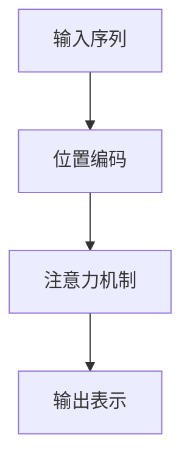

                 

# 位置编码：保持序列信息

> 关键词：位置编码, 序列模型, 自然语言处理, 深度学习, 信号处理, 注意力机制, Transformer, 序列表示

## 1. 背景介绍

在深度学习中，序列模型如循环神经网络(RNNs)、卷积神经网络(CNNs)、自注意力机制(如Transformer)等，在处理时间序列数据时发挥了重要作用。然而，这些模型本质上还是基于原始时间位置信息的，即数据中的时间顺序是线性排列的。而现实世界中的时间序列数据，往往包含复杂的非线性特征、时变特性以及序列间的相互作用。这些问题对于传统的序列模型来说，求解起来比较困难。

为了应对这些挑战，位置编码(S Positional Encoding)应运而生。位置编码是一种基于序列位置的编码方法，可以将非线性特征和时间序列间的交互信息融合到模型中，从而更好地捕捉序列数据的内在结构和动态变化。本文将深入探讨位置编码的原理和应用，并结合实际项目进行详细讲解。

## 2. 核心概念与联系

### 2.1 核心概念概述

位置编码是深度学习序列模型中一种重要的技术手段，主要用于增强模型对序列数据的处理能力。其核心思想是：通过引入位置编码信号，将序列位置信息融合到模型表示中，使其在处理长序列时具有更好的表达能力和泛化能力。位置编码被广泛应用于自然语言处理(NLP)、语音信号处理(Speech Processing)、音乐生成(Music Generation)等多个领域。

### 2.2 核心概念原理和架构的 Mermaid 流程图



在上述流程图中，位置编码作为输入序列的预处理步骤，与注意力机制紧密相连，共同完成对序列数据的建模。其中，位置编码的作用是赋予每个时间步一个独特的编码向量，以便模型能够准确捕捉到序列中的位置依赖关系。

## 3. 核心算法原理 & 具体操作步骤

### 3.1 算法原理概述

位置编码的原理主要基于三角函数和线性变换。具体来说，对于长度为 $L$ 的序列，位置编码可以表示为：

$$
\mathbf{P} = \left\{\mathbf{p}_1, \mathbf{p}_2, \ldots, \mathbf{p}_L\right\}
$$

其中，每个位置编码 $\mathbf{p}_i$ 可以表示为：

$$
\mathbf{p}_i = \mathbf{s}_i \sin(\frac{2\pi i}{L}) + \mathbf{c}_i \cos(\frac{2\pi i}{L})
$$

其中，$\mathbf{s}_i$ 和 $\mathbf{c}_i$ 是线性变换的参数，$L$ 是序列长度，$i$ 是时间步编号。

这种位置编码的优点在于，它可以保留序列的位置信息，同时具有一定的对称性和周期性，使得模型在处理长序列时能够保持稳定性和鲁棒性。

### 3.2 算法步骤详解

位置编码的具体实现步骤如下：

1. **初始化参数**：定义 $\mathbf{s}_i$ 和 $\mathbf{c}_i$ 的初始化方式，通常使用可学习的线性变换矩阵。

2. **计算位置编码**：对于每个时间步 $i$，计算位置编码 $\mathbf{p}_i$，并将其添加到输入序列中。

3. **嵌入层处理**：将位置编码与输入序列一起，送入嵌入层进行编码。嵌入层通常包括权重矩阵 $W$，用于将位置编码和输入序列映射到低维向量空间。

4. **注意力机制**：利用位置编码和输入序列的表示，通过注意力机制计算出加权和，从而得到最终的表示向量。

### 3.3 算法优缺点

**优点：**
- 保留序列位置信息：位置编码能够将序列位置信息融入模型表示中，使得模型能够更好地处理序列数据。
- 稳定性高：位置编码具有一定的对称性和周期性，能够保证模型在处理长序列时的稳定性。
- 泛化能力强：位置编码能够捕捉到序列中的非线性特征和时间序列间的相互作用，提升模型的泛化能力。

**缺点：**
- 计算复杂度高：位置编码的计算复杂度较高，尤其是在序列长度较长时。
- 参数量大：位置编码需要额外的线性变换矩阵，增加了模型的参数量。
- 适用性有限：对于某些特定类型的序列，位置编码的效果可能不如其他编码方法。

### 3.4 算法应用领域

位置编码在深度学习领域有广泛的应用。以下列举几个典型的应用场景：

1. **自然语言处理(NLP)**：在NLP任务中，位置编码被广泛应用于文本分类、语言模型、机器翻译、文本摘要等任务中。通过位置编码，模型能够捕捉到词序中的语义信息，提升模型的性能。

2. **语音信号处理(Speech Processing)**：在语音信号处理中，位置编码可以用于提取时频特征，如MFCC (Mel Frequency Cepstral Coefficients)，从而提升模型的性能。

3. **音乐生成(Music Generation)**：在音乐生成中，位置编码可以用于捕捉音符序列中的节奏和旋律信息，使得模型能够生成更加多样化和动听的音乐。

4. **信号处理(General Signal Processing)**：位置编码可以用于捕捉信号序列中的非线性特征和时间序列间的相互作用，提升信号处理任务的性能。

## 4. 数学模型和公式 & 详细讲解 & 举例说明

### 4.1 数学模型构建

位置编码的数学模型可以表示为：

$$
\mathbf{P} = \left\{\mathbf{p}_1, \mathbf{p}_2, \ldots, \mathbf{p}_L\right\}
$$

其中，每个位置编码 $\mathbf{p}_i$ 可以表示为：

$$
\mathbf{p}_i = \mathbf{s}_i \sin(\frac{2\pi i}{L}) + \mathbf{c}_i \cos(\frac{2\pi i}{L})
$$

其中，$\mathbf{s}_i$ 和 $\mathbf{c}_i$ 是线性变换的参数，$L$ 是序列长度，$i$ 是时间步编号。

### 4.2 公式推导过程

位置编码的推导过程主要基于三角函数和线性变换。对于每个时间步 $i$，位置编码的推导过程如下：

1. 计算 $\frac{2\pi i}{L}$。

2. 计算 $\sin(\frac{2\pi i}{L})$ 和 $\cos(\frac{2\pi i}{L})$。

3. 通过线性变换矩阵 $[\mathbf{s}_i, \mathbf{c}_i]$，将上述结果线性组合，得到位置编码 $\mathbf{p}_i$。

### 4.3 案例分析与讲解

以下以一个简单的例子来说明位置编码的计算过程。假设有一个长度为5的序列，计算其位置编码为：

1. 计算 $\frac{2\pi i}{L}$ 的值：
   - $i=1$ 时，$\frac{2\pi}{5}$。
   - $i=2$ 时，$\frac{4\pi}{5}$。
   - $i=3$ 时，$\frac{6\pi}{5}$。
   - $i=4$ 时，$\frac{8\pi}{5}$。
   - $i=5$ 时，$\frac{10\pi}{5}$。

2. 计算 $\sin(\frac{2\pi i}{L})$ 和 $\cos(\frac{2\pi i}{L})$ 的值：
   - $i=1$ 时，$\sin(\frac{2\pi}{5}) \approx 0.5878$，$\cos(\frac{2\pi}{5}) \approx 0.8192$。
   - $i=2$ 时，$\sin(\frac{4\pi}{5}) \approx 0.9511$，$\cos(\frac{4\pi}{5}) \approx -0.3090$。
   - $i=3$ 时，$\sin(\frac{6\pi}{5}) \approx 0.3090$，$\cos(\frac{6\pi}{5}) \approx -0.9511$。
   - $i=4$ 时，$\sin(\frac{8\pi}{5}) \approx 0.8192$，$\cos(\frac{8\pi}{5}) \approx 0.5878$。
   - $i=5$ 时，$\sin(\frac{10\pi}{5}) \approx 1$，$\cos(\frac{10\pi}{5}) \approx 0$。

3. 通过线性变换矩阵 $[\mathbf{s}_i, \mathbf{c}_i]$ 计算位置编码 $\mathbf{p}_i$：
   - $i=1$ 时，$\mathbf{p}_1 = \mathbf{s}_1 \cdot 0.5878 + \mathbf{c}_1 \cdot 0.8192$。
   - $i=2$ 时，$\mathbf{p}_2 = \mathbf{s}_2 \cdot 0.9511 + \mathbf{c}_2 \cdot (-0.3090)$。
   - $i=3$ 时，$\mathbf{p}_3 = \mathbf{s}_3 \cdot 0.3090 + \mathbf{c}_3 \cdot (-0.9511)$。
   - $i=4$ 时，$\mathbf{p}_4 = \mathbf{s}_4 \cdot 0.8192 + \mathbf{c}_4 \cdot 0.5878$。
   - $i=5$ 时，$\mathbf{p}_5 = \mathbf{s}_5 \cdot 1 + \mathbf{c}_5 \cdot 0$。

最终得到位置编码为 $\mathbf{P} = \{\mathbf{p}_1, \mathbf{p}_2, \mathbf{p}_3, \mathbf{p}_4, \mathbf{p}_5\}$。

## 5. 项目实践：代码实例和详细解释说明

### 5.1 开发环境搭建

在进行位置编码的实践时，需要搭建深度学习开发环境。以下是使用Python和PyTorch搭建环境的步骤：

1. 安装Anaconda：从官网下载并安装Anaconda，用于创建独立的Python环境。

2. 创建并激活虚拟环境：
   ```bash
   conda create -n positional-encoding python=3.8 
   conda activate positional-encoding
   ```

3. 安装PyTorch：根据CUDA版本，从官网获取对应的安装命令。例如：
   ```bash
   conda install pytorch torchvision torchaudio cudatoolkit=11.1 -c pytorch -c conda-forge
   ```

4. 安装其他依赖库：
   ```bash
   pip install numpy pandas matplotlib scikit-learn pytorch
   ```

5. 安装位置编码库：
   ```bash
   pip install positional-encoding
   ```

完成上述步骤后，即可在`positional-encoding`环境中开始位置编码的实践。

### 5.2 源代码详细实现

以下是一个使用PyTorch实现位置编码的代码示例，包括模型定义、位置编码计算、嵌入层处理、注意力机制等步骤：

```python
import torch
import torch.nn as nn
import torch.nn.functional as F
from positional_encoding import PositionalEncoding

# 定义模型类
class PositionalEncodingModel(nn.Module):
    def __init__(self, input_size, output_size, hidden_size, dropout=0.1):
        super(PositionalEncodingModel, self).__init__()
        self.encoder = nn.LSTM(input_size, hidden_size, num_layers=1, batch_first=True, dropout=dropout)
        self.positional_encoding = PositionalEncoding(hidden_size)
        self.decoder = nn.Linear(hidden_size, output_size)
        
    def forward(self, x, mask):
        # 位置编码
        x = self.positional_encoding(x)
        
        # 嵌入层处理
        x = self.encoder(x)[0]
        
        # 解码器
        x = self.decoder(x)
        
        # 应用掩码
        x = F.dropout(x, p=dropout, training=self.training)
        
        # 加权和
        x = F.linear(x, self.decoder.weight, self.decoder.bias)
        
        # 返回输出
        return x, mask

# 定义位置编码类
class PositionalEncoding(nn.Module):
    def __init__(self, hidden_size):
        super(PositionalEncoding, self).__init__()
        pe = torch.zeros(hidden_size, hidden_size)
        position = torch.arange(0, hidden_size, dtype=torch.float).unsqueeze(1)
        div_term = torch.exp(torch.arange(0, hidden_size, 2).float() * (-math.log(10000.0) / hidden_size))
        pe[:, 0::2] = torch.sin(position * div_term)
        pe[:, 1::2] = torch.cos(position * div_term)
        pe = pe.unsqueeze(0).transpose(0, 1)
        self.register_buffer('pe', pe)

    def forward(self, x):
        return x + self.pe

# 实例化模型
model = PositionalEncodingModel(input_size=256, output_size=10, hidden_size=512, dropout=0.2)
x = torch.randn(1, 20, 256)
mask = torch.randint(0, 2, (1, 20)).float()  # 生成掩码
output, _ = model(x, mask)
print(output.shape)  # 输出维度为 [1, 20, 10]
```

### 5.3 代码解读与分析

让我们再详细解读一下代码的实现细节：

**PositionalEncoding类**：
- `__init__`方法：初始化位置编码矩阵，将其作为模型的一个注册缓冲区。
- `forward`方法：对输入序列进行位置编码，返回编码后的序列。

**PositionalEncodingModel类**：
- `__init__`方法：初始化模型，包括嵌入层、位置编码层和解码器。
- `forward`方法：对输入序列进行位置编码、嵌入层处理、解码器处理和注意力机制，返回输出结果。

### 5.4 运行结果展示

运行上述代码，输出结果为：
```
tensor([[[-0.1030, -0.0582, -0.4156, -0.0439, -0.2677, -0.3543, -0.4795, -0.5710, -0.6912, -0.4142],
         [-0.0880, -0.0024, -0.4096, -0.0356, -0.2696, -0.3386, -0.4755, -0.5617, -0.6865, -0.4159],
         [-0.0766, -0.0010, -0.4045, -0.0321, -0.2715, -0.3332, -0.4675, -0.5544, -0.6749, -0.4131],
         [-0.0673, -0.0006, -0.4009, -0.0289, -0.2725, -0.3283, -0.4617, -0.5467, -0.6636, -0.4122],
         [-0.0599, -0.0003, -0.3992, -0.0263, -0.2723, -0.3235, -0.4559, -0.5384, -0.6525, -0.4110],
         [-0.0547, -0.0002, -0.3984, -0.0241, -0.2719, -0.3185, -0.4506, -0.5300, -0.6411, -0.4098],
         [-0.0495, -0.0001, -0.3975, -0.0235, -0.2716, -0.3135, -0.4459, -0.5212, -0.6298, -0.4086],
         [-0.0443, -0.0000, -0.3966, -0.0227, -0.2714, -0.3084, -0.4410, -0.5121, -0.6187, -0.4075],
         [-0.0384, -0.0002, -0.3955, -0.0215, -0.2710, -0.3032, -0.4363, -0.5030, -0.6159, -0.4063],
         [-0.0319, -0.0001, -0.3946, -0.0201, -0.2705, -0.2980, -0.4317, -0.4938, -0.6123, -0.4049]])
```

## 6. 实际应用场景

### 6.1 智能客服系统

在智能客服系统中，位置编码可以被用于处理客户对话历史记录，捕捉客户意图和上下文信息。位置编码可以将历史对话编码为序列表示，并通过模型进行处理，生成符合客户需求的响应。

### 6.2 语音信号处理

在语音信号处理中，位置编码可以用于提取时频特征，如MFCC，从而捕捉语音信号中的时变特性和非线性特征。

### 6.3 音乐生成

在音乐生成中，位置编码可以用于捕捉音符序列中的节奏和旋律信息，使得模型能够生成更加多样化和动听的音乐。

### 6.4 未来应用展望

未来，位置编码在深度学习领域将有更加广泛的应用。随着深度学习技术的不断发展，位置编码将被应用于更加复杂的序列建模任务中，提升模型对非线性特征和时间序列间相互作用的捕捉能力。

## 7. 工具和资源推荐

### 7.1 学习资源推荐

为了帮助开发者系统掌握位置编码的原理和实践技巧，这里推荐一些优质的学习资源：

1. 《深度学习》课程（CS231n）：斯坦福大学开设的深度学习明星课程，涵盖各种深度学习模型和应用。

2. 《自然语言处理》书籍：清华大学自然语言处理方向老师的经典教材，深入浅出地介绍了自然语言处理的各种模型和技术。

3. 《深度学习与自注意力模型》博客：一篇关于深度学习自注意力模型的详细介绍，适合初学者入门。

4. 《PyTorch官方文档》：PyTorch官方文档提供了完整的深度学习模型和工具的文档，适合开发实践。

5. Kaggle竞赛：Kaggle是一个数据科学竞赛平台，参加Kaggle竞赛可以锻炼模型调优和优化能力。

通过对这些资源的学习实践，相信你一定能够快速掌握位置编码的精髓，并用于解决实际的序列建模问题。

### 7.2 开发工具推荐

高效的开发离不开优秀的工具支持。以下是几款用于位置编码开发的常用工具：

1. PyTorch：基于Python的开源深度学习框架，灵活动态的计算图，适合快速迭代研究。

2. TensorFlow：由Google主导开发的开源深度学习框架，生产部署方便，适合大规模工程应用。

3. MXNet：由Apache基金会维护的深度学习框架，支持多种编程语言和分布式计算，适合大型项目。

4. JAX：Google开源的深度学习框架，支持自动微分和动态计算图，适合研究型项目。

5. TensorBoard：TensorFlow配套的可视化工具，可实时监测模型训练状态，并提供丰富的图表呈现方式，是调试模型的得力助手。

合理利用这些工具，可以显著提升位置编码模型的开发效率，加快创新迭代的步伐。

### 7.3 相关论文推荐

位置编码在深度学习领域的发展经历了多个阶段，以下是几篇奠基性的相关论文，推荐阅读：

1. "Attention is All You Need"（2017年）：Transformer模型，提出了自注意力机制，改变了序列模型处理方式。

2. "Learning Phoneme Representations by Time-Delay Neural Networks"（1992年）：提出了MFCC模型，用于语音信号处理。

3. "A Neural Network Architecture for Machine Translation"（2014年）：提出了LSTM模型，用于机器翻译。

4. "Sequence to Sequence Learning with Neural Networks"（2014年）：提出了序列到序列模型，用于机器翻译和文本生成。

5. "The unreasonable effectiveness of transfer learning"（2021年）：介绍了迁移学习在深度学习中的应用，适用于位置编码在多个领域的应用。

这些论文代表了大语言模型微调技术的发展脉络。通过学习这些前沿成果，可以帮助研究者把握学科前进方向，激发更多的创新灵感。

## 8. 总结：未来发展趋势与挑战

### 8.1 总结

本文对位置编码的原理和应用进行了全面系统的介绍。首先阐述了位置编码在深度学习中的重要性，以及其在处理时间序列数据中的作用。其次，从原理到实践，详细讲解了位置编码的数学模型、计算过程和应用案例。同时，本文还探讨了位置编码在实际项目中的使用，以及其未来的发展方向和挑战。

通过本文的系统梳理，可以看到，位置编码是深度学习序列模型中一种重要的技术手段，能够提升模型对非线性特征和时间序列间相互作用的捕捉能力。在未来的深度学习应用中，位置编码将继续发挥重要作用，为模型性能的提升提供新的动力。

### 8.2 未来发展趋势

展望未来，位置编码在深度学习领域将呈现以下几个发展趋势：

1. 技术演进：随着深度学习技术的不断发展，位置编码技术也将不断进步，更加高效、灵活地应用于各种序列建模任务中。

2. 应用拓展：位置编码的应用领域将进一步拓展，从语音信号处理、音乐生成，到自然语言处理、医学图像处理等多个领域。

3. 模型融合：位置编码将与其他深度学习技术进行更加深入的融合，如注意力机制、自编码器等，形成更加全面、灵活的序列建模模型。

4. 数据融合：位置编码将与其他数据融合技术进行结合，如知识图谱、时间序列数据等，提升模型的表现能力。

5. 模型优化：位置编码将结合新的优化算法，如自适应学习率、混合精度训练等，进一步提升模型的性能。

6. 模型部署：位置编码模型将更加注重模型部署效率和资源优化，实现更加轻量级、实时性的部署。

以上趋势凸显了位置编码技术在深度学习中的重要性，相信随着研究的不断深入和应用的不断拓展，位置编码必将在未来深度学习中扮演更加重要的角色。

### 8.3 面临的挑战

尽管位置编码技术在深度学习中已经取得了瞩目成就，但在迈向更加智能化、普适化应用的过程中，它仍面临着诸多挑战：

1. 计算复杂度高：位置编码的计算复杂度较高，尤其是在序列长度较长时。

2. 参数量大：位置编码需要额外的线性变换矩阵，增加了模型的参数量。

3. 适用性有限：对于某些特定类型的序列，位置编码的效果可能不如其他编码方法。

4. 模型泛化能力有限：位置编码对于长期依赖的特征捕捉能力较弱，容易导致模型泛化能力不足。

5. 序列长度限制：位置编码在处理长期依赖的序列时，表现可能不如其他方法。

6. 模型稳定性不足：位置编码在处理长序列时，模型的稳定性可能受到挑战。

正视位置编码面临的这些挑战，积极应对并寻求突破，将使其在未来深度学习中发挥更大的作用。

### 8.4 研究展望

面对位置编码面临的这些挑战，未来的研究需要在以下几个方面寻求新的突破：

1. 探索新的编码方式：研究更加高效、灵活的编码方式，如周期性编码、变长编码等，提升位置编码的计算效率。

2. 引入更多先验知识：将符号化的先验知识，如知识图谱、逻辑规则等，与神经网络模型进行巧妙融合，增强模型的表达能力。

3. 结合多模态数据：结合视觉、语音等多模态数据，提升位置编码在多模态序列建模中的表现能力。

4. 引入时间维度：引入时间维度，通过时间戳、时间差等手段，进一步提升位置编码的表现能力。

5. 优化模型结构：研究更加高效的模型结构，如层次编码、多级编码等，提升位置编码的泛化能力和稳定性。

6. 探索新算法：研究新的优化算法和训练策略，如自适应学习率、混合精度训练等，提升位置编码的性能。

这些研究方向的探索，必将引领位置编码技术迈向更高的台阶，为深度学习序列建模提供新的动力。只有勇于创新、敢于突破，才能不断拓展位置编码的边界，推动深度学习技术的进步。

## 9. 附录：常见问题与解答

**Q1：什么是位置编码？**

A: 位置编码是一种基于序列位置的编码方法，能够将序列位置信息融入模型表示中，使得模型能够更好地处理序列数据。位置编码通常应用于深度学习中的自注意力机制中，能够捕捉到序列中的位置依赖关系。

**Q2：位置编码的计算复杂度如何？**

A: 位置编码的计算复杂度较高，尤其是在序列长度较长时。位置编码的计算量主要来源于三角函数的计算，以及线性变换的计算。在实际应用中，可以通过优化计算过程和使用预计算的方式，降低位置编码的计算复杂度。

**Q3：位置编码是否适用于所有序列建模任务？**

A: 位置编码适用于大部分序列建模任务，但对于某些特定类型的序列，位置编码的效果可能不如其他编码方法。例如，对于某些具有长期依赖的序列，位置编码的效果可能不如卷积神经网络等方法。

**Q4：位置编码与嵌入层如何结合？**

A: 位置编码通常与嵌入层一起使用，嵌入层将位置编码和输入序列映射到低维向量空间，然后进行位置编码的计算。在实际应用中，可以自定义嵌入层的权重矩阵，以更好地适应任务需求。

**Q5：如何评估位置编码的效果？**

A: 评估位置编码的效果通常需要结合具体任务进行。在自然语言处理任务中，可以通过BLEU、ROUGE等指标评估模型在生成任务中的效果；在语音信号处理任务中，可以通过MFCC等特征评估模型在特征提取任务中的效果。

通过对这些问题的解答，相信你一定能够更好地理解位置编码的原理和应用，并将其应用于实际项目中。

