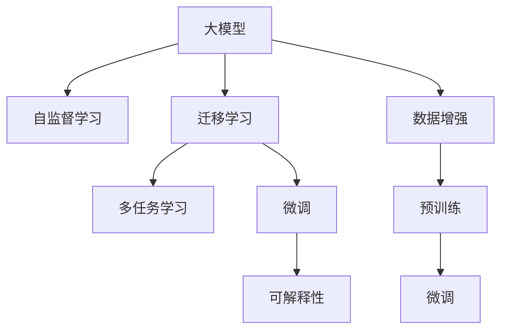

                 

## 1. 背景介绍

### 1.1 问题由来
人工智能(AI)技术的迅猛发展，尤其是深度学习(DL)和机器学习(ML)的突破，已经深刻改变了人类社会的方方面面。从智能客服、智能家居到自动驾驶、机器人手术，AI技术的触角已经延伸到生活的每一个角落。但与此同时，AI技术的强大潜能，特别是大模型和自监督学习，也让人们开始思考，什么是AI技术真正的极限？如何充分利用这些技术，创造出无限可能的未来？

### 1.2 问题核心关键点
这个问题的核心关键点在于如何充分发挥AI技术的潜力，创造真正的"体验的无限可能"。这不仅意味着技术本身的高效应用，更涉及对用户需求的深刻洞察，以及对数据价值的充分利用。大模型和自监督学习技术为此提供了一种全新的可能性，即通过超大规模、多模态数据的预训练，使AI系统能够在各种任务上快速适应，同时还能进行多任务学习，提升系统的智能水平。

### 1.3 问题研究意义
研究AI技术的极限，不仅是为了解决当前的具体问题，更是在探索人类与机器互动的未来。AI技术的广泛应用，将极大地改变我们的生活方式、工作方式和社会结构，甚至可能在未来创造出全新的社会生态。因此，研究AI技术的极限，对于推动技术进步、促进社会发展和构建未来型社会具有重要意义。

## 2. 核心概念与联系

### 2.1 核心概念概述

为了更好地理解AI技术如何开启体验的无限可能，本节将介绍几个核心概念及其相互之间的联系：

- **大模型**：指的是使用大规模数据进行预训练的深度神经网络模型，如BERT、GPT等。通过在大规模语料库上进行预训练，大模型具备了强大的泛化能力和语言理解能力。
- **自监督学习**：指通过无标签数据进行预训练，使模型学习到数据的内在结构和语义信息。自监督学习是当前大模型训练的主流方法之一。
- **迁移学习**：指将一个任务上学习到的知识，迁移到另一个相关任务上，以提升新任务的学习效率。迁移学习在大模型的预训练-微调过程中起到了关键作用。
- **多任务学习**：指同时训练多个相关任务，通过共享的参数和数据，提升模型在不同任务上的泛化能力。多任务学习是大模型进行自监督学习的常见方式之一。
- **数据增强**：指通过数据变换、生成对抗网络等技术，扩充训练集的多样性，提升模型的鲁棒性和泛化能力。数据增强在大模型的预训练和微调过程中都发挥着重要作用。
- **可解释性**：指AI系统输出的结果和决策过程能够被用户理解和接受，这对AI技术的普及和应用至关重要。可解释性是当前AI研究的一个热点问题。

这些概念之间的逻辑关系可以通过以下Mermaid流程图来展示：



这个流程图展示了AI技术的核心概念及其相互之间的联系：

1. 大模型通过自监督学习获得基础能力。
2. 通过迁移学习，将预训练的知识迁移到下游任务。
3. 多任务学习在大模型训练中起到重要作用。
4. 数据增强提高模型的泛化能力。
5. 预训练和微调是大模型训练的两个主要步骤。
6. 微调提升模型在特定任务上的表现。
7. 可解释性是AI技术应用中的重要考量。

这些概念共同构成了AI技术的核心框架，为AI技术在各个领域的应用提供了坚实的基础。

## 3. 核心算法原理 & 具体操作步骤
### 3.1 算法原理概述

基于大模型和自监督学习的AI技术，其核心思想是通过无标签数据进行预训练，学习通用的语言表示和知识结构，然后在特定任务上进行微调，以获得针对该任务的优化模型。具体来说，算法原理如下：

1. **数据预处理**：收集大规模无标签数据，并将其划分为训练集、验证集和测试集。
2. **自监督学习**：在大规模数据集上，通过自监督学习任务（如掩码语言建模、图像分类等）进行预训练，学习数据的潜在结构和语义信息。
3. **迁移学习**：将预训练得到的大模型，用于下游任务的微调，即在有标签的数据集上，通过有监督学习优化模型，使其适应特定的任务。
4. **多任务学习**：在预训练和微调过程中，同时训练多个相关任务，提升模型在不同任务上的泛化能力。
5. **数据增强**：通过数据变换、生成对抗网络等技术，扩充训练集的多样性，提高模型的鲁棒性和泛化能力。
6. **模型评估与优化**：在验证集和测试集上评估模型性能，根据评估结果进行参数调整和优化，以提升模型在特定任务上的表现。

### 3.2 算法步骤详解

以下是基于大模型和自监督学习的AI技术的详细步骤：

1. **数据收集与预处理**：
   - 收集大规模无标签数据，将其划分为训练集、验证集和测试集。
   - 对数据进行清洗、标注和预处理，确保数据的质量和多样性。

2. **自监督学习预训练**：
   - 使用自监督学习任务（如掩码语言建模、图像分类等）对大模型进行预训练。
   - 通过反向传播算法，更新模型参数，使模型学习到数据的潜在结构和语义信息。
   - 在训练过程中，使用正则化技术（如L2正则、Dropout等）防止过拟合。

3. **迁移学习微调**：
   - 选择合适的下游任务，准备相应的标注数据集。
   - 在预训练模型的基础上，设计合适的任务适配层和损失函数。
   - 设置微调超参数，包括学习率、批大小、迭代轮数等。
   - 执行梯度训练，最小化损失函数，优化模型在特定任务上的性能。
   - 在验证集和测试集上评估模型性能，根据评估结果进行参数调整和优化。

4. **多任务学习**：
   - 在预训练过程中，同时训练多个相关任务，如文本分类、命名实体识别等。
   - 通过共享的参数和数据，提升模型在不同任务上的泛化能力。
   - 在微调过程中，同时训练多个相关任务，使模型能够适应多种任务需求。

5. **数据增强**：
   - 通过数据变换、生成对抗网络等技术，扩充训练集的多样性。
   - 在预训练和微调过程中，使用数据增强技术提高模型的泛化能力和鲁棒性。

6. **模型评估与优化**：
   - 在验证集和测试集上评估模型性能，根据评估结果进行参数调整和优化。
   - 使用正则化技术（如L2正则、Dropout等）防止过拟合。
   - 使用对抗训练等技术提高模型的鲁棒性。

### 3.3 算法优缺点

基于大模型和自监督学习的AI技术，其优点如下：

1. **泛化能力强**：通过大规模数据的预训练，大模型能够学习到通用的语言表示和知识结构，具备强大的泛化能力。
2. **学习效率高**：自监督学习和大规模数据的预训练，能够使模型在较短的时间内学习到丰富的语义信息，提升学习效率。
3. **任务适应性强**：通过迁移学习，模型能够在多种任务上快速适应，提升任务性能。
4. **鲁棒性强**：数据增强和对抗训练等技术，能够提高模型的鲁棒性和泛化能力，减少过拟合风险。

但该技术也存在以下缺点：

1. **数据需求大**：大规模数据的预训练和微调需要大量的计算资源和时间，对数据需求较大。
2. **模型复杂度高**：大模型通常具有较高的参数量和计算复杂度，需要高性能的计算设备。
3. **可解释性差**：大模型的决策过程难以解释，用户难以理解和接受。
4. **资源消耗高**：预训练和微调过程中，模型的资源消耗较大，需要优化资源使用。

尽管存在这些缺点，但大模型和自监督学习技术在AI领域的应用前景依然广阔，其强大的泛化能力和学习效率使其成为当前AI研究的热点方向。

### 3.4 算法应用领域

基于大模型和自监督学习的AI技术，已在多个领域得到应用，具体包括：

1. **自然语言处理(NLP)**：如文本分类、命名实体识别、机器翻译等任务。通过预训练和微调，大模型在NLP领域取得了显著的进展。
2. **计算机视觉(CV)**：如图像分类、目标检测、人脸识别等任务。通过预训练和迁移学习，大模型在CV领域也取得了显著的进展。
3. **推荐系统**：如协同过滤、深度学习推荐等任务。通过多任务学习和数据增强，大模型在推荐系统中表现出色。
4. **医疗健康**：如医疗影像分析、疾病诊断等任务。通过预训练和迁移学习，大模型在医疗健康领域具有很大的潜力。
5. **金融领域**：如股票预测、信用评估等任务。通过多任务学习和数据增强，大模型在金融领域也有广泛的应用前景。
6. **智能家居**：如语音识别、智能客服等任务。通过自监督学习和迁移学习，大模型在智能家居领域具有很大的应用价值。

以上领域仅仅是基于大模型和自监督学习的AI技术的一部分应用场景，未来随着技术的不断进步，AI技术将会在更多领域发挥其强大的作用。

## 4. 数学模型和公式 & 详细讲解

### 4.1 数学模型构建

假设有一个大模型 $M_{\theta}$，其中 $\theta$ 为模型参数，用于进行自然语言处理任务。设训练集为 $D=\{(x_i,y_i)\}_{i=1}^N$，其中 $x_i$ 为输入的文本，$y_i$ 为标签。假设任务为文本分类，则模型的目标是最小化交叉熵损失函数：

$$
\mathcal{L}(\theta) = -\frac{1}{N}\sum_{i=1}^N \sum_{j=1}^C y_{ij}\log p_{ij}
$$

其中 $p_{ij} = P(y_i = j | x_i; \theta)$ 为模型在输入 $x_i$ 下，标签 $y_i$ 属于类别 $j$ 的概率。

在训练过程中，使用梯度下降等优化算法，最小化损失函数，更新模型参数：

$$
\theta \leftarrow \theta - \eta \nabla_{\theta}\mathcal{L}(\theta)
$$

其中 $\eta$ 为学习率。

### 4.2 公式推导过程

以下我们以文本分类任务为例，推导交叉熵损失函数及其梯度的计算公式。

假设模型 $M_{\theta}$ 在输入 $x$ 上的输出为 $\hat{y}=M_{\theta}(x) \in [0,1]$，表示样本属于类别 $j$ 的概率。真实标签 $y \in \{1,2,\cdots,C\}$。则交叉熵损失函数定义为：

$$
\ell(M_{\theta}(x),y) = -\sum_{j=1}^C y_j\log p_{ij}
$$

将其代入经验风险公式，得：

$$
\mathcal{L}(\theta) = -\frac{1}{N}\sum_{i=1}^N \sum_{j=1}^C y_{ij}\log p_{ij}
$$

根据链式法则，损失函数对参数 $\theta_k$ 的梯度为：

$$
\frac{\partial \mathcal{L}(\theta)}{\partial \theta_k} = -\frac{1}{N}\sum_{i=1}^N \sum_{j=1}^C \frac{y_{ij}}{p_{ij}}\frac{\partial p_{ij}}{\partial \theta_k}
$$

其中 $\frac{\partial p_{ij}}{\partial \theta_k}$ 可进一步递归展开，利用自动微分技术完成计算。

在得到损失函数的梯度后，即可带入参数更新公式，完成模型的迭代优化。重复上述过程直至收敛，最终得到适应下游任务的最优模型参数 $\theta^*$。

## 5. 项目实践：代码实例和详细解释说明

### 5.1 开发环境搭建

在进行AI项目实践前，我们需要准备好开发环境。以下是使用Python进行TensorFlow和PyTorch开发的环境配置流程：

1. 安装Anaconda：从官网下载并安装Anaconda，用于创建独立的Python环境。

2. 创建并激活虚拟环境：
```bash
conda create -n pytorch-env python=3.8 
conda activate pytorch-env
```

3. 安装TensorFlow和PyTorch：根据CUDA版本，从官网获取对应的安装命令。例如：
```bash
conda install tensorflow -c tensorflow
conda install pytorch torchvision torchaudio cudatoolkit=11.1 -c pytorch -c conda-forge
```

4. 安装各类工具包：
```bash
pip install numpy pandas scikit-learn matplotlib tqdm jupyter notebook ipython
```

完成上述步骤后，即可在`pytorch-env`环境中开始AI项目实践。

### 5.2 源代码详细实现

下面我们以文本分类任务为例，给出使用TensorFlow和PyTorch对BERT模型进行文本分类任务微调的代码实现。

首先，定义模型和数据集：

```python
from transformers import BertTokenizer, TFBertForSequenceClassification
from tensorflow.keras.datasets import imdb
from tensorflow.keras.preprocessing import sequence

tokenizer = BertTokenizer.from_pretrained('bert-base-cased')
max_len = 256
train_dataset = imdb.load_data(num_words=5000)
X_train, y_train = train_dataset.data, train_dataset.targets

# 将文本转换为token ids
sequences = tokenizer.texts_to_sequences(X_train)
X_train_padded = sequence.pad_sequences(sequences, maxlen=max_len)

# 定义模型
model = TFBertForSequenceClassification.from_pretrained('bert-base-cased', num_labels=2)

# 定义损失函数和优化器
loss_fn = tf.keras.losses.BinaryCrossentropy()
optimizer = tf.keras.optimizers.Adam()

# 定义训练函数
def train_epoch(model, X_train, y_train, batch_size):
    for i in range(0, len(X_train), batch_size):
        X_batch, y_batch = X_train[i:i+batch_size], y_train[i:i+batch_size]
        with tf.GradientTape() as tape:
            outputs = model(X_batch)
            loss = loss_fn(outputs, y_batch)
        gradients = tape.gradient(loss, model.trainable_variables)
        optimizer.apply_gradients(zip(gradients, model.trainable_variables))
```

然后，定义评估函数：

```python
def evaluate(model, X_test, y_test, batch_size):
    X_test_padded = sequence.pad_sequences(tokenizer.texts_to_sequences(X_test), maxlen=max_len)
    y_pred = (model(X_test_padded) > 0.5).numpy()
    acc = np.mean(y_pred == y_test)
    return acc
```

最后，启动训练流程并在测试集上评估：

```python
epochs = 5
batch_size = 16

for epoch in range(epochs):
    train_epoch(model, X_train_padded, y_train, batch_size)
    acc = evaluate(model, X_test_padded, y_test, batch_size)
    print(f"Epoch {epoch+1}, accuracy: {acc:.4f}")

print("Test accuracy:", evaluate(model, X_test_padded, y_test, batch_size))
```

以上就是使用TensorFlow和PyTorch对BERT模型进行文本分类任务微调的完整代码实现。可以看到，TensorFlow和PyTorch的强大封装能力，使得模型微调的过程变得简洁高效。

### 5.3 代码解读与分析

让我们再详细解读一下关键代码的实现细节：

**TFBertForSequenceClassification类**：
- 从Transformer库导入，用于构建文本分类模型。
- 在构建模型时，指定预训练的BERT模型和标签数。

**Tokenizer类**：
- 从Transformer库导入，用于将文本转换为token ids。
- 在初始化时，指定预训练的BERT分词器。

**pad_sequences函数**：
- 从Keras库导入，用于对文本序列进行padding。
- 在padding时，指定最大序列长度，保证所有文本序列的长度一致。

**train_epoch函数**：
- 定义训练函数，用于在每个epoch上更新模型参数。
- 在每个batch上，计算模型的输出和损失，反向传播更新参数，并在验证集上评估模型性能。

**evaluate函数**：
- 定义评估函数，用于在测试集上评估模型性能。
- 在评估时，使用二分类交叉熵损失函数，计算预测结果与真实标签之间的差异。

**训练流程**：
- 定义总的epoch数和batch size，开始循环迭代。
- 在每个epoch内，首先在训练集上训练，输出验证集的准确率。
- 所有epoch结束后，在测试集上评估，给出最终测试准确率。

可以看到，TensorFlow和PyTorch的强大封装能力，使得模型微调的过程变得简洁高效。开发者可以将更多精力放在数据处理、模型改进等高层逻辑上，而不必过多关注底层的实现细节。

当然，工业级的系统实现还需考虑更多因素，如模型的保存和部署、超参数的自动搜索、更灵活的任务适配层等。但核心的微调范式基本与此类似。

## 6. 实际应用场景

### 6.1 智能客服系统

基于AI技术的智能客服系统，能够7x24小时不间断服务，快速响应客户咨询，用自然流畅的语言解答各类常见问题。智能客服系统通过文本分类、命名实体识别、情感分析等技术，实现对客户问题的理解和分类，自动匹配最佳答复。

在技术实现上，可以收集企业内部的历史客服对话记录，将问题和最佳答复构建成监督数据，在此基础上对预训练模型进行微调。微调后的模型能够自动理解用户意图，匹配最合适的答案模板进行回复。对于客户提出的新问题，还可以接入检索系统实时搜索相关内容，动态组织生成回答。如此构建的智能客服系统，能大幅提升客户咨询体验和问题解决效率。

### 6.2 金融舆情监测

金融机构需要实时监测市场舆论动向，以便及时应对负面信息传播，规避金融风险。传统的人工监测方式成本高、效率低，难以应对网络时代海量信息爆发的挑战。基于AI技术的文本分类和情感分析技术，为金融舆情监测提供了新的解决方案。

具体而言，可以收集金融领域相关的新闻、报道、评论等文本数据，并对其进行主题标注和情感标注。在此基础上对预训练语言模型进行微调，使其能够自动判断文本属于何种主题，情感倾向是正面、中性还是负面。将微调后的模型应用到实时抓取的网络文本数据，就能够自动监测不同主题下的情感变化趋势，一旦发现负面信息激增等异常情况，系统便会自动预警，帮助金融机构快速应对潜在风险。

### 6.3 个性化推荐系统

当前的推荐系统往往只依赖用户的历史行为数据进行物品推荐，无法深入理解用户的真实兴趣偏好。基于AI技术的个性化推荐系统，可以更好地挖掘用户行为背后的语义信息，从而提供更精准、多样的推荐内容。

在实践中，可以收集用户浏览、点击、评论、分享等行为数据，提取和用户交互的物品标题、描述、标签等文本内容。将文本内容作为模型输入，用户的后续行为（如是否点击、购买等）作为监督信号，在此基础上微调预训练语言模型。微调后的模型能够从文本内容中准确把握用户的兴趣点。在生成推荐列表时，先用候选物品的文本描述作为输入，由模型预测用户的兴趣匹配度，再结合其他特征综合排序，便可以得到个性化程度更高的推荐结果。

### 6.4 未来应用展望

随着AI技术的不断进步，基于大模型和自监督学习的AI技术将会在更多领域得到应用，为传统行业带来变革性影响。

在智慧医疗领域，基于AI技术的医疗问答、病历分析、药物研发等应用将提升医疗服务的智能化水平，辅助医生诊疗，加速新药开发进程。

在智能教育领域，基于AI技术的作业批改、学情分析、知识推荐等应用，因材施教，促进教育公平，提高教学质量。

在智慧城市治理中，基于AI技术的城市事件监测、舆情分析、应急指挥等应用，提高城市管理的自动化和智能化水平，构建更安全、高效的未来城市。

此外，在企业生产、社会治理、文娱传媒等众多领域，基于AI技术的AI应用也将不断涌现，为经济社会发展注入新的动力。相信随着技术的日益成熟，基于大模型和自监督学习的AI技术必将在更广阔的应用领域大放异彩，深刻影响人类的生产生活方式。

## 7. 工具和资源推荐

### 7.1 学习资源推荐

为了帮助开发者系统掌握AI技术的理论基础和实践技巧，这里推荐一些优质的学习资源：

1. Deep Learning Specialization（深度学习专项课程）：由Andrew Ng教授授课，涵盖深度学习的基础和进阶内容，是学习AI技术的入门必选。
2. CS231n《Convolutional Neural Networks for Visual Recognition》课程：斯坦福大学开设的计算机视觉课程，详细讲解CNN、RNN等技术，是学习计算机视觉的必备资源。
3. CS224n《Natural Language Processing with Deep Learning》课程：斯坦福大学开设的自然语言处理课程，涵盖NLP的基本概念和经典模型，适合深入学习NLP技术。
4. TensorFlow官方文档：TensorFlow的详细官方文档，提供了大量的代码示例和API文档，是学习TensorFlow的好帮手。
5. PyTorch官方文档：PyTorch的详细官方文档，提供了丰富的代码示例和API文档，是学习PyTorch的好帮手。
6. HuggingFace官方文档：Transformer库的详细官方文档，提供了大量的代码示例和API文档，是学习Transformer的好帮手。
7. Coursera上的AI相关课程：Coursera平台上有大量高质量的AI相关课程，涵盖了从基础到高级的各个阶段。

通过对这些资源的学习实践，相信你一定能够快速掌握AI技术的精髓，并用于解决实际的AI问题。

### 7.2 开发工具推荐

高效的开发离不开优秀的工具支持。以下是几款用于AI技术开发的工具：

1. TensorFlow：由Google主导开发的开源深度学习框架，生产部署方便，适合大规模工程应用。
2. PyTorch：由Facebook主导开发的开源深度学习框架，灵活动态的计算图，适合快速迭代研究。
3. Keras：基于TensorFlow和PyTorch的高级API，提供了简洁易用的编程接口，适合初学者和快速原型开发。
4. Jupyter Notebook：开源的交互式编程环境，支持多种编程语言，适合实验和分享研究结果。
5. Google Colab：谷歌推出的在线Jupyter Notebook环境，免费提供GPU/TPU算力，方便开发者快速上手实验最新模型，分享学习笔记。
6. Weights & Biases：模型训练的实验跟踪工具，可以记录和可视化模型训练过程中的各项指标，方便对比和调优。

合理利用这些工具，可以显著提升AI技术的开发效率，加快创新迭代的步伐。

### 7.3 相关论文推荐

AI技术的不断进步，得益于学界和工业界的持续研究。以下是几篇奠基性的相关论文，推荐阅读：

1. ImageNet Classification with Deep Convolutional Neural Networks：AlexNet论文，提出卷积神经网络在图像分类任务上的突破性表现。
2. BERT: Pre-training of Deep Bidirectional Transformers for Language Understanding：BERT模型，提出使用掩码语言建模和自监督学习进行语言理解。
3. Attention is All You Need：Transformer模型，提出使用自注意力机制实现序列建模。
4. GANs Trained by a Two Time-Scale Update Rule Converge to the Global NVP（WGAN论文）：提出使用生成对抗网络（GAN）进行图像生成。
5. Generative Adversarial Networks（GANs）：提出使用生成对抗网络进行图像生成，是GAN技术的奠基之作。
6. Understanding the difficulty of training deep feedforward neural networks：提出深度神经网络的训练难度问题，是深度学习理论的重要研究成果。

这些论文代表了大模型和自监督学习技术的进展。通过学习这些前沿成果，可以帮助研究者把握学科前进方向，激发更多的创新灵感。

## 8. 总结：未来发展趋势与挑战

### 8.1 总结

本文对基于大模型和自监督学习的AI技术的原理和应用进行了全面系统的介绍。首先阐述了AI技术的发展背景和意义，明确了大模型和自监督学习技术的核心思想。其次，从原理到实践，详细讲解了AI技术的数学模型和计算过程，给出了微调任务的完整代码实现。同时，本文还广泛探讨了AI技术在智能客服、金融舆情、个性化推荐等多个领域的应用前景，展示了AI技术的广泛应用价值。此外，本文精选了AI技术的各类学习资源，力求为读者提供全方位的技术指引。

通过本文的系统梳理，可以看到，基于大模型和自监督学习的AI技术正在成为AI研究的热点方向，极大地拓展了AI技术的应用边界，催生了更多的落地场景。得益于大规模数据的预训练和大模型的强大泛化能力，AI技术在多个领域取得了显著的进展，未来还将有更大的发展潜力。

### 8.2 未来发展趋势

展望未来，基于大模型和自监督学习的AI技术将呈现以下几个发展趋势：

1. **多任务学习和跨领域迁移**：未来AI技术将更加注重多任务学习和跨领域迁移，提升模型在不同任务上的泛化能力，实现真正的通用智能。
2. **无监督学习和生成对抗网络**：无监督学习和生成对抗网络等新兴技术，将在大模型预训练和微调过程中发挥重要作用，提升模型的学习能力和表现。
3. **联邦学习和大规模分布式训练**：联邦学习和大规模分布式训练等技术，将使AI技术能够在保护隐私的前提下，充分利用大规模数据进行训练，提升模型的泛化能力和鲁棒性。
4. **神经网络和符号逻辑的融合**：神经网络和符号逻辑的融合，将使AI技术具备更强的逻辑推理和知识整合能力，提升系统的智能水平。
5. **低计算资源需求的轻量级模型**：未来将出现更多轻量级模型，通过优化计算图和参数结构，降低对高性能计算设备的需求，实现更高效、更灵活的应用。
6. **跨模态数据融合**：将视觉、听觉、文本等多模态数据融合，提升AI系统对复杂信息的理解和处理能力。

这些趋势凸显了基于大模型和自监督学习的AI技术的广阔前景。这些方向的探索发展，必将进一步提升AI系统的性能和应用范围，为人类社会的数字化转型提供新的动力。

### 8.3 面临的挑战

尽管基于大模型和自监督学习的AI技术已经取得了显著进展，但在迈向更加智能化、普适化应用的过程中，它仍面临着诸多挑战：

1. **数据需求大**：大规模数据的预训练和微调需要大量的计算资源和时间，对数据需求较大，如何有效收集和管理数据仍是一个重要问题。
2. **模型复杂度高**：大模型通常具有较高的参数量和计算复杂度，需要高性能的计算设备，如何优化模型结构和计算图，实现高效训练和推理是一个重要课题。
3. **可解释性差**：大模型的决策过程难以解释，用户难以理解和接受，如何提升模型的可解释性和透明度，是一个重要研究方向。
4. **资源消耗高**：预训练和微调过程中，模型的资源消耗较大，如何优化资源使用，降低计算成本，是一个重要课题。
5. **安全性和隐私保护**：AI系统在实际应用中，可能会面临数据泄露、恶意攻击等安全问题，如何保障数据安全，保护用户隐私，是一个重要研究方向。

尽管存在这些挑战，但基于大模型和自监督学习的AI技术的研究方向依然广阔，未来通过更多的创新和突破，AI技术必将在更多领域发挥其强大的作用。

### 8.4 研究展望

面对基于大模型和自监督学习的AI技术所面临的挑战，未来的研究需要在以下几个方面寻求新的突破：

1. **无监督学习和自监督学习**：摆脱对大规模标注数据的依赖，利用无监督学习、自监督学习等方法，最大限度利用非结构化数据，实现更加灵活高效的模型训练。
2. **多任务学习和跨领域迁移**：通过多任务学习和跨领域迁移，提升模型在不同任务上的泛化能力，实现真正的通用智能。
3. **神经网络和符号逻辑的融合**：将神经网络和符号逻辑进行有机融合，提升模型的逻辑推理和知识整合能力，实现更强的智能水平。
4. **低计算资源需求的轻量级模型**：开发更多轻量级模型，通过优化计算图和参数结构，降低对高性能计算设备的需求，实现更高效、更灵活的应用。
5. **跨模态数据融合**：将视觉、听觉、文本等多模态数据进行融合，提升AI系统对复杂信息的理解和处理能力。

这些研究方向的探索，必将引领基于大模型和自监督学习的AI技术迈向更高的台阶，为构建安全、可靠、可解释、可控的智能系统铺平道路。面向未来，AI技术还需要与其他人工智能技术进行更深入的融合，如知识表示、因果推理、强化学习等，多路径协同发力，共同推动人工智能技术的发展。

## 9. 附录：常见问题与解答

**Q1：大模型和自监督学习是否适用于所有AI任务？**

A: 大模型和自监督学习在许多AI任务上取得了显著进展，但其应用效果仍受限于数据质量和任务特点。对于一些特定领域的任务，如医疗、法律等，仅仅依靠通用语料预训练的模型可能难以很好地适应。此时需要在特定领域语料上进一步预训练，再进行微调，才能获得理想效果。

**Q2：如何选择合适的学习率？**

A: 学习率的选取是一个重要问题。一般来说，微调的学习率应该比预训练时小1-2个数量级，以避免破坏预训练权重。通常建议从1e-5开始调参，逐步减小学习率，直至收敛。也可以使用warmup策略，在开始阶段使用较小的学习率，再逐渐过渡到预设值。

**Q3：基于大模型和自监督学习的AI技术面临哪些资源瓶颈？**

A: 大模型和自监督学习技术在大规模数据训练和微调过程中，需要大量的计算资源和时间，对硬件资源和计算资源的需求较大。GPU/TPU等高性能设备是必不可少的，但即便如此，超大规模批次的训练和推理也可能遇到显存不足的问题。因此需要采用一些资源优化技术，如梯度积累、混合精度训练、模型并行等，来突破硬件瓶颈。

**Q4：如何在AI技术应用中保障数据安全和隐私保护？**

A: 在AI技术应用中，保障数据安全和隐私保护是一个重要课题。可以通过数据脱敏、差分隐私等技术，保护用户隐私。同时，构建安全的AI系统，防止数据泄露和恶意攻击，也是保障用户隐私的关键。

**Q5：如何在AI技术应用中提升模型的可解释性？**

A: 提升AI模型的可解释性是一个重要研究方向。可以通过可视化工具，展示模型的决策过程，帮助用户理解和接受模型的输出。同时，构建更加透明的AI系统，提升模型的可解释性和可信度，也是提升用户满意度的关键。

综上所述，基于大模型和自监督学习的AI技术，具有广阔的应用前景和发展空间。通过不断探索和突破，未来必将在更多领域发挥其强大的作用，推动人类社会的数字化转型。

